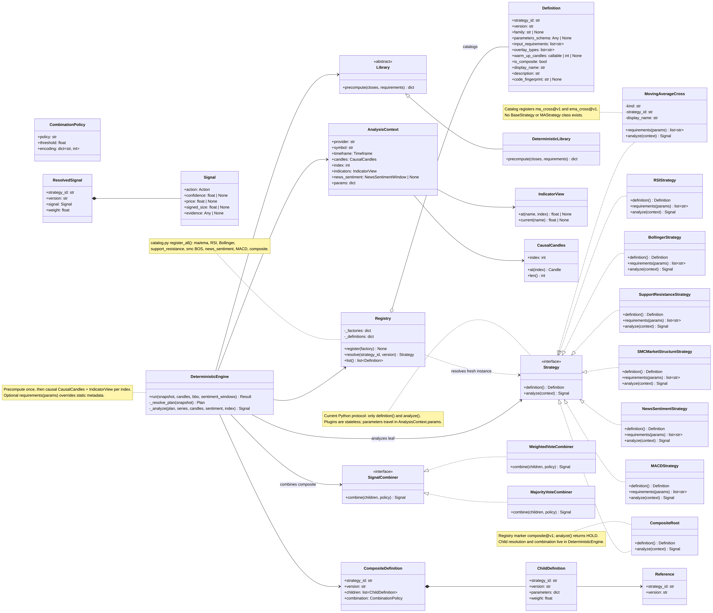
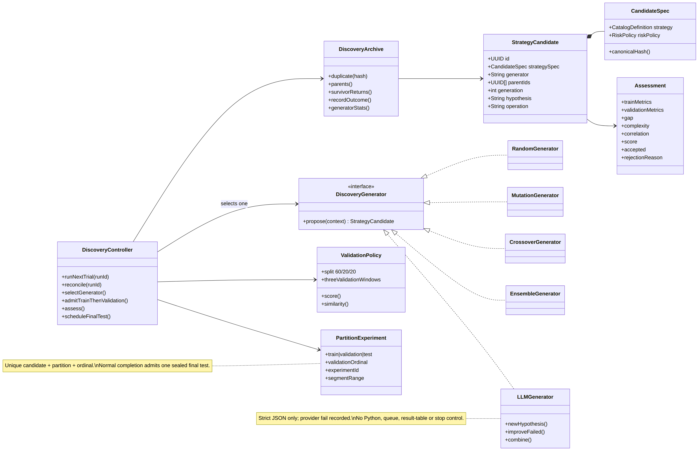
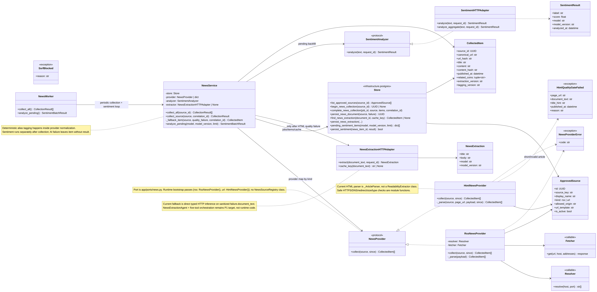
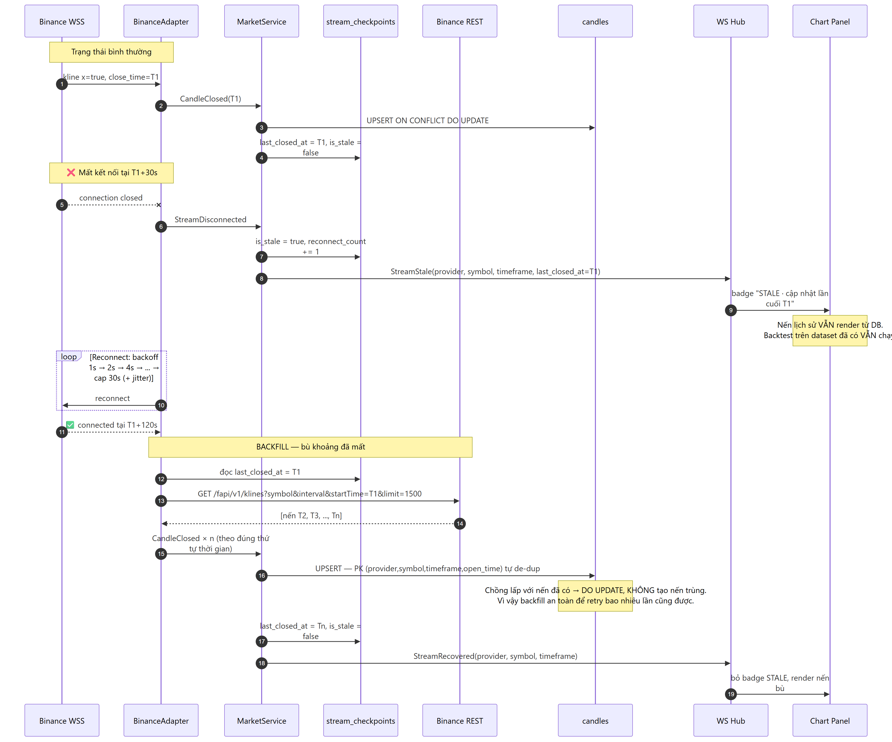
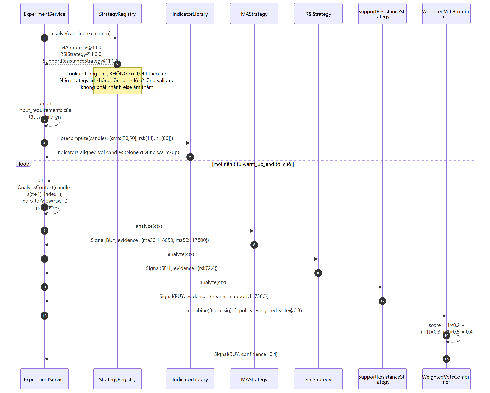
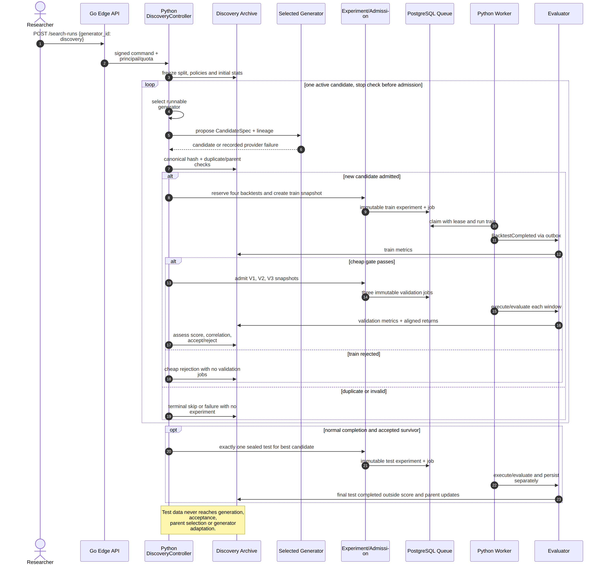
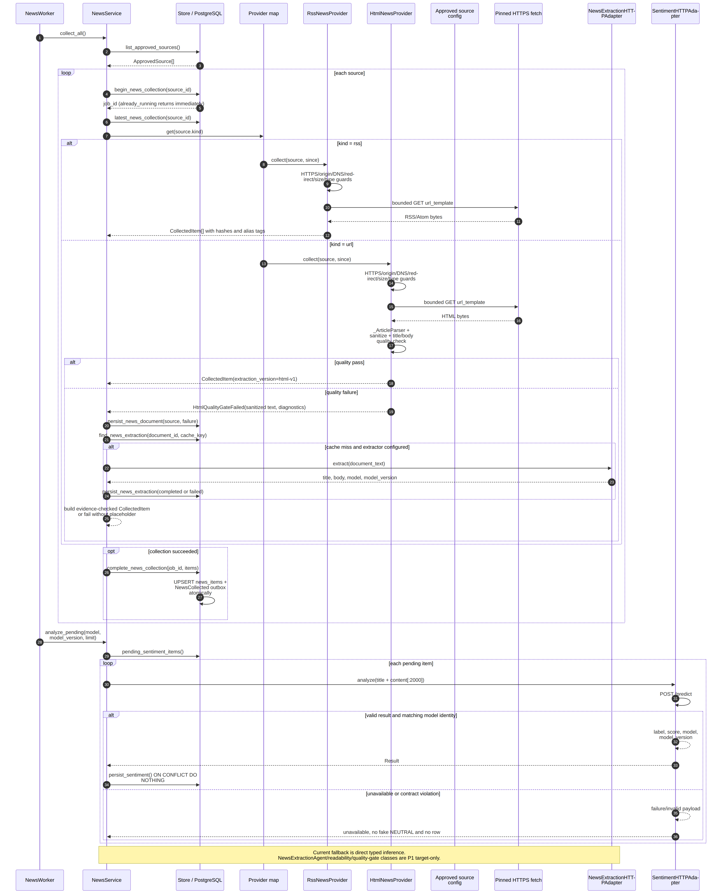

<!-- _class: lead -->
# CRYPTO STRATEGY LAB (CryptoBot)
## Báo Cáo Thiết Kế Kiến Trúc Phần Mềm (Software Architecture)
**Đề tài:** Nền tảng Research, Auto-Discovery & Đánh giá Trading Strategy Tự động

---

## 1. Miền Nghiệp Vụ & Bối Cảnh (Business Domain)

### Binance USDT-M Futures & Algo-Trading
* **Perpetual Futures Market (USDT-M):**
  * Giao dịch leverage 2 chiều **Long / Short** 24/7/365.
  * Order execution theo **BBO (Best Bid / Best Offer)** realtime.
* **Đặc tính Tài chính Khắt khe:**
  * **Funding Rate:** Cân bằng giá Index & Mark Price mỗi 8h.
  * **Trading Fee & Slippage:** Phí Maker/Taker (0.02% / 0.05%), Slippage khi thị trường biến động mạnh.
  * **Rủi ro Liquidation:** Quản trị Margin, Stop-Loss & Take-Profit nghiêm ngặt.

### Đối Tượng Sử Dụng & Nhu Cầu Cốt Lõi
* **Quant Researcher / Algorithmic Trader:**
  * Cần môi trường ingest candle low-latency (<200ms) đa timeframe (1m, 5m, 1h, 1d).
  * Backtest strategy chính xác, đo lường Sharpe Ratio, Max Drawdown, Profit Factor, Win Rate.
* **Autonomous AI Agents (LLM Multi-Agent):**
  * Tự động crawl financial news, scoring sentiment.
  * Tự generate strategy code, debug và scan hyperparameter space.

---

## 2. Bài Toán Thực Tế & Thách Thức (Problem Statement)

### Thách Thức Về Market Data & Order Execution
* **Realtime Data Jitter & Packet Drop:**
  * WebSocket bị drop/jitter làm mất candle → Sai lệch entry/exit signals.
  * *Yêu cầu:* Auto-detect candle gap & bù dữ liệu tự động (Gap Backfill).
* **Bẫy "Lookahead Bias" & Parity Mismatch:**
  * Backtest giả lập phi thực tế (nhìn trước tương lai, bỏ qua slippage/phí) → Khi chạy Live bị lỗ.
  * *Yêu cầu:* Deterministic Replay Engine simulate sát sao slippage, BBO limit fill và trading fees.

### Thách Thức Về Scalability & Architecture
* **Combinatorial Explosion (Bùng nổ không gian tìm kiếm):**
  * Quét hàng ngàn parameter combinations / technical indicators gây block UI nếu chạy sync.
  * *Yêu cầu:* Async Outbox Job Queue & Worker Pool.
* **Tightly Coupled & Vendor Lock-in:**
  * Source code bị trói chặt vào một sàn/thư viện duy nhất, khó scale/add strategy.
  * *Yêu cầu:* Strategy Plugin Architecture & AST Sandbox an toàn.

---

## 3. Bối cảnh & 4 Nhóm Architectural Drivers

### Architectural Drivers (ASRs)
* **Realtime Market Ingestion:** Dữ liệu biến động mili-giây, stream liên tục và tự bù candle gap (Gap Backfill).
* **High Modifiability:** Thêm/bớt single strategy và composite strategy (Handcrafted / LLM Agent) không sửa Core.
* **Massive Search Scalability:** Auto-discovery hàng ngàn parameters (Loop Discovery) non-blocking UI.
* **Unstructured News Intelligence:** Crawl multi-source news, self-healing khi DOM thay đổi và scoring sentiment.

### Quyết định Kiến trúc Tương ứng
* **Driver 1 → Dual-Channel Ingestion & Gap Repair:** Tách biệt stream WSS realtime và Historical REST Backfill, data parity.
* **Driver 2 → Strategy Plugin Architecture & AST Sandbox:** Chuẩn hóa IStrategy contract, dynamic plugin loading.
* **Driver 3 → Event-Driven Job Queue & Leased Worker:** Phân tán workload Backtest qua PostgreSQL Outbox & Worker pool.
* **Driver 4 → Multi-Agent & LLM Fallback:** Auto-detect cấu trúc HTML, LLM fallback parsing và scoring sentiment.

---

## 4. Hệ Thống Quality Attributes (ASRs Taxonomy)

| Thuộc tính (QA) | Trọng tâm Thiết kế | Tactic / Kỹ thuật Kiến trúc Áp dụng |
| :--- | :--- | :--- |
| **Modifiability** | Thêm mới Strategy, Search Algorithm, Market Provider không sửa Core | Strategy Plugin Architecture, Open-Closed Principle, Dynamic Registry |
| **Scalability** | Xử lý workload >100,000 backtests và stream candle realtime | Scale-out Python Worker pool, PostgreSQL Leased Job Queue, In-memory Broadcaster |
| **Realtime / Perf** | Latency cập nhật candle < 200ms, high throughput Backtest | Go Edge Gateway, WebSocket Streaming, Deterministic Replay Engine |
| **Reliability** | Fault isolation (lỗi crawl/search không crash API); auto-reconnect sàn | Failure Isolation, Transactional Outbox, Lease Takeover |
| **Observability** | Monitor Worker health, tiến độ Search Loop & telemetry metrics | Structured Logging, State Machine tracking, Run Metrics |
| **Reproducibility** | Kết quả Backtest và Leaderboard đảm bảo tính Deterministic & Immutable | Immutable Dataset snapshots, Run Config Hash, Seed Lock |

---

## 5. Kịch Bản ASR Chi Tiết (Modifiability & Scalability)

### ASR-1: Modifiability (Thêm Strategy mới)
* **Source:** Quant Researcher / AI Agent.
* **Stimulus:** Thêm strategy class mới (`MACDStrategy`).
* **Artifact:** Strategy Subsystem & UI Registry.
* **Environment:** Hệ thống đang chạy (Runtime).
* **Response:** Auto-discovery, load metadata lên UI không cần compile lại Go Gateway hay sửa Core.
* **Measure:** Thao tác trên 1 file Python độc lập, 0 downtime.

### ASR-2: Scalability (High Backtest Workload)
* **Source:** User trigger Auto Search Loop.
* **Stimulus:** 10,000 backtest jobs vào Job Queue đồng thời.
* **Artifact:** Job Queue & Python Worker Pool.
* **Environment:** Peak workload (tải cao điểm).
* **Response:** Phân phối jobs qua Lease Heartbeat, worker scale-out, zero OOM / memory leak.
* **Measure:** Completion rate 100%, 0 dropped job, stable CPU.

---

## 6. Kịch Bản ASR Chi Tiết (Realtime & Reliability)

### ASR-3: Realtime & Data Parity
* **Source:** Binance Exchange (WSS drop / network jitter).
* **Stimulus:** Mất kết nối mạng trong 30 giây.
* **Artifact:** Go Market Gateway & Postgres Candle Storage.
* **Environment:** Production Trading Hours.
* **Response:** Auto-reconnect, trigger REST Backfill bù missing candles, deduplicate bằng Open Time.
* **Measure:** Continuous candle stream, 0 duplicate, catch-up latency < 2s.

### ASR-4: Fault Tolerance (Worker Crash)
* **Source:** Python Worker process bị kill đột ngột (OOM).
* **Stimulus:** Job đang xử lý dở dang (RUNNING).
* **Artifact:** Job Queue & Outbox Manager.
* **Environment:** Heavy computation workload.
* **Response:** Lease Heartbeat timeout (30s), Worker khác auto-takeover và retry job.
* **Measure:** Job hoàn thành thành công, 0 stuck / orphaned job.

---

## 7. Tổng Quan Use Case Hệ Thống

### Actors & Chức Năng Chính
* **Quant Researcher / Trader:**
  * Xem realtime candlestick chart đa timeframe (1m, 5m, 1h, 1d).
  * Thử nghiệm single strategy và composite strategy.
  * Chạy Backtest, phân tích equity curve, max drawdown, win rate.
  * Nhập natural language prompt hoặc URL để AI generate & self-repair strategy code.
* **Autonomous AI Agent:**
  * Crawl financial news, extract text & scoring sentiment.
  * Tự động trigger Auto Search Loop (Loop Discovery).
* **System Worker:**
  * Ingest candle định kỳ, process async Backtest Job Queue.

---

## 8. C4 Model (Level 1) - System Context Diagram

### System Boundaries & External Systems
* **CryptoBot Core Platform:** Platform trung tâm cho market data ingestion, strategy research và portfolio ranking.
* **External Systems:**
  * **Binance Exchange:** Historical candle data (REST) và BBO price stream (WebSocket).
  * **News Sources / RSS Feeds:** Cung cấp thông tin thị trường crypto đa nguồn.
  * **LLM Providers (OpenAI / Groq):** LLM reasoning, sentiment analysis & strategy self-repair.

---

## 9. C4 Model (Level 2) - Container Diagram

### Container Architecture (C4 Level 2)
* **Next.js Dashboard:** Render-only UI: chart, authoring, search, backtest, trade detail & news.
* **Go Edge & Market Gateway:** Public REST/WSS, auth/quota, Candle/BBO normalization & realtime fan-out.
* **Python Research API:** Strategy/Agent runtime, experiment/search, news/sentiment orchestration & queries.
* **Python Research Worker × N:** Leased backtest/agent jobs; immutable Candle+BBO; execution; facts/outbox.
* **PostgreSQL:** Source of truth: market, strategies, jobs/results, news/sentiment & outbox.
* **Object Storage / Broker (optional):** Raw HTML by hash; replaceable queue/stream adapter.

---

## 10. C4 Model (Level 3) - Python Research Platform

### Component Breakdown: Python Research Platform
* **Application services:** `Research API`, `Experiment/Search/Ranking`, `News/Sentiment` & `AgentOrchestrator`.
* **Domain runtime:** `StrategyRegistry + StrategyRuntime`; `Backtest Engine + Execution Simulator`; news rules; agent state/artifacts.
* **Python-owned ports:** `MarketDataPort`, `ModelGatewayPort`, `Artifact/Sandbox/Approval` & `Repository/Job/Outbox` ports.
* **Infrastructure adapters:** Go Market adapter, internal AI/LLM adapter, isolated Sandbox Runner, SafeFetcher/Readability & PostgreSQL repositories.

---

## 11. C4 Model (Level 3) - Go Edge & Market Gateway

### Component Breakdown: Go Edge & Market Gateway
* **REST API + Auth and Ownership Guard:** Request validation/DTO mapping, JWT, RBAC & quota.
* **Public WebSocket Hub:** Subscription fan-out theo panel key.
* **MarketProviderRegistry + BinanceAdapter:** Resolve provider, REST history & WSS kline/BBO.
* **MarketNormalizer + MarketService:** Validate symbol/timeframe/decimal/timestamp/sequence; checkpoint, de-dup, persistence, reconnect & backfill.
* **Python Research Client + Internal Event Ingress:** Signed commands, queries và progress/result events.

---

## 12. Component Boundaries: 6 Module Cốt Lõi (Anti-God Service)

### 6 Bounded Contexts (High Cohesion)
1. **Market Realtime (Go Edge):** WSS candles/BBO, gap backfill.
2. **Strategy Engine (Python):** Single/composite runtime.
3. **Backtest (Python Worker):** Candle+BBO replay, execution facts.
4. **Discovery (Python):** Search Loop, validation, stop conditions.
5. **News Crawler (Python):** RSS/HTML, SSRF guard, quality gate.
6. **News Intelligence (Python + AI adapter):** Extraction & async sentiment.
* **Loose Coupling:** Giao tiếp qua versioned DTOs & Outbox events.

### Trách Nhiệm Công Nghệ (Go vs Python)

| Tiêu chí | Go Edge & Market Gateway | Python Strategy Platform |
| :--- | :--- | :--- |
| **Ownership** | Market Ingestion, API Edge & Fan-out | Strategy, Backtest, Discovery, News/Agents/Ranking |
| **Strengths** | Goroutines, Low RAM, high concurrency | Quantitative math, AST, AI/ML |
| **Protocols** | Public REST/WSS, signed events | Internal HTTP, DTOs, Job/Outbox |
| **Isolation** | Network drops không crash Worker | Crash strategy không sập API |

---

## 13. Đặc Tả Ranh Giới & Phạm Vi 6 Module (Component Specs)

### 1. Market Realtime & 2. Strategy Engine
* **Market Realtime:**
  * **Input/Output:** Raw Binance WSS → Normalized `Candle` & `BBO`; persist vào Postgres, broadcast `CandleClosed` event qua SSE/WebSocket.
  * **Invariant:** Continuous time-series, zero-duplicate candle.
* **Strategy Engine:**
  * **Pluggable:** Single strategy (Handcrafted/AI) qua `IStrategy`.
  * **Scope:** Strategy Registry, indicators và single/composite runtime.
  * **Invariant:** 100% execution parity giữa Live Trading và Backtest.

### 3. Backtest & 4. Discovery
* **Backtest Subsystem (Event-Driven):**
  * Replay immutable Candle+BBO với cùng `StrategyRuntime`, simulate execution và emit trade/evaluation facts qua Worker/Outbox.
* **Discovery Subsystem:**
  * Generate candidates, orchestrate Search Loop và backtest jobs qua Train/Validation/Sealed Test; enforce lineage và stop conditions.

### 5. News Crawler & 6. News Intelligence
* **News Crawler Subsystem:**
  * Fetch news từ `ApprovedSource` (RSS/HTML), SSRF protection, Quality Gate validation.
* **News Intelligence Subsystem:**
  * Orchestrate LLM/Agent extraction khi DOM thay đổi và scoring sentiment [-1.0, 1.0] async (non-blocking crawl).

---

## 14. UML Class Diagram: Strategy Plugin Model

### Strategy Plugin Architecture (IStrategy Contract)
* **Contract `IStrategy` Protocol:** Method `evaluate(context) -> Signal` (`BUY`, `SELL`, `HOLD`).
* **5 Single Strategies (v1 IDs):** `ma_crossover`, `bollinger_bands`, `rsi_threshold`, `smc_structure`, `news_sentiment`.
* **Composite Strategy:** Combine 2-5 child strategies theo `CombinationPolicy` (`majority` hoặc `weighted`).
* **Strategy Registry:** Dynamic loading file Python mới; loại bỏ God Service, loose coupling.

---

## 15. UML Class Diagram: Search Algorithm & Discovery Loop

### Search Algorithms & 3-Split Dataset Partitioning
* **Contract `ISearchAlgorithm`:** Method `sample(space, rng)` implement qua `RandomSearch`, `GeneticAlgorithm`, `BayesianOptimization`.
* **Discovery Loop chống Overfitting (Data Leakage):**
  * **Train (30d):** Search & optimize strategy variants.
  * **Validation (15d):** Generalization evaluation (Gate check).
  * **Sealed Test (15d):** Out-of-sample benchmark cho Leaderboard.
* **Job Throttling & Fair Scheduling:** `DiscoveryTrialReservation` (reserved_jobs=4).

---

## 16. UML Class Diagram: Resilient News Crawler Model

### Resilient News Crawler & Sentiment Architecture
* **Contract `NewsProvider` Protocol:** Implemented by `RssNewsProvider` và `HtmlNewsProvider` (`ApprovedSource`).
* **SSRF Guard & Quality Gate Pipeline:**
  * `Resolver` & `Fetcher` validate DNS, private IP blocking, safe redirect.
  * `HtmlQualityGateFailed`: Trigger `NewsExtractionHTTPAdapter` (LLM fallback) khi DOM thay đổi.
* **Decoupled Sentiment Scoring:** Async batch scoring, AI errors không block crawl pipeline.

---

## 17. High-Level Architecture: Modular Monolith

### Global Architecture & Technology Stack
* **Frontend (Next.js):** React SPA, Event Streaming (SSE/WS) cho realtime chart & telemetry.
* **API Gateway (Go Edge):** CQRS, RBAC, Rate Limiting, Binance WSS Ingestion & Broadcaster.
* **Backend Research (Python):** Strategy Plugin Architecture, Event-Driven Job Queue, Backtest Worker Pool.
* **Database:** PostgreSQL (ACID Outbox, Candles, Experiments, News) & In-memory Ring Buffers (Go API Edge).
* **Agent & External:** Strategy AI Agent, Crawling Agent, Binance API, OpenAI/Groq.

---

## 18. Các Design & Architectural Patterns Trọng Yếu

### Core Architectural & Design Patterns
* **CQRS (Go API):**
  * Tách biệt Command (tạo experiment) và Query (đọc candles, leaderboard), optimize latency.
* **Dual-Channel Market Engine with Parity:**
  * Schema & execution parity cho cả luồng Realtime (WSS) và Historical Backfill (REST).
* **Transactional Outbox Pattern:**
  * Atomic consistency khi tạo Experiment và dispatch Job, eliminate dual-write risk.
* **Plugin Architecture:**
  * Decouple hoàn toàn Core Engine khỏi strategy logic và search algorithms (Open-Closed Principle).

---

## 19. Nền Tảng Multi-Agent & Vòng Lặp AI Tự Chủ

### Multi-Agent System & Self-Repair Loop
* **Strategy Designer Agent:** Nhận natural language prompt / URL → generate Draft spec (JSON).
* **Implementation Agent:** Transform JSON Draft thành Python code tuân thủ `IStrategy` protocol.
* **Self-Repair Loop (AST + Sandbox):**
  * Static AST syntax validation & isolated dry-run trong Sandbox.
  * Feed runtime traceback về LLM để auto self-repair code (tối đa 3 retry cycles).
* **Candidate Discovery & Crawling Agent:**
  * Automated hyperparameter sampling & multi-source news crawling.

---

## 20. Runtime Flow: Realtime Ingestion & Gap Backfill

### Realtime Ingestion & Gap Backfill Flow
1. **Chart Initialization:** Fetch 1,000 historical candles từ Postgres/Binance REST đa timeframe (1m, 5m, 1h, 1d).
2. **WSS Stream Ingestion:** Ingest ticker & update provisional candle theo realtime ticks.
3. **Candle Close Event:** Persist candle vào Postgres và broadcast event `CandleClosed` qua SSE/WebSocket broadcaster.
4. **Gap Backfill:** Khi WSS connection drop, auto-reconnect và trigger REST API backfill bù missing candles, đảm bảo continuous time-series.

---

## 21. Runtime Flow: Strategy Execution & Dynamic Registration

### Strategy Execution (Handcrafted / AI) & Dynamic Add Flow
* **Run Strategy Flow:**
  * Load `Datafeed` & `Sentiment Window` vào `StrategyContext`.
  * `IStrategy.evaluate()` emit trading signal `BUY` / `SELL` / `HOLD`.
  * `CompositeStrategy` aggregate signals theo majority hoặc weighted policy.
* **Add Strategy Flow (Handcrafted & AI-Generated):**
  * Handcrafted: Drop Python file vào Strategy Registry → auto-discovery & dynamic load.
  * AI-Generated: LLM Agent generate strategy code → AST validator & Sandbox verification.
* **Runtime Parity:** 100% deterministic parity giữa Live Trading và Backtest execution.

---

## 22. Runtime Flow: Async Backtest Pipeline

### Async Experiment & Discovery Execution Pipeline
1. **Create Experiment:** Persist experiment metadata và job event vào Outbox trong cùng một ACID transaction.
2. **Worker Lease Acquire:** Worker claim job qua Optimistic Lock (FOR UPDATE SKIP LOCKED) và duy trì heartbeat.
3. **Multi-Split Execution:** Run backtest trên `Train` (30d) → `Validation` (15d) → `Sealed Test` (15d).
4. **Compute Metrics & Leaderboard:** Calculate Sharpe Ratio, Max Drawdown, Profit Factor; persist Trade logs và update Top-K Leaderboard.

---

## 23. Runtime Flow: Resilient News Crawl & LLM Fallback Pipeline

### Self-Healing News Crawl & Sentiment Pipeline
1. **SSRF Validation:** Whitelist check qua `ApprovedSource`, resolve DNS và block internal/private IPs.
2. **Standard Ingestion:** Fetch & extract article content qua RSS/HTML Parser (Readability).
3. **Quality Gate Check:** Nếu DOM structure thay đổi hoặc text extraction rỗng → trigger fallback.
4. **LLM Fallback Extraction:** Dispatch raw HTML sang LLM Agent để parse structured content.
5. **Async Sentiment Scoring:** Background worker scoring sentiment [-1.0, 1.0] và persist vào PostgreSQL.

---

## 24. Security Architecture: Defense-in-Depth

### Multi-Layer Security Architecture (Defense-in-Depth)
* **Authentication & RBAC:** JWT authentication, role-based access control, tenant/user experiment isolation.
* **Crawler SSRF Prevention:** Block private IP ranges (`127.0.0.1`, `10.0.0.0/8`, cloud metadata), domain whitelisting qua `ApprovedSource`.
* **AST Sandbox & Safe Execution:** AST static analysis trên AI-generated code; ban dangerous builtins/modules (`eval`, `subprocess`, `socket`, `os.system`).
* **Tool Invocation Boundary:** Schema-validated DTOs, strict input boundaries cho AI Agents.

---

## 25. Scalability Architecture & Benchmark

### Scale-Out Strategy & 100,000 Backtests Benchmark
* **Stateless Horizontal Scale-Out:**
  * Spin up N Python Worker instances độc lập dựa trên CPU load / queue backlog.
  * Distribute jobs qua PostgreSQL B-Tree indexed Leased Job Queue.
* **Load Testing & Benchmarking (k6 / Locust):**
  * Simulate 10,000 concurrent users dispatch Backtest jobs và query candle data.
  * Queue throughput đạt > 1,500 backtests/phút trên 4 workers.
  * Candle & Leaderboard API latency duy trì ≤ 120ms (p95).

---

## 26. Fault Tolerance & Self-Healing Architecture

### Resilient Recovery & Chaos Simulation
* **Worker Lease Takeover & Heartbeat:**
  * Worker gửi heartbeat 10s/lần. Nếu worker crash, lease timeout sau 30s, worker khác auto-takeover job.
* **Idempotency & Retry:**
  * Unique `idempotency_key` constraint, eliminate duplicate execution risk.
* **Failure Isolation & Reconnect:**
  * Plugin failure isolation (lỗi 1 strategy không crash Worker); WSS auto-reconnect & backfill.
* **Chaos Engineering Simulation:** Kill worker process / inject network drops để verify self-healing behavior.

---

## 27. Deployment Topology & MLOps Infrastructure

### Containerized Deployment (Docker Compose) & K8s Readiness
* **Full-Stack Containerization:**
  * Isolated container services: Next.js Web Dashboard, Go Edge Gateway, Python Research API, Python Research Worker × N, Internal AI Inference Adapter, PostgreSQL.
* **Health Checks & Liveness Probes:**
  * `/healthz` và `/readyz` endpoints cho container auto-restart & traffic routing.
* **MLOps & Configuration:**
  * Versioned system prompts và LLM API keys tách biệt qua environment variables (`.env`).
* **Kubernetes-Ready Architecture:** Hỗ trợ Deployment Replicas, Rolling Updates, Horizontal Pod Autoscaling (HPA) khi scale production.

---

## 28. Architectural Tradeoffs Matrix

| Lựa Chọn Thiết Kế | Phương Án Được Chọn | Phương Án Thay Thế | Lý Do & Đánh Đổi Kiến Trúc (Rationale) |
| :--- | :--- | :--- | :--- |
| **System Architecture** | **Modular Monolith** | Microservices | **Chọn:** Giảm overhead vận hành mạng/distributed latency; enforce module boundaries qua contracts. |
| **Candle & Job Storage** | **PostgreSQL + B-Tree** | ClickHouse / InfluxDB | **Chọn:** Giữ tính ACID cho Experiments & Outbox; B-Tree indexing đủ đáp ứng hàng triệu candles. |
| **Job Queue & Event Ingress** | **PostgreSQL Outbox & Leases** | Apache Kafka / RabbitMQ / Redis | **Chọn:** Loại bỏ dual-write, ACID transactional guarantees, zero additional infrastructure dependencies. |
| **AI Code Execution** | **AST Analyzer + Sandbox** | Docker-in-Docker | **Chọn:** Low latency initialization (<10ms), static syntax safety check, minimal container resource overhead. |
| **Sentiment Analysis Pipeline** | **Hybrid: Rule + LLM Batch** | Pure LLM Realtime | **Chọn:** Optimize token cost & API rate limits; non-blocking crawl pipeline, deep LLM scoring theo batch. |

---

## 29. Replaceability & Extensibility Architecture

### Pluggable Providers & Extensible Algorithms
* **Pluggable Market Data Providers:**
  * `MarketProviderAdapter` interface cho phép switch từ Binance sang OKX, Bybit, Coinbase mà **không thay đổi** Core Frontend hay Strategy Engine.
* **Extensible Search Algorithms:**
  * Sẵn sàng plug-in Reinforcement Learning (PPO) hoặc Custom Optimizers qua interface `ISearchAlgorithm`.
* **Extensible News Ingestion:**
  * Dễ dàng add new sources (CryptoPanic, CoinDesk API) qua config `ApprovedSource`.

---

## 30. Architectural Summary & Project Conclusion

### Architectural Highlights & Key Takeaways
* **ASR-Driven Architecture:** Bám sát 4 Architectural Drivers & Quality Attributes taxonomy.
* **Clean Boundaries & Anti-God Service:** Phân rã 6 bounded contexts, zero tight-coupling.
* **Multi-Agent & Automation:** Self-repair loop (AST + Sandbox) & anti-overfitting data partitioning (Train/Val/Test).
* **High Scalability & Self-Healing:** Scale-out 100,000 backtests, Lease Takeover & Idempotent execution.

### Q & A
* *Cảm ơn Thầy và các bạn đã lắng nghe!*

### Architecture Artifacts & Verification
* **39 Blueprint Diagrams & Specs:** C4 Model (L1-L3), UML Class, State Machines, Sequence Flows, Deployment Topology.
* **5 Interactive Working Dashboards:**
  1. Realtime Market Chart & Indicators
  2. Strategy Authoring & Plugin Registry
  3. Async Backtest & Trade Visualization
  4. Search Loop & Top-K Leaderboard
  5. News Crawler & Sentiment Intelligence
* **Automated Test Scenarios & Benchmark Suite.**

