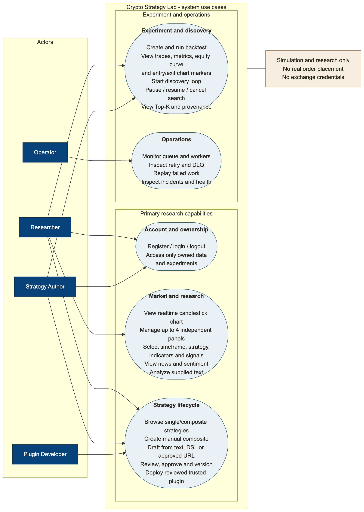
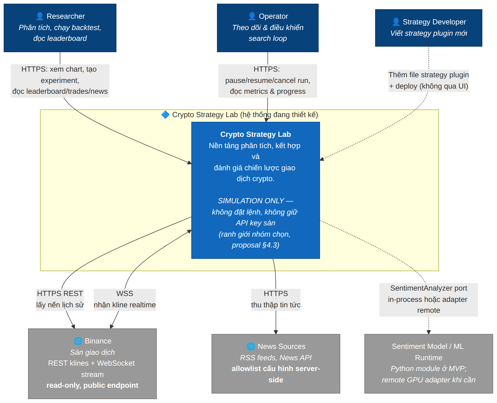
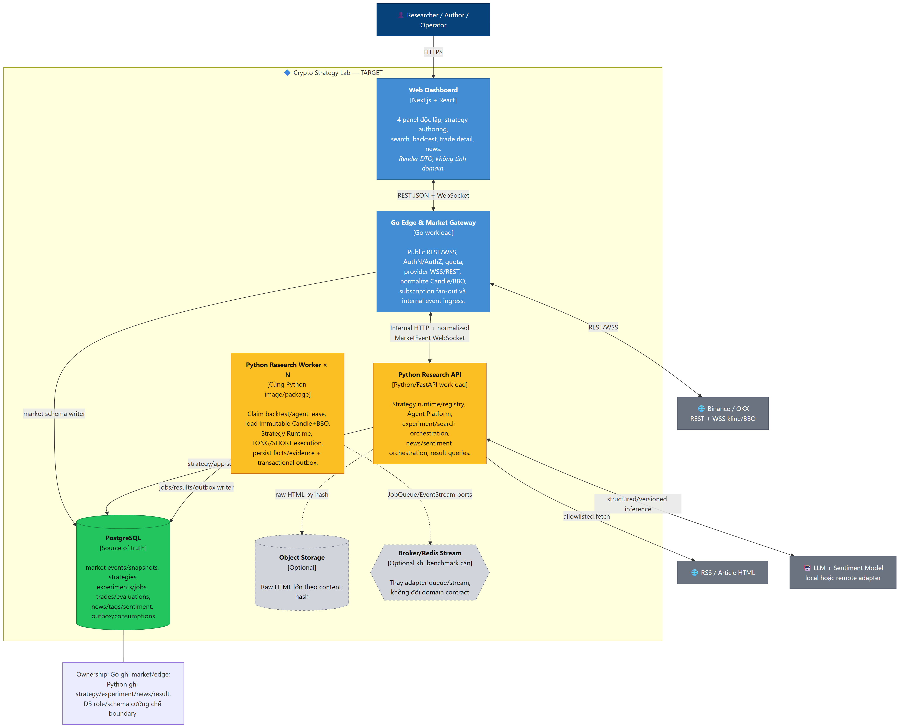
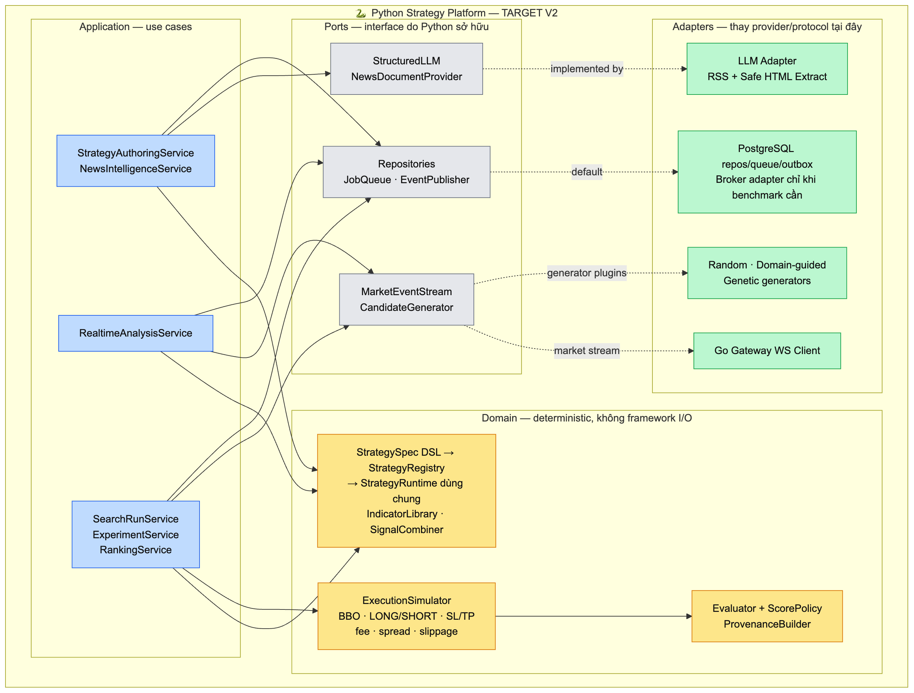
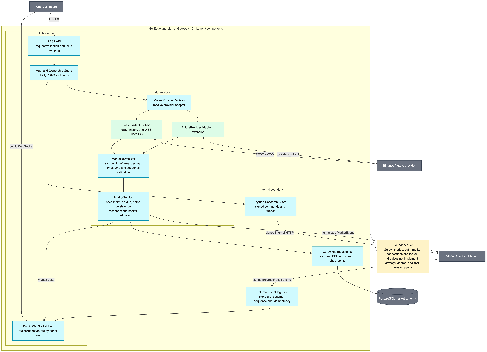

## 5. Tổng Quan Use Case Hệ Thống

### Tác tử (Actors) & Nhóm Chức năng
* **Quant Researcher / Trader:**
  * Xem biểu đồ nến realtime đa khung thời gian (1m, 5m, 1h, 1d).
  * Thử nghiệm chiến lược đơn và composite.
  * Chạy Backtest, xem equity curve, drawdown.
  * Nhập prompt tự nhiên để sinh & sửa mã chiến lược.
* **Autonomous AI Agent:**
  * Crawl tin tức, trích xuất text & chấm điểm sentiment.
  * Tự động chạy vòng lặp tìm kiếm (Loop Discovery).
* **System Worker:**
  * Nạp nến định kỳ, xử lý hàng đợi Backtest ngầm.

---

## 6. C4 Model (Level 1) - System Context Diagram

### Ranh Giới & Hệ Thống Bên Ngoài
* **CryptoBot Core Platform:** Hệ thống trung tâm thu nạp nến, nghiên cứu chiến lược và chấm điểm danh mục.
* **External Systems:**
  * **Binance Exchange:** Dữ liệu nến lịch sử (REST) và giá biến động trực tiếp (WebSocket).
  * **News Sources / RSS Feeds:** Cung cấp thông tin thị trường crypto đa nguồn.
  * **LLM Providers (OpenAI / Groq):** Suy luận ngôn ngữ, phân tích sentiment & tự sửa mã (Self-repair).

---

## 7. C4 Model (Level 2) - Container Diagram

### Phân Rã Các Container Chính
* **Next.js Web App (SPA):** Giao diện tương tác, biểu đồ nến realtime, cấu hình chiến lược & xem Leaderboard.
* **Go Edge Gateway:** Xác thực RBAC, định tuyến CQRS, duy trì WebSocket Binance và stream nến qua SSE/WS.
* **Python Research Engine:** Xử lý tính toán nặng (Backtest Worker, Loop Discovery, Metric Evaluation).
* **PostgreSQL (Storage):** Lưu trữ nến, chiến lược, thí nghiệm và Outbox table.
* **Redis (Cache & Bus):** In-memory Pub/Sub và caching realtime indicators.

---

## 8. C4 Model (Level 3) - Python Research Platform

### Cấu Trúc Nội Bộ Python Platform
* **Strategy Registry:** Quản lý lifecycle và metadata của các plugin chiến lược.
* **Deterministic Backtest Engine:** Mô phỏng khớp lệnh chính xác (BBO, Slippage, Fee).
* **Search & Loop Manager:** Điều phối thuật toán tìm kiếm (Random, Genetic, Bayesian, LLM).
* **Worker Lease Manager:** Phân phối công việc không khóa (Optimistic Lock) và tự phục hồi.
* **AST Sandbox:** Kiểm tra an toàn cú pháp mã nguồn do AI tạo ra trước khi thực thi.

---

## 9. C4 Model (Level 3) - Go Edge & Market Gateway

### Cấu Trúc Nội Bộ Go Gateway
* **Binance Adapter:** Duy trì kết nối WSS liên tục, tự động reconnect và gọi REST Backfill khi rớt mạng.
* **Candle Aggregator & BBO Streamer:** Tổng hợp nến tạm thời (provisional candle) và đóng nến vào CSDL.
* **CQRS Request Handler:** Phân tách rõ ràng luồng Command (tạo thí nghiệm) và Query (đọc nến, leaderboard).
* **Security & Auth Middleware:** Kiểm tra JWT token, phân quyền RBAC và giới hạn tần suất gọi API.

