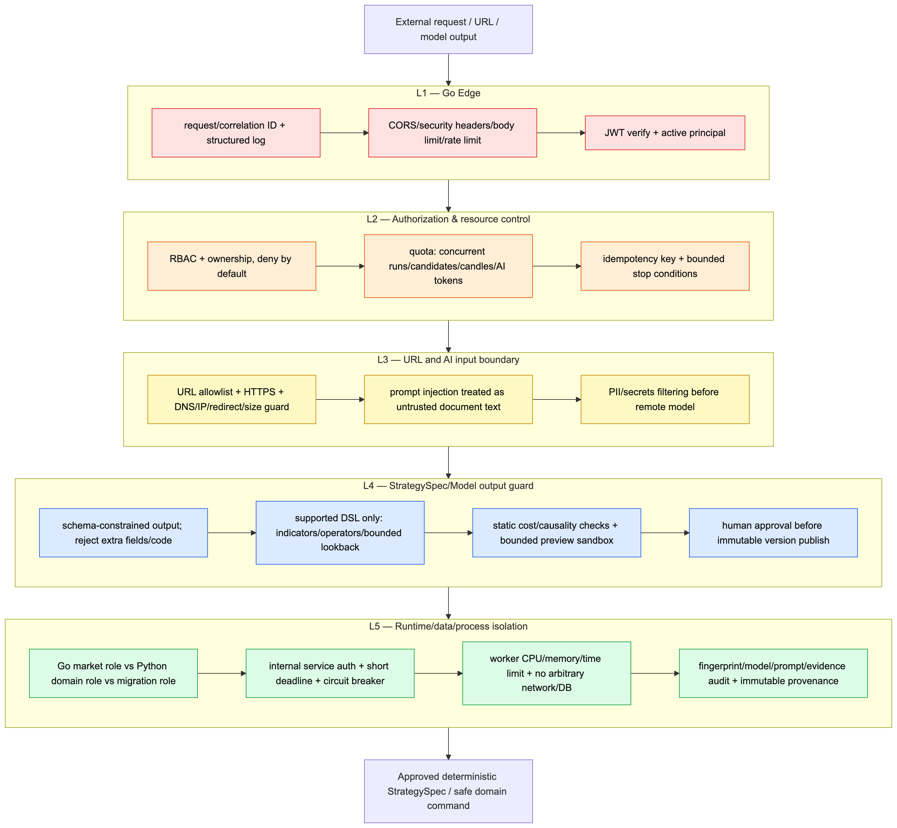
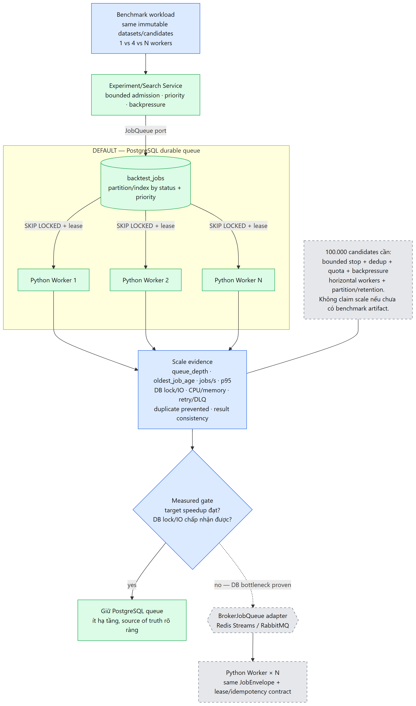
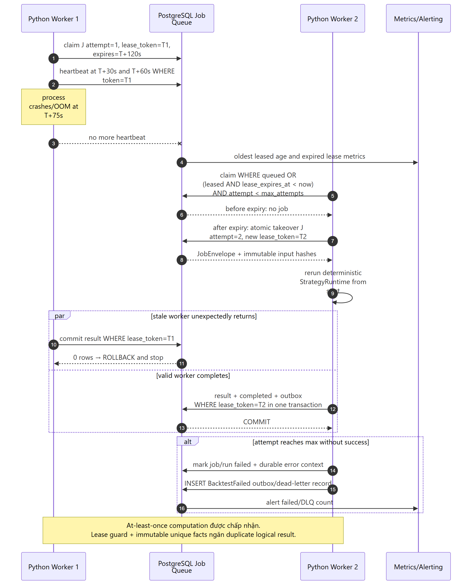
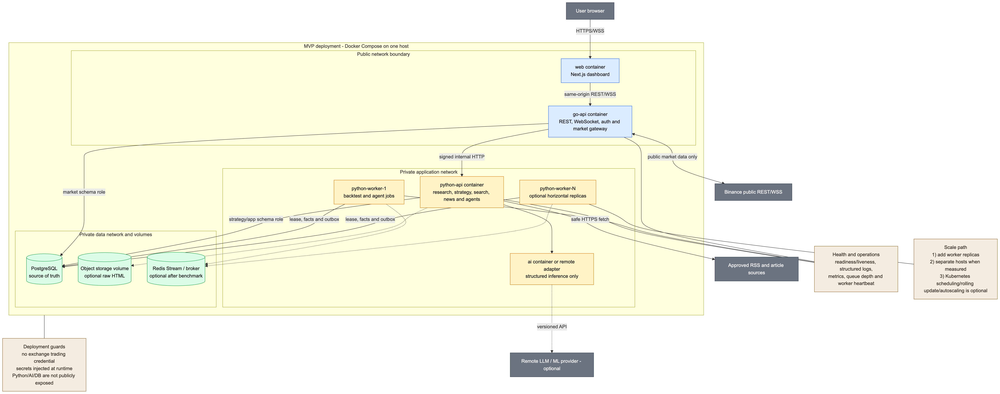

## 24. Security Architecture: Defense-in-Depth

### Multi-Layer Security Architecture (Defense-in-Depth)
* **Authentication & RBAC:** JWT authentication, role-based access control, tenant/user experiment isolation.
* **Crawler SSRF Prevention:** Block private IP ranges (`127.0.0.1`, `10.0.0.0/8`, cloud metadata), domain whitelisting qua `ApprovedSource`.
* **AST Sandbox & Safe Execution:** AST static analysis trên AI-generated code; ban dangerous builtins/modules (`eval`, `subprocess`, `socket`, `os.system`).
* **Tool Invocation Boundary:** Schema-validated DTOs, strict input boundaries cho AI Agents.

---

## 25. Scalability Architecture & Benchmark

### Scale-Out Strategy & 100,000 Backtests Benchmark
* **Stateless Horizontal Scale-Out:**
  * Spin up N Python Worker instances độc lập dựa trên CPU load / queue backlog.
  * Distribute jobs qua PostgreSQL B-Tree indexed Leased Job Queue.
* **Đo thực tế (isolated PostgreSQL benchmark, 2026-09-03):**
  * 100.000 jobs / 4 workers / 50 candles: hoàn tất 100%, không failed/cancelled.
  * Thời gian **1.519,209 giây**, throughput **~3.949 jobs/phút**.
  * Queue-to-persisted-result latency: p50 **746.604 ms**, p95 **~23 phút 58 giây**.
  * Đã ghi **4.700.000 signals** và **15.000.000 equity points**.
  * Phạm vi đo: PostgreSQL queue → Python worker → deterministic engine → persisted facts; không bao gồm Go/API/event evaluation.
* **Các mốc 8 và 16 workers:** chưa đo, không suy diễn từ mốc 4 workers.

---

## 26. Fault Tolerance & Self-Healing Architecture

### Resilient Recovery & Chaos Simulation
* **Worker Lease Takeover & Heartbeat:**
  * Worker gửi heartbeat 10s/lần. Nếu worker crash, lease timeout sau 30s, worker khác auto-takeover job.
* **Idempotency & Retry:**
  * Unique `idempotency_key` constraint, eliminate duplicate execution risk.
* **Failure Isolation & Reconnect:**
  * Plugin failure isolation (lỗi 1 strategy không crash Worker); WSS auto-reconnect & backfill.
* **Chaos Engineering Simulation:** Kill worker process / inject network drops để verify self-healing behavior.

---

## 27. Deployment Topology & MLOps Infrastructure

### Containerized Deployment (Docker Compose) & K8s Readiness
* **Full-Stack Containerization:**
  * Isolated container services: Next.js Web Dashboard, Go Edge Gateway, Python Research API, Python Research Worker × N, Internal AI Inference Adapter, PostgreSQL.
* **Health Checks & Liveness Probes:**
  * `/healthz` và `/readyz` endpoints cho container auto-restart & traffic routing.
* **MLOps & Configuration:**
  * Versioned system prompts và LLM API keys tách biệt qua environment variables (`.env`).
* **Kubernetes-Ready Architecture:** Hỗ trợ Deployment Replicas, Rolling Updates, Horizontal Pod Autoscaling (HPA) khi scale production.

