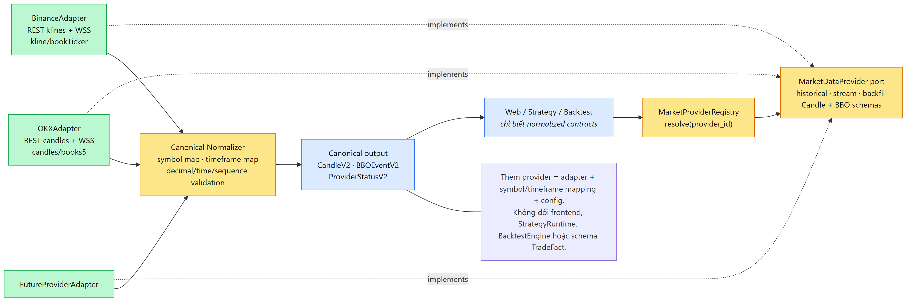

## 28. Ma Trận Đánh Đổi Kiến Trúc (Tradeoffs Matrix)

| Lựa Chọn Thiết Kế | Phương Án Được Chọn | Phương Án Thay Thế | Lý Do & Đánh Đổi Kiến Trúc (Rationale) |
| :--- | :--- | :--- | :--- |
| **Kiến trúc Tổng thể** | **Modular Monolith** | Microservices | **Chọn:** Giảm độ phức tạp vận hành mạng, đảm bảo ranh giới module rõ ràng qua contracts. |
| **Lưu trữ Nến & Job** | **PostgreSQL + B-Tree** | ClickHouse / InfluxDB | **Chọn:** Giữ tính ACID cho Thí nghiệm & Outbox; B-Tree index đủ đáp ứng hàng triệu nến. |
| **Hàng Đợi & Sự Kiện** | **PostgreSQL Outbox & Leases** | Apache Kafka / RabbitMQ / Redis | **Chọn:** Loại bỏ hoàn toàn Dual-write, đảm bảo Outbox nguyên tử ACID mà không cần duy trì thêm message broker ngoài. |
| **Thực Thi Mã AI Sinh** | **AST Analyzer + Sandbox** | Docker-in-Docker | **Chọn:** Khởi tạo sandbox tức thì (<10ms), kiểm soát an toàn cú pháp không tốn tài nguyên. |
| **Phân Tích Sentiment** | **Hybrid: Rule + LLM Batch** | Pure LLM Realtime | **Chọn:** Tiết kiệm chi phí token API, tránh nghẽn luồng crawl; chỉ gọi LLM khi cần phân tích sâu. |

---

## 29. Khả Năng Thay Thế & Mở Rộng (Replaceability)

### Dễ Dàng Thay Thế Provider & Thuật Toán
* **Thay Thế Nguồn Dữ Liệu Thị Trường (Market Provider):**
  * Thiết kế `MarketProviderAdapter` cho phép đổi từ Binance sang OKX, Bybit, Coinbase mà **không thay đổi** Frontend hay Strategy Engine.
* **Mở Rộng Thuật Toán Tìm Kiếm Nâng Cao:**
  * Sẵn sàng tích hợp mô hình Reinforcement Learning (PPO) thông qua giao diện `ISearchAlgorithm`.
* **Mở Rộng Nguồn Thu Thập Tin Tức:**
  * Dễ dàng bổ sung CryptoPanic, CoinDesk API qua cấu hình.

---

## 30. Tổng Kết Đồ Án & Giá Trị Kiến Trúc

### Thành Quả Đạt Được
* **Chuỗi Quyết Định Rõ Ràng:** Bám sát theo ASRs và Quality Attributes.
* **Kiến Trúc Rành Mạch, Chống Coupling:** Phân rã 5 module độc lập, triệt tiêu hoàn toàn God Service.
* **AI Agent & Tự Động Hóa:** Multi-Agent với vòng lặp tự sửa lỗi (Self-repair) và chống Overfitting (Train/Val/Test).
* **Chịu Tải & Phục Hồi Cao:** Kiểm thử 100,000 backtests, cơ chế Lease Takeover và Idempotency.

### Phần Hỏi - Đáp (Q & A)
* *Cảm ơn Thầy và các bạn đã lắng nghe!*

### Minh Chứng Đầy Đủ
* **39 Sơ Đồ Blueprint & Specs:** Đầy đủ C4 (L1-L3), UML Class, State Machine, Deployment Topology.
* **5 Màn Hình Tương Tác Sẵn Sàng:**
  1. Realtime Market Chart & Indicators
  2. Strategy Authoring & Plugin Registry
  3. Async Backtest & Trade Visualization
  4. Search Loop & Top-K Leaderboard
  5. News Crawler & Sentiment Intelligence
* **Kịch Bản Test Tự Động & Benchmark Đầy Đủ.**

