# Crypto Strategy Lab — Technical Design

> Phần 1 / Blueprint • Tài liệu thiết kế kỹ thuật • Phiên bản 1.1

**Mục lục**

| §   | Nội dung                                | Yêu cầu đề bài                     |
| --- | --------------------------------------- | ---------------------------------- |
| 1   | Kiến trúc tổng thể                      | Deliverable 3 — Architecture Doc   |
| 2   | C4 Diagram (Level 1 + Level 2)          | System Context, Container          |
| 3   | High-Level Architecture Diagram         | Component responsibilities         |
| 4   | Thiết kế cơ sở dữ liệu                  | §35, §36 — Database, Version       |
| 5   | Domain contract & Event vocabulary      | §6, §12, §34                       |
| 6   | Mô tả các luồng nghiệp vụ quan trọng    | Data/Realtime/Strategy/Search Flow |
| 7   | Thiết kế kiểm soát truy cập             | Access control                     |
| 8   | Thiết kế các cơ chế bảo vệ hệ thống     | §32.3, §32.4, §32.5, §32.7         |
| 9   | Anti-pattern và cách kiến trúc tránh    | §44                                |
| 10  | Các quyết định kỹ thuật quan trọng (ADR)| Deliverable 4 — ADR                |
| 11  | Trả lời 8 câu hỏi kiến trúc trung tâm   | §40                                |
| 12  | Roadmap và Demo script                  | §45, §46                           |
| 13  | Phụ lục — Cấu trúc thư mục source code  | Deliverable 1, 2                   |

<!-- SECTION-1 -->

---

## 1. Kiến trúc tổng thể

### 1.1 Architectural Style được chọn

Hệ thống **không** có một style duy nhất. Nó là một **polyglot multi-process topology**, trong đó mỗi process có style riêng phù hợp với trách nhiệm của nó:

| Thành phần                | Style của chính nó                                      | Trách nhiệm                                            |
| ------------------------- | ------------------------------------------------------- | ------------------------------------------------------- |
| **Web Dashboard** (Next.js) | **Presentation layer** — client-side rendering + SSR   | Render, không tính toán domain                          |
| **Public API** (Go)       | **Edge service / BFF** (Backend-for-Frontend)            | Public boundary: auth, RBAC, rate limit, validate, WS fan-out |
| **Strategy Lab** (Python) | **Modular Monolith + Hexagonal** (Ports & Adapters)      | Toàn bộ domain: market, strategy, experiment, evaluate, rank, news |
| **Backtest Worker** (Python) | Cùng codebase với Strategy Lab, khác entrypoint       | Consume job queue, chạy `BacktestEngine`                |

Cách gọi đúng: **"Python Strategy Lab là một Modular Monolith / Hexagonal domain core"**, không phải "toàn hệ thống là một modular monolith". Toàn hệ thống là nhiều deployable; chỉ **domain core** mới là modular monolith.

Trên nền topology đó có hai quyết định style áp riêng cho phần domain:

| Lớp quyết định       | Style chọn                                                            | Vấn đề nó giải quyết                                                          |
| -------------------- | --------------------------------------------------------------------- | ----------------------------------------------------------------------------- |
| Lõi strategy         | **Plugin Architecture** (Registry + Strategy Pattern)                 | Thêm strategy = thêm file, không sửa core (§32.1 Modifiability)                |
| Pipeline bất đồng bộ | **Event-driven** + **Job Queue** (bảng PostgreSQL trước, broker sau)  | Tách Generator ↛ Backtester ↛ Evaluator ↛ Ranking; scale bằng worker (§32.5)   |

**Vì sao domain core là Modular Monolith, không phải microservice-per-module**

Đây là chỗ dễ bị hiểu nhầm nhất, nên nói thẳng: hệ thống **có** nhiều process, nhưng ranh giới process **không** trùng ranh giới module domain. Go/Python là ranh giới *kỹ thuật* (edge vs computation), không phải phân rã domain thành service. Sáu module domain — Market Data, Strategy Engine, Experiment, Search, Ranking, News — nằm **cùng một process** Python và giao tiếp qua port in-process, không qua network.

- Đề bài nói rõ: *"Không có cộng điểm chỉ vì sử dụng công nghệ phức tạp. Nhóm phải chứng minh: công nghệ đó giải quyết vấn đề kiến trúc nào?"* (§38). Tách 6 module thành 6 service HTTP chỉ thêm service discovery, distributed tracing, eventual consistency — không giải quyết vấn đề nào trong §32.
- Cả 7 architectural driver của đề bài (§32) đạt được bằng **ranh giới module trong process** + **ports/adapters**, không cần ranh giới network cho từng module.
- Team 3 người: một codebase Python cho domain giúp refactor contract đồng bộ, không phải version 6 API nội bộ.
- Modular hoá đúng cách khiến việc tách sau này là *deployment change*, không phải *rewrite*: mỗi module chỉ nói chuyện qua port, không import repository của module khác.

Chi tiết ranh giới và ownership giữa Go và Python ở **§1.2 Service Boundary & Ownership**; lý do chọn topology này thay vì gộp hoặc chia nhỏ hơn ở **ADR-011** và **ADR-015**.

**Vì sao Plugin Architecture cho strategy, không Factory-with-switch**

Kiến trúc phải chịu được scenario đánh giá của đề bài (§41): giảng viên yêu cầu thêm MACD tại chỗ. Với `if strategy == "MA" ... else if ...` thì phải sửa Controller + Backtester + UI + Database + Combination Engine + Evaluator. Với Registry + decorator `@register_strategy`, thêm MACD là **1 file mới, 0 dòng sửa**. Chi tiết ở §8.1 và ADR-002.

**Vì sao Event-driven cho pipeline, không gọi trực tiếp**

Backtest Worker **không** gọi `LeaderboardService.update()`. Nó publish `StrategyEvaluated`; Ranking Service subscribe. Lý do: (a) giảm coupling để thay từng mắt trong chuỗi Generate→Backtest→Evaluate→Rank độc lập; (b) event log là nền tảng cho observability (§8.4); (c) cùng event contract chạy được qua nhiều cơ chế delivery mà consumer không đổi. Đây là yêu cầu §34 của đề bài.

Nhưng "event-driven" ở đây **không** có nghĩa "in-process dispatcher là đủ cho mọi trường hợp". Vì Worker là process riêng (§1.2), event từ Worker tới Evaluator/Ranking là **cross-process** và phải đi qua **transactional outbox** trên PostgreSQL, không qua dict handler in-memory. Ranh giới chính xác của từng event ở **§5.7**.

**Vì sao Job Queue bằng bảng PostgreSQL, không RabbitMQ/Kafka ngay**

`SELECT ... FOR UPDATE SKIP LOCKED` cho đúng semantics cần thiết (at-least-once, N consumer, không mất job khi worker chết) với **0 service thêm vào stack** và có transaction cùng với việc ghi kết quả. Khi số đo cho thấy PostgreSQL là bottleneck, đổi `JobDispatcher` adapter sang broker mà job contract không đổi. Xem ADR-005 và §8.3.

### 1.2 Service Boundary & Ownership

Đây là section chuẩn: mọi tài liệu khác (README, proposal, specs) dùng đúng định nghĩa dưới đây khi nói về vai trò Go/Python.

#### 1.2.1 Ranh giới trách nhiệm

| | **Public API (Go)** | **Strategy Lab (Python)** |
| --- | --- | --- |
| Vai trò | Public backend / boundary — **edge service** | Internal computation domain service |
| Ai gọi tới | Browser (internet công khai) | **Chỉ** Go API và Worker (internal network) |
| Sở hữu | HTTP/WebSocket transport, auth, session, RBAC, ownership check, rate limit, quota enforcement, request validation, error mapping, request/correlation ID, WS subscription registry và fan-out | Market normalization, indicator, strategy registry, composite, experiment snapshot, backtest, evaluation, ranking, news orchestration, sentiment |
| **Không** được sở hữu | Thuật toán strategy, backtest math, công thức metric/score, quyết định domain | Trình bày HTTP cho browser, session người dùng, phát hành/xác thực token |
| Ngôn ngữ được chọn vì | Goroutine + channel: fan-out WebSocket I/O-bound, không GIL | numpy/pandas cho indicator CPU-bound; hệ sinh thái ML cho sentiment |

#### 1.2.2 Vì sao indicator, backtest, search, ranking, sentiment đều ở Python

Không phải vì "Python có sẵn trong scaffold". Bốn lý do kiến trúc:

1. **Cùng dữ liệu, cùng vòng đời.** Indicator đọc `candles`; backtest đọc `candles` + `ExperimentSnapshot`; evaluation đọc `trades`; ranking đọc `evaluations`. Đây là **một chuỗi biến đổi trên cùng một tập dữ liệu**. Tách ra process khác nhau nghĩa là mỗi bước phải serialize hàng chục nghìn nến qua network — chi phí thuần, không mua được gì.
2. **Reproducibility đòi hỏi một implementation duy nhất.** Nếu indicator tồn tại ở cả Go (cho overlay realtime) và Python (cho backtest), sẽ có ngày RSI trên chart khác RSI mà backtest đã dùng. Đó là hai nguồn chân lý (§9.3). Một implementation, ở Python, là ràng buộc về tính đúng đắn.
3. **CPU-bound nên tách khỏi I/O-bound.** Backtest chiếm CPU liên tục 2–40 s. Nếu nó chạy cùng process với WebSocket loop thì GIL và CPU contention làm độ trễ realtime tăng vọt. Tách Go ra để backtest nặng **không** ảnh hưởng độ trễ chart.
4. **Sentiment model là Python.** Model ML sống trong Python. Crawler chỉ collect và publish `NewsCollected`; Sentiment Service subscribe (§9.5) — cả hai đều trong domain core nên không phát sinh network hop cho một pipeline nội bộ.

#### 1.2.3 Vì sao browser chỉ nói chuyện với Go

| Nếu browser gọi thẳng Python | Hệ quả |
| --- | --- |
| Python phải tự làm auth, RBAC, rate limit, CORS | Trách nhiệm edge trộn vào domain — đúng anti-pattern God Service (§9.1) |
| Có **hai** public surface cần hardening | Gấp đôi diện tích tấn công, hai chỗ phải giữ đồng bộ chính sách bảo mật |
| Browser biết cấu trúc nội bộ | Đổi phân rã domain thành breaking change với frontend |
| Fan-out WebSocket ở Python | GIL + CPU contention với backtest (lý do 3 ở trên) |

Vì thế: **Python service không publish port ra host trong profile production**. Browser **chỉ** biết Go API tồn tại — không biết PostgreSQL, không biết Binance, không biết Python service. Đây là cái làm câu hỏi §40.3 (*"thêm OKX có phải sửa frontend không?"*) có câu trả lời "không".

#### 1.2.4 Ownership của database

Ranh giới này được chốt để không có ownership chồng chéo ngầm:

| Nhóm bảng | Owner (write + migration) | Bên còn lại |
| --- | --- | --- |
| **Domain**: `market_pairs`, `candles`, `stream_checkpoints`, `market_datasets`, `strategy_definitions`, `strategy_versions`, `search_runs`, `search_candidates`, `search_actions`, `experiments`, `backtest_jobs`, `backtest_runs`, `trades`, `run_signals`, `equity_points`, `evaluations`, `score_policies`, `leaderboard_entries`, `news_sources`, `news_items`, `sentiment_results`, `news_collection_jobs`, `domain_events`, `event_consumptions` | **Python Strategy Lab** (+ Worker, cùng codebase) | Go: **read-only projection**, xem §1.2.5 |
| **Edge**: `users`, `refresh_tokens`, `user_quotas` | **Go API** | Python: không đọc, không ghi. Nhận `principal` qua header nội bộ |

Alembic migration của bảng domain nằm trong repo Python. Go **không** có migration cho bảng domain và **không bao giờ** INSERT/UPDATE/DELETE trên chúng.

#### 1.2.5 Read projection — CQRS read path của Go

Có hai chỗ trong specs cho thấy Go `SELECT` trực tiếp dữ liệu domain (`specs/chart-overlay.md` — `GET /markets/candles`; `specs/visualization.md` §A — `GET /experiments/{id}`). Đây **không** phải ownership chồng chéo; nó là một **read path riêng biệt, có tên, có giới hạn**:

| Thuộc tính | Quy định |
| --- | --- |
| Tên gọi | **Read projection** — CQRS read path. Write đi qua Python; read có thể đi trực tiếp. |
| Schema được phép đọc | **Chỉ** các view trong schema `read`: `read.candles_v1`, `read.experiment_summary_v1`, `read.trades_v1`, `read.equity_v1`, `read.leaderboard_v1`, `read.news_v1`. Không đọc bảng gốc. |
| Quyền DB | Go dùng role `api_reader` có `SELECT` trên schema `read` và **không** có quyền gì trên bảng gốc. Ownership được cưỡng chế bằng `GRANT`, không bằng quy ước. |
| View là contract | Python sở hữu định nghĩa view. Đổi bảng gốc mà giữ nguyên view → Go không phải sửa. Đổi view = breaking change, phải version (`_v1` → `_v2`, giữ song song một phase). |
| Consistency model | Cùng một PostgreSQL nên **không có replication lag**. Nhưng "vừa `202 Accepted` mà `status` vẫn `queued`" là **đúng**, không phải stale — job chưa chạy. UI biết khi nào refetch qua WS event (`BacktestCompleted`, `LeaderboardUpdated`), không poll cho tới khi thấy dữ liệu. |
| Không được làm gì trong read path | Không JOIN để tính toán domain (score, metric, PnL). Nếu Go cần một con số phái sinh, con số đó phải đã được Python tính và ghi vào cột. Go chỉ `SELECT`, `WHERE`, `ORDER BY`, `LIMIT`. |
| Vì sao không route mọi read qua Python | `GET /markets/candles` trả tới 1000 nến và là endpoint bị gọi nhiều nhất. Thêm một hop Go→Python chỉ để chuyển tiếp một `SELECT` không thêm bảo đảm nào (Python cũng đọc đúng bảng đó) mà cộng 1–3 ms và một điểm hỏng nữa. |
| Khi nào **phải** route qua Python | Mọi read cần **áp dụng logic domain**: overlay (cần indicator + fill policy), provenance resolution, aggregate sentiment theo giờ. |

Quy tắc một dòng để nhớ: **Go đọc cái Python đã ghi, qua view Python định nghĩa, và không tính gì thêm.**

### 1.3 Các thành phần chính

| Thành phần                | Vai trò                                                                                              | Công nghệ                             | Không được sở hữu                                        |
| ------------------------- | ---------------------------------------------------------------------------------------------------- | ------------------------------------- | -------------------------------------------------------- |
| **Web Dashboard**         | 4 chart panel độc lập, strategy picker, search control panel, leaderboard, trade table, news view      | Next.js 16 App Router + React 19 + TypeScript | Logic trading, tính indicator, tính profit/ranking, parse payload Binance |
| **Public API (Go)**       | REST + WebSocket boundary, validation, rate limit, auth/RBAC, request ID, error mapping, fan-out stream | Go 1.23 (stdlib `net/http`, `gorilla/websocket`) | Thuật toán strategy, backtest math, persistence business logic |
| **Strategy Lab (Python)** | Market normalization, indicator, strategy registry, composite, experiment, backtest, evaluate, rank, news/sentiment orchestration | Python 3.12 + FastAPI + numpy/pandas | Trình bày HTTP/browser, session người dùng               |
| **Backtest Worker**       | Consume `backtest_jobs`, chạy backtest, publish `BacktestCompleted`                                  | **Cùng image Python**, entrypoint khác | Nhận request HTTP từ browser                             |
| **Sentiment Model**       | Phân loại `POSITIVE/NEUTRAL/NEGATIVE` + score + `model_version`                                      | Module trong Python service (Phase 5 tách nếu cần GPU) | Crawl news, biết về strategy               |
| **PostgreSQL**            | Nguồn sự thật: candles, strategy versions, experiments, trades, evaluations, leaderboard, news, sentiment, jobs | PostgreSQL 16                | Logic quyết định của strategy                            |
| **Redis** *(tuỳ chọn, có điều kiện — §12.0)* | Cache overlay đã tính, outbound rate-limit token bucket dùng chung khi có > 1 worker         | Redis 7                               | Nguồn sự thật cho bất kỳ dữ liệu nào                     |
| **Binance**               | Nguồn market data (REST klines + WebSocket kline stream)                                             | Public API, read-only                 | —                                                        |
| **News Providers**        | Nguồn tin (RSS feeds + News API), allowlist server-side                                              | HTTPS                                 | —                                                        |

Lưu ý về **Backtest Worker**: đây là *cùng một image, cùng một class `BacktestEngine`*, chỉ khác entrypoint (`python -m app.worker` thay vì uvicorn). Điều này quan trọng: nghĩa là không có code path riêng cho "chạy inline" và "chạy trong worker" — cùng một `ExperimentSnapshot` vào, cùng một `BacktestResult` ra. Đó là cái làm cho ADR-005 (scale bằng cách đổi deployment, không đổi code) đứng vững.

#### 1.3.1 Code artifact so với runtime workload

"3 deployable" là một cách nói dễ gây nhầm, vì Worker dùng **cùng image** với Strategy Lab nhưng là một **process/container riêng**. Hai con số khác nhau và cần tách bạch:

**Code artifacts / images — 3**

| # | Artifact | Build từ | Chạy thành gì |
| - | -------- | -------- | ------------- |
| 1 | `web` image | `web/Dockerfile` (Next.js) | 1 process |
| 2 | `api` image | `server/Dockerfile` (Go) | 1 process |
| 3 | `lab` image | `ai/Dockerfile` (Python) | **2 loại process**: API server (`uvicorn app.main:app`) và Worker (`python -m app.worker`) |

**Runtime workloads / processes — 4 loại (5 container ở MVP, 4+N khi scale)**

| Workload | Image | Entrypoint | Replicas MVP | Replicas khi scale |
| -------- | ----- | ---------- | ------------ | ------------------ |
| `web` | `web` | `next start` | 1 | 1 |
| `api` | `api` | `/app/api` | 1 | 1 |
| `lab` | `lab` | `uvicorn app.main:app` | 1 | 1 |
| `worker` | `lab` | `python -m app.worker` | **1** | **N** (`--scale worker=N`) |
| `postgres` | `postgres:16` | — | 1 | 1 |
| `redis` *(có điều kiện)* | `redis:7` | — | **0** | 0 hoặc 1, xem §12.1 |

Vì thế cách nói chính xác là: **3 image, 4 loại workload, 5 container ở MVP**. `worker` không phải image thứ tư — nó là workload thứ tư dùng image thứ ba. Đây chính là điều làm demo S10 (`--scale worker=4`) không cần build lại gì.

### 1.4 Cách các thành phần giao tiếp

| Cặp                          | Giao thức                                            | Chi tiết                                                                                                                            |
| ---------------------------- | ---------------------------------------------------- | ----------------------------------------------------------------------------------------------------------------------------------- |
| Browser ↔ Go API             | HTTPS REST + **WebSocket** (`/api/v1/markets/stream`) | JSON. WebSocket vì cần client→server message (`subscribe`/`unsubscribe` từng panel), SSE một chiều không đủ. Xem ADR-001.            |
| Go API → Python Lab          | HTTP/1.1 JSON trên **internal network**              | Không publish port ra ngoài trong profile production. Propagate `X-Request-ID`, `X-Correlation-ID`, deadline (`X-Deadline-Ms`), principal context. |
| Go API → PostgreSQL (read)   | TCP, role `api_reader`, **chỉ schema `read`**        | Read projection / CQRS read path. `SELECT` trên view `read.*`; không quyền trên bảng gốc. Xem §1.2.5. |
| Python Lab ↔ PostgreSQL      | TCP, connection pool (asyncpg / SQLAlchemy)          | Owner của bảng domain: write + migration (Alembic), chạy **trước** khi readiness báo healthy. Parameterized query. |
| Python Lab ↔ Binance REST    | HTTPS                                                | Timeout 10 s, retry 3 lần backoff cho lỗi tạm thời, outbound token bucket theo weight.                                              |
| Python Lab ↔ Binance WS      | WSS, persistent                                      | 1 connection multiplexed nhiều stream. Reconnect capped exponential backoff + backfill (§6.1).                                       |
| Python Lab → Go API (push)   | **HTTP POST `/internal/events`** (đã chốt, xem §5.8) | Đẩy `CandleClosed` / `ChartOverlayUpdated` / `LeaderboardUpdated` để Go fan-out theo subscription. Internal auth + idempotency theo `event_id` + retry backoff. |
| Python Lab ↔ Worker          | **Qua PostgreSQL** (`backtest_jobs` + `FOR UPDATE SKIP LOCKED`) | Không gọi trực tiếp. Job record là contract. Đổi sang broker = đổi adapter.                                                |
| Worker → Evaluator / Ranking | **Transactional outbox** trên `domain_events` (§5.7) | **Cross-process**: worker và consumer là process khác nhau nên không dùng in-process dispatcher. Publisher ghi state + event cùng transaction; dispatcher claim/retry; consumer idempotent theo `event_id`. |
| Module ↔ Module **trong cùng process** | **In-process event dispatcher** + port interface | Chỉ dùng khi publisher và consumer chắc chắn cùng process (ví dụ `CandleClosed` → `OverlayCalculator` trong `lab`). `MarketService` không import `LeaderboardRepository`. Event payload có `schema_version` giữ nguyên khi tách process. |

**Ranh giới quan trọng**: browser **chỉ** nói chuyện với Go API. Nó không biết PostgreSQL tồn tại, không biết Binance tồn tại, không biết Python service tồn tại. Đây là cái làm câu hỏi kiến trúc §40.3 ("thêm OKX có phải sửa frontend không?") có câu trả lời "không".

### 1.5 Hành vi khi từng thành phần gặp sự cố

| Thành phần down            | Tác động trực tiếp                          | Hành vi hệ thống                                                                                                                                              |
| -------------------------- | ------------------------------------------- | ------------------------------------------------------------------------------------------------------------------------------------------------------------- |
| **Binance WebSocket**      | Không có nến mới                            | Chart hiển thị badge `STALE` + `last_update`. Nến lịch sử vẫn render từ DB. Adapter reconnect backoff; sau khi nối lại **backfill REST** khoảng thiếu, de-dup theo unique key → 0 nến mất. |
| **Binance REST**           | Không load được lịch sử mới                 | Request bị ảnh hưởng trả `502` với `error.code = market_provider_unavailable`. Nến đã cache trong PostgreSQL vẫn phục vụ. Backtest trên dataset đã có **vẫn chạy**. |
| **Python Strategy Lab**    | Không tính overlay, không tạo experiment    | Go API trả `503` cho các route domain; `/health` của Go vẫn `200` (liveness ≠ readiness). WebSocket giữ connection, gửi frame `{"type":"lab_unavailable"}`.      |
| **Backtest Worker (tất cả)** | Job không được xử lý                      | Job giữ trạng thái `queued`, **không mất**. UI hiển thị `queued: N, running: 0` + cảnh báo "no worker available". Khi worker lên, tiếp tục từ chỗ dừng.        |
| **PostgreSQL**             | Không đọc/ghi được gì                       | Readiness fail → API `503`. **Không** trả kết quả partial như completed. Job đang chạy fail và **không** commit evaluation nửa vời.                            |
| **News Provider**          | Không thu được tin mới                      | Job news đó fail, ghi `failure_reason`, retry theo schedule. Chart, backtest technical, leaderboard **không bị ảnh hưởng**. Trang News hiển thị dữ liệu cũ + `last_collected_at`. |
| **Sentiment Model**        | News không có nhãn                          | News được lưu **không có** sentiment, field `sentiment = null`, UI hiện `unavailable`. **Không fake NEUTRAL** — nhãn giả sẽ làm `NewsSentimentStrategy` ra tín hiệu sai một cách âm thầm. |
| **Redis** *(nếu có)*        | Mất cache overlay                           | Overlay tính lại từ PostgreSQL (chậm hơn, vẫn đúng). Outbound rate limit fallback về per-process in-memory (bảo thủ hơn, an toàn hơn).                          |
| **Web (Next.js)**          | Không truy cập được dashboard                | API vẫn phục vụ (có thể test bằng curl). Không ảnh hưởng search run đang chạy hay job đang xử lý.                                                              |

Bảng này là câu trả lời trực tiếp cho §32.4 (Reliability) và câu hỏi §40.5 ("Nếu News Service bị lỗi thì Chart có còn chạy không?" → **có**, dòng News Provider).

---

## 2. C4 Diagram

### 2.1 Level 1 — System Context

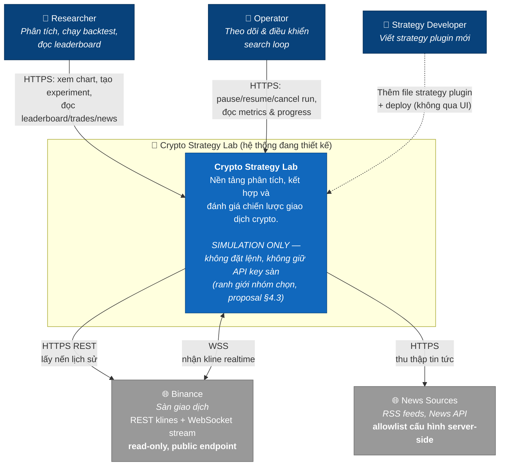

**Đọc gì từ Level 1**

- Chỉ có **2 loại phụ thuộc ngoài**: sàn giao dịch và nguồn tin. Cả hai đều **một chiều đọc**.
- Không có mũi tên nào từ hệ thống đi ra để **ghi** vào Binance. Đây là biểu diễn của ranh giới simulation-only — một **product decision của nhóm** (`proposal.md` §4.3), không phải yêu cầu trích từ đề bài.
- `Strategy Developer` nối bằng đường nét đứt và **không đi qua UI**: strategy được thêm bằng code + deploy, không bằng form. Đây là chủ ý — cho phép upload code strategy qua UI là một lỗ RCE.

### 2.2 Level 2 — Container

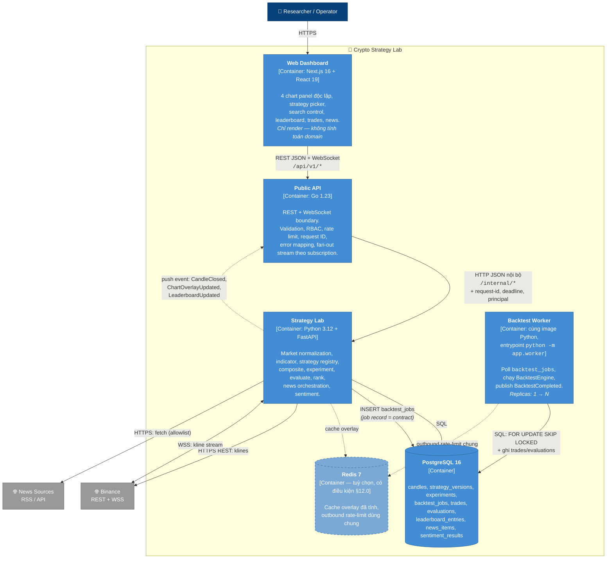

**Ba điều đáng chú ý ở Level 2**

1. **Worker dùng cùng image với Lab.** Không có container "backtest service" riêng với code riêng. Cùng `BacktestEngine`, khác entrypoint. Đây là điều khiến việc scale (§40.4) không cần viết lại gì.
2. **Lab và Worker không nói chuyện trực tiếp.** Chúng giao tiếp qua bảng `backtest_jobs`. Nghĩa là: worker chết giữa job → job quay về `queued` sau lease timeout; thêm worker → chỉ cần `docker compose up --scale worker=4`.
3. **Redis vẽ nét đứt vì nó là tuỳ chọn, không phải "chưa tới phase".** Nó không tồn tại ở MVP và có thể **không bao giờ** được thêm — điều kiện thêm nằm ở §12.0 và phải đo mới biết. Đưa vào diagram để thấy chỗ nó *sẽ* nằm nếu cần, không phải để trông cho "đủ enterprise". Ngược lại, `Worker` vẽ nét liền: nó là workload bắt buộc từ Phase 3 (§1.3.1, §12.0).

### 2.3 Level 3 — Component (Strategy Lab)

Level 3 chỉ vẽ cho container quan trọng nhất — Strategy Lab — vì đây là nơi chứa toàn bộ architectural driver của đề bài.

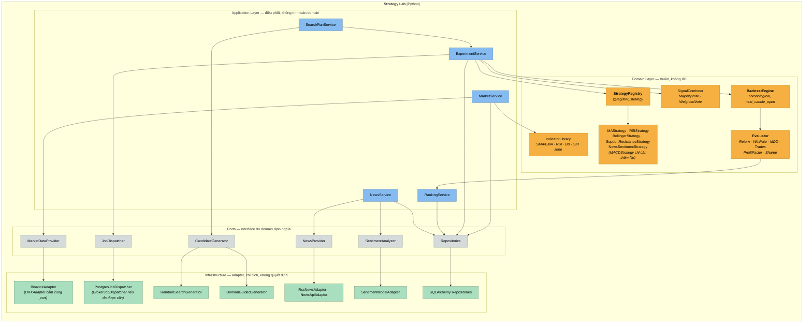

**Quy tắc phụ thuộc (đọc theo màu)**

Mũi tên **luôn** đi từ trên xuống: Application → Domain → Port → Infrastructure. Không có mũi tên nào ngược lên. Cụ thể:

- **Không** có mũi tên từ `Strategies` (cam) sang `ASql` hay `ABinance` (xanh lá). Đây là biểu diễn của anti-pattern "Strategy truy cập trực tiếp Database" bị chặn (§9.4).
- **Không** có mũi tên từ `ARss` (news adapter) sang `AModel` (sentiment model). Crawler không biết ML tồn tại (§9.5).
- `Port` (xám) là interface do **domain** định nghĩa, **infrastructure** implement. Đây là Dependency Inversion — lý do thêm `OKXAdapter` không đụng gì tới `MarketService`.

---

## 3. High-Level Architecture Diagram

Diagram này gộp cả **cấu trúc** (ai gọi ai) và **6 luồng dữ liệu** của hệ thống vào một hình, đánh số theo luồng để đọc được từng đường độc lập.

```mermaid
flowchart LR
    subgraph Ext["NGUỒN NGOÀI"]
        direction TB
        BN_R["Binance REST<br/>/api/v3/klines"]
        BN_W["Binance WSS<br/>@kline_5m"]
        NEWS["RSS / News API<br/><i>allowlist</i>"]
    end

    subgraph Client["CLIENT — chỉ render"]
        direction TB
        P1["Chart Panel 1<br/>BTCUSDT 5m"]
        P2["Chart Panel 2<br/>BTCUSDT 15m"]
        P3["Chart Panel 3<br/>1h"]
        P4["Chart Panel 4<br/>4h"]
        LB_UI["Leaderboard<br/>+ Trade Table"]
        SR_UI["Search Control<br/>+ Progress"]
        NW_UI["News + Sentiment"]
    end

    subgraph GoAPI["PUBLIC API — Go"]
        direction TB
        MW["Middleware chain<br/>requestID → CORS → ratelimit<br/>→ auth → RBAC → validate"]
        REST["REST handlers"]
        WSHUB["WebSocket Hub<br/><i>subscription registry:<br/>(symbol,timeframe,strategy,config_hash)</i>"]
    end

    subgraph LabBox["STRATEGY LAB — Python"]
        direction TB

        subgraph MD["① Market Data Module"]
            MDA["BinanceAdapter<br/>normalize → Candle"]
            MDS["MarketService<br/>reconnect · backfill · de-dup"]
            OVL["OverlayCalculator<br/><i>indicator + signal</i>"]
        end

        subgraph SE["② Strategy Engine"]
            REG["StrategyRegistry"]
            STR["Strategy plugins"]
            CMB["SignalCombiner"]
        end

        subgraph EX["③ Experiment Module"]
            EXS["ExperimentService<br/><i>tạo snapshot bất biến</i>"]
            BTE["BacktestEngine"]
            EVA["Evaluator"]
        end

        subgraph SS["④ Search Module"]
            GEN["CandidateGenerator<br/><i>Random | DomainGuided</i>"]
            SRS["SearchRunService<br/><i>stop condition · pause/resume</i>"]
        end

        subgraph RK["⑤ Ranking Module"]
            RNK["RankingService<br/><i>score policy v1</i>"]
            TOPK["Leaderboard Top-K"]
        end

        subgraph NS["⑥ News Module"]
            NWC["NewsCollector<br/><i>chỉ collect</i>"]
            SNT["SentimentAnalyzer<br/><i>chỉ classify</i>"]
        end

        BUS{{"In-process Event Dispatcher<br/><i>CandleClosed · StrategyGenerated<br/>BacktestQueued/Started/Completed/Failed<br/>StrategyEvaluated · LeaderboardUpdated<br/>NewsCollected · SentimentAnalyzed</i>"}}
    end

    subgraph WK["BACKTEST WORKER × N"]
        W1["Worker<br/>poll → run → publish"]
    end

    DB[("PostgreSQL<br/>candles · strategy_versions<br/>experiments · backtest_jobs<br/>trades · equity_points<br/>evaluations · leaderboard_entries<br/>news_items · sentiment_results")]

    BN_W -->|"kline tick"| MDA
    BN_R -->|"backfill nến thiếu"| MDA
    MDA --> MDS
    MDS -->|"upsert nến đã đóng"| DB
    MDS --> BUS
    BUS -->|"CandleClosed"| OVL
    OVL -->|"ChartOverlayUpdated<br/>+ config_hash"| WSHUB
    MDS -->|"candle delta"| WSHUB
    WSHUB -->|"chỉ panel khớp<br/>subscription"| P1
    WSHUB --> P2
    WSHUB --> P3
    WSHUB --> P4

    SR_UI -->|"POST /search-runs"| MW --> REST
    REST --> SRS
    SRS --> GEN
    GEN -->|"CandidateStrategy<br/><i>bất biến</i>"| SRS
    SRS -->|"dedup theo candidate_hash"| EXS
    P1 -->|"POST /experiments"| MW
    REST --> EXS
    EXS -->|"snapshot + INSERT backtest_jobs"| DB
    EXS --> REG --> STR
    STR --> CMB
    DB -->|"FOR UPDATE SKIP LOCKED"| W1
    W1 -->|"cùng BacktestEngine"| BTE
    BTE -->|"trades · equity_points"| DB
    BTE --> EVA
    EVA -->|"StrategyEvaluated"| BUS
    BUS --> RNK --> TOPK
    TOPK -->|"leaderboard_entries"| DB
    TOPK -->|"LeaderboardUpdated"| WSHUB --> LB_UI
    SRS -->|"progress snapshot"| WSHUB --> SR_UI

    NEWS --> NWC
    NWC -->|"NewsItem chuẩn hoá"| DB
    NWC -->|"NewsCollected"| BUS
    BUS --> SNT
    SNT -->|"sentiment + model_version"| DB
    DB --> NW_UI
    DB -->|"aggregate theo giờ"| STR

    classDef ext fill:#e8e8e8,stroke:#999,color:#000
    classDef client fill:#dbeafe,stroke:#3b82f6,color:#000
    classDef go fill:#cffafe,stroke:#06b6d4,color:#000
    classDef py fill:#fef3c7,stroke:#f59e0b,color:#000
    classDef wk fill:#fce7f3,stroke:#ec4899,color:#000
    classDef db fill:#dcfce7,stroke:#22c55e,color:#000
    class BN_R,BN_W,NEWS ext
    class P1,P2,P3,P4,LB_UI,SR_UI,NW_UI client
    class MW,REST,WSHUB go
    class MDA,MDS,OVL,REG,STR,CMB,EXS,BTE,EVA,GEN,SRS,RNK,TOPK,NWC,SNT,BUS py
    class W1 wk
    class DB db
```

### 3.1 Sáu điểm tích hợp và cam kết của từng điểm

**① Binance → Market Data Adapter**

- Adapter là **lớp duy nhất** trong toàn hệ thống biết field name của Binance (`t`, `o`, `h`, `l`, `c`, `v`, `x`). Nó dịch sang `Candle` nội bộ và **không** để rò rỉ shape gốc đi đâu.
- Nến `is_closed = false` được đánh dấu `provisional` và **không** ghi làm nguồn sự thật lịch sử. Chỉ nến đã đóng (`x: true`) mới upsert vào `candles`.
- De-dup bằng `UNIQUE (provider, symbol, timeframe, close_time)`. Nghĩa là backfill có thể chạy chồng lấp bao nhiêu lần cũng không tạo nến trùng — an toàn để retry.
- Cam kết: **thêm `OKXAdapter` không sửa `MarketService`, không sửa API contract, không sửa frontend**. Xem `specs/market-data.md`.

**② Strategy Engine ← Registry**

- Không có `if`/`elif` theo tên strategy ở bất kỳ đâu. Registry map `strategy_id@version → class`.
- Strategy nhận `AnalysisContext` (đã chuẩn hoá, đã tính indicator) và trả `Signal`. Nó **không** có tham chiếu tới HTTP client, SQL session, WebSocket, hay Binance SDK. Kiểm chứng được bằng test: `import` module strategy trong môi trường không có DB/network vẫn chạy.
- Cam kết: **thêm `MACDStrategy` = 1 file mới + 0 dòng sửa core**. Xem `specs/strategy-registry.md`.

**③ Experiment → Job Queue**

- `POST /experiments` **không** chạy backtest trong request. Nó ghi `ExperimentSnapshot` + `backtest_jobs` row trong **cùng một transaction**, rồi trả `202 { run_id }`.
- Snapshot chứa đủ để tái lập: candidate definition, `dataset_version`, `from/to`, `fee_bps`, `slippage_bps`, `fill_policy`, `position_policy`, `evaluator_version`.
- Job có `lease_expires_at`. Worker chết → lease hết hạn → job về `queued`, worker khác nhận. At-least-once + evaluation idempotent theo `backtest_run_id` = không double-count.
- Cam kết: **chuyển 1 worker → N worker chỉ là `--scale worker=N`**. Xem `specs/experiment.md`, `specs/backtest.md`.

**④ Search → Experiment (một chiều)**

- `SearchRunService` gọi `CandidateGenerator.generate()` và nhận về `CandidateStrategy` bất biến. Nó **không** biết candidate được sinh ra bằng random, domain rule, hay genetic.
- Ngược lại, `CandidateGenerator` **không** biết candidate sẽ được backtest thế nào.
- Dedup: `UNIQUE (search_run_id, candidate_hash)` → cùng một tổ hợp không backtest 2 lần trong 1 run.
- Stop condition được khai báo **trước khi run bắt đầu** và lưu vào DB. Không tồn tại đường code nào cho phép `while True`.
- Cam kết: **đổi Random → Domain-Guided = 1 file generator mới + 1 dòng config**. Xem `specs/search-loop.md`.

**⑤ Evaluate → Rank (qua event)**

- `BacktestEngine` sinh **trade facts thô**. `Evaluator` tính **metrics dẫn xuất**. `RankingService` tính **score theo policy có version**. Ba việc, ba component.
- Tách như vậy để: đổi công thức score (ví dụ `0.5×Return + 0.2×WinRate + 0.3×RiskScore`) chỉ cần bump `score_policy_version` và tính lại từ `evaluations` — **không** cần chạy lại backtest.
- `RankingService` nhận `StrategyEvaluated` qua event, không bị `BacktestEngine` gọi trực tiếp. Đây là yêu cầu §34 của đề bài.
- Cam kết: **trades bất biến; đổi scoring không làm mất dữ liệu gốc**. Xem `specs/leaderboard.md`.

**⑥ News → Sentiment (hai job tách rời)**

- `NewsCollector` chỉ collect và chuẩn hoá. Nó **không** import model ML, **không** biết BERT tồn tại.
- `SentimentAnalyzer` chỉ classify. Nó nhận `NewsItem` đã lưu, ghi `sentiment_results` với `model_version`.
- `NewsSentimentStrategy` đọc **aggregate theo cửa sổ thời gian** từ DB qua repository port — như mọi strategy khác, qua `AnalysisContext`, không query SQL trực tiếp.
- Bảo mật: `ApprovedNewsSource` là **cấu hình server**, không nhận URL từ browser. Chống SSRF chi tiết ở `specs/news.md`.
- Cam kết: **sentiment down → chart và backtest technical vẫn 100%**.

### 3.2 Đường đi của một nến, từ Binance tới pixel

Đây là luồng có yêu cầu độ trễ khắt khe nhất (< 1.5 s p95), nên tách ra mô tả riêng:

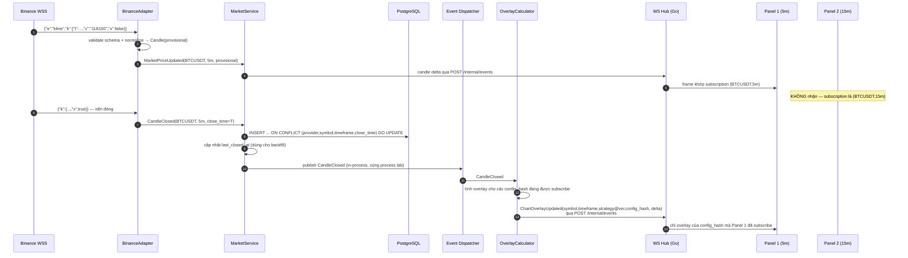

**Vì sao overlay tính ở backend, không ở React**

Đề bài coi "Frontend chứa business logic" là anti-pattern (§44). Nhưng lý do thực tế mạnh hơn lý do hình thức:

1. Nếu React tự tính RSI, và backtest tính RSI ở Python, thì **hai chỗ có thể lệch nhau** — user thấy tín hiệu BUY trên chart nhưng backtest không sinh trade. Không debug được.
2. Overlay cho backtest result (entry/exit/SL/TP) **bắt buộc** phải từ backend vì nó phụ thuộc fill policy và position state đã ghi lại. Nếu overlay live tính ở client mà overlay result tính ở server thì hai loại marker cùng chart nhưng khác nguồn chân lý.
3. Thêm strategy mới sẽ phải implement **2 lần** (Python cho backtest, TypeScript cho chart) → vi phạm trực tiếp mục tiêu "thêm strategy = 1 file".

Vì vậy: `GET /api/v1/markets/chart-overlays` trả về series đã tính; frontend chỉ vẽ. Xem `specs/chart-overlay.md`.

### 3.3 Vì sao đổi timeframe Chart 1 không làm Chart 2–4 reload

Đây là yêu cầu §5 của đề bài và là một trong 10 tiêu chí thành công (S1). Cơ chế:

- Mỗi panel là một **subscription độc lập** với khoá `(symbol, timeframe, strategy_id@version, config_hash)`.
- WS Hub (Go) giữ registry `subscription_key → set[connection]`. Khi có `CandleClosed` cho `(BTCUSDT, 5m)`, hub chỉ gửi tới connection nào đã subscribe đúng khoá đó.
- Khi user đổi Chart 1 từ `5m → 1h`: client gửi `{"action":"unsubscribe", key:"BTCUSDT|5m|..."}` rồi `{"action":"subscribe", key:"BTCUSDT|1h|..."}`, và fetch `GET /markets/candles?...timeframe=1h`. Chart 2–4 không gửi gì, không nhận gì, state không đổi → React không re-render chúng.
- Ở phía frontend, state của mỗi panel nằm trong component của panel đó (hoặc một entry riêng trong store keyed by `panelId`), **không** nằm trong một object `dashboardState` chung. Một object chung là cách phổ biến nhất để phá vỡ tính độc lập này mà vẫn "trông đúng".

---

## 4. Thiết kế cơ sở dữ liệu

### 4.1 Lựa chọn loại database

Đề bài (§35) liệt kê 6 nhóm dữ liệu: Market Data, Strategy, Experiment, Trades, News, Leaderboard — và yêu cầu nhóm **giải thích lựa chọn**, đặc biệt là Leaderboard nên lưu trực tiếp hay tính từ Experiment Results.

**Quyết định: PostgreSQL 16 là store duy nhất bắt buộc.** Redis là tuỳ chọn có điều kiện (§12.0) và chỉ làm cache, không bao giờ làm nguồn sự thật.

| Nhóm dữ liệu             | Đặc điểm truy cập                                                            | Lựa chọn                        | Lý do                                                                                                     |
| ------------------------ | ---------------------------------------------------------------------------- | ------------------------------- | --------------------------------------------------------------------------------------------------------- |
| **Candles**              | Ghi append theo thời gian, đọc range query `WHERE symbol,timeframe AND close_time BETWEEN` | **PostgreSQL** (partition theo tháng nếu số row đòi hỏi) | Range query trên B-tree index đủ nhanh; UNIQUE constraint là cơ chế de-dup backfill. Time-series DB (TimescaleDB/InfluxDB) sẽ dùng khi > 100M row — chưa đến. |
| **Strategy definitions / versions** | Ghi rất ít, đọc nhiều, **bất biến sau khi dùng**                    | **PostgreSQL**                  | Cần FK từ `experiments` để đảm bảo referential integrity của provenance. Đây là lý do không dùng file JSON. |
| **Experiments (snapshot)** | Ghi 1 lần, đọc lại nhiều, schema cố tình mở rộng được                      | **PostgreSQL + JSONB**          | Cột chuẩn hoá cho field cần query/index (`symbol`, `timeframe`, `status`); `JSONB` cho `candidate_definition` vì cấu trúc composite lồng nhau và sẽ tiến hoá. |
| **Backtest jobs**        | Ghi/đọc/update trạng thái tần suất cao, cần lock để nhiều worker không tranh nhau | **PostgreSQL** (`FOR UPDATE SKIP LOCKED`) | Cho đúng semantics của queue **và** transaction chung với việc ghi kết quả. Broker riêng không cho được điều thứ hai. Xem ADR-005. |
| **Trades / equity points** | Ghi bulk theo run, đọc phân trang, **bất biến**                            | **PostgreSQL**                  | Là *fact* dùng để tính lại metric khi đổi scoring policy. Không được mất, không được sửa.                  |
| **Evaluations**          | 1 row / backtest run, đọc để rank                                            | **PostgreSQL**                  | Tách khỏi `trades` để "tính lại metric" không đụng vào fact.                                               |
| **Leaderboard**          | Đọc rất nhiều (Top-K), ghi mỗi khi có evaluation mới                         | **PostgreSQL — bảng vật chất hoá** | Xem phân tích riêng bên dưới.                                                                             |
| **News items**           | Ghi theo batch crawl, đọc theo thời gian + coin                              | **PostgreSQL**                  | Full-text search dùng `tsvector` nếu cần, không phải thêm Elasticsearch.                                    |
| **Sentiment results**    | 1..N row / news (1 row per model_version)                                    | **PostgreSQL**                  | `model_version` là phần của khoá → đổi model không ghi đè kết quả cũ (R10).                                 |
| **Overlay đã tính**      | Đọc nhiều, tính lại được, TTL ngắn                                            | **Redis** (tuỳ chọn, §12.0)   | Dữ liệu dẫn xuất, mất không sao. Chỉ thêm khi đo được overlay recompute là bottleneck.                     |

**Leaderboard: lưu trực tiếp hay tính từ Experiment Results?**

Đề bài yêu cầu trả lời câu này. Ba lựa chọn và phân tích:

| Phương án                                | Ưu                                                          | Nhược                                                                                                        |
| ---------------------------------------- | ----------------------------------------------------------- | ------------------------------------------------------------------------------------------------------------ |
| A. Tính on-the-fly từ `evaluations`      | Không có dữ liệu trùng lặp; đổi scoring là đổi `ORDER BY`   | Không lưu được **lịch sử thứ hạng** (Top-1 lúc 14:05 là ai?); mỗi request Top-K phải sort toàn bộ evaluations |
| B. Chỉ lưu bảng `leaderboard_entries` mutable | Đọc Top-K nhanh                                         | Ghi đè khi có entry tốt hơn → **mất lịch sử**, và entry trở thành bản copy của "strategy hiện tại" → phá provenance (R6) |
| C. **`leaderboard_entries` append-only tham chiếu `evaluation_id`** ✅ | Đọc nhanh; giữ lịch sử thứ hạng; entry là snapshot bất biến trỏ tới evaluation | Nhiều row hơn A; cần một view/query để lấy "Top-K hiện tại"                                        |

**Chọn C.** Lý do quyết định: `leaderboard_entries` phải là **snapshot của một evaluation tại một thời điểm với một scoring policy version**, không phải một dòng mutable mô tả "strategy này đang đứng thứ mấy". Chỉ có cách đó mới trả lời được câu hỏi §40.8 ("làm sao biết một kết quả trên Leaderboard được tạo ra bởi version strategy nào?") và mới cho phép đổi công thức score mà kết quả cũ vẫn đọc được để so sánh.

Cụ thể: mỗi khi có `StrategyEvaluated`, `RankingService` tính score theo policy hiện hành, và **nếu** score vượt entry thứ K thì INSERT một `leaderboard_entries` row mới (không UPDATE row cũ). "Top-K hiện tại" là một query với `DISTINCT ON (evaluation_id) ... ORDER BY score DESC LIMIT K` trên policy version đang hoạt động.

### 4.2 Schema PostgreSQL

```sql
-- =============================================================
-- 0. Extension & type dùng chung
-- =============================================================
CREATE EXTENSION IF NOT EXISTS "pgcrypto";     -- gen_random_uuid()

CREATE TYPE timeframe_enum AS ENUM ('1m','5m','15m','30m','1h','2h','4h','1d');
CREATE TYPE signal_enum    AS ENUM ('BUY','SELL','HOLD');
CREATE TYPE run_status     AS ENUM ('queued','running','completed','failed','cancelled');
CREATE TYPE search_status  AS ENUM ('queued','running','paused','completed','failed','cancelled');
CREATE TYPE job_status     AS ENUM ('queued','leased','completed','failed');
CREATE TYPE sentiment_enum AS ENUM ('POSITIVE','NEUTRAL','NEGATIVE');
CREATE TYPE trade_side     AS ENUM ('LONG','SHORT');
CREATE TYPE fill_policy_enum AS ENUM ('next_candle_open','same_candle_close');
CREATE TYPE position_policy_enum AS ENUM ('long_only','long_short');
-- Trạng thái dispatch của transactional outbox (§5.7)
CREATE TYPE event_dispatch_status AS ENUM ('pending','claimed','delivered','dead');
```

```sql
-- =============================================================
-- 1. Người dùng & RBAC  (3 role — xem §7)
-- =============================================================
CREATE TABLE users (
    id            UUID PRIMARY KEY DEFAULT gen_random_uuid(),
    email         VARCHAR(255) UNIQUE NOT NULL,
    password_hash VARCHAR(255) NOT NULL,              -- argon2id
    display_name  VARCHAR(120) NOT NULL,
    role          VARCHAR(24)  NOT NULL
                  CHECK (role IN ('RESEARCHER','OPERATOR','ADMIN')),
    is_active     BOOLEAN      NOT NULL DEFAULT TRUE,
    created_at    TIMESTAMPTZ  NOT NULL DEFAULT now(),
    updated_at    TIMESTAMPTZ  NOT NULL DEFAULT now()
);

CREATE TABLE refresh_tokens (
    id         UUID PRIMARY KEY DEFAULT gen_random_uuid(),
    user_id    UUID NOT NULL REFERENCES users(id) ON DELETE CASCADE,
    token_hash CHAR(64) UNIQUE NOT NULL,              -- sha256 của token
    expires_at TIMESTAMPTZ NOT NULL,
    revoked_at TIMESTAMPTZ,
    created_at TIMESTAMPTZ NOT NULL DEFAULT now()
);
CREATE INDEX idx_refresh_user ON refresh_tokens(user_id, expires_at DESC);

-- Quota chống 1 người chiếm hết worker (xem §8.2)
CREATE TABLE user_quotas (
    user_id                UUID PRIMARY KEY REFERENCES users(id) ON DELETE CASCADE,
    max_concurrent_runs    SMALLINT NOT NULL DEFAULT 2,
    max_candidates_per_run INT      NOT NULL DEFAULT 500,
    max_candles_per_experiment INT  NOT NULL DEFAULT 20000
);
```

```sql
-- =============================================================
-- 2. Market Data
-- =============================================================
CREATE TABLE market_pairs (
    id       SMALLSERIAL PRIMARY KEY,
    symbol   VARCHAR(24) UNIQUE NOT NULL,             -- 'BTCUSDT'
    base     VARCHAR(12) NOT NULL,                    -- 'BTC'
    quote    VARCHAR(12) NOT NULL,                    -- 'USDT'
    provider VARCHAR(24) NOT NULL DEFAULT 'binance',
    is_active BOOLEAN    NOT NULL DEFAULT TRUE
);

-- Nến ĐÃ ĐÓNG. Nến provisional không bao giờ được ghi vào đây.
CREATE TABLE candles (
    provider    VARCHAR(24)    NOT NULL,
    symbol      VARCHAR(24)    NOT NULL,
    timeframe   timeframe_enum NOT NULL,
    open_time   TIMESTAMPTZ    NOT NULL,
    close_time  TIMESTAMPTZ    NOT NULL,
    open        NUMERIC(24,8)  NOT NULL,
    high        NUMERIC(24,8)  NOT NULL,
    low         NUMERIC(24,8)  NOT NULL,
    close       NUMERIC(24,8)  NOT NULL,
    volume      NUMERIC(30,8)  NOT NULL,
    trade_count INT,
    fetched_at  TIMESTAMPTZ    NOT NULL DEFAULT now(),  -- provenance
    -- Khoá này LÀ cơ chế de-dup của backfill: retry bao nhiêu lần cũng an toàn
    PRIMARY KEY (provider, symbol, timeframe, close_time),
    CHECK (high >= low),
    CHECK (high >= open AND high >= close),
    CHECK (low  <= open AND low  <= close),
    CHECK (volume >= 0),
    CHECK (close_time > open_time)
);
CREATE INDEX idx_candles_range ON candles(symbol, timeframe, close_time DESC);

-- Vết của stream: dùng để biết cần backfill từ đâu sau reconnect
CREATE TABLE stream_checkpoints (
    provider       VARCHAR(24)    NOT NULL,
    symbol         VARCHAR(24)    NOT NULL,
    timeframe      timeframe_enum NOT NULL,
    last_closed_at TIMESTAMPTZ,
    reconnect_count INT           NOT NULL DEFAULT 0,
    is_stale       BOOLEAN        NOT NULL DEFAULT FALSE,
    updated_at     TIMESTAMPTZ    NOT NULL DEFAULT now(),
    PRIMARY KEY (provider, symbol, timeframe)
);

-- Định danh bất biến của một tập nến dùng cho experiment (reproducibility)
CREATE TABLE market_datasets (
    id              UUID PRIMARY KEY DEFAULT gen_random_uuid(),
    dataset_version VARCHAR(120) UNIQUE NOT NULL,  -- 'binance-btcusdt-5m-20260101-20260301'
    provider        VARCHAR(24)    NOT NULL,
    symbol          VARCHAR(24)    NOT NULL,
    timeframe       timeframe_enum NOT NULL,
    range_from      TIMESTAMPTZ    NOT NULL,
    range_to        TIMESTAMPTZ    NOT NULL,
    candle_count    INT            NOT NULL,
    content_hash    CHAR(64)       NOT NULL,   -- sha256 của chuỗi nến đã canonical hoá
    created_at      TIMESTAMPTZ    NOT NULL DEFAULT now(),
    CHECK (range_to > range_from),
    CHECK (candle_count > 0)
);
CREATE INDEX idx_datasets_lookup ON market_datasets(symbol, timeframe, range_from, range_to);
```

> **`content_hash` giải quyết một vấn đề cụ thể**: nếu backfill sửa một nến (Binance đôi khi revise), thì cùng một `(symbol, timeframe, from, to)` có thể cho ra hai tập nến khác nhau ở hai thời điểm. Không có hash thì hai experiment "cùng dataset" thực ra chạy trên dữ liệu khác nhau và không ai biết. Có hash thì phát hiện được ngay: cùng `dataset_version` mà `content_hash` khác → tạo dataset version mới.

```sql
-- =============================================================
-- 3. Strategy — định nghĩa & VERSION BẤT BIẾN  (đề bài §36)
-- =============================================================
CREATE TABLE strategy_definitions (
    strategy_id  VARCHAR(48) PRIMARY KEY,       -- 'ma_cross','rsi','bollinger','support_resistance','news_sentiment'
    display_name VARCHAR(120) NOT NULL,
    family       VARCHAR(24)  NOT NULL
                 CHECK (family IN ('trend','momentum','volatility','structure','information')),
    description  TEXT,
    is_composite BOOLEAN NOT NULL DEFAULT FALSE,
    created_at   TIMESTAMPTZ NOT NULL DEFAULT now()
);

-- APPEND-ONLY. Không bao giờ UPDATE một row đã được experiment tham chiếu.
CREATE TABLE strategy_versions (
    id                UUID PRIMARY KEY DEFAULT gen_random_uuid(),
    strategy_id       VARCHAR(48) NOT NULL REFERENCES strategy_definitions(strategy_id),
    version           VARCHAR(24) NOT NULL,          -- semver: '1.0.0'
    parameters_schema JSONB       NOT NULL,          -- JSON Schema để validate + sinh form UI
    default_params    JSONB       NOT NULL,
    input_requirements JSONB      NOT NULL,          -- ["candles.close"] hoặc ["news.sentiment_1h"]
    overlay_types     JSONB       NOT NULL,          -- ["moving_average","buy_signal","sell_signal"]
    code_fingerprint  CHAR(64)    NOT NULL,          -- sha256 source strategy → phát hiện sửa code mà quên bump version
    registered_at     TIMESTAMPTZ NOT NULL DEFAULT now(),
    UNIQUE (strategy_id, version)
);
```

> **`code_fingerprint` bắt một lỗi rất dễ xảy ra**: dev sửa thuật toán trong `rsi.py` nhưng để nguyên `version = "1.0.0"`. Khi đó experiment cũ và mới cùng ghi `rsi@1.0.0` nhưng chạy hai thuật toán khác nhau — provenance sai một cách âm thầm, không ai phát hiện. Ở startup, registry so `code_fingerprint` thực tế với DB; lệch → **fail fast** với thông báo "strategy rsi@1.0.0 changed, bump version". Đây là cách biến yêu cầu Reproducibility (§36) từ quy ước-trên-giấy thành ràng buộc-kiểm-tra-được.

```sql
-- =============================================================
-- 4. Search Run — vòng lặp CÓ KIỂM SOÁT  (đề bài §23)
-- =============================================================
CREATE TABLE search_runs (
    id                  UUID PRIMARY KEY DEFAULT gen_random_uuid(),
    owner_id            UUID NOT NULL REFERENCES users(id),
    generator_id        VARCHAR(48) NOT NULL,   -- 'random_search' | 'domain_guided'
    generator_version   VARCHAR(24) NOT NULL,
    search_space        JSONB NOT NULL,         -- strategy nào, khoảng param nào, cardinality nào
    -- STOP CONDITION: NOT NULL — không tồn tại run nào chạy vô hạn
    stop_conditions     JSONB NOT NULL,
    -- ví dụ: {"max_candidates":200,"max_duration_sec":1800,
    --         "max_non_improving":50,"max_failure_rate":0.3}
    seed                BIGINT,                 -- reproducible random search
    status              search_status NOT NULL DEFAULT 'queued',
    stop_reason         VARCHAR(48),            -- 'max_candidates'|'timeout'|'no_improvement'|'cancelled'|'failure_rate'
    candidates_generated INT NOT NULL DEFAULT 0,
    candidates_tested    INT NOT NULL DEFAULT 0,
    candidates_failed    INT NOT NULL DEFAULT 0,
    best_score          NUMERIC(12,4),
    best_evaluation_id  UUID,
    market_dataset_id   UUID NOT NULL REFERENCES market_datasets(id),
    execution_config    JSONB NOT NULL,         -- fee/slippage/fill/position — chung cho cả run
    idempotency_key     VARCHAR(64),
    lock_version        INT NOT NULL DEFAULT 0, -- optimistic lock cho pause/resume đồng thời
    started_at          TIMESTAMPTZ,
    finished_at         TIMESTAMPTZ,
    created_at          TIMESTAMPTZ NOT NULL DEFAULT now(),
    UNIQUE (owner_id, idempotency_key),
    CHECK (jsonb_typeof(stop_conditions) = 'object'),
    -- Ràng buộc CỨNG: phải có ít nhất 1 stop condition thật
    CHECK (
        stop_conditions ? 'max_candidates'
        OR stop_conditions ? 'max_duration_sec'
        OR stop_conditions ? 'max_non_improving'
    )
);
CREATE INDEX idx_search_runs_owner ON search_runs(owner_id, created_at DESC);
CREATE INDEX idx_search_runs_active ON search_runs(status) WHERE status IN ('queued','running','paused');

CREATE TABLE search_candidates (
    id                   UUID PRIMARY KEY DEFAULT gen_random_uuid(),
    search_run_id        UUID NOT NULL REFERENCES search_runs(id) ON DELETE CASCADE,
    sequence_no          INT  NOT NULL,
    candidate_definition JSONB NOT NULL,        -- composite snapshot bất biến
    candidate_hash       CHAR(64) NOT NULL,     -- sha256 canonical(definition) → dedup
    experiment_id        UUID,                  -- FK gán sau khi tạo experiment
    status               run_status NOT NULL DEFAULT 'queued',
    failure_reason       TEXT,
    created_at           TIMESTAMPTZ NOT NULL DEFAULT now(),
    -- Cùng 1 tổ hợp KHÔNG backtest 2 lần trong cùng run
    UNIQUE (search_run_id, candidate_hash),
    UNIQUE (search_run_id, sequence_no)
);

-- Audit các lệnh pause/resume/cancel — đảm bảo idempotent (đề bài §23: pause/resume)
CREATE TABLE search_actions (
    id             UUID PRIMARY KEY DEFAULT gen_random_uuid(),
    search_run_id  UUID NOT NULL REFERENCES search_runs(id) ON DELETE CASCADE,
    command_id     VARCHAR(64) UNIQUE NOT NULL,   -- client sinh → replay an toàn
    action         VARCHAR(16) NOT NULL CHECK (action IN ('pause','resume','cancel')),
    requested_from search_status NOT NULL,
    resulted_in    search_status NOT NULL,
    actor_id       UUID NOT NULL REFERENCES users(id),
    created_at     TIMESTAMPTZ NOT NULL DEFAULT now()
);
```

```sql
-- =============================================================
-- 5. Experiment — SNAPSHOT BẤT BIẾN (nền tảng Reproducibility)
-- =============================================================
CREATE TABLE experiments (
    id                   UUID PRIMARY KEY DEFAULT gen_random_uuid(),
    owner_id             UUID NOT NULL REFERENCES users(id),
    -- Strategy: cả id lẫn version. Version là FK → không thể trỏ tới version không tồn tại.
    strategy_version_id  UUID NOT NULL REFERENCES strategy_versions(id),
    candidate_definition JSONB NOT NULL,   -- composite snapshot đầy đủ (children + policy + weights)
    candidate_hash       CHAR(64) NOT NULL,
    -- Dataset: FK → biết chính xác tập nến nào
    market_dataset_id    UUID NOT NULL REFERENCES market_datasets(id),
    -- Execution assumptions: KHÔNG mặc định ngầm, luôn ghi rõ
    initial_capital      NUMERIC(20,8) NOT NULL DEFAULT 10000,
    fee_bps              SMALLINT NOT NULL DEFAULT 10,   -- 10 bps = 0.10%
    slippage_bps         SMALLINT NOT NULL DEFAULT 5,
    fill_policy          fill_policy_enum     NOT NULL DEFAULT 'next_candle_open',
    position_policy      position_policy_enum NOT NULL DEFAULT 'long_only',
    open_position_at_end VARCHAR(24) NOT NULL DEFAULT 'close_at_last_candle',
    evaluator_version    VARCHAR(24) NOT NULL,
    search_candidate_id  UUID REFERENCES search_candidates(id),  -- NULL nếu tạo tay
    created_at           TIMESTAMPTZ NOT NULL DEFAULT now(),
    CHECK (fee_bps >= 0 AND slippage_bps >= 0),
    CHECK (initial_capital > 0)
);
CREATE INDEX idx_experiments_owner ON experiments(owner_id, created_at DESC);
CREATE INDEX idx_experiments_hash  ON experiments(candidate_hash, market_dataset_id);

ALTER TABLE search_candidates
  ADD CONSTRAINT fk_candidate_experiment
  FOREIGN KEY (experiment_id) REFERENCES experiments(id);

-- Job queue: bảng này LÀ contract giữa Lab và Worker
CREATE TABLE backtest_jobs (
    id               UUID PRIMARY KEY DEFAULT gen_random_uuid(),
    experiment_id    UUID UNIQUE NOT NULL REFERENCES experiments(id) ON DELETE CASCADE,
    status           job_status NOT NULL DEFAULT 'queued',
    priority         SMALLINT NOT NULL DEFAULT 100,   -- experiment tạo tay < search candidate
    attempt          SMALLINT NOT NULL DEFAULT 0,
    max_attempts     SMALLINT NOT NULL DEFAULT 3,
    leased_by        VARCHAR(64),                     -- worker id
    lease_token      UUID,                            -- sinh MỚI mỗi lần claim; xem §8.3.1
    lease_expires_at TIMESTAMPTZ,                     -- worker chết → job về queued
    last_error       TEXT,
    enqueued_at      TIMESTAMPTZ NOT NULL DEFAULT now(),
    completed_at     TIMESTAMPTZ,
    -- Job đang được giữ thì phải có đủ cả ba trường lease. Chặn trạng thái nửa vời.
    CHECK (status <> 'leased'
           OR (leased_by IS NOT NULL AND lease_token IS NOT NULL AND lease_expires_at IS NOT NULL))
);
-- Index này là thứ làm "SELECT job tiếp theo" không full-scan khi có 100K job
CREATE INDEX idx_jobs_claimable ON backtest_jobs(priority, enqueued_at)
    WHERE status = 'queued';
CREATE INDEX idx_jobs_expired_lease ON backtest_jobs(lease_expires_at)
    WHERE status = 'leased';

CREATE TABLE backtest_runs (
    id             UUID PRIMARY KEY DEFAULT gen_random_uuid(),
    experiment_id  UUID UNIQUE NOT NULL REFERENCES experiments(id) ON DELETE CASCADE,
    status         run_status NOT NULL DEFAULT 'queued',
    worker_id      VARCHAR(64),
    lease_token    UUID,          -- token của lượt claim đang sở hữu run này
    attempt        SMALLINT NOT NULL DEFAULT 0,   -- lượt thực thi thứ mấy
    candles_read   INT,
    signals_count  INT,
    duration_ms    INT,
    error_code     VARCHAR(48),
    error_detail   TEXT,
    started_at     TIMESTAMPTZ,
    finished_at    TIMESTAMPTZ,
    created_at     TIMESTAMPTZ NOT NULL DEFAULT now()
);
```

> **`experiment_id` UNIQUE trên cả `backtest_jobs` và `backtest_runs`** giữ đúng bất biến "một experiment có nhiều nhất một run": UNIQUE violation là **tín hiệu**, không phải kết luận. Nó nói "run này đã tồn tại", nhưng *phải làm gì* thì phụ thuộc worker có claim được lease hay không — và đó là việc của `lease_token`. Quy tắc đầy đủ ở **§8.3.1**; đừng suy diễn từ mỗi constraint này.

```sql
-- =============================================================
-- 6. Kết quả: trade facts (thô) tách khỏi metrics (dẫn xuất)
-- =============================================================
CREATE TABLE trades (
    id               BIGSERIAL PRIMARY KEY,
    backtest_run_id  UUID NOT NULL REFERENCES backtest_runs(id) ON DELETE CASCADE,
    sequence_no      INT  NOT NULL,
    side             trade_side NOT NULL DEFAULT 'LONG',
    entry_time       TIMESTAMPTZ NOT NULL,
    entry_price      NUMERIC(24,8) NOT NULL,
    exit_time        TIMESTAMPTZ,
    exit_price       NUMERIC(24,8),
    quantity         NUMERIC(24,8) NOT NULL,
    fee_paid         NUMERIC(24,8) NOT NULL DEFAULT 0,
    slippage_cost    NUMERIC(24,8) NOT NULL DEFAULT 0,
    pnl_absolute     NUMERIC(24,8),
    pnl_percent      NUMERIC(12,6),
    exit_reason      VARCHAR(32),   -- 'signal'|'stop_loss'|'take_profit'|'end_of_sample'
    UNIQUE (backtest_run_id, sequence_no),
    CHECK (exit_time IS NULL OR exit_time >= entry_time)
);
CREATE INDEX idx_trades_run ON trades(backtest_run_id, sequence_no);

-- Tín hiệu thô — dùng để vẽ Buy/Sell marker và để giải thích "strategy đã làm gì"
CREATE TABLE run_signals (
    id              BIGSERIAL PRIMARY KEY,
    backtest_run_id UUID NOT NULL REFERENCES backtest_runs(id) ON DELETE CASCADE,
    candle_time     TIMESTAMPTZ NOT NULL,
    signal          signal_enum NOT NULL,
    confidence      NUMERIC(6,4),
    child_signals   JSONB,       -- {"ma_cross":"BUY","rsi":"SELL","support_resistance":"BUY","score":0.4}
    UNIQUE (backtest_run_id, candle_time)
);

CREATE TABLE equity_points (
    backtest_run_id UUID NOT NULL REFERENCES backtest_runs(id) ON DELETE CASCADE,
    point_time      TIMESTAMPTZ NOT NULL,
    equity          NUMERIC(24,8) NOT NULL,
    drawdown_pct    NUMERIC(12,6),
    PRIMARY KEY (backtest_run_id, point_time)
);

-- Metrics DẪN XUẤT. Tính lại được từ trades + equity_points.
CREATE TABLE evaluations (
    id                UUID PRIMARY KEY DEFAULT gen_random_uuid(),
    backtest_run_id   UUID NOT NULL REFERENCES backtest_runs(id) ON DELETE CASCADE,
    evaluator_version VARCHAR(24) NOT NULL,
    total_return_pct  NUMERIC(14,6) NOT NULL,
    win_rate_pct      NUMERIC(8,4)  NOT NULL,
    max_drawdown_pct  NUMERIC(10,6) NOT NULL,
    trade_count       INT           NOT NULL,
    profit_factor     NUMERIC(12,6),
    sharpe_ratio      NUMERIC(12,6),
    avg_trade_pct     NUMERIC(12,6),
    computed_at       TIMESTAMPTZ NOT NULL DEFAULT now(),
    -- Cùng 1 run + cùng evaluator version → đúng 1 evaluation.
    -- Đây là cái chặn duplicate BacktestCompleted event tạo entry trùng (R12).
    UNIQUE (backtest_run_id, evaluator_version),
    CHECK (win_rate_pct BETWEEN 0 AND 100),
    CHECK (max_drawdown_pct <= 0),
    CHECK (trade_count >= 0)
);
```

> **`max_drawdown_pct <= 0`** là một ràng buộc nhỏ nhưng bắt được lỗi dấu — thứ rất dễ sai khi tính MDD và rất khó phát hiện bằng mắt trên UI. Tương tự `win_rate_pct BETWEEN 0 AND 100` bắt lỗi nhầm giữa tỉ lệ và phần trăm (0.61 vs 61).

> **`sharpe_ratio` và `profit_factor` là `NULL`-able có chủ ý.** `profit_factor` khi không có trade lỗ là vô cực — `NUMERIC` không lưu được `Infinity` và nó làm `ORDER BY` vỡ, nên giá trị đúng là `NULL`. `sharpe_ratio` cần đủ số quan sát mới có nghĩa: `EvaluationPolicy.min_periods_for_sharpe` (v1 = 30) và `risk_free_rate` (v1 = 0) là phần của policy, và annualization factor phụ thuộc timeframe nên được ghi vào metadata của `evaluator_version`. Chi tiết công thức ở `specs/evaluation.md`.

```sql
-- =============================================================
-- 7. Leaderboard — APPEND-ONLY, tham chiếu evaluation (phương án C §4.1)
-- =============================================================
CREATE TABLE score_policies (
    version     VARCHAR(24) PRIMARY KEY,   -- 'v1'
    formula     TEXT NOT NULL,             -- '0.5*return_norm + 0.2*win_rate_norm + 0.3*risk_score'
    weights     JSONB NOT NULL,            -- trọng số + anchor chuẩn hoá + min_trades + top_k_tracked
    is_active   BOOLEAN NOT NULL DEFAULT FALSE,
    created_at  TIMESTAMPTZ NOT NULL DEFAULT now()
);
-- Đúng 1 policy active tại một thời điểm
CREATE UNIQUE INDEX idx_one_active_policy ON score_policies(is_active) WHERE is_active;

CREATE TABLE leaderboard_entries (
    id                   UUID PRIMARY KEY DEFAULT gen_random_uuid(),
    evaluation_id        UUID NOT NULL REFERENCES evaluations(id) ON DELETE CASCADE,
    score_policy_version VARCHAR(24) NOT NULL REFERENCES score_policies(version),
    score                NUMERIC(12,4) NOT NULL,
    rank_at_insert       SMALLINT NOT NULL,
    market_dataset_id    UUID NOT NULL REFERENCES market_datasets(id),  -- chỉ so sánh cùng dataset
    observed_at          TIMESTAMPTZ NOT NULL DEFAULT now(),
    -- 1 evaluation chỉ có 1 entry cho mỗi policy version.
    -- Đổi policy = tính lại và INSERT entry mới, KHÔNG ghi đè entry cũ.
    UNIQUE (evaluation_id, score_policy_version)
);
CREATE INDEX idx_leaderboard_topk
    ON leaderboard_entries(market_dataset_id, score_policy_version, score DESC, observed_at DESC);
```

> **`market_dataset_id` trên leaderboard entry** chặn một so sánh vô nghĩa: strategy chạy trên BTCUSDT 5m tháng 1 và strategy chạy trên BTCUSDT 1h tháng 6 không thể xếp cùng bảng. Không có cột này thì Leaderboard sẽ trộn táo với cam và Top-1 chỉ phản ánh dataset nào dễ ăn nhất.

```sql
-- =============================================================
-- 8. News & Sentiment — hai bảng, hai vòng đời
-- =============================================================
CREATE TABLE news_sources (
    id            SMALLSERIAL PRIMARY KEY,
    source_key    VARCHAR(48) UNIQUE NOT NULL,   -- 'coindesk_rss'
    display_name  VARCHAR(120) NOT NULL,
    kind          VARCHAR(16) NOT NULL CHECK (kind IN ('rss','api')),
    -- Allowlist là CẤU HÌNH SERVER. Không bao giờ nhận URL từ browser (chống SSRF — R9).
    allowed_origin VARCHAR(255) NOT NULL,        -- 'https://www.coindesk.com'
    url_template   TEXT NOT NULL,
    is_active      BOOLEAN NOT NULL DEFAULT TRUE
);

CREATE TABLE news_items (
    id            UUID PRIMARY KEY DEFAULT gen_random_uuid(),
    source_id     SMALLINT NOT NULL REFERENCES news_sources(id),
    url           TEXT NOT NULL,
    url_hash      CHAR(64) UNIQUE NOT NULL,   -- sha256(canonical url) → de-dup crawl
    title         TEXT NOT NULL,
    content       TEXT,
    published_at  TIMESTAMPTZ NOT NULL,
    crawled_at    TIMESTAMPTZ NOT NULL DEFAULT now(),
    related_coins VARCHAR(12)[] NOT NULL DEFAULT '{}',
    CHECK (char_length(title) > 0)
);
CREATE INDEX idx_news_time  ON news_items(published_at DESC);
CREATE INDEX idx_news_coins ON news_items USING GIN (related_coins);

CREATE TABLE sentiment_results (
    id            UUID PRIMARY KEY DEFAULT gen_random_uuid(),
    news_item_id  UUID NOT NULL REFERENCES news_items(id) ON DELETE CASCADE,
    label         sentiment_enum NOT NULL,
    score         NUMERIC(6,4)   NOT NULL,
    model         VARCHAR(64)    NOT NULL,
    model_version VARCHAR(32)    NOT NULL,
    analyzed_at   TIMESTAMPTZ    NOT NULL DEFAULT now(),
    -- Đổi model KHÔNG ghi đè kết quả cũ (R10) → kết quả cũ vẫn so sánh được
    UNIQUE (news_item_id, model, model_version),
    CHECK (score BETWEEN 0 AND 1)
);
CREATE INDEX idx_sentiment_agg ON sentiment_results(model_version, analyzed_at DESC);

-- Job news tách riêng: lỗi ở đây KHÔNG ảnh hưởng chart/backtest (đề bài §40.5)
CREATE TABLE news_collection_jobs (
    id             UUID PRIMARY KEY DEFAULT gen_random_uuid(),
    source_id      SMALLINT NOT NULL REFERENCES news_sources(id),
    status         run_status NOT NULL DEFAULT 'queued',
    items_found    INT NOT NULL DEFAULT 0,
    items_new      INT NOT NULL DEFAULT 0,
    failure_reason TEXT,
    started_at     TIMESTAMPTZ,
    finished_at    TIMESTAMPTZ,
    created_at     TIMESTAMPTZ NOT NULL DEFAULT now()
);
```

> **`sentiment_results` không có giá trị "unavailable"**. Khi model down, hệ thống **không insert row nào** — news tồn tại mà không có sentiment. API trả `sentiment: null` và UI hiện "unavailable". Nếu ngược lại ta insert `NEUTRAL` làm placeholder thì `NewsSentimentStrategy` sẽ tính average sentiment trên dữ liệu giả và ra tín hiệu sai mà không có cách nào phân biệt "thật sự trung lập" với "không biết" (R11).

```sql
-- =============================================================
-- 9. Transactional outbox & Observability
-- =============================================================
-- domain_events LÀ outbox, không phải audit log thụ động.
-- Publisher ghi domain state + event trong CÙNG transaction (§5.7).
CREATE TABLE domain_events (
    event_id       UUID PRIMARY KEY DEFAULT gen_random_uuid(),
    event_type     VARCHAR(48) NOT NULL,
    schema_version SMALLINT NOT NULL DEFAULT 1,
    aggregate_type VARCHAR(32) NOT NULL,
    aggregate_id   UUID NOT NULL,
    correlation_id VARCHAR(64),
    payload        JSONB NOT NULL,
    occurred_at    TIMESTAMPTZ NOT NULL DEFAULT now(),

    -- ----- Trạng thái outbox: dispatcher claim / retry / delivered -----
    -- pending: chờ dispatch · claimed: dispatcher đang xử lý
    -- delivered: MỌI consumer đã ack · dead: cạn max_attempts
    dispatch_status  event_dispatch_status NOT NULL DEFAULT 'pending',
    attempt          SMALLINT NOT NULL DEFAULT 0,
    max_attempts     SMALLINT NOT NULL DEFAULT 5,
    claimed_by       VARCHAR(64),              -- dispatcher instance id
    claim_expires_at TIMESTAMPTZ,              -- dispatcher chết → event về pending
    next_attempt_at  TIMESTAMPTZ NOT NULL DEFAULT now(),  -- exponential backoff
    last_error       TEXT,
    delivered_at     TIMESTAMPTZ,

    CHECK (dispatch_status <> 'delivered' OR delivered_at IS NOT NULL)
);
CREATE INDEX idx_events_aggregate  ON domain_events(aggregate_type, aggregate_id, occurred_at);
CREATE INDEX idx_events_correlation ON domain_events(correlation_id) WHERE correlation_id IS NOT NULL;
-- Index của dispatcher: "event nào tới lượt dispatch" không full-scan khi bảng có 1M row
CREATE INDEX idx_events_dispatchable ON domain_events(next_attempt_at, occurred_at)
    WHERE dispatch_status = 'pending';
CREATE INDEX idx_events_expired_claim ON domain_events(claim_expires_at)
    WHERE dispatch_status = 'claimed';
CREATE INDEX idx_events_dead ON domain_events(occurred_at)
    WHERE dispatch_status = 'dead';

-- Ai đã tiêu thụ event nào. Đây là cơ chế idempotency (R12) VÀ là điều kiện
-- để dispatcher biết khi nào một event đã delivered đủ mọi consumer.
CREATE TABLE event_consumptions (
    event_id    UUID NOT NULL REFERENCES domain_events(event_id) ON DELETE CASCADE,
    consumer    VARCHAR(48) NOT NULL,
    consumed_at TIMESTAMPTZ NOT NULL DEFAULT now(),
    PRIMARY KEY (event_id, consumer)
);
CREATE INDEX idx_consumptions_event ON event_consumptions(event_id);
```

> **Vì sao `domain_events` có cột trạng thái dispatch, không chỉ là event log.** Nếu bảng này chỉ ghi lại "đã xảy ra gì" thì việc *giao* event cho consumer phải do một cơ chế khác đảm nhận — và cơ chế đó (in-process dispatcher) mất event khi process chết giữa lúc publish. Với outbox: event nằm trong **cùng transaction** với domain state, nên không có trạng thái nào mà state đã commit nhưng event thì mất. Dispatcher là một vòng lặp riêng, đọc `dispatch_status='pending'`, giao, và chỉ đánh `delivered` khi mọi consumer đã ghi `event_consumptions`. Flow đầy đủ ở §5.7.

> **`next_attempt_at` tách khỏi `occurred_at` là điều bắt buộc cho backoff.** Nếu dispatcher chỉ `ORDER BY occurred_at`, một event đang fail liên tục sẽ luôn ở đầu hàng đợi và chặn mọi event sau nó (head-of-line blocking). Với `next_attempt_at`, event fail bị đẩy về tương lai theo backoff và các event khác đi trước.

> **`dead` không phải `failed`.** Event cạn `max_attempts` chuyển `dead`, giữ nguyên payload và `last_error`, **không** bị xoá. `idx_events_dead` tồn tại để có một query duy nhất trả lời "có event nào chưa tới được consumer?" — một trong các signal của §8.4. Xử lý `dead` là việc thủ công có chủ ý (đọc `last_error`, sửa nguyên nhân, rồi `UPDATE dispatch_status='pending', attempt=0`), không phải retry vô hạn.

### 4.3 ERD tóm tắt

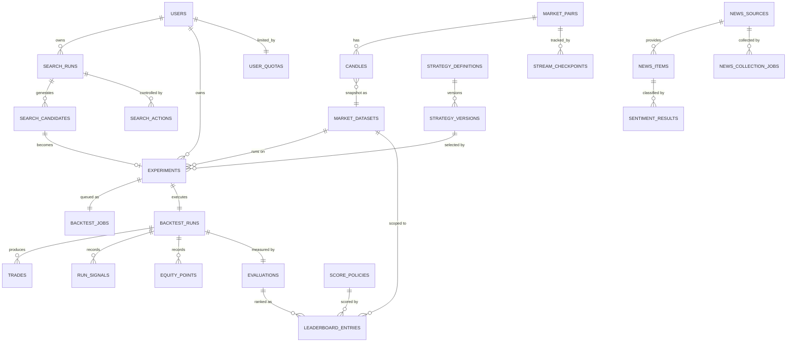

**Đường provenance — đọc từ phải sang trái**

```text
LEADERBOARD_ENTRIES.score
  → EVALUATIONS (evaluator_version, metrics)
    → BACKTEST_RUNS (worker, duration, status)
      → EXPERIMENTS (fee_bps, slippage_bps, fill_policy, position_policy)
        ├─→ STRATEGY_VERSIONS (strategy_id, version, params_schema, code_fingerprint)
        └─→ MARKET_DATASETS (symbol, timeframe, from, to, content_hash)
```

Mọi con số trên Leaderboard đi ngược được về **6 bảng** này, tất cả append-only. Đây là câu trả lời cụ thể cho §40.8 và cho R6.

### 4.4 Chiến lược retention và giới hạn

| Dữ liệu                 | Retention                                          | Giới hạn API                                                       |
| ----------------------- | -------------------------------------------------- | ------------------------------------------------------------------ |
| `candles`               | Giữ lâu dài. Partition theo tháng khi > 50M row     | `GET /markets/candles` tối đa **1000 nến/request**                 |
| `equity_points`         | Giữ theo run; **decimate** khi trả API              | Tối đa **2000 điểm/response** (downsample tuyến tính)              |
| `trades`, `run_signals` | Giữ lâu dài (là fact)                              | Phân trang, tối đa **200 row/page**                                |
| `domain_events`         | 30 ngày, sau đó archive/drop partition             | Không expose public; chỉ dùng cho debug + audit                     |
| `search_candidates`     | Giữ theo run                                       | Phân trang                                                          |
| `news_items.content`    | 90 ngày cho full content; giữ `title` + hash lâu hơn | Không render raw HTML — sanitize hoặc chỉ hiện text                |
| `backtest_jobs`         | Xoá row `completed` sau 7 ngày (`backtest_runs` giữ lại) | —                                                             |

Giới hạn ở cột phải **không phải validation UI** — chúng là control về hiệu năng và tính khả dụng. Một request `from=2017-01-01&to=2026-01-01&timeframe=1m` là 4.7 triệu nến; không chặn ở boundary thì nó sẽ làm hết memory của Python process và kéo cả hệ thống xuống.

---

## 5. Domain contract và Event vocabulary

Đây là phần quan trọng nhất của blueprint. **Toàn bộ khả năng mở rộng của hệ thống nằm ở 7 interface dưới đây** — chúng là các "seam" mà mọi thay đổi tương lai đi qua.

### 5.1 Bảy port của hệ thống

Cú pháp chỉ để minh hoạ; cam kết thiết kế là **contract và hướng phụ thuộc**.

```python
# ---------- 1. Nguồn dữ liệu thị trường ----------
class MarketDataProvider(Protocol):
    def list_candles(self, symbol: str, timeframe: Timeframe,
                     from_: datetime, to: datetime) -> list[Candle]: ...
    def stream_candles(self, subscriptions: list[StreamKey],
                       publish: Callable[[CandleEvent], None]) -> Subscription: ...
    def provider_id(self) -> str: ...
# Implement: BinanceAdapter. Thêm OKX = thêm OKXAdapter. Không sửa gì phía trên.

# ---------- 2. Strategy (lõi Plugin Architecture) ----------
class Strategy(Protocol):
    def definition(self) -> StrategyDefinition: ...      # metadata cho registry + UI
    def analyze(self, ctx: AnalysisContext) -> Signal: ...
# Implement: MAStrategy, RSIStrategy, BollingerStrategy,
#            SupportResistanceStrategy, NewsSentimentStrategy, (MACDStrategy...)

# ---------- 3. Kết hợp tín hiệu ----------
class SignalCombiner(Protocol):
    def combine(self, children: list[tuple[ChildSpec, Signal]],
                policy: CombinationPolicy) -> Signal: ...
# Implement: MajorityVoteCombiner, WeightedVoteCombiner

# ---------- 4. Sinh candidate (lõi replaceability của search) ----------
class CandidateGenerator(Protocol):
    def generator_id(self) -> str: ...
    def generate(self, space: SearchSpace, limit: int,
                 seed: int | None, history: SearchHistory) -> Iterator[CandidateStrategy]: ...
# Implement: RandomSearchGenerator, DomainGuidedGenerator, (GeneticGenerator...)

# ---------- 5. Thực thi backtest ----------
class BacktestEngine(Protocol):
    def run(self, snapshot: ExperimentSnapshot,
            candles: Sequence[Candle]) -> BacktestResult: ...
# Implement: ChronologicalBacktestEngine

# ---------- 6. Nguồn tin ----------
class NewsProvider(Protocol):
    def collect(self, source: ApprovedNewsSource,
                since: datetime) -> list[NewsItem]: ...
# Implement: RssNewsAdapter, NewsApiAdapter

# ---------- 7. Phân tích sentiment ----------
class SentimentAnalyzer(Protocol):
    def model_version(self) -> str: ...
    def analyze(self, text: str) -> Sentiment: ...
# Implement: SentimentModelAdapter (bọc model hiện tại trong ai/app/services/predictor.py)

# ---------- Phụ: điều phối job (seam để scale) ----------
class JobDispatcher(Protocol):
    def enqueue(self, job: BacktestJob) -> None: ...
    def claim(self, worker_id: str, lease_sec: int) -> BacktestJob | None: ...
    def complete(self, job_id: UUID) -> None: ...
    def fail(self, job_id: UUID, error: str, retryable: bool) -> None: ...
# Implement: PostgresJobDispatcher (bắt buộc) → BrokerJobDispatcher (nếu đo được cần)
```

**Bảng seam — thay gì thì cái gì không đổi**

| Thay đổi                        | Thêm/thay                                     | **Không** thay đổi                                                          |
| ------------------------------- | --------------------------------------------- | --------------------------------------------------------------------------- |
| Thêm strategy (MACD, SMC, Wyckoff) | 1 class `Strategy` + `@register_strategy`   | Registry code, Combiner, BacktestEngine, Evaluator, Ranking, API, DB schema, UI |
| Thêm combination policy         | 1 class `SignalCombiner`                      | Strategy đơn lẻ, BacktestEngine, snapshot format                            |
| Thêm search algorithm           | 1 class `CandidateGenerator`                  | Experiment, Backtest, Evaluator, Leaderboard, UI                            |
| Thêm sàn (OKX, Bybit)           | 1 class `MarketDataProvider`                  | MarketService, API contract, **frontend**                                   |
| Thêm nguồn tin                  | 1 class `NewsProvider` + 1 row `news_sources` | News pipeline, sentiment, strategy                                          |
| Đổi model sentiment             | 1 class `SentimentAnalyzer` + bump `model_version` | News ingestion, `NewsSentimentStrategy` contract                       |
| Đổi công thức score             | 1 row `score_policies` + recompute            | Trades, evaluations, backtest                                               |
| Scale backtest 100 → 100.000    | 1 class `JobDispatcher` + `--scale worker=N`  | `ExperimentSnapshot`, job/result event, API, schema                         |

### 5.2 AnalysisContext — cái strategy được phép thấy

Đây là chỗ ranh giới "Strategy không truy cập Database" (anti-pattern §44) được thực thi bằng cấu trúc dữ liệu, không bằng lời nhắc trong code review:

```python
@dataclass(frozen=True)
class AnalysisContext:
    symbol: str
    timeframe: Timeframe
    candles: Sequence[Candle]         # nến tới thời điểm t — KHÔNG có nến tương lai
    index: int                        # vị trí nến hiện tại; candles[index] là "bây giờ"
    indicators: Mapping[str, Sequence[float | None]]  # đã tính sẵn, aligned với candles
    news_sentiment: NewsSentimentWindow | None        # aggregate đã tính, None nếu không có
    params: Mapping[str, Any]         # đã validate theo parameters_schema
```

Ba điều `AnalysisContext` **cố ý không có**:

1. **Không có DB session / repository.** Strategy không query được gì. Dữ liệu nó cần phải được `MarketService` hoặc `NewsService` chuẩn bị trước và đưa vào.
2. **Không có HTTP client.** Strategy không gọi được Binance, không gọi được API nào.
3. **Không có nến sau `index`.** Slice `candles[:index+1]` được đảm bảo ở tầng gọi. Đây là lớp phòng thủ thứ nhất chống look-ahead bias (R3); lớp thứ hai là fill policy (§6.3).

Hệ quả kiểm chứng được: **file `strategies/rsi.py` import được và test được trong môi trường không có PostgreSQL, không có network.** Nếu một lúc nào đó nó không còn như vậy, tức là contract đã bị vi phạm — và điều đó phát hiện được bằng một unit test chạy trong CI.

`NewsSentimentWindow` là aggregate đã tính, không phải danh sách news thô:

```python
@dataclass(frozen=True)
class NewsSentimentWindow:
    window_sec: int          # 3600
    avg_score: float         # -1..+1 (POSITIVE=+score, NEGATIVE=-score, NEUTRAL=0)
    item_count: int
    model_version: str       # phần của provenance
```

Điều này khiến `NewsSentimentStrategy` là một strategy hoàn toàn bình thường — nó không biết news đến từ RSS hay API, không biết model là BERT hay logistic regression. Đó là ý nghĩa kiến trúc của §30 đề bài: *"kiến trúc không còn giới hạn ở Technical Analysis."*

Hai chi tiết trong cách tính window quyết định tính đúng đắn, và chúng dễ bị làm sai theo hướng không có triệu chứng:

- **Cắt cửa sổ theo `published_at + analysis_lag_sec` (mặc định 300 s), không theo `analyzed_at`.** Lọc theo `analyzed_at` làm mọi backtest lịch sử thấy `item_count = 0` sau khi backfill news (vì `analyzed_at` là thời điểm hiện tại, không phải thời điểm tin xuất hiện). Nhưng để `lag = 0` thì lại là look-ahead: một backtest ở thời điểm `t` sẽ thấy tin mà trong thực tế phải mất vài phút để crawl và phân loại xong.
- **`item_count = 0` → `ctx.news_sentiment` là `None`, không phải window có `avg_score = 0`.** `avg_score = 0` nghĩa "trung tính"; `None` nghĩa "không biết". Đây là ADR-013 áp ở tầng aggregate — và là lý do `NewsSentimentStrategy` có tham số `min_items` (mặc định 3): không có nó thì một bài duy nhất `score = 0.95` đủ vượt ngưỡng 0.7 và sinh BUY.

Chi tiết query và các quyết định kèm theo ở `specs/sentiment.md`.

### 5.3 Signal và CandidateStrategy

```python
@dataclass(frozen=True)
class Signal:
    action: Literal["BUY", "SELL", "HOLD"]
    confidence: float | None = None            # 0..1
    evidence: Mapping[str, Any] | None = None  # {"ma_fast": 118050, "ma_slow": 117800}
```

`evidence` là lý do UI có thể trả lời "vì sao strategy này BUY ở đây" mà không cần chạy lại strategy — nó được ghi vào `run_signals.child_signals`.

```python
@dataclass(frozen=True)
class CandidateStrategy:
    definition: CompositeSpec   # hoặc SingleSpec
    candidate_hash: str         # sha256(canonical_json(definition))
    generated_by: str           # 'random_search@1.0.0' | 'domain_guided@1.0.0'
    generation_meta: Mapping[str, Any]  # với domain-guided: rule nào đã áp dụng
```

`generation_meta` trả lời yêu cầu §17 của đề bài: *"Domain knowledge được đưa vào quá trình search như thế nào?"* — với `DomainGuidedGenerator`, meta ghi rõ `{"rule": "one_of_each_family", "families": ["trend","momentum","structure"]}`. Không có field này thì "domain-guided" chỉ là một cái tên.

### 5.4 Composite snapshot — policy là dữ liệu, không phải code

```json
{
  "type": "composite",
  "combination": {
    "policy": "weighted_vote",
    "threshold": 0.3,
    "encoding": { "BUY": 1, "HOLD": 0, "SELL": -1 }
  },
  "children": [
    { "strategy_id": "ma_cross", "version": "1.0.0",
      "parameters": { "fast_period": 20, "slow_period": 50 }, "weight": 0.2 },
    { "strategy_id": "rsi", "version": "1.0.0",
      "parameters": { "period": 14, "buy_threshold": 30, "sell_threshold": 70 }, "weight": 0.3 },
    { "strategy_id": "support_resistance", "version": "1.0.0",
      "parameters": { "lookback": 80, "touch_tolerance_pct": 0.5 }, "weight": 0.5 }
  ]
}
```

Ví dụ tính theo đề bài §14: MA→BUY(+1), RSI→SELL(−1), SR→BUY(+1) → `score = 1×0.2 + (−1)×0.3 + 1×0.5 = 0.4 > 0.3` → **BUY**.

So sánh là **ngặt**: `score > threshold` → BUY, `score < -threshold` → SELL, còn lại HOLD. Đây không phải chi tiết cú pháp. Với `>=`, giá trị hợp lệ `threshold = 0` làm `score >= 0` luôn đúng khi mọi child trả HOLD (`score = 0`) → composite BUY liên tục, tức bất biến "mọi child bỏ phiếu trắng thì composite không có ý kiến" bị phá. So sánh ngặt giữ `threshold = 0` là giá trị hợp lệ với nghĩa *"bất kỳ score khác 0 đều quyết định"* — một baseline hữu ích — trong khi `score = 0` vẫn cho HOLD. Kèm theo: `score` đúng bằng `threshold` cho HOLD, vì một score bằng ngưỡng chưa phải bằng chứng *vượt* ngưỡng. Bất biến khi đó đúng về cấu trúc cho mọi `threshold ∈ [0, 1]` thay vì phụ thuộc một cảnh báo lúc validate (`specs/composite-strategy.md` §C).

Điểm kiến trúc: `policy` và `threshold` là **field trong snapshot được lưu vào DB**, không phải hằng số trong code. Hệ quả:

- Thêm `policy: "unanimous"` là thêm 1 `SignalCombiner`, không sửa snapshot schema.
- Hai experiment cùng children nhưng khác policy là **hai `candidate_hash` khác nhau** → hai entry Leaderboard riêng, so sánh được với nhau.
- Đọc lại một entry cũ 3 tháng sau vẫn biết chính xác nó dùng ngưỡng 0.3 hay 0.5.

### 5.5 Public API contract

Go API sở hữu contract công khai và map sang lệnh nội bộ. `Auth` = cần đăng nhập, `Owner` = chỉ chủ sở hữu resource (hoặc OPERATOR/ADMIN).

| Method | Route                                        | Auth   | Mục đích                                                                    |
| ------ | -------------------------------------------- | ------ | --------------------------------------------------------------------------- |
| GET    | `/api/v1/markets/pairs`                      | public | Danh sách pair khả dụng                                                     |
| GET    | `/api/v1/markets/candles`                    | public | Nến lịch sử có giới hạn (`symbol`, `timeframe`, `from`, `to`; max 1000)      |
| GET    | `/api/v1/markets/chart-overlays`             | public | Overlay **do backend tính** cho 1 `config_hash` (§3.2)                      |
| GET    | `/api/v1/markets/stream`                     | public | **WebSocket**: subscribe/unsubscribe theo panel; rate-limited, max 8 sub/conn |
| GET    | `/api/v1/markets/status`                     | public | Trạng thái feed: `stale`, `last_closed_at`, `reconnect_count`                |
| GET    | `/api/v1/strategies`                         | public | Registry metadata: id, version, family, `parameters_schema`, `overlay_types` |
| POST   | `/api/v1/experiments`                        | Auth   | Tạo experiment bất biến → **`202 { run_id }`**, không chờ backtest           |
| GET    | `/api/v1/experiments/{id}`                   | Owner  | Trạng thái run + result summary + provenance                                 |
| GET    | `/api/v1/experiments/{id}/trades`            | Owner  | Trade facts, phân trang (max 200/page)                                       |
| GET    | `/api/v1/experiments/{id}/equity`            | Owner  | Equity curve, decimate ≤ 2000 điểm                                           |
| GET    | `/api/v1/experiments/{id}/overlays`          | Owner  | Overlay của result: signal + entry/exit/SL/TP marker                         |
| POST   | `/api/v1/search-runs`                        | Auth   | Bắt đầu search; **`stop_conditions` bắt buộc**; áp quota                     |
| GET    | `/api/v1/search-runs/{id}`                   | Owner  | Progress: tested/queued/failed/best/current/elapsed/stop_reason              |
| POST   | `/api/v1/search-runs/{id}/actions`           | Owner  | `{"action":"pause"\|"resume"\|"cancel","command_id":"..."}` — idempotent      |
| GET    | `/api/v1/leaderboard`                        | public | Top-K theo `dataset_version` + `score_policy_version`                        |
| GET    | `/api/v1/leaderboard/{entryId}/provenance`   | public | Toàn bộ chuỗi truy nguồn (§4.3)                                              |
| GET    | `/api/v1/news`                               | public | News + sentiment (`null` nếu chưa/không phân tích được)                       |
| GET    | `/api/v1/news/aggregate`                     | public | Phân bố sentiment theo cửa sổ thời gian                                       |
| POST   | `/api/v1/ai/predict`                         | Auth   | Endpoint tương thích scaffold hiện có; validate text 1–10.000 ký tự           |
| GET    | `/healthz` · `/readyz`                       | public | Liveness (process sống) vs Readiness (DB + migration + Lab reachable)         |
| GET    | `/metrics`                                   | nội bộ | Prometheus                                                                   |

**Error envelope thống nhất**

```json
{
  "error": {
    "code": "unsupported_timeframe",
    "message": "Timeframe must be one of 1m, 5m, 15m, 30m, 1h, 2h, 4h, 1d.",
    "field": "timeframe",
    "request_id": "req_01JB2X9K7M4NQZ"
  }
}
```

Quy tắc **không thương lượng** ở boundary:

- Không forward raw body của Binance/news provider ra client.
- Không trả stack trace, tên bảng, hay SQL error message.
- Không trả model internals (weights, prompt, tên file model).
- Lỗi upstream 5xx map thành `502` với `code` domain-level, giữ nguyên `request_id` để tra log.

**`202` cho công việc dài, không phải `200` sau khi chờ**

`POST /experiments` và `POST /search-runs` trả `202 Accepted` + `run_id`. Không có endpoint nào giữ HTTP connection chờ backtest xong. Đây là quyết định kiến trúc (R5), không phải tối ưu UX: một backtest 20.000 nến có thể mất 40 s, và giữ connection nghĩa là (a) client timeout ở mức proxy/browser mà server vẫn chạy → user không biết kết quả, (b) 20 request đồng thời làm cạn worker pool của Go.

### 5.6 Event vocabulary

Đề bài §34 yêu cầu định nghĩa event. Đây là danh sách đầy đủ, kèm publisher/consumer để thấy rõ **không có ai gọi trực tiếp ai**. Cột **Delivery** là ranh giới process của từng event — chi tiết cơ chế ở §5.7.

| Event                   | Publisher            | Consumer                          | Delivery | Payload chính                                                    |
| ----------------------- | -------------------- | --------------------------------- | -------- | ---------------------------------------------------------------- |
| `MarketPriceUpdated`    | BinanceAdapter       | WS Hub (Go)                       | **Cross-proc**: HTTP `/internal/events` | symbol, timeframe, provisional candle |
| `CandleClosed`          | MarketService        | OverlayCalculator, CandleStore    | **In-proc** (`lab`)                     | symbol, timeframe, close_time, OHLCV |
| `ChartOverlayUpdated`   | OverlayCalculator    | WS Hub (Go)                       | **Cross-proc**: HTTP `/internal/events` | symbol, timeframe, strategy@ver, `config_hash`, delta series |
| `StreamStale`           | MarketService        | WS Hub (Go), metrics              | **Cross-proc**: HTTP `/internal/events` | symbol, timeframe, last_closed_at, reconnect_count |
| `StrategyGenerated`     | CandidateGenerator   | SearchRunService                  | **In-proc** (`lab`)                     | search_run_id, candidate_hash, definition, generation_meta |
| `BacktestQueued`        | ExperimentService    | metrics, WS Hub                   | **Outbox** → metrics; HTTP → WS Hub     | experiment_id, job_id, priority |
| `BacktestStarted`       | Worker               | metrics, WS Hub                   | **Outbox** (worker → dispatcher)        | experiment_id, worker_id, candle_count |
| `BacktestCompleted`     | Worker               | Evaluator                         | **Outbox** (worker → dispatcher)        | backtest_run_id, trade_count, duration_ms |
| `BacktestFailed`        | Worker               | SearchRunService, metrics         | **Outbox** (worker → dispatcher)        | experiment_id, error_code, retryable |
| `StrategyEvaluated`     | Evaluator            | **RankingService**                | **Outbox** (§5.7.4)                     | evaluation_id, metrics, evaluator_version |
| `LeaderboardUpdated`    | RankingService       | WS Hub (Go)                       | **Cross-proc**: HTTP `/internal/events` | entry_id, rank, score, dataset_version |
| `SearchProgressUpdated` | SearchRunService     | WS Hub (Go)                       | **Cross-proc**: HTTP `/internal/events` | tested, queued, failed, best_score, current_candidate, elapsed |
| `SearchRunFinished`     | SearchRunService     | WS Hub (Go), metrics              | **Cross-proc**: HTTP `/internal/events` | search_run_id, stop_reason, totals |
| `NewsCollected`         | NewsCollector        | SentimentAnalyzer                 | **In-proc** (`lab`)                     | news_item_id, source_key, title_hash |
| `SentimentAnalyzed`     | SentimentAnalyzer    | (chỉ persist)                     | **In-proc** (`lab`)                     | news_item_id, label, score, model_version |

Mọi event có envelope chung:

```json
{
  "event_id": "01JB2X9K7M4NQZ8V3T5W6Y7Z8A",
  "event_type": "StrategyEvaluated",
  "schema_version": 1,
  "aggregate_type": "backtest_run",
  "aggregate_id": "…",
  "correlation_id": "req_01JB2X9K7M4NQZ",
  "occurred_at": "2026-08-11T09:14:22.481Z",
  "payload": {}
}
```

**Ba tính chất bắt buộc của consumer**

1. **Idempotent.** Consumer INSERT `event_consumptions(event_id, consumer)` trước khi hành động; conflict → bỏ qua. `BacktestCompleted` đến 2 lần **không** tạo 2 evaluation (đã có `UNIQUE (backtest_run_id, evaluator_version)` làm lớp thứ hai).
2. **Không phụ thuộc thứ tự giữa các aggregate khác nhau.** Chỉ event của cùng một aggregate mới có thứ tự.
3. **`schema_version` cố định khi đổi cơ chế delivery.** Contract được version từ ngày đầu, nên đổi in-process → outbox → broker không buộc consumer sửa payload handling.

### 5.7 Ranh giới process của event — in-process dispatcher và transactional outbox

Đây là chỗ dễ sai nhất trong toàn bộ thiết kế, nên nói thẳng vấn đề trước: **`EventDispatcher` in-process không thể giao event cho một process khác.** Nó là một dict `event_type → list[handler]` trong bộ nhớ của một process. Nếu `Worker` publish `BacktestCompleted` vào dispatcher của **chính nó** mà `Evaluator` lại được đăng ký trong dispatcher của process `lab`, thì handler không bao giờ chạy — và không có lỗi nào xuất hiện, vì "0 handler cho event này" là trạng thái hợp lệ của một dict.

Vì `Worker` **luôn** là process riêng (§1.3.1) kể cả ở MVP một replica, mọi event từ Worker đều là cross-process từ ngày đầu. Không có "phase mà worker chạy in-process".

#### 5.7.1 Ba cơ chế delivery và điều kiện dùng từng cơ chế

| Cơ chế | Dùng khi | Bảo đảm | Ví dụ |
| ------ | -------- | ------- | ----- |
| **In-process dispatcher** | Publisher và consumer **chắc chắn** trong cùng một process | At-most-once, mất khi process chết. Chấp nhận được vì consumer chỉ tính toán phái sinh, tính lại được | `CandleClosed` → `OverlayCalculator`; `NewsCollected` → `SentimentAnalyzer` (đều trong `lab`) |
| **Transactional outbox** (`domain_events`) | Publisher và consumer **khác process**, và mất event là không chấp nhận được | At-least-once + idempotent consumer = effectively-once. Không mất event dù process chết bất kỳ lúc nào | `BacktestCompleted` (worker → Evaluator); `StrategyEvaluated` (Evaluator → Ranking) |
| **HTTP POST `/internal/events`** | Consumer là **Go WS Hub** (ngôn ngữ khác, chỉ fan-out cho browser) | Best-effort + retry. Mất một frame realtime không sai dữ liệu — client refetch theo `seq` | `ChartOverlayUpdated`, `LeaderboardUpdated`, `SearchProgressUpdated` |

Quy tắc chọn, một câu: **event nào mà việc mất nó làm dữ liệu sai thì đi outbox; event nào chỉ để cập nhật UI thì đi HTTP; event nào không ra khỏi process thì đi in-process dispatcher.**

#### 5.7.2 Quy tắc bắt buộc cho worker process

Vì `Worker` không có `Evaluator`/`RankingService` chạy trong nó, worker **không được** dựa vào in-process dispatcher cho các event pipeline. Cụ thể:

| Việc | Đúng | Sai |
| ---- | ---- | --- |
| Worker publish `BacktestCompleted` | `INSERT INTO domain_events (...) ` trong **cùng transaction** với `UPDATE backtest_runs status='completed'` | `dispatcher.publish(BacktestCompleted(...))` — không ai nghe, event bốc hơi |
| Ai chạy `Evaluator` | **Outbox dispatcher** trong process `lab` (mặc định), hoặc worker tự đăng ký handler nếu chọn cấu hình `EVENT_CONSUMERS=evaluator,ranking` | Giả định "chắc là ở đâu đó có" |
| Worker biết `Evaluator` tồn tại | Không. Worker chỉ ghi vào outbox. | `from app.domain.evaluation import Evaluator` trong code worker |

Có **hai cấu hình triển khai hợp lệ**, và blueprint chốt cấu hình A làm mặc định:

**Cấu hình A (mặc định) — outbox dispatcher trong `lab`**

```text
worker process:  claim job → run engine → COMMIT(state + outbox event)
lab process:     OutboxDispatcher loop → Evaluator handler → RankingService handler
                 → INSERT event_consumptions → mark delivered
```

**Cấu hình B — consumer chạy trong worker**

```text
worker process:  claim job → run engine → COMMIT(state + outbox event)
                 → OutboxDispatcher loop (cùng process) → Evaluator → Ranking
lab process:     không chạy dispatcher (EVENT_CONSUMERS rỗng)
```

Cấu hình B hợp lệ nhưng có một đánh đổi phải biết: dispatcher và backtest engine tranh CPU trong cùng process, nên khi worker đang chạy một backtest 40 s thì event của backtest **trước đó** bị delay. Cấu hình A tách hai vòng lặp nên không có vấn đề này. Điều bắt buộc chung cho cả hai: **`EVENT_CONSUMERS` phải được set tường minh, và startup check phải fail nếu tổng số process khai báo một consumer khác 1.** Không có consumer nào → event tồn đọng `pending` mãi; hai consumer trùng → hai lần xử lý (idempotency chặn được, nhưng đó là lãng phí có thể phát hiện sớm).

#### 5.7.3 Publish — state và event trong cùng transaction

```python
# app/infrastructure/events/outbox.py  (rút gọn)
async def publish_transactional(conn, event: DomainEvent) -> None:
    """PHẢI gọi trong transaction đang mở của caller, không tự BEGIN."""
    await conn.execute(
        """INSERT INTO domain_events
             (event_id, event_type, schema_version, aggregate_type, aggregate_id,
              correlation_id, payload, dispatch_status, next_attempt_at)
           VALUES ($1,$2,$3,$4,$5,$6,$7,'pending', now())""",
        event.event_id, event.event_type, event.schema_version,
        event.aggregate_type, event.aggregate_id,
        event.correlation_id, json.dumps(event.payload),
    )

# Worker: ghi kết quả VÀ event trong MỘT transaction
async with conn.transaction():
    await repo.insert_trades(conn, run_id, trades)
    await repo.insert_equity_points(conn, run_id, equity)
    await repo.update_run_completed(conn, run_id, duration_ms, candles_read)
    await repo.update_job_completed(conn, job_id)
    await publish_transactional(conn, BacktestCompleted(run_id, len(trades), duration_ms))
# COMMIT: hoặc cả kết quả lẫn event được ghi, hoặc không gì cả.
```

Đây là điểm cốt lõi: **không tồn tại trạng thái "kết quả đã ghi nhưng event mất"**, cũng không tồn tại "event đã gửi nhưng kết quả rollback". Với một broker riêng, đúng chỗ này là dual-write và cần Outbox pattern để đạt cùng bảo đảm — nên ta dùng outbox luôn, và vì queue cũng ở PostgreSQL thì nó miễn phí (ADR-005).

#### 5.7.4 Dispatch — claim, retry, ack

```sql
-- Dispatcher claim một batch event tới lượt. Cùng cơ chế với claim job (§8.3).
WITH claimed AS (
    SELECT event_id
    FROM domain_events
    WHERE (dispatch_status = 'pending' AND next_attempt_at <= now())
       OR (dispatch_status = 'claimed' AND claim_expires_at < now())  -- dispatcher chết
    ORDER BY occurred_at ASC
    FOR UPDATE SKIP LOCKED
    LIMIT 32
)
UPDATE domain_events e
SET dispatch_status  = 'claimed',
    claimed_by       = $1,
    claim_expires_at = now() + interval '60 seconds',
    attempt          = e.attempt + 1
FROM claimed c
WHERE e.event_id = c.event_id
RETURNING e.event_id, e.event_type, e.payload, e.attempt, e.max_attempts, e.correlation_id;
```

Với mỗi event đã claim, dispatcher gọi lần lượt các handler đã đăng ký cho `event_type`. Mỗi handler chạy trong **transaction riêng của nó**, và bước đầu tiên trong transaction đó là ghi `event_consumptions`:

```python
async def deliver(conn, event, handler_name, handler) -> bool:
    async with conn.transaction():
        inserted = await conn.fetchval(
            """INSERT INTO event_consumptions (event_id, consumer)
               VALUES ($1, $2) ON CONFLICT DO NOTHING RETURNING TRUE""",
            event.event_id, handler_name,
        )
        if not inserted:
            return True          # đã xử lý ở lần giao trước → coi như thành công
        await handler(conn, event)   # cùng transaction với event_consumptions
    return True
```

`event_consumptions` và tác dụng của handler nằm **cùng transaction** — đó là điều làm idempotency đúng. Nếu ghi `event_consumptions` ở transaction riêng rồi mới chạy handler, sẽ có cửa sổ mà event bị đánh "đã tiêu thụ" nhưng handler chưa chạy, và retry sẽ bỏ qua nó vĩnh viễn.

Chỉ khi **mọi** handler của `event_type` đã có row trong `event_consumptions` thì event mới được đánh `delivered`:

```sql
UPDATE domain_events
SET dispatch_status = 'delivered', delivered_at = now(), claimed_by = NULL, claim_expires_at = NULL
WHERE event_id = $1
  AND (SELECT count(*) FROM event_consumptions WHERE event_id = $1) = $2;  -- $2 = số handler mong đợi
```

Nếu một handler fail: event về `pending` với backoff, `last_error` ghi rõ. Các handler **đã** thành công không chạy lại (đã có `event_consumptions`), chỉ handler còn thiếu được thử lại.

```python
BACKOFF_SECONDS = [1, 5, 30, 120, 600]   # attempt 1..5

async def on_handler_failure(conn, event, err):
    if event.attempt >= event.max_attempts:
        await conn.execute(
            """UPDATE domain_events SET dispatch_status='dead', last_error=$2,
                   claimed_by=NULL, claim_expires_at=NULL WHERE event_id=$1""",
            event.event_id, str(err)[:2000])
    else:
        delay = BACKOFF_SECONDS[min(event.attempt, len(BACKOFF_SECONDS)) - 1]
        await conn.execute(
            """UPDATE domain_events SET dispatch_status='pending', last_error=$2,
                   next_attempt_at = now() + make_interval(secs => $3),
                   claimed_by=NULL, claim_expires_at=NULL WHERE event_id=$1""",
            event.event_id, str(err)[:2000], delay)
```

#### 5.7.5 Bốn kịch bản, đọc theo sequence diagram

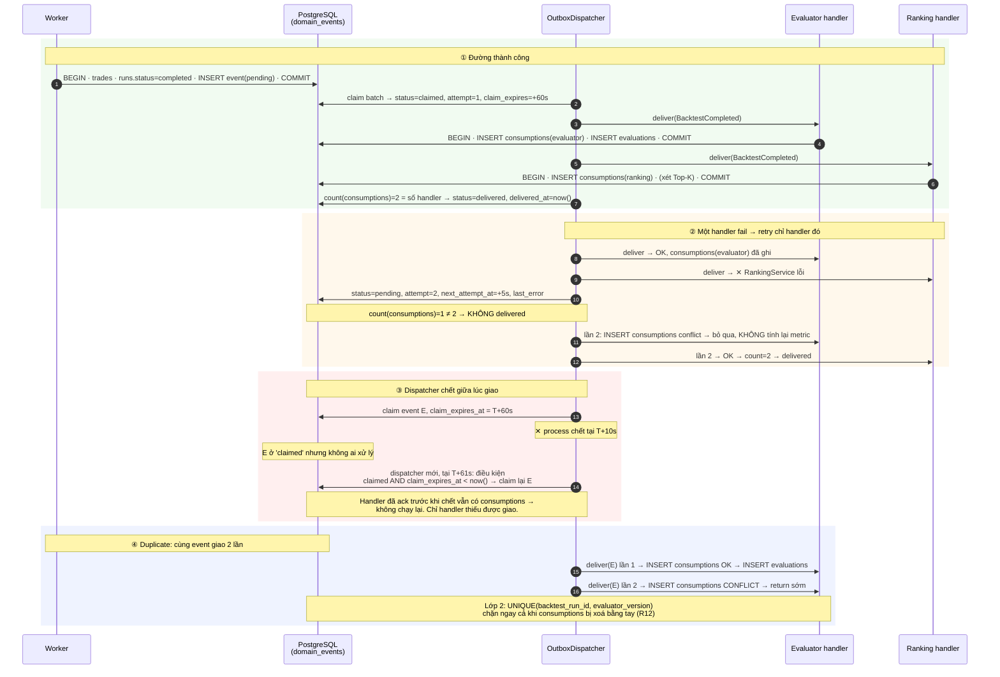

#### 5.7.6 Trạng thái của một event

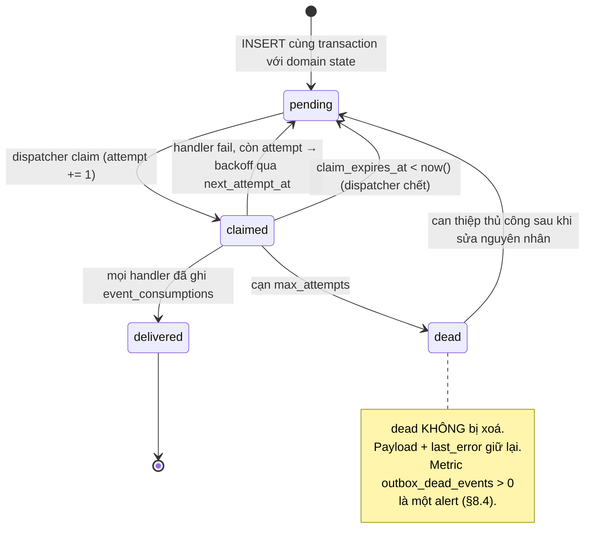

**Vì sao không dùng `LISTEN/NOTIFY` để đẩy thay vì polling.** `NOTIFY` không bền: consumer không kết nối lúc đó thì mất thông báo, và đúng lúc cần bảo đảm nhất (process vừa restart) là lúc nó không có. Cách đúng là dùng `NOTIFY` như một **tín hiệu đánh thức** cho dispatcher đang polling, không phải như kênh giao event. Dispatcher poll mỗi 200 ms; `NOTIFY` chỉ giảm latency, không phải nguồn chân lý. Ở MVP, polling 200 ms là đủ và bỏ `NOTIFY` cho đơn giản.

**Điều gì đổi và không đổi khi thay outbox bằng broker.** Handler signature (`async def handler(conn, event)`) không đổi. `event_consumptions` vẫn cần vì broker cũng chỉ cho at-least-once. Cái đổi là `OutboxDispatcher` được thay bằng một consumer group của broker — tức một adapter, đúng như `JobDispatcher` (ADR-005). Đây là lý do outbox không phải "giải pháp tạm": nó là **cùng một contract** mà broker sẽ phải thoả mãn.

### 5.8 Protocol nội bộ Python → Go: `POST /internal/events`

Quyết định đã chốt: **HTTP POST `/internal/events`**. Không có phương án "hoặc WebSocket nội bộ". Lý do ở ADR-016.

#### 5.8.1 Contract

```http
POST /internal/events HTTP/1.1
Host: api:8080
Content-Type: application/json
Authorization: Bearer <INTERNAL_EVENT_TOKEN>
X-Correlation-Id: req_01JB2X9K7M4NQZ
Idempotency-Key: 01JB2X9K7M4NQZ8V3T5W6Y7Z8A      # = event_id của event đầu batch

{
  "events": [
    {
      "event_id": "01JB2X9K7M4NQZ8V3T5W6Y7Z8A",
      "event_type": "ChartOverlayUpdated",
      "schema_version": 1,
      "aggregate_type": "market_stream",
      "aggregate_id": "…",
      "correlation_id": "req_01JB2X9K7M4NQZ",
      "occurred_at": "2026-08-11T09:14:22.481Z",
      "seq": 8472,
      "subscription_key": "BTCUSDT|5m|rsi@1.0.0|sha256:4d1f…",
      "payload": { }
    }
  ]
}
```

Response:

```json
{ "accepted": ["01JB2X9K7M4NQZ8V3T5W6Y7Z8A"], "duplicate": [], "rejected": [] }
```

| Thuộc tính | Quy định |
| --- | --- |
| Method + path | `POST /internal/events`. Batch tới **64 event** một request để tránh một HTTP call cho mỗi tick. |
| **Internal auth** | Bearer token tĩnh từ env `INTERNAL_EVENT_TOKEN`, so sánh **constant-time** (`hmac.Equal`, không `==`). Route nằm sau một middleware chỉ nhận request từ CIDR nội bộ của compose network, và **không** đăng ký trên listener public. Không dùng JWT của user: đây là service-to-service, không có principal. |
| Timeout | Python client: 2 s. Ngắn có chủ ý — đây là đường realtime, chậm hơn 2 s thì frame đã vô nghĩa với UI. |
| **Idempotency** | Go giữ một ring buffer `event_id` đã nhận (dung lượng 10.000, TTL 5 phút) trong bộ nhớ. `event_id` đã thấy → trả về trong `duplicate[]`, **không** fan-out lần hai. Đây là chống duplicate do retry, không phải chống replay attack. |
| Ack | `200` với `accepted[]`/`duplicate[]`/`rejected[]` theo từng `event_id`. Ack **từng phần**: một event xấu trong batch không làm cả batch fail. |
| Ordering | `seq` tăng đơn điệu theo `subscription_key`, do Python cấp. Go **không** sắp xếp lại; client so `frame.seq` với `snapshot.seq` để phát hiện gap và refetch REST (xem `specs/chart-overlay.md`). Đây là lý do mất một frame không làm chart sai. |

#### 5.8.2 Retry, backoff và khi Go WS Hub down

```python
# app/infrastructure/notify/internal_events.py  (rút gọn)
RETRY_DELAYS = [0.2, 1.0, 3.0]        # 3 lần thử, tổng ≤ ~4.2 s + 3×timeout

async def push(batch: list[DomainEvent]) -> PushResult:
    for i, delay in enumerate([0.0, *RETRY_DELAYS]):
        if delay:
            await asyncio.sleep(delay)
        try:
            r = await client.post("/internal/events", json=encode(batch), timeout=2.0)
            if r.status_code == 200:
                return PushResult.ok(r.json())
            if 400 <= r.status_code < 500:
                # Contract sai — retry không giúp gì. Log ERROR + drop.
                metrics.internal_push_rejected.inc(len(batch))
                return PushResult.rejected(r)
        except (httpx.TimeoutException, httpx.ConnectError):
            metrics.internal_push_retry.inc()
    metrics.internal_push_dropped.inc(len(batch))
    return PushResult.dropped()          # KHÔNG raise — không được làm chết vòng market
```

Hành vi khi Go WS Hub down, theo từng loại event:

| Event | Khi push thất bại sau 3 lần retry | Vì sao chấp nhận được |
| ----- | --------------------------------- | --------------------- |
| `MarketPriceUpdated`, `ChartOverlayUpdated`, `StreamStale` | **Drop**, tăng `internal_push_dropped_total` | Nến đã đóng vẫn được ghi PostgreSQL trước khi push (§6.1). Khi Go lên, client reconnect → fetch REST → thấy đủ nến. Không mất dữ liệu, chỉ mất tính realtime tạm thời. |
| `SearchProgressUpdated` | **Drop** | Là snapshot tiến trình, không phải delta. Frame sau ghi đè frame trước; mất một cái không tích luỹ sai. |
| `LeaderboardUpdated`, `SearchRunFinished` | **Drop khỏi đường push**, nhưng state đã ở `leaderboard_entries` / `search_runs` | UI refetch `GET /leaderboard` khi WS reconnect. Bảng là nguồn chân lý, event chỉ là tín hiệu "có cái mới". |

Nguyên tắc: **`/internal/events` không bao giờ là nơi duy nhất một thông tin tồn tại.** Mọi event đi qua nó đều đã hoặc sẽ được persist. Đó là điều làm "best-effort + drop" là lựa chọn đúng thay vì phải xây outbox thứ hai cho đường realtime.

Ba chi tiết còn lại:

- **Circuit breaker.** Sau 20 lần push fail liên tiếp, client mở circuit 10 s: bỏ push, chỉ tăng counter, không tốn 3 retry × 2 s timeout cho mỗi batch. Nửa mở sau 10 s: thử 1 batch. Điều này ngăn Go down làm chậm vòng lặp market của Python.
- **Không chặn vòng market.** `push()` được gọi qua một `asyncio.Queue` có `maxsize=1000`; queue đầy → drop event **cũ nhất** (không phải mới nhất) và tăng counter. Vòng đọc Binance không bao giờ `await` trên HTTP tới Go.
- **`readyz` của Go không phụ thuộc `/internal/events`.** Ngược lại cũng vậy: Python `readyz` không fail vì Go down. Hai service không được ràng buộc readiness lẫn nhau, nếu không một cái restart sẽ kéo cái kia xuống theo.

---

## 6. Mô tả các luồng nghiệp vụ quan trọng

Bốn luồng dưới đây phủ đúng 4 flow mà đề bài yêu cầu trong Deliverable 3: **Data Flow, Realtime Flow, Strategy Flow, Search/Backtest Flow**.

### 6.1 Realtime Flow — reconnect và backfill (Data + Realtime Flow)

Đây là luồng trả lời §32.4 và câu hỏi §40.7: *"Nếu Binance WebSocket disconnect thì hệ thống phục hồi như thế nào?"*

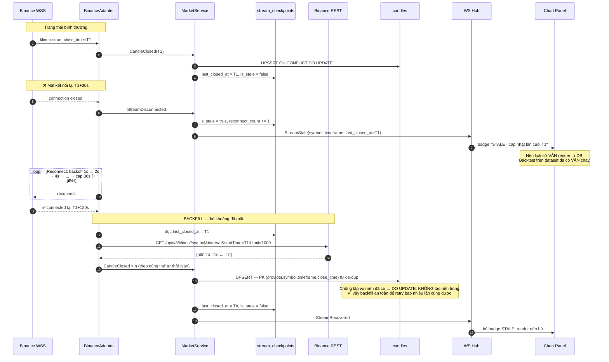

**Bốn bảo đảm của luồng này**

| Bảo đảm                        | Cơ chế                                                                                                     |
| ------------------------------ | ---------------------------------------------------------------------------------------------------------- |
| **0 nến đã đóng bị mất**       | `stream_checkpoints.last_closed_at` là điểm neo; backfill luôn bắt đầu từ đó, không từ "bây giờ"            |
| **0 nến trùng**                | `PRIMARY KEY (provider, symbol, timeframe, close_time)` + `ON CONFLICT DO UPDATE` — de-dup ở tầng DB, không ở tầng code |
| **Không reconnect storm**      | Capped exponential backoff + jitter. Không retry ngay lập tức (làm Binance ban IP nhanh hơn)                |
| **UI biết mình đang xem dữ liệu cũ** | `is_stale` + `last_closed_at` đẩy ra client. Im lặng hiển thị nến cũ như thể là mới là cách tệ nhất |

**Chi tiết dễ bỏ sót**: nến `provisional` (`x: false`) được đẩy tới UI để chart mượt, nhưng **không** ghi vào `candles`. Nếu ghi, thì mỗi tick sẽ UPDATE cùng một row hàng chục lần/phút, và tệ hơn — nếu mất kết nối giữa lúc nến chưa đóng, DB sẽ giữ một nến dở dang như thể nó là nến đã đóng, làm backtest sai. Xem `specs/market-data.md`.

### 6.2 Strategy Flow — từ nến tới tín hiệu composite

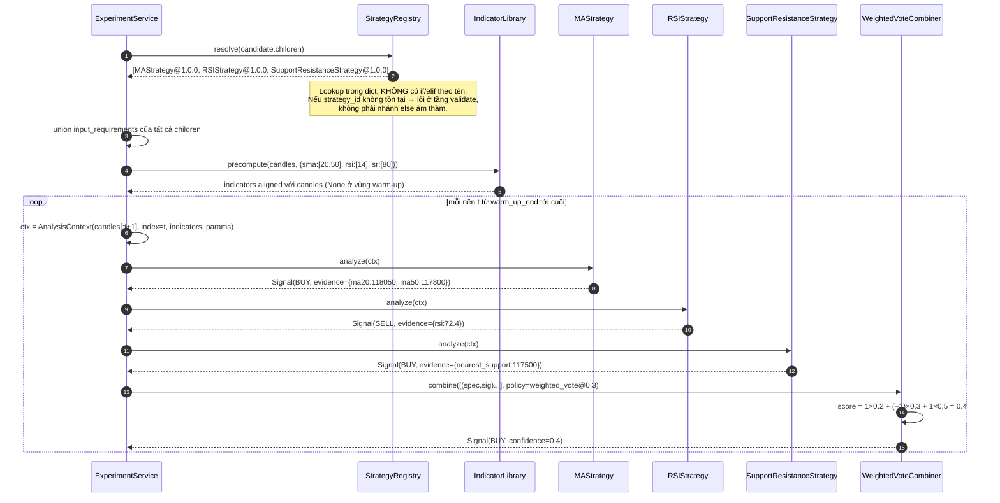

**Bốn quyết định đáng giải thích trong luồng này**

1. **Indicator tính trước, một lần, cho cả run.** Nếu mỗi strategy tự tính SMA20 trong `analyze()` thì với 20.000 nến × 3 strategy ta tính lại SMA 60.000 lần. Precompute một lần rồi truyền qua `indicators` giảm nó xuống 1 lần. Đây là lý do `input_requirements` tồn tại trong metadata: engine biết cần tính gì **trước khi** chạy vòng lặp.

2. **Warm-up period được tôn trọng.** MA50 không có giá trị ở nến thứ 10. Indicator trả `None` ở vùng warm-up, và vòng lặp bắt đầu từ `warm_up_end = max(warm_up của mọi child)`. Bỏ qua chi tiết này sẽ tạo trade giả ở đầu dataset — một lỗi rất phổ biến và làm Return sai đáng kể trên dataset ngắn.

3. **`candles[:t+1]` là slice, không phải toàn bộ.** Chống look-ahead ở tầng cấu trúc dữ liệu. Strategy *không thể* đọc nến tương lai vì nó không có chúng trong tay.

4. **`child_signals` được ghi lại.** `run_signals.child_signals` lưu `{"ma_cross":"BUY","rsi":"SELL","support_resistance":"BUY","score":0.4}`. Nhờ đó UI trả lời được "vì sao composite này BUY khi RSI nói SELL" mà không cần chạy lại — và đó là điều biến §25 của đề bài (*"phải cho phép người dùng hiểu strategy đã làm gì"*) thành hiện thực.

### 6.3 Search/Backtest Flow — vòng lặp có kiểm soát

Đây là luồng trung tâm của đồ án (§23, §24) và là luồng phức tạp nhất.

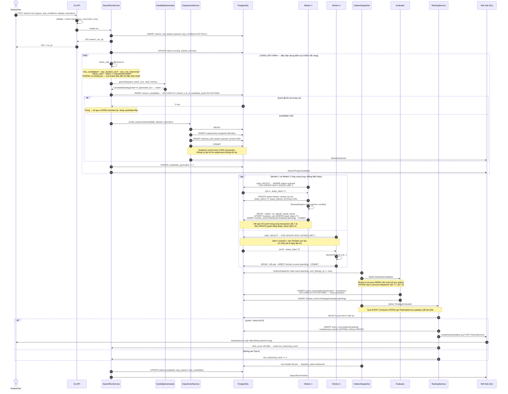

**Điều kiện dừng — tại sao là bắt buộc ở tầng schema**

Đề bài nói thẳng: *"Không được để `while(true)` chạy vô hạn mà không kiểm soát."* Ta thực thi điều đó ở **3 lớp**:

| Lớp                 | Cơ chế                                                                                          |
| ------------------- | ----------------------------------------------------------------------------------------------- |
| Schema              | `CHECK (stop_conditions ? 'max_candidates' OR ? 'max_duration_sec' OR ? 'max_non_improving')` — không INSERT được run không có stop condition |
| API validation      | `POST /search-runs` reject `422` nếu thiếu; quota giới hạn `max_candidates ≤ user_quotas.max_candidates_per_run` |
| Runtime             | `check_stop_conditions()` chạy ở **đầu** mỗi vòng, trước khi generate. Không có nhánh nào bỏ qua nó |

Bốn loại stop condition và ý nghĩa từng loại:

- `max_candidates` — chặn theo khối lượng. Đơn giản nhất, dễ dự đoán nhất.
- `max_duration_sec` — chặn theo thời gian tường. Cần thiết vì thời gian/candidate thay đổi theo độ phức tạp composite.
- `max_non_improving` — chặn theo hiệu quả. Đây là stop condition "thông minh" nhất: nếu 50 candidate liên tiếp không cải thiện Top-1, search space có lẽ đã cạn.
- `max_failure_rate` — chặn theo an toàn. Nếu 30% candidate fail thì có gì đó sai (dataset lỗi, strategy bug) — dừng và báo, không đốt CPU thêm.

**Pause / Resume / Cancel — state machine**

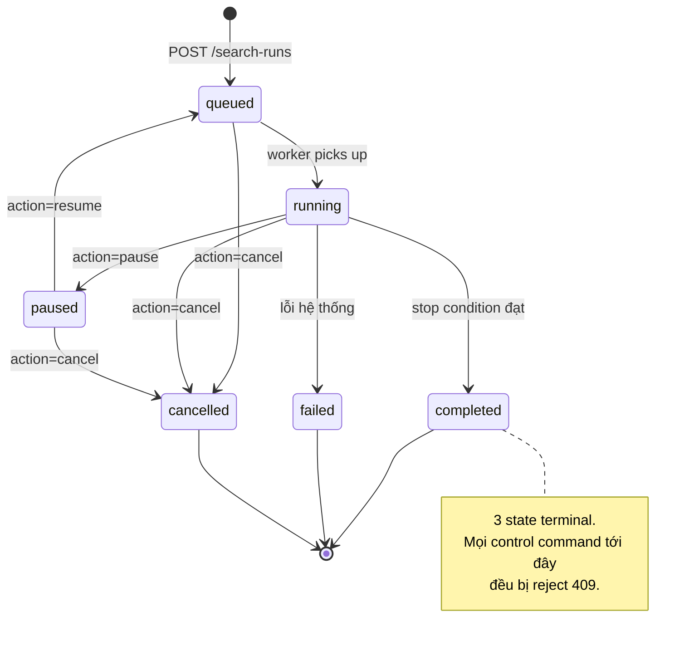

Idempotency của control command: client gửi `command_id`; `search_actions.command_id` là `UNIQUE`. Gửi lại `pause` cùng `command_id` → INSERT conflict → trả về kết quả lần đầu, không đổi state lần hai. Chuyển state dùng optimistic lock qua `search_runs.lock_version` để hai `pause` đồng thời từ hai tab không đẩy run vào trạng thái không xác định.

**Vì sao `FOR UPDATE SKIP LOCKED` là lựa chọn đúng cho job queue này**

| Cách                       | Vấn đề                                                                                       |
| -------------------------- | -------------------------------------------------------------------------------------------- |
| `SELECT ... FOR UPDATE`    | Worker 2 **chờ** Worker 1 nhả lock → serialize, mất hết lợi ích của multi-worker              |
| `UPDATE ... RETURNING` không lock | Race: 2 worker cùng đọc `status='queued'` rồi cùng UPDATE → 1 job chạy 2 lần            |
| Advisory lock              | Được, nhưng phải tự quản lý key space và tự xử lý worker chết                                  |
| **`FOR UPDATE SKIP LOCKED`** ✅ | Worker 2 **bỏ qua** row đang bị lock, nhận row tiếp theo ngay. Đúng semantics competing consumer. |

Cộng thêm `lease_expires_at`: worker chết giữa job (OOM, container killed) → lease hết hạn → một job sweeper (hoặc điều kiện trong query claim) đưa job về `queued` với `attempt += 1`. Sau `max_attempts` thì `status='failed'` với `last_error`. Không có job nào bị treo mãi ở `leased`.

### 6.4 News → Sentiment Flow (Data Flow phụ, cô lập hoàn toàn)

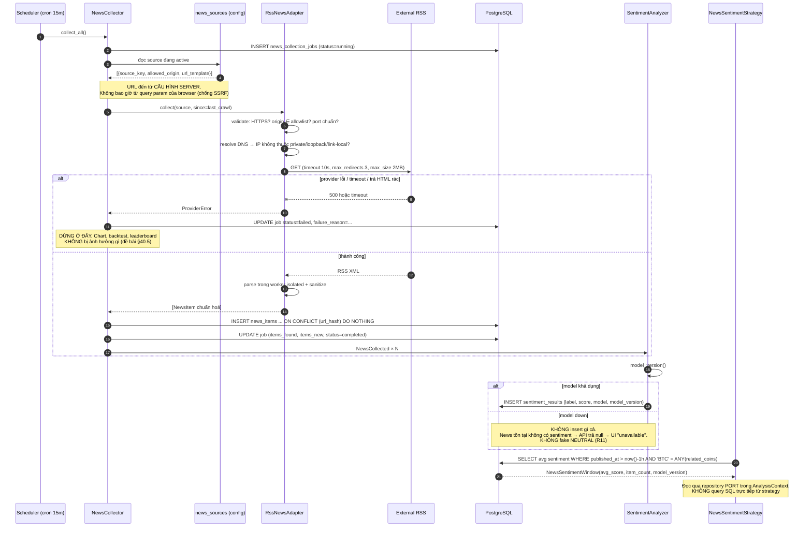

**Ba ranh giới được thực thi trong luồng này**

1. **Crawler không biết ML tồn tại.** `RssNewsAdapter` không import gì liên quan tới model. Nó publish `NewsCollected` và xong việc. Đây là anti-pattern §44 ("Crawler phụ thuộc chặt vào ML") bị chặn ở tầng import graph — kiểm chứng được bằng một test static: `assert "predictor" not in imports_of("news/adapters/rss.py")`.

2. **Sentiment không biết strategy tồn tại.** Nó ghi `sentiment_results` và xong. `NewsSentimentStrategy` là consumer sau này, qua DB, qua port. Vì vậy đổi model (§40.6) **không** ảnh hưởng Strategy Engine — miễn là `Sentiment` value object giữ nguyên 4 field (`label`, `score`, `model`, `model_version`).

3. **Strategy không query SQL.** Aggregate được `NewsService` tính và đưa vào `AnalysisContext` (§5.2). Strategy chỉ đọc `ctx.news_sentiment`.

**SSRF — tại sao đây là rủi ro thật, không phải lý thuyết**

Nếu API cho phép `POST /news/collect?url=...`, thì attacker gửi `url=http://169.254.169.254/latest/meta-data/` (cloud metadata) hoặc `url=http://localhost:5432` (port scan nội bộ) và dùng server làm proxy. Cách chặn duy nhất đáng tin: **không nhận URL từ client**. User chỉ chọn `source_id` từ danh sách đã cấu hình. Kèm theo: validate lại origin **sau mỗi redirect và sau khi resolve DNS** (vì DNS rebinding có thể trả IP private ở lần resolve thứ hai). Chi tiết ở `specs/news.md`.

---

## 7. Thiết kế kiểm soát truy cập

### 7.1 Mô hình: RBAC + Ownership check

Hệ thống dùng **RBAC 3 role** kết hợp **ownership check** trên resource.

**Vì sao RBAC, không ABAC**: chỉ có 3 role và quyền phụ thuộc gần như hoàn toàn vào vai trò, không vào thuộc tính động (thời gian, địa điểm, phòng ban). ABAC ở đây thêm policy engine mà không giải quyết vấn đề nào.

**Vì sao cần thêm ownership**: RBAC một mình không đủ. Hai `RESEARCHER` cùng role, nhưng A không được đọc experiment của B, không được cancel search run của B. Đây là quyền theo *quan hệ sở hữu*, không theo role — nên phải là một lớp kiểm tra riêng.

### 7.2 Các role và quyền

| Role         | Mô tả                                | Quyền chính                                                                                        |
| ------------ | ------------------------------------ | -------------------------------------------------------------------------------------------------- |
| `RESEARCHER` | Người phân tích (mặc định khi đăng ký) | Đọc market/strategy/leaderboard/news; tạo experiment và search run **của mình**; đọc/điều khiển resource **của mình** |
| `OPERATOR`   | Người vận hành hệ thống              | Toàn bộ quyền RESEARCHER + đọc **mọi** run + `pause/resume/cancel` **mọi** search run + đọc `/metrics` |
| `ADMIN`      | Quản trị                             | Toàn bộ quyền OPERATOR + quản lý user/role/quota + quản lý `news_sources` + quản lý `score_policies` |

**Vì sao `OPERATOR` được cancel run của người khác**: kịch bản thật — một search run của user A đang chiếm hết worker và làm hệ thống chậm; operator phải dừng được nó mà không cần credential của A. Nếu chỉ có owner mới cancel được thì sự cố này không xử lý được ngoài việc kill container. Mọi hành động như vậy để lại vết trong `search_actions.actor_id`.

**Vì sao `news_sources` chỉ ADMIN sửa được**: thêm một source là thêm một origin vào allowlist egress. Đó là quyết định bảo mật (SSRF surface), không phải cấu hình nội dung.

### 7.3 Ma trận quyền trên endpoint

| Endpoint                                     | Anonymous | RESEARCHER      | OPERATOR       | ADMIN |
| -------------------------------------------- | --------- | --------------- | -------------- | ----- |
| `GET /markets/pairs` · `/candles` · `/chart-overlays` · `/status` | ✅ (rate-limited) | ✅ | ✅ | ✅ |
| `GET /markets/stream` (WebSocket)            | ✅ (≤ 8 sub/conn) | ✅ (≤ 16)  | ✅             | ✅    |
| `GET /strategies`                            | ✅        | ✅              | ✅             | ✅    |
| `GET /leaderboard` · `/{id}/provenance`      | ✅        | ✅              | ✅             | ✅    |
| `GET /news` · `/news/aggregate`              | ✅        | ✅              | ✅             | ✅    |
| `POST /experiments`                          | ❌        | ✅ (owner=self) | ✅             | ✅    |
| `GET /experiments/{id}` (+ `/trades`, `/equity`, `/overlays`) | ❌ | ✅ **chỉ của mình** | ✅ mọi | ✅ mọi |
| `POST /search-runs`                          | ❌        | ✅ (theo quota) | ✅             | ✅    |
| `GET /search-runs/{id}`                      | ❌        | ✅ **chỉ của mình** | ✅ mọi     | ✅ mọi |
| `POST /search-runs/{id}/actions`             | ❌        | ✅ **chỉ của mình** | ✅ mọi     | ✅ mọi |
| `POST /ai/predict`                           | ❌        | ✅ (rate-limited per user) | ✅  | ✅    |
| `GET /metrics`                               | ❌        | ❌              | ✅             | ✅    |
| `POST /admin/users` · `/quotas`              | ❌        | ❌              | ❌             | ✅    |
| `POST /admin/news-sources`                   | ❌        | ❌              | ❌             | ✅    |
| `POST /admin/score-policies`                 | ❌        | ❌              | ❌             | ✅    |
| `GET /healthz` · `/readyz`                   | ✅        | ✅              | ✅             | ✅    |

**Vì sao market data và leaderboard mở cho anonymous**

Đây là dữ liệu công khai từ Binance và kết quả mô phỏng — không có gì bí mật. Bắt đăng nhập để xem chart chỉ thêm ma sát cho demo. Nhưng anonymous access **có rate limit chặt hơn** và **không** tạo được work (experiment/search) — vì work tiêu CPU và một anonymous endpoint tạo được job là một DoS vector hiển nhiên.

**Vì sao `POST /ai/predict` cần auth** dù nó chỉ là endpoint tương thích: mỗi call là một model inference. Không auth = không rate limit theo principal = ai cũng đốt được CPU/GPU của hệ thống.

### 7.4 Defense in Depth — 4 lớp

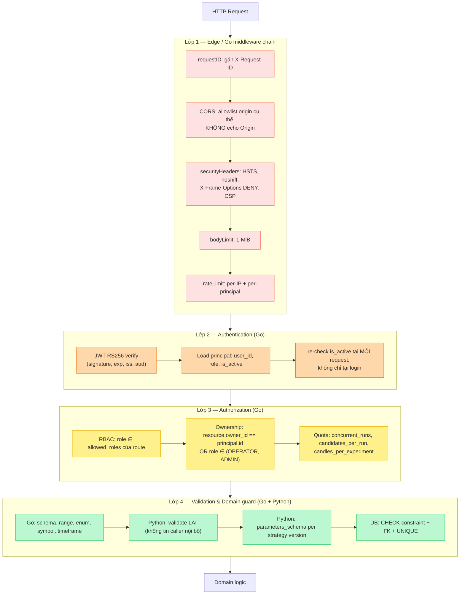

**Lớp 4 validate hai lần — có phải dư thừa?**

Không. Python service là một process riêng có port riêng. Nếu nó chỉ tin Go đã validate, thì bất kỳ ai vào được internal network (container khác bị compromise, port bị publish nhầm khi dev) đều gọi được trực tiếp với payload bất kỳ. Đây chính xác là lỗi mà scaffold hiện tại đang có: `docker-compose.yml` publish `${AI_PORT:-8000}:8000` — tiện cho dev, nhưng ở topology production phải bỏ. Blueprint ghi rõ điều này ở §13.

**Chi tiết cụ thể về CORS trong scaffold hiện tại**

Code hiện có (`server/internal/httpapi/handler.go`, hàm `withCORS`) **echo lại Origin** của request. Nghĩa là mọi website đều gọi được API này. Ở MVP không có cookie nên chưa khai thác được nhiều, nhưng khi thêm session cookie thì đây thành lỗ CSRF. Blueprint yêu cầu đổi sang allowlist tường minh từ `CORS_ALLOWED_ORIGINS` (danh sách, so sánh chính xác), và trả về đúng origin đã khớp — không phải echo.

### 7.5 Xác thực — JWT RS256 + refresh token

| Thành phần    | Quyết định                                                   | Lý do                                                                       |
| ------------- | ------------------------------------------------------------ | --------------------------------------------------------------------------- |
| Access token  | JWT **RS256**, TTL **15 phút**, claim `sub`, `role`, `jti`, `exp`, `iss`, `aud` | Go verify bằng public key, không cần gọi DB mỗi request. RS256 (không HS256) để Python/worker verify được mà không giữ signing key |
| Refresh token | Random 32 byte, lưu **sha256 hash** trong DB, TTL **7 ngày**, rotate mỗi lần dùng | Revoke được thật (xoá row). Lưu hash để DB leak không cho mượn được token |
| Vị trí lưu    | `HttpOnly` + `Secure` + `SameSite=Strict` cookie              | Không cho JS đọc → XSS không đánh cắp được token                             |
| CSRF          | Synchronizer token + strict `Origin` check trên mọi state-changing request | Vì dùng cookie, phải chống CSRF. `SameSite=Strict` là lớp một, token là lớp hai |
| Revoke        | Xoá `refresh_tokens` row + `is_active=false` trên user        | Access token còn hiệu lực ≤ 15 phút. Chấp nhận được — đánh đổi với việc phải blacklist `jti` cho mọi request |
| Password      | **argon2id**                                                 | Chống GPU brute-force tốt hơn bcrypt ở cùng chi phí                          |

**Đánh đổi được chấp nhận có ý thức**: sau khi revoke, access token vẫn dùng được tối đa 15 phút. Cách khắc phục là blacklist `jti` trên Redis và check mỗi request — nhưng điều đó (a) thêm một dependency bắt buộc, (b) biến mỗi request thành một round-trip Redis, (c) làm mất tính stateless của JWT. Với hệ thống nghiên cứu không giữ tiền, 15 phút là cửa sổ chấp nhận được. Nếu sau này có tính năng nhạy cảm hơn thì `is_active` re-check ở Lớp 2 đã là lối vào để siết chặt.

Hai chi tiết cài đặt bắt buộc, nếu thiếu thì thiết kế tự phản lại chính nó:

- **Cache principal 30 giây.** Lớp 2 re-check `is_active` ở mỗi request, nhưng nếu mỗi request là một round-trip DB thì ta vừa phá đúng lý do chọn JWT stateless. TTL 30 s giữ được cả hai: cửa sổ vô hiệu hoá tối đa 30 s (ngắn hơn nhiều so với 15 phút của token) và tải DB không tăng theo số request.
- **Giới hạn 4 phép `argon2id` song song.** `argon2id` với `m=64MiB` là lựa chọn đúng để chống brute-force, nhưng 50 request login đồng thời = 3.2 GB RAM. Đây là một memory-exhaustion vector thật, và nó đến từ chính quyết định bảo mật ở trên. Semaphore 4 phép song song; request thứ 5 chờ trong hàng đợi có deadline.

Chi tiết đầy đủ về middleware chain, refresh rotation với reuse detection, và CSRF ở `specs/auth.md`.

---

## 8. Thiết kế các cơ chế bảo vệ hệ thống

Đề bài liệt kê 7 architectural driver (§32). Bốn cơ chế dưới đây là câu trả lời trực tiếp cho 4 driver khó nhất: **Modifiability, Scalability, Performance, Observability**.

### 8.1 Bảo vệ khả năng mở rộng — Plugin Registry (§32.1 Modifiability)

**Vấn đề**: kiến trúc coupling cao khiến thêm 1 strategy phải sửa Controller, Backtester, UI, Database, Combination Engine, Evaluator (đề bài §41). Giảng viên sẽ kiểm tra điều này **tại chỗ**.

**Giải pháp**: Registry tự đăng ký bằng decorator + metadata khai báo.

```python
# app/domain/strategy/registry.py
_REGISTRY: dict[tuple[str, str], type[Strategy]] = {}

def register_strategy(cls: type[Strategy]) -> type[Strategy]:
    d = cls().definition()
    key = (d.strategy_id, d.version)
    if key in _REGISTRY:
        raise DuplicateStrategyError(f"{key} đã được đăng ký")
    _REGISTRY[key] = cls
    return cls

def resolve(strategy_id: str, version: str) -> type[Strategy]:
    try:
        return _REGISTRY[(strategy_id, version)]
    except KeyError:
        # Lỗi tường minh ở tầng validate — KHÔNG có nhánh else âm thầm
        raise UnknownStrategyError(strategy_id, version)

def all_definitions() -> list[StrategyDefinition]:
    return [cls().definition() for cls in _REGISTRY.values()]
```

Thêm MACD — **toàn bộ diff**:

```python
# app/domain/strategy/plugins/macd.py   ← FILE MỚI DUY NHẤT
@register_strategy
class MACDStrategy:
    def definition(self) -> StrategyDefinition:
        return StrategyDefinition(
            strategy_id="macd",
            version="1.0.0",
            family="trend",
            parameters_schema={
                "fast_period":   {"type": "integer", "minimum": 2, "default": 12},
                "slow_period":   {"type": "integer", "minimum": 3, "default": 26},
                "signal_period": {"type": "integer", "minimum": 2, "default": 9},
            },
            input_requirements=["candles.close", "indicator.ema"],
            overlay_types=["macd_line", "macd_signal", "buy_signal", "sell_signal"],
            warm_up_candles=lambda p: p["slow_period"] + p["signal_period"],
        )

    def analyze(self, ctx: AnalysisContext) -> Signal:
        macd = ctx.indicators["macd_line"][ctx.index]
        sig  = ctx.indicators["macd_signal"][ctx.index]
        prev_macd = ctx.indicators["macd_line"][ctx.index - 1]
        prev_sig  = ctx.indicators["macd_signal"][ctx.index - 1]
        if None in (macd, sig, prev_macd, prev_sig):
            return Signal("HOLD")
        if prev_macd <= prev_sig and macd > sig:
            return Signal("BUY", evidence={"macd": macd, "signal": sig})
        if prev_macd >= prev_sig and macd < sig:
            return Signal("SELL", evidence={"macd": macd, "signal": sig})
        return Signal("HOLD")
```

**Không phải sửa gì** — và đây là danh sách cụ thể để kiểm chứng bằng `git diff --stat`:

| Component            | Vì sao không phải sửa                                                        |
| -------------------- | ---------------------------------------------------------------------------- |
| Registry             | Decorator tự đăng ký khi module được import (package `__init__` auto-discover) |
| `SignalCombiner`     | Nó nhận `list[Signal]`, không quan tâm signal đến từ strategy nào             |
| `BacktestEngine`     | Nó gọi `strategy.analyze(ctx)` qua Protocol, không biết concrete type         |
| `Evaluator`          | Nó nhận `BacktestResult`, không biết strategy nào sinh ra                     |
| `RankingService`     | Nó nhận `Evaluation`                                                          |
| Go API `/strategies` | Nó trả `all_definitions()` — MACD tự xuất hiện                                |
| DB schema            | `strategy_definitions` + `strategy_versions` là **dữ liệu**, không phải cột mới. Startup tự upsert metadata |
| UI                   | Form param sinh từ `parameters_schema` (JSON Schema → form). MACD tự có form đúng |
| Search space         | `RandomSearchGenerator` đọc `all_definitions()`; MACD tự vào không gian tìm kiếm |

**Bốn ràng buộc để plugin không phá hệ thống** (R7):

1. **Sandbox timeout.** `analyze()` chạy với deadline; vượt → `candidate.status='failed'`, `failure_reason='strategy_timeout'`, search run **tiếp tục**. Một strategy có vòng lặp vô hạn không được phép giết cả run.
2. **Exception isolation.** `ZeroDivisionError`, `IndexError` trong plugin bị catch ở biên gọi, log kèm `strategy_id@version`, candidate đánh fail. Không propagate lên làm crash worker.
3. **`warm_up_candles` bắt buộc khai báo.** Engine dùng nó để biết bắt đầu vòng lặp từ đâu. Không khai báo → registry reject lúc startup.
4. **`code_fingerprint` check.** Sửa code mà quên bump version → **fail fast lúc startup**, không chạy với provenance sai (§4.2).

### 8.2 Bảo vệ tài nguyên — Quota, Rate Limit và Bounded Input

**Vấn đề**: một search run với `max_candidates=100000` chiếm toàn bộ worker trong nhiều giờ. Một request `GET /candles?from=2017&timeframe=1m` load 4.7M nến vào RAM. Một client retry vòng lặp tạo hàng nghìn experiment.

Đây **không** phải bài toán "12K user đồng thời" như hệ thống đăng ký — tải ở đây là **CPU-bound và long-running**, nên phòng thủ phải khác: không chỉ giới hạn *số request*, mà giới hạn *khối lượng công việc mỗi request tạo ra*.

| Control                     | Ngưỡng                                                | Vượt thì sao                                    |
| --------------------------- | ----------------------------------------------------- | ----------------------------------------------- |
| Rate limit per-IP (public reads) | 120 req/phút, burst 30                           | `429` + `Retry-After`                           |
| Rate limit per-principal (writes) | `POST /experiments`: 30/phút; `POST /search-runs`: 5/phút | `429` + `Retry-After`                  |
| Rate limit `POST /ai/predict` | 20/phút/principal                                    | `429`                                           |
| WebSocket subscription      | ≤ 8 (anonymous) / ≤ 16 (auth) mỗi connection          | Frame `{"error":"subscription_limit"}`, không đóng conn |
| WebSocket connection        | ≤ 4 mỗi IP                                            | `429` khi handshake                             |
| **Concurrent search run**   | `user_quotas.max_concurrent_runs` (default **2**)     | `409 concurrent_run_limit`                      |
| **Candidate mỗi run**       | `max_candidates_per_run` (default **500**)            | `422` với ngưỡng thực tế trong message          |
| **Nến mỗi experiment**      | `max_candles_per_experiment` (default **20.000**)     | `422 dataset_too_large`                         |
| Nến mỗi API response        | 1000                                                  | `422 range_too_large`, kèm gợi ý chia range     |
| Equity point mỗi response   | 2000 (downsample)                                     | Tự decimate, không lỗi                          |
| Request body                | 1 MiB                                                 | `413`                                           |
| Outbound Binance REST       | Token bucket theo **weight** (Binance dùng weight, không dùng count) | Chờ trong hàng đợi outbound; nếu vượt deadline → `502` |

**Thuật toán rate limit: Token Bucket**

| Thuật toán             | Ưu                                     | Nhược                                       | Quyết định                              |
| ---------------------- | -------------------------------------- | ------------------------------------------- | --------------------------------------- |
| Fixed Window           | Đơn giản nhất                          | Burst gấp đôi tại biên cửa sổ               | Loại                                    |
| Sliding Window Log     | Chính xác nhất                         | Lưu timestamp từng request → tốn memory     | Loại                                    |
| Leaky Bucket           | Output smooth                          | Không cho burst hợp lệ                      | Loại — user mở dashboard cần burst 5 request cùng lúc |
| **Token Bucket** ✅     | Cho burst nhỏ + giới hạn long-term, O(1) memory | Cần atomic op khi shared             | **Chọn**                                 |

MVP: in-memory token bucket trong Go (1 instance API). Khi scale ngang API: chuyển sang Redis + Lua script atomic (điều kiện ở §12.0). Interface `RateLimiter` không đổi.

**Vì sao quota quan trọng hơn rate limit ở hệ thống này**

Rate limit chặn 5 `POST /search-runs`/phút. Nhưng **một** search run hợp lệ với 500 candidate × 40 s = 5,5 giờ CPU. Rate limit không giúp gì ở đây. `max_concurrent_runs` và `max_candidates_per_run` mới là control thật. Đây là điểm khác biệt cốt lõi so với hệ thống web CRUD thông thường: đơn vị tài nguyên cần bảo vệ là **worker-second**, không phải **request**.

**Outbound rate limit — cái dễ bị quên**

Binance dùng hệ thống **weight**: `/api/v3/klines` với `limit=1000` tốn weight 2, giới hạn 1200 weight/phút/IP. Vượt → `429`, tiếp tục vượt → **`418` và ban IP tạm thời**. Nghĩa là một backfill loop không kiểm soát có thể làm hệ thống mất market data hoàn toàn trong nhiều phút. Vì vậy `BinanceAdapter` có token bucket **outbound** theo weight, và mọi call đi qua nó. Khi chạy nhiều worker, bucket này phải shared (Redis) — nếu không, 4 worker × 1200 weight = ban chắc chắn. Đây là điều kiện (b) ở §12.0 khiến Redis trở thành bắt buộc.

### 8.3 Bảo vệ khả năng scale — Job Queue với contract cố định (§32.5 Performance, §43)

**Vấn đề (đề bài §43)**: 1 worker × 2 giây/candidate × 10.000 candidate = 20.000 giây ≈ 5,5 giờ.

**Giải pháp**: job contract cố định từ ngày đầu; scale là đổi số replica, không đổi code.

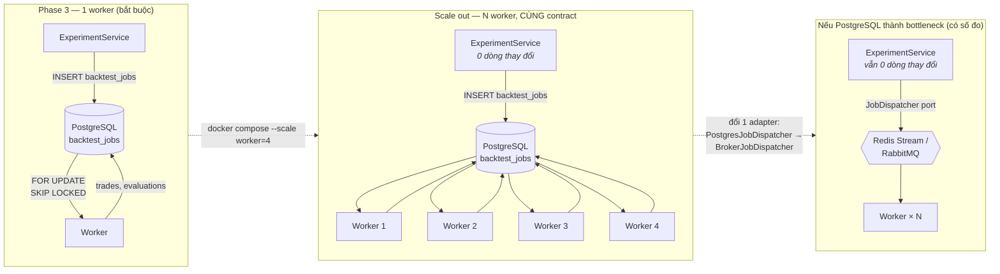

**Điều gì không đổi qua cả 3 giai đoạn**

- `ExperimentSnapshot` format — không đổi.
- `BacktestJob` record shape — không đổi.
- Event `BacktestQueued/Started/Completed/Failed` payload — không đổi.
- Public API contract — không đổi.
- DB schema (trừ việc `backtest_jobs` có thể ngừng dùng) — không đổi.
- `BacktestEngine.run()` — không đổi. **Đây là điểm quan trọng nhất**: worker và inline dùng cùng một hàm.

Đề bài yêu cầu giải thích *"công nghệ đó giải quyết vấn đề kiến trúc nào?"* (§38). Câu trả lời cho queue: nó giải quyết vấn đề **long-running CPU-bound work không được chiếm HTTP request và phải song song hoá được**. Câu trả lời cho việc *chưa* dùng broker: PostgreSQL `SKIP LOCKED` đã giải quyết đúng vấn đề đó với 0 service thêm vào; broker chỉ cần khi throughput vượt khả năng của một PostgreSQL — và điều đó phải **đo** rồi mới kết luận.

#### 8.3.1 Lease token — quy tắc retry và take-over duy nhất

Đây là section chuẩn cho retry backtest. Mọi tài liệu khác (`specs/experiment.md`, `specs/search-loop.md`) tham chiếu về đây thay vì mô tả lại.

**Vấn đề cần giải quyết chính xác.** Lease là *heuristic*: nó dựa trên đồng hồ và heartbeat, nên sẽ có lúc sai. Ba tình huống trông giống nhau từ phía DB nhưng cần ba phản ứng khác nhau:

| Tình huống | Thực tế | Phản ứng đúng |
| ---------- | ------- | ------------- |
| **(a) Duplicate active worker** | Worker 1 vẫn sống (GC pause dài, network partition ngắn) nhưng lease đã hết hạn; Worker 2 claim được | Worker 2 **tiếp quản**. Worker 1 phải **tự dừng** khi phát hiện mất lease, và mọi ghi của nó bị từ chối. |
| **(b) Retry sau lease expiry thật** | Worker 1 đã chết (OOM-kill, container killed) | Worker 2 **tiếp quản** và chạy lại từ đầu. |
| **(c) Job đã hoàn thành** | Run đã `completed`; job bị claim lại do lỗi logic hoặc can thiệp tay | Worker 2 **không chạy lại**, đọc kết quả và đánh job `completed`. |

Phân biệt (a) với (b) là **không thể** và cũng **không cần** — cả hai đều dẫn tới cùng một hành động: worker claim được lease mới là chủ sở hữu duy nhất. Điều cần thiết là mọi ghi phải được **guard bằng lease token**, để worker cũ trong ca (a) không ghi đè kết quả của worker mới.

**Cơ chế: `lease_token` mới mỗi lần claim.**

```sql
-- Worker claim job: atomic, không race, không chờ nhau.
-- gen_random_uuid() sinh lease_token MỚI cho mỗi lượt claim — đây là chìa khoá.
WITH claimed AS (
    SELECT id
    FROM backtest_jobs
    WHERE status = 'queued'
       OR (status = 'leased' AND lease_expires_at < now())  -- thu hồi lease của worker đã chết
    ORDER BY priority ASC, enqueued_at ASC
    FOR UPDATE SKIP LOCKED
    LIMIT 1
)
UPDATE backtest_jobs j
SET status           = 'leased',
    leased_by        = $1,
    lease_token      = gen_random_uuid(),
    lease_expires_at = now() + interval '120 seconds',
    attempt          = j.attempt + 1
FROM claimed c
WHERE j.id = c.id
RETURNING j.id, j.experiment_id, j.lease_token, j.attempt, j.max_attempts;
```

Worker giữ `lease_token` trong bộ nhớ. **Mọi** câu UPDATE sau đó — heartbeat, ghi kết quả, đánh completed/failed — đều có `AND lease_token = $token`. Đó là toàn bộ ý tưởng: token là bằng chứng "tôi là chủ lượt claim hiện tại", và nó **đổi** mỗi lần job được claim lại nên worker cũ không thể giả mạo.

**Bốn thao tác được guard**

```sql
-- 1. Heartbeat: gia hạn lease. Thất bại (0 row) = đã mất job → worker PHẢI dừng ngay.
UPDATE backtest_jobs
SET lease_expires_at = now() + interval '120 seconds'
WHERE id = $1 AND lease_token = $2 AND status = 'leased';

-- 2. Tiếp quản run: chỉ chủ lease hiện tại được ghi worker_id/lease_token lên run.
--    Không INSERT rồi bắt UNIQUE violation — dùng UPSERT có điều kiện tường minh.
INSERT INTO backtest_runs (experiment_id, status, worker_id, lease_token, attempt, started_at)
VALUES ($1, 'running', $2, $3, $4, now())
ON CONFLICT (experiment_id) DO UPDATE
SET status      = 'running',
    worker_id   = EXCLUDED.worker_id,
    lease_token = EXCLUDED.lease_token,
    attempt     = EXCLUDED.attempt,
    started_at  = now(),
    error_code  = NULL,
    error_detail = NULL
WHERE backtest_runs.status IN ('queued','running','failed')   -- KHÔNG tiếp quản run đã completed
RETURNING id, status;

-- 3. Ghi kết quả: guard bằng lease_token trên CẢ run và job, trong CÙNG transaction.
UPDATE backtest_runs
SET status = 'completed', duration_ms = $3, candles_read = $4,
    signals_count = $5, finished_at = now()
WHERE experiment_id = $1 AND lease_token = $2 AND status = 'running';

UPDATE backtest_jobs
SET status = 'completed', completed_at = now(), lease_token = NULL, lease_expires_at = NULL
WHERE experiment_id = $1 AND lease_token = $2;

-- 4. Nhả lease khi fail còn attempt: về queued, KHÔNG tăng attempt lần nữa (claim đã tăng).
UPDATE backtest_jobs
SET status = 'queued', leased_by = NULL, lease_token = NULL,
    lease_expires_at = NULL, last_error = $3
WHERE id = $1 AND lease_token = $2;
```

Ba điều mà `WHERE ... lease_token = $2` chặn được, và không có cách nào khác chặn:

- Worker cũ trong ca (a) hoàn thành backtest sau khi mất lease → UPDATE khớp **0 row** → nó biết mình đã mất job, log WARN, **không** ghi gì, thoát. Không có kết quả nào bị ghi đè.
- `ON CONFLICT ... WHERE status IN ('queued','running','failed')` chặn ca (c): run đã `completed` thì UPSERT không match → `RETURNING` rỗng → worker đọc run hiện có, đánh job `completed`, **không chạy lại engine**. Đây là chỗ tiết kiệm CPU thật khi job bị claim lại sau khi đã xong.
- Heartbeat khớp 0 row là **tín hiệu dừng bắt buộc**, không phải cảnh báo. Worker phải abort vòng lặp backtest tại nhịp heartbeat tiếp theo, không chạy tiếp cho hết.

**Điều kiện nhất quán quan trọng.** `backtest_runs.lease_token` luôn bằng `backtest_jobs.lease_token` của lượt claim đang chạy. Khi job hoàn thành, `backtest_jobs.lease_token` được set `NULL` nhưng `backtest_runs.lease_token` **giữ nguyên** — nó là vết của lượt claim đã tạo ra kết quả này, thuộc provenance (§4.2). Đây là lý do trường này nằm trên cả hai bảng chứ không chỉ trên job.

**Vì sao không chỉ dựa vào UNIQUE violation như phương án trước.** Bắt `UNIQUE (experiment_id)` violation rồi "bỏ job" trộn ba tình huống trên thành một phản ứng duy nhất, và phản ứng đó **sai cho ca (b)**: worker 1 đã chết để lại một row `status='running'` mồ côi; worker 2 bắt UNIQUE violation rồi bỏ job → run treo `running` vĩnh viễn, `SearchRunService` đếm mãi không đủ `candidates_tested`, search run không bao giờ đạt stop condition. Với `lease_token` + UPSERT có điều kiện, ca (b) là đường bình thường: tiếp quản, chạy lại, ghi kết quả.

**Heartbeat**: worker gia hạn `lease_expires_at` mỗi **30 s**, lease dài **120 s**. Tỉ lệ 4:1 cho phép mất ba nhịp liên tiếp (GC pause, DB chậm tức thời) mà job không bị thu hồi oan. Nếu worker chết, heartbeat dừng, lease hết hạn sau ≤ 120 s, job được worker khác claim với `attempt += 1` và `lease_token` mới. Sau `max_attempts` (3) → `status='failed'`, `last_error` ghi rõ, `backtest_runs.status='failed'`, và **candidate được đánh `failed` chứ không treo `queued` mãi**.

**Bất biến kiểm chứng được**

| # | Bất biến | Cách kiểm |
| - | -------- | --------- |
| I1 | Không có hai `backtest_runs` row cho cùng `experiment_id` | `UNIQUE (experiment_id)` |
| I2 | Không có job nào ở `leased` quá `lease_expires_at + 120 s` | Query giám sát; alert nếu có (§8.4) |
| I3 | Không có run nào ở `running` mà job tương ứng đã `completed`/`failed` | Query nhất quán chạy trong test tích hợp |
| I4 | Kết quả trên `backtest_runs` luôn của lượt claim cuối cùng thành công | `lease_token` khớp giữa run và lượt claim |
| I5 | Worker mất lease không ghi được gì | Test: force expire lease giữa job, xác nhận UPDATE khớp 0 row |

**Priority**: experiment tạo tay có `priority=100`, search candidate có `priority=200` (số nhỏ = ưu tiên cao). Lý do: user đang ngồi chờ kết quả một backtest cụ thể không nên bị xếp sau 500 candidate của một search run chạy nền.

### 8.4 Bảo vệ khả năng quan sát — Observability (§32.7)

**Vấn đề (đề bài §32.7)**: hệ thống nên biết — Loop đang chạy hay dừng? Đã thử bao nhiêu strategy? Backtest mất bao lâu? Có bao nhiêu job lỗi? Strategy nào đang đứng Top 1?

Đây là 5 câu hỏi cụ thể, nên thiết kế observability theo cách **mỗi câu có một signal trả lời trực tiếp**, không phải "cài Prometheus rồi tính sau".

| Câu hỏi §32.7                      | Metric / API trả lời                                                                                   |
| ---------------------------------- | ------------------------------------------------------------------------------------------------------ |
| Loop đang chạy hay dừng?           | `search_run_status{run_id}` gauge (0=queued,1=running,2=paused,3=terminal) · `GET /search-runs/{id}.status` |
| Đã thử bao nhiêu strategy?         | `search_candidates_total{run_id,outcome}` counter · `.candidates_tested`                                |
| Backtest mất bao lâu?              | `backtest_duration_seconds` histogram (label: `strategy_family`, `candle_count_bucket`)                 |
| Có bao nhiêu job lỗi?              | `backtest_jobs_failed_total{error_code}` counter · `.candidates_failed`                                 |
| Strategy nào đang Top 1?           | `leaderboard_top1_score{dataset_version}` gauge + label `strategy_id` · `GET /leaderboard?limit=1`      |

**Metric đầy đủ theo domain**

| Nhóm            | Metric                                                                                                  |
| --------------- | ------------------------------------------------------------------------------------------------------- |
| HTTP            | `http_requests_total{route,status}`, `http_request_duration_seconds{route}`                              |
| WebSocket       | `ws_connections_active`, `ws_subscriptions_active{symbol,timeframe}`, `ws_frames_sent_total`             |
| Market feed     | `market_stream_stale{symbol,timeframe}` gauge, `market_reconnects_total`, `market_last_closed_age_seconds`, `market_backfill_candles_total` |
| Provider        | `provider_requests_total{provider,operation,status}`, `provider_weight_used`, `provider_latency_seconds` |
| Job queue       | `jobs_queued`, `jobs_leased`, `jobs_completed_total`, `jobs_failed_total{error_code}`, `job_queue_wait_seconds` |
| Backtest        | `backtest_duration_seconds`, `backtest_candles_read`, `backtest_signals_generated`                       |
| Search          | `search_runs_active`, `search_candidates_total{outcome}`, `search_best_score`, `search_dedup_hits_total`  |
| Evaluation/Rank | `evaluations_total`, `leaderboard_updates_total`, `leaderboard_top1_score`                                |
| News/Sentiment  | `news_items_collected_total{source}`, `news_jobs_failed_total{source}`, `sentiment_analyzed_total{model_version}`, `sentiment_unavailable_total` |
| Strategy plugin | `strategy_analyze_errors_total{strategy_id,version}`, `strategy_timeout_total{strategy_id}`               |

**Correlation ID xuyên suốt**

```text
Browser  →  X-Request-ID: req_01JB2X9K7M4NQZ
  Go API   →  log{request_id}  →  header X-Correlation-ID sang Python
    Python   →  log{correlation_id}  →  domain_events.correlation_id
      Worker  →  đọc correlation_id từ experiment  →  log{correlation_id}
        UI     →  hiện request_id trong error toast
```

Nhờ đó: user báo "backtest của tôi lỗi", đọc `request_id` trên UI, `grep` một lệnh ra được toàn bộ chuỗi từ HTTP request tới worker exception. Không có correlation ID thì việc này là mò kim đáy bể qua 3 service.

**Cấu trúc log**

```json
{
  "level": "error",
  "ts": "2026-08-11T09:14:22.481Z",
  "service": "worker",
  "correlation_id": "req_01JB2X9K7M4NQZ",
  "experiment_id": "…",
  "search_run_id": "…",
  "strategy": "rsi@1.0.0",
  "event": "backtest_failed",
  "error_code": "strategy_timeout",
  "duration_ms": 30012
}
```

Structured JSON, không phải string nội suy. Lý do thực dụng: `error_code` phải query được để tính `jobs_failed_total{error_code}` — với log dạng text thì metric đó phải parse regex và sẽ vỡ khi ai đó đổi câu chữ.

**UI Progress panel — observability không chỉ là Prometheus**

Đề bài yêu cầu người dùng *thấy* được tiến trình (§46 bước 4). Panel search hiển thị realtime qua `SearchProgressUpdated`:

```text
┌─ Search Run #a3f8 ────────────────── ● RUNNING ─┐
│ Generator   random_search@1.0.0                 │
│ Dataset     binance-btcusdt-5m-20260101-0301    │
│ Stop        max_candidates=200 · max_dur=1800s  │
│                                                 │
│ Tested      127 / 200      ████████░░░░  63%    │
│ Queued      4    Running 2    Failed 3          │
│ Dedup hits  18  (bỏ qua, không backtest lại)    │
│ Elapsed     08:42   ETA ~05:01                  │
│                                                 │
│ Current     MA(50,200) + RSI(21) + SR(80)       │
│ Best        MA(20,50) + RSI(14) + SR(80)        │
│             score 84.2 · +18.2% · WR 61% · -6.1%│
│                                                 │
│         [ PAUSE ]  [ CANCEL ]                   │
└─────────────────────────────────────────────────┘
```

Bốn con số ở đây không có trong metric Prometheus nhưng quan trọng với người dùng: `Dedup hits` (search có đang lãng phí không), `ETA` (còn bao lâu), `Current` (đang làm gì — để biết nó không treo), `Best` (đã tìm được gì).

---

## 9. Anti-pattern và cách kiến trúc chặn từng cái

Đề bài §44 liệt kê 5 anti-pattern. Với mỗi cái: nó sai thế nào, kiến trúc chặn bằng gì, và **kiểm chứng bằng cách nào**. Điểm quan trọng là mỗi ràng buộc phải có cách kiểm tra tự động — quy ước chỉ nằm trong code review sẽ bị vi phạm sau vài tuần.

### 9.1 God Service

**Sai**: một `TradingService` vừa lấy Binance data, tính RSI, crawl news, chạy ML, backtest, rank, save DB, gửi WebSocket.

**Chặn bằng**: 6 module có ranh giới rõ (§2.3), mỗi module có một trách nhiệm và một cách vào duy nhất qua application service. Không có class nào chạm cả market data lẫn ranking.

**Kiểm chứng**:
```python
# tests/architecture/test_module_boundaries.py
FORBIDDEN = {
    "domain.strategy":  ["infrastructure", "sqlalchemy", "httpx", "fastapi"],
    "news.adapters":    ["sentiment", "predictor", "domain.strategy"],
    "domain.backtest":  ["fastapi", "httpx", "sqlalchemy"],
}
def test_no_forbidden_imports():
    for module, forbidden in FORBIDDEN.items():
        for imported in imports_of(module):
            assert not any(f in imported for f in forbidden), \
                f"{module} không được import {imported}"
```

Test này chạy trong CI. Vi phạm ranh giới **fail build**, không chờ ai để ý trong review.

### 9.2 Hard-coded Strategy

**Sai**: `if MA && RSI ... else if MA && Bollinger ... else if RSI && Bollinger ...`

**Chặn bằng**: Registry lookup (§8.1) + composite là **dữ liệu JSON**, không phải nhánh code. Số tổ hợp có thể biểu diễn là vô hạn với 0 nhánh `if`.

**Kiểm chứng**:
```python
def test_no_strategy_name_branching():
    """Không có file nào so sánh strategy_id với literal string."""
    pattern = re.compile(r'(strategy_id|strategy)\s*==\s*["\']')
    for path in glob("app/**/*.py"):
        if "/tests/" in path or "/plugins/" in path:
            continue   # plugin được phép biết tên chính nó
        assert not pattern.search(read(path)), f"{path} branch theo tên strategy"
```

### 9.3 Frontend chứa business logic

**Sai**: React tính trading strategy, backtest, profit, ranking.

**Chặn bằng**: `GET /markets/chart-overlays` trả series đã tính (§3.2). Frontend chỉ có code vẽ.

**Kiểm chứng**:
```javascript
// web/__tests__/no-domain-logic.test.ts
const FORBIDDEN_IDENTIFIERS = [
  'calculateRSI', 'computeSMA', 'bollingerBands',
  'backtest', 'winRate', 'maxDrawdown', 'sharpeRatio', 'profitFactor',
];
test('web không chứa domain calculation', () => {
  for (const file of glob('{app,components,lib}/**/*.{ts,tsx}')) {
    for (const id of FORBIDDEN_IDENTIFIERS) {
      expect(read(file)).not.toContain(id);
    }
  }
});
```

Lưu ý điều này **không** cấm frontend format số (`18.2%`) hay vẽ đường. Nó cấm frontend *tính ra* con số đó.

### 9.4 Strategy truy cập trực tiếp Database

**Sai**: `RSIStrategy → MySQL`.

**Chặn bằng**: `AnalysisContext` là frozen dataclass **không chứa session, không chứa repository, không chứa HTTP client** (§5.2). Strategy vật lý không có đường ra ngoài.

**Kiểm chứng** — cách mạnh nhất là test chạy strategy trong môi trường không có DB:
```python
def test_strategy_runs_without_infrastructure(monkeypatch):
    """Strategy phải chạy được khi DB và network đều không tồn tại."""
    monkeypatch.setattr("socket.socket", _raise_on_use)   # mọi network call → lỗi
    monkeypatch.delenv("DATABASE_URL", raising=False)

    ctx = AnalysisContext(
        symbol="BTCUSDT", timeframe="5m",
        candles=FIXTURE_CANDLES, index=100,
        indicators={"rsi": FIXTURE_RSI},
        news_sentiment=None,
        params={"period": 14, "buy_threshold": 30, "sell_threshold": 70},
    )
    assert RSIStrategy().analyze(ctx).action in ("BUY", "SELL", "HOLD")
```

Nếu ai đó thêm một query SQL vào strategy, test này fail ngay.

### 9.5 Crawler phụ thuộc chặt vào ML

**Sai**: `Crawler → BERT model`.

**Chặn bằng**: `NewsCollector` publish `NewsCollected` và kết thúc. `SentimentAnalyzer` là consumer riêng, chạy sau, có thể chết mà không ảnh hưởng crawler (§6.4).

**Kiểm chứng**: đã có trong `test_no_forbidden_imports` (§9.1) — `news.adapters` không được import `sentiment` hay `predictor`. Cộng thêm một integration test: stop sentiment service, chạy news collection, assert `news_items` có row mới và `sentiment_results` không có row nào (chứ không phải có row `NEUTRAL`).

### 9.6 Ba anti-pattern bổ sung mà đề bài không nêu nhưng dự án này dễ mắc

**a. Leaderboard entry mutable**

Nếu `leaderboard_entries` là bảng UPDATE (entry tốt hơn ghi đè entry cũ), thì lịch sử thứ hạng mất và entry biến thành "bản copy của strategy hiện tại" — phá provenance. Chặn bằng: append-only + `UNIQUE (evaluation_id, score_policy_version)` (§4.1 phương án C).

**b. Overlay tính hai nơi**

Nếu overlay live tính ở frontend nhưng overlay của backtest result tính ở backend, hai loại marker trên cùng chart có hai nguồn chân lý và có thể lệch nhau. Chặn bằng: **mọi** overlay từ backend, một code path duy nhất (§3.2).

**c. Fake data khi dependency down**

Trả `sentiment: NEUTRAL` khi model chết, hay trả nến provisional như nến đã đóng khi WebSocket mất, đều là cùng một lỗi: **biến "không biết" thành "biết một giá trị cụ thể"**. Hệ quả là strategy tính trên dữ liệu giả và không ai phát hiện. Chặn bằng: `null` + trạng thái `unavailable`/`stale` tường minh, đẩy ra tới UI (R11, §6.1).

---

## 10. Các quyết định kỹ thuật quan trọng (ADR)

### ADR-001: WebSocket (không SSE, không polling) cho realtime market data

- **Bối cảnh**: 4 chart panel, mỗi panel có `(symbol, timeframe)` riêng, đổi timeframe độc lập. Đề bài §4 nói rõ frontend không được polling `GET /price` liên tục.
- **Quyết định**: WebSocket tại `GET /api/v1/markets/stream`. Client gửi `{"action":"subscribe","key":"BTCUSDT|5m|rsi@1.0.0|sha256:4d1..."}`. Go API giữ registry `subscription_key → set[conn]` và chỉ đẩy frame tới connection khớp.
- **Vì sao không SSE**: SSE là một chiều server→client. Với SSE, việc subscribe/unsubscribe từng panel phải làm qua REST call riêng, tạo ra vấn đề đồng bộ giữa "REST đã đổi subscription" và "stream nào đang chạy". Với 4 panel đổi timeframe độc lập, đó là nguồn bug thật. WebSocket cho subscribe trên cùng kênh, atomic.
- **Vì sao không polling**: 4 panel × 1 request/giây × N user = tải vô nghĩa, và độ trễ tệ hơn.
- **Vì sao Binance không nối trực tiếp vào browser**: (a) frontend sẽ phụ thuộc payload Binance → thêm OKX phải sửa frontend; (b) không kiểm soát được rate limit; (c) mỗi browser một connection tới Binance thay vì một connection dùng chung.
- **Đánh đổi**: WebSocket phức tạp hơn SSE khi qua proxy/load balancer, cần heartbeat/ping-pong để phát hiện connection chết, và cần xử lý reconnect ở client. Chấp nhận vì đây là yêu cầu chức năng cốt lõi.

### ADR-002: Plugin Registry cho Strategy (Strategy Pattern + Registry + auto-discovery)

- **Bối cảnh**: Scenario đánh giá §41 — giảng viên yêu cầu thêm MACD tại chỗ.
- **Quyết định**: `Strategy` Protocol + `@register_strategy` decorator + auto-import package `plugins/` + metadata khai báo trong `definition()`.
- **Vì sao không Factory với switch**: switch là chính xác cái mà §41 kiểm tra. Mỗi strategy mới thêm một nhánh, và nhánh đó phải thêm ở mọi nơi có switch.
- **Vì sao không plugin động (upload file .py qua UI)**: `exec()` trên code do user upload là RCE. Strategy được thêm bằng code + deploy. Đây là lý do `Strategy Developer` ở C4 Level 1 nối bằng nét đứt và không đi qua UI.
- **Vì sao metadata khai báo (không introspection)**: UI cần `parameters_schema` để sinh form, engine cần `input_requirements` để precompute indicator, generator cần `family` để phân nhóm domain-guided. Suy ra những thứ này từ signature hàm là mong manh; khai báo tường minh là hợp đồng.
- **Đánh đổi**: mỗi plugin phải viết metadata (khoảng 10 dòng boilerplate). Bù lại được: form UI tự sinh, indicator tự precompute, tự vào search space, tự xuất hiện ở `GET /strategies`.

### ADR-003: Composite strategy là immutable snapshot, policy là dữ liệu

- **Quyết định**: composite = JSON snapshot chứa children (id + version + params + weight) + `combination.policy` + `threshold` + `encoding`. Lưu vào `experiments.candidate_definition`. `candidate_hash = sha256(canonical_json)`.
- **Vì sao**: cả tham số con **và** phương pháp kết hợp đều ảnh hưởng kết quả lịch sử. Nếu policy là hằng số trong code, thì 3 tháng sau không ai biết entry Leaderboard cũ dùng ngưỡng nào.
- **Vì sao có `candidate_hash`**: nó là khoá dedup của search (`UNIQUE (search_run_id, candidate_hash)`) và là cách phát hiện "candidate này đã test rồi" mà không so sánh JSON lồng nhau.
- **Vì sao `canonical_json`**: `{"a":1,"b":2}` và `{"b":2,"a":1}` phải cho cùng hash. Quy tắc được chốt **một lần** ở đây và mọi nơi tính hash phải dùng đúng nó:

  | Quy tắc                | Giá trị chốt                                                                 |
  | ---------------------- | ---------------------------------------------------------------------------- |
  | Thứ tự key             | Sort tăng dần theo code point UTF-8, đệ quy mọi cấp                          |
  | Số nguyên              | Không dấu thập phân: `20`, không phải `20.0`                                  |
  | Số thực                | `repr` ngắn nhất round-trip được, luôn có ít nhất 1 chữ số thập phân: `0.3`, `1.0` |
  | Trailing zero          | Loại bỏ: `0.30` → `0.3`                                                       |
  | Chuỗi                  | Chuẩn hoá Unicode **NFC**, escape tối thiểu theo JSON                         |
  | Khoảng trắng           | Không có: separator là `,` và `:`                                             |
  | `null` / key thiếu     | **Khác nhau** — key có giá trị `null` không tương đương key vắng mặt          |

  Nếu không chốt, `{"weight": 0.5}` và `{"weight": 0.50}` cho hai `candidate_hash` khác nhau → dedup vô hiệu **một cách âm thầm**: search run vẫn chạy, vẫn báo tiến trình, chỉ là backtest lại cùng một tổ hợp nhiều lần. Không có lỗi nào để thấy. Dấu hiệu duy nhất là `search_dedup_hits_total` bằng 0 vĩnh viễn trên một run lớn — vì thế metric đó tồn tại.
- **Đánh đổi**: JSONB khó query hơn cột chuẩn hoá. Bù lại bằng cách trích các field cần query (`symbol`, `timeframe`, `strategy_version_id`) ra cột riêng.

### ADR-004: Tách CandidateGenerator khỏi execution pipeline

- **Quyết định**: `CandidateGenerator.generate() → Iterator[CandidateStrategy]`. Pipeline phía sau chỉ nhận `CandidateStrategy`, không biết nó sinh ra bằng cách nào.
- **Vì sao trả `Iterator` (không `list`)**: Genetic Search cần biết kết quả của thế hệ trước để sinh thế hệ sau. `Iterator` + `SearchHistory` cho phép generator có state qua các batch mà không đổi interface. Nếu trả `list` thì `GeneticGenerator` sẽ không cắm vào được và ADR này sẽ vô nghĩa đúng lúc cần nhất.
- **Vì sao có `seed`**: Random Search với cùng seed sinh cùng chuỗi candidate → search run tái lập được, không chỉ backtest tái lập được.
- **Vì sao có `generation_meta`**: đề bài §17 hỏi *"domain knowledge được đưa vào search như thế nào?"*. Meta ghi rule đã áp dụng. Không có nó thì "domain-guided" không kiểm chứng được.
- **Đánh đổi**: một lớp indirection cho MVP chỉ có Random Search. Chấp nhận vì đây là seam mà scenario đánh giá §42 nhắm vào.

### ADR-005: Job Queue bằng bảng PostgreSQL (`FOR UPDATE SKIP LOCKED`), không broker

- **Quyết định**: `backtest_jobs` + `FOR UPDATE SKIP LOCKED` + `lease_expires_at` + heartbeat. `JobDispatcher` là port; `PostgresJobDispatcher` là implementation MVP.
- **Vì sao không RabbitMQ/Kafka ngay**: (a) đề bài §38 nói rõ không cộng điểm cho công nghệ phức tạp không giải quyết vấn đề cụ thể; (b) PostgreSQL cho đúng semantics cần (competing consumer, at-least-once, không mất job khi worker chết) với 0 service thêm; (c) **quan trọng nhất** — job và kết quả nằm cùng database nên `INSERT experiments + INSERT backtest_jobs` là **một transaction**. Với broker riêng, đó là dual-write và cần Outbox pattern để không mất job.
- **Vì sao vẫn có port `JobDispatcher`**: để lúc đổi sang broker là đổi 1 adapter, không phải refactor. Đây là chỗ chấp nhận một chút indirection để mua khả năng thay thế đã được xác định trước.
- **Khi nào đổi sang broker**: khi đo được `job_queue_wait_seconds` cao do contention trên `backtest_jobs`, hoặc khi số worker > ~20 khiến polling tạo tải đáng kể. Có số đo rồi mới đổi.
- **Đánh đổi**: worker phải polling (mỗi 500 ms khi rỗi, có backoff). Broker cho push. Với quy mô đồ án, polling latency ~500 ms không đáng kể so với backtest duration ~2–40 s.

### ADR-006: Backtest luôn bất đồng bộ (`202 + run_id`), kể cả khi chạy nhanh

- **Quyết định**: `POST /experiments` **luôn** ghi job và trả `202 { run_id }`. Không có chế độ "chạy inline nếu nhỏ".
- **Vì sao không có fast path inline**: hai code path (inline cho nhỏ, async cho lớn) nghĩa là hai chỗ có thể lệch nhau về xử lý lỗi, về ghi `backtest_runs`, về publish event. Bug ở path ít dùng sẽ không được phát hiện. Một path duy nhất đắt hơn ~500 ms cho backtest nhỏ nhưng đúng ở mọi trường hợp.
- **Hệ quả tích cực**: chuyển sang multi-worker không cần đổi gì ở API, vì API đã async từ đầu. Nếu MVP làm inline rồi sau mới đổi sang async, thì đó là một breaking change ở public contract.
- **Đánh đổi**: UI phải xử lý trạng thái pending (polling hoặc WebSocket) ngay từ MVP, không được hiển thị kết quả ngay. Chấp nhận — vì đó là hành vi đúng của hệ thống khi có dữ liệu thật.

### ADR-007: `next_candle_open` là fill policy mặc định

- **Quyết định**: tín hiệu tính trên nến `t` được fill ở **giá open của nến `t+1`**. `fill_policy` là field trong snapshot, có thể đổi, nhưng mặc định là `next_candle_open`.
- **Vì sao không fill ở close của nến `t`**: giá close của nến `t` chỉ biết được **sau khi** nến `t` đóng. Nếu strategy quyết định dựa trên close của `t` rồi giao dịch ở chính close đó, ta đang giả định thực hiện được lệnh tại một giá đã biết trong quá khứ — đó là look-ahead bias. Kết quả sẽ đẹp một cách hệ thống và toàn bộ Leaderboard trở nên vô nghĩa.
- **Tác động số học**: sai lệch này không nhỏ. Với strategy giao dịch thường xuyên trên khung 5m, chênh lệch giữa hai fill policy có thể lật dấu Total Return.
- **Vì sao vẫn để `same_candle_close` là option**: để so sánh và để chứng minh nhóm hiểu tác động, không phải để dùng làm mặc định.
- **Kèm theo**: fee và slippage áp trên **mỗi** fill, và `open_position_at_end` ghi rõ vị thế còn mở lúc hết dataset xử lý thế nào (mặc định `close_at_last_candle`). Bỏ qua chi tiết cuối này làm Return sai với strategy ít trade.

### ADR-008: Overlay tính ở backend, frontend chỉ render

- **Quyết định**: `GET /api/v1/markets/chart-overlays?symbol&timeframe&strategy=rsi@1.0.0&config_hash=...` trả series đã tính. Realtime delta qua `ChartOverlayUpdated` với cùng `config_hash`.
- **Vì sao**: ba lý do ở §3.2 — tránh hai nguồn chân lý cho cùng một indicator, overlay của backtest result *bắt buộc* từ backend (cần fill policy + position state), và tránh phải implement mỗi strategy 2 lần (Python + TypeScript).
- **Vì sao có `config_hash` trong khoá subscription**: RSI(14,30,70) và RSI(21,30,70) là hai series khác nhau trên cùng `(symbol, timeframe)`. Không có `config_hash` thì Panel 1 (RSI 14) sẽ nhận cả delta của Panel 2 (RSI 21) và vẽ sai.
- **Đánh đổi**: mỗi lần user đổi param là một round-trip. Bù lại: `config_hash` là khoá cache tự nhiên (nếu thêm Redis), và tính đúng quan trọng hơn tiết kiệm một round-trip.

### ADR-009: `code_fingerprint` để thực thi versioning của strategy

- **Quyết định**: `strategy_versions.code_fingerprint = sha256(source của class strategy)`. Lúc startup, registry so fingerprint thực tế với DB; lệch → **fail fast**.
- **Vì sao**: yêu cầu §36 (*"không nên overwrite kết quả cũ; Experiment #122 luôn biết chính xác nó đã sử dụng strategy nào"*) chỉ là quy ước nếu không có cơ chế cưỡng chế. Dev sửa `rsi.py` mà quên bump version là chuyện sẽ xảy ra, và khi xảy ra thì provenance sai âm thầm — loại lỗi tệ nhất vì không có triệu chứng.
- **Đánh đổi**: refactor cosmetic (đổi tên biến, thêm comment) cũng đổi fingerprint và gây fail startup. Giảm nhẹ bằng cách normalise source trước khi hash (strip comment và docstring, chuẩn hoá whitespace) — vẫn bắt được mọi thay đổi logic.

### ADR-010: PostgreSQL là store duy nhất bắt buộc; Redis là tuỳ chọn có điều kiện

- **Quyết định**: MVP không có Redis. Cache overlay, rate-limit shared, và outbound weight bucket dùng in-memory trong process.
- **Vì sao**: với 1 instance API và 1 worker, in-memory cho đúng hành vi cần. Redis chỉ trở nên **cần thiết** khi có > 1 process cần chia sẻ state — và đó là điều kiện chính xác để thêm nó, không sớm hơn.
- **Vì sao Redis không bao giờ là nguồn sự thật**: khác với hệ thống đăng ký chỗ ngồi (nơi Redis `DECR` là cơ chế chống race), ở đây không có counter nào cần atomic cross-process. Mọi thứ cần tính đúng đều là dữ liệu bất biến trong PostgreSQL. Redis chỉ cache thứ tính lại được.
- **Đánh đổi**: khi scale ngang API, rate limit per-instance sẽ cho phép tổng thông lượng cao hơn ngưỡng cấu hình (N instance × ngưỡng). Chấp nhận khi chạy 1 instance API; nếu scale ngang thì chuyển sang Redis + Lua (điều kiện ở §12.0).

### ADR-011: Go làm public boundary, Python làm domain

- **Quyết định**: giữ topology hiện có — **3 code artifact, 4 loại runtime workload** (§1.3.1). Go: HTTP/WebSocket edge, auth, RBAC, rate limit, validation, fan-out. Python: toàn bộ domain (API server + worker, cùng codebase). Ranh giới và ownership chi tiết ở §1.2.
- **Vì sao không gộp hết vào Python (FastAPI)**: fan-out WebSocket cho nhiều panel × nhiều client là I/O-bound concurrency — chỗ Go mạnh nhất (goroutine, không GIL). Python asyncio làm được nhưng khi Python cũng chạy backtest CPU-bound thì GIL và CPU contention sẽ làm WebSocket loop bị đói. Tách ra nghĩa là backtest nặng không ảnh hưởng độ trễ realtime.
- **Vì sao không gộp hết vào Go**: mất numpy/pandas cho indicator và mất hệ sinh thái ML cho sentiment. Viết lại indicator library trong Go là công việc lớn không mang lại giá trị kiến trúc nào — và tệ hơn, nó tạo **hai** implementation của cùng một indicator (§1.2.2 lý do 2).
- **Đánh đổi**: một network hop nội bộ (~1–3 ms trên cùng host) và contract phải giữ đồng bộ giữa hai ngôn ngữ. Giảm nhẹ bằng contract test ở boundary Go↔Python chạy trong CI.
- **Xem thêm**: ADR-015 giải thích vì sao topology này **không** phải microservice-per-module và cách gọi tên đúng từng lớp.

### ADR-012: Leaderboard append-only tham chiếu evaluation

- **Quyết định**: `leaderboard_entries` append-only, trỏ `evaluation_id`, có `score_policy_version` và `market_dataset_id`. "Top-K hiện tại" là một query, không phải một bảng.
- **Vì sao**: phân tích 3 phương án ở §4.1. Điểm quyết định là entry phải là snapshot bất biến để trả lời §40.8, và phải giữ lịch sử thứ hạng để giải thích được diễn tiến của search run.
- **Vì sao có `market_dataset_id`**: chặn so sánh giữa các dataset khác nhau — Top-1 phải là "tốt nhất trên cùng dữ liệu", không phải "may mắn gặp dataset dễ".
- **Eligibility nằm trong policy, không trong code**: `score_policies.weights` chứa `min_trades` (mặc định 10) và các anchor chuẩn hoá. Một strategy có 2 trade và `+40%` return **không** vào Top-K vì không có ý nghĩa thống kê — nhưng ngưỡng hợp lý phụ thuộc timeframe và độ dài dataset, nên nó là dữ liệu chứ không phải hằng số. Chi tiết ở `specs/leaderboard.md` và `specs/evaluation.md`.
- **Đánh đổi**: nhiều row hơn và query Top-K phức tạp hơn `SELECT * ORDER BY score`. Giải quyết bằng index `(market_dataset_id, score_policy_version, score DESC)`.

### ADR-013: Không fake dữ liệu khi dependency down

- **Quyết định**: sentiment không khả dụng → `null` + `unavailable`. Feed stale → `is_stale=true` + `last_closed_at`. Không có giá trị mặc định nào được điền để "cho đủ".
- **Vì sao**: fake `NEUTRAL` làm `NewsSentimentStrategy` tính average trên dữ liệu giả và ra tín hiệu sai **mà không có cách nào phân biệt** với trung lập thật. Đây là loại lỗi vào tới kết quả Leaderboard và không có triệu chứng nào để debug.
- **Đánh đổi**: frontend phải xử lý nhiều trạng thái hơn (`loading` / `unavailable` / `stale` / `ready`). Đó là chi phí của việc trung thực về những gì hệ thống biết và không biết.

### ADR-014: Bounded input là control kiến trúc, không phải validation UI

- **Quyết định**: giới hạn cứng ở boundary — 1000 nến/response, 20.000 nến/experiment, 500 candidate/run, 2 concurrent run/user, 8–16 subscription/connection, 1 MiB body.
- **Vì sao**: mỗi giới hạn tương ứng một cách hệ thống có thể bị hạ. `from=2017&timeframe=1m` là 4.7M nến — đủ để OOM Python process. `max_candidates=100000` là 5,5 giờ worker. Không giới hạn nghĩa là một request hợp lệ về mặt cú pháp có thể làm sập hệ thống.
- **Đánh đổi**: user muốn backtest 5 năm dữ liệu 1m phải chia nhiều experiment. Ngưỡng nằm trong `user_quotas` nên nâng được cho từng user khi có nhu cầu thật.

### ADR-015: Polyglot multi-process topology, không phải một monolith duy nhất và cũng không microservice-per-module

- **Bối cảnh**: hệ thống có 3 code artifact và 4 loại runtime workload (§1.3.1). Cách gọi "Layered Modular Monolith" cho *toàn hệ thống* là sai vì có nhiều deployable; nhưng gọi nó là "microservices" cũng sai vì 6 module domain nằm cùng một process.
- **Quyết định**: gọi đúng từng lớp — **Next.js là presentation layer**, **Go là edge service / BFF**, **Python Strategy Lab là Modular Monolith + Hexagonal domain core**, **Worker là workload thứ hai của cùng domain core**. Không có nhãn duy nhất cho toàn hệ thống, và cố gán một nhãn duy nhất là nguồn của chính sự nhầm lẫn này.
- **Vì sao ranh giới process không trùng ranh giới module domain**: Go/Python là ranh giới **kỹ thuật** — I/O-bound fan-out tách khỏi CPU-bound computation (§1.2.2 lý do 3). Nếu ranh giới process trùng ranh giới domain thì Market Data, Strategy, Experiment, Search, Ranking, News phải là 6 service — và §32 không có driver nào đòi hỏi điều đó.
- **Vì sao không microservice-per-module**: xem §1.1. Ngắn gọn: thêm service discovery + distributed tracing + eventual consistency giữa 6 module mà không giải quyết driver nào; đề bài §38 nói rõ không cộng điểm cho việc đó.
- **Vì sao không gộp tất cả thành 1 process**: mất tách CPU/IO (backtest 40 s làm đói WebSocket loop), và một public surface phải kiêm cả edge concerns lẫn domain — chính là God Service (§9.1).
- **Đánh đổi**: một network hop nội bộ Go↔Python (1–3 ms trên cùng host), contract phải giữ đồng bộ giữa hai ngôn ngữ, và người đọc tài liệu phải nắm bốn nhãn thay vì một. Giảm nhẹ: contract test ở boundary Go↔Python chạy trong CI, và §1.2 là section chuẩn để mọi tài liệu khác tham chiếu về.

### ADR-016: `POST /internal/events` là protocol duy nhất cho Python → Go, không WebSocket nội bộ

- **Bối cảnh**: Python cần đẩy `ChartOverlayUpdated`, `LeaderboardUpdated`, `SearchProgressUpdated` sang Go để Go fan-out theo subscription. Hai phương án: mở một WebSocket nội bộ Python→Go và giữ nó, hoặc POST HTTP mỗi batch event.
- **Quyết định**: **HTTP POST `/internal/events`**, batch tới 64 event, internal bearer token, idempotency theo `event_id`, retry 3 lần với backoff `[0.2s, 1s, 3s]`, circuit breaker sau 20 fail liên tiếp. Chi tiết contract ở §5.8.
- **Vì sao không WebSocket nội bộ**: (a) một connection dài giữa hai service tạo **stateful coupling** — cần reconnect logic, heartbeat, và xử lý "connection còn mở nhưng peer đã restart", tức là viết lại đúng những thứ HTTP + retry đã cho miễn phí; (b) không có ack per-message trong WebSocket thô, nên muốn biết Go đã nhận chưa thì phải tự định nghĩa một protocol ack — lúc đó nó là RPC trên WebSocket, phức tạp hơn HTTP mà không hơn gì; (c) `readyz` của Go và Python bị ràng buộc lẫn nhau qua trạng thái connection, dễ dẫn tới một service restart kéo service kia xuống.
- **Vì sao HTTP là đủ**: các event này đều **best-effort có chủ ý** — mọi thông tin đi qua đường này đã hoặc sẽ được persist trong PostgreSQL (§5.8.2). Mất một frame realtime không làm dữ liệu sai; client phát hiện gap qua `seq` và refetch REST. Đường nào **không** được mất event thì đi outbox, không đi đường này (§5.7.1).
- **Vì sao có `Idempotency-Key` và ring buffer `event_id` ở Go**: retry của Python có thể tới sau khi Go đã xử lý thành công nhưng response bị mất. Không dedup thì một frame overlay được fan-out hai lần và client vẽ trùng.
- **Đánh đổi**: overhead HTTP header cho mỗi batch (bù bằng batch 64 event) và độ trễ cao hơn WebSocket một chút (~1 ms). Chấp nhận: đơn giản hơn hẳn và không tạo trạng thái chung giữa hai service.

---

## 11. Trả lời 8 câu hỏi kiến trúc trung tâm (đề bài §40)

Đề bài yêu cầu báo cáo phải trả lời được 8 câu. Mỗi câu trả lời dưới đây kèm chỗ kiểm chứng.

### 11.1 Strategy mới được thêm vào hệ thống như thế nào? Sửa những component nào?

**Thêm 1 file. Sửa 0 component.**

```text
app/domain/strategy/plugins/macd.py        ← MỚI (≈40 dòng, xem §8.1)
tests/strategy/test_macd.py                ← MỚI (test đơn vị)
```

Không sửa: Registry, Combiner, BacktestEngine, Evaluator, RankingService, Go API, DB schema, UI, CandidateGenerator.

Cơ chế: `@register_strategy` + package auto-import + metadata khai báo. Startup upsert `strategy_definitions`/`strategy_versions` từ `all_definitions()`; `GET /strategies` trả từ registry; UI sinh form từ `parameters_schema`; `RandomSearchGenerator` đọc registry nên MACD tự vào search space.

→ Kiểm chứng: `git diff --stat` trong demo S3. Chi tiết: §8.1, ADR-002, `specs/strategy-registry.md`.

### 11.2 Search algorithm mới được thêm như thế nào? Có ảnh hưởng Backtesting Engine không?

**Không ảnh hưởng.** Thêm 1 file generator + 1 dòng config.

```python
# app/infrastructure/search/genetic.py     ← MỚI
class GeneticGenerator:
    def generator_id(self) -> str: return "genetic"
    def generate(self, space, limit, seed, history) -> Iterator[CandidateStrategy]:
        # đọc history.top_k để lai ghép thế hệ trước
        ...
```

`BacktestEngine.run(snapshot, candles)` không có tham số nào liên quan tới nguồn gốc candidate. Nó nhận `ExperimentSnapshot`; snapshot chứa `candidate_definition`. Generator nào sinh ra định nghĩa đó là thông tin engine không cần và không có.

Chỗ tinh tế: `SearchHistory` được truyền **vào** generator, cho Genetic đọc kết quả thế hệ trước. Nghĩa là generator có thể adaptive mà pipeline vẫn một chiều — điều này đã tính từ ADR-004, không phải patch thêm sau.

→ Kiểm chứng: demo S4. Chi tiết: §5.1, ADR-004, `specs/search-loop.md`.

### 11.3 Market Data Provider mới được thêm như thế nào? Có phải sửa frontend không?

**Không phải sửa frontend. 0 dòng.**

```python
# app/infrastructure/market/okx.py         ← MỚI
class OKXAdapter:
    def provider_id(self) -> str: return "okx"
    def list_candles(self, symbol, timeframe, from_, to) -> list[Candle]:
        raw = self._http.get("/api/v5/market/candles", params=...)
        return [self._to_candle(r) for r in raw["data"]]   # dịch sang Candle nội bộ
    def stream_candles(self, subscriptions, publish) -> Subscription: ...
```

Lý do frontend không đổi: nó nhận `Candle` chuẩn hoá qua `GET /markets/candles` và WebSocket. Field name của OKX (`ts`, `o`, `h`, `l`, `c`, `vol`) chỉ tồn tại **bên trong** `_to_candle()`. Frontend chưa bao giờ thấy chúng.

Thêm vào: 1 row `market_pairs` với `provider='okx'`. `candles.provider` đã là phần của primary key nên hai provider cùng symbol không xung đột — điều này đã có trong schema từ MVP, không phải migration sau.

→ Chi tiết: §3.1 điểm ①, `specs/market-data.md`.

### 11.4 Nếu số backtest tăng từ 100 lên 100.000 thì kiến trúc thay đổi thế nào?

**Ba bước, mỗi bước là deployment change:**

| Bước | Số backtest | Thay đổi                                                        | Code đổi                          |
| ---- | ----------- | --------------------------------------------------------------- | --------------------------------- |
| 1    | ~100        | 1 replica của workload `worker` (đã có từ Phase 3)              | —                                 |
| 2    | ~10.000     | `docker compose up --scale worker=8`                            | **0 dòng**                        |
| 3    | ~100.000    | `BrokerJobDispatcher` + partition `candles` theo tháng + index tuning | **1 adapter** (`JobDispatcher`) |

Cái làm bước 2 thành "0 dòng": `FOR UPDATE SKIP LOCKED` đã là competing-consumer từ đầu, `lease_token` + `lease_expires_at` đã xử lý worker chết và duplicate active worker từ đầu (§8.3.1), event đã đi qua transactional outbox nên cross-process delivery không phải thêm mới (§5.7), và evaluation đã idempotent từ đầu. Không có gì phải "chuẩn bị cho multi-worker" vì nó đã đúng cho multi-worker ngay từ 1 worker — đây chính là lý do Worker là workload bắt buộc từ Phase 3 chứ không phải tính năng thêm sau (§12.0).

Cái không đổi qua cả 3 bước: `ExperimentSnapshot`, `BacktestJob` shape, event payload, public API, `BacktestEngine.run()`.

→ Kiểm chứng: demo S10 (đo thời gian 1 worker vs 4 worker trên cùng search run). Chi tiết: §8.3, ADR-005.

### 11.5 Nếu News Service bị lỗi thì Chart có còn chạy không?

**Có, hoàn toàn.**

Chuỗi phụ thuộc của Chart: `Binance WSS → BinanceAdapter → MarketService → OverlayCalculator → WS Hub → Panel`. Không có News trong chuỗi này.

News là một job độc lập, chạy theo scheduler, ghi vào `news_items`. Job fail → `news_collection_jobs.status='failed'` + `failure_reason`. Không có event nào từ news pipeline mà market pipeline chờ.

Cái duy nhất bị ảnh hưởng: `NewsSentimentStrategy` sẽ nhận `ctx.news_sentiment` với dữ liệu cũ (hoặc `None` nếu không có gì). Backtest **technical-only** không đọc field đó nên chạy bình thường.

→ Kiểm chứng: demo S8 (`docker stop` news/sentiment, chart vẫn chạy). Chi tiết: §1.5, §6.4.

### 11.6 Nếu Sentiment Model thay đổi thì Strategy Engine có bị ảnh hưởng không?

**Không, miễn là `Sentiment` value object giữ nguyên 4 field.**

`Sentiment` là contract: `{label, score, model, model_version}`. Đổi từ logistic regression sang BERT sang một LLM đều trả cùng shape. `SentimentAnalyzer` là port; model là adapter.

Điều **có** xảy ra và cần xử lý: kết quả sentiment mới **không so sánh được** với kết quả cũ. Vì vậy `model_version` là phần của `sentiment_results` unique key và là phần của `NewsSentimentWindow` — một experiment chạy với `model_version='2026-08-01'` không bị so trực tiếp với experiment chạy `model_version='2026-09-15'` như thể cùng điều kiện. Kết quả cũ **không bị ghi đè** (R10).

Nếu shape *phải* đổi (ví dụ thêm nhãn `MIXED`): đó là breaking change của contract, xử lý bằng `Sentiment` v2 + `NewsSentimentStrategy` v2.0.0. Strategy cũ vẫn dùng contract cũ; experiment cũ vẫn đọc được.

→ Chi tiết: §5.2, §6.4, `specs/sentiment.md`.

### 11.7 Nếu Binance WebSocket disconnect thì hệ thống phục hồi như thế nào?

**Bốn bước: detect → degrade → reconnect → backfill.**

1. **Detect**: ping/pong timeout hoặc connection close event → `StreamDisconnected`.
2. **Degrade tường minh**: `stream_checkpoints.is_stale=true`, `reconnect_count += 1`, đẩy `StreamStale` ra UI. Chart hiện badge `STALE` + thời điểm cập nhật cuối. Nến lịch sử vẫn render; backtest vẫn chạy.
3. **Reconnect**: capped exponential backoff 1s → 2s → 4s → ... → 30s, có jitter (chống thundering herd nếu nhiều stream cùng rớt).
4. **Backfill**: đọc `last_closed_at = T1`, gọi `GET /api/v3/klines?startTime=T1`, UPSERT. `PRIMARY KEY (provider, symbol, timeframe, close_time)` + `ON CONFLICT DO UPDATE` khiến việc này idempotent — chồng lấp bao nhiêu cũng không tạo nến trùng.

**0 nến đã đóng bị mất**, vì điểm neo là `last_closed_at` trong DB, không phải trạng thái trong RAM (mất khi process restart).

→ Kiểm chứng: demo S9 (ngắt network 60 s, assert không có gap trong `candles`). Chi tiết: §6.1, `specs/market-data.md`.

### 11.8 Làm sao kiểm tra một kết quả trên Leaderboard được tạo ra bởi version strategy nào?

**`GET /api/v1/leaderboard/{entryId}/provenance`** trả về toàn bộ chuỗi:

```json
{
  "entry": { "id": "…", "rank": 1, "score": 84.2,
             "score_policy_version": "v1", "observed_at": "2026-08-11T09:14:22Z" },
  "evaluation": { "id": "…", "evaluator_version": "1.0.0",
                  "total_return_pct": 18.2, "win_rate_pct": 61.0,
                  "max_drawdown_pct": -6.1, "trade_count": 81 },
  "backtest_run": { "id": "…", "worker_id": "worker-2", "duration_ms": 3421,
                    "candles_read": 20000 },
  "experiment": {
    "id": "…",
    "fee_bps": 10, "slippage_bps": 5,
    "fill_policy": "next_candle_open", "position_policy": "long_only",
    "open_position_at_end": "close_at_last_candle",
    "initial_capital": "10000.00"
  },
  "strategy": {
    "strategy_id": "composite", "version": "1.0.0",
    "combination": { "policy": "weighted_vote", "threshold": 0.3 },
    "children": [
      { "strategy_id": "ma_cross", "version": "1.0.0",
        "parameters": { "fast_period": 20, "slow_period": 50 }, "weight": 0.2,
        "code_fingerprint": "sha256:9f2a…" },
      { "strategy_id": "rsi", "version": "1.0.0",
        "parameters": { "period": 14, "buy_threshold": 30, "sell_threshold": 70 }, "weight": 0.3,
        "code_fingerprint": "sha256:3c81…" },
      { "strategy_id": "support_resistance", "version": "1.0.0",
        "parameters": { "lookback": 80, "touch_tolerance_pct": 0.5 }, "weight": 0.5,
        "code_fingerprint": "sha256:be47…" }
    ]
  },
  "dataset": {
    "dataset_version": "binance-btcusdt-5m-20260101-20260301",
    "provider": "binance", "symbol": "BTCUSDT", "timeframe": "5m",
    "range_from": "2026-01-01T00:00:00Z", "range_to": "2026-03-01T00:00:00Z",
    "candle_count": 17280, "content_hash": "sha256:7a1e…"
  },
  "search_run": { "id": "…", "generator_id": "random_search",
                  "generator_version": "1.0.0", "seed": 42 }
}
```

Bốn cơ chế làm điều này đáng tin, không chỉ "có API trả về":

1. **`strategy_versions` append-only + FK.** `experiments.strategy_version_id` là FK → không thể trỏ tới version không tồn tại, và version đã dùng không bị sửa.
2. **`code_fingerprint`.** Sửa code mà quên bump version → startup fail. Không có trường hợp `rsi@1.0.0` nghĩa là hai thuật toán khác nhau ở hai thời điểm.
3. **`dataset.content_hash`.** Cùng `dataset_version` nhưng dữ liệu đã bị revise → phát hiện được, tạo version mới.
4. **`leaderboard_entries` append-only.** Entry không bị ghi đè, nên "Top-1 lúc 09:14" đọc lại được sau 3 tháng.

→ Kiểm chứng: demo S7. Chi tiết: §4.3 đường provenance, ADR-009, ADR-012.

---

## 12. Roadmap và Demo script

### 12.0 Target Architecture so với Delivery Roadmap

Hai khái niệm này bị trộn vào nhau là nguồn mâu thuẫn thường gặp nhất trong tài liệu kiến trúc, nên tách bạch trước:

| | **Target Architecture** | **Delivery Roadmap** |
| --- | --- | --- |
| Trả lời câu | Hệ thống *được thiết kế* như thế nào? | Ta *xây* nó theo thứ tự nào? |
| Nằm ở | §1–§11 của tài liệu này | §12.1 |
| Thay đổi khi | Có quyết định kiến trúc mới (thêm/sửa ADR) | Ước lượng thời gian, ưu tiên demo thay đổi |
| Ví dụ | "Worker là process riêng, giao tiếp qua job queue trên PostgreSQL" | "Worker được xây ở Phase 3" |

Quy tắc đọc: **§1–§11 mô tả trạng thái đích, không mô tả trạng thái tại một phase.** Khi §1.3 nói "Backtest Worker là workload riêng", đó là kiến trúc — không phải "sẽ có ở phase nào". Ngược lại, khi §12.1 nói "Phase 3: Worker container", đó là thời điểm xây, không phải một quyết định kiến trúc mới.

**Ba thành phần có điều kiện, chốt một lần ở đây**

| Thành phần | Thuộc Target Architecture? | Có ở Phase nào | Điều kiện |
| --- | --- | --- | --- |
| **Backtest Worker** (1 replica) | **Có** — process riêng, không tuỳ chọn | **Phase 3** | Không điều kiện. Job queue + worker là kiến trúc bắt buộc từ ADR-005/ADR-006, vì `POST /experiments` **luôn** async. |
| **Multi-worker** (N replica) | **Có** — cùng contract, chỉ đổi `--scale` | **Phase 6** (chứng minh) | Không cần benchmark để *được phép* scale; Phase 6 chỉ là lúc **đo** để chứng minh cho demo S10. |
| **Redis** | **Không bắt buộc** — cache + shared state, tuỳ chọn | **Phase 6, có điều kiện** | Chỉ thêm khi benchmark cho thấy một trong hai: (a) `overlay_compute_seconds` p95 > 300 ms và recompute là bottleneck đo được; (b) chạy > 1 worker **và** outbound weight bucket per-process gây `429` từ Binance. Xem ADR-010. |

Nói cách khác: **Worker không phải "tính năng Phase 6", và Redis không phải "sẽ có ở Phase 6"**. Worker là bắt buộc và có từ Phase 3 với đúng 1 replica; Redis là tuỳ chọn và chỉ xuất hiện nếu số đo ở Phase 6 chứng minh cần.

### 12.1 Bảy phase

Điểm khởi đầu thực tế: repo hiện có `web (Next.js) → api (Go) → ai (FastAPI)` với một endpoint `POST /api/v1/ai/predict` proxy tới một stub trả `{label:"neutral", score:0.5, model:"stub-v0"}`. **Chưa có** database, chưa có WebSocket, chưa có bất kỳ code domain nào (candle, indicator, strategy, backtest, news). Roadmap bắt đầu từ đúng chỗ đó.

| Phase | Kết quả                                                                                            | Bằng chứng hoàn thành                                                            |
| ----- | -------------------------------------------------------------------------------------------------- | -------------------------------------------------------------------------------- |
| **0. Nền** | Thêm PostgreSQL + Alembic vào compose. Chuẩn hoá error envelope, request ID, structured log, `/healthz` vs `/readyz`. Siết CORS về allowlist. Bỏ publish port `ai` ra host trong profile production. | `docker compose up` → migration chạy, readiness đúng; contract test error envelope |
| **1. Market vertical slice** | `BinanceAdapter` (REST + WSS), `candles`, `stream_checkpoints`, `market_datasets`. WebSocket hub trong Go + `POST /internal/events`. **1 chart panel** realtime. | Test reconnect + backfill: ngắt 60 s → 0 nến thiếu. UI hiện badge STALE.          |
| **2. Multi-chart + Strategy plugin** | 4 panel độc lập. Registry + 4 strategy (MA, RSI, BB, SR). `IndicatorLibrary`. `GET /chart-overlays`. | Demo S1 (đổi Chart 1 không re-render Chart 2–4) + demo S3 (thêm MACD, 0 dòng sửa core) |
| **3. Experiment + Backtest + Worker** | `experiments`, `backtest_jobs` (có `lease_token`), `backtest_runs`, `trades`, `run_signals`, `equity_points`, `evaluations`. `domain_events` + `event_consumptions` + `OutboxDispatcher`. **Worker workload với 1 replica** (bắt buộc, không tuỳ chọn — §12.0). `202 + run_id`. | Demo S5: fixture 200 nến có kết quả tính tay → khớp chính xác, chạy 2 lần giống nhau. AC-05b/c/d (lease take-over) và AC-14b (outbox không mất event) pass. |
| **4. Composite + Search + Leaderboard** | `SignalCombiner` (majority + weighted). `RandomSearchGenerator`. `search_runs` với stop condition. Leaderboard Top-K + provenance API. | Demo S6 (pause/resume/cancel) + demo S7 (provenance đầy đủ)                       |
| **5. News + Sentiment** | `news_sources` allowlist, `RssNewsAdapter`, `news_items`, `sentiment_results` (thay stub `predictor.py` bằng model thật), `NewsSentimentStrategy`. | Demo S8: stop sentiment → chart + backtest technical vẫn chạy, news hiện `unavailable` |
| **6. Scale proof + Replaceability** | `DomainGuidedGenerator`. **Đo** throughput 1 vs 4 worker (`--scale worker=4`, 0 dòng code đổi). Thêm Redis **chỉ nếu** số đo thoả điều kiện ở §12.0. | Demo S4 (đổi generator) + demo S10 (≥ 3× khi scale 4 worker). Nếu không thêm Redis: ghi lại số đo và kết luận "chưa cần" — đó cũng là một kết quả hợp lệ. |
| **7. Hardening** | Load test bounded input, security review (SSRF, CORS, JWT, internal event token), hoàn thiện metrics, tập demo. | 10/10 demo S1–S10 chạy liên tục từ compose sạch trong < 120 s startup             |

Thứ tự này có một nguyên tắc: **mỗi phase kết thúc bằng một vertical slice chạy được**, không phải một tầng hoàn thành. Phase 1 có 1 chart chạy thật (không phải "xong tầng data access"). Lý do: nếu phase cuối mới ghép, mọi giả định sai về contract sẽ lộ ra đúng lúc không còn thời gian.

### 12.2 Demo script (đề bài §46)

| Bước | Hành động                                              | Điểm kiến trúc chứng minh                                       |
| ---- | ------------------------------------------------------ | --------------------------------------------------------------- |
| 1    | `docker compose up`, show `/readyz` tất cả service healthy | Migration chạy trước readiness; startup < 120 s              |
| 2    | Mở BTCUSDT `5m \| 15m \| 1h \| 4h` — 4 chart realtime  | Multi-timeframe; frontend không biết Binance                    |
| 3    | Đổi Chart 1 `5m → 1h`; mở DevTools Network + React Profiler | **S1**: 1 request mới, Chart 2–4 render count = 0           |
| 4    | Ngắt network container Python 60 s rồi nối lại          | **S9**: badge STALE → reconnect → backfill, 0 nến mất           |
| 5    | Bật MA, RSI, Bollinger, S/R trên Chart 1                | Overlay do backend tính (mở Network xem `chart-overlays`)       |
| 6    | Bấm `START SEARCH` với `max_candidates=50`             | Progress panel: tested/queued/failed/dedup/best/current/ETA     |
| 7    | Bấm `PAUSE` ở candidate ~20, chờ, `RESUME`             | **S6**: state machine + idempotent command                      |
| 8    | Chờ tới 50 → tự dừng, `stop_reason='max_candidates'`   | **S6**: không có `while(true)`                                  |
| 9    | Click Top #1 → chart hiện Buy/Sell/Entry/Exit/SL/TP    | Overlay của result từ recorded signals + fill policy            |
| 10   | Mở bảng Trades, click Trade #3 → chart highlight        | Trade facts tách khỏi metrics                                    |
| 11   | Mở tab **Provenance** của Top #1                       | **S7**: strategy@version + params + dataset + fee/slippage + evaluator |
| 12   | Sửa RSI period 14→21, chạy lại, so 2 entry             | Version mới; entry cũ **không** bị ghi đè                        |
| 13   | Chuyển tab News: phân bố Positive/Neutral/Negative      | Pipeline collect → store → analyze                              |
| 14   | `docker stop` sentiment; reload News; chạy backtest technical | **S8**: news `unavailable` (không phải NEUTRAL), chart + backtest vẫn chạy |
| 15   | Thêm `SentimentStrategy` vào search space, chạy lại     | Sentiment là strategy như mọi strategy (§30 đề bài)              |
| 16   | **Live**: tạo `macd.py`, restart, MACD xuất hiện ở `GET /strategies` + form UI + search space | **S3**: `git diff --stat` = 1 file mới, 0 file core |
| 17   | **Live**: đổi config `generator=domain_guided`, restart, chạy search | **S4**: Backtester/Evaluator/Leaderboard 0 dòng đổi     |
| 18   | `docker compose up --scale worker=4`, chạy lại search 40 candidate | **S10**: thời gian giảm ≥ 3×, 0 dòng code đổi          |

Bước 16–18 là phần quan trọng nhất của demo. Bước 1–15 chứng minh hệ thống **chạy**; bước 16–18 chứng minh hệ thống **thay đổi được** — và đó mới là cái đề bài đánh giá.

### 12.3 Truy vết yêu cầu đề bài → blueprint

| Yêu cầu đề bài                                | Tài liệu                                                   | Kiểm chứng            |
| --------------------------------------------- | ---------------------------------------------------------- | --------------------- |
| §4 Realtime Market Data qua adapter           | `design.md` §3.1①, §6.1 · `specs/market-data.md`           | S9, demo bước 4       |
| §5 Multi-Timeframe Chart (≤ 4, độc lập)       | `design.md` §3.3 · `specs/chart-overlay.md`                | S1, demo bước 3       |
| §6–§10 Strategy Engine + 4 strategy           | `design.md` §5.1, §6.2 · `specs/strategy-registry.md`      | demo bước 5           |
| §11 SMC/Wyckoff (chỉ cần kiến trúc admit)     | `design.md` §5.1 (`family: structure`)                     | S3                    |
| §12 Strategy Plugin                           | `design.md` §8.1, ADR-002 · `specs/strategy-registry.md`   | **S3**, demo bước 16  |
| §13–§14 Composite + Weighted Combination      | `design.md` §5.4, ADR-003 · `specs/composite-strategy.md`  | demo bước 6           |
| §15–§18 Strategy Search Engine                | `design.md` §6.3, ADR-004 · `specs/search-loop.md`         | **S4**, demo bước 17  |
| §19–§20 Backtesting + metrics (≠ chỉ Profit)  | `design.md` ADR-007 · `specs/backtest.md`, `specs/evaluation.md` | **S5**          |
| §21–§22 Leaderboard + Top-K                   | `design.md` §4.1, ADR-012 · `specs/leaderboard.md`         | demo bước 8           |
| §23–§24 Continuous Loop + Stop Condition      | `design.md` §6.3 · `specs/search-loop.md`                  | **S6**, demo bước 7–8 |
| §25–§26 Visualization + Trade Detail          | `specs/chart-overlay.md`, `specs/visualization.md`         | demo bước 9–10        |
| §27–§28 News Crawler + provider abstraction   | `design.md` §6.4 · `specs/news.md`                         | demo bước 13          |
| §29–§30 Sentiment + Sentiment as Strategy     | `specs/sentiment.md`                                       | demo bước 15          |
| §31 Kiến trúc tổng thể                        | `design.md` §1 (style + Service Boundary & Ownership), §2, §3 | —                  |
| §32.1 Modifiability                           | §8.1, ADR-002                                              | **S3**                |
| §32.2 Scalability                             | §8.3, ADR-005, ADR-015                                     | **S10**               |
| §32.3 Realtime                                | §6.1, §5.8, ADR-001, ADR-016                               | **S2**                |
| §32.4 Reliability                             | §1.5, §5.7, §6.1, §8.3.1                                   | **S8, S9**            |
| §32.5 Performance                             | §8.3, §8.3.1                                               | **S10**               |
| §32.6 Maintainability                         | §1.2 (ownership), §5.1 bảng seam, ADR-004                  | **S4**                |
| §32.7 Observability                           | §8.4                                                       | **S6**                |
| §33 Luồng hoàn chỉnh 9 bước                   | §6.3                                                       | demo bước 6–9         |
| §34 Event-driven vocabulary                   | §5.6 (danh sách) · §5.7 (delivery: outbox vs in-process) · §5.8 (`/internal/events`) | AC-14b |
| §35 Database (6 nhóm dữ liệu)                 | §4.1, §4.2                                                 | —                     |
| §36 Strategy Version + Reproducibility        | §4.2, ADR-009                                              | **S7**, demo bước 12  |
| §37 MVP tối thiểu                             | `proposal.md` §4.1                                         | S1–S10                |
| §38 Mở rộng (chỉ khi giải quyết vấn đề)       | `proposal.md` §4.2, ADR-005, ADR-010                       | —                     |
| §40 8 câu hỏi kiến trúc                       | **§11 (đầy đủ 8 câu)**                                     | S3, S4, S8, S9, S10   |
| §41 Scenario thêm MACD                        | §8.1, §11.1                                                | **S3**                |
| §42 Scenario đổi Generator                    | §11.2                                                      | **S4**                |
| §43 Scenario scalability                      | §8.3, §11.4                                                | **S10**               |
| §44 Anti-pattern (5 cái)                      | **§9 (đầy đủ + test kiểm chứng)**                          | CI test               |
| §45 Deliverables                              | §13 (cấu trúc repo), `README.md`                           | —                     |
| §46 Demo scenario                             | §12.2                                                      | —                     |

---

## 13. Phụ lục — Cấu trúc thư mục source code đề xuất

Cấu trúc dưới đây **giữ nguyên** 3 code artifact đã có trong repo (`web/`, `server/`, `ai/`) và mở rộng vào bên trong, không phải viết lại từ đầu. Workload `worker` dùng lại artifact `ai/` với entrypoint khác (§1.3.1).

```text
CryptoBot/
├── docker-compose.yml            # + postgres, + worker (redis tuỳ chọn, §12.0)
├── docker-compose.prod.yml       # override: KHÔNG publish port ai/postgres ra host
├── Makefile                      # dev, down, test, migrate, seed, lint, arch-test
├── .env.example
├── README.md                     # Install / Run / Architecture / Demo (đề bài §45.2)
│
├── blueprint/                    # ← TÀI LIỆU THIẾT KẾ (thư mục này)
│   ├── README.md
│   ├── proposal.md
│   ├── design.md
│   └── specs/
│
├── web/                          # Next.js 16 — CHỈ RENDER
│   ├── app/
│   │   ├── layout.tsx
│   │   ├── page.tsx                     # Dashboard 4 panel
│   │   ├── leaderboard/page.tsx
│   │   ├── experiments/[id]/page.tsx    # trades + equity + provenance
│   │   └── news/page.tsx
│   ├── components/
│   │   ├── chart/
│   │   │   ├── ChartPanel.tsx           # 1 panel = 1 subscription độc lập
│   │   │   ├── CandlestickSeries.tsx
│   │   │   ├── OverlaySeries.tsx        # vẽ series backend trả — KHÔNG tính
│   │   │   └── TradeMarkers.tsx
│   │   ├── strategy/StrategyPicker.tsx  # form sinh từ parameters_schema
│   │   ├── search/SearchProgressPanel.tsx
│   │   ├── leaderboard/{LeaderboardTable,ProvenanceView}.tsx
│   │   └── news/SentimentDistribution.tsx
│   ├── hooks/
│   │   ├── useMarketStream.ts           # WebSocket subscribe/unsubscribe per panel
│   │   └── usePanelState.ts             # state theo panelId — KHÔNG object chung
│   ├── lib/
│   │   ├── api.ts                       # (đã có) mở rộng
│   │   └── types.ts                     # generated từ OpenAPI của Go
│   └── __tests__/
│       └── no-domain-logic.test.ts      # §9.3 — chặn business logic ở FE
│
├── server/                       # Go 1.23 — PUBLIC BOUNDARY
│   ├── cmd/api/main.go
│   ├── internal/
│   │   ├── config/config.go
│   │   ├── httpapi/
│   │   │   ├── router.go
│   │   │   ├── middleware/              # requestID · cors · securityHeaders
│   │   │   │                            # bodyLimit · ratelimit · auth · rbac · recover
│   │   │   ├── handler_market.go
│   │   │   ├── handler_strategy.go
│   │   │   ├── handler_experiment.go
│   │   │   ├── handler_search.go
│   │   │   ├── handler_leaderboard.go
│   │   │   ├── handler_news.go
│   │   │   ├── handler_ai.go            # (đã có) endpoint tương thích
│   │   │   └── errors.go                # error envelope thống nhất
│   │   ├── ws/
│   │   │   ├── hub.go                   # subscription_key → set[conn]
│   │   │   ├── client.go                # ping/pong, backpressure, sub limit
│   │   │   └── subscription.go          # parse & validate key
│   │   ├── auth/                        # jwt (RS256) · principal · csrf
│   │   ├── labclient/                   # HTTP client → Python; propagate ctx/deadline
│   │   └── observability/               # slog setup · prometheus
│   └── internal/httpapi/*_test.go
│
├── ai/                           # Python 3.12 — STRATEGY LAB (domain)
│   ├── app/
│   │   ├── main.py                      # FastAPI: /internal/* + /healthz /readyz /metrics
│   │   ├── worker.py                    # entrypoint worker — CÙNG image
│   │   ├── scheduler.py                 # cron: news collect, job sweeper, dataset build
│   │   │
│   │   ├── domain/                      # ⚠️ KHÔNG import infrastructure
│   │   │   ├── market/{candle,timeframe,dataset}.py
│   │   │   ├── indicator/{sma,ema,rsi,bollinger,support_resistance,macd}.py
│   │   │   ├── strategy/
│   │   │   │   ├── contract.py          # Strategy · AnalysisContext · Signal · Definition
│   │   │   │   ├── registry.py          # @register_strategy · resolve · all_definitions
│   │   │   │   ├── plugins/
│   │   │   │   │   ├── __init__.py      # auto-import mọi module trong package
│   │   │   │   │   ├── ma_cross.py
│   │   │   │   │   ├── rsi.py
│   │   │   │   │   ├── bollinger.py
│   │   │   │   │   ├── support_resistance.py
│   │   │   │   │   ├── news_sentiment.py
│   │   │   │   │   └── macd.py          # ← DEMO S3 thêm đúng 1 file này
│   │   │   │   └── combiner/{majority_vote,weighted_vote}.py
│   │   │   ├── backtest/{engine,position,fill_policy,result}.py
│   │   │   ├── evaluation/{evaluator,metrics}.py
│   │   │   ├── search/{space,candidate,stop_condition}.py
│   │   │   └── ranking/{score_policy,leaderboard}.py
│   │   │
│   │   ├── ports/                       # interface do DOMAIN định nghĩa
│   │   │   ├── market_data.py           # MarketDataProvider
│   │   │   ├── candidate_generator.py   # CandidateGenerator
│   │   │   ├── news_provider.py         # NewsProvider
│   │   │   ├── sentiment.py             # SentimentAnalyzer
│   │   │   ├── job_dispatcher.py        # JobDispatcher
│   │   │   └── repositories.py
│   │   │
│   │   ├── application/                 # điều phối — KHÔNG tính toán domain
│   │   │   ├── market_service.py        # reconnect · backfill · de-dup · overlay
│   │   │   ├── experiment_service.py    # snapshot + enqueue trong 1 transaction
│   │   │   ├── search_run_service.py    # loop · stop condition · pause/resume
│   │   │   ├── ranking_service.py       # consume StrategyEvaluated
│   │   │   ├── news_service.py
│   │   │   └── events/{dispatcher,vocabulary}.py
│   │   │
│   │   ├── infrastructure/              # adapter — chỉ DỊCH, không quyết định
│   │   │   ├── market/
│   │   │   │   ├── binance_rest.py
│   │   │   │   ├── binance_ws.py
│   │   │   │   ├── weight_limiter.py    # outbound token bucket theo weight
│   │   │   │   └── okx.py               # (ví dụ mở rộng §11.3)
│   │   │   ├── search/{random_search,domain_guided}.py
│   │   │   ├── news/{rss_adapter,newsapi_adapter,ssrf_guard.py}
│   │   │   ├── sentiment/model_adapter.py   # thay thế stub predictor.py
│   │   │   ├── jobs/postgres_dispatcher.py  # FOR UPDATE SKIP LOCKED
│   │   │   └── db/{session,models,repositories}/
│   │   │
│   │   └── api/                         # FastAPI router nội bộ (thin)
│   │       └── internal/{market,strategy,experiment,search,leaderboard,news}.py
│   │
│   ├── migrations/                      # Alembic
│   ├── seeds/                           # strategy metadata · score policy v1 · news sources
│   ├── tests/
│   │   ├── architecture/
│   │   │   ├── test_module_boundaries.py    # §9.1 — chặn God Service
│   │   │   ├── test_no_strategy_branching.py# §9.2 — chặn hard-coded strategy
│   │   │   └── test_strategy_purity.py      # §9.4 — strategy chạy không cần DB/network
│   │   ├── domain/
│   │   │   ├── test_indicators.py
│   │   │   ├── test_strategies.py
│   │   │   ├── test_combiners.py
│   │   │   ├── test_backtest_fixture.py     # S5 — kết quả tính tay
│   │   │   └── test_no_lookahead.py         # R3 — assert không đọc nến tương lai
│   │   ├── application/
│   │   │   ├── test_search_stop_conditions.py
│   │   │   ├── test_job_lease_recovery.py   # worker chết → job về queued
│   │   │   └── test_idempotent_consumers.py # R12 — duplicate event
│   │   └── integration/
│   │       ├── test_reconnect_backfill.py   # S9
│   │       └── test_sentiment_unavailable.py# S8
│   ├── requirements.txt
│   └── requirements-dev.txt
│
└── scripts/
    ├── demo/                     # script cho 18 bước ở §12.2
    ├── loadtest/                 # k6: bounded input, rate limit, WS fan-out
    └── bench/scale_workers.sh    # S10 — đo 1 vs 4 worker
```

### 13.1 Ba quy tắc về cấu trúc này

**1. `domain/` không import `infrastructure/`.** Đây là quy tắc quan trọng nhất và là quy tắc duy nhất được kiểm tra bằng test tự động (`tests/architecture/test_module_boundaries.py`). Mọi ranh giới khác có thể tranh luận; ranh giới này thì không.

**2. `plugins/__init__.py` auto-import.** Nó dùng `pkgutil.iter_modules` để import mọi module trong package. Đó là cách MACD "tự xuất hiện" sau khi thêm file — không có danh sách nào phải cập nhật, và vì thế không có chỗ nào để quên.

**3. `worker.py` nằm cùng `main.py`.** Không phải một service riêng, không phải một repo riêng. Cùng image, cùng dependency, cùng `BacktestEngine`. Đây là điều làm §11.4 (scale 100 → 100.000) thành một thay đổi deployment thay vì một dự án.

### 13.2 Hai thay đổi cần làm ngay trên scaffold hiện tại

Hai điểm dưới đây là vấn đề trong code đang có, cần xử lý ở Phase 0:

| Vấn đề hiện tại                                                                 | Ảnh hưởng                                                        | Xử lý                                                             |
| ------------------------------------------------------------------------------- | ---------------------------------------------------------------- | ----------------------------------------------------------------- |
| `withCORS` trong `server/internal/httpapi/handler.go` **echo lại Origin** của request | Mọi website gọi được API. Thành lỗ CSRF ngay khi thêm session cookie | Allowlist tường minh từ `CORS_ALLOWED_ORIGINS`, so sánh chính xác |
| `docker-compose.yml` publish `${AI_PORT:-8000}:8000` ra host                     | Python service (không có auth) truy cập được từ ngoài            | Giữ cho dev; `docker-compose.prod.yml` bỏ mapping này              |

Ngoài ra `NEXT_PUBLIC_API_URL` hiện được truyền như build ARG nên bị bake vào client bundle — đổi giá trị lúc runtime không có tác dụng lên browser. Nếu cần cấu hình theo môi trường mà không rebuild, phải chuyển sang runtime config (ví dụ một endpoint `/config` hoặc inject qua `window.__ENV__`). Không phải blocker cho MVP, nhưng cần biết trước khi ai đó mất một buổi debug vì nó.


