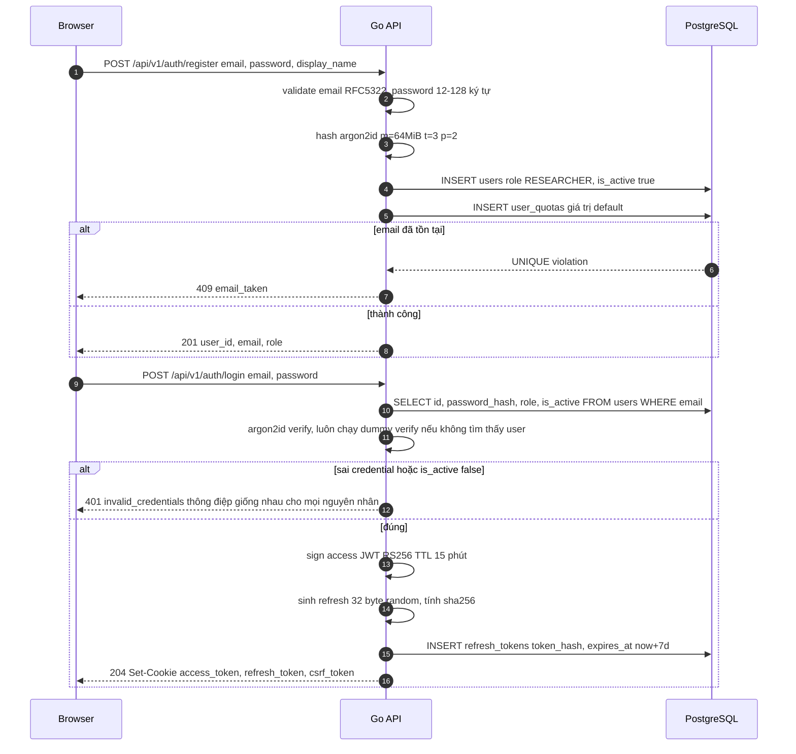
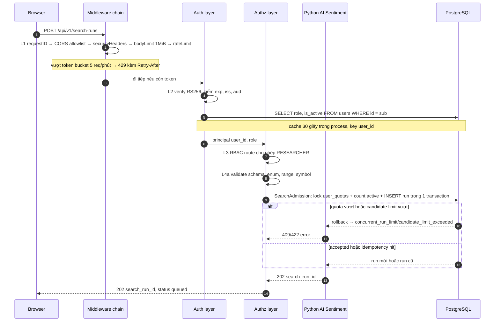
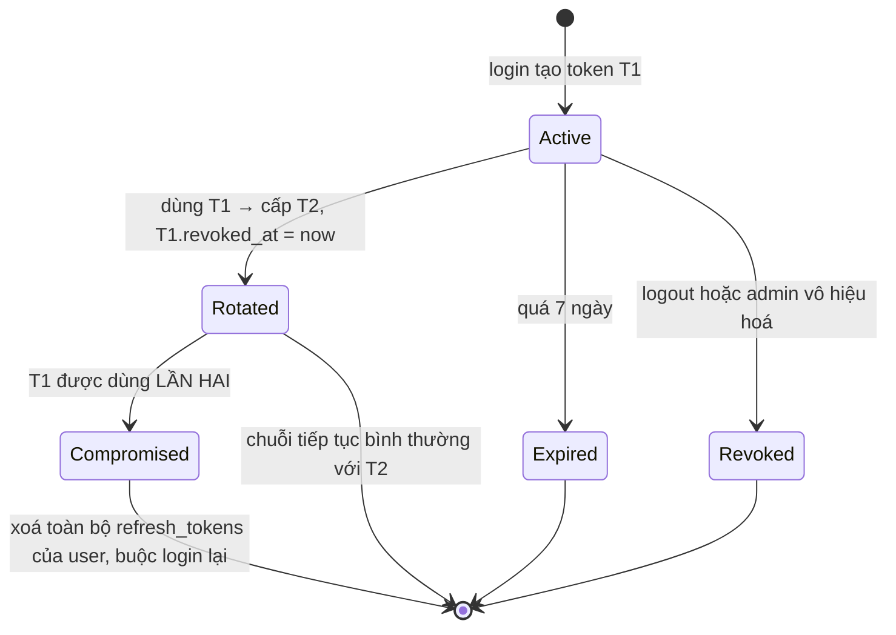

# Đặc tả: Authentication, Authorization và Boundary Hardening

## Mô tả

Module này là **public boundary** của hệ thống: toàn bộ nằm trong `server/` (Go), không có một dòng nào ở `web/` hay `ai/`. Nó trả lời ba câu hỏi cho mỗi request đi vào — *anh là ai* (authentication), *anh được làm gì* (authorization: RBAC + ownership + quota), *payload của anh có hợp lệ không* (validation) — rồi mới cho đi tiếp tới domain. Bốn lớp này là hiện thực của Defense in Depth ở `design.md` §7.4.

Phạm vi gồm năm nhánh: (1) vòng đời credential — đăng ký với `argon2id`, đăng nhập, refresh token rotation, logout, revoke; (2) phát hành và verify access token JWT **RS256** TTL 15 phút; (3) RBAC 3 role `RESEARCHER`/`OPERATOR`/`ADMIN` cộng **ownership check** trên từng resource; (4) quota theo **worker-second** (`max_concurrent_runs`, `max_candidates_per_run`, `max_candles_per_experiment`) và rate limit **token bucket**; (5) hardening ở biên — CORS allowlist, CSRF synchronizer token, security header, body limit 1 MiB, error envelope không rò rỉ nội bộ.

Hệ thống là **simulation-only** — không đặt lệnh, không giữ API key sàn. Đây là ranh giới **nhóm tự đặt** (`proposal.md` §4.3, nhãn **[PD]**), không phải câu trích nguyên văn từ đề bài; nhưng một khi đã chọn thì nó thay đổi mô hình đe doạ rất cụ thể: tài sản cần bảo vệ **không phải tiền** mà là **CPU của worker** và **tính toàn vẹn của leaderboard**. Một search run hợp lệ = 500 candidate × 40 s ≈ **5,5 giờ CPU**. Vì vậy thiết kế dồn sức vào quota và ownership hơn là vào việc siết chặt cửa sổ sống của access token — đánh đổi này được ghi rõ ở §7.5 `design.md` và nhắc lại trong "Ràng buộc / Bảo mật" bên dưới.

> **Nguồn gốc của toàn bộ spec này: [PD] — product decision.** Đề bài **không** yêu cầu authentication, RBAC hay quota. Nhóm thêm vì không có principal thì không enforce được quota, và quota là điều kiện để §32.5 (Performance) và §43 (scenario scalability) có nghĩa: nếu bất kỳ ai gửi được một request sinh 5,5 giờ CPU thì "1.000 strategy cần backtest" không còn là bài toán thiết kế. Phân loại đầy đủ ở `proposal.md` §4.4.

Hai lỗ hổng **đang tồn tại trong scaffold** phải được đóng như một phần của spec này, không để lại "sẽ làm sau": hàm `withCORS` trong `server/internal/httpapi/handler.go` đang **echo lại Origin** của request, và `docker-compose.yml` đang publish `${AI_PORT:-8000}:8000` ra host khiến Python AI (chỉ là sentiment adapter) tiếp cận được từ ngoài. Chi tiết ở Luồng F.

Đặc biệt phải đảm bảo:

- **0 password plaintext** và **0 refresh token plaintext** tồn tại trong DB, log, hay metric label.
- **Mọi** request đã xác thực đều re-check `users.is_active` — không chỉ tại thời điểm login.
- Một `RESEARCHER` **không bao giờ** đọc hay điều khiển được experiment/search run của người khác, kể cả khi đoán đúng UUID.
- Refresh token **rotate mỗi lần dùng**; một token đã dùng lại lần hai bị coi là dấu hiệu bị đánh cắp và làm vô hiệu cả chuỗi.
- `Access-Control-Allow-Origin` **luôn** là một giá trị từ allowlist, **không bao giờ** là echo của header `Origin`.
- Anonymous **không tạo được work**: mọi endpoint sinh job (`POST /experiments`, `POST /search-runs`, `POST /ai/predict`) đều cần auth.
- Response lỗi chỉ chứa `code`/`message`/`field`/`request_id` — không stack trace, không tên bảng, không SQL error, không model internals.

## Contract

- Browser chỉ gọi public Go API. Go xác thực, RBAC, ownership, quota và validate
  payload; Python AI không có public auth surface.
- `POST /api/v1/search-runs` chạy `SearchAdmission` ngay trong Go transaction:
  `SELECT user_quotas FOR UPDATE` + đếm run active + INSERT `search_runs`.
- `read.search_run_quota_v1` chỉ là projection phục vụ diagnostics. Nó **không** là
  nguồn quyết định admission và không được dùng để pass/fail request.
- Ownership lookup trong Go nhận `resourceKind` từ allowlist cố định và chỉ query
  `read.experiment_summary_v1` hoặc `read.search_run_v1`; không nhận tên bảng từ
  request và không query domain base table.
- Python AI chỉ được gọi qua sentiment port với internal token hợp lệ. Go sở hữu
  toàn bộ domain INSERT/UPDATE và migration; AI không ghi DB.

## Luồng chính

### A. Đăng ký và đăng nhập



> **Vì sao `401` với thông điệp giống nhau cho "email không tồn tại", "sai password" và "tài khoản bị vô hiệu"?** Ba thông điệp khác nhau biến form login thành công cụ liệt kê email hợp lệ. Cùng lý do, khi không tìm thấy user vẫn phải chạy một `argon2id` verify với hash giả: nếu không, nhánh "không tồn tại" trả lời trong 2 ms còn nhánh "sai password" mất 80 ms, và chênh lệch đó chính là một timing oracle.

> **Vì sao `argon2id`, không `bcrypt`?** `bcrypt` chỉ tốn CPU; `argon2id` tốn cả **memory** (cấu hình 64 MiB mỗi lần hash), làm chi phí brute-force trên GPU/ASIC cao hơn nhiều bậc ở cùng thời gian verify. Đánh đổi: 64 MiB × N login đồng thời là RAM thật — vì vậy login đi qua một semaphore giới hạn **4 phép hash song song**, request thứ 5 chờ trong hàng đợi tối đa 2 s rồi trả `503`. Không có giới hạn này thì chính trang login trở thành memory-exhaustion vector.

> **Vì sao `csrf_token` là cookie đọc được bằng JS trong khi `access_token`/`refresh_token` là `HttpOnly`?** Hai token phải bí mật với script; CSRF token thì cần frontend đọc để đặt vào header `X-CSRF-Token`. Chính sự bất đối xứng đó tạo ra phòng thủ: attacker cross-site gửi được cookie nhưng **không đọc được** giá trị cookie để điền vào header (same-origin policy), nên request thiếu header và bị chặn.

### B. Một request đã xác thực đi qua 4 lớp



> **Vì sao re-check `is_active` mỗi request nhưng cache 30 giây?** Không cache thì mỗi request thêm một round-trip DB, phá vỡ chính lý do chọn JWT stateless. Cache vĩnh viễn thì `is_active=false` không có tác dụng. 30 giây là điểm giữa: cửa sổ trễ tối đa 30 s, chi phí trung bình gần 0. Cache bị **invalidate ngay** khi chính process đó xử lý một lệnh admin đổi `is_active` hoặc `role`; ở deployment 1 instance API của MVP điều này là chính xác tuyệt đối, khi scale ngang API thì trở về đúng 30 s trễ.

> **Vì sao thứ tự phải là rateLimit trước JWT verify?** Verify RS256 là phép toán bất đối xứng tốn CPU. Đặt sau rate limit nghĩa là một flood token rác vẫn bị chặn ở lớp rẻ nhất. Ngược lại thì attacker bắt server làm việc đắt trước khi bị từ chối. Tương tự, `bodyLimit` đứng trước mọi thứ đọc body.

### C. Refresh token rotation và phát hiện reuse



Thân giao dịch rotation phải **atomic**, nếu không hai tab refresh cùng lúc sẽ tạo hai chuỗi token song song:

```sql
BEGIN;
-- Khoá đúng row của token đang dùng. FOR UPDATE để tab thứ hai phải chờ,
-- không phải SKIP LOCKED: ở đây ta cần tuần tự hoá, không phải bỏ qua.
SELECT id, user_id, expires_at, revoked_at
  FROM refresh_tokens
 WHERE token_hash = $1
   FOR UPDATE;

-- revoked_at IS NOT NULL nghĩa là token này đã bị rotate trước đó → REUSE.
UPDATE refresh_tokens SET revoked_at = now()
 WHERE token_hash = $1 AND revoked_at IS NULL;

INSERT INTO refresh_tokens (user_id, token_hash, expires_at)
VALUES ($2, $3, now() + INTERVAL '7 days');
COMMIT;
```

> **Vì sao reuse bị xử lý bằng cách xoá toàn bộ chuỗi, không chỉ từ chối request đó?** Refresh token chỉ dùng được một lần. Nếu nó xuất hiện lần thứ hai thì chỉ có hai khả năng: bản sao đang nằm ở nơi khác (bị đánh cắp), hoặc client mất response của lần rotate trước. Ta không phân biệt được hai trường hợp này từ phía server, nên chọn phía an toàn: buộc login lại. Chi phí là một lần user phải đăng nhập lại — rẻ hơn nhiều so với để một token bị cắp tiếp tục sống 7 ngày.

> **Vì sao lưu `sha256` mà không phải `argon2id` cho refresh token?** Refresh token là 32 byte random có entropy đầy đủ, không phải password người chọn — không có từ điển nào tấn công được nó, nên không cần hàm chậm. `sha256` giữ cho việc lookup theo `token_hash UNIQUE` nhanh và dùng được index; `argon2id` ở đây sẽ buộc phải scan toàn bảng để so từng row.

### D. Ownership check và OPERATOR override

RBAC một mình không đủ: hai `RESEARCHER` cùng role nhưng A không được đọc experiment của B. Ownership là quyền theo **quan hệ sở hữu**, nên là một lớp kiểm tra riêng (`design.md` §7.1).

```go
// server/internal/authz/ownership.go
// ponytail: một hàm cho mọi resource có owner_id. Không cần interface
// per-resource khi câu SQL chỉ khác tên bảng.
func (a *Authz) RequireOwnership(
    ctx context.Context, p Principal, resourceKind string, resourceID uuid.UUID,
) error {
    if p.Role == RoleOperator || p.Role == RoleAdmin {
        return nil // xem §7.2: operator phải dừng được run của người khác
    }
    var ownerID uuid.UUID
    // resourceKind đến từ allowlist trong code, KHÔNG từ input người dùng.
    // Các query này chỉ đọc read projection; Go không có quyền trên domain table.
    err := a.db.QueryRow(ctx, ownerQuery[resourceKind], resourceID).Scan(&ownerID)
    switch {
    case errors.Is(err, pgx.ErrNoRows):
        return ErrNotFound // 404, không phải 403 — xem ghi chú dưới
    case err != nil:
        return err
    case ownerID != p.UserID:
        return ErrNotFound
    }
    return nil
}
```

`ownerQuery` là map bất biến, ví dụ:

```go
var ownerQuery = map[string]string{
    "experiment": `SELECT owner_id FROM read.experiment_summary_v1
                    WHERE experiment_id = $1 LIMIT 1`,
    "search_run": `SELECT owner_id FROM read.search_run_v1
                   WHERE search_run_id = $1`,
}
```

> **Vì sao trả `404` chứ không `403` khi resource thuộc người khác?** `403` xác nhận "UUID này tồn tại nhưng không phải của bạn" — đó là một oracle cho phép dò sự tồn tại của resource. `404` cho cả hai trường hợp (không tồn tại / không phải của bạn) khiến hai trạng thái không phân biệt được từ ngoài. Đánh đổi: log phía server phải ghi rõ `reason: ownership_denied` để debug không bị mù, vì response đã cố tình mất thông tin.

> **`ownerQuery[resourceKind]` là map hằng số, không phải string nối.** Nếu tên bảng/view đến từ input thì đây là SQL injection. Đây là lý do tham số là một key vào map đã biết trước, không phải tên bảng tự do; các query cũng bị giới hạn trong schema `read`.

Mọi hành động vượt ownership của `OPERATOR`/`ADMIN` để lại vết bắt buộc trong `search_actions.actor_id`. Nhờ đó câu hỏi "ai cancel run của tôi" luôn có câu trả lời — đó là điều kiện để trao quyền override mà vẫn giữ trách nhiệm giải trình.

### E. Revoke, vô hiệu hoá tài khoản và cửa sổ 15 phút

1. `ADMIN` gọi `POST /api/v1/admin/users/{id}/deactivate`.
2. Trong một transaction: `UPDATE users SET is_active=false, updated_at=now()` và `DELETE FROM refresh_tokens WHERE user_id=$1`.
3. Cache principal của user đó bị invalidate ngay trong process xử lý lệnh.
4. Request tiếp theo của user: refresh **thất bại ngay** (không còn row), access token **còn hiệu lực tối đa 15 phút** hoặc tối đa 30 s nếu cache đã hết hạn và re-check `is_active` bắt được.
5. Search run đang chạy của user đó **không** tự dừng; muốn dừng phải gọi `POST /search-runs/{id}/actions` với `cancel` — vì việc dừng work là quyết định riêng, tách khỏi việc chặn đăng nhập.

> **Đánh đổi được chấp nhận có ý thức.** Không blacklist `jti`. Blacklist buộc mỗi request phải hỏi một store dùng chung, tức là (a) thêm dependency bắt buộc — trái ADR-010 xem PostgreSQL là store duy nhất bắt buộc và Redis chỉ là cache tuỳ chọn, (b) biến JWT stateless thành stateful, (c) mỗi request tốn một round-trip. Với hệ thống nghiên cứu không giữ tiền và không đặt lệnh, cửa sổ ≤ 15 phút là chấp nhận được. Lối siết chặt về sau đã có sẵn: re-check `is_active` ở Lớp 2 chỉ cần giảm TTL cache từ 30 s xuống 0.

### F. CORS allowlist, CSRF và hai lỗ hổng trong scaffold hiện tại

Code hiện tại (`server/internal/httpapi/handler.go`, dòng ~100) đặt thẳng giá trị cấu hình vào header và **phản chiếu Origin**:

```go
// TRƯỚC — sai: mọi origin đều được chấp nhận nếu CORS_ORIGIN được set lỏng,
// và không có bước đối chiếu Origin của request với danh sách cho phép.
func withCORS(origin string, next http.Handler) http.Handler {
    return http.HandlerFunc(func(w http.ResponseWriter, r *http.Request) {
        w.Header().Set("Access-Control-Allow-Origin", origin)
        ...
```

```go
// SAU — allowlist tường minh, so sánh chính xác, trả về origin ĐÃ KHỚP.
func withCORS(allowed []string, next http.Handler) http.Handler {
    set := make(map[string]struct{}, len(allowed))
    for _, o := range allowed {
        set[strings.TrimRight(strings.TrimSpace(o), "/")] = struct{}{}
    }
    return http.HandlerFunc(func(w http.ResponseWriter, r *http.Request) {
        w.Header().Set("Vary", "Origin") // luôn đặt, kể cả khi không khớp
        origin := r.Header.Get("Origin")
        if _, ok := set[origin]; ok && origin != "" {
            w.Header().Set("Access-Control-Allow-Origin", origin)
            w.Header().Set("Access-Control-Allow-Credentials", "true")
            w.Header().Set("Access-Control-Allow-Headers", "Content-Type, X-CSRF-Token, X-Request-ID")
            w.Header().Set("Access-Control-Allow-Methods", "GET, POST, OPTIONS")
            w.Header().Set("Access-Control-Max-Age", "600")
        }
        if r.Method == http.MethodOptions {
            w.WriteHeader(http.StatusNoContent) // preflight không cần body
            return
        }
        next.ServeHTTP(w, r)
    })
}
```

Cấu hình đổi từ `CORS_ORIGIN` (một giá trị) sang `CORS_ALLOWED_ORIGINS` (danh sách phân tách bởi dấu phẩy) trong `server/internal/config/config.go`, `docker-compose.yml` và `.env.example`.

> **Vì sao echo Origin là lỗ hổng thật, không chỉ là "chưa đẹp"?** `Access-Control-Allow-Origin: <origin của request>` cộng với `Allow-Credentials: true` nghĩa là **bất kỳ** website nào cũng gọi được API này kèm cookie của người dùng và **đọc được** response. Ở MVP chưa có cookie nên tác hại còn nhỏ; đúng ngày thêm session cookie thì nó thành lỗ CSRF/data-exfiltration hoàn chỉnh. Sửa trước khi có cookie rẻ hơn nhiều lần so với sửa sau khi đã có.

> **Vì sao `Vary: Origin` phải đặt cả khi origin không khớp?** Nếu không, một reverse proxy hay CDN có thể cache response kèm header CORS của origin đầu tiên và trả lại cho origin khác — biến đúng biện pháp phòng thủ thành lỗ hổng qua cache.

CSRF trên **mọi** request đổi state (`POST`, `PUT`, `PATCH`, `DELETE`), ba điều kiện phải đồng thời đúng:

1. `Origin` (hoặc `Referer` khi thiếu `Origin`) thuộc allowlist — thiếu cả hai thì từ chối, không đoán.
2. Header `X-CSRF-Token` khớp cookie `csrf_token` bằng `hmac.Equal` (so sánh constant-time, tránh timing).
3. Cookie `access_token` hợp lệ.

Lỗ hổng thứ hai trong scaffold: `docker-compose.yml` publish `${AI_PORT:-8000}:8000` ra host. Python AI **không có public auth** — nó chỉ nhận sentiment request từ Go. Cổng publish phá vỡ giả định đó.

```yaml
# docker-compose.prod.yml — ai KHÔNG có khối ports.
# Truy cập duy nhất là qua service name trên network nội bộ của compose.
services:
  ai:
    ports: !reset []
    expose: ["8000"]
```

> **Vì sao giữ mapping ở `docker-compose.yml` dev nhưng bỏ ở prod?** Dev có thể
> gọi trực tiếp `localhost:8000` để test AI. Production chỉ cho Go gọi qua
> internal network; domain admission không phụ thuộc AI.

## Kịch bản lỗi

| Tình huống | Phản ứng |
|---|---|
| Email đã tồn tại khi register | `409 email_taken`. Dựa vào `UNIQUE` của DB, **không** check-then-insert (race hai request cùng lúc) |
| Password < 12 hoặc > 128 ký tự | `422 weak_password` kèm `field: "password"`. Giới hạn trên tồn tại vì `argon2id` với input rất dài là DoS vector |
| Sai password / email không tồn tại / `is_active=false` | Cùng một `401 invalid_credentials`, cùng một độ trễ (dummy verify khi không tìm thấy user) |
| Access token hết hạn | `401 token_expired` — mã riêng để frontend biết gọi `/auth/refresh` thay vì đẩy user ra trang login |
| Access token sai signature, sai `iss`/`aud` | `401 invalid_token`, log WARN kèm `request_id`. Không nói rõ claim nào sai |
| Refresh token không có trong DB | `401 invalid_refresh`, xoá cookie. Không phân biệt "chưa từng tồn tại" và "đã bị xoá" |
| Refresh token dùng lần thứ hai (reuse) | Xoá **toàn bộ** `refresh_tokens` của user, `401 refresh_reuse_detected`, log ERROR `error_code=refresh_reuse` |
| Hai tab refresh đồng thời | `FOR UPDATE` tuần tự hoá; tab thắng nhận T2, tab thua thấy `revoked_at IS NOT NULL` → bị coi là reuse. Frontend chống bằng single-flight refresh, chỉ một request refresh tại một thời điểm |
| `RESEARCHER` gọi `GET /experiments/{id}` của người khác | `404 not_found` (không `403` — tránh oracle dò tồn tại). Log server ghi `reason=ownership_denied` |
| `RESEARCHER` gọi `GET /metrics` | `403 forbidden`. Đây là quyền theo role thuần, không có oracle nào để bảo vệ |
| User đang có 2 run `queued`/`running`/`paused`, tạo run thứ 3 | `409 concurrent_run_limit` kèm `current` và `limit`. `SearchAdmission` khóa `user_quotas` và kiểm tra + INSERT trong cùng transaction, nên hai request đồng thời không cùng vượt qua |
| `max_candidates=100000` trong `POST /search-runs` | `422 candidate_limit_exceeded` kèm ngưỡng thực tế 500. Chặn tại Go trước transaction |
| Request body > 1 MiB | `413 payload_too_large` từ `bodyLimit`, xảy ra **trước** khi parse JSON và trước JWT verify |
| Vượt token bucket | `429` + `Retry-After` tính từ thời điểm bucket có đủ 1 token, không phải giá trị cố định |
| Thiếu `X-CSRF-Token` trên `POST` | `403 csrf_failed`. Áp dụng cả khi token hợp lệ — thiếu một trong ba điều kiện là từ chối |
| `Origin` không thuộc allowlist trên request có credential | Không set header CORS → browser tự chặn ở phía client; ngoài ra server trả `403 origin_not_allowed` cho request đổi state, vì client không phải browser thì không có browser nào chặn hộ |
| Python AI bị gọi trực tiếp bằng payload sai | Network policy chặn public access; internal token + schema validation trả `422` |
| PostgreSQL down khi login | `503 service_unavailable`, không `500`. Không rò rỉ SQL error message ra client (`design.md` §5.5) |
| Clock skew giữa Go và Python AI | `leeway` 60 s khi verify `exp`/`nbf` nếu AI route cần token |
| Signing key private rò rỉ | Rotate keypair: phát hành `kid` mới, giữ public key cũ trong JWKS thêm 15 phút cho token đang lưu hành, rồi xoá |

## Ràng buộc

**Tính đúng đắn**

- Rotation refresh token nằm trong **một** transaction có `SELECT ... FOR UPDATE`; không có đường nào tạo được hai chuỗi token song song từ một token.
- `SearchAdmission` khóa row `user_quotas` bằng `FOR UPDATE`; quota check, idempotency lookup và INSERT `search_runs` nằm trong **cùng** transaction. Job của từng candidate được tạo ở transaction sau cùng `search_candidates` + `experiments` + `backtest_jobs`. Read projection chỉ là advisory và không được dùng để accept request.
- `users.role` có `CHECK IN ('RESEARCHER','OPERATOR','ADMIN')` ở DB — lớp cuối cùng nếu code có bug (Lớp 4, `design.md` §7.4).
- `refresh_tokens.token_hash` là `CHAR(64) UNIQUE`: hash trùng là bất khả thi về mặt xác suất, nhưng constraint biến "bất khả thi" thành "được DB bảo đảm".
- Mọi timestamp là `TIMESTAMPTZ` UTC. So sánh `expires_at` với `now()` của DB, không với clock của process.

**Hiệu năng**

- Verify access token: **0 query DB** khi cache principal còn hạn; p95 **< 2 ms** (chỉ là một phép verify RS256).
- `argon2id` cấu hình `m=64MiB, t=3, p=2` → mỗi lần verify **60–120 ms** trên máy demo. Tối đa **4** phép hash song song, hàng đợi tối đa 2 s rồi `503`.
- Cache principal TTL **30 giây**, dung lượng tối đa **10.000** entry, LRU. Ownership query dùng index PK nên p95 **< 5 ms**.
- Token bucket in-memory: **O(1)** memory mỗi key, dọn key không hoạt động > 10 phút. Interface `RateLimiter` không đổi khi chuyển sang Redis + Lua nếu scale ngang API (`design.md` §8.2, điều kiện ở §12.0).
- Tổng overhead của 4 lớp trên một request đã auth: p95 **< 10 ms**, tức < 4 % ngân sách 300 ms của `GET /markets/candles`.

**Bảo mật**

- Cookie: `HttpOnly` + `Secure` + `SameSite=Strict`; `Path=/api/v1` cho access token, `Path=/api/v1/auth/refresh` cho refresh token — thu hẹp phạm vi gửi refresh token xuống đúng một endpoint.
- Security header cố định: `Strict-Transport-Security: max-age=31536000; includeSubDomains`, `X-Content-Type-Options: nosniff`, `X-Frame-Options: DENY`, `Referrer-Policy: strict-origin-when-cross-origin`.
- Access token TTL **15 phút**, refresh **7 ngày**, JWT **RS256** với `kid` trong header để rotate được key. Public key phân phối cho Go Worker khi cần; **private key chỉ Go API giữ**.
- **0 secret trong log/metric label**: không log `password`, `token`, `token_hash`, `Cookie`, `Authorization`. Label metric không bao giờ chứa `user_id` hay email (vừa là PII, vừa là cardinality explosion).
- Rate limit: 120 req/phút per-IP cho public read; per-principal 30/phút `POST /experiments`, 5/phút `POST /search-runs`, 20/phút `POST /ai/predict`.
- Cửa sổ revoke của access token là **≤ 15 phút** — đánh đổi có ý thức, không phải sơ suất (Luồng E).
- Không có API key sàn nào trong hệ thống; không có endpoint nào đặt lệnh. Compromise toàn bộ hệ thống **không** dẫn tới mất tiền.

**Quan sát được**

- `http_requests_total{route,status}` cho phép đếm `401`/`403`/`429` theo route mà không cần parse log.
- Log ERROR bắt buộc kèm `error_code` cho: `refresh_reuse`, `ownership_denied`, `csrf_failed`, `origin_not_allowed`, `quota_exceeded`.
- Mọi response lỗi mang `request_id` khớp `X-Request-ID`, truy vết được xuyên Go API → Go Worker; AI sentiment nhận correlation ID khi được gọi (`specs/observability.md`).
- Mọi hành động `pause/resume/cancel` ghi `search_actions.actor_id` — audit trail cho quyền override của OPERATOR.

**UX**

- `401 token_expired` khiến frontend refresh **im lặng** rồi retry request gốc **đúng một lần**; user không thấy gì. Các `401` khác đẩy về trang login.
- Frontend dùng **single-flight** refresh: N request cùng nhận `401` chỉ tạo **1** lượt refresh, tránh tự gây reuse detection.
- `429` hiện thông báo kèm số giây từ `Retry-After`, không phải "Đã xảy ra lỗi".
- `409 concurrent_run_limit` nêu rõ đang chạy mấy run và giới hạn là bao nhiêu, kèm liên kết tới run đang chạy để user tự cancel.
- Mọi error toast hiện `request_id` để user copy khi báo lỗi.

## Tiêu chí chấp nhận

- [ ] AC-01: `POST /auth/register` rồi `SELECT password_hash FROM users` → giá trị bắt đầu bằng `$argon2id$`, **không** chứa password gốc dưới bất kỳ dạng nào.
- [ ] AC-02: Login 200 lần với email không tồn tại và 200 lần với password sai → chênh lệch p50 độ trễ giữa hai nhóm **< 15 ms** (không có timing oracle).
- [ ] AC-03: Dùng lại refresh token đã rotate → `401 refresh_reuse_detected`, và `SELECT count(*) FROM refresh_tokens WHERE user_id=$1` trả **0**.
- [ ] AC-04: Refresh đồng thời 10 lần cùng một token → đúng **1** thành công, 9 lần `401`; `refresh_tokens` không bao giờ có 2 row `revoked_at IS NULL` cho cùng user tại một thời điểm.
- [ ] AC-05: User A tạo experiment, user B (`RESEARCHER`) gọi `GET /experiments/{id}` → `404`, response **không** chứa bất kỳ field nào của experiment.
- [ ] AC-06: Cùng experiment đó, user `OPERATOR` gọi → `200`. `POST /search-runs/{id}/actions` với `cancel` từ OPERATOR → `200` và `search_actions.actor_id` = id của operator.
- [ ] AC-07: `ADMIN` set `is_active=false` cho user đang đăng nhập → refresh **thất bại ngay**; access token bị từ chối sau **tối đa 30 giây** (TTL cache principal).
- [ ] AC-08: Tạo 2 search run `running`, gọi `POST /search-runs` lần 3 → `409 concurrent_run_limit`. Gửi 5 request thứ-3 **đồng thời** → cả 5 đều `409`, `count(*)` run `running` vẫn là **2**.
- [ ] AC-09: `curl -H "Origin: https://evil.example"` → response **không** có `Access-Control-Allow-Origin`; luôn có `Vary: Origin`. Với `Origin` trong `CORS_ALLOWED_ORIGINS` → trả về đúng origin đó, **không** phải `*`.
- [ ] AC-10: Test static `grep -rn "Access-Control-Allow-Origin" server/` → chỉ khớp bên trong nhánh đã đối chiếu allowlist; **0** vị trí set từ `r.Header.Get("Origin")` không qua kiểm tra.
- [ ] AC-11: `POST /api/v1/experiments` có cookie hợp lệ nhưng thiếu `X-CSRF-Token` → `403 csrf_failed`; thêm header đúng → `202`.
- [ ] AC-12: Gửi 6 `POST /search-runs` trong 60 giây → request thứ 6 `429` kèm `Retry-After` là số nguyên giây > 0.
- [ ] AC-13: Body 2 MiB tới `POST /ai/predict` → `413`, và log cho thấy **không** có bước JWT verify nào chạy cho request đó.
- [ ] AC-14: `docker compose -f docker-compose.yml -f docker-compose.prod.yml up` rồi `curl localhost:8000/healthz` từ host → **connection refused**; `curl` cùng URL từ trong container `api` → `200`.
- [ ] AC-15: Gọi trực tiếp Go admission port với `max_candidates=999999` → `422`, **không** có row nào được thêm vào `search_runs`.
- [ ] AC-16: `grep -riE "password|token_hash|set-cookie" logs/` → **0** dòng chứa giá trị thật; chỉ có tên field trong thông điệp validation.
