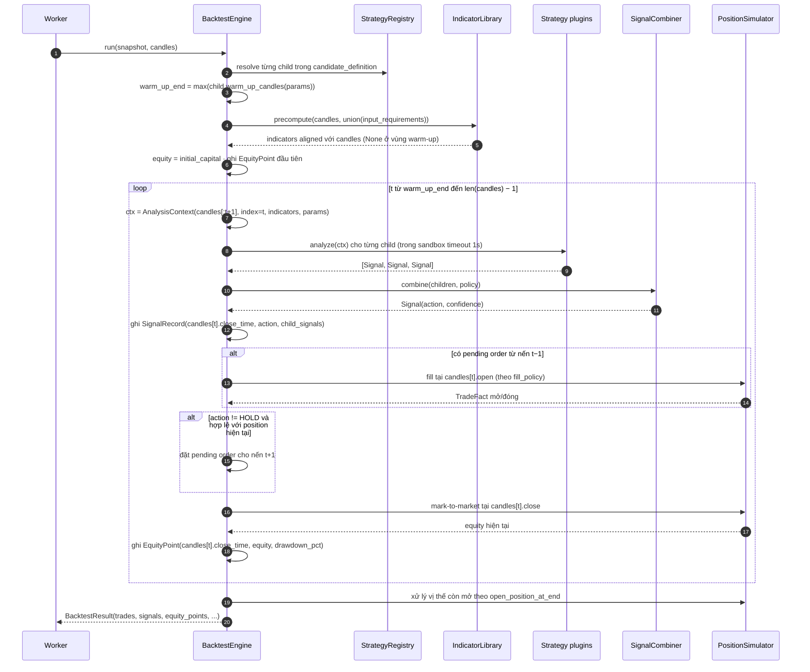
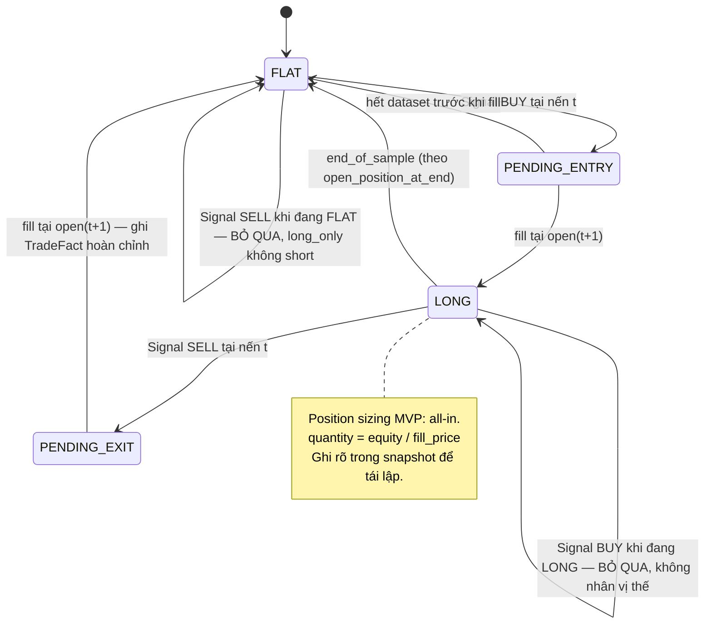

# Đặc tả: Backtest Engine

## Mô tả

Backtest Engine mô phỏng: *"nếu sử dụng strategy này trong quá khứ thì kết quả sẽ như thế nào?"* (đề bài §19). Nó nhận một `ExperimentSnapshot` bất biến cùng một tập nến đã version hoá, và trả về `BacktestResult` gồm **trade facts thô** — không tính metric.

Engine có 3 trách nhiệm và **chỉ** 3:

1. **Duyệt nến theo thứ tự thời gian**, gọi strategy tại mỗi nến, thu tín hiệu.
2. **Mô phỏng thực thi**: mở/đóng vị thế theo fill policy, áp fee và slippage, ghi lại từng trade.
3. **Ghi equity curve** để tính drawdown về sau.

Nó **không** tính Return, Win Rate, MDD, Sharpe — đó là việc của `Evaluator` (đề bài §20: *"Strategy Evaluation phải tách biệt khỏi Strategy Implementation"*). Việc tách này có một lợi ích rất cụ thể: đổi công thức metric chỉ cần tính lại từ `trades` và `equity_points`, **không** chạy lại backtest.

Đặc biệt phải đảm bảo:

- **Không look-ahead bias**: tín hiệu tính trên nến `t` được fill sớm nhất ở nến `t+1` (ADR-007). Đây là rủi ro R3 — sai chỗ này thì toàn bộ Leaderboard vô nghĩa.
- **Deterministic**: cùng snapshot + cùng dataset → kết quả **byte-identical** ở mọi lần chạy, mọi worker.
- **Trade facts bất biến**: `trades` là fact, không phải view. Không bao giờ recompute và ghi đè.
- **Vị thế còn mở lúc hết dataset được xử lý tường minh**, không bỏ lửng.
- Precision bằng `Decimal`, không `float`.

## Contract

```python
class BacktestEngine(Protocol):
    def run(self, snapshot: ExperimentSnapshot,
            candles: Sequence[Candle]) -> BacktestResult: ...
```

```python
@dataclass(frozen=True)
class BacktestResult:
    trades: list[TradeFact]
    signals: list[SignalRecord]         # ghi vào run_signals — dùng để vẽ và giải thích
    equity_points: list[EquityPoint]
    candles_read: int
    warm_up_candles: int
    duration_ms: int


@dataclass(frozen=True)
class TradeFact:
    sequence_no: int
    side: Literal["LONG", "SHORT"]
    entry_time: datetime
    entry_price: Decimal                # giá đã áp slippage
    exit_time: datetime | None
    exit_price: Decimal | None
    quantity: Decimal
    fee_paid: Decimal                   # tổng fee cả entry + exit
    slippage_cost: Decimal
    pnl_absolute: Decimal | None
    pnl_percent: Decimal | None
    exit_reason: Literal["signal", "stop_loss", "take_profit", "end_of_sample"] | None


@dataclass(frozen=True)
class SignalRecord:
    candle_time: datetime
    signal: Literal["BUY", "SELL", "HOLD"]
    confidence: float | None
    child_signals: Mapping[str, Any] | None   # {'ma_cross':'BUY','rsi':'SELL','score':0.4}
```

Execution assumptions đến **từ snapshot**, không từ config toàn cục:

| Field                  | Giá trị mặc định         | Ý nghĩa                                          |
| ---------------------- | ------------------------ | ------------------------------------------------ |
| `initial_capital`      | `10000.00`               | Vốn ban đầu                                      |
| `fee_bps`              | `10` (= 0.10%)           | Phí mỗi fill (áp cả entry và exit)                |
| `slippage_bps`         | `5` (= 0.05%)            | Trượt giá mỗi fill, luôn theo hướng bất lợi       |
| `fill_policy`          | `next_candle_open`       | Xem §Luồng B                                     |
| `position_policy`      | `long_only`              | MVP chỉ LONG; `long_short` là mở rộng            |
| `open_position_at_end` | `close_at_last_candle`   | Xem §Luồng D                                     |

> **Vì sao execution assumptions nằm trong snapshot chứ không trong file config.** Nếu `fee_bps` là biến môi trường, thì hai experiment chạy cách nhau một tuần (sau khi ai đó đổi `.env`) sẽ có kết quả khác nhau mà provenance không ghi lại được. Đưa vào snapshot nghĩa là con số `+18.2%` trên Leaderboard luôn đọc được kèm điều kiện đã tạo ra nó.

## Luồng chính

### A. Vòng lặp chính



### B. Fill policy — chống look-ahead (ADR-007)

Đây là phần dễ sai nhất và có hậu quả lớn nhất.

```text
Nến t:  open=118000  high=118500  low=117800  close=118400  close_time=09:05:00
Nến t+1: open=118450 high=118900  low=118300  close=118700  close_time=09:10:00

Strategy đọc nến t (đã đóng) → trả BUY
```

| Policy               | Fill tại                 | Đúng/Sai                                                                                   |
| -------------------- | ------------------------ | ------------------------------------------------------------------------------------------ |
| `next_candle_open` ✅ | `118450` (open của t+1)  | **Đúng.** Giá này chưa biết lúc quyết định, nhưng là giá khả thi đầu tiên sau khi quyết định |
| `same_candle_close`  | `118400` (close của t)   | **Look-ahead.** Chỉ biết `close=118400` **sau khi** nến t đóng, nhưng lại giao dịch tại chính giá đó |

> **Mức độ nghiêm trọng.** `same_candle_close` giả định thực hiện được lệnh tại một giá đã biết trong quá khứ — nghĩa là mỗi trade được "chiết khấu" một khoản bằng chênh lệch `close(t) → open(t+1)`. Trên khung 5m với strategy giao dịch thường xuyên (80+ trade), khoản này tích luỹ đủ để **lật dấu** Total Return từ âm sang dương. Đó là lý do `same_candle_close` vẫn được giữ làm option: để so sánh và chứng minh nhóm hiểu tác động, **không** để dùng làm mặc định.

Áp slippage và fee (luôn theo hướng bất lợi):

```python
def fill_price(raw: Decimal, side: str, is_entry: bool, slippage_bps: int) -> Decimal:
    slip = raw * Decimal(slippage_bps) / Decimal(10_000)
    if (side == "LONG") == is_entry:      # mua vào (LONG entry) hoặc mua để đóng SHORT
        return raw + slip                 # trả cao hơn
    return raw - slip                     # bán ra: nhận thấp hơn

fee = fill_px * qty * Decimal(fee_bps) / Decimal(10_000)   # áp ở CẢ entry và exit
```

`slippage_cost` và `fee_paid` được ghi riêng vào `trades` — nhờ đó trả lời được "strategy này có lãi trước phí không?" mà không cần chạy lại.

### C. Position state machine (`long_only`)



Hai quy tắc dễ bỏ sót trong state machine này:

- **`BUY` khi đang `LONG` bị bỏ qua**, không cộng thêm vị thế. Nếu không bỏ qua thì strategy ra `BUY` 50 nến liên tiếp sẽ tạo 50 trade chồng nhau và Return trở nên vô nghĩa. Signal vẫn được ghi vào `run_signals` (để giải thích), chỉ không tạo order.
- **`SELL` khi đang `FLAT` bị bỏ qua** với `long_only`. Với `long_short` (mở rộng) thì nó mở SHORT.

### D. Vị thế còn mở khi hết dataset

Đề bài không nêu, nhưng bỏ qua chi tiết này làm Return sai đáng kể với strategy ít trade (một strategy 5 trade mà trade cuối còn mở thì 20% dữ liệu bị bỏ).

| `open_position_at_end`   | Hành vi                                                                  |
| ------------------------ | ------------------------------------------------------------------------ |
| `close_at_last_candle` ✅ | Đóng tại `close` của nến cuối, `exit_reason='end_of_sample'`, có áp fee+slippage |
| `discard_open_trade`     | Bỏ trade đó khỏi `trades`; nêu rõ trong result là đã bỏ bao nhiêu trade    |
| `mark_unrealized`        | Giữ trade với `exit_time=NULL`; `pnl` là unrealized                       |

Mặc định `close_at_last_candle` vì nó cho một con số Return có thể so sánh giữa các strategy. `mark_unrealized` làm Win Rate không xác định (trade chưa kết thúc thắng hay thua?).

### E. Equity curve và drawdown

```python
peak = initial_capital
for t in range(warm_up_end, len(candles)):
    equity = cash + position_value_at(candles[t].close)   # mark-to-market
    peak = max(peak, equity)
    dd_pct = (equity - peak) / peak * 100                 # ≤ 0
    equity_points.append(EquityPoint(candles[t].close_time, equity, dd_pct))
```

> **Vì sao mark-to-market mỗi nến, không chỉ tại lúc đóng trade.** Drawdown trong lúc **đang giữ** vị thế là drawdown thật — nó là mức lỗ mà người dùng thực sự phải chịu đựng. Một strategy vào lệnh ở 118K, giá xuống 100K rồi lên 125K mới bán có Return dương nhưng MDD −15%. Nếu chỉ ghi equity tại lúc đóng trade thì MDD tính ra là 0% — sai hoàn toàn về mặt rủi ro, và đó chính là điều đề bài §20 muốn hệ thống phản ánh đúng.

Số lượng `equity_points` = số nến (tối đa 20.000). API decimate xuống ≤ 2000 điểm khi trả về (`specs/visualization.md`), nhưng DB giữ đủ để tính MDD chính xác.

## Kịch bản lỗi

| Tình huống                                                     | Phản ứng                                                                                                        |
| -------------------------------------------------------------- | --------------------------------------------------------------------------------------------------------------- |
| Số nến ít hơn `warm_up_end`                                    | `422 insufficient_candles` với `required` và `available` — reject **trước khi** tạo experiment, không chạy rồi trả 0 trade |
| Strategy raise exception tại nến thứ 500                       | `StrategyFailure` → `backtest_runs.status='failed'`, `error_code='strategy_exception'`. **Không** ghi partial trades |
| Strategy timeout (> 1 s/call)                                  | `error_code='strategy_timeout'`, candidate `failed`. Worker vẫn sống                                             |
| Strategy trả `BUY` ở mọi nến                                   | Chỉ 1 trade mở (state machine bỏ qua `BUY` khi đang `LONG`). Signal vẫn ghi đủ vào `run_signals`                  |
| Strategy trả `HOLD` ở mọi nến                                  | 0 trade. `BacktestResult` hợp lệ với `trades=[]`. `Evaluator` xử lý (không chia cho 0)                            |
| Nến có `volume = 0` (không thanh khoản)                        | Vẫn fill (đây là backtest, không phải mô phỏng orderbook). Ghi cờ `low_liquidity` vào diagnostics để người đọc biết |
| Gap giá lớn giữa `close(t)` và `open(t+1)`                     | Fill tại `open(t+1)` thật — đó là hiện thực. **Không** clamp, **không** nội suy                                    |
| Nến bị thiếu giữa dataset (gap thời gian)                      | Engine duyệt theo **index**, không theo thời gian → vẫn chạy. `market_datasets.candle_count` + `content_hash` phản ánh dataset thật; gap được nêu trong diagnostics |
| `equity` xuống ≤ 0 (cháy tài khoản)                            | Dừng vòng lặp, đóng vị thế tại nến đó, `exit_reason='end_of_sample'`, ghi `error_code=null` nhưng `diagnostics.liquidated=true`. Kết quả **vẫn hợp lệ** (đó là kết quả thật của strategy) |
| Worker chết giữa backtest                                      | Job chưa `complete` → lease hết hạn ≤ 120 s → worker khác nhận với `attempt+1`. **Không** có partial `trades` vì chỉ commit khi xong (`specs/experiment.md`) |
| Hai worker cùng nhận một job (lease race)                      | `UNIQUE (experiment_id)` trên `backtest_runs` → chỉ 1 INSERT thành công; worker thua bỏ qua                       |
| Chạy lại cùng snapshot ra kết quả khác                         | **Bug nghiêm trọng.** Nguyên nhân thường là: `float` thay `Decimal`, dùng `datetime.now()`, iterate qua `set`/`dict` không sort, random không seed. Có test AC-02 chặn |
| `fee_bps` hoặc `slippage_bps` âm                               | `CHECK (fee_bps >= 0 AND slippage_bps >= 0)` ở DB + validate ở API → `422`                                       |
| `initial_capital = 0`                                          | `CHECK (initial_capital > 0)` → `422`. Nếu cho 0 thì `quantity = 0/price = 0` và mọi metric là NaN                |
| Số nến vượt 20.000                                             | `422 dataset_too_large` (ADR-014) — chặn ở API, không để OOM Python process                                       |
| `run_signals` có 20.000 row cho 1 run × 500 candidate          | 10M row/search run. Retention: xoá `run_signals` của candidate **không vào Top-K** sau 7 ngày; giữ của entry Leaderboard |

## Ràng buộc

**Tính đúng đắn**

- Fill sớm nhất ở nến `t+1` với `next_candle_open`. Không có đường code nào đọc `candles[i]` với `i > ctx.index` trong lúc tính signal.
- Mọi giá, số lượng, fee dùng `Decimal`/`NUMERIC(24,8)`. **Không** `float` ở bất kỳ đâu trong engine.
- Slippage luôn theo hướng bất lợi cho người giao dịch.
- Fee áp ở **cả** entry và exit.
- Equity mark-to-market **mỗi nến**, không chỉ tại lúc đóng trade.
- `trades` chỉ được INSERT một lần, trong cùng transaction với `backtest_runs.status='completed'`.
- Deterministic: không `datetime.now()`, không random không seed, không iterate cấu trúc không có thứ tự xác định.

**Hiệu năng**

- Throughput 1 worker: **≥ 0.5 candidate/giây** với 10.000 nến và composite 3 strategy (`proposal.md` §2.2).
- Indicator precompute một lần: 20.000 nến × 4 indicator trong **< 500 ms**.
- Bulk INSERT `trades`/`run_signals`/`equity_points` bằng batch, không loop từng row.
- Bộ nhớ: 20.000 nến × 5 field `Decimal` ≈ 8 MB — nằm trong ngân sách; đây là lý do giới hạn 20.000 tồn tại.
- Vòng lặp chính: **< 100 µs/nến** cho composite 3 strategy.

**Khả năng mở rộng**

- Thêm `fill_policy` mới = thêm nhánh trong `PositionSimulator` + giá trị enum. Không đụng vòng lặp chính.
- `position_policy='long_short'` = mở rộng state machine. Snapshot đã có field nên không cần migration.
- Stop Loss / Take Profit / Trailing Stop = thêm điều kiện thoát trong `PositionSimulator`; `exit_reason` đã có sẵn giá trị `stop_loss`/`take_profit` trong enum.
- Engine **không** biết strategy nào đang chạy — nó gọi qua `Strategy` Protocol. Thêm MACD không đụng engine (`specs/strategy-registry.md`).

**Quan sát được**

- `backtest_duration_seconds` histogram (label: `strategy_family`, `candle_count_bucket`)
- `backtest_candles_read` histogram
- `backtest_signals_generated` counter
- `strategy_analyze_seconds{strategy_id}` histogram
- `backtest_runs.diagnostics` JSONB ghi: `warm_up_candles`, `signals_by_action`, `skipped_orders`, `liquidated`, `gaps_in_dataset`

## Tiêu chí chấp nhận

- [ ] AC-01: Fixture 200 nến với kết quả tính tay trước (xem `specs/evaluation.md` §ví dụ) → `trades`, `entry_price`, `exit_price`, `fee_paid` khớp **chính xác** từng con số.
- [ ] AC-02: Chạy cùng snapshot 2 lần → `trades` và `equity_points` **byte-identical** (so sánh bằng hash của kết quả serialize canonical).
- [ ] AC-03: Chạy cùng snapshot trên 2 worker khác nhau → kết quả identical.
- [ ] AC-04: Test look-ahead — strategy trả `BUY` tại nến `t` → `trades[0].entry_price` bằng `candles[t+1].open` (đã áp slippage), **không** bằng `candles[t].close`.
- [ ] AC-05: Test look-ahead cứng — inject một strategy cố đọc `ctx.candles[ctx.index + 1]` → `IndexError`, không phải giá trị.
- [ ] AC-06: Strategy `HOLD` mọi nến → `trades == []`, `BacktestResult` hợp lệ, không exception, `Evaluator` trả metric với `trade_count=0`.
- [ ] AC-07: Strategy `BUY` mọi nến → đúng **1** trade (mở ở đầu, đóng ở `end_of_sample`), `run_signals` có đủ 20.000 record.
- [ ] AC-08: Đổi `fill_policy` từ `next_candle_open` sang `same_candle_close` trên cùng snapshot → `total_return_pct` khác nhau đo được (chứng minh policy có tác động thật, không phải field trang trí).
- [ ] AC-09: Đặt `fee_bps=0, slippage_bps=0` → `sum(fee_paid) == 0` và `sum(slippage_cost) == 0`; Return cao hơn trường hợp có phí.
- [ ] AC-10: Vị thế còn mở lúc hết dataset → có trade với `exit_reason='end_of_sample'` và `exit_price == candles[-1].close` (đã áp slippage).
- [ ] AC-11: `open_position_at_end='discard_open_trade'` trên cùng dữ liệu → ít hơn đúng 1 trade, diagnostics ghi `discarded_open_trades=1`.
- [ ] AC-12: Số nến < `warm_up_end` → `422 insufficient_candles` **trước khi** tạo experiment; không có row nào trong `backtest_jobs`.
- [ ] AC-13: Strategy raise exception ở nến 500 → `backtest_runs.status='failed'`, bảng `trades` có **0 row** cho run đó (không partial commit).
- [ ] AC-14: Kill worker giữa backtest → sau ≤ 120 s job về `queued`, worker khác chạy lại, kết quả cuối cùng đúng và **không** trùng row.
- [ ] AC-15: Strategy mua ở 118K, giá xuống 100K rồi lên 125K mới bán → `evaluations.max_drawdown_pct` phản ánh mức −15% (chứng minh mark-to-market mỗi nến, không chỉ tại lúc đóng trade).
- [ ] AC-16: `grep -rn "float(" app/domain/backtest/` → 0 kết quả (chứng minh dùng `Decimal`).
