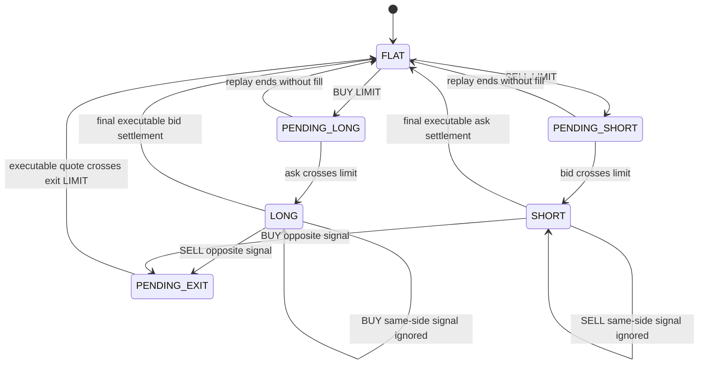

# Đặc tả: Backtest Engine

## Mô tả

Backtest Engine mô phỏng: *"nếu sử dụng strategy này trong quá khứ thì kết quả sẽ như thế nào?"* (đề bài §19). Nó nhận một `ExperimentSnapshot` bất biến, closed candles từ dataset bất biến và BBO replay input; trả về **trade facts thô** — không tính metric.

Engine có 3 trách nhiệm và **chỉ** 3:

1. **Merge event theo thứ tự nhân quả**, gọi strategy tại mỗi `CandleClosed`, thu tín hiệu.
2. **Mô phỏng thực thi**: tạo LIMIT intent, crossing theo BBO executable side, áp fee/slippage policy, ghi order/fill/trade facts.
3. **Ghi equity curve** theo quote gần nhất để Evaluator tính drawdown.

Engine **không** tính Return, Win Rate, MDD, Sharpe — đó là việc của `Evaluator` (đề bài §20: *"Strategy Evaluation phải tách biệt khỏi Strategy Implementation"*). Đổi công thức metric chỉ cần tính lại từ facts, **không** chạy lại strategy.

Đặc biệt phải đảm bảo:

- **Không look-ahead bias**: strategy chỉ đọc candle/indicator tới candle đang đóng; giá khớp chỉ đến từ BBO event hiện tại hoặc tương lai theo replay order.
- **Deterministic**: cùng snapshot + cùng candle/BBO bytes tạo kết quả **byte-identical** ở mọi lần chạy, mọi worker.
- **Trade facts bất biến**: `trades` là fact, không phải view. Không recompute và ghi đè.
- **Vị thế còn mở lúc hết dataset được xử lý tường minh** tại BBO executable cuối.
- Precision bằng `Decimal`, không `float`.

## Contract

```go
type BacktestEngine interface {
	Run(ctx context.Context, snapshot ExperimentSnapshot, candles []market.Candle, bbo []market.BBO) (BacktestResult, error)
}
```

`candles` là `[]market.Candle` closed-only, Worker đọc từ
`market_dataset_candles` theo `snapshot.market_dataset_id`, sắp xếp theo
`open_time`. `bbo` là immutable replay input, không đọc từ operational cache.
Engine không nhận `KlineUpdate`/`ChartKline` và không query DB.

```go
type BacktestResult struct {
	Trades       []TradeFact
	Signals      []SignalRecord
	Orders       []OrderFact
	EquityPoints []EquityPoint
	CandlesRead  int
	WarmUpCandles int
	DurationMS   int
}

type TradeFact struct {
	SequenceNo int
	Side       TradeSide // LONG | SHORT
	SignalAt   *time.Time
	EntryTime  time.Time
	EntryPrice decimal.Decimal
	ExitTime   *time.Time
	ExitPrice  *decimal.Decimal
	Quantity   decimal.Decimal
	FeePaid    decimal.Decimal
	SlippageCost decimal.Decimal
	PnLAbsolute *decimal.Decimal
	PnLPercent  *decimal.Decimal
	ExitReason  *ExitReason
}

type SignalRecord struct {
	CandleTime   time.Time
	Action       Action
	Price        *decimal.Decimal
	Notional     *decimal.Decimal
	Confidence   *decimal.Decimal
	ChildSignals json.RawMessage
}
```

### Execution snapshot

Execution assumptions đến **từ snapshot**, không từ config toàn cục:

| Field | Giá trị verification | Ý nghĩa |
|---|---:|---|
| `initial_equity` | `100.00 USDT` | Equity ban đầu |
| `fixed_notional` | `10.00 USDT` | Notional cho mỗi intent; quantity = notional / LIMIT price |
| `leverage` | `1x` | Không đòn bẩy trong fixture |
| `fee_bps` | `10` (= 0.10%) | Phí mỗi fill, áp cả entry và exit |
| `slippage_bps` | `0` | Extra slippage disabled trong fixture |
| `fill_policy` | `bbo_limit` | LIMIT crossing theo BBO |
| `position_policy` | `one_net_position` | Một net LONG hoặc SHORT |
| `open_position_at_end` | `last_executable_bbo` | Bid cho LONG, ask cho SHORT |
| `risk_policy` | `NULL` | SL/TP disabled trong fixture |

Snapshot vẫn chứa mọi assumption ảnh hưởng kết quả. Vì vậy provenance luôn
đọc được cùng điều kiện tạo ra một con số trên Leaderboard.

### Risk policy seam

SL/TP là seam execution tùy chọn. Khi bật, policy phải được snapshot và mức
trigger chốt tại entry; khi `risk_policy = NULL`, position chỉ đóng bằng
opposite signal hoặc final executable BBO.

```go
type RiskPolicy struct {
	StopLossPct     *decimal.Decimal `json:"stop_loss_pct,omitempty"`
	TakeProfitPct   *decimal.Decimal `json:"take_profit_pct,omitempty"`
	IntrabarPriority string           `json:"intrabar_priority"` // stop_loss_first | take_profit_first
}
```

Fixture verification đặt `risk_policy = NULL`, nên không sinh SL/TP trade hoặc
overlay marker.

## Luồng chính

### A. Event loop

```mermaid
sequenceDiagram
    autonumber
    participant W as Go Backtest Worker
    participant BE as BacktestEngine
    participant REG as StrategyRegistry
    participant IND as IndicatorLibrary
    participant STR as Go Strategy plugins
    participant CMB as SignalCombiner
    participant POS as PositionSimulator

    W->>BE: Run(snapshot, candles, bbo)
    BE->>REG: resolve children from immutable candidate_definition
    BE->>BE: validate fixed notional, one-net policy, hashes
    BE->>IND: precompute(candles, union(input_requirements))
    IND-->>BE: indicators aligned to open_time order
    BE->>BE: merge BBO + CandleClosed by (eventTime, priority, sourceSequence)
    BE->>BE: equity = initial_equity

    loop merged replay events
        alt BBO event, priority 0
            BE->>POS: update quote; try pending LIMIT/OCO crossing
            POS-->>BE: OrderFact / FillFact / TradeFact transition
        else CandleClosed event, priority 1
            BE->>STR: Analyze(causal context)
            STR-->>BE: child signals
            BE->>CMB: Combine(children, policy)
            CMB-->>BE: canonical Signal
            BE->>BE: record SignalRecord and create valid LIMIT intent
        end
        BE->>POS: mark equity with latest executable BBO
        POS-->>BE: EquityPoint
    end

    BE->>POS: settle open position at final executable BBO side
    BE-->>W: BacktestResult(facts, equity, diagnostics)
```

Mỗi event có key:

```text
(eventTime, priority, sourceSequence)
```

Priority cố định:

```text
0 BBO
1 CandleClosed
2 OrderCommand
3 SyntheticOrderStatus
4 Position/Equity observation
```

BBO cùng timestamp luôn được apply trước `CandleClosed`, nên LIMIT intent vừa
được strategy tạo chỉ dùng quote đến thời điểm signal; không đọc quote tương
lai để quyết định.

### B. BBO LIMIT crossing

Signal non-HOLD phải có `price > 0`. Strategy signal dùng candle close làm
LIMIT price trong fixture. `fixed_notional` được resolve sau khi price được
validate:

```text
quantity = fixed_notional / limit_price
```

Mọi phép tính dùng Decimal. `Signal.size` nếu có phải đúng dấu với action;
execution layer dùng `abs(size)` chỉ khi snapshot chọn sizing policy khác.

| Intent | Crossing condition | Fill price |
|---|---|---|
| BUY / open LONG | `ask <= limit_price` | current ask |
| SELL / close LONG | `bid >= limit_price` | current bid |
| SELL / open SHORT | `bid >= limit_price` | current bid |
| BUY / close SHORT | `ask <= limit_price` | current ask |

Quote quantity không dùng trong MVP; fill full quantity hoặc chưa fill. Partial
fill chỉ ghi provider/status fact, không mutate position trong MVP.

Fee áp ở cả entry và exit:

```text
fee = fill_price * quantity * fee_bps / 10_000
```

Slippage nếu bật phải theo hướng bất lợi: mua tăng giá, bán giảm giá. Fixture
đặt `slippage_bps = 0`.

### C. One-net position state machine



Quy tắc:

- Flat BUY mở LONG; Flat SELL mở SHORT.
- Opposite signal tạo một LIMIT exit; không đảo vị thế trực tiếp và không
  cộng thêm position.
- Same-side signal ghi vào `run_signals` nhưng không tạo order.
- Chỉ có một active entry và một net position.
- Position tracker nhận synthetic order-status stream trong backtest; status
  `NEW`, `FILLED`, `CANCELED`, `REJECTED`, `EXPIRED`, `EXPIRED_IN_MATCH` được
  normalize. `CANCELED` map thành `CANCELLED`.
- Phân biệt `o.X` current status và `o.x` execution type. `PARTIALLY_FILLED`
  ghi nhận nhưng chưa tạo fill/position mutation MVP.

### D. Risk exits (optional)

Nếu risk policy bật, chốt `sl_price`/`tp_price` tại entry. Trigger dùng quote
executable side khi có BBO; nếu chỉ có candle OHLCV fallback thì dùng `low`/
`high` với `intrabar_priority` explicit. Signal mới không hủy risk order đã
được trigger trong cùng event boundary.

Fixture không bật risk policy. Acceptance test risk policy vẫn kiểm tra mức
trigger, priority và overlay provenance độc lập với fixture MA20/50.

### E. End of sample

`last_executable_bbo` là policy duy nhất của verification baseline:

| Open position | Settlement | `exit_reason` |
|---|---|---|
| LONG | final BBO bid | `end_of_sample` |
| SHORT | final BBO ask | `end_of_sample` |
| pending entry | không có crossing | no trade fact |

Không dùng candle close để settle position. Nếu replay không có BBO hợp lệ cho
settlement, engine trả deterministic `missing_final_bbo` input error; không tự
đoán giá.

### F. Equity curve và drawdown

Equity mark-to-market theo quote gần nhất sau mỗi merged event boundary:

```text
peak = initial_equity
for event in ordered_replay:
    equity = cash + executable_position_value(latest_bbo)
    peak = max(peak, equity)
    drawdown_pct = (equity - peak) / peak * 100
    append EquityPoint(event.time, equity, drawdown_pct)
```

Không có BBO trước event cần mark thì trả `missing_prior_bbo`; không dùng candle
close thay quote âm thầm. DB giữ đủ equity points; API decimate xuống tối đa
2000 điểm theo `specs/visualization.md`.

## Kịch bản lỗi

| Tình huống | Phản ứng |
|---|---|
| Số candle ít hơn warm-up | `422 insufficient_candles` trước khi tạo job |
| BBO không monotonic hoặc bid > ask | `422 invalid_bbo_replay` |
| Replay thiếu BBO trước mark/fill | `missing_prior_bbo`, không fallback candle close |
| Replay thiếu BBO cuối khi còn position | `missing_final_bbo`, không ghi kết quả giả |
| Strategy trả signal sai dấu/thiếu price | `invalid_signal`, candidate failed, không mutate position |
| Strategy raise exception | `strategy_exception`; không ghi partial trade facts |
| Strategy chạy quá deadline | cooperative context cancellation; worker vẫn sống |
| BUY mọi candle | Một net LONG tối đa; signals vẫn ghi đủ |
| HOLD mọi candle | `trades=[]`, evaluator trả metric null có reason khi cần |
| Opposite signal chưa crossing | Order vẫn pending; không giả định fill |
| BBO fixture row thiếu exchange update ID | Gán sourceSequence 1-based từ CSV row |
| Strategy đọc future candle/indicator | Context/IndicatorView reject deterministic |
| `fixed_notional <= 0`, fee/slippage âm | API/DB `422`/check constraint |
| Equity xuống <= 0 | Dừng run, diagnostics `liquidated=true`, kết quả vẫn ghi facts hợp lệ nếu settlement quote tồn tại |
| Worker chết | Lease hết hạn tối đa 120s; worker khác chạy lại snapshot bất biến |
| Hai worker race | `lease_token` guard; worker mất lease không được ghi kết quả |
| Dataset vượt 20.000 candle | `422 dataset_too_large` trước ingestion/backtest |

## Ràng buộc

**Tính đúng đắn**

- Strategy context chỉ chứa candles/indicators tới `CandleClosed` hiện tại.
- Event ordering là `(eventTime, priority, sourceSequence)`; không sort bằng
  map/set không xác định.
- BBO priority 0 trước candle priority 1 tại cùng timestamp.
- LIMIT crossing dùng executable side, không dùng candle close để mô phỏng fill.
- End-of-sample dùng final bid/ask, không dùng candle close.
- Mọi giá, quantity, fee, PnL dùng Decimal/`NUMERIC(24,8)`.
- `trades`, `signals`, `orders`, `equity_points` chỉ commit một lần cùng
  `backtest_runs.status='completed'` và transactional outbox event.
- Không dùng wall clock, random không seed, network, DB call hoặc shared mutable
  state trong engine.

**Hiệu năng**

- Một worker duyệt 20.000 candles + BBO replay không tạo goroutine cho mỗi event.
- Indicator precompute một lần cho cả run.
- Bulk insert facts/equity theo batch.
- Memory bounded theo dataset snapshot và BBO replay window.

**Khả năng mở rộng**

- Thêm fill policy = thêm implementation vào `PositionSimulator`; không đổi
  strategy contract.
- Sizing policy khác fixed notional là extension, phải snapshot đầy đủ.
- Risk policy/trailing stop là extension riêng; không thay đổi baseline fixture.
- Engine không biết strategy implementation; registry resolve version immutable.

## Tiêu chí chấp nhận

- [ ] AC-01: Cùng snapshot + hai input hashes chạy 5 lần cho cùng canonical result hash.
- [ ] AC-02: BBO cùng timestamp được apply trước CandleClosed.
- [ ] AC-03: BUY LIMIT chỉ fill khi `ask <= limit`; SELL LIMIT chỉ fill khi `bid >= limit`; fill price đúng executable side.
- [ ] AC-04: Fixed notional `10 USDT`, initial equity `100 USDT`; quantity dùng Decimal.
- [ ] AC-05: Flat BUY mở LONG; Flat SELL mở SHORT; opposite signal exit; same-side signal không cộng vị thế.
- [ ] AC-06: Final LONG settle tại final bid; final SHORT settle tại final ask; không settle candle close.
- [ ] AC-07: Thiếu prior/final BBO trả đúng input error, không fallback âm thầm.
- [ ] AC-08: `PARTIALLY_FILLED` chỉ ghi event, không mutation MVP.
- [ ] AC-09: Strategy future read bị reject; strategy không thể đọc indicator ngoài causal context.
- [ ] AC-10: Fee áp cả entry/exit; `slippage_bps=0` cho fixture tạo zero extra slippage.
- [ ] AC-11: Risk policy test xác nhận SL/TP trigger, intrabar priority, và marker provenance.
- [ ] AC-12: Worker lease race không cho worker cũ commit sau takeover.
- [ ] AC-13: Decimal/canonical serialization không dùng float hoặc unordered iteration.
- [ ] AC-14: Fixture `sol/2026-03-04` structural expectation: 29 strict MA20/MA50 signals, 15 BUY, 14 SELL, 15 settled trades after final-BBO settlement. Đây là acceptance structure, chưa phải PnL verification.
