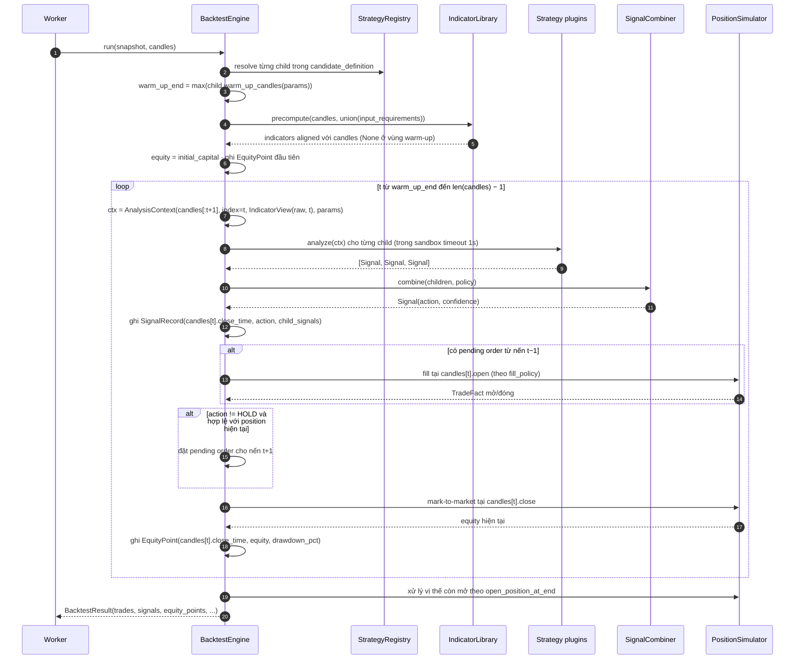
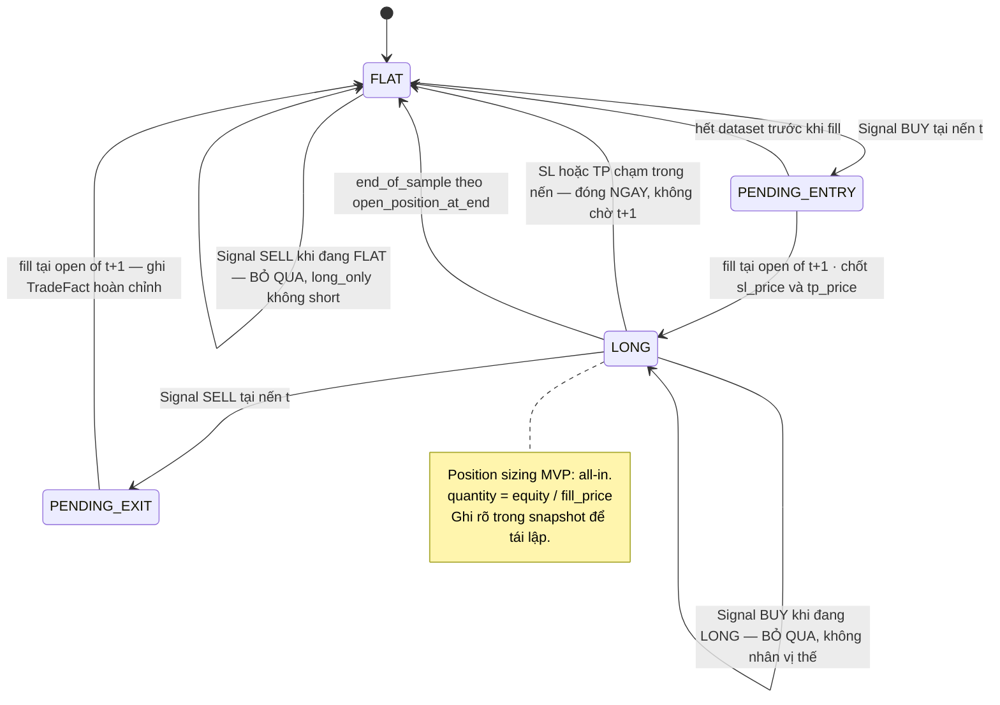

# Đặc tả: Backtest Engine

## Mô tả

Backtest Engine mô phỏng: *"nếu sử dụng strategy này trong quá khứ thì kết quả sẽ như thế nào?"* (đề bài §19). Nó nhận một `ExperimentSnapshot` bất biến cùng một tập nến đã version hoá, và trả về `BacktestResult` gồm **trade facts thô** — không tính metric.

Engine có 3 trách nhiệm và **chỉ** 3:

1. **Duyệt nến theo thứ tự thời gian**, gọi strategy tại mỗi nến, thu tín hiệu.
2. **Mô phỏng thực thi**: mở/đóng vị thế theo fill policy, áp fee và slippage, ghi lại từng trade.
3. **Ghi equity curve** để tính drawdown về sau.

Nó **không** tính Return, Win Rate, MDD, Sharpe — đó là việc của `Evaluator` (đề bài §20: *"Strategy Evaluation phải tách biệt khỏi Strategy Implementation"*). Việc tách này có một lợi ích rất cụ thể: đổi công thức metric chỉ cần tính lại từ `trades` và `equity_points`, **không** chạy lại backtest.

Đặc biệt phải đảm bảo:

- **Không look-ahead bias**: tín hiệu tính trên nến `t` được fill sớm nhất ở nến `t+1` (ADR-007). Đây là rủi ro R3 — sai chỗ này thì toàn bộ Leaderboard vô nghĩa.
- **Deterministic**: cùng snapshot + cùng dataset → kết quả **byte-identical** ở mọi lần chạy, mọi worker. Input `candles` của engine luôn được load từ `market_dataset_candles`, không từ operational cache.
- **Trade facts bất biến**: `trades` là fact, không phải view. Không bao giờ recompute và ghi đè.
- **Vị thế còn mở lúc hết dataset được xử lý tường minh**, không bỏ lửng.
- Precision bằng `Decimal`, không `float`.

## Contract

```python
class BacktestEngine(Protocol):
    def run(self, snapshot: ExperimentSnapshot,
            candles: Sequence[Candle]) -> BacktestResult: ...
```

`candles` trong contract trên là snapshot đã được Worker đọc từ `market_dataset_candles` theo `snapshot.market_dataset_id`, sắp xếp theo `close_time`. Engine không tự query bảng live `candles`.

```python
@dataclass(frozen=True)
class BacktestResult:
    trades: list[TradeFact]
    signals: list[SignalRecord]         # ghi vào run_signals — dùng để vẽ và giải thích
    equity_points: list[EquityPoint]
    candles_read: int
    warm_up_candles: int
    duration_ms: int


@dataclass(frozen=True)
class TradeFact:
    sequence_no: int
    side: Literal["LONG", "SHORT"]
    signal_t: datetime | None            # signal candle that caused entry; NULL when no signal-backed entry
    entry_time: datetime
    entry_price: Decimal                # giá đã áp slippage
    exit_time: datetime | None
    exit_price: Decimal | None
    quantity: Decimal
    fee_paid: Decimal                   # tổng fee cả entry + exit
    slippage_cost: Decimal
    pnl_absolute: Decimal | None          # unrealized khi exit_time=None + mark_unrealized
    pnl_percent: Decimal | None           # unrealized khi exit_time=None + mark_unrealized
    exit_reason: Literal["signal", "stop_loss", "take_profit", "end_of_sample"] | None


@dataclass(frozen=True)
class SignalRecord:
    candle_time: datetime
    signal: Literal["BUY", "SELL", "HOLD"]
    confidence: float | None
    child_signals: Mapping[str, Any] | None   # {'ma_cross':'BUY','rsi':'SELL','score':0.4}
```

Execution assumptions đến **từ snapshot**, không từ config toàn cục:

| Field                  | Giá trị mặc định         | Ý nghĩa                                          |
| ---------------------- | ------------------------ | ------------------------------------------------ |
| `initial_capital`      | `10000.00`               | Vốn ban đầu                                      |
| `fee_bps`              | `10` (= 0.10%)           | Phí mỗi fill (áp cả entry và exit)                |
| `slippage_bps`         | `5` (= 0.05%)            | Trượt giá mỗi fill, luôn theo hướng bất lợi       |
| `fill_policy`          | `next_candle_open`       | Xem §Luồng B                                     |
| `position_policy`      | `long_only`              | MVP chỉ LONG; `long_short` là mở rộng            |
| `open_position_at_end` | `close_at_last_candle`   | Xem §Luồng D                                     |
| **`risk_policy`**      | **`NULL`** (không SL/TP) | **Xem §Luồng C1 — là MVP, không phải extension** |

> **Vì sao execution assumptions nằm trong snapshot chứ không trong file config.** Nếu `fee_bps` là biến môi trường, thì hai experiment chạy cách nhau một tuần (sau khi ai đó đổi `.env`) sẽ có kết quả khác nhau mà provenance không ghi lại được. Đưa vào snapshot nghĩa là con số `+18.2%` trên Leaderboard luôn đọc được kèm điều kiện đã tạo ra nó.

### Contract của `risk_policy`

```json
{
  "stop_loss_pct":    2.0,
  "take_profit_pct":  5.0,
  "intrabar_priority": "stop_loss_first"
}
```

```python
@dataclass(frozen=True)
class RiskPolicy:
    stop_loss_pct: Decimal | None      # % dưới entry_price, > 0. None = không có SL
    take_profit_pct: Decimal | None    # % trên entry_price, > 0. None = không có TP
    intrabar_priority: Literal["stop_loss_first", "take_profit_first"] = "stop_loss_first"
```

`risk_policy = NULL` nghĩa là vị thế **chỉ** đóng bằng signal đối nghịch hoặc `end_of_sample` — đúng hành vi khi không có SL/TP. Đây là mặc định, nên một strategy technical thuần vẫn chạy như cũ.

**Vì sao SL/TP là MVP, không phải extension.** Đề bài đặt nó ở hai chỗ có vẻ mâu thuẫn: mục Multi-Timeframe Chart yêu cầu *"Chart cần visualize được: … điểm Entry, Stop Loss, Take Profit"*, còn mục Tùy chọn lại xếp *"Trading: Long/Short, Stop Loss, Take Profit, Trailing Stop, Position Sizing"* vào phần mở rộng. Đọc kỹ thì hai chỗ nói về hai thứ khác nhau:

| Đề bài nói | Thuộc | Blueprint chốt |
| ---------- | ----- | -------------- |
| Chart visualize được **Entry / Stop Loss / Take Profit** | Yêu cầu **visualization** — bắt buộc | `risk_policy` với `stop_loss_pct` / `take_profit_pct` **là MVP**. Không có nó thì `specs/visualization.md` có contract cho `stop_loss`/`take_profit` marker mà không có dữ liệu nào sinh ra chúng |
| **Trailing Stop, Position Sizing, Long/Short** | Yêu cầu **trading nâng cao** — tuỳ chọn | Không làm. `position_policy='long_short'` và trailing stop là seam đã có chỗ trong snapshot, không implement |

Nói cách khác: mức SL/TP **cố định theo phần trăm entry** là MVP vì chart phải vẽ được chúng; còn cơ chế điều chỉnh động (trailing) và sizing là extension. Chọn ngược lại — coi cả SL/TP là extension — sẽ để `specs/visualization.md` §Contract có hai `overlay_type` vĩnh viễn rỗng, và bước 9 của demo (*"chart hiện Buy/Sell/Entry/Exit/SL/TP"*) không diễn ra được.

## Luồng chính

### A. Vòng lặp chính



### B. Fill policy — chống look-ahead (ADR-007)

Đây là phần dễ sai nhất và có hậu quả lớn nhất.

```text
Nến t:  open=118000  high=118500  low=117800  close=118400  close_time=09:05:00
Nến t+1: open=118450 high=118900  low=118300  close=118700  close_time=09:10:00

Strategy đọc nến t (đã đóng) → trả BUY
```

| Policy               | Fill tại                 | Đúng/Sai                                                                                   |
| -------------------- | ------------------------ | ------------------------------------------------------------------------------------------ |
| `next_candle_open` ✅ | `118450` (open của t+1)  | **Đúng.** Giá này chưa biết lúc quyết định, nhưng là giá khả thi đầu tiên sau khi quyết định |
| `same_candle_close`  | `118400` (close của t)   | **Look-ahead.** Chỉ biết `close=118400` **sau khi** nến t đóng, nhưng lại giao dịch tại chính giá đó |

> **Mức độ nghiêm trọng.** `same_candle_close` giả định thực hiện được lệnh tại một giá đã biết trong quá khứ — nghĩa là mỗi trade được "chiết khấu" một khoản bằng chênh lệch `close(t) → open(t+1)`. Trên khung 5m với strategy giao dịch thường xuyên (80+ trade), khoản này tích luỹ đủ để **lật dấu** Total Return từ âm sang dương. Đó là lý do `same_candle_close` vẫn được giữ làm option: để so sánh và chứng minh nhóm hiểu tác động, **không** để dùng làm mặc định.

Áp slippage và fee (luôn theo hướng bất lợi):

```python
def fill_price(raw: Decimal, side: str, is_entry: bool, slippage_bps: int) -> Decimal:
    slip = raw * Decimal(slippage_bps) / Decimal(10_000)
    if (side == "LONG") == is_entry:      # mua vào (LONG entry) hoặc mua để đóng SHORT
        return raw + slip                 # trả cao hơn
    return raw - slip                     # bán ra: nhận thấp hơn

fee = fill_px * qty * Decimal(fee_bps) / Decimal(10_000)   # áp ở CẢ entry và exit
```

`slippage_cost` và `fee_paid` được ghi riêng vào `trades` — nhờ đó trả lời được "strategy này có lãi trước phí không?" mà không cần chạy lại.

### C. Position state machine (`long_only`)



Ba quy tắc dễ bỏ sót trong state machine này:

- **`BUY` khi đang `LONG` bị bỏ qua**, không cộng thêm vị thế. Nếu không bỏ qua thì strategy ra `BUY` 50 nến liên tiếp sẽ tạo 50 trade chồng nhau và Return trở nên vô nghĩa. Signal vẫn được ghi vào `run_signals` (để giải thích), chỉ không tạo order.
- **`SELL` khi đang `FLAT` bị bỏ qua** với `long_only`. Với `long_short` (mở rộng) thì nó mở SHORT.
- **SL/TP đóng vị thế *trong* nến, không qua `PENDING_EXIT`.** Đây là ngoại lệ duy nhất của quy tắc `next_candle_open`, và nó đúng: SL/TP là lệnh chờ đã đặt sẵn trên sàn từ lúc vào vị thế, nên khi giá chạm mức đó thì nó khớp ngay — không phải một quyết định mới cần chờ nến sau. Chi tiết ở §C1.

### C1. Stop Loss / Take Profit — mức giá và thứ tự ưu tiên

**Chốt mức giá tại thời điểm entry**, không tính lại mỗi nến:

```python
# Ngay sau khi PENDING_ENTRY → LONG, tại open(t+1)
entry_px = fill_price(candles[t + 1].open, "LONG", is_entry=True, slippage_bps)
sl_price = entry_px * (1 - risk.stop_loss_pct   / 100) if risk.stop_loss_pct   else None
tp_price = entry_px * (1 + risk.take_profit_pct / 100) if risk.take_profit_pct else None
```

Hai mức này là **trigger level** và được lưu vào `trades.sl_price` / `trades.tp_price` — đó là nguồn dữ liệu cho `overlay_type: "stop_loss"` / `"take_profit"` ở `specs/visualization.md`, và là lý do chúng vẽ được thành **đường ngang từ `entry_time` đến `exit_time`** thay vì một điểm.

> **Vì sao chốt tại entry, không tính lại mỗi nến.** Tính lại theo giá hiện tại là trailing stop — một hành vi khác hoàn toàn và nằm trong phần tuỳ chọn của đề bài. SL cố định cho một mức giá không đổi suốt vòng đời vị thế, nên vẽ được và giải thích được. Nếu về sau làm trailing stop thì đó là `risk_policy.trailing_pct` mới, và `trades` cần thêm cột lịch sử mức SL — một thay đổi có phạm vi rõ ràng, không phải sửa chỗ này.

**Kiểm tra chạm mức mỗi nến** — dùng `low`/`high`, không dùng `close`:

```python
def check_exit(candle: Candle, sl: Decimal | None, tp: Decimal | None,
               priority: str) -> tuple[Decimal, str] | None:
    hit_sl = sl is not None and candle.low  <= sl
    hit_tp = tp is not None and candle.high >= tp

    if hit_sl and hit_tp:                      # cả hai chạm trong CÙNG một nến
        # Dữ liệu OHLCV không cho biết cái nào chạm trước.
        return (sl, "stop_loss") if priority == "stop_loss_first" else (tp, "take_profit")
    if hit_sl:
        return sl, "stop_loss"
    if hit_tp:
        return tp, "take_profit"
    return None
```

> **Vấn đề intrabar và vì sao `stop_loss_first` là mặc định.** Một nến 5m có `low = 115000` và `high = 121000` với `sl_price = 116000`, `tp_price = 120000` — cả hai đều bị chạm. Nến OHLCV **không chứa thông tin thứ tự**: ta không biết giá xuống 115000 trước rồi mới lên 121000, hay ngược lại. Ba cách xử lý:
>
> | Cách | Vấn đề |
> | ---- | ------ |
> | Giả định TP trước | **Optimistic bias** — mọi nến biến động lớn đều thành trade thắng. Đây là look-ahead bias ở dạng khác: dùng thông tin không có trong dữ liệu để chọn kết quả có lợi |
> | Nội suy từ timeframe nhỏ hơn | Đúng nhất, nhưng cần nạp thêm dữ liệu 1m cho mọi backtest → phá giới hạn 20.000 nến và làm dataset không còn là một `content_hash` duy nhất |
> | **Giả định SL trước** ✅ | **Conservative bias** — thiên về kết quả xấu hơn. Sai theo hướng an toàn: một strategy trông tốt trong backtest sẽ không tốt hơn thế trong thực tế |
>
> Chọn cách thứ ba làm mặc định, nhưng để `intrabar_priority` là **field trong snapshot** để nhóm chứng minh được tác động của giả định này (AC-17b) — chứ không phải một hằng số ẩn trong code.

**Trigger của SL/TP là chính mức đã chốt, không phải giá nến.** Khi chạm trigger,
`exit_price = fill_price(trigger_price, "LONG", is_entry=False, slippage_bps)`;
với lệnh LONG, slippage làm giá fill thấp hơn trigger. `trades.sl_price` /
`trades.tp_price` vẫn là mức trigger để overlay vẽ đúng đường lệnh; `trades.exit_price`
là execution fact sau slippage. Dùng `candle.low` làm exit price sẽ giả định khớp ở đáy
nến — tệ hơn mức fill đã mô hình hoá và không tái lập được từ execution policy.

**Thứ tự kiểm tra trong một nến** (quan trọng, dễ sai):

1. Fill pending order từ nến `t−1` (nếu có) tại `open(t)`.
2. Nếu đang `LONG`: gọi `check_exit(candles[t], ...)`. Chạm → đóng ngay, `exit_reason='stop_loss'|'take_profit'`.
3. Nếu vẫn `LONG`: gọi strategy, thu signal, đặt pending order cho `t+1` nếu cần.
4. Mark-to-market tại `close(t)`, ghi `EquityPoint`.

Bước 2 **trước** bước 3 vì SL/TP là lệnh đã tồn tại trên sàn; signal mới không thể "hủy" một lệnh đã khớp. Đảo thứ tự sẽ cho phép một signal `SELL` ở nến `t` che mất việc SL đã chạm ở chính nến đó — và trade sẽ đóng ở `open(t+1)` với giá tốt hơn mức SL.

Cột thêm vào `trades`:

```sql
ALTER TABLE trades
    ADD COLUMN sl_price NUMERIC(24,8),      -- NULL nếu risk_policy không có SL
    ADD COLUMN tp_price NUMERIC(24,8);      -- NULL nếu risk_policy không có TP
```

`exit_reason` đã có sẵn `'stop_loss'` và `'take_profit'` trong enum từ đầu, nên không cần đổi type.

### D. Vị thế còn mở khi hết dataset

Đề bài không nêu, nhưng bỏ qua chi tiết này làm Return sai đáng kể với strategy ít trade (một strategy 5 trade mà trade cuối còn mở thì 20% dữ liệu bị bỏ).

| `open_position_at_end`   | Hành vi                                                                  |
| ------------------------ | ------------------------------------------------------------------------ |
| `close_at_last_candle` ✅ | Đóng tại `close` của nến cuối, `exit_reason='end_of_sample'`, có áp fee+slippage |
| `discard_open_trade`     | Bỏ row trade mở khỏi `trades`/`open_trade_count`, nhưng equity vẫn mark-to-market tới nến cuối để Return/MDD phản ánh giá trị danh mục; các metric dựa trên trade không tính row bị bỏ |
| `mark_unrealized`        | Giữ trade với `exit_time=NULL`; `pnl` là unrealized. Evaluator đếm row này vào `open_trade_count`, **không** vào `trade_count`/Win Rate/profit factor/avg trade; equity và MDD vẫn mark-to-market |

Mặc định `close_at_last_candle` vì nó cho một con số Return có thể so sánh giữa các strategy. `mark_unrealized` vẫn cho Return/MDD xác định nhờ equity mark-to-market, nhưng các metric dựa trên kết quả trade chỉ dùng trade đã settled; UI phải hiện rõ `open_trade_count` thay vì biến vị thế mở thành một win/loss.

### E. Equity curve và drawdown

```python
peak = initial_capital
for t in range(warm_up_end, len(candles)):
    equity = cash + position_value_at(candles[t].close)   # mark-to-market
    peak = max(peak, equity)
    dd_pct = (equity - peak) / peak * 100                 # ≤ 0
    equity_points.append(EquityPoint(candles[t].close_time, equity, dd_pct))
```

> **Vì sao mark-to-market mỗi nến, không chỉ tại lúc đóng trade.** Drawdown trong lúc **đang giữ** vị thế là drawdown thật — nó là mức lỗ mà người dùng thực sự phải chịu đựng. Một strategy vào lệnh ở 118K, giá xuống 100K rồi lên 125K mới bán có Return dương nhưng MDD −15%. Nếu chỉ ghi equity tại lúc đóng trade thì MDD tính ra là 0% — sai hoàn toàn về mặt rủi ro, và đó chính là điều đề bài §20 muốn hệ thống phản ánh đúng.

Số lượng `equity_points` = số nến (tối đa 20.000). API decimate xuống ≤ 2000 điểm khi trả về (`specs/visualization.md`), nhưng DB giữ đủ để tính MDD chính xác.

## Kịch bản lỗi

| Tình huống                                                     | Phản ứng                                                                                                        |
| -------------------------------------------------------------- | --------------------------------------------------------------------------------------------------------------- |
| Số nến ít hơn `warm_up_end`                                    | `422 insufficient_candles` với `required` và `available` — reject **trước khi** tạo experiment, không chạy rồi trả 0 trade |
| Strategy raise exception tại nến thứ 500                       | `StrategyFailure` → `backtest_runs.status='failed'`, `error_code='strategy_exception'`. **Không** ghi partial trades |
| Strategy timeout (> 1 s/call)                                  | `error_code='strategy_timeout'`, candidate `failed`. Worker vẫn sống                                             |
| Strategy trả `BUY` ở mọi nến                                   | Chỉ 1 trade mở (state machine bỏ qua `BUY` khi đang `LONG`). Signal vẫn ghi đủ vào `run_signals`                  |
| Strategy trả `HOLD` ở mọi nến                                  | 0 trade. `BacktestResult` hợp lệ với `trades=[]`. `Evaluator` xử lý (không chia cho 0)                            |
| Nến có `volume = 0` (không thanh khoản)                        | Vẫn fill (đây là backtest, không phải mô phỏng orderbook). Ghi cờ `low_liquidity` vào diagnostics để người đọc biết |
| Gap giá lớn giữa `close(t)` và `open(t+1)`                     | Fill tại `open(t+1)` thật — đó là hiện thực. **Không** clamp, **không** nội suy                                    |
| Nến bị thiếu giữa dataset (gap thời gian)                      | Engine duyệt theo **index**, không theo thời gian → vẫn chạy. `market_datasets.candle_count` + `content_hash` phản ánh dataset thật; gap được nêu trong diagnostics |
| `equity` xuống ≤ 0 (cháy tài khoản)                            | Dừng vòng lặp, đóng vị thế tại nến đó, `exit_reason='end_of_sample'`, ghi `error_code=null` nhưng `diagnostics.liquidated=true`. Kết quả **vẫn hợp lệ** (đó là kết quả thật của strategy) |
| Worker chết giữa backtest                                      | Job chưa `complete` → lease hết hạn ≤ 120 s → worker khác nhận với `attempt+1`. **Không** có partial `trades` vì chỉ commit khi xong (`specs/experiment.md`) |
| Hai worker cùng nhận một job (lease race)                      | `UNIQUE (experiment_id)` trên `backtest_runs` → chỉ 1 INSERT thành công; worker thua bỏ qua                       |
| Chạy lại cùng snapshot ra kết quả khác                         | **Bug nghiêm trọng.** Nguyên nhân thường là: đọc nhầm operational cache thay vì `market_dataset_candles`, `float` thay `Decimal`, dùng `datetime.now()`, iterate qua `set`/`dict` không sort, random không seed. Có test AC-02 chặn |
| `fee_bps` hoặc `slippage_bps` âm                               | `CHECK (fee_bps >= 0 AND slippage_bps >= 0)` ở DB + validate ở API → `422`                                       |
| `initial_capital = 0`                                          | `CHECK (initial_capital > 0)` → `422`. Nếu cho 0 thì `quantity = 0/price = 0` và mọi metric là NaN                |
| Số nến vượt 20.000                                             | `422 dataset_too_large` (ADR-014) — chặn ở API, không để OOM Python process                                       |
| `stop_loss_pct` hoặc `take_profit_pct` ≤ 0                     | `422 invalid_risk_policy` — `0%` bị từ chối vì trigger trùng entry và đóng ngay lúc vào lệnh; giá trị âm vô nghĩa |
| `stop_loss_pct ≥ 100`                                          | `422` — SL ở mức giá ≤ 0 không tồn tại                                                                            |
| SL và TP **cùng chạm** trong một nến                            | Quyết định theo `intrabar_priority` (mặc định `stop_loss_first`). `diagnostics.intrabar_ambiguous_exits` đếm số lần xảy ra → người đọc biết kết quả phụ thuộc giả định này bao nhiêu |
| Nến đầu tiên sau entry đã chạm cả SL và TP                       | Giống trên. Đây là trường hợp thường gặp nhất khi `stop_loss_pct` nhỏ và nến biến động lớn — vì thế `intrabar_ambiguous_exits` là chỉ số quan trọng, không phải chi tiết phụ |
| Gap qua đêm nhảy qua cả `sl_price` (giá mở nến thấp hơn SL)      | Dùng trigger `sl_price` rồi áp exit slippage — **không** dùng `open` thật. Đánh dấu `diagnostics.gapped_exits += 1`. Đây là giả định lạc quan (thực tế lệnh khớp ở giá xấu hơn), ghi rõ để không tưởng là chính xác |
| `risk_policy` có SL/TP nhưng strategy không bao giờ ra `BUY`     | 0 trade, `sl_price`/`tp_price` không có row nào. `specs/visualization.md` trả mảng marker rỗng, không lỗi           |
| `risk_policy = NULL` nhưng UI bật hiển thị SL/TP                 | `GET /experiments/{id}/overlays` trả 0 marker loại `stop_loss`/`take_profit`; UI ẩn toggle thay vì hiện checkbox rỗng |
| `run_signals` có 20.000 row cho 1 run × 500 candidate          | 10M row/search run. Retention: xoá `run_signals` của candidate **không vào Top-K** sau 7 ngày; giữ của entry Leaderboard |

## Ràng buộc

**Tính đúng đắn**

- Fill sớm nhất ở nến `t+1` với `next_candle_open`. Không có đường code nào đọc `candles[i]` với `i > ctx.index` trong lúc tính signal.
- **Chống look-ahead có 3 tầng, không 1.** (a) `candles[:t+1]` — đọc nến tương lai là `IndexError`; (b) `IndicatorView(raw, t)` — đọc indicator tại index `> t` là `LookAheadError`, còn `[-1]`, `len()` và slice được diễn giải/clamp trong phạm vi `[0, t]` (`design.md` §5.2.1); (c) `fill_policy` — không giao dịch tại giá chưa biết lúc quyết định. Thiếu tầng (b) thì tầng (a) gần như vô nghĩa: `rsi_14[t+1]` được tính từ `close[t+1]`.
- Mọi giá, số lượng, fee dùng `Decimal`/`NUMERIC(24,8)`. **Không** `float` ở bất kỳ đâu trong engine.
- Slippage luôn theo hướng bất lợi cho người giao dịch.
- **SL/TP chốt tại entry và không đổi.** Điều chỉnh động là trailing stop — hành vi khác, thuộc extension.
- **SL/TP kiểm bằng `low`/`high` của nến, đóng ở mức đã chốt.** Dùng `close` bỏ sót mọi lần chạm trong nến; dùng `low` làm exit price giả định khớp ở đáy nến (tốt hơn thực tế).
- **SL/TP kiểm *trước* khi gọi strategy trong cùng nến.** Lệnh chờ đã tồn tại trên sàn; một signal mới không hủy được lệnh đã khớp.
- **Ngoại lệ duy nhất của `next_candle_open` là SL/TP** — chúng đóng ngay trong nến vì là lệnh chờ, không phải quyết định mới.
- `intrabar_priority` mặc định `stop_loss_first` (conservative). Số lần cần dùng đến nó được đếm trong `diagnostics.intrabar_ambiguous_exits`.
- Fee áp ở **cả** entry và exit.
- Equity mark-to-market **mỗi nến**, không chỉ tại lúc đóng trade.
- `trades` chỉ được INSERT một lần, trong cùng transaction với `backtest_runs.status='completed'`.
- Deterministic: không `datetime.now()`, không random không seed, không iterate cấu trúc không có thứ tự xác định.

**Hiệu năng**

- Throughput 1 worker: **≥ 0.5 candidate/giây** với 10.000 nến và composite 3 strategy (`proposal.md` §2.2).
- Indicator precompute một lần: 20.000 nến × 4 indicator trong **< 500 ms**.
- Bulk INSERT `trades`/`run_signals`/`equity_points` bằng batch, không loop từng row.
- Bộ nhớ: 20.000 nến × 5 field `Decimal` ≈ 8 MB — nằm trong ngân sách; đây là lý do giới hạn 20.000 tồn tại.
- Vòng lặp chính: **< 100 µs/nến** cho composite 3 strategy.

**Khả năng mở rộng**

- Thêm `fill_policy` mới = thêm nhánh trong `PositionSimulator` + giá trị enum. Không đụng vòng lặp chính.
- `position_policy='long_short'` = mở rộng state machine. Snapshot đã có field nên không cần migration.
- **SL/TP là MVP** (§C1), không phải extension: `risk_policy` với `stop_loss_pct`/`take_profit_pct` cố định theo % entry, và `intrabar_priority` để giả định intrabar là tường minh.
- Trailing Stop = thêm `risk_policy.trailing_pct` + cột lịch sử mức SL trong `trades`. Là extension, có phạm vi thay đổi rõ ràng.
- `position_policy='long_short'` = mở rộng state machine. Snapshot đã có field nên không cần migration.
- Position Sizing (Kelly, fixed-fractional) = thêm `sizing_policy` vào snapshot; MVP là all-in.
- Engine **không** biết strategy nào đang chạy — nó gọi qua `Strategy` Protocol. Thêm MACD không đụng engine (`specs/strategy-registry.md`).

**Quan sát được**

- `backtest_duration_seconds` histogram (label: `strategy_family`, `candle_count_bucket`)
- `backtest_candles_read` histogram
- `backtest_signals_generated` counter
- `strategy_analyze_seconds{strategy_id}` histogram
- `backtest_runs.diagnostics` JSONB ghi: `warm_up_candles`, `signals_by_action`, `skipped_orders`, `liquidated`, `gaps_in_dataset`, `intrabar_ambiguous_exits`, `gapped_exits`, `discarded_open_trades`
- `backtest_exits_total{exit_reason}` counter — phân bố `signal` / `stop_loss` / `take_profit` / `end_of_sample`. Một run có 100% `stop_loss` nghĩa là `stop_loss_pct` quá chặt so với biến động của timeframe đó

## Tiêu chí chấp nhận

- [ ] AC-01: Fixture 200 nến với kết quả tính tay trước (xem `specs/evaluation.md` §ví dụ) → `trades`, `entry_price`, `exit_price`, `fee_paid` khớp **chính xác** từng con số.
- [ ] AC-02: Chạy cùng snapshot 2 lần, sau khi refresh/revise bảng `candles` → `trades` và `equity_points` **byte-identical** (so sánh bằng hash của kết quả serialize canonical), chứng minh engine đọc `market_dataset_candles`.
- [ ] AC-03: Chạy cùng snapshot trên 2 worker khác nhau → kết quả identical.
- [ ] AC-04: Test look-ahead — strategy trả `BUY` tại nến `t` → `trades[0].entry_price` bằng `candles[t+1].open` (đã áp slippage), **không** bằng `candles[t].close`.
- [ ] AC-05: Test look-ahead cứng — inject một strategy cố đọc `ctx.candles[ctx.index + 1]` → `IndexError`, không phải giá trị.
- [ ] AC-05b: Inject strategy đọc `ctx.indicators["rsi_14"][ctx.index + 1]` → `LookAheadError`, **không** phải giá trị thật. Lặp lại với `[ctx.index + 5]` và `[-1]`: `[-1]` phải trả đúng giá trị **tại `index`**, không phải phần tử cuối dataset.
- [ ] AC-05c: Inject strategy đọc `ctx.indicators["sma_20"][len(ctx.indicators["sma_20"]) - 1]` → trả giá trị tại `index` (vì `len()` = `index + 1`), **không** phải nến cuối dataset. Và `ctx.indicators["sma_20"][:]` trả đúng `index + 1` phần tử.
- [ ] AC-05d: Chạy fixture 200 nến bằng một strategy "gian lận" đọc `indicators[...][index+1]`, so với cùng strategy chỉ đọc `[index]`. Nếu `IndicatorView` bị vô hiệu hoá thì bản gian lận cho Return cao hơn rõ rệt — test assert bản gian lận **fail bằng `LookAheadError`**, không phải so sánh số. (Nếu chỉ so số thì test sẽ pass một cách vô nghĩa khi cả hai đều bị chặn.)
- [ ] AC-06: Strategy `HOLD` mọi nến → `trades == []`, `BacktestResult` hợp lệ, không exception, `Evaluator` trả metric với `trade_count=0`.
- [ ] AC-07: Strategy `BUY` mọi nến → đúng **1** trade (mở ở đầu, đóng ở `end_of_sample`), `run_signals` có đủ 20.000 record.
- [ ] AC-08: Đổi `fill_policy` từ `next_candle_open` sang `same_candle_close` trên cùng snapshot → `total_return_pct` khác nhau đo được (chứng minh policy có tác động thật, không phải field trang trí).
- [ ] AC-09: Đặt `fee_bps=0, slippage_bps=0` → `sum(fee_paid) == 0` và `sum(slippage_cost) == 0`; Return cao hơn trường hợp có phí.
- [ ] AC-10: Vị thế còn mở lúc hết dataset → có trade với `exit_reason='end_of_sample'` và `exit_price == fill_price(candles[-1].close, "LONG", is_entry=False, slippage_bps)`.
- [ ] AC-11: `open_position_at_end='discard_open_trade'` trên cùng dữ liệu → ít hơn đúng 1 trade, diagnostics ghi `discarded_open_trades=1`.
- [ ] AC-11b: `open_position_at_end='mark_unrealized'` → trade cuối có `exit_time=NULL`, `open_trade_count=1`, không làm tăng `trade_count`/Win Rate/profit factor; equity và MDD vẫn bao gồm giá trị mark-to-market của trade đó.
- [ ] AC-12: Số nến < `warm_up_end` → `422 insufficient_candles` **trước khi** tạo experiment; không có row nào trong `backtest_jobs`.
- [ ] AC-13: Strategy raise exception ở nến 500 → `backtest_runs.status='failed'`, bảng `trades` có **0 row** cho run đó (không partial commit).
- [ ] AC-14: Kill worker giữa backtest → sau ≤ 120 s job về `queued`, worker khác chạy lại, kết quả cuối cùng đúng và **không** trùng row.
- [ ] AC-15: Strategy mua ở 118K, giá xuống 100K rồi lên 125K mới bán → `evaluations.max_drawdown_pct` phản ánh mức −15% (chứng minh mark-to-market mỗi nến, không chỉ tại lúc đóng trade).
- [ ] AC-16: `grep -rn "float(" app/domain/backtest/` → 0 kết quả (chứng minh dùng `Decimal`).
- [ ] AC-17: `risk_policy = {stop_loss_pct: 2.0, take_profit_pct: 5.0}` trên fixture có nến chạm SL → trade đóng với `exit_reason='stop_loss'`, `sl_price` là trigger và `exit_price == fill_price(sl_price, "LONG", is_entry=False, slippage_bps)`, **không** bằng `candles[t].low`; `trades.sl_price` và `trades.tp_price` được ghi.
- [ ] AC-17b: Fixture có một nến `low < sl_price` **và** `high > tp_price` → với `intrabar_priority='stop_loss_first'` cho `exit_reason='stop_loss'`; đổi sang `'take_profit_first'` trên cùng snapshot cho `'take_profit'` và `total_return_pct` khác nhau đo được. `diagnostics.intrabar_ambiguous_exits == 1` ở cả hai.
- [ ] AC-17c: SL chạm ở nến `t` **và** strategy trả `SELL` ở cùng nến `t` → trade đóng với `exit_reason='stop_loss'`, trigger `sl_price` và execution `exit_price = fill_price(sl_price, "LONG", is_entry=False, slippage_bps)`, **không** phải bằng signal tại `open(t+1)` (chứng minh thứ tự kiểm tra bước 2 trước bước 3).
- [ ] AC-17d: `risk_policy = NULL` → không trade nào có `exit_reason ∈ ('stop_loss','take_profit')`; `sl_price`/`tp_price` đều `NULL`; `GET /experiments/{id}/overlays` trả 0 marker hai loại đó.
- [ ] AC-17e: `stop_loss_pct = 0` → `422 invalid_risk_policy`; `stop_loss_pct = 150` → `422`.
- [ ] AC-18: `GET /experiments/{id}/overlays` cho một run có SL/TP → mỗi trade có marker `stop_loss` và `take_profit` với `line_until = exit_time` (đường ngang, không phải điểm) — khớp contract ở `specs/visualization.md`.
