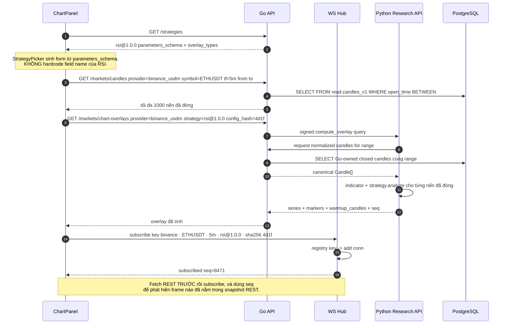
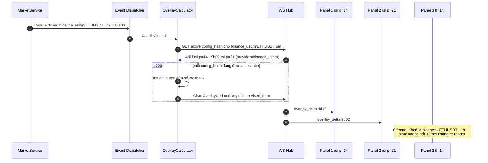

# Đặc tả: Chart Overlay LIVE (indicator + signal realtime)

## Mô tả

Module này trả lời đúng một câu hỏi: *"Trên chart của panel này, ngoài nến, phải vẽ những đường và marker nào, giá trị bao nhiêu, tại thời điểm nào?"* — và trả lời nó **ở backend**. Frontend nhận về danh sách điểm `(t, value)` kèm tên series rồi vẽ. Không có một dòng nào trong `web/` tính RSI, SMA hay Bollinger band.

Overlay live gồm ba loại: **indicator series** (`moving_average`, `rsi`, `bollinger_bands`, `macd_line`, `macd_signal`), **zone** (`support_zone`, `resistance_zone`) và **signal marker** (`buy_signal`, `sell_signal`). Danh sách overlay khả dụng cho một strategy không do frontend đoán — nó đọc `strategy_versions.overlay_types` qua `GET /api/v1/strategies`. Thêm `MACDStrategy` khai báo `overlay_types = ["macd_line","macd_signal","buy_signal","sell_signal"]` thì chart tự biết vẽ thêm hai đường, `web/` sửa **0 dòng** (`design.md` §8.1, ADR-002).

Bốn panel trên dashboard là bốn **subscription độc lập**, khoá là `(provider, symbol, timeframe, strategy_id@version, config_hash)`. Panel 1 xem `binance_usdm/ETHUSDT 5m RSI(14)`, Panel 2 xem `binance_usdm/ETHUSDT 15m RSI(21)`: hai khoá khác nhau ở cả `timeframe` lẫn `config_hash`, nên `CandleClosed` của `5m` chỉ chạm Panel 1, và delta của RSI(21) không bao giờ lọt vào series của RSI(14). Provider là một phần của identity để `binance_usdm/ETHUSDT` không nhận nhầm delta từ `okx/ETHUSDT`.

Execution marker (`entry`, `exit`, `stop_loss`, `take_profit`) **không** thuộc đặc tả này. Chúng cần fill policy, position state và execution assumptions đã ghi lại của một backtest run nên không suy ra được từ signal live — xem `specs/visualization.md`.

Đặc biệt phải đảm bảo:

- **0 domain calculation trong `web/`**: mọi giá trị overlay là số backend đã tính; frontend chỉ format và vẽ.
- Overlay chỉ có điểm trên nến **đã đóng**. Nến provisional có nến (để chart mượt) nhưng **không có** điểm overlay và **không có** signal marker.
- Đổi timeframe của Chart 1 → Chart 2/3/4 re-render **0 lần**.
- **0 frame** lọt sang subscription khác `config_hash` hoặc provider, dù cùng `(symbol, timeframe)`.
- Feed stale → nến và overlay lịch sử **vẫn render** kèm badge `STALE`; không nội suy, không fake điểm mới (ADR-013).
- Thêm strategy mới = 0 dòng frontend, 0 dòng Go, 0 migration.

## Contract

### Khoá subscription và `config_hash`

```go
# app/domain/strategy/config_hash.py
func ConfigHash(strategyID, version string, validatedParams json.RawMessage) string {
    payload := CanonicalJSON(struct {
        StrategyID string          `json:"strategy_id"`
        Version    string          `json:"version"`
        Parameters json.RawMessage `json:"parameters"`
    }{strategyID, version, validatedParams})
    return "sha256:" + SHA256Hex(payload)

// CanonicalJSON: sort key theo byte, số chuẩn hoá, chuỗi NFC, không space.
```

> Không có `canonical_json` thì `{"a":1,"b":2}` và `{"b":2,"a":1}` cho hai hash khác nhau, và dedup/cache **vô hiệu một cách âm thầm** — không lỗi, chỉ là mỗi panel tự tính lại một series y hệt và cache hit rate = 0. Cùng lý do với `candidate_hash` ở ADR-003.

```
subscription_key = "{provider}|{symbol}|{timeframe}|{strategy_id}@{version}|{config_hash}"
ví dụ:  binance_usdm|ETHUSDT|5m|rsi@1.0.0|sha256:4d1f9c...
```

`provider` và `config_hash` đều **bắt buộc** trong khoá: `RSI(14,30,70)` và `RSI(21,30,70)` là hai series khác nhau trên cùng `(binance_usdm/ETHUSDT, 5m)`, còn Binance và OKX có thể cùng cung cấp `ETHUSDT`. Bỏ một trong hai ra khỏi khoá thì Panel nhận delta của series/provider khác và vẽ sai — sai theo cách trông rất hợp lý, vì đường vẫn liền mạch.

### `GET /api/v1/markets/chart-overlays`

```
GET /api/v1/markets/chart-overlays
      ?provider=binance_usdm
      &symbol=ETHUSDT
      &timeframe=5m
      &strategy=rsi@1.0.0
      &config_hash=sha256:4d1f9c...
      &from=2026-08-11T00:00:00Z
      &to=2026-08-11T08:00:00Z
```

```json
{
  "provider": "binance_usdm",
  "symbol": "ETHUSDT",
  "timeframe": "5m",
  "strategy": "rsi@1.0.0",
  "config_hash": "sha256:4d1f9c...",
  "range": { "from": "2026-08-11T00:00:00Z", "to": "2026-08-11T08:00:00Z" },
  "warmup_candles": 14,
  "first_valid_at": "2026-08-11T01:10:00Z",
  "last_closed_at": "2026-08-11T07:55:00Z",
  "is_stale": false,
  "seq": 8471,
  "series": [
    { "name": "rsi", "overlay_type": "rsi", "pane": "sub",
      "unit": "index", "scale": { "min": 0, "max": 100 },
      "points": [
        { "t": "2026-08-11T01:10:00Z", "v": 41.83 },
        { "t": "2026-08-11T01:15:00Z", "v": 44.02 }
      ] },
    { "name": "rsi_buy_threshold", "overlay_type": "rsi", "pane": "sub",
      "style": "dashed", "constant": 30 }
  ],
  "markers": [
    { "t": "2026-08-11T03:40:00Z", "overlay_type": "buy_signal",
      "confidence": 0.72,
      "evidence": { "rsi": 28.4, "threshold": 30 } }
  ],
  "gaps": []
}
```

```typescript
// web/lib/types.ts — generated từ OpenAPI của Go. web/ chỉ tiêu thụ.
export type OverlayType =
  | 'moving_average' | 'rsi' | 'bollinger_bands'
  | 'support_zone'  | 'resistance_zone'
  | 'buy_signal'    | 'sell_signal'
  | 'macd_line'     | 'macd_signal';

export interface OverlayPoint { t: string; v: number | null }   // null = gap, KHÔNG nội suy
export interface OverlaySeries {
  name: string; overlay_type: OverlayType;
  pane: 'main' | 'sub';                 // main = chồng lên nến, sub = pane riêng
  points?: OverlayPoint[];
  band?: { upper: OverlayPoint[]; middle: OverlayPoint[]; lower: OverlayPoint[] };
  zones?: { from: string; to: string; price_low: number; price_high: number }[];
  constant?: number; style?: 'solid' | 'dashed';
}
export interface OverlayMarker {
  t: string; overlay_type: 'buy_signal' | 'sell_signal';
  confidence: number | null; evidence: Record<string, number | string> | null;
}
```

> `bollinger_bands` trả **một** series với `band.{upper,middle,lower}` chứ không phải ba series rời. Lý do: ba đường đó phải cùng `config_hash` và cùng độ dài; tách thành ba series cho phép trạng thái lệch nhau (upper đã có điểm mới, lower chưa) và chart sẽ vẽ vùng fill sai trong một frame.

### Frame WebSocket — `GET /api/v1/markets/stream`

`ChartKline` là DTO presentation riêng. Nó không phải `market.Candle`, không
được đưa vào strategy, và không giữ field Binance `k.*`. Giá truyền chuỗi decimal
để boundary JSON không làm mất precision; frontend chỉ parse để vẽ.

```go
// server/internal/transport/ws/chart_kline.go
type ChartKline struct {
	OpenTime, CloseTime string
	Open, High, Low, Close, Volume string
	TradeCount *int
}
// Frame Kline có Final. MarketService chỉ tạo market.Candle khi Final=true.
```

**Realtime transport boundary**: `/api/v1/markets/stream` là public product
route của blueprint. Architecture gọi cùng normalized event plane là
`/api/v1/realtime`; đó là logical facade name, không phải một hub thứ hai. Nếu
runtime expose alias, hai route phải dùng cùng registry, lifecycle và sequence
source. Các event ngoài chart (`CandleClosed`, `BBOUpdated`,
`StreamStatusChanged`, `SignalGenerated`, `OrderUpdated`, `PositionUpdated`,
`BacktestProgress`) đều là DTO normalized; browser không nhận Binance envelope,
`coder/websocket` type hoặc private User Data Stream payload.

```json
// client → server
{ "action": "subscribe",   "key": "binance_usdm|ETHUSDT|5m|rsi@1.0.0|sha256:4d1f9c...", "req": "c17" }
{ "action": "unsubscribe", "key": "binance_usdm|ETHUSDT|5m|rsi@1.0.0|sha256:4d1f9c...", "req": "c18" }

// server → client: ack
{ "type": "subscribed", "key": "binance_usdm|ETHUSDT|5m|...", "req": "c17", "seq": 8471 }

// server → client: Kline provisional (KHÔNG kèm overlay)
{ "type": "kline", "key": "binance_usdm|ETHUSDT|5m|...", "final": false,
  "kline": { "open_time": "2026-08-11T08:00:00Z", "close_time": "2026-08-11T08:04:59.999Z",
               "open": "118000", "high": "118220", "low": "117960", "close": "118150", "volume": "42.1" } }

// server → client: nến đóng + overlay delta, cùng seq
{ "type": "kline", "key": "...", "seq": 8472, "final": true,
  "kline": { "open_time": "2026-08-11T08:00:00Z", "close_time": "2026-08-11T08:04:59.999Z",
               "open": "118000", "high": "118260", "low": "117940", "close": "118210", "volume": "47.9" } }
{ "type": "overlay_delta", "key": "...", "seq": 8472,
  "revised_from": "2026-08-11T07:20:00Z",
  "series": [ { "name": "rsi", "points": [ { "t": "2026-08-11T08:00:00Z", "v": 57.31 } ] } ],
  "markers": [] }

// server → client: trạng thái feed
{ "type": "stream_stale",     "key": "...", "last_closed_at": "2026-08-11T07:55:00Z" }
{ "type": "stream_recovered", "key": "...", "last_closed_at": "2026-08-11T08:15:00Z" }
{ "type": "resync_required",  "key": "...", "reason": "seq_gap" }
{ "error": "subscription_limit", "limit": 8, "key": "..." }
```

> `revised_from` là chi tiết dễ bỏ sót nhất. `support_zone` với `lookback=80` có thể **thay đổi các điểm cũ** khi nến mới đóng (biên zone dịch). Vì vậy client phải **upsert theo `t`**, không append mù, và server phải nói rõ nó đã sửa lại từ mốc nào. Nếu client chỉ append, vùng zone trên chart sẽ dần lệch khỏi giá trị backend đang tính, và không có triệu chứng nào ngoài "chart trông hơi lạ".

### Layout dashboard

```
┌─ Crypto Strategy Lab · Dashboard ──────────────── WS ● connected ─┐
│ ┌── Panel 1 ────────────────┐ ┌── Panel 2 ───────────────────┐ │
│ │ ETHUSDT  [5m ▾]           │ │ ETHUSDT  [15m ▾]             │ │
│ │ rsi@1.0.0  p=14 30/70     │ │ rsi@1.0.0  p=21 30/70        │ │
│ │ ▁▂▃▅▇▆▄▃▂▃▅▇█▆▄  ◇prov    │ │ ▂▃▂▄▅▆▅▄▃▄▆▇▆▅  ◇prov       │ │
│ │ ── main pane: nến + MA    │ │ ── main pane: nến            │ │
│ │ ── sub pane : rsi 0..100  │ │ ── sub pane : rsi 0..100     │ │
│ │ ▲BUY 03:40   ▼SELL 06:15  │ │ ▲BUY 04:00                   │ │
│ │ sub: binance_usdm|ETHUSDT|5m   │ │ sub: binance_usdm|ETHUSDT|15m     │ │
│ └───────────────────────────┘ └──────────────────────────────┘ │
│ ┌── Panel 3 ────────────────┐ ┌── Panel 4 ───────────────────┐ │
│ │ ETHUSDT [1h ▾]            │ │ ETHUSDT [4h ▾]  STALE ⚠      │ │
│ │ bollinger@1.0.0 p=20 k=2  │ │ ma_cross@1.0.0 20/50         │ │
│ │ upper/middle/lower + fill │ │ cập nhật lần cuối 07:55 UTC  │ │
│ └───────────────────────────┘ └──────────────────────────────┘ │
└─ 4 panel = 4 subscription · tổng 4/8 slot (anonymous) ──────────┘
```

## Luồng chính

### A. Mount một panel — từ registry tới pixel



Thứ tự "REST trước, WS sau" là có chủ đích. Nếu subscribe trước rồi mới fetch, các frame đến trong lúc fetch đang bay sẽ bị ghi đè bởi snapshot REST cũ hơn — chart mất đúng những nến vừa đóng. Với thứ tự này, client so `frame.seq` với `snapshot.seq`: `frame.seq <= snapshot.seq` → bỏ; `> snapshot.seq + 1` → có gap → refetch REST.

### B. Nến provisional — có nến, không có overlay

1. `KlineUpdated(Final=false)` đến WS Hub theo cadence provider cho nến đang chạy.
2. Hub gửi frame `type=kline`, `final=false` tới các connection khớp `(provider, symbol, timeframe)` bất kể `config_hash` — vì Kline là dữ liệu chung của một provider, không phụ thuộc strategy.
3. Client **update tại chỗ** nến cuối, đánh dấu provisional (viền nhạt / hollow body).
4. **Không** có `overlay_delta` cho nến provisional. Series overlay kết thúc ở nến đã đóng cuối cùng; UI vẽ đoạn cuối bằng nét mờ dần hoặc để trống một cột.
5. Nến provisional **không ghi DB** (`specs/market-data.md`).

Vì sao không tính overlay cho nến provisional, dù về mặt toán học làm được:

- **Marker sẽ nhảy.** `RSI` trên nến đang chạy có thể xuống 29.6 (→ hiện `▲BUY`) rồi lên 30.4 (→ marker biến mất) trong cùng một phút. User đọc đó là tín hiệu, nhưng backtest — chạy trên nến đã đóng — không bao giờ thấy nó. Đây chính là loại lệch mà ADR-008 tồn tại để loại bỏ.
- **Chi phí.** 4 panel × 2 tick/s × N config_hash = tính lại toàn bộ indicator vài chục lần/phút cho một giá trị sẽ bị thay thế.
- **Đánh đổi được chấp nhận:** chart trễ tối đa một chu kỳ nến ở phần overlay. Đổi lại: cái vẽ trên chart bằng đúng cái backtest thấy.

### C. `CandleClosed` → overlay delta, fan-out theo `config_hash`



`OverlayCalculator` chỉ tính cho `config_hash` **đang có ít nhất 1 subscriber**. Đây là điểm khiến chi phí tỉ lệ với số panel đang mở, không tỉ lệ với số strategy đã đăng ký trong registry.

### D. Đổi timeframe Chart 1 từ `5m` sang `1h`

1. User chọn `1h` trong dropdown của Panel 1. Handler nằm **trong** `ChartPanel`, ghi vào state của panel đó (`usePanelState(panelId)`).
2. Client gửi `unsubscribe binance_usdm|ETHUSDT|5m|rsi@1.0.0|4d1f`, rồi `subscribe binance_usdm|ETHUSDT|1h|rsi@1.0.0|4d1f`. Hai frame trên **cùng** một WebSocket connection, không mở connection mới.
3. Song song: `AbortController` huỷ mọi request REST của Panel 1 còn đang bay; fetch `GET /markets/candles?...provider=binance_usdm&timeframe=1h` và `GET /markets/chart-overlays?...provider=binance_usdm&timeframe=1h`.
4. Hub xoá conn khỏi `registry["binance_usdm|ETHUSDT|5m|..."]`; nếu set rỗng → xoá luôn khoá → `OverlayCalculator` ngừng tính cho `config_hash` đó ở `5m`.
5. Panel 2/3/4: không gửi frame, không nhận frame, prop không đổi, state không đổi → **0 re-render** (đo bằng render counter trong `React.Profiler`).

> **Quy tắc frontend không thương lượng:** state của panel nằm trong component của panel đó, hoặc là một entry riêng keyed by `panelId` trong store. **Không** có object `dashboardState` chung. Một object chung khiến `setState` của Panel 1 tạo object mới → mọi consumer re-render, và bug này "trông đúng" tuyệt đối trên màn hình — chỉ profiler phát hiện được. Đây là lý do S1 được đo bằng render counter chứ không bằng mắt.

### E. Feed stale và phục hồi

1. `MarketService` phát `StreamStale(provider, symbol, timeframe, last_closed_at, reconnect_count)`.
2. Hub broadcast tới mọi subscription khớp `(provider, symbol, timeframe)` — mọi `config_hash`.
3. UI: badge `STALE · cập nhật lần cuối 07:55 UTC` ở góc panel; nến và overlay lịch sử **vẫn render bình thường**; không vẽ điểm mới.
4. `StreamRecovered` → xoá badge, và client **refetch REST** thay vì tin vào delta: khoảng nến bị thiếu đã được backfill nên overlay phải tính lại trên cửa sổ đó.
5. `GET /markets/status` là nguồn để UI kiểm tra lại sau khi reload trang (WS event đã bay qua thì không lấy lại được).

Im lặng hiển thị nến cũ như thể mới là kịch bản tệ nhất: user sẽ backtest dựa trên một biểu đồ mà họ tin là hiện tại. Badge là bắt buộc, không phải tuỳ chọn (ADR-013).

### F. Client reconnect

1. Ping 30 s mỗi chiều; 2 lần không có pong → coi là chết (≤ 60 s phát hiện).
2. Client reconnect với backoff `min(30s, 1s × 2^attempt)` + jitter ±20%.
3. Sau khi mở lại: gửi lại **toàn bộ** subscription của các panel đang mount (server không lưu session).
4. Với mỗi panel: refetch REST `candles` + `chart-overlays`, so `seq`, rồi mới nhận delta.
5. Nếu số subscription cần restore > limit → panel nào không subscribe được hiện badge `LIVE OFF · nhấn để thử lại`, vẫn giữ chart tĩnh.

## Kịch bản lỗi

| Tình huống | Phản ứng |
| --- | --- |
| `config_hash` không khớp `strategy` + params đã validate | `422 config_hash_mismatch` kèm hash server tự tính. Không im lặng dùng hash của client — nếu chấp nhận, client có thể ép server cache dưới một khoá sai |
| `strategy=macd@2.0.0` chưa có trong registry | `404 unknown_strategy_version`, `field: "strategy"`. Panel hiện lỗi inline, các panel khác không ảnh hưởng |
| Param ngoài `parameters_schema` (`period=0`) | `422 invalid_parameters` với `field: "period"`; UI highlight đúng ô trong form đã sinh |
| Range yêu cầu > 1000 nến | `422 range_too_large` kèm `suggested_ranges`; UI tự chia hoặc thu hẹp cửa sổ |
| Range ngắn hơn `warmup_candles` | `200` với `series[].points = []` và `first_valid_at = null`, kèm `warning: "insufficient_warmup"`. **Không** trả 0 hoặc giá trị nội suy — RSI 4 nến không phải RSI |
| Subscribe cùng `key` hai lần trên một connection | Ack `already_subscribed`, set semantics, **không** đếm 2 slot. Nếu đếm 2 thì một lần `unsubscribe` để lại subscription rác sống mãi |
| Vượt 8 subscription (anonymous) | Frame `{"error":"subscription_limit","limit":8}`, **không đóng connection** — đóng sẽ giết cả 4 panel vì một hành động sai của một panel |
| Vượt 4 connection/IP | `429` ngay ở HTTP handshake, có `Retry-After` |
| Client subscribe rồi không đọc socket (backpressure) | Buffer 256 frame/conn. Đầy → drop frame `kline` với `final=false` trước (đằng nào cũng bị thay thế). Nếu vẫn đầy → gửi `resync_required` rồi đóng với code 1011. **Không bao giờ** âm thầm drop Kline `final=true`/`overlay_delta` |
| Phát hiện `seq` nhảy bậc | Client gửi refetch REST cho panel đó; không tự nội suy điểm thiếu |
| User đổi timeframe 3 lần trong 1 s (`5m→1h→5m`) | Mỗi fetch gắn `subscriptionKey` lúc phát; response về mà key ≠ key hiện tại → **discard**. `AbortController` huỷ request cũ. Không có "last write wins" theo thời điểm response |
| `unsubscribe` tới sau `subscribe` do reorder ở client | Hub xử lý theo thứ tự nhận trên cùng connection (WebSocket đảm bảo ordering trong một connection) — đây chính là lý do chọn WS thay vì SSE + REST, nơi ordering giữa hai kênh không có gì bảo đảm |
| Strategy Lab down khi gọi `chart-overlays` | `502 overlay_unavailable`. Panel vẫn vẽ **nến** (đến từ endpoint khác) + banner "overlay tạm không khả dụng". Chart không trắng |
| `OverlayCalculator` tính quá `overlay_timeout` (2 s) | Bỏ delta của chu kỳ đó, log WARN + metric; chu kỳ sau tính lại full cửa sổ. Không xếp hàng dồn — dồn sẽ kéo p95 của mọi panel |
| Nến có gap không lấp được (Binance thiếu dữ liệu) | `points[].v = null` tại vị trí gap + `gaps: [{from,to}]`. Chart **ngắt đường**, không nối thẳng qua khoảng trống |
| Hai tab browser cùng user, cùng `config_hash` | Hai connection, hai entry trong `registry[key]`; `OverlayCalculator` tính **1 lần**, hub fan-out 2 lần |
| Deploy version mới của `rsi` mà quên bump version | Registry fail fast lúc startup do lệch `code_fingerprint` (ADR-009) — overlay không bao giờ chạy bằng code khác với version nó khai báo |
| Đổi `symbol` của panel sang pair không active | `422 unknown_symbol`; giữ chart cũ, hiện lỗi inline ở dropdown |

## Ràng buộc

**Tính đúng đắn**

- Overlay tính bằng **cùng** hàm indicator và **cùng** `Strategy.analyze()` mà `BacktestEngine` dùng. Không có nhánh code "phiên bản cho chart".
- Chỉ `KlineUpdated(Final=true)` tạo `market.Candle` và sinh điểm overlay/marker.
- Marker live là **signal tại thời điểm nến đóng**, chưa áp `fill_policy`. Trên chart backtest, `entry` nằm ở nến `t+1` (ADR-007). Hai loại marker này khác nhau **có chủ đích** và UI phải dùng ký hiệu khác nhau (`▲` signal vs `⬤` entry).
- `v = null` là gap, không phải 0. Không nội suy.
- Giá và giá trị indicator đi qua JSON dưới dạng number đã round ở backend (`price_precision` từ `market_pairs`); frontend không round lại theo cách riêng.

**Hiệu năng**

- `GET /chart-overlays` 1000 nến, 1 strategy đơn: p95 **< 400 ms** (cache miss). Cache hit (nếu thêm Redis — §12.0; khoá `symbol|tf|strategy@ver|config_hash|range`): p95 **< 80 ms**.
- `CandleClosed` → frame `overlay_delta` rời WS Hub: p95 **< 300 ms**. Tổng tick Binance → pixel: p95 **< 1.5 s**, trong đó tick → hub < 500 ms.
- Frame `overlay_delta` ≤ **4 KB**; frame Kline provisional ≤ **256 B**.
- 4 panel × 30 phút chạy liên tục: bộ nhớ tab tăng ≤ **50 MB** (client giữ tối đa 1000 nến + overlay/panel, cắt bớt theo cửa sổ trượt).
- `OverlayCalculator` tính delta trên cửa sổ `lookback + 2` nến, không tính lại toàn bộ range.

**Bảo mật**

- Endpoint public nhưng rate limit 120 req/phút/IP, burst 30.
- WS: ≤ 8 subscription (anonymous) / ≤ 16 (auth) mỗi connection; ≤ 4 connection/IP.
- `subscription_key` được **parse và validate** ở `server/internal/ws/subscription.go`: provider + symbol ∈ `market_pairs` active, timeframe ∈ enum, strategy version tồn tại, `config_hash` khớp regex `^sha256:[0-9a-f]{64}$`. Key là input từ ngoài → untrusted.
- Không forward payload gốc của Binance ra client (`specs/market-data.md`). Frame WS dùng schema nội bộ.
- Không trả stack trace, tên bảng, hay tên file model trong `error.message`.

**Khả năng mở rộng**

- Thêm strategy = 1 file plugin Go. `overlay_types` mới chỉ cần thuộc enum đã có → **0 dòng** frontend. Nếu cần **loại overlay chưa từng có**, đó là 1 renderer mới trong `OverlaySeries.tsx` + 1 giá trị enum — vẫn không đụng logic tính.
- Thêm provider (OKX) = 0 dòng frontend, vì frame WS đã là schema nội bộ.
- Số panel không cố định là 4: giới hạn là `subscription_limit`, không phải layout hardcode.

**UX**

- Nến provisional phân biệt được bằng thị giác, không chỉ bằng tooltip.
- Badge `STALE` kèm **thời điểm tuyệt đối** (`07:55 UTC`), không chỉ "vài phút trước".
- Overlay `rsi` và `macd_*` vào `pane: "sub"` với scale riêng; `moving_average`/`bollinger_bands`/zone vào `pane: "main"`. Nhồi RSI 0–100 vào cùng scale giá làm cả hai vô nghĩa.
- Hover một marker hiện `evidence` (`rsi: 28.4, threshold: 30`) — cùng dữ liệu mà `run_signals.child_signals` lưu cho backtest, nên giải thích trên chart live và trên trang kết quả nói **cùng một câu chuyện**.

## Tiêu chí chấp nhận

- [ ] AC-01: Bật React Profiler, đổi timeframe Chart 1 từ `5m` sang `1h` → render count của Chart 2/3/4 tăng **0**; Chart 1 hiện dữ liệu `1h` trong < 1.5 s.
- [ ] AC-02: Panel 1 `rsi(14)` và Panel 2 `rsi(21)` cùng `ETHUSDT 5m`. Ghi log mọi frame nhận ở Panel 1 trong 10 phút → **0 frame** có `config_hash` của Panel 2.
- [ ] AC-03: `grep -rE "calculateRSI|computeSMA|bollingerBands|backtest|winRate|maxDrawdown|sharpeRatio|profitFactor" web/{app,components,lib}` → **0 match** (`web/__tests__/no-domain-logic.test.ts` pass).
- [ ] AC-04: Gửi 20 tick provisional cho một `close_time` → chart cập nhật giá 20 lần, `overlay_delta` nhận **0 frame**, `candles` trong DB **0 row** cho `close_time` đó.
- [ ] AC-05: Nến đóng lúc `T` → so `series.rsi` tại `T` với giá trị mà **Python backend** tính (`IndicatorLibrary`, cùng nguồn với `BacktestEngine`) cho cùng nến trên cùng dataset → lệch tuyệt đối < `1e-8`.
- [ ] AC-06: Gọi `chart-overlays` với `config_hash` bịa → `422 config_hash_mismatch`; **0 row** cache được ghi.
- [ ] AC-07: Subscribe 9 khoá trên 1 connection (anonymous) → khoá thứ 9 trả `{"error":"subscription_limit"}`, connection **vẫn open**, 8 khoá đầu vẫn nhận frame.
- [ ] AC-08: Ngắt WS 60 s → badge `STALE` hiện ≤ 45 s sau nến lẽ ra phải đóng; nến lịch sử vẫn render; sau `StreamRecovered` chart không có gap và overlay khớp REST refetch.
- [ ] AC-09: Đổi timeframe 5 lần trong 2 s → chart cuối cùng khớp lựa chọn cuối cùng; **0** response cũ ghi đè (kiểm bằng assert trên `subscriptionKey` của mỗi response được apply).
- [ ] AC-10: Dừng overlay calculator trong Go → endpoint trả `503 overlay_unavailable`, panel vẫn vẽ nến lịch sử, không màn hình trắng.
- [ ] AC-11: Thêm `macd.go` với `overlay_types=["macd_line","macd_signal","buy_signal","sell_signal"]`, restart Lab → `GET /strategies` có `macd@1.0.0`, chọn được ở picker, chart vẽ 2 đường mới. `git diff --stat web/ server/` = **0 file**.
- [ ] AC-12: Chạy 4 panel 30 phút → `overlay_delta` p95 từ `CandleClosed` < 300 ms (đo bằng histogram Prometheus `overlay_delta_latency_seconds`), memory tab tăng ≤ 50 MB.
- [ ] AC-13: Inject gap 3 nến vào dataset → `points[].v = null` tại vị trí gap, `gaps` có 1 phần tử, chart **ngắt đường** (kiểm bằng screenshot test).
- [ ] AC-14: Sửa `rsi.py` mà không bump version → Lab **fail startup** với thông báo `strategy rsi@1.0.0 changed, bump version`; không có overlay nào được serve bằng code lệch fingerprint.
