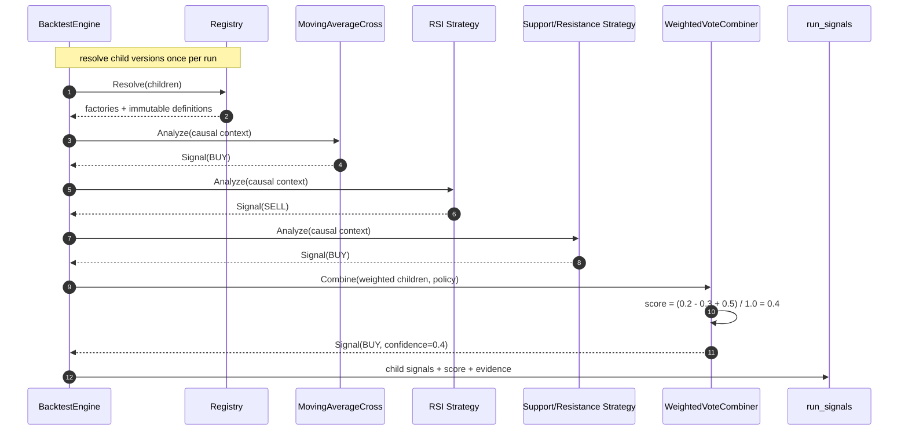

# Đặc tả: Composite Strategy (Signal Combination)

**Canonical ownership:** Composite evaluator, indicator dependencies và majority/weighted
policies chạy trong Python Strategy Runtime. Go không chứa combiner hoặc strategy semantics.

## Mô tả

Composite Strategy là strategy virtual root kết hợp 2–5 child strategies thành
một `Signal`. Nó không biết cách child tính indicator; child không biết
combiner. Snapshot lưu toàn bộ child definitions, parameters, weights và policy
để candidate hash/provenance bất biến.

MVP có `weighted_vote` và `majority_vote`. Root `composite@v1` không vào search
space và không được nested làm child của composite khác.

Đặc biệt phải đảm bảo:

- Weighted score deterministic theo `float64` (Python alias `Decimal`), threshold đối xứng.
- Child HOLD không tạo direction.
- Child lỗi không bị biến thành HOLD âm thầm.
- Composite không tự sizing/fill/position; Backtest Engine xử lý fixed notional.
- Sizing phải được chọn bởi `SizePolicy` tường minh trước khi tạo
  `OrderIntent`; combiner không được suy diễn quantity từ weighted score hoặc
  weighted price.
- Thêm combiner mới = implementation Python mới và registry map tương ứng, không sửa
  Backtest/Evaluation/API/UI.

## Contract

```python
from dataclasses import dataclass
from typing import Any, Protocol

@dataclass
class ChildDefinition:
    strategy_id: str
    version: str
    parameters: dict[str, Any]
    weight: float

@dataclass
class CombinationPolicy:
    policy: str
    threshold: float
    encoding: dict[str, int]

@dataclass
class CompositeDefinition:
    strategy_id: str
    version: str
    children: list[ChildDefinition]
    combination: CombinationPolicy

class SignalCombiner(Protocol):
    def combine(children: list[ResolvedSignal], policy: CombinationPolicy) -> Signal: ...
```

`CombinationPolicy` chỉ quyết định direction/price/evidence. Nó không thay thế
`SizePolicy`: MVP dùng `fixed_notional` từ immutable snapshot (`10 USDT` trong
fixture), còn policy khác phải được encode và validate trước khi BacktestEngine
tạo order. Vì vậy cùng một composite signal không thể âm thầm tạo quantity khác
giữa realtime paper và deterministic replay.

Python implementation owns these types in
`app/domain/strategy/contract.py` and
`app/domain/strategy/composite/contract.py`; `DeterministicEngine` hydrates
persisted JSON and resolves children. Combination algorithms are Python classes.

`ResolvedSignal` giữ child definition + signal để evidence tái tạo được:

```python
@dataclass
class ResolvedSignal:
    strategy_id: str
    version: str
    signal: Signal
    weight: float
```

## Current implementation alignment

`DeterministicEngine._validate_composite()` currently enforces cardinality,
non-negative/positive-total weights and threshold bounds. It also rejects nested
composites and unknown combiner policies during plan resolution. It does not yet
validate the encoding map, `signed_size`, or canonicalize child-array order.
`WeightedVoteCombiner` uses the fixed `BUY/HOLD/SELL = 1/0/-1` map.
The engine uses `fixed_notional` directly; `SizePolicy` and `OrderIntent` are
target concepts, not current runtime classes.

The runtime persists composite `child_signals` as a list of child records plus
`score` and `action`, not as an object keyed by strategy ID. Canonical JSON
normalizes object-key order, but the current candidate hash does not normalize
child-array order. The stronger canonical-hash and encoding-validation rules
below remain target acceptance criteria.

## Target snapshot schema

```json
{
  "strategy_id": "composite",
  "version": "v1",
  "children": [
    {"strategy_id":"ma_cross","version":"v1","parameters":{"fast":20,"slow":50},"weight":0.2},
    {"strategy_id":"rsi","version":"v1","parameters":{"period":14},"weight":0.3},
    {"strategy_id":"support_resistance","version":"v1","parameters":{"period":80},"weight":0.5}
  ],
  "policy": {
    "name":"weighted_vote",
    "threshold":0.3,
    "encoding":{"BUY":1,"HOLD":0,"SELL":-1}
  }
}
```

Canonical JSON sort key, normalize Decimal encoding, NFC-normalize strings.
Definition hash includes child order after canonical sort by `(strategy_id,
version, parameters, weight)` and full policy. Same semantic definition gives
same hash.

Validation:

- child count 2–5;
- no nested composite;
- each child resolves immutable registry version;
- weights `>= 0`, total weight `> 0`;
- threshold `[0,1]`;
- encoding contains exactly BUY/HOLD/SELL with `+1/0/-1`;
- duplicate exact child rejected; same strategy with different parameters valid;
- child BUY/SELL signal price validated before combination; `signed_size` is carried
  in `Signal` but is not consumed or validated by the current combiner.

## Luồng chính



Warm-up bắt đầu tại `max(child warm_up_candles)`, không phải nến 0. Với
MA(50), RSI(14), SR(80), code hiện tại bắt đầu index 81 vì
`SupportResistanceStrategy.warm_up_candles` trả `period + 1`.

## Weighted vote

```text
score = Σ(weight × encoding[action]) / Σ(weight)
BUY  nếu score > threshold
SELL nếu score < -threshold
HOLD còn lại
confidence = abs(score)
```

So sánh strict. `score == threshold` là HOLD. `threshold=0` hợp lệ: score
khác 0 quyết định, score 0 vẫn HOLD. Tie hoặc mọi child HOLD trả HOLD.

Weighted signal price chỉ lấy child non-HOLD có price:

```text
weighted_price = Σ(weight × child_price) / Σ(weight của child có price)
```

Child non-HOLD thiếu price là validation error, không silently drop. Composite
không tự resolve quantity; Backtest dùng `fixed_notional / limit_price` theo
execution snapshot.

Runtime implementation is Python in
`app/domain/strategy/composite/contract.py`: `WeightedVoteCombiner` and
`MajorityVoteCombiner` are pure classes. The `Decimal` name imported by the
Python domain is a `float64` alias; the combiner currently uses the fixed
`BUY/HOLD/SELL = 1/0/-1` encoding rather than reading a custom policy encoding.

## Majority vote

Đếm action, chọn action có số vote cao nhất. Tie trả HOLD deterministic. Weight,
threshold không ảnh hưởng majority result nhưng vẫn nằm snapshot để provenance
đầy đủ.

## Evidence và storage

`run_signals.child_signals` ghi child action, confidence, price, evidence,
weight và composite score. Ghi cả HOLD để trả lời được cả “vì sao mua” và “vì
sao không mua”; bulk insert theo batch.

```json
{
  "children": [
    {"strategy_id":"ma_cross","version":"v1","action":"BUY","price":118050,"weight":0.2},
    {"strategy_id":"rsi","version":"v1","action":"SELL","price":118050,"weight":0.3},
    {"strategy_id":"support_resistance","version":"v1","action":"BUY","price":118050,"weight":0.5}
  ],
  "score":"0.4",
  "action":"BUY"
}
```

## Kịch bản lỗi

| Tình huống | Phản ứng |
|---|---|
| 1 hoặc >5 child | `422 invalid_cardinality` |
| Child là composite | `422 nesting_too_deep` |
| Strategy/version không tồn tại | `422 unknown_strategy_version` |
| Duplicate exact child | `422 duplicate_child` |
| Weight âm/tổng zero | `422 invalid_weight` / `422 zero_total_weight` |
| Threshold ngoài `[0,1]` | `422 invalid_threshold` |
| Encoding thiếu action | `422 invalid_encoding` |
| Child non-HOLD thiếu price | `422 invalid_signal` |
| Child lỗi/timeout/look-ahead | Candidate failed; không coi child là HOLD |
| Mọi child HOLD | Composite HOLD, không tạo order |
| Majority tie | HOLD, không random |
| Same key order khác nhau | Cùng canonical hash |

## Ràng buộc

**Tính đúng đắn**

- `Combine` pure, không I/O/network/clock/random.
- Score/weight/threshold/price dùng Python `float64` (domain alias `Decimal`).
- Strict threshold, đối xứng BUY/SELL.
- `warm_up_candles(composite) = max(child warm-up)`.
- Snapshot bất biến; đổi composite tạo experiment mới.
- Không branch theo strategy name trong core.

**Hiệu năng**

- Resolve child một lần/run, không một lần/candle.
- Indicator precompute theo union requirements.
- Combine 5 child mục tiêu < 50 µs, bulk-write evidence.

**Khả năng mở rộng**

- Combiner mới = một Python class + registry/engine mapping tương ứng.
- Strategy mới = một plugin file theo `strategy-registry.md`.
- Nested composite là extension validator, không đổi Backtest/Evaluation contract.

## Tiêu chí chấp nhận

- [ ] AC-01: `{BUY, SELL, BUY}` với weights `{0.2,0.3,0.5}`, threshold `0.3` → score `0.4`, BUY.
- [ ] AC-02: Majority `{BUY, BUY, HOLD}` → BUY, confidence `2/3`.
- [ ] AC-03: Threshold `0.5` với cùng signals → HOLD, hash khác.
- [ ] AC-04: Canonical JSON key order khác nhau → cùng candidate hash.
- [ ] AC-05: Combiner mới chỉ thêm một Python class + test.
- [ ] AC-06: Threshold 0, score 0 → HOLD; score dương/âm khác 0 → direction tương ứng.
- [ ] AC-07: Child lỗi không bị biến thành HOLD; worker/search tiếp tục candidate kế tiếp.
- [ ] AC-08: Warm-up composite đúng max child requirement.
- [ ] AC-09: `run_signals.child_signals` tái tạo đúng score/action.
- [ ] AC-10: Composite không tự tạo fill/position; Backtest chịu trách nhiệm fixed notional.

---

Cross-reference: `design.md` §5.3–§5.4, §6.2, §8.1, ADR-002, ADR-003,
`specs/strategy-registry.md`, `specs/backtest.md`, `specs/search-loop.md`,
`specs/evaluation.md`.
