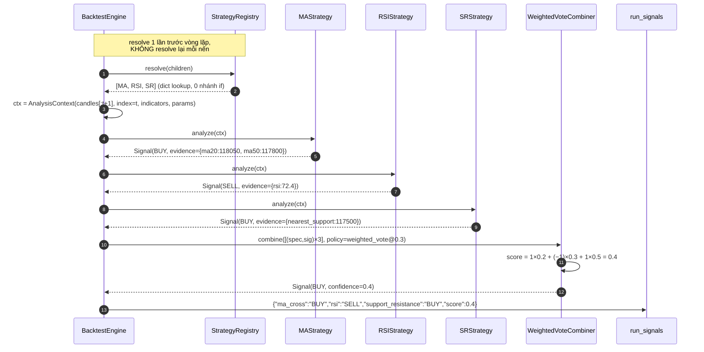

# Đặc tả: Composite Strategy (kết hợp nhiều strategy đơn lẻ)

## Mô tả

Module này trả lời câu hỏi trung tâm của đề bài §13 và §14: *làm thế nào để kết hợp MA Crossover, RSI và Support/Resistance thành một strategy duy nhất, mà không viết một dòng `if` nào theo tên strategy*. Câu trả lời kiến trúc: composite **không phải một class**, nó là một **snapshot JSON bất biến** mô tả (a) danh sách children và (b) cách kết hợp tín hiệu của chúng. Phần thực thi chỉ có hai thứ: `StrategyRegistry.resolve()` để tra ra strategy con, và một `SignalCombiner` để gộp tín hiệu.

Vì sao tách như vậy? Nếu tổ hợp là code (`if MA && RSI: ... elif MA && Bollinger: ...`) thì số tổ hợp biểu diễn được bằng số nhánh đã viết, và mỗi strategy mới nhân số nhánh lên. Nếu tổ hợp là **dữ liệu**, số tổ hợp biểu diễn được là vô hạn với **0 nhánh `if`** — và đó chính là điều kiện để `CandidateGenerator` (đề bài §16) có thể *sinh ra* tổ hợp mới lúc runtime mà không ai phải deploy code. Nói cách khác: composite-as-data không phải một lựa chọn thẩm mỹ, nó là tiền đề để Auto Strategy Search tồn tại.

Điểm thứ hai, tinh tế hơn: **phương pháp kết hợp cũng là tham số của kết quả**, đúng như strategy params. Cùng ba children đó, `threshold = 0.3` cho BUY còn `threshold = 0.5` cho HOLD. Nếu `threshold` là hằng số trong code, thì ba tháng sau không ai biết một entry Leaderboard cũ đã dùng ngưỡng nào — provenance sai âm thầm. Vì thế `policy`, `threshold`, `encoding` đều là field trong snapshot, lưu vào `experiments.candidate_definition` (`design.md` ADR-003).

Điểm thứ ba: `combine()` là **pure function**. Cùng input → cùng output, không I/O, không random, không đọc clock hệ thống. Đây là điều làm backtest deterministic: chạy lại cùng một `ExperimentSnapshot` trên cùng `market_dataset` phải cho kết quả byte-identical. Một `random()` nhỏ trong tie-break là đủ để phá toàn bộ tính tái lập của đồ án.

Đặc biệt phải đảm bảo:

- Thêm một `policy` mới (`unanimous`, `any_of`, `confidence_weighted`) = thêm **1 file** implement `SignalCombiner`, **0 dòng** sửa snapshot schema, engine, evaluator, API, UI.
- Hai composite giống children nhưng khác `policy`/`threshold` → **hai `candidate_hash` khác nhau** → hai entry Leaderboard độc lập, so sánh được với nhau.
- `combine()` không có I/O, không random, không đọc thời gian → backtest deterministic.
- `warm_up_candles` của composite = `max(warm_up của mọi child)`.
- `run_signals.child_signals` ghi đủ để giải thích "vì sao composite BUY khi RSI nói SELL" **không cần chạy lại**.
- Không tồn tại bất kỳ so sánh `strategy_id == "..."` nào ngoài `plugins/` và `tests/`.

## Contract

```python
# app/domain/strategy/contract.py
@dataclass(frozen=True)
class Signal:
    action: Literal["BUY", "SELL", "HOLD"]
    confidence: float | None = None            # 0..1
    evidence: Mapping[str, Any] | None = None  # {"ma_fast": 118050, "ma_slow": 117800}


@dataclass(frozen=True)
class ChildSpec:
    strategy_id: str          # 'ma_cross'
    version: str             # '1.0.0'
    parameters: Mapping[str, Any]
    weight: Decimal          # >= 0


@dataclass(frozen=True)
class CombinationPolicy:
    policy: str                       # 'majority_vote' | 'weighted_vote'
    threshold: Decimal                # 0..1
    encoding: Mapping[str, int]       # {"BUY": 1, "HOLD": 0, "SELL": -1}
```

```python
# app/ports/... — port do domain định nghĩa (design.md §5.1, interface #3)
class SignalCombiner(Protocol):
    def combine(self, children: list[tuple[ChildSpec, Signal]],
                policy: CombinationPolicy) -> Signal: ...
# Implement MVP: MajorityVoteCombiner, WeightedVoteCombiner
#               (app/domain/strategy/combiner/{majority_vote,weighted_vote}.py)
```

Composite snapshot — đây là **dữ liệu**, được lưu nguyên văn vào `experiments.candidate_definition` (JSONB):

```json
{
  "type": "composite",
  "combination": {
    "policy": "weighted_vote",
    "threshold": 0.3,
    "encoding": { "BUY": 1, "HOLD": 0, "SELL": -1 }
  },
  "children": [
    { "strategy_id": "ma_cross", "version": "1.0.0",
      "parameters": { "fast_period": 20, "slow_period": 50 }, "weight": 0.2 },
    { "strategy_id": "rsi", "version": "1.0.0",
      "parameters": { "period": 14, "buy_threshold": 30, "sell_threshold": 70 }, "weight": 0.3 },
    { "strategy_id": "support_resistance", "version": "1.0.0",
      "parameters": { "lookback": 80, "touch_tolerance_pct": 0.5 }, "weight": 0.5 }
  ]
}
```

`candidate_hash = sha256(canonical_json(definition))`. Quy tắc `canonical_json` được chốt ở `design.md` ADR-003 và **mọi** nơi tính hash phải dùng đúng nó: sort key theo code point UTF-8 (đệ quy mọi cấp), số nguyên không dấu thập phân (`20` chứ không `20.0`), số thực bỏ trailing zero (`0.30` → `0.3`), chuỗi chuẩn hoá NFC, không khoảng trắng, `null` khác với key vắng mặt. Lý do: `{"a":1,"b":2}` và `{"b":2,"a":1}` là **cùng một** definition và **phải** cho cùng hash. Nếu không, `UNIQUE (search_run_id, candidate_hash)` vẫn tồn tại nhưng dedup của search **vô hiệu một cách âm thầm** — search vẫn chạy, chỉ là backtest lại cùng một tổ hợp nhiều lần và đốt worker mà không ai thấy lỗi.

> **Chi tiết dễ bỏ sót**: `encoding` phải nằm trong snapshot, không phải hằng số. Một policy tương lai có thể muốn `{"BUY": 2, "HOLD": 0, "SELL": -1}` (thiên vị long) — nếu encoding là hằng số trong code thì policy đó không biểu diễn được, và mọi entry cũ mất thông tin về ánh xạ đã dùng.

## Luồng chính

### A. Validate và tạo composite snapshot

1. Nhận definition JSON (từ `POST /api/v1/experiments`, hoặc từ `CandidateGenerator`).
2. Kiểm tra `type == "composite"`, có `combination` và `children`.
3. Kiểm tra cardinality: `2 <= len(children) <= 5` → vượt/thiếu → `422 invalid_cardinality`.
4. Kiểm tra depth: mọi child phải là `type == "single"` (MVP giới hạn depth = 1) → `422 nesting_too_deep`.
5. Với mỗi child: `StrategyRegistry.resolve(strategy_id, version)` → không tồn tại → `422 unknown_strategy`.
6. Validate `parameters` theo `parameters_schema` của strategy đó → `422 invalid_parameters` kèm `field`.
7. Kiểm tra trùng child: không được có 2 child cùng `(strategy_id, version, canonical(parameters))` → `422 duplicate_child`.
8. Kiểm tra weight: mọi `weight >= 0`; `sum(weight) > 0` → tổng bằng 0 → `422 zero_total_weight`.
9. Kiểm tra `policy` có combiner đã đăng ký → `422 unknown_policy`; `threshold ∈ [0, 1]` → `422 invalid_threshold`. Biên `0` **được phép** vì `WeightedVoteCombiner` so sánh ngặt (`score > threshold`): `threshold = 0` nghĩa "bất kỳ score khác 0 đều quyết định", còn `score = 0` vẫn cho `HOLD`.
10. Tính `warm_up_candles = max(child.warm_up_candles(child.parameters))` trên mọi child.
11. Tính `candidate_hash = sha256(canonical_json(definition))`.
12. Ghi `experiments(candidate_definition, candidate_hash, ...)` — bất biến từ giây phút này.

> **Chi tiết dễ bỏ sót**: bước 7 nhìn như thừa nhưng nó chặn một lỗi rất khó thấy. Hai child `rsi@1.0.0{period:14}` với `weight 0.2` và `0.3` không phải "hai ý kiến" — đó là **một** ý kiến với trọng số 0.5 bị nhân đôi ngầm. Kết quả: RSI âm thầm chi phối composite, và người đọc snapshot không hiểu vì sao.

### B. Sinh tín hiệu composite trong một nến (Strategy Flow)



Vòng lặp bắt đầu từ `warm_up_end = max(warm_up của mọi child)`, không phải từ nến 0. Với children `{MA(50), RSI(14), SR(80)}` thì `warm_up_end = 80`. Bỏ qua điều này: SR trả `HOLD` (vì indicator là `None`) suốt 80 nến đầu trong khi MA và RSI đã vote — composite ra tín hiệu dựa trên 2/3 ý kiến, tạo **trade giả ở đầu dataset**. Trên dataset ngắn (1000 nến), 80 nến sai là 8% và đủ làm lệch Total Return.

### C. `WeightedVoteCombiner.combine()`

```python
def combine(self, children, policy) -> Signal:
    total_weight = sum(spec.weight for spec, _ in children)
    if total_weight == 0:
        raise ZeroTotalWeightError()            # đã chặn ở validate; đây là lớp 2

    score = sum(
        Decimal(policy.encoding[sig.action]) * spec.weight
        for spec, sig in children
    ) / total_weight                            # chuẩn hoá → score ∈ [-1, 1]

    if score > policy.threshold:
        action = "BUY"
    elif score < -policy.threshold:
        action = "SELL"
    else:
        action = "HOLD"

    return Signal(action=action,
                  confidence=abs(score),
                  evidence={"score": score,
                            "children": {s.strategy_id: g.action for s, g in children}})
```

Năm quyết định trong 15 dòng này, mỗi cái đều có lý do:

- **Chuẩn hoá theo `total_weight`, không bắt buộc `sum(weight) == 1`.** Bắt buộc tổng = 1 nghĩa là `CandidateGenerator` phải sinh weight thoả ràng buộc tổng — một bài toán khó hơn hẳn việc sinh 3 số ngẫu nhiên ≥ 0. Chuẩn hoá lúc tính giải phóng generator, và `score` vẫn nằm trong `[-1, 1]` nên `threshold` có ý nghĩa nhất quán giữa mọi composite.
- **So sánh ngặt (`score > threshold`, `score < -threshold`), không phải `>=`/`<=`.** Với `>=`, `threshold = 0` làm `score >= 0` luôn đúng khi mọi child HOLD (`score = 0`) → composite BUY liên tục, tức bất biến "mọi child bỏ phiếu trắng thì composite không có ý kiến" bị phá ở đúng một giá trị threshold hợp lệ. So sánh ngặt biến `threshold = 0` thành nghĩa đúng của nó: *"bất kỳ score khác 0 đều quyết định"* — một baseline hợp lệ và hữu ích — trong khi `score = 0` vẫn cho `HOLD`. Hệ quả kèm theo: `score == threshold` chính xác cũng cho `HOLD`, và đó là lựa chọn bảo vệ được — một score đúng bằng ngưỡng chưa phải bằng chứng *vượt* ngưỡng. Bất biến khi đó đúng **về cấu trúc** cho mọi `threshold ∈ [0, 1]`, không phải nhờ một WARN mà người đọc log phải để ý.
- **Ngưỡng đối xứng (`score < -threshold` cho SELL).** Ngưỡng bất đối xứng là một policy khác, và nếu cần thì nó là một `SignalCombiner` mới — không phải một `if` thêm vào đây.
- **`confidence = abs(score)`**, không phải `score`. `confidence` theo contract là `0..1`; dấu đã nằm trong `action`.
- **`Decimal`, không `float`.** `0.2 + 0.3 + 0.5` bằng `1.0` với `Decimal` nhưng không hẳn với `float64`. Khi `score` rơi sát `threshold`, sai số float đủ để lật `BUY` thành `HOLD` — và lỗi đó **không tái lập được ổn định** giữa các kiến trúc CPU.

### D. `MajorityVoteCombiner.combine()`

Đếm số vote theo `action`, chọn action có số vote lớn nhất. Ví dụ đề bài §13: MA→BUY, RSI→BUY, SR→HOLD → `BUY=2, HOLD=1` → **BUY**.

Tie-break phải **deterministic và tường minh**: khi có ≥ 2 action đồng số vote cao nhất → trả `HOLD`. Lý do chọn `HOLD`: nó là action duy nhất không tạo giao dịch, nên "hệ thống không có ý kiến rõ ràng" được biểu diễn đúng thay vì bị làm tròn thành một quyết định. Tuyệt đối không dùng `random.choice()` hay "lấy child đầu tiên theo thứ tự dict" — cái đầu phá determinism, cái sau khiến kết quả phụ thuộc thứ tự khai báo children (nghĩa là hai snapshot có cùng ý nghĩa cho hai kết quả khác nhau).

`confidence = số vote thắng / tổng số child`. `MajorityVoteCombiner` **bỏ qua** `weight` và `threshold` — đó là hành vi đúng của policy này, không phải thiếu sót; snapshot vẫn giữ nguyên các field đó để hash và để đọc lại về sau.

### E. Thêm một policy mới — toàn bộ diff

```python
# app/domain/strategy/combiner/unanimous.py     ← FILE MỚI DUY NHẤT
@register_combiner("unanimous")
class UnanimousCombiner:
    def combine(self, children, policy) -> Signal:
        actions = {sig.action for _, sig in children}
        if actions == {"BUY"}:
            return Signal("BUY", confidence=1.0)
        if actions == {"SELL"}:
            return Signal("SELL", confidence=1.0)
        return Signal("HOLD", confidence=0.0)
```

Không sửa: snapshot schema (`policy` là string, không phải enum trong DDL), `BacktestEngine` (nó gọi qua Protocol), `Evaluator` (nhận `BacktestResult`), API contract, DB migration, UI. Kiểm chứng bằng `git diff --stat` — đúng 1 file thêm mới.

Đây là cách anti-pattern §44 "Hard-coded Strategy" bị chặn **bằng test tự động**, không bằng quy ước trong code review (`design.md` §9.2):

```python
# tests/architecture/test_no_strategy_branching.py
def test_no_strategy_name_branching():
    """Không có file nào so sánh strategy_id với literal string."""
    pattern = re.compile(r'(strategy_id|strategy)\s*==\s*["\']')
    for path in glob("app/**/*.py", recursive=True):
        if "/tests/" in path or "/plugins/" in path:
            continue   # plugin được phép biết tên chính nó
        assert not pattern.search(read(path)), f"{path} branch theo tên strategy"
```

Vì sao `plugins/` được miễn: `RSIStrategy.definition()` **phải** khai `strategy_id="rsi"` — đó là nó tự khai tên mình, không phải core phân nhánh theo tên người khác. Vì sao `tests/` được miễn: fixture cần assert theo tên cụ thể. Mọi file còn lại trong `app/` mà xuất hiện pattern đó là dấu hiệu logic đã rò rỉ từ dữ liệu vào code.

> **Chi tiết dễ bỏ sót**: `combination.policy` cố ý **không** là PostgreSQL `ENUM`. Nếu là ENUM thì thêm policy = migration, và một `candidate_definition` cũ trong JSONB tham chiếu policy đã bị xoá sẽ không đọc được. Validate policy ở tầng application (đối chiếu registry của combiner) chứ không ở tầng DDL.

### F. Ghi `child_signals` và trả lời câu hỏi "vì sao"

`run_signals.child_signals` (JSONB) ghi mỗi nến có tín hiệu:

```json
{"ma_cross": "BUY", "rsi": "SELL", "support_resistance": "BUY", "score": 0.4}
```

Đây là điều biến §25 của đề bài (*"phải cho người dùng hiểu strategy đã làm gì"*) thành hiện thực. Khi user hỏi "vì sao composite BUY tại 09:15 khi RSI nói SELL?", UI đọc một row và trả lời — **không** cần re-run backtest, không cần load lại 20.000 nến, không cần chính version code đó còn tồn tại.

Chi phí: `UNIQUE (backtest_run_id, candle_time)` + JSONB khoảng 120–200 byte/row. Với 20.000 nến, cận trên là ~4 MB/run. Chấp nhận được, và đây là đánh đổi có ý thức: **4 MB đổi lấy khả năng giải thích**. Nếu cần cắt, chỉ ghi row khi `action != "HOLD"` — nhưng khi đó mất khả năng trả lời "vì sao KHÔNG mua ở đây", vốn là câu hỏi hay hơn.

## Kịch bản lỗi

| Tình huống | Phản ứng |
|---|---|
| `children` có 1 phần tử | `422 invalid_cardinality` — composite 1 child không phải composite, dùng `type: "single"` |
| `children` có 6 phần tử | `422 invalid_cardinality` kèm `max_children: 5` |
| Child là composite (nested) | `422 nesting_too_deep` — MVP depth = 1 |
| `strategy_id` không có trong registry | `422 unknown_strategy` kèm danh sách id khả dụng. **Không** có nhánh `else` âm thầm trả HOLD |
| `version` không tồn tại cho `strategy_id` đó | `422 unknown_strategy_version` — version là phần của khoá registry, không phải metadata trang trí |
| Hai child cùng `(strategy_id, version, parameters)` | `422 duplicate_child` — weight bị nhân đôi ngầm |
| Hai child cùng `strategy_id` nhưng khác `parameters` | **Hợp lệ.** RSI(14) và RSI(21) là hai ý kiến khác nhau |
| `weight < 0` | `422 invalid_weight` — weight âm nghĩa là "vote ngược lại child này", đó là một policy, không phải một trọng số |
| `sum(weight) == 0` | `422 zero_total_weight` — không chuẩn hoá được, và composite không có ý nghĩa |
| `sum(weight) == 2.7` | **Hợp lệ**, chuẩn hoá lúc tính |
| `threshold = 1.5` hoặc `-0.1` | `422 invalid_threshold` — ngoài `[0, 1]` |
| `threshold = 0` với `weighted_vote` | **Hợp lệ và đúng.** So sánh ngặt (`score > 0` cho BUY, `score < 0` cho SELL) nên `threshold = 0` nghĩa "bất kỳ score khác 0 đều quyết định" — một baseline hợp lệ để so sánh. Không WARN, không reject |
| `score` đúng bằng `threshold` (ví dụ `score = 0.3`, `threshold = 0.3`) | `HOLD` — một score đúng bằng ngưỡng chưa phải bằng chứng *vượt* ngưỡng |
| `policy` không có combiner đăng ký | `422 unknown_policy` kèm danh sách policy khả dụng |
| Mọi child trả `HOLD` | `score = 0` → `HOLD` với **mọi** `threshold ∈ [0, 1]` (nhờ so sánh ngặt, kể cả `threshold = 0`). Không tạo trade |
| Majority vote: BUY=1, SELL=1, HOLD=1 | `HOLD` (tie-break deterministic). Log DEBUG với vote count |
| Một child raise `ZeroDivisionError` | Catch ở biên gọi plugin (R7): candidate `status='failed'`, `failure_reason='strategy_error:rsi@1.0.0'`. **Không** coi child đó là HOLD rồi tính tiếp — kết quả khi đó là của một composite khác với composite được khai báo |
| Một child vượt deadline `analyze()` | Cùng xử lý như trên, `failure_reason='strategy_timeout:...'`. Search run **tiếp tục** với candidate kế tiếp |
| `encoding` thiếu key `"HOLD"` | `422 invalid_encoding` — phải phủ đủ 3 action, `KeyError` lúc runtime là quá muộn |
| Child có `warm_up = 200` trên dataset 150 nến | `422 dataset_too_short_for_warmup` kèm `required_candles`. Chạy tiếp sẽ cho 0 trade và một entry Leaderboard vô nghĩa |
| Hai request tạo cùng composite (cùng `candidate_hash`) trong 1 search run | `UNIQUE (search_run_id, candidate_hash)` chặn ở DB → candidate thứ hai bị bỏ, `search_dedup_hits_total += 1`. Không phải lỗi |

## Ràng buộc

**Tính đúng đắn**

- `combine()` là **pure function**: 0 lệnh I/O, 0 lời gọi random, 0 lần đọc `datetime.now()`. Kiểm chứng bằng test chạy trong môi trường không có socket (mẫu `tests/architecture/test_strategy_purity.py`).
- Mọi phép tính score dùng `Decimal`, không `float`. `weight` và `threshold` lưu và tính ở `Decimal`.
- `weighted_vote` so sánh **ngặt**: `score > threshold` → BUY, `score < -threshold` → SELL, còn lại HOLD. Hệ quả bắt buộc: mọi child trả `HOLD` (`score = 0`) → composite `HOLD` với **mọi** `threshold ∈ [0, 1]`, kể cả `0`.
- Tie-break của majority vote là deterministic và được test tường minh.
- `warm_up_candles(composite) = max(warm_up(child))` — không phải sum, không phải của child đầu tiên.
- `candidate_hash` tính trên `canonical_json`: sort key, chuẩn hoá số, UTF-8 NFC. Cùng definition khác thứ tự key → **cùng** hash.
- Snapshot bất biến: `experiments.candidate_definition` không bao giờ UPDATE. Đổi composite = experiment mới.
- 0 nhánh `if` theo tên strategy ngoài `plugins/` và `tests/`.

**Hiệu năng**

- `combine()` với 5 children: **< 50 µs** (không có I/O, chỉ số học trên `Decimal`).
- `StrategyRegistry.resolve()` gọi **1 lần/run**, không phải 1 lần/nến. Với 20.000 nến × 5 children, resolve trong vòng lặp là 100.000 dict lookup vô ích.
- Indicator precompute một lần cho **union** `input_requirements` của mọi child. Với 3 children cùng cần SMA20, tính 1 lần thay vì 3 lần (`design.md` §6.2).
- Composite 5 children trên 20.000 nến: tổng **< 8 s** cho phần sinh tín hiệu (không tính fill/PnL).
- `child_signals` ghi bằng bulk insert theo batch 1000 row, không loop từng row.

**Khả năng mở rộng**

- Thêm policy = **1 file** implement `SignalCombiner` + 1 dòng `@register_combiner`. Không migration, không sửa API, không sửa UI.
- Thêm strategy con = **1 file** trong `plugins/` (`design.md` §8.1). Nó tự vào được mọi composite mà không ai khai báo lại.
- Bỏ giới hạn depth = 1 trong tương lai: `combine()` không cần đổi (nó nhận `list[(ChildSpec, Signal)]`, không quan tâm Signal đến từ single hay composite). Chỉ đổi validator + resolver đệ quy.
- Cardinality 2..5 là **bounded input control**, không phải giới hạn kiến trúc. Lý do giữ: composite lồng sâu làm không gian `candidate_hash` nổ tổ hợp (R4) và làm `evidence` không đọc được — một cây 4 tầng thì "vì sao BUY" cần 40 dòng để trả lời, tức là không trả lời được.

**Quan sát được**

- `strategy_analyze_errors_total{strategy_id,version}` — child nào hay lỗi.
- `strategy_timeout_total{strategy_id}` — child nào chậm.
- `search_dedup_hits_total` — dedup theo `candidate_hash` có hoạt động hay không. Số này bằng 0 vĩnh viễn trên một search run lớn là dấu hiệu `canonical_json` bị sai.
- Log WARN khi một child chiếm > 80% tổng weight (composite khi đó thực chất là strategy đơn lẻ đội lốt).

## Tiêu chí chấp nhận

- [ ] AC-01: Fixture đề bài §14 — children `{ma_cross:0.2, rsi:0.3, support_resistance:0.5}`, signals `{BUY, SELL, BUY}`, `threshold=0.3` → `score = 0.4`, action = `BUY` (`0.4 > 0.3`). Kiểm tra tới **6 chữ số thập phân**.
- [ ] AC-02: Fixture đề bài §13 — majority vote với `{BUY, BUY, HOLD}` → `BUY`, `confidence = 2/3`.
- [ ] AC-03: Đổi `threshold` từ `0.3` → `0.5` với cùng children/signals của AC-01 → action = `HOLD` (`0.4 > 0.5` sai, `0.4 < -0.5` sai), và `candidate_hash` **khác** hash của AC-01.
- [ ] AC-04: Hai definition cùng nội dung nhưng key đảo thứ tự (`{"a":1,"b":2}` vs `{"b":2,"a":1}`, kể cả trong `parameters` lồng) → **cùng** `candidate_hash`.
- [ ] AC-05: Thêm `UnanimousCombiner` (file mới) → tạo được experiment với `policy: "unanimous"`. `git diff --stat` cho đúng **1 file thêm, 0 file sửa** ngoài test.
- [ ] AC-06: `test_no_strategy_name_branching` chạy trong CI: `re.compile(r'(strategy_id|strategy)\s*==\s*["\']')` không khớp bất kỳ file nào trong `app/` (bỏ qua `/tests/` và `/plugins/`).
- [ ] AC-07: Gọi `combine()` **1000 lần** với cùng input → 1000 kết quả **byte-identical** (serialize `Signal` rồi so sánh). Chạy trong môi trường đã patch `socket.socket` để raise → không có lời gọi mạng.
- [ ] AC-08: Composite với children `{MA(fast=20,slow=50), RSI(14), SR(lookback=80)}` → `warm_up_candles == 80`. Vòng lặp backtest bắt đầu ở index 80; `run_signals` **không có row nào** với `candle_time` thuộc 80 nến đầu.
- [ ] AC-09: Definition có 2 child `rsi@1.0.0{period:14}` → `422 duplicate_child`. Đổi child thứ hai thành `{period:21}` → `201`.
- [ ] AC-10: Definition với `sum(weight) == 0` → `422 zero_total_weight`; với `sum(weight) == 2.7` → hợp lệ và `score` vẫn nằm trong `[-1, 1]`.
- [ ] AC-11: Definition có child `type: "composite"` → `422 nesting_too_deep`; có 6 children → `422 invalid_cardinality`; có 1 child → `422 invalid_cardinality`.
- [ ] AC-12: Inject child raise `ZeroDivisionError` → `search_candidates.status = 'failed'`, `failure_reason` chứa `strategy_id@version`, worker **không** crash, candidate kế tiếp vẫn được xử lý.
- [ ] AC-13: Majority vote với `{BUY, SELL, HOLD}` → `HOLD`. Chạy 100 lần → 100 lần `HOLD` (không random tie-break).
- [ ] AC-14: Sau một backtest, query `run_signals` cho một `candle_time` có `signal='BUY'` → `child_signals` chứa đủ 3 key strategy + key `score`, và tổng có trọng số của các action đó tái tạo đúng `score` đã lưu.
- [ ] AC-15: Mọi child trả `HOLD` → composite `HOLD`, test với **cả** `threshold = 0` và `threshold = 0.3` (bất biến phải đúng ở biên, không chỉ ở giá trị dương). Kèm biên: `score` đúng bằng `threshold` (`score = 0.3`, `threshold = 0.3`) → `HOLD`; `score = 0.4`, `threshold = 0.3` → `BUY`.

---

Cross-reference: `design.md` §5.3–§5.4 (Signal, composite snapshot), `design.md` §6.2 (Strategy Flow), `design.md` §8.1 (Plugin Registry), `design.md` §9.2 (anti-pattern Hard-coded Strategy), `design.md` ADR-002 (Plugin Registry), `design.md` ADR-003 (policy là dữ liệu), `specs/strategy-registry.md` (resolve, `warm_up_candles`, sandbox), `specs/backtest.md` (consumer của `Signal`), `specs/search-loop.md` (sinh candidate + dedup theo `candidate_hash`), `specs/evaluation.md` (đo kết quả composite).
