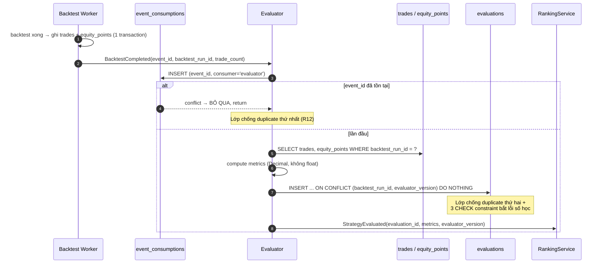

# Đặc tả: Evaluation (tính metrics từ kết quả backtest)

## Mô tả

Module này biến `BacktestResult` (trade facts thô) thành `Evaluation` (metrics dẫn xuất). Nó là hiện thực hoá nguyên tắc §20 của đề bài: *"Strategy Evaluation phải tách biệt khỏi Strategy Implementation"* — `Evaluator` nhận `BacktestResult` và **không biết** strategy nào sinh ra nó, không biết đó là single hay composite, không biết children là gì. Nhờ đó thêm MACD hay thêm một `SignalCombiner` mới không sửa một dòng nào ở đây (`design.md` §8.1, bảng "không phải sửa gì").

Nhưng có một tách biệt thứ hai, quan trọng hơn và ít được nói tới: **trade facts (thô) tách khỏi metrics (dẫn xuất)**. `trades` và `equity_points` là *sự thật đã xảy ra trong mô phỏng*; `evaluations` là *cách ta đo sự thật đó*. Hai thứ này có vòng đời khác nhau: công thức đo có thể sai, có thể cần cải tiến, có thể cần thêm Sortino/Calmar — còn trade thì không đổi. Vì tách ra, đổi công thức nghĩa là **bump `evaluator_version` + tính lại từ `trades`/`equity_points`**, không chạy lại backtest. Với 5.000 experiment, đó là chênh lệch giữa vài phút SQL và vài chục giờ CPU.

Nguyên tắc thứ ba: **không metric nào được phép "đoán"**. Khi không đủ dữ liệu để tính (0 trade → không có profit factor; 1 trade → stddev = 0 nên không có Sharpe), giá trị đúng là `NULL`, không phải `0` và không phải `Infinity`. `0` là một con số có nghĩa ("profit factor bằng 0" nghĩa là *toàn bộ là lỗ*), gán nó cho "không biết" là biến không-biết thành biết-sai — cùng loại lỗi với việc fake `sentiment: NEUTRAL` khi model chết (`design.md` §9.6c).

Đặc biệt phải đảm bảo:

- **0 phép chia cho 0** trên mọi edge case (0 trade, 1 trade, không có loss, không có win).
- Metrics tính được **lại** từ `trades` + `equity_points` mà không cần chạy lại backtest.
- Đổi công thức **không ghi đè** evaluation cũ (`UNIQUE (backtest_run_id, evaluator_version)`).
- Duplicate event `BacktestCompleted` **không** tạo 2 row `evaluations` (R12).
- Mọi phép tính dùng `Decimal`/`NUMERIC`, không `float`.
- Strategy có 0 hoặc 1 trade **không** vào Leaderboard dù `total_return_pct` dương.

## Contract

```python
class Evaluator(Protocol):
    def evaluate(self, result: BacktestResult, policy: EvaluationPolicy) -> Evaluation: ...
# Implement: StandardEvaluator (app/domain/evaluation/{evaluator,metrics}.py)
```

```python
@dataclass(frozen=True)
class EvaluationPolicy:
    evaluator_version: str        # 'v1' — phần của ExperimentSnapshot
    periods_per_year: int         # suy ra từ timeframe của dataset
    zero_pnl_counts_as_win: bool  # v1: False
    stddev_ddof: int              # v1: 1 (sample stddev)
    min_periods_for_sharpe: int   # v1: 30 — dưới ngưỡng này sharpe = None
    risk_free_rate: Decimal       # v1: 0


@dataclass(frozen=True)
class Evaluation:
    backtest_run_id: UUID
    evaluator_version: str
    total_return_pct: Decimal          # NOT NULL
    win_rate_pct: Decimal              # NOT NULL, 0..100
    max_drawdown_pct: Decimal          # NOT NULL, <= 0
    trade_count: int                   # NOT NULL, >= 0
    profit_factor: Decimal | None      # None khi không có loss
    sharpe_ratio: Decimal | None       # None khi stddev == 0
    avg_trade_pct: Decimal | None      # None khi trade_count == 0
```

Schema (dùng đúng tên đã chốt ở `design.md` §4.2):

```sql
CREATE TABLE trades (
    id               BIGSERIAL PRIMARY KEY,
    backtest_run_id  UUID NOT NULL REFERENCES backtest_runs(id) ON DELETE CASCADE,
    sequence_no      INT  NOT NULL,
    side             trade_side NOT NULL DEFAULT 'LONG',
    entry_time       TIMESTAMPTZ NOT NULL,
    entry_price      NUMERIC(24,8) NOT NULL,
    exit_time        TIMESTAMPTZ,
    exit_price       NUMERIC(24,8),
    quantity         NUMERIC(24,8) NOT NULL,
    fee_paid         NUMERIC(24,8) NOT NULL DEFAULT 0,
    slippage_cost    NUMERIC(24,8) NOT NULL DEFAULT 0,
    pnl_absolute     NUMERIC(24,8),
    pnl_percent      NUMERIC(12,6),
    exit_reason      VARCHAR(32),   -- 'signal'|'stop_loss'|'take_profit'|'end_of_sample'
    UNIQUE (backtest_run_id, sequence_no),
    CHECK (exit_time IS NULL OR exit_time >= entry_time)
);

CREATE TABLE equity_points (
    backtest_run_id UUID NOT NULL REFERENCES backtest_runs(id) ON DELETE CASCADE,
    point_time      TIMESTAMPTZ NOT NULL,
    equity          NUMERIC(24,8) NOT NULL,
    drawdown_pct    NUMERIC(12,6),
    PRIMARY KEY (backtest_run_id, point_time)
);

CREATE TABLE evaluations (
    id                UUID PRIMARY KEY DEFAULT gen_random_uuid(),
    backtest_run_id   UUID NOT NULL REFERENCES backtest_runs(id) ON DELETE CASCADE,
    evaluator_version VARCHAR(24) NOT NULL,
    total_return_pct  NUMERIC(14,6) NOT NULL,
    win_rate_pct      NUMERIC(8,4)  NOT NULL,
    max_drawdown_pct  NUMERIC(10,6) NOT NULL,
    trade_count       INT           NOT NULL,
    profit_factor     NUMERIC(12,6),
    sharpe_ratio      NUMERIC(12,6),
    avg_trade_pct     NUMERIC(12,6),
    computed_at       TIMESTAMPTZ NOT NULL DEFAULT now(),
    UNIQUE (backtest_run_id, evaluator_version),
    CHECK (win_rate_pct BETWEEN 0 AND 100),
    CHECK (max_drawdown_pct <= 0),
    CHECK (trade_count >= 0)
);
```

> **Hai `CHECK` này không phải trang trí.** `max_drawdown_pct <= 0` bắt **lỗi dấu** — thứ rất dễ sai khi tính MDD (quên dấu trừ, hoặc `peak − equity` thay vì `equity − peak`) và **rất khó phát hiện bằng mắt** trên UI, vì `8.03%` và `−8.03%` đều "nhìn hợp lý". `win_rate_pct BETWEEN 0 AND 100` bắt lỗi nhầm giữa **tỉ lệ và phần trăm**: `0.61` thay vì `61`. Không có constraint này, một strategy thắng 61% sẽ hiện `0.61%` trên Leaderboard, xếp bét bảng, và không ai biết vì sao. Đây là ví dụ cụ thể cho nguyên tắc: đặt ràng buộc ở tầng thấp nhất có thể phát hiện được lỗi.

`UNIQUE (backtest_run_id, evaluator_version)` là **lớp phòng thủ thứ hai** chống R12 (duplicate `BacktestCompleted` tạo 2 evaluation → 1 candidate xuất hiện 2 lần trên Leaderboard). Lớp thứ nhất là `event_consumptions(event_id, consumer)`: consumer INSERT vào đó **trước** khi hành động, conflict → bỏ qua. Hai lớp vì chúng chặn hai nguyên nhân khác nhau: lớp 1 chặn *cùng một event* đến 2 lần, lớp 2 chặn *hai event khác `event_id`* trỏ về cùng một run (ví dụ worker retry sau lease timeout và publish event mới).

## Luồng chính

### A. Từ `BacktestCompleted` tới `Evaluation`



`Evaluator` đọc từ **DB**, không nhận metrics qua payload event. Lý do: payload event là dữ liệu đi qua ranh giới process (Worker publish, Evaluator consume — `design.md` §5.7) và có thể bị truncate/mất field; `trades` là nguồn sự thật. Ngoài ra đọc từ DB làm cho việc **recompute** (luồng D) đi qua đúng một code path với việc compute lần đầu — không có hai đường tính khác nhau để lệch nhau.

### B. Công thức từng metric

**Total Return**

```text
total_return_pct = (final_equity − initial_capital) / initial_capital × 100
```

`final_equity` = `equity` của `equity_points` có `point_time` lớn nhất. `initial_capital` từ `experiments.initial_capital` (mặc định 10000). Không tính bằng `sum(pnl_absolute)` — hai cách này lệch nhau khi có vị thế còn mở (`exit_reason='end_of_sample'`), và equity curve là cách đúng vì nó đã bao gồm mọi fee/slippage đã trả.

**Win Rate**

```text
win_rate_pct = count(trades WHERE pnl_absolute > 0) / trade_count × 100
```

**Quyết định về `pnl_absolute == 0`: KHÔNG tính là win** (`zero_pnl_counts_as_win = False` trong `EvaluationPolicy` v1). Lý do: `pnl_absolute` đã trừ `fee_paid` và `slippage_cost`, nên một trade có `pnl == 0` sau fee nghĩa là **giá đã chạy đúng hướng vừa đủ để bù phí** — về mặt vốn thì không lãi, về mặt cơ hội thì đã chiếm chỗ và chịu rủi ro mà không nhận gì. Gọi đó là "win" sẽ khiến strategy scalping với biên lợi nhuận bằng đúng phí hiện win rate cao một cách sai lệch. Quyết định này nằm trong `EvaluationPolicy`, không hard-code, nên `v2` có thể chọn khác và cả hai vẫn so sánh được nhờ `evaluator_version`.

**Max Drawdown**

```text
peak_t          = max(equity_s : s ≤ t)
drawdown_t      = (equity_t − peak_t) / peak_t × 100        (≤ 0)
max_drawdown_pct = min over t of drawdown_t
```

Tính trên **equity curve**, tuyệt đối không trên chuỗi `pnl` của trade. Lý do: drawdown xảy ra *trong lúc đang giữ vị thế* cũng là drawdown thật. Một trade mở ở 100, tụt xuống 60, rồi đóng ở 105 có `pnl > 0` — nhìn chuỗi trade thì không có drawdown nào, nhưng người giữ vị thế đó đã chịu −40%. Nếu MDD tính trên trade, mọi strategy "giữ lâu, cắt lỗ muộn" sẽ hiện ra an toàn hơn thực tế, và đó chính là loại strategy nguy hiểm nhất.

`max_drawdown_pct = 0` khi equity không bao giờ giảm dưới peak (bao gồm trường hợp 0 trade → equity phẳng).

**Profit Factor**

```text
gross_profit  = sum(pnl_absolute WHERE pnl_absolute > 0)
gross_loss    = sum(pnl_absolute WHERE pnl_absolute < 0)      (âm)
profit_factor = gross_profit / abs(gross_loss)                 nếu gross_loss ≠ 0
              = NULL                                           nếu gross_loss == 0
```

Trả `NULL`, **không** `Infinity`, khi không có trade lỗ. Ba lý do cụ thể: (1) `NUMERIC` của PostgreSQL không lưu được `Infinity` — INSERT sẽ lỗi hoặc bị coerce âm thầm tuỳ driver; (2) `ORDER BY profit_factor DESC` với `Infinity` đẩy mọi strategy "3 trade toàn lãi" lên đầu Leaderboard, tức là thưởng cho việc **ít dữ liệu**; (3) `NULL` mang nghĩa đúng — "không đo được", và `NULLS LAST` trong `ORDER BY` xử lý nó rõ ràng.

**Sharpe Ratio**

```text
returns          = chuỗi return theo period từ equity_points:
                   r_i = (equity_i − equity_{i−1}) / equity_{i−1}
sharpe_ratio     = (mean(returns) − risk_free_rate) / stddev(returns) × sqrt(periods_per_year)
                 = NULL nếu stddev(returns) == 0
                 = NULL nếu len(returns) < min_periods_for_sharpe   (v1: 30)
```

| Timeframe | `periods_per_year` | Cách tính |
|---|---|---|
| `1m`  | 525600 | 60 × 24 × 365 |
| `5m`  | 105120 | 12 × 24 × 365 |
| `15m` | 35040  | 4 × 24 × 365 |
| `30m` | 17520  | 2 × 24 × 365 |
| `1h`  | 8760   | 24 × 365 |
| `2h`  | 4380   | 12 × 365 |
| `4h`  | 2190   | 6 × 365 |
| `1d`  | 365    | 365 |

Bảng này phải phủ **đúng** 8 giá trị của `timeframe_enum` trong `design.md` §4.2 (`1m`, `5m`, `15m`, `30m`, `1h`, `2h`, `4h`, `1d`). Không phủ đủ thì một backtest hợp lệ ở tầng API và DB sẽ chết ở tầng evaluation với `500 unsupported_timeframe_for_annualization` — một lỗi 5xx cho một input hoàn toàn đúng.

> **Cách chống việc bảng này lệch khỏi enum.** Bảng dẫn xuất từ một hàm, không phải một dict viết tay:
>
> ```python
> _MINUTES = {"1m": 1, "5m": 5, "15m": 15, "30m": 30,
>             "1h": 60, "2h": 120, "4h": 240, "1d": 1440}
>
> def periods_per_year(tf: Timeframe) -> int:
>     return (365 * 24 * 60) // _MINUTES[tf]     # 525600 phút / số phút mỗi nến
> ```
>
> Kèm một test bao phủ enum: `for tf in Timeframe: assert periods_per_year(tf) > 0`. Thêm timeframe mới vào enum mà quên `_MINUTES` → **test fail ở CI**, không phải `500` ở production. Đây là cùng nguyên tắc với `expected_handlers` ở `design.md` §5.7.5: một nguồn sự thật, phần còn lại suy ra.

Crypto giao dịch 24/7 nên dùng 365 ngày, **không** 252 ngày như thị trường chứng khoán. Đây là chi tiết phải ghi rõ vào metadata của `evaluator_version`: đổi 365 → 252 làm mọi Sharpe đổi hệ số `sqrt(252/365) ≈ 0.83`, và nếu không version hoá thì hai con số tính ở hai thời điểm khác nhau bị so sánh với nhau như thể chúng cùng đơn vị. Risk-free rate = 0 trong v1 (ghi rõ trong metadata; đây là một giả định, không phải sự thật).

**Average Trade**

```text
avg_trade_pct = mean(pnl_percent)     nếu trade_count > 0
              = NULL                   nếu trade_count == 0
```

### C. Vì sao Profit một mình không đủ (đề bài §20)

| Strategy | `total_return_pct` | `max_drawdown_pct` | `win_rate_pct` | `trade_count` |
|---|---|---|---|---|
| A | **+30.00** | **−45.00** | 38.00 | 120 |
| B | +25.00 | **−8.00** | 61.00 | 95 |

Nếu chỉ xếp theo Return, A thắng. Nhưng A đã từng mất 45% vốn — nghĩa là để đạt được +30% đó, người dùng phải chịu được việc thấy tài khoản 10.000 tụt xuống 5.500 mà không dừng lại. B đạt +25% với mức tụt sâu nhất chỉ 8%. Với cùng một mức chịu đựng rủi ro, B cho phép dùng vốn lớn hơn và do đó lợi nhuận tuyệt đối cao hơn.

Đây là lý do `Evaluation` có **7 metric** chứ không 1, và là lý do `score_policies.formula` là dữ liệu (`0.5*return_norm + 0.2*win_rate_norm + 0.3*risk_score`) chứ không phải `ORDER BY total_return_pct DESC`. Việc quyết định "đánh đổi bao nhiêu Return cho bao nhiêu MDD" là một **policy**, thuộc `specs/leaderboard.md`; nhiệm vụ của `Evaluator` là cung cấp đủ số liệu để policy đó có thể được viết ra và được đổi mà không tính lại backtest.

### D. Recompute khi đổi công thức

1. Phát hiện sai/cải tiến công thức (ví dụ: Sharpe dùng ddof=0 thay vì ddof=1).
2. Tạo `evaluator_version = 'v2'` với metadata ghi rõ điểm khác biệt.
3. Với mỗi `backtest_run_id` cần đo lại: `evaluate()` đọc `trades` + `equity_points`, INSERT row `evaluations` mới với `evaluator_version='v2'`.
4. Row `v1` **không bị ghi đè** — `UNIQUE (backtest_run_id, evaluator_version)` cho phép cả hai tồn tại.
5. `RankingService` tính `leaderboard_entries` mới; Leaderboard filter theo `(score_policy_version, evaluator_version)` nên hai bảng xếp hạng không trộn vào nhau.
6. **Không chạy lại backtest.** Không đọc lại nến. Không cần code strategy version đó còn tồn tại.

> **Chi tiết dễ bỏ sót**: `experiments.evaluator_version` ghi version đã dùng lúc tạo experiment, còn `evaluations.evaluator_version` ghi version đã dùng lúc tính. Hai cột này có thể **khác nhau** sau một lần recompute, và đó là đúng: cột đầu là *ý định*, cột sau là *sự thật*. Ai đọc provenance phải dùng cột thứ hai.

### E. Eligibility cho Leaderboard

Một strategy có `trade_count = 1` và `total_return_pct = +12` không phải strategy tốt — nó là **một lần may mắn**. Cho nó vào Top-K nghĩa là Leaderboard được sắp xếp theo mức độ thiếu dữ liệu.

`Evaluator` **vẫn tính và vẫn lưu** evaluation cho những run này (chúng là fact, và cần thiết để trả lời "vì sao candidate này không lên bảng"). Việc loại khỏi Top-K là trách nhiệm của eligibility rule, và rule đó là **cấu hình**, nằm trong `score_policies.weights`:

```json
{ "min_trades": 10, "return_weight": 0.5, "win_rate_weight": 0.2, "risk_weight": 0.3 }
```

Vì sao `min_trades` là config chứ không hằng số: ngưỡng hợp lý phụ thuộc timeframe và độ dài dataset (10 trade trên 30 ngày khung 5m là ít; 10 trade trên 30 ngày khung 1d là bình thường). Hằng số trong code nghĩa là mỗi lần đổi phải deploy, và các entry cũ không biết chúng đã bị lọc theo ngưỡng nào.

### F. Ví dụ tính tay đầy đủ (dùng làm fixture test)

Giả định của fixture, cố định để tính tay tái lập được: `initial_capital = 10000`, `timeframe = 1h`, `fee_bps = 10` (0.10% **mỗi fill**), `slippage_bps = 0`, `position_policy = long_only`, **notional cố định 10000 mỗi trade** (không compound — chọn vậy để mỗi trade độc lập và số học kiểm tra được bằng tay). `pnl_percent = pnl_absolute / (quantity × entry_price) × 100`. Fill giả định `open` của nến `t+1` bằng `close` của nến `t` cho gọn; engine thật dùng `open` thật (`design.md` ADR-007).

**Nến đầu vào (khung 1h):**

| # | `close_time` | close |
|---|---|---|
| 1 | 10:00 | 100 |
| 2 | 11:00 | 110 |
| 3 | 12:00 | 99  |
| 4 | 13:00 | 104 |
| 5 | 14:00 | 120 |

**Trade phát sinh:**

| `sequence_no` | entry | exit | `quantity` | `fee_paid` | `pnl_absolute` | `pnl_percent` | `exit_reason` |
|---|---|---|---|---|---|---|---|
| 1 | 100 | 110 | 100.000000 | 21.000000 | **+979.000000** | +9.790000 | `signal` |
| 2 | 110 | 99  | 90.909091  | 19.000000 | **−1019.000000** | −10.190000 | `stop_loss` |
| 3 | 104 | 120 | 96.153846  | 21.538462 | **+1516.923077** | +15.169231 | `end_of_sample` |

Kiểm tra trade 1 từng bước: `quantity = 10000 / 100 = 100`; `fee_in = 10000 × 0.001 = 10`; bán ở 110 → `gross_out = 100 × 110 = 11000`, `fee_out = 11000 × 0.001 = 11`; `pnl = 11000 − 10000 − 10 − 11 = 979`; `pnl_percent = 979 / 10000 × 100 = 9.79`.

Kiểm tra trade 3: `quantity = 10000 / 104 = 96.153846`; `gross_out = 96.153846 × 120 = 11538.461538`; `fee = 10 + 11.538462 = 21.538462`; `pnl = 11538.461538 − 10000 − 21.538462 = 1516.923077`; `pnl_percent = 1516.923077 / 10000 × 100 = 15.169231`.

**Equity curve:**

| `point_time` | `equity` | `peak` | `drawdown_pct` |
|---|---|---|---|
| 10:00 | 10000.000000 | 10000.000000 | 0.000000 |
| 11:00 | 10979.000000 | 10979.000000 | 0.000000 |
| 12:00 | 9960.000000  | 10979.000000 | **−9.281355** |
| 13:00 | 9960.000000  | 10979.000000 | −9.281355 |
| 14:00 | 11476.923077 | 11476.923077 | 0.000000 |

`drawdown` tại 12:00 = `(9960 − 10979) / 10979 × 100 = −1019 / 10979 × 100 = −9.281355`.

**Metrics kỳ vọng:**

```text
trade_count      = 3
total_return_pct = (11476.923077 − 10000) / 10000 × 100        = +14.769231
win_rate_pct     = 2 / 3 × 100                                 =  66.6667
max_drawdown_pct = min(0, 0, −9.281355, −9.281355, 0)          =  −9.281355
gross_profit     = 979.000000 + 1516.923077                    = 2495.923077
gross_loss       = −1019.000000
profit_factor    = 2495.923077 / 1019.000000                   =   2.449385
avg_trade_pct    = (9.790000 − 10.190000 + 15.169231) / 3      =   4.923077
```

> **Chi tiết dễ bỏ sót**: với notional cố định bằng `initial_capital`, `total_return_pct` (14.769231) tình cờ bằng đúng `sum(pnl_percent)`. Điều này **không** đúng khi compound — và đó là lý do `total_return_pct` phải tính từ `final_equity`, không từ `sum(pnl_percent)`. Một fixture chỉ có non-compound sẽ không phát hiện được lỗi này, nên phải có fixture thứ hai với compound sizing.

Sharpe trên fixture này: `returns = [+0.097900, −0.092814, 0.000000, +0.152302]`, `mean = 0.039347`, `stddev (ddof=1) = 0.108323` → `sharpe = 0.039347 / 0.108323 × sqrt(8760) = 0.363238 × 93.594872 ≈ 34.00`. Con số này vô lý lớn — và đó là **điều cố ý** của fixture: nó cho thấy annualize một chuỗi 4 period là vô nghĩa. Vì thế fixture đi kèm assertion thứ hai: khi `len(returns) < min_periods_for_sharpe` (v1: 30) → `sharpe_ratio = NULL`. Không có ngưỡng này, mọi run ngắn sẽ có Sharpe khổng lồ và chiếm hết Top-K — nghĩa là Leaderboard thưởng cho việc thiếu dữ liệu.

> **Chi tiết dễ bỏ sót**: trade 3 có `exit_reason='end_of_sample'` — vị thế còn mở lúc hết dataset, được đóng theo `experiments.open_position_at_end = 'close_at_last_candle'` (`design.md` ADR-007). Nếu bỏ qua vị thế này (không đóng, không tính), `total_return_pct` là `−0.40%` thay vì `+14.77%`. Với strategy ít trade, một trade bị bỏ là chênh lệch giữa "lỗ" và "lãi" — nên `open_position_at_end` phải là field tường minh trong snapshot, không phải hành vi ngầm của engine.

## Kịch bản lỗi

| Tình huống | Phản ứng |
|---|---|
| `trade_count = 0` | `total_return_pct=0`, `win_rate_pct=0`, `max_drawdown_pct=0`, `avg_trade_pct=NULL`, `profit_factor=NULL`, `sharpe_ratio=NULL`. **Không** chia cho 0. Row vẫn được lưu; bị loại khỏi Top-K bởi `min_trades` |
| `trade_count = 1` | `sharpe_ratio=NULL` (chỉ có ≤1 return, stddev không xác định). `win_rate_pct` = 0 hoặc 100. Bị loại khỏi Top-K |
| Không có trade lỗ (mọi `pnl > 0`) | `profit_factor = NULL`, **không** `Infinity`. `win_rate_pct = 100` |
| Không có trade lãi (mọi `pnl < 0`) | `profit_factor = 0` (đây là giá trị **có nghĩa**, khác `NULL`). `win_rate_pct = 0` |
| Có trade `pnl_absolute = 0` | Không tính là win (policy v1). Vẫn đếm trong `trade_count` và trong `avg_trade_pct` |
| `stddev(returns) = 0` (equity phẳng hoặc mọi return bằng nhau) | `sharpe_ratio = NULL` |
| `len(returns) < 30` | `sharpe_ratio = NULL` — annualize chuỗi quá ngắn cho số vô nghĩa |
| Vị thế còn mở khi hết dataset | Đóng theo `experiments.open_position_at_end` (mặc định `close_at_last_candle`), trade có `exit_reason='end_of_sample'`. Bỏ qua sẽ làm Return sai |
| `equity_points` rỗng nhưng `trades` có row | `500 inconsistent_backtest_result` — không tính metrics từ dữ liệu nửa vời. Ghi `backtest_runs.error_code`, không INSERT `evaluations` |
| `equity` âm (cháy tài khoản) | `total_return_pct` âm hợp lệ (tới `−100`); nếu `equity <= 0` thì `peak` sau đó không tính được → dừng equity curve tại điểm đó, `max_drawdown_pct = −100` |
| `initial_capital = 0` | Chặn ở DB bởi `CHECK (initial_capital > 0)` — không tồn tại tình huống chia cho 0 ở `total_return_pct` |
| MDD tính ra dương do lỗi dấu | `CHECK (max_drawdown_pct <= 0)` reject INSERT → job fail tường minh, **không** có row sai trên Leaderboard |
| `win_rate` tính ra `0.61` thay vì `61` | `CHECK (win_rate_pct BETWEEN 0 AND 100)` **không** bắt được (0.61 hợp lệ) → phải có unit test riêng so với fixture. Constraint chỉ bắt được chiều ngược (`6100`) |
| Duplicate `BacktestCompleted` cùng `event_id` | `event_consumptions` conflict → bỏ qua, `evaluations` không thêm row |
| Duplicate với `event_id` khác (worker retry sau lease timeout) | `ON CONFLICT (backtest_run_id, evaluator_version) DO NOTHING` → 1 row duy nhất; log WARN |
| Recompute với `evaluator_version` đã tồn tại | `ON CONFLICT DO NOTHING` — muốn ghi lại phải bump version. Bảo vệ tính bất biến của số đã publish |
| `periods_per_year` không xác định cho timeframe | **Không thể xảy ra với `timeframe_enum` hiện tại** — bảng ở §Sharpe phủ đủ 8 giá trị và có test bao phủ enum. Nếu vẫn xảy ra (thêm giá trị enum mà quên `_MINUTES`) → `KeyError` fail ngay ở CI, không phải `500` ở production. **Không** mặc định 365 âm thầm, vì đó là giả định làm sai con số |
| Metric vượt precision `NUMERIC(14,6)` (return > 99.999.999%) | Clamp + log ERROR kèm `backtest_run_id`. Return 8 chữ số là dấu hiệu lỗi engine, không phải strategy giỏi |

## Ràng buộc

**Tính đúng đắn**

- Mọi phép tính dùng `Decimal` (Python) / `NUMERIC` (PostgreSQL). **Không `float` ở bất kỳ bước nào.** Sai số float64 tích luỹ qua hàng nghìn trade đủ để lật dấu Total Return của strategy giao dịch thường xuyên trên khung 5m.
- 0 phép chia mà mẫu số chưa được kiểm tra. Mọi mẫu số (`trade_count`, `gross_loss`, `stddev`, `initial_capital`, `peak_equity`) có nhánh xử lý tường minh.
- MDD tính trên `equity_points`, không trên chuỗi trade.
- `evaluate()` là **pure function** trên `(BacktestResult, EvaluationPolicy)`: không random, không đọc clock (trừ `computed_at` do DB `DEFAULT now()` sinh, nằm ngoài phép tính).
- 3 `CHECK` constraint là ràng buộc DB, không phải validation ở application — chúng phải đúng cả khi có ai đó INSERT bằng SQL tay.
- `NULL` ≠ `0`. Không metric nào được thay `NULL` bằng `0` để "cho dễ sort".

**Hiệu năng**

- Tính 7 metric cho 1 run có 500 trade + 20.000 `equity_points`: **< 400 ms** (1 query trades + 1 query equity, streaming một lượt qua từng chuỗi, O(n)).
- MDD là single-pass O(n) với biến `running_peak`. Không dùng vòng lặp lồng O(n²) kiểu "với mỗi t, tìm max trong `[0..t]`" — với 20.000 điểm đó là 200 triệu phép so sánh.
- Recompute toàn bộ 5.000 run sang `evaluator_version` mới: **< 15 phút**, chạy batch 100 run/transaction để không giữ lock dài.
- `equity_points` đọc theo `PRIMARY KEY (backtest_run_id, point_time)` → index scan, không sort thêm.

**Khả năng mở rộng**

- Thêm metric mới (Sortino, Calmar, `max_consecutive_losses`): 1 cột nullable + bump `evaluator_version`. Row cũ giữ `NULL` ở cột mới, tường minh là "chưa đo", không phải "bằng 0".
- Đổi công thức: bump `evaluator_version`, recompute từ `trades`/`equity_points`. **0 lần chạy lại backtest**, 0 lần gọi Binance.
- `Evaluator` không import gì từ `domain/strategy` — nó nhận `BacktestResult`. Thêm strategy hay combiner mới: **0 dòng** thay đổi ở module này.
- `EvaluationPolicy` là dữ liệu → thêm `zero_pnl_counts_as_win = True` cho một nghiên cứu so sánh không cần fork code.

**Quan sát được**

- `evaluations_total` counter (label `evaluator_version`) — `design.md` §8.4.
- Log WARN khi `profit_factor IS NULL` do không có loss, kèm `trade_count` (giúp phát hiện run quá ngắn).
- Log ERROR kèm `backtest_run_id` khi một `CHECK` constraint reject INSERT — đây là tín hiệu lỗi công thức, phải nổi lên ngay chứ không nằm im trong log DB.
- `correlation_id` từ `experiments` được propagate vào log của `Evaluator` để tra ngược tới HTTP request gốc.

## Tiêu chí chấp nhận

- [ ] AC-01: Fixture §F chạy end-to-end → `total_return_pct = 14.769231`, `win_rate_pct = 66.6667`, `max_drawdown_pct = −9.281355`, `profit_factor = 2.449385`, `avg_trade_pct = 4.923077`, `trade_count = 3`, khớp tới **6 chữ số thập phân**.
- [ ] AC-02: Fixture §F có `len(returns) = 4 < 30` → `sharpe_ratio IS NULL` (dù công thức thô cho ≈34.00).
- [ ] AC-03: Backtest cho **0 trade** → row `evaluations` tồn tại với `total_return_pct=0`, `win_rate_pct=0`, `max_drawdown_pct=0`, `profit_factor IS NULL`, `sharpe_ratio IS NULL`. Không có exception, không có `ZeroDivisionError` trong log.
- [ ] AC-04: Backtest **1 trade lãi** → `win_rate_pct=100`, `profit_factor IS NULL`, `sharpe_ratio IS NULL`, và entry **không** xuất hiện trong `GET /api/v1/leaderboard` (bị `min_trades=10` loại).
- [ ] AC-05: Backtest mọi trade đều lỗ → `profit_factor = 0` (không `NULL`), `win_rate_pct = 0`.
- [ ] AC-06: Inject `max_drawdown_pct = +8.03` → INSERT bị PostgreSQL reject bởi `CHECK`, `backtest_runs.error_code` được ghi, Leaderboard **không** có entry đó.
- [ ] AC-07: Inject `win_rate_pct = 6100` → INSERT bị reject. Inject `win_rate_pct = 0.61` với fixture có win rate thật 61% → **unit test** fail (constraint không bắt được chiều này, test phải bắt).
- [ ] AC-08: Publish `BacktestCompleted` **2 lần cùng `event_id`** → `SELECT count(*) FROM evaluations WHERE backtest_run_id = ?` trả `1`.
- [ ] AC-09: Publish 2 event **khác `event_id`** cùng `backtest_run_id` → vẫn `1` row (chặn bởi `UNIQUE (backtest_run_id, evaluator_version)`), log WARN.
- [ ] AC-10: Bump `evaluator_version` `v1`→`v2`, recompute → **2 row** `evaluations` cho cùng `backtest_run_id`, row `v1` có `computed_at` và mọi giá trị **không đổi**. `trades` và `equity_points` không bị đọc-ghi lại, và **không có** row nào thêm vào `backtest_runs`.
- [ ] AC-11: Fixture có trade giữ vị thế qua vùng equity tụt sâu rồi đóng lãi → `max_drawdown_pct` phản ánh mức tụt **trong lúc giữ** (tính trên equity curve), không phải `0` (như khi tính trên chuỗi trade).
- [ ] AC-12: Fixture có 1 trade `pnl_absolute = 0` trong 4 trade với 2 trade lãi → `win_rate_pct = 50.0000` (không phải 75), và `trade_count = 4`.
- [ ] AC-13: `equity_points` rỗng + `trades` có 3 row → `500 inconsistent_backtest_result`, **0 row** thêm vào `evaluations`.
- [ ] AC-14: Test static: `grep -rn "float(" app/domain/evaluation/` cho **0 kết quả**; mọi annotation trong `Evaluation` là `Decimal | None` hoặc `int`.
- [ ] AC-15: Benchmark: 500 trade + 20.000 `equity_points` → `evaluate()` hoàn thành **< 400 ms**, và MDD dùng single-pass (đo bằng số lần truy cập `equity_points` = n, không n²).
- [ ] AC-16: `for tf in Timeframe: assert periods_per_year(tf) > 0` — pass cho **cả 8** giá trị `1m`, `5m`, `15m`, `30m`, `1h`, `2h`, `4h`, `1d`. Thêm một giá trị vào enum mà không thêm vào `_MINUTES` → test **fail**.
- [ ] AC-17: Chạy backtest thật với `timeframe='30m'` và `timeframe='2h'` (hai giá trị trước đây thiếu trong bảng annualization) → `evaluations.sharpe_ratio` có giá trị (không `NULL` vì lỗi tra bảng, không `500`), và bằng đúng `mean/stddev × sqrt(17520)` / `sqrt(4380)` tương ứng.
- [ ] AC-18: `periods_per_year('1h') == 8760` và `periods_per_year('1m') == 525600` — kiểm hàm dẫn xuất cho ra đúng các số trong bảng tài liệu (chống việc tài liệu và code trôi khỏi nhau).

---

Cross-reference: `specs/backtest.md` (nguồn của `BacktestResult`, `trades`, `equity_points`), `specs/leaderboard.md` (consumer của `Evaluation`, `score_policies`, eligibility), `specs/composite-strategy.md` (đối tượng được đo), `design.md` §4.1 (lựa chọn DB, phương án C cho Leaderboard), `design.md` §4.2 (schema `trades`/`equity_points`/`evaluations`), §4.3 (đường provenance), §5.6 (`BacktestCompleted`, `StrategyEvaluated`, `event_consumptions`), §8.4 (`evaluations_total`), ADR-007 (fill policy, `open_position_at_end`), ADR-012 (Leaderboard append-only).

