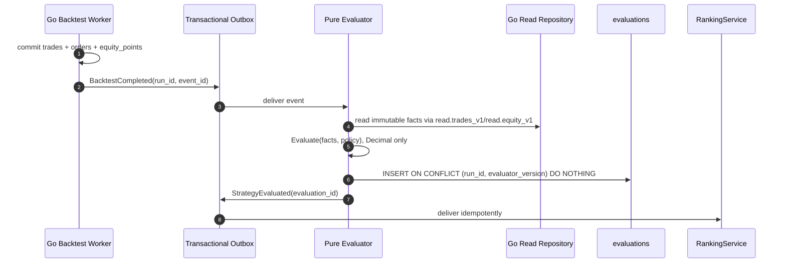

# Đặc tả: Evaluation (tính metrics từ kết quả backtest)

## Mô tả

Module này biến `BacktestResult` (trade/order/equity facts thô) thành
`Evaluation` (metrics dẫn xuất). Nó hiện thực hoá nguyên tắc §20 của đề bài:
Evaluation tách biệt khỏi Strategy và Backtest. Evaluator không biết strategy
nào sinh facts, không biết single/composite, không gọi exchange, clock hoặc DB.

Trade facts là sự thật mô phỏng; evaluation là cách đo sự thật đó. Đổi công thức
chỉ cần bump `evaluator_version` và tính lại từ facts, không chạy lại strategy.

Đặc biệt phải đảm bảo:

- Không chia cho zero ở edge case nào.
- Metrics tính lại được từ immutable `trades` + `equity_points`.
- Evaluation cũ không bị ghi đè; `UNIQUE (backtest_run_id, evaluator_version)`.
- Duplicate `BacktestCompleted` không tạo hai evaluation.
- Mọi phép tính dùng Decimal/NUMERIC, không `float`.
- `trade_count` nhỏ hơn policy tối thiểu không vào Leaderboard dù Return dương.

## Contract

```go
type Evaluator interface {
	Evaluate(input EvaluationInput, policy EvaluationPolicy) (Evaluation, error)
}

// Pure core. Repository adapter đọc facts từ read projections ở ngoài package.
type EvaluationInput struct {
	RunID         uuid.UUID
	InitialEquity decimal.Decimal
	Trades        []backtest.TradeFact
	EquityPoints  []backtest.EquityPoint
}

type EvaluationPolicy struct {
	EvaluatorVersion    string
	PeriodsPerYear      int
	ZeroPnLCountsAsWin  bool
	StddevDDOF          int
	MinPeriodsForSharpe int
	RiskFreeRate        decimal.Decimal
}

type Evaluation struct {
	BacktestRunID    uuid.UUID
	EvaluatorVersion string
	TotalReturnPct   decimal.Decimal
	WinRatePct       decimal.Decimal
	MaxDrawdownPct   decimal.Decimal
	TradeCount       int
	OpenTradeCount   int
	ProfitFactor     *decimal.Decimal
	SharpeRatio      *decimal.Decimal
	AvgTradePct      *decimal.Decimal
}
```

`InitialEquity` lấy từ immutable snapshot; verification baseline là `100 USDT`.
Không lấy số vốn từ environment hoặc một default khác trong Evaluator.

## Persistence contract

```sql
CREATE TABLE trades (
    id               BIGSERIAL PRIMARY KEY,
    backtest_run_id  UUID NOT NULL REFERENCES backtest_runs(id) ON DELETE CASCADE,
    sequence_no      INT NOT NULL,
    side             trade_side NOT NULL, -- LONG | SHORT
    signal_t         TIMESTAMPTZ,
    entry_time       TIMESTAMPTZ NOT NULL,
    entry_price      NUMERIC(24,8) NOT NULL,
    exit_time        TIMESTAMPTZ,
    exit_price       NUMERIC(24,8),
    quantity         NUMERIC(24,8) NOT NULL,
    fee_paid         NUMERIC(24,8) NOT NULL DEFAULT 0,
    slippage_cost    NUMERIC(24,8) NOT NULL DEFAULT 0,
    pnl_absolute     NUMERIC(24,8),
    pnl_percent      NUMERIC(12,6),
    exit_reason      VARCHAR(32), -- signal | stop_loss | take_profit | end_of_sample
    sl_price         NUMERIC(24,8),
    tp_price         NUMERIC(24,8),
    UNIQUE (backtest_run_id, sequence_no),
    CHECK (exit_time IS NULL OR exit_time >= entry_time),
    CHECK (exit_time IS NULL OR (exit_price IS NOT NULL
           AND pnl_absolute IS NOT NULL AND pnl_percent IS NOT NULL
           AND exit_reason IS NOT NULL)),
    CHECK (exit_reason IS NULL OR exit_time IS NOT NULL)
);

CREATE TABLE equity_points (
    backtest_run_id UUID NOT NULL REFERENCES backtest_runs(id) ON DELETE CASCADE,
    point_time      TIMESTAMPTZ NOT NULL,
    equity          NUMERIC(24,8) NOT NULL,
    drawdown_pct    NUMERIC(12,6),
    PRIMARY KEY (backtest_run_id, point_time)
);

CREATE TABLE evaluations (
    id                UUID PRIMARY KEY DEFAULT gen_random_uuid(),
    backtest_run_id   UUID NOT NULL REFERENCES backtest_runs(id) ON DELETE CASCADE,
    evaluator_version VARCHAR(24) NOT NULL,
    total_return_pct  NUMERIC(14,6) NOT NULL,
    win_rate_pct      NUMERIC(8,4) NOT NULL,
    max_drawdown_pct  NUMERIC(10,6) NOT NULL,
    trade_count       INT NOT NULL,
    open_trade_count  INT NOT NULL DEFAULT 0,
    profit_factor     NUMERIC(12,6),
    sharpe_ratio      NUMERIC(12,6),
    avg_trade_pct     NUMERIC(12,6),
    computed_at       TIMESTAMPTZ NOT NULL DEFAULT now(),
    UNIQUE (backtest_run_id, evaluator_version),
    CHECK (win_rate_pct BETWEEN 0 AND 100),
    CHECK (max_drawdown_pct <= 0),
    CHECK (trade_count >= 0),
    CHECK (open_trade_count >= 0)
);
```

`trades`/`equity_points` là immutable facts sau successful backtest commit.
`evaluations` append-only theo version. DB trigger chặn UPDATE/DELETE sau khi
publish.

## Luồng chính

### A. Facts tới Evaluation



Outbox payload chỉ chứa identity/version, không phải metrics. Repository load
lại facts từ versioned read projections. Core vẫn pure; DB adapter là boundary.
`event_consumptions(event_id, consumer)` chặn duplicate event, UNIQUE evaluation
chặn duplicate khác event ID cùng run/version.

### B. Công thức

```text
total_return_pct = (final_equity - initial_equity) / initial_equity * 100
```

`final_equity` là equity point có `point_time` lớn nhất. Không dùng tổng PnL để
thay thế equity curve: fee, mark-to-market và final-BBO settlement đã nằm trong
equity.

```text
settled = trades WHERE exit_time IS NOT NULL
open     = trades WHERE exit_time IS NULL
trade_count = count(settled)
open_trade_count = count(open)
win_rate_pct = count(settled WHERE pnl_absolute > 0) / trade_count * 100
```

`pnl_absolute = 0` không tính là win trong policy v1. Nếu `trade_count = 0`,
win rate trả `0`; nếu mẫu số không định nghĩa metric, trả `NULL` kèm reason.

```text
peak_t           = max(equity_s : s <= t)
drawdown_t       = (equity_t - peak_t) / peak_t * 100
max_drawdown_pct = min(drawdown_t)
```

MDD tính trên equity curve, không trên chuỗi trade. Equity mark-to-market mỗi
event boundary nên drawdown trong lúc giữ position không bị mất.

```text
gross_profit  = sum(pnl_absolute WHERE settled AND pnl_absolute > 0)
gross_loss    = sum(pnl_absolute WHERE settled AND pnl_absolute < 0)
profit_factor = gross_profit / abs(gross_loss) nếu gross_loss != 0
                NULL nếu không có loss
```

Profit factor không có loss trả `NULL`, không `Infinity`. Sharpe trả `NULL` khi
stddev = 0 hoặc số equity returns dưới `min_periods_for_sharpe`.

### C. Eligibility

Evaluator vẫn lưu evaluation cho run ngắn. Leaderboard filter theo policy:

```json
{ "min_trades": 10, "return_weight": 0.5, "win_rate_weight": 0.2, "risk_weight": 0.3 }
```

`min_trades` là configuration theo timeframe/dataset, không hard-code trong
Evaluator.

### D. Recompute

1. Tạo evaluator version mới, ghi metadata thay đổi.
2. Đọc lại cùng `trades`/`equity_points` qua repository.
3. Insert evaluation mới với version mới.
4. Giữ nguyên evaluation cũ, không chạy lại backtest, không gọi Binance.
5. Ranking tạo entry mới theo `(score_policy_version, evaluator_version)`.

## Verification fixture

MA20/MA50 fixture `data/formatted/sol/2026-03-04/` chưa có BacktestEngine/
Evaluator runtime nên chưa claim PnL. Structural acceptance:

- input hashes phải khớp verification record;
- strict close crossover: 29 signals, 15 BUY, 14 SELL;
- BBO LIMIT replay: 29 intents crossing, 15 settled trades sau final-BBO
  settlement;
- 5 lần chạy cùng facts phải có cùng canonical evaluation/result hash.

Evaluator unit tests dùng synthetic facts nhỏ, độc lập với marketdata fixture,
để kiểm chứng công thức không biến thành numeric production claim.

## Kịch bản lỗi

| Tình huống | Phản ứng |
|---|---|
| `trade_count = 0` | Return/MDD từ equity; average trade/profit factor/Sharpe `NULL` khi không định nghĩa; không exception |
| `trade_count = 1` | Sharpe `NULL` nếu dưới min periods; win rate 0 hoặc 100 |
| Không có settled loss | `profit_factor = NULL`, không Infinity |
| Mọi settled trade lỗ | `profit_factor = 0`, win rate 0 |
| `pnl_absolute = 0` | Không tính win theo policy v1 |
| Equity phẳng/stddev = 0 | Sharpe `NULL` |
| Facts thiếu equity points | `500 inconsistent_backtest_result`, không insert evaluation |
| Initial equity <= 0 | Snapshot/DB reject trước worker |
| MDD dương | DB check reject, worker ghi error rõ |
| Duplicate completion event | Outbox consumer idempotency + unique evaluation |
| Recompute cùng evaluator version | `ON CONFLICT DO NOTHING`; bump version để recompute |

## Ràng buộc

**Tính đúng đắn**

- Pure evaluator không dùng network, DB, wall clock hoặc strategy package.
- Mọi phép tính Decimal fixed-point; persistence NUMERIC.
- Mẫu số `initial_equity`, `trade_count`, `gross_loss`, `stddev`, `peak_equity`
  đều có branch kiểm tra.
- `NULL` khác `0`; không thay NULL bằng zero chỉ để sort.
- MDD phải `<= 0`; win rate phải nằm trong `[0,100]`.

**Hiệu năng**

- 500 trades + 20.000 equity points: O(n), single pass MDD, mục tiêu < 400 ms.
- Recompute batch, không giữ transaction dài cho toàn bộ dataset.

**Khả năng mở rộng**

- Metric mới = nullable field + evaluator version mới.
- Đổi công thức không chạy lại BacktestEngine.
- Evaluator không import concrete strategy/combiner.

## Tiêu chí chấp nhận

- [ ] AC-01: Same facts + same policy tạo canonical evaluation hash giống nhau qua 5 lần chạy.
- [ ] AC-02: 0 trade không chia zero, metric undefined trả NULL/reason đúng.
- [ ] AC-03: Mọi settled trade lỗ trả profit factor `0`; không có loss trả NULL.
- [ ] AC-04: MDD phản ánh drawdown trong lúc giữ position từ equity points.
- [ ] AC-05: Bump evaluator version tạo row mới, giữ nguyên row cũ và facts.
- [ ] AC-06: Duplicate cùng event hoặc khác event không tạo evaluation thứ hai.
- [ ] AC-07: Initial equity `100 USDT` từ snapshot; không đọc default runtime khác.
- [ ] AC-08: Fixture structural counts khớp 29 signals / 15 settled trades; numeric PnL chỉ đánh dấu VERIFIED sau implementation.
- [ ] AC-09: Static scan không có `float` trong Go evaluator core.

---

Cross-reference: `specs/backtest.md` (BacktestResult/trade/equity facts),
`specs/leaderboard.md` (eligibility/score), `specs/composite-strategy.md`,
`design.md` §4.1–§4.3, §5.6–§5.7, §8.4, ADR-007 và ADR-012.
