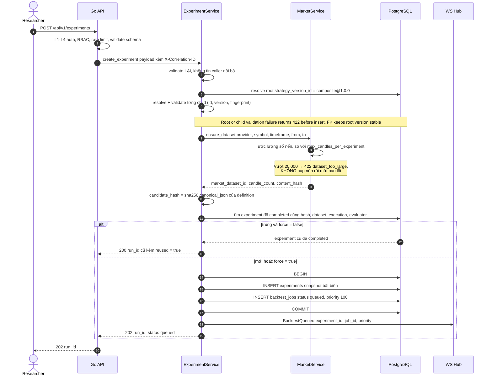
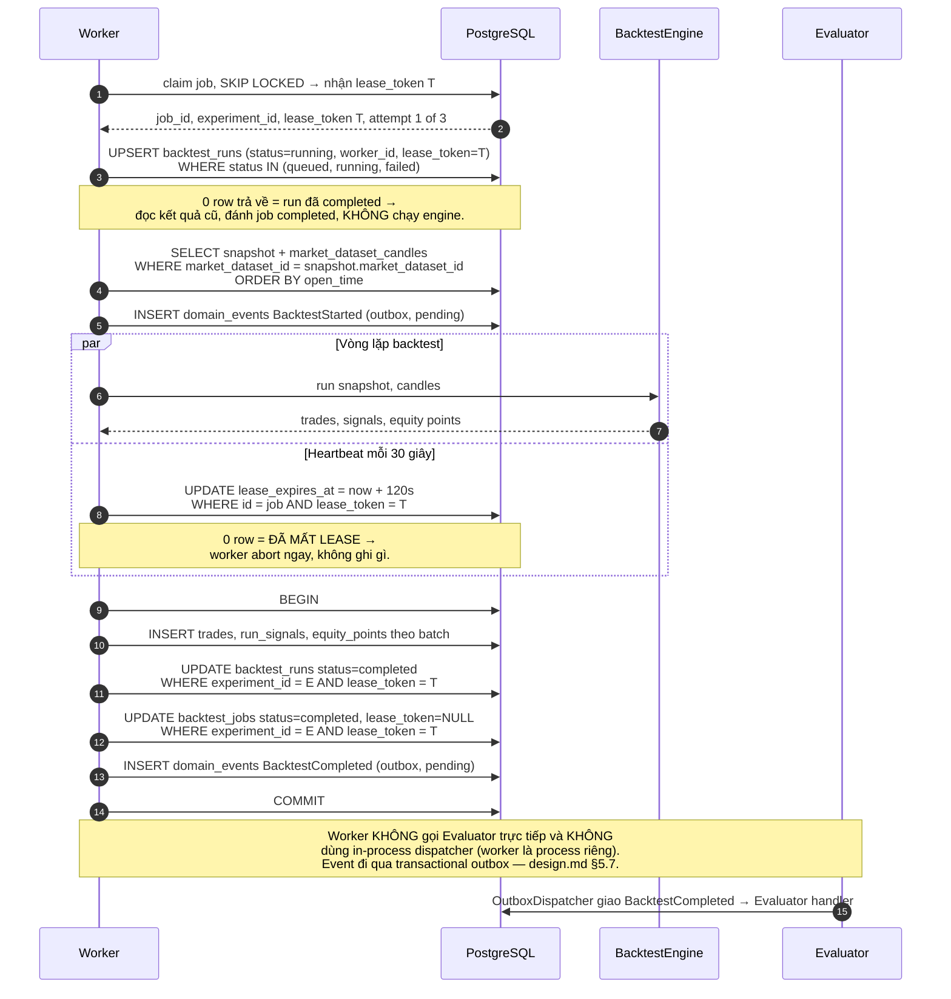
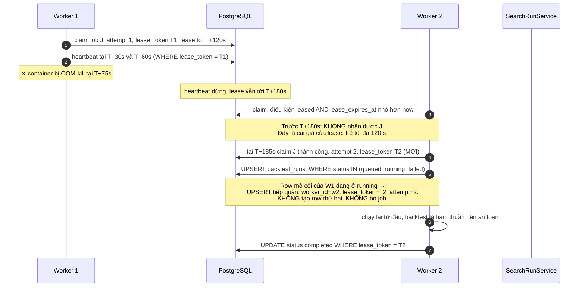
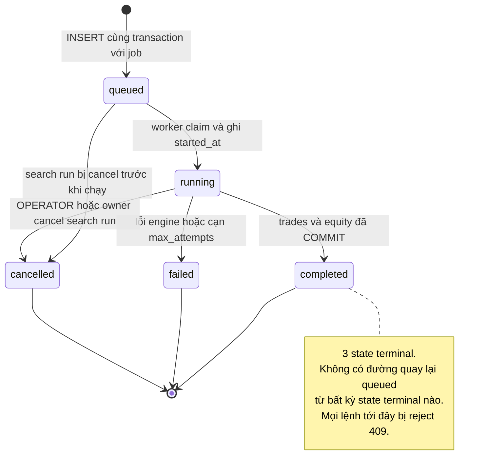

# Đặc tả: Experiment Snapshot và vòng đời Backtest Job/Run

## Mô tả

`ExperimentSnapshot` là đơn vị bất biến trung tâm của hệ thống. Nó ghi lại **mọi thứ** cần để chạy lại một backtest và nhận đúng con số cũ: strategy nào ở version nào, tham số con và policy kết hợp nào, tập nến nào với `content_hash` nào, giả định thực thi nào (fee, slippage, fill policy, position policy, xử lý vị thế còn mở khi hết dataset), và evaluator version nào. Worker nạp tập nến từ snapshot vật lý `market_dataset_candles` theo `market_dataset_id`, không đọc operational cache `candles`. Đây là hiện thực của yêu cầu Reproducibility (đề bài §36) và là gốc của toàn bộ chuỗi provenance mà `specs/leaderboard.md` khai thác. Nếu một field ảnh hưởng tới kết quả mà không nằm trong snapshot, thì kết quả đó không tái lập được — và đó là tiêu chí duy nhất để quyết định field nào phải có trong bảng này.

Module sở hữu ba bảng với ba vòng đời khác nhau: `experiments` là **snapshot ghi một lần, không bao giờ UPDATE**; `backtest_jobs` là **queue có trạng thái thay đổi liên tục**; `backtest_runs` là **vết của một lần thực thi**. Việc tách ba bảng không phải là chuẩn hoá cho đẹp: snapshot phải bất biến để provenance đáng tin, queue phải mutable để lease/retry hoạt động, và run phải riêng để ghi được `worker_id`, `duration_ms`, `error_code` — những thứ thuộc về *lần chạy* chứ không thuộc về *định nghĩa thí nghiệm*. Trách nhiệm code: `ExperimentService` (Python, `app/` ở repo root) tạo snapshot và enqueue; `worker` (cùng image Python, entrypoint worker riêng) claim job, đọc `market_dataset_candles` theo `market_dataset_id` và gọi `BacktestEngine.Run()` (chi tiết ở `specs/backtest.md`); Go API vẫn là public boundary cho auth, RBAC, ownership, quota, validate (`specs/auth.md`), còn experiment/search/leaderboard endpoints được FastAPI backend phục vụ.

Toàn bộ vòng đời là **bất đồng bộ, không có ngoại lệ** (ADR-006): `POST /api/v1/experiments` luôn ghi job và trả `202 { run_id }`, kể cả khi dataset chỉ có 200 nến và backtest mất 300 ms. Lý do không có fast path inline: hai code path nghĩa là hai chỗ có thể lệch nhau về xử lý lỗi, về việc ghi `backtest_runs`, về việc publish event — và bug ở path ít dùng sẽ không được phát hiện vì không ai chạy nó. Một path duy nhất đắt hơn khoảng **500 ms** cho backtest nhỏ nhưng đúng ở mọi trường hợp. Hệ quả tích cực: chuyển sang multi-worker không cần đổi API, vì API đã async từ đầu; nếu MVP làm inline rồi sau mới đổi async thì đó là **breaking change ở public contract**. Đánh đổi phải trả: UI buộc phải xử lý trạng thái pending (polling hoặc WebSocket) ngay từ MVP, không được hiển thị kết quả ngay sau khi bấm nút.

Queue là một **bảng PostgreSQL**, không phải broker (ADR-005). Điểm quyết định không phải là "đỡ một service" mà là: job và kết quả nằm cùng database nên `INSERT experiments` + `INSERT backtest_jobs` là **một transaction**. Với broker riêng, đó là dual-write giữa DB và broker, và phải thêm Outbox pattern để không mất job. `JobDispatcher` vẫn là port (`design.md` §5.1) để lúc đổi sang broker là đổi một adapter.

Đặc biệt phải đảm bảo:

- Một experiment được thực thi **đúng một lần** — kể cả khi queue giao trùng job cho hai worker.
- **Không có job nào treo mãi** ở `leased`: worker chết → lease hết hạn ≤ 120 s → job về `queued`.
- `experiments` row **không bao giờ bị UPDATE** sau khi tạo. Muốn đổi tham số là tạo experiment mới; DB trigger `experiments_immutable` chặn cả UPDATE/DELETE để invariant không phụ thuộc riêng vào application path.
- Không có `backtest_jobs` row trỏ tới experiment không tồn tại, và không có experiment mồ côi không bao giờ được chạy.
- Mỗi `backtest_runs` kết thúc ở đúng một trong ba state terminal `completed | failed | cancelled` — không có state "đang chạy mãi".
- Không request nào tạo được work vượt `max_candles_per_experiment` (default **20.000** nến).

## Contract

`ExperimentSnapshot` — dạng đầy đủ, là thứ `BacktestEngine.run()` nhận vào và là thứ provenance API đọc ra:

```json
{
  "experiment_id": "8f14e45f-ea1e-4f3c-9c2b-7d1a2b3c4d5e",
  "strategy": { "strategy_id": "composite", "version": "1.0.0" },
  "candidate_definition": "<composite snapshot bất biến: children + policy + weights>",
  "candidate_hash": "9f2a7c31be4708d5c6a1e3f0b2d8419c7e5a6b3d1f0c8e2a4b6d8f0a2c4e6b81",
  "market": {
    "dataset_version": "binance_usdm-ethusdt-5m-20260101-20260301",
    "revision_no": 1,
    "provider": "binance_usdm",
    "symbol": "ETHUSDT",
    "timeframe": "5m",
    "range_from": "2026-01-01T00:00:00Z",
    "range_to": "2026-03-01T00:00:00Z",
    "candle_count": 17280,
    "content_hash": "7a1e3c9d5b2f8046a1c3e5b7d9f1a3c5e7b9d1f3a5c7e9b1d3f5a7c9e1b3d5f7",
    "bbo_content_hash": "optional replay hash"
  },
  "execution": {
    "initial_equity": "100.00",
    "fixed_notional": "10.00",
    "leverage": "1",
    "fee_bps": 10,
    "slippage_bps": 0,
    "fill_policy": "bbo_limit",
    "position_policy": "one_net_position",
    "open_position_at_end": "last_executable_bbo",
    "risk_policy": null
  },
  "evaluator_version": "1.0.0",
  "created_at": "2026-08-11T09:14:22Z"
}
```

`candles` trong lời gọi `BacktestEngine.Run(snapshot, candles, bbo)` là danh sách
đã được load từ `market_dataset_candles`, sắp xếp tăng dần theo `open_time`.
`bbo` là immutable replay input với hash riêng; không phải kết quả query live từ
bảng `candles`.

> **`candidate_definition` là snapshot, không phải tham chiếu.** Nó nhúng cả `children` (mỗi child có `strategy_id` + `version` + `parameters` + `weight`) và `combination.policy` + `threshold` + `encoding`. Nếu chỉ lưu một id trỏ tới "cấu hình composite hiện tại", thì sửa cấu hình đó ba tháng sau sẽ làm sai nghĩa mọi experiment cũ. Cấu trúc chi tiết ở `specs/composite-strategy.md`, cơ sở lý luận ở `design.md` §5.4 và ADR-003.

> **Composite root và child được resolve riêng.** `experiments.strategy_version_id` trỏ tới version ảo `composite@1.0.0` (`is_composite=true`, `family=NULL`) để FK/provenance của combiner ổn định. Trước khi ghi snapshot, service vẫn phải resolve từng child theo `(strategy_id, version)`, kiểm tra `code_fingerprint` và nhúng definition đầy đủ vào `candidate_definition`; root không phải là một child và không cho phép nesting.

> **`content_hash` của dataset nằm trong snapshot, không chỉ `dataset_version`.** Binance đôi khi revise nến. Cùng một `(provider, symbol, timeframe, from, to)` ở hai thời điểm có thể cho hai tập nến khác nhau. Có hash thì phát hiện được; không có thì hai experiment "cùng dataset" thực ra chạy trên dữ liệu khác nhau mà không ai biết (`specs/market-data.md` luồng E).

Schema — tên cột dùng đúng như `design.md` §4.2:

```sql
experiments(id UUID PK, owner_id FK users, strategy_version_id UUID NOT NULL FK strategy_versions(id),
            candidate_definition JSONB NOT NULL, candidate_hash CHAR(64) NOT NULL, -- lowercase hex, không có prefix
            market_dataset_id UUID NOT NULL FK market_datasets(id),
            bbo_dataset_hash CHAR(64),
            initial_equity NUMERIC(20,8) DEFAULT 100,
            fixed_notional NUMERIC(20,8) DEFAULT 10,
            leverage NUMERIC(12,4) DEFAULT 1,
            fee_bps SMALLINT DEFAULT 10,
            slippage_bps SMALLINT DEFAULT 0,
            fill_policy fill_policy_enum DEFAULT 'bbo_limit',
            position_policy position_policy_enum DEFAULT 'one_net_position',
            open_position_at_end open_position_policy_enum NOT NULL DEFAULT 'last_executable_bbo',
            -- Risk policy: NULL = không có SL/TP trong fixture.
            stop_loss_pct NUMERIC(6,3), take_profit_pct NUMERIC(6,3),
            intrabar_priority VARCHAR(20) NOT NULL DEFAULT 'stop_loss_first'
                              CHECK (intrabar_priority IN ('stop_loss_first','take_profit_first')),
            evaluator_version VARCHAR(24) NOT NULL,
            search_candidate_id UUID UNIQUE FK search_candidates(id),   -- NULL nếu tạo tay; canonical one-to-one link
            created_at,
            CHECK (fee_bps >= 0 AND slippage_bps >= 0),
            CHECK (initial_equity > 0 AND fixed_notional > 0 AND leverage > 0),
            CHECK (stop_loss_pct   IS NULL OR (stop_loss_pct > 0 AND stop_loss_pct < 100)),
            CHECK (take_profit_pct IS NULL OR take_profit_pct > 0));
CREATE INDEX idx_experiments_owner ON experiments(owner_id, created_at DESC);
CREATE INDEX idx_experiments_hash  ON experiments(candidate_hash, market_dataset_id);
```

`experiments.search_candidate_id` là **liên kết canonical** cho candidate đã được backtest. Một candidate mới và experiment tương ứng được ghi trong cùng transaction với `backtest_jobs`; bảng `search_candidates` không duy trì cột FK ngược. `UNIQUE` trên FK cho phép nhiều experiment tạo tay (`NULL`) nhưng cấm một candidate bị gắn vào hai experiment. Muốn tìm experiment của candidate thì query ngược từ `experiments`, không duy trì hai con trỏ có thể lệch nhau.

DB trigger `experiment_candidate_match` còn kiểm tra candidate và experiment cùng owner, cùng `market_dataset_id`, và cùng `candidate_hash`; application không thể vô tình gắn candidate của run này vào experiment của run khác.

`open_position_at_end` dùng `open_position_policy_enum` và là một phần của snapshot. `discard_open_trade` bỏ row mở khỏi trade facts nhưng vẫn giữ equity mark-to-market để Return/MDD không mất PnL trong sample; `mark_unrealized` giữ row đó và Evaluator tách `trade_count` (trade đã settled) khỏi `open_trade_count`. Trong cả hai policy, Win Rate/profit factor/average trade chỉ dùng trade đã settled. Leaderboard dùng `trade_count` cho `min_trades`, nên run chỉ có vị thế mở không thể lọt Top-K một cách giả tạo.

```sql
backtest_jobs(id UUID PK,
              experiment_id UUID UNIQUE NOT NULL FK experiments(id) ON DELETE CASCADE,
              status job_status DEFAULT 'queued',   -- queued|leased|completed|failed|cancelled
              priority SMALLINT DEFAULT 100,        -- tạo tay 100 < search candidate 200
              attempt SMALLINT DEFAULT 0, max_attempts SMALLINT DEFAULT 3,
              leased_by VARCHAR(64),
              lease_token UUID,                     -- sinh MỚI mỗi lần claim (design.md §8.3.1)
              lease_expires_at TIMESTAMPTZ, last_error TEXT,
              enqueued_at, completed_at,
              CHECK (status <> 'leased' OR (leased_by IS NOT NULL
                     AND lease_token IS NOT NULL AND lease_expires_at IS NOT NULL)));
CREATE INDEX idx_jobs_claimable ON backtest_jobs(priority, enqueued_at) WHERE status = 'queued';
CREATE INDEX idx_jobs_expired_lease ON backtest_jobs(lease_expires_at) WHERE status = 'leased';

backtest_runs(id UUID PK,
              experiment_id UUID UNIQUE NOT NULL FK experiments(id) ON DELETE CASCADE,
              status run_status DEFAULT 'queued',   -- queued|running|completed|failed|cancelled
              worker_id VARCHAR(64),
              lease_token UUID,                     -- token của lượt claim sở hữu run này
              attempt SMALLINT DEFAULT 0,           -- lượt thực thi thứ mấy
              candles_read INT, signals_count INT, duration_ms INT,
              error_code VARCHAR(48), error_detail TEXT, started_at, finished_at, created_at);
```

> **`experiment_id` UNIQUE trên cả hai bảng giữ bất biến "một experiment có nhiều nhất một run".** Nhưng UNIQUE violation chỉ là **tín hiệu** "run đã tồn tại", không phải kết luận "bỏ job". Queue có semantics at-least-once và lease là heuristic dựa trên đồng hồ, nên sẽ có lúc hai worker cùng nhận một job. Ai được ghi kết quả do **`lease_token`** quyết định, không do ai INSERT trước. Quy tắc đầy đủ (`lease_token` mới mỗi lần claim, UPSERT có điều kiện, mọi UPDATE guard bằng token, phân biệt duplicate-active-worker với retry-sau-expiry) ở **`design.md` §8.3.1** — spec này tham chiếu về đó thay vì mô tả lại.

Hai index partial giải quyết hai câu truy vấn khác nhau và không thay thế nhau được: `idx_jobs_claimable` làm "lấy job tiếp theo" không full-scan khi bảng có 100K row (`WHERE status='queued'` lọc trước, `ORDER BY priority, enqueued_at` khớp thứ tự index); `idx_jobs_expired_lease` cho sweeper tìm lease hết hạn mà không quét toàn bộ job đã hoàn thành.

Priority: experiment tạo tay `priority=100`, search candidate `priority=200`, **số nhỏ = ưu tiên cao**. Lý do: một user đang ngồi chờ kết quả của một backtest cụ thể không nên bị xếp sau 500 candidate của search run chạy nền. Không có priority thì trải nghiệm "bấm Run rồi chờ 40 phút" là hành vi mặc định ngay khi có một search run hoạt động.

## Luồng chính

### A. Tạo experiment — `POST /api/v1/experiments` trả `202`



`INSERT experiments` và `INSERT backtest_jobs` nằm trong **cùng một transaction**. Hai điều xấu bị chặn: một job trỏ tới experiment không tồn tại (nếu job commit trước), và một experiment mồ côi không bao giờ được chạy (nếu experiment commit rồi process chết trước khi enqueue). Đây là lợi ích cụ thể, đo được của việc dùng bảng PostgreSQL làm queue — với broker riêng đây là dual-write và cần Outbox pattern để đạt cùng bảo đảm.

### B. Dedup thông minh và cờ `force`

1. Tính `candidate_hash = sha256(canonical_json(candidate_definition))`. Canonical hoá: sort key, chuẩn hoá số, UTF-8 NFC — nếu không thì `{"a":1,"b":2}` và `{"b":2,"a":1}` cho hai hash khác nhau và dedup vô hiệu một cách âm thầm.
2. Tra `idx_experiments_hash` theo `(candidate_hash, market_dataset_id)`.
3. Lọc tiếp trên **toàn bộ** execution config (`initial_equity`, `fixed_notional`, `leverage`, `fee_bps`, `slippage_bps`, `fill_policy`, `position_policy`, `open_position_at_end`, `stop_loss_pct`, `take_profit_pct`, `intrabar_priority`) và cả candle/BBO hashes + `evaluator_version`. Khác một field nào trong nhóm này là một thí nghiệm khác.
4. Nếu tìm thấy và `backtest_runs.status = 'completed'` → trả `200` với `run_id` cũ, không tạo job. Endpoint trở thành idempotent theo nội dung và tiết kiệm CPU worker.
5. Nếu tìm thấy nhưng run đang `queued`/`running` → trả `202` với `run_id` đang chạy, cũng không tạo job thứ hai.
6. Nếu run cũ `failed` → **tạo mới**. Một lần chạy lỗi không phải là kết quả, và người dùng có quyền thử lại.

> **Đánh đổi phải nêu:** dedup theo nội dung mâu thuẫn với một nhu cầu hợp lệ — chạy lại chính xác cùng một cấu hình để **kiểm chứng determinism** (demo S5: chạy hai lần phải ra cùng con số). Vì vậy có `force=true`: bỏ qua bước 3–5, luôn tạo experiment mới. Không có cờ này thì bài kiểm chứng quan trọng nhất của Reproducibility lại là bài duy nhất hệ thống không cho làm. Cờ này không mở lỗ hổng vì nó vẫn đi qua quota và rate limit.

### C. Worker claim job — `FOR UPDATE SKIP LOCKED` + `lease_token`

```sql
WITH claimed AS (
    SELECT id FROM backtest_jobs
    WHERE status = 'queued'
       OR (status = 'leased' AND lease_expires_at < now())   -- thu hồi lease của worker đã chết
    ORDER BY priority ASC, enqueued_at ASC
    FOR UPDATE SKIP LOCKED LIMIT 1
)
UPDATE backtest_jobs j
SET status = 'leased', leased_by = $1,
    lease_token = gen_random_uuid(),                          -- token MỚI cho mỗi lượt claim
    lease_expires_at = now() + interval '120 seconds',
    attempt = j.attempt + 1
FROM claimed c WHERE j.id = c.id
RETURNING j.id, j.experiment_id, j.lease_token, j.attempt, j.max_attempts;
```

| Cách                              | Vấn đề                                                                                     |
| --------------------------------- | ------------------------------------------------------------------------------------------ |
| `SELECT ... FOR UPDATE` thường    | Worker 2 **chờ** worker 1 nhả lock → serialize hoàn toàn, mất hết lợi ích của multi-worker  |
| `UPDATE ... RETURNING` không lock | Race: hai worker cùng đọc `status='queued'` rồi cùng UPDATE → **một job chạy hai lần**      |
| Advisory lock                     | Được, nhưng phải tự quản lý key space và tự viết cơ chế phát hiện worker chết               |
| **`FOR UPDATE SKIP LOCKED`** ✅    | Worker 2 **bỏ qua** row đang bị lock và nhận row tiếp theo ngay — đúng semantics competing consumer |

`lease_token` là thứ làm việc tiếp quản an toàn: worker giữ token trong bộ nhớ và **mọi** UPDATE sau đó (heartbeat, ghi kết quả, đánh completed/failed) đều có `AND lease_token = $token`. Worker mất lease → UPDATE khớp 0 row → nó biết và dừng, không ghi đè kết quả của worker mới. Chi tiết SQL của cả bốn thao tác được guard, ba tình huống take-over, và 5 bất biến kiểm chứng được: **`design.md` §8.3.1**.

Worker rỗi polling mỗi **500 ms** với backoff tới 2 s khi queue trống liên tục. Broker cho push và không có latency này; với backtest kéo dài 2–40 s thì 500 ms là dưới 2% và không đáng thêm một service (ADR-005).

### D. Thực thi, heartbeat và ranh giới ghi kết quả



Heartbeat gia hạn `lease_expires_at` mỗi **30 s** trong lúc chạy job dài, với lease dài **120 s**. Tỉ lệ 4:1 cho phép mất ba nhịp heartbeat liên tiếp (GC pause, DB chậm tức thời) mà job vẫn không bị thu hồi oan. `WHERE lease_token = T` là điều kiện bắt buộc: nếu job đã bị worker khác claim thì `lease_token` đã đổi, heartbeat khớp **0 row**, và worker cũ phải dừng ngay thay vì tiếp tục tính rồi ghi kết quả ghi đè worker mới (`design.md` §8.3.1).

Kết quả, trạng thái và outbox event được ghi trong **một** transaction. Nếu tách, sẽ có cửa sổ mà `backtest_runs.status='completed'` nhưng `trades` chưa có row — và API `GET /experiments/{id}/trades` trả mảng rỗng cho một run đã xong. Nếu event nằm ngoài transaction thì có trạng thái "kết quả đã ghi nhưng `BacktestCompleted` mất" → Evaluator không bao giờ chạy → candidate treo mãi.

### E. Worker chết, lease hết hạn, cạn `max_attempts`



Nếu W1 thực ra **chưa chết** (chỉ GC pause dài) và hoàn thành backtest tại T+200s, nó sẽ `UPDATE ... WHERE lease_token = T1` — nhưng token hiện tại là T2, nên UPDATE khớp **0 row**. W1 log WARN, không ghi gì, thoát. Kết quả của W2 không bị ghi đè. Đây là ca (a) *duplicate active worker* ở `design.md` §8.3.1, và nó được xử lý bằng cùng một cơ chế với ca worker chết thật — không cần phân biệt hai ca.

Sau `max_attempts = 3`, job chuyển `status='failed'` với `last_error` ghi rõ, `backtest_runs.status='failed'` với `error_code`, và **candidate tương ứng được đánh `failed`** thay vì treo `queued` mãi — nếu bỏ bước cuối, `SearchRunService` sẽ đếm mãi không đủ `candidates_tested` và search run không bao giờ đạt stop condition (`specs/search-loop.md`).

> **Chi tiết dễ bỏ sót: retry chỉ an toàn vì backtest là hàm thuần.** `BacktestEngine.run(snapshot, candles)` không có side effect ngoài giá trị trả về; snapshot experiment và snapshot nến đều bất biến. Chạy lại lần thứ hai cho đúng kết quả lần thứ nhất. Nếu engine có state ngoài (ghi file tạm, cập nhật counter global) thì retry sẽ cho kết quả khác nhau tuỳ số lần retry, và đó là loại lỗi không tái hiện được.

### F. State machine của `backtest_runs.status`



Không có cạnh `failed → queued`: retry là việc của **job** (`attempt += 1`), không phải của run. Run giữ đúng nghĩa "một lần thực thi có kết cục", còn job giữ nghĩa "công việc cần hoàn thành". Trộn hai khái niệm này lại là lý do rất nhiều hệ thống queue có state machine mà không ai đọc nổi.

### G. Đọc kết quả

| Method | Route | Auth | Ghi chú |
| --- | --- | --- | --- |
| POST | `/api/v1/experiments` | Auth | → `202 {run_id}`; validate + quota; `200` nếu dedup hit |
| GET | `/api/v1/experiments/{id}` | **Owner** | status + result summary + provenance |
| GET | `/api/v1/experiments/{id}/candles` | Owner | nến từ `market_dataset_candles`, tối đa **1000** điểm/cửa sổ |
| GET | `/api/v1/experiments/{id}/trades` | Owner | phân trang, max **200**/page |
| GET | `/api/v1/experiments/{id}/equity` | Owner | decimate xuống ≤ **2000** điểm |
| GET | `/api/v1/experiments/{id}/overlays` | Owner | signal + entry/exit/SL/TP marker, tính ở backend |

`Owner` nghĩa là `experiments.owner_id = principal.id` **hoặc** role ∈ `(OPERATOR, ADMIN)`. Không khớp → `404`, không `403`: `403` xác nhận resource tồn tại và biến endpoint thành oracle dò UUID (`specs/auth.md`).

Decimate equity xuống 2000 điểm không phải để "nhẹ mạng" mà vì một run 20.000 nến có 20.000 điểm equity, trong khi chart rộng nhất chỉ có khoảng 2000 pixel ngang — phần còn lại là byte không ai thấy được. Downsample giữ điểm min/max trong mỗi bucket để **không làm mất hình dạng drawdown**; lấy mẫu đều đơn giản có thể bỏ đúng điểm đáy và làm biểu đồ đẹp hơn thực tế.

Event của module: `BacktestQueued` (publisher `ExperimentService`), `BacktestStarted` / `BacktestCompleted` / `BacktestFailed` (publisher Worker). Consumer chi tiết ở `design.md` §5.6. Worker **không** gọi `Evaluator.evaluate()` trực tiếp (đề bài §34) **và cũng không** dùng in-process dispatcher: worker là process riêng nên event pipeline đi qua **transactional outbox** trên `domain_events`, ghi cùng transaction với kết quả (`design.md` §5.7).

## Kịch bản lỗi

| Tình huống | Phản ứng |
|---|---|
| `strategy_id@version` không có trong registry | `422 unknown_strategy_version` trước khi mở transaction. FK `strategy_version_id` là lớp phòng thủ thứ hai |
| `code_fingerprint` của strategy lệch với DB | Worker và API **fail fast lúc startup**, không chạy job nào với provenance sai (ADR-009) |
| Số nến yêu cầu > `max_candles_per_experiment` | `422 dataset_too_large` kèm `max_candles` và `suggested_ranges`. Kiểm tra trên **ước lượng** từ `(to-from)/interval`, không nạp nến rồi mới báo |
| `from=2017-01-01`, `timeframe=1m` | Chính là ca trên: 4,7 triệu nến, đủ làm worker quá tải. Chặn ở Go API trước khi enqueue (ADR-014) |
| Process chết sau `INSERT experiments`, trước `INSERT backtest_jobs` | Không xảy ra: cùng transaction, chưa COMMIT thì cả hai bị rollback |
| Hai request `POST /experiments` giống nhau đồng thời | Cả hai qua dedup check (chưa có row `completed`) → hai experiment. Chấp nhận: dedup là tối ưu CPU, không phải khoá tính đúng đắn. Muốn chặt hơn thì client gửi `force=false` và retry sau khi run đầu xong |
| Lease hết hạn khi worker 1 vẫn sống (duplicate active worker) | Worker 2 claim với `lease_token` **mới**; UPSERT `backtest_runs` tiếp quản run. Worker 1 hoàn thành sau đó nhưng mọi UPDATE của nó có `WHERE lease_token = T1` → khớp **0 row** → log WARN và thoát, không ghi đè kết quả của worker 2. Heartbeat của worker 1 cũng khớp 0 row nên nó biết mất lease từ trước (`design.md` §8.3.1) |
| Worker bị OOM-kill giữa job | Heartbeat dừng → lease hết hạn sau ≤ 120 s → worker khác claim với `lease_token` mới, `attempt += 1`; UPSERT tiếp quản row `running` mồ côi (**không** bỏ job — nếu bỏ thì run treo `running` vĩnh viễn). Trễ tối đa 120 s là cái giá đã biết của lease-based recovery |
| Job bị claim lại sau khi run đã `completed` | UPSERT có `WHERE status IN ('queued','running','failed')` → không match → `RETURNING` rỗng → worker đọc kết quả có sẵn, đánh job `completed`, **không** chạy lại engine |
| Job fail 3 lần liên tiếp | `backtest_jobs.status='failed'` + `last_error`; `backtest_runs.status='failed'` + `error_code`; candidate đánh `failed`; `SearchRunService` tăng `candidates_failed` và có thể chạm `max_failure_rate` |
| Strategy plugin có vòng lặp vô hạn | Deadline trên `analyze()` → `error_code='strategy_timeout'`, job **không** retry (không retryable), search run tiếp tục. Một plugin xấu không được phép giết cả run |
| Plugin ném `ZeroDivisionError` / `IndexError` | Catch ở biên gọi, log kèm `strategy_id@version`, `error_code='strategy_error'`, worker **không** crash |
| Duplicate `BacktestCompleted` tới Evaluator | `event_consumptions(event_id, consumer)` chặn lớp một; `UNIQUE (backtest_run_id, evaluator_version)` chặn lớp hai. Không tạo hai evaluation (R12) |
| PostgreSQL down khi worker đang chạy | Worker retry ghi với backoff 1s→2s→4s, tối đa 30 s; thất bại → thoát để lease hết hạn tự nhiên. **Không** ghi kết quả một nửa |
| Dataset bị xoá trong lúc job còn `queued` | `ON DELETE` bị FK chặn — `market_datasets` không cho xoá khi còn experiment tham chiếu. Retention chỉ xoá dataset không còn ai trỏ tới (`design.md` §4.4) |
| Cancel search run khi 3 job đang `leased` | Job đang chạy hoàn thành bình thường (không kill giữa dòng); job còn `queued` chuyển `cancelled`. Trạng thái quan sát được, không có job zombie |
| `GET /experiments/{id}` khi run còn `queued` | `200` với `status: "queued"`, `result: null`, `queue_position`. **Không** `404`, và không chờ cho tới khi xong |
| `RESEARCHER` đọc experiment của người khác | `404 not_found`, response không chứa field nào của experiment. Log `reason=ownership_denied` |
| Clock skew giữa worker và DB | Mọi so sánh lease dùng `now()` **của DB**, không của process. Hai worker lệch clock 5 s không tạo hành vi khác nhau |

## Ràng buộc

**Tính đúng đắn**

- `experiments` là append-only. Không có endpoint nào UPDATE row của bảng này; kiểm chứng bằng static scan `server/` → **0** câu `UPDATE experiments`, và DB trigger `experiments_immutable` là lớp bảo vệ cuối cùng.
- `INSERT experiments` + `INSERT backtest_jobs` trong **một** transaction, không có ngoại lệ.
- `experiment_id` UNIQUE trên `backtest_jobs` và `backtest_runs` — exactly-once đến từ constraint DB, không từ độ chính xác của lease.
- Mọi giá trị tiền dùng `NUMERIC`, không `float`. Sai số float64 tích luỹ qua hàng nghìn trade đủ để lật dấu Total Return.
- `CHECK (fee_bps >= 0 AND slippage_bps >= 0)` và `CHECK (initial_equity > 0 AND fixed_notional > 0 AND leverage > 0)` là lớp phòng thủ cuối nếu validation có bug.
- Mọi timestamp là `TIMESTAMPTZ` UTC; so sánh lease bằng `now()` của DB.

**Hiệu năng**

- `POST /api/v1/experiments` (đường tạo mới): p95 **< 250 ms**, gồm resolve version + ensure dataset khi nến đã có sẵn trong DB.
- Dedup hit: p95 **< 80 ms** — một index lookup trên `idx_experiments_hash`.
- Claim job: p95 **< 20 ms** với 100.000 row trong `backtest_jobs`, nhờ `idx_jobs_claimable` partial.
- Ghi kết quả một run 20.000 nến (khoảng 80 trade, 20.000 equity point): **< 2 s** bằng batch insert kiểu `execute_values`, không loop từng row.
- Polling khi rỗi: 500 ms, backoff tới 2 s. Overhead của polling < **1%** một core khi queue trống.
- `GET /experiments/{id}/equity`: p95 **< 300 ms** cho 2000 điểm sau decimate.

**Bảo mật**

- Ownership check trên **mọi** route `GET /experiments/*`; sai chủ → `404`, không `403`.
- Quota kiểm tra **trong cùng transaction** với `INSERT`. Check ngoài transaction là TOCTOU: hai request đồng thời đều thấy còn slot rồi đều insert.
- `error_detail` của run không bao giờ đi ra client nguyên văn — API chỉ trả `error_code` domain-level và `request_id`. Stack trace, tên bảng, SQL message chỉ nằm trong log server.
- Snapshot chỉ nhận `(provider, symbol)` thuộc `market_pairs` active và `timeframe` thuộc enum; không có đường nào để một chuỗi tự do từ client đi vào truy vấn nến.
- Worker chỉ đọc `market_dataset_candles` theo `market_dataset_id`; operational cache `candles` chỉ phục vụ chart/realtime và không thể làm thay đổi input của experiment đã tạo.
- Worker không mở cổng nào, không nhận HTTP request. Nó chỉ đọc queue — bề mặt tấn công của nó là **rỗng** về phía network.

**Khả năng mở rộng**

- 1 worker → N worker: `docker compose up --scale worker=N`, **0 dòng code đổi**. `SKIP LOCKED` đã là competing consumer từ ngày đầu.
- Đổi sang broker (Redis Stream / RabbitMQ) = thay `PostgresJobDispatcher` bằng `BrokerJobDispatcher`. `ExperimentSnapshot`, event payload, public API, `BacktestEngine.run()`: không đổi.
- Thêm field vào `execution` (ví dụ `funding_rate_bps`) = thêm 1 cột + 1 key trong snapshot. Không đổi queue, không đổi worker loop.
- Ngưỡng chuyển sang broker phải **đo** rồi mới đổi: `job_queue_wait_seconds` cao do contention, hoặc số worker > ~20 khiến polling tạo tải đáng kể.

**Quan sát được**

- `jobs_queued` gauge, `jobs_leased` gauge — hai số trả lời "queue có đang tắc không".
- `jobs_completed_total`, `jobs_failed_total{error_code}` counter — `error_code` là label nên đếm được theo loại lỗi mà không parse log.
- `job_queue_wait_seconds` histogram (từ `enqueued_at` tới lúc claim) — chính là tín hiệu quyết định có cần thêm worker.
- `backtest_duration_seconds` histogram với label `strategy_family` và `candle_count_bucket`.
- Log JSON structured kèm `correlation_id` xuyên Go API → Go Worker; một `request_id` trên UI grep ra được toàn bộ chuỗi (`design.md` §8.4). Python AI chỉ xuất hiện khi route sentiment được gọi.
- **Không** dùng `experiment_id` hay `user_id` làm label metric: cardinality explosion và PII.

## Tiêu chí chấp nhận

- [ ] AC-01: `POST /api/v1/experiments` với dataset 200 nến → phản hồi là `202` kèm `run_id` trong **< 250 ms**, và `backtest_runs.status` lúc đó là `queued` — chứng minh không có đường inline nào.
- [ ] AC-02: Test static: `BacktestEngine.Run` chỉ được gọi từ worker package; HTTP handler không chạy backtest inline. Worker chỉ query `market_dataset_candles` cho input.
- [ ] AC-03: Kill process Go giữa lúc `INSERT experiments` và `INSERT backtest_jobs` (inject exception) → `SELECT count(*) FROM experiments` không tăng, `backtest_jobs` không tăng.
- [ ] AC-04: Chạy 4 worker, enqueue 40 job → `SELECT experiment_id, count(*) FROM backtest_runs GROUP BY 1 HAVING count(*) > 1` trả **0 row**; tổng `trades` bằng đúng tổng của 40 run chạy tuần tự.
- [ ] AC-05: `SIGKILL` một worker giữa job → trong **≤ 120 s** job đó được worker khác claim với `attempt=2` và `lease_token` khác; sau đó hoàn thành với `worker_id` khác. Không job nào còn `leased` sau khi queue rỗng, và **không** run nào còn `running`.
- [ ] AC-05b: **Duplicate active worker.** Force expire lease của worker 1 giữa job (`UPDATE backtest_jobs SET lease_expires_at = now() - interval '1s'`) trong lúc nó vẫn đang chạy → worker 2 claim và hoàn thành. Khi worker 1 chạy xong: mọi UPDATE của nó khớp **0 row**, log có `WARN lease_lost`, và `backtest_runs.lease_token` bằng token của worker 2. `duration_ms` là của worker 2, không bị worker 1 ghi đè.
- [ ] AC-05c: **Take-over run mồ côi.** `SIGKILL` worker giữa job để lại `backtest_runs.status='running'` → worker sau claim và **UPSERT tiếp quản** (không bỏ job): `worker_id` đổi, `attempt=2`, run kết thúc `completed`. Không có run nào treo `running` sau khi queue rỗng (bất biến I3).
- [ ] AC-05d: **Job claim lại sau khi run đã `completed`.** Đưa job về `queued` bằng tay sau khi run `completed` → worker claim, UPSERT khớp 0 row, job được đánh `completed` mà `BacktestEngine.run()` **không** được gọi (đếm bằng counter/spy), `duration_ms` và `trades` không đổi.
- [ ] AC-06: Inject lỗi khiến một job fail 3 lần → `backtest_jobs.status='failed'`, `last_error` khác NULL, `search_candidates.status='failed'`, và search run vẫn đạt được stop condition.
- [ ] AC-07: Enqueue 10 job `priority=200` rồi 1 job `priority=100` → job `priority=100` được claim **trước** cả 10 job kia.
- [ ] AC-08: `POST /experiments` hai lần với payload giống hệt, chờ lần đầu `completed` → lần hai trả `200` với **cùng** `run_id` và `reused: true`; `count(*) FROM experiments` chỉ tăng 1.
- [ ] AC-09: Cùng payload với `force=true` → tạo experiment **mới**, và hai run cho `total_return_pct` **giống nhau đến từng chữ số** (kiểm chứng determinism).
- [ ] AC-10: `POST /experiments` với `from=2017-01-01&to=2026-01-01&timeframe=1m` → `422 dataset_too_large`; RSS của process Go không tăng quá **50 MiB** trong lúc xử lý request đó.
- [ ] AC-11: User A tạo experiment, user B (`RESEARCHER`) gọi cả 5 route `GET /experiments/{id}*` (summary, candles, trades, equity, overlays) → cả 5 trả `404` và response không chứa `candidate_hash`, `owner_id`, hay bất kỳ metric nào.
- [ ] AC-12: `GET /experiments/{id}` ngay sau khi tạo → `200` với `status="queued"`, `result=null`; sau khi worker xong → `200` với `status="completed"` và đầy đủ provenance (strategy version, candle/BBO hashes, toàn bộ execution assumptions gồm `initial_equity`, `fixed_notional`, `leverage`, `fee_bps`, `slippage_bps`, `fill_policy`, `position_policy`, `open_position_at_end`, `risk_policy`, `evaluator_version`).
- [ ] AC-12b: Gắn cùng `search_candidate_id` vào hai experiment → `UNIQUE` reject; gắn candidate với owner/dataset/hash khác → trigger `experiment_candidate_match` reject.
- [ ] AC-12c: Thử `UPDATE` hoặc `DELETE` một experiment đã tạo → DB trigger `experiments_immutable` reject; provenance và job liên quan không đổi.
- [ ] AC-13: `GET /experiments/{id}/equity` của run 20.000 nến → **≤ 2000** điểm, và giá trị `max_drawdown` tính từ chuỗi đã decimate lệch **< 0,1** điểm phần trăm so với chuỗi gốc.
- [ ] AC-14: Publish `BacktestCompleted` hai lần cho cùng run → `count(*) FROM evaluations WHERE backtest_run_id=$1` bằng **1**; `leaderboard_entries` không có row trùng.
- [ ] AC-14b: **Outbox không mất event.** `SIGKILL` process Go ngay sau khi worker COMMIT kết quả (trước khi dispatcher chạy) → sau restart, `domain_events` vẫn có row `BacktestCompleted` với `dispatch_status='pending'`, dispatcher giao nó, và `evaluations` có đúng 1 row. Không có kết quả nào tồn tại mà thiếu evaluation (`design.md` §5.7).
- [ ] AC-15: Chạy search run 40 candidate với 1 worker rồi với 4 worker trên cùng dataset → thời gian giảm **≥ 3×**, `git diff` giữa hai lần chạy **rỗng**.

## Target additions (unified blueprint)

- **Lease/takeover là contract queue bắt buộc**: claim qua `FOR UPDATE SKIP LOCKED` + `lease_token` + heartbeat; worker chết → lease hết hạn → worker khác take-over, worker cũ không commit được sau takeover (sơ đồ 17, 18; các AC lease hiện có của spec này).
- Snapshot + job tạo atomically trong một transaction; dataset là immutable reference (sơ đồ 16).
