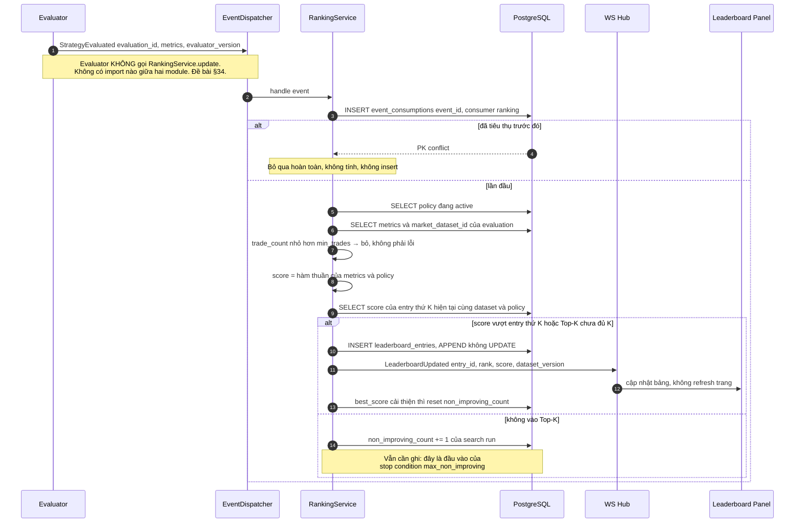
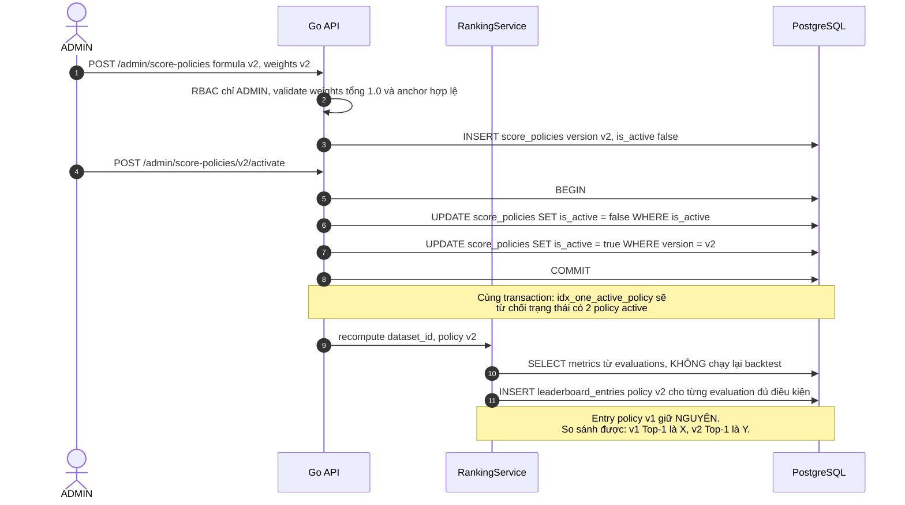

# Đặc tả: Leaderboard, Score Policy và Top-K Ranking

## Mô tả

Leaderboard trả lời một câu hỏi duy nhất nhưng phải trả lời được **mãi mãi**: strategy nào tốt nhất, trên đúng tập dữ liệu nào, theo đúng công thức chấm điểm nào, tại đúng thời điểm nào. Module gồm hai bảng — `score_policies` (công thức chấm điểm, có version, chỉ một cái active) và `leaderboard_entries` (bảng xếp hạng **append-only** tham chiếu `evaluation_id`) — cộng `RankingService` là consumer của event `StrategyEvaluated`. Đây là hiện thực của đề bài §21 (Module 8 Leaderboard) và §22 (Top-K Strategies), và là mắt cuối của chuỗi provenance bắt đầu từ `specs/experiment.md`.

Điểm kiến trúc quan trọng nhất: **entry là snapshot bất biến của một evaluation tại một thời điểm với một scoring policy version**, không phải một dòng mutable mô tả "strategy này đang đứng thứ mấy". Sự khác biệt nghe nhỏ nhưng quyết định hệ thống có trả lời được §40.8 hay không. Nếu entry mutable, thì việc một candidate mới tốt hơn xuất hiện sẽ **ghi đè** entry cũ, và câu hỏi "Top-1 lúc 14:05 là ai" trở thành không trả lời được — cùng với đó là toàn bộ khả năng giải thích diễn tiến của một search run. Đổi lại, append-only tạo nhiều row hơn và "Top-K hiện tại" trở thành một query chứ không phải một `SELECT *`.

`RankingService` **không bị `Evaluator` gọi trực tiếp** (đề bài §34). Nó là consumer của `StrategyEvaluated`. Ranh giới này không phải hình thức: nó là lý do đổi công thức score không cần chạm vào Evaluator, và là lý do thêm một consumer thứ hai (ví dụ một service gửi thông báo khi có Top-1 mới) không cần sửa dòng nào ở phía sinh event. Hướng phụ thuộc một chiều: `Evaluator → event → RankingService → event → WS Hub`.

Đặc biệt phải đảm bảo:

- `leaderboard_entries` **không bao giờ UPDATE**. Không có endpoint, không có job nào sửa `score` của một row đã ghi.
- Hai strategy chỉ được xếp cùng bảng khi **cùng `market_dataset_id`** và **cùng `score_policy_version`**.
- Duplicate `StrategyEvaluated` / `BacktestCompleted` **không** tạo hai entry (rủi ro R12).
- Đúng **một** `score_policies` row có `is_active = TRUE` tại mọi thời điểm — được DB bảo đảm, không bằng quy ước.
- Strategy có `trade_count < min_trades` **không** vào Top-K, dù `total_return_pct` dương.
- Đổi công thức score **không** chạy lại backtest và **không** làm mất entry cũ.
- Mọi entry truy nguyên được về `strategy_id@version` + `parameters` + `dataset.content_hash` + `fee_bps`/`slippage_bps`/`fill_policy`.

## Contract

Đề bài §35 yêu cầu giải thích rõ: Leaderboard nên **lưu trực tiếp** hay **tính từ Experiment Results**? Ba phương án đã được phân tích ở `design.md` §4.1, chốt bằng ADR-012:

| Phương án | Ưu | Nhược |
| --- | --- | --- |
| **A.** Tính on-the-fly từ `evaluations` | Không có dữ liệu trùng lặp; đổi scoring chỉ là đổi `ORDER BY` | Không lưu được **lịch sử thứ hạng** (Top-1 lúc 14:05 là ai?); mỗi request Top-K phải sort toàn bộ `evaluations` |
| **B.** Bảng `leaderboard_entries` **mutable** | Đọc Top-K nhanh | Ghi đè khi có entry tốt hơn → **mất lịch sử**; entry trở thành bản copy của "strategy hiện tại" → **phá provenance** (R6) |
| **C.** Append-only tham chiếu `evaluation_id` ✅ | Đọc nhanh; giữ lịch sử thứ hạng; entry là snapshot bất biến | Nhiều row hơn A; cần một query để lấy "Top-K hiện tại" |

**Chọn C.** Điểm quyết định: chỉ khi entry là snapshot bất biến gắn với một `score_policy_version` cụ thể thì mới (1) trả lời được §40.8 về việc kết quả này do version strategy nào tạo ra, và (2) đổi được công thức score mà kết quả cũ vẫn đọc được để so sánh — "với policy v1 thì Top-1 là X, với v2 là Y" là một câu hỏi có ý nghĩa khoa học, và phương án B làm nó biến mất vĩnh viễn.

```sql
score_policies(version VARCHAR(24) PK,
               formula TEXT NOT NULL,   -- '0.5*return_norm + 0.2*win_rate_norm + 0.3*risk_score'
               weights JSONB NOT NULL,  -- trọng số + anchor chuẩn hoá + min_trades + top_k_tracked
               is_active BOOLEAN DEFAULT FALSE, created_at);
-- Đúng 1 policy active tại một thời điểm — do DB bảo đảm
CREATE UNIQUE INDEX idx_one_active_policy ON score_policies(is_active) WHERE is_active;

leaderboard_entries(id UUID PK,
                    evaluation_id UUID NOT NULL FK evaluations(id) ON DELETE CASCADE,
                    score_policy_version VARCHAR(24) NOT NULL FK score_policies(version),
                    score NUMERIC(12,4) NOT NULL, rank_at_insert SMALLINT NOT NULL,
                    market_dataset_id UUID NOT NULL FK market_datasets(id),
                    observed_at TIMESTAMPTZ DEFAULT now(),
                    UNIQUE (evaluation_id, score_policy_version));
CREATE INDEX idx_leaderboard_topk
    ON leaderboard_entries(market_dataset_id, score_policy_version, score DESC, observed_at DESC);
```

> **Vì sao `market_dataset_id` phải nằm trên entry, dù đã suy ra được qua `evaluation → backtest_run → experiment`?** Hai lý do. Thứ nhất về tính đúng đắn: nó chặn một so sánh vô nghĩa — strategy chạy BTCUSDT 5m tháng 1 và strategy chạy BTCUSDT 1h tháng 6 **không thể** xếp cùng bảng. Không có cột này thì Leaderboard trộn táo với cam và Top-1 chỉ phản ánh dataset nào dễ ăn nhất, chứ không phản ánh strategy nào tốt. Thứ hai về hiệu năng: nó là cột dẫn đầu của `idx_leaderboard_topk`, nên query Top-K không phải join ba bảng rồi mới lọc được.

> **`UNIQUE (evaluation_id, score_policy_version)`** làm hai việc cùng lúc: nó là lớp phòng thủ thứ hai chống duplicate event (lớp thứ nhất là `event_consumptions`), và nó phát biểu chính xác ngữ nghĩa của bảng — một evaluation có **một** điểm cho **mỗi** policy version, không nhiều hơn, không ít hơn.

Nội dung `score_policies.weights` — mọi hằng số của việc chấm điểm nằm ở đây, **không** hard-code trong Python:

```json
{
  "weights": { "return": 0.5, "win_rate": 0.2, "risk": 0.3 },
  "anchors": {
    "return_pct":  { "min": -50.0, "max": 100.0 },
    "max_drawdown_pct": { "worst": -50.0 }
  },
  "min_trades": 10,
  "top_k_tracked": 50,
  "scale": 100
}
```

## Luồng chính

### A. Chuẩn hoá score — vấn đề thật của công thức trong đề bài

Đề bài §21 nêu công thức ví dụ: `Score = 0.5×Return + 0.2×WinRate + 0.3×RiskScore`. Cộng trực tiếp ba số này là **vô nghĩa** vì chúng không cùng thang đo và không cùng chiều:

| Thành phần | Miền giá trị thực tế | Chiều tốt |
| --- | --- | --- |
| `total_return_pct` | −100 … +∞ (thường −40 … +60) | càng lớn càng tốt |
| `win_rate_pct` | 0 … 100 | càng lớn càng tốt |
| `max_drawdown_pct` | −100 … 0 (luôn ≤ 0, có `CHECK`) | càng **gần 0** càng tốt |

Cộng thẳng thì `return = +18.2` bị `win_rate = 61` áp đảo dù trọng số của return lớn hơn gấp đôi; và cộng một số âm (MDD) vào làm "risk" kéo điểm xuống theo cách không kiểm soát được. Phải chuẩn hoá cả ba về `[0,1]` trước khi nhân trọng số. Ba cách chuẩn hoá và đánh đổi:

| Cách | Ưu | Nhược |
| --- | --- | --- |
| Min-max theo **population hiện tại** (min/max của mọi entry cùng dataset) | Tận dụng hết dải giá trị thật, phân biệt tốt các entry gần nhau | **Score không stable**: một entry mới có return cực cao làm đổi max → điểm của **mọi** entry cũ đã ghi không còn tái lập được. Vi phạm trực tiếp tính bất biến của entry |
| **Percentile / z-score** trong cùng dataset | Ổn định hơn với outlier, dễ giải thích ("tốt hơn 90% còn lại") | Mỗi lần chấm điểm cần một query tổng hợp trên toàn bộ evaluation của dataset — với 500 candidate/run là 500 lần quét. Và vẫn phụ thuộc population |
| **Min-max với anchor cố định trong `score_policies.weights`** ✅ | Score là **hàm thuần** của một evaluation: tính lại lúc nào cũng ra đúng con số cũ. 0 query phụ | Anchor chọn sai (ví dụ `max: 100%` khi mọi strategy chỉ đạt 5%) làm các entry dồn cục ở vùng điểm thấp và khó phân biệt |

**Chọn anchor cố định.** Lý do quyết định không phải hiệu năng mà là **reproducibility**: entry đã ghi phải giữ nguyên nghĩa vĩnh viễn. Với normalization phụ thuộc population, `score = 84.2` ghi hôm nay sẽ không tính lại được đúng như thế sau khi thêm 50 candidate — và lúc đó `leaderboard_entries` chỉ còn là một con số không kiểm chứng được, đúng thứ mà append-only đang cố tránh. Nhược điểm anchor sai được xử lý bằng chính cơ chế versioning: đo trên dữ liệu thật, thấy anchor lệch thì bump `v2` với anchor mới và tính lại từ `evaluations` — entry `v1` vẫn còn để so sánh.

Công thức ghi vào `score_policies.formula` của `v1`:

```text
return_norm   = clamp((total_return_pct - (-50)) / (100 - (-50)), 0, 1)
win_rate_norm = win_rate_pct / 100
risk_score    = clamp(1 - (abs(max_drawdown_pct) / 50), 0, 1)
score         = 100 * (0.5*return_norm + 0.2*win_rate_norm + 0.3*risk_score)
```

`risk_score` được nghịch đảo có chủ ý: MDD −6.1% cho `risk_score = 0.878`, MDD −45% cho `0.10`. Nhờ đó cả ba thành phần đều "càng lớn càng tốt" và trọng số đọc được theo đúng nghĩa trực giác. `clamp` xử lý ca ngoài anchor (return +150% hoặc MDD −80%) mà không cho một outlier duy nhất chiếm trọn thang điểm.

**Eligibility**: entry chỉ được xét khi `evaluations.trade_count >= min_trades` (đề xuất **10**). Một strategy có 2 trade và `total_return_pct = +40%` không nói lên điều gì — đó là nhiễu, không phải hiệu quả, và nó sẽ chiếm Top-1 một cách hệ thống nếu không chặn. `min_trades` là **field của `score_policies.weights`**, không hard-code: ngưỡng đúng phụ thuộc độ dài dataset, và việc đổi nó phải để lại vết version giống như đổi trọng số.

### B. `RankingService` xử lý `StrategyEvaluated`



> **Chi tiết dễ bỏ sót: nhánh "không vào Top-K" vẫn phải làm việc.** Nó cập nhật `non_improving_count`, thứ mà `max_non_improving` của `specs/search-loop.md` dùng để dừng search khi space đã cạn. Nếu chỉ xử lý nhánh thành công, stop condition "thông minh" nhất sẽ không bao giờ kích hoạt và search chạy tới hết `max_candidates` trong mọi trường hợp.

> **Vì sao so với entry thứ K thay vì insert mọi evaluation?** `top_k_tracked = 50` giới hạn tốc độ tăng row: một search run 500 candidate chỉ sinh khoảng vài chục entry thay vì 500. Đánh đổi: một candidate xếp thứ 51 không có vết trong `leaderboard_entries` — nhưng nó **vẫn còn nguyên** trong `evaluations`, nên không mất dữ liệu, chỉ mất thứ hạng lịch sử của một entry mà không ai quan tâm.

### C. Query "Top-K hiện tại"

"Top-K hiện tại" là một **query**, không phải một bảng. Vì bảng append-only, một evaluation có thể có nhiều entry qua các policy version, nên phải chọn bản mới nhất theo `observed_at`:

```sql
SELECT DISTINCT ON (evaluation_id)
       id, evaluation_id, score, rank_at_insert, observed_at
FROM leaderboard_entries
WHERE market_dataset_id    = $1
  AND score_policy_version = $2
ORDER BY evaluation_id, observed_at DESC, score DESC
```

Kết quả trên được sort lại theo `score DESC` (hoặc theo `sort_by` mà client yêu cầu) rồi `LIMIT K`. `idx_leaderboard_topk` phủ đúng cả ba cột lọc/sort đầu tiên nên không có sequential scan.

`GET /api/v1/leaderboard?dataset_version=…&score_policy_version=…&limit=10&sort_by=score|return|win_rate|mdd|sharpe` (public). Đề bài §21 yêu cầu cho phép sort theo Return / WinRate / MDD / Sharpe, không chỉ theo score tổng hợp — vì bốn chỉ số này trả lời bốn câu hỏi khác nhau và người dùng phải tự đánh đổi được giữa chúng. Khi `sort_by ≠ score`, cột sort đến từ `evaluations` qua join; `score` vẫn được trả về để thấy khác biệt giữa "tốt nhất theo công thức" và "tốt nhất theo một chỉ số đơn lẻ". `sort_by` được validate theo **allowlist enum**, không nội suy vào SQL.

### D. Idempotent — hai lớp, không phải một

1. **Lớp một, ở consumer**: `INSERT event_consumptions(event_id, consumer)` **trước** khi hành động; PK conflict → return ngay. Chặn được cả trường hợp event trùng mà nội dung dẫn tới score khác (ví dụ policy vừa đổi giữa hai lần giao event).
2. **Lớp hai, ở DB**: `UNIQUE (evaluation_id, score_policy_version)`. Chặn được cả đường không đi qua consumer — ví dụ một job tính lại thủ công sau khi bump policy chạy hai lần.

Duplicate `BacktestCompleted` cũng không tạo được hai entry, vì nó bị chặn sớm hơn bởi `UNIQUE (backtest_run_id, evaluator_version)` trên `evaluations`: không có evaluation thứ hai thì không có `StrategyEvaluated` thứ hai (R12, `specs/evaluation.md`).

### E. Đổi scoring policy — không chạy lại backtest



Đây là lợi ích cụ thể, đo được của việc tách **fact** (`trades`, `equity_points`) khỏi **metric dẫn xuất** (`evaluations`) khỏi **score** (`leaderboard_entries`): đổi công thức chấm điểm tốn một query trên `evaluations` thay vì 500 lần backtest (khoảng 5,5 giờ CPU). Nếu score được tính và lưu chung với run, việc đổi công thức sẽ đồng nghĩa với chạy lại toàn bộ — và trên thực tế điều đó có nghĩa là không ai dám đổi công thức nữa.

Đổi `is_active` phải nằm trong **một** transaction cùng với việc tắt policy cũ. `idx_one_active_policy` là partial unique index nên trạng thái hai policy cùng active bị DB từ chối; nếu tách hai transaction, sẽ có cửa sổ 0 policy active và mọi `StrategyEvaluated` trong cửa sổ đó bị bỏ.

### F. Provenance API — `GET /api/v1/leaderboard/{entryId}/provenance`

Trả về toàn bộ chuỗi truy nguồn (payload đầy đủ ở `design.md` §11.8):

```text
LEADERBOARD_ENTRIES.score → EVALUATIONS (evaluator_version, metrics) → BACKTEST_RUNS (worker, duration)
  → EXPERIMENTS (fee_bps, slippage_bps, fill_policy, position_policy)
    ├→ STRATEGY_VERSIONS (strategy_id, version, params_schema, code_fingerprint)
    └→ MARKET_DATASETS (symbol, timeframe, from, to, content_hash)
```

Bốn cơ chế làm chuỗi này **đáng tin**, chứ không chỉ là "có một API trả về JSON đẹp":

1. **`strategy_versions` append-only + FK.** `experiments.strategy_version_id` là FK nên snapshot không thể trỏ tới version không tồn tại, và version đã được experiment tham chiếu không bị sửa.
2. **`code_fingerprint`.** Sửa thuật toán trong `rsi.py` mà quên bump version → so sánh fingerprint lúc startup lệch → **fail fast**. Không tồn tại trường hợp `rsi@1.0.0` nghĩa là hai thuật toán khác nhau ở hai thời điểm (ADR-009).
3. **`market_datasets.content_hash`.** Dữ liệu bị Binance revise thì phát hiện được và tạo dataset version mới, thay vì âm thầm đổi nghĩa của dataset cũ (`specs/market-data.md` luồng E).
4. **`leaderboard_entries` append-only.** Entry không bị ghi đè, nên "Top-1 lúc 09:14 ngày 11/08" đọc lại được sau ba tháng.

Bỏ bất kỳ cơ chế nào trong bốn cái trên là đủ để phá chuỗi: có (1)(3)(4) mà thiếu (2) thì `version` chỉ là một chuỗi ký tự do dev tự nguyện cập nhật.

Event: `LeaderboardUpdated` (publisher `RankingService` → consumer WS Hub). Metric: `leaderboard_updates_total` counter, `leaderboard_top1_score{dataset_version}` gauge kèm label `strategy_id`.

## Kịch bản lỗi

| Tình huống | Phản ứng |
|---|---|
| `StrategyEvaluated` tới hai lần | `event_consumptions` chặn lớp một; `UNIQUE (evaluation_id, score_policy_version)` chặn lớp hai. Đúng **1** entry (R12) |
| Duplicate `BacktestCompleted` | Không sinh evaluation thứ hai (`UNIQUE (backtest_run_id, evaluator_version)`) → không có event thứ hai để xử lý |
| Hai `RankingService` (2 process) xử lý cùng event | `event_consumptions` có PK `(event_id, consumer)`; process thua nhận conflict và bỏ. Không có hai INSERT |
| `evaluations.trade_count = 2`, return `+40%` | Không vào Top-K (`min_trades = 10`). Ghi log DEBUG `reason=insufficient_trades`, **không** phải lỗi, không tăng `jobs_failed_total` |
| `evaluations.trade_count = 0` | Cùng nhánh trên. Ngoài ra `score` không được tính (chia cho 0 ở `win_rate` là bug tiềm ẩn khi công thức tiến hoá) |
| Không có policy nào `is_active` | `RankingService` log ERROR `error_code=no_active_score_policy`, **không** insert entry với policy đoán bừa. Event được đánh dấu chưa tiêu thụ để xử lý lại sau khi ADMIN kích hoạt policy |
| Cố `UPDATE score_policies SET is_active = true` cho policy thứ hai | `idx_one_active_policy` vi phạm unique → transaction rollback. Ràng buộc do DB, không do code |
| Hai request activate hai policy khác nhau đồng thời | Một thành công, một nhận unique violation → `409 policy_activation_conflict`. Không tồn tại trạng thái hai policy active |
| Đổi policy khi 20 job đang chạy | Job đang chạy vẫn ghi `evaluations` bình thường; entry của chúng dùng policy **đang active lúc chấm điểm**. `score_policy_version` trên entry ghi rõ nên không có sự nhập nhằng |
| So sánh entry của hai dataset khác nhau | Không thể: `market_dataset_id` là điều kiện lọc bắt buộc của query Top-K. Thiếu `dataset_version` trong request → `422 dataset_version_required` |
| `dataset_version` không tồn tại | `404 dataset_not_found`, không trả mảng rỗng — mảng rỗng khiến người dùng nghĩ chưa có strategy nào thay vì gõ sai tên |
| Xoá `evaluations` row (retention) | `ON DELETE CASCADE` xoá entry tương ứng. Đây là chủ ý: một entry trỏ tới evaluation không còn tồn tại là entry không truy nguyên được, tệ hơn là không có |
| Xoá `market_datasets` đang được entry tham chiếu | FK chặn. Retention chỉ xoá dataset không còn ai trỏ tới (`design.md` §4.4) |
| `sort_by=score; DROP TABLE` | Validate theo allowlist enum trước khi map sang tên cột; giá trị ngoài allowlist → `422 unsupported_sort_field`. Không nội suy chuỗi vào SQL |
| `limit=100000` | Clamp về **100** và trả kèm `limit_applied`. Top-K là "danh sách ngắn để đọc", không phải endpoint export |
| WS Hub chết khi `LeaderboardUpdated` được publish | Entry **đã** COMMIT vào DB. UI mất cập nhật realtime nhưng reload trang là thấy đúng. Persistence không phụ thuộc kênh thông báo |
| Hai candidate cùng score chính xác | Tie-break bằng `observed_at ASC` (ai đạt trước xếp trên), rồi `evaluation_id` để ordering hoàn toàn xác định. Không có tie-break thì hai lần gọi API cho hai thứ tự khác nhau |
| PostgreSQL down khi `RankingService` insert | Event chưa được đánh dấu tiêu thụ (INSERT `event_consumptions` cùng transaction) → xử lý lại được sau khi DB trở lại. Không mất entry, không trùng entry |

## Ràng buộc

**Tính đúng đắn**

- `leaderboard_entries` append-only: test static `grep -rn "UPDATE leaderboard_entries\|DELETE FROM leaderboard_entries" ai/app/` → **0** khớp.
- `score` là **hàm thuần** của `(evaluations metrics, score_policies row)`. Không phụ thuộc thời điểm tính, không phụ thuộc population hiện tại — điều kiện cần để entry bất biến có nghĩa.
- `INSERT event_consumptions` và `INSERT leaderboard_entries` nằm trong **cùng** transaction. Tách ra thì crash ở giữa cho một trong hai lỗi: event bị đánh dấu đã xử lý mà không có entry, hoặc entry trùng khi xử lý lại.
- Đúng một policy `is_active` — do partial unique index bảo đảm, không do quy ước.
- Tổng trọng số trong `weights` phải bằng `1.0` (kiểm tra khi tạo policy), nếu không `score` không còn nằm trong `[0, scale]` và không so sánh được giữa các policy.
- `min_trades` và mọi anchor chuẩn hoá nằm trong `score_policies`, **không** trong code Python.

**Hiệu năng**

- `GET /api/v1/leaderboard?limit=10`: p95 **< 200 ms** với 100.000 row trong `leaderboard_entries`, nhờ `idx_leaderboard_topk` phủ `(market_dataset_id, score_policy_version, score DESC)`.
- Tính score cho một evaluation: **< 5 ms**, và **0 query phụ** (anchor cố định, không cần tổng hợp population).
- Xử lý một `StrategyEvaluated` end-to-end (nhận event → INSERT entry → publish `LeaderboardUpdated`): p95 **< 50 ms**. Ranking không được là bottleneck của search loop.
- Recompute toàn bộ khi bump policy: **< 30 s** cho 10.000 evaluation, bằng một query đọc + batch insert. So với khoảng **5,5 giờ** nếu phải chạy lại 500 backtest.
- Từ lúc INSERT entry tới lúc UI đổi: **< 1 s** qua `LeaderboardUpdated` (không polling, không refresh trang).
- `GET /leaderboard/{entryId}/provenance`: p95 **< 300 ms** — 6 join theo PK/FK, không có bảng nào bị scan.

**Bảo mật**

- `GET /leaderboard` và `/provenance` là **public** nhưng rate-limited 120 req/phút/IP: đây là kết quả mô phỏng công khai, không có gì bí mật (`design.md` §7.3).
- Provenance **không** trả `owner_id`, email, hay bất kỳ PII nào của người tạo experiment — nó trả tính chất kỹ thuật của kết quả, không trả danh tính.
- `POST /admin/score-policies` và `/activate` chỉ **ADMIN**: đổi công thức chấm điểm là đổi nghĩa của toàn bộ leaderboard, ngang với một thay đổi schema về mức tác động.
- `formula` là **tài liệu người đọc**, không phải biểu thức được `eval()`. Tính toán thật nằm trong code Python đọc `weights`; nếu `formula` được thực thi động thì `POST /admin/score-policies` trở thành RCE cho tài khoản ADMIN bị chiếm.
- `sort_by`, `dataset_version`, `score_policy_version` validate theo allowlist/tồn tại trong DB trước khi vào truy vấn; mọi tham số đi qua prepared statement.

**Khả năng mở rộng**

- Đổi công thức score = **1 row** `score_policies` + một lần recompute. Không đụng `trades`, `evaluations`, `backtest_runs`, `BacktestEngine` (`design.md` §5.1 bảng seam).
- Thêm chỉ số mới vào công thức (ví dụ Sortino) = thêm 1 cột `evaluations` + bump policy version. Entry cũ vẫn đọc được vì chúng gắn với policy cũ.
- Thêm consumer thứ hai cho `LeaderboardUpdated` (thông báo, export) = thêm 1 handler, `RankingService` không đổi dòng nào.
- Thêm chiều so sánh (ví dụ leaderboard theo `strategy_family`) = thêm điều kiện lọc + 1 index, không đổi shape của bảng.

**Quan sát được**

- `leaderboard_updates_total` counter — tần suất Top-K đổi; đứng im quá lâu trong lúc search chạy là tín hiệu space đã cạn.
- `leaderboard_top1_score{dataset_version}` gauge kèm label `strategy_id` — trả lời trực tiếp câu hỏi §32.7 "strategy nào đang Top 1".
- `ranking_skipped_total{reason}` counter với `reason ∈ (insufficient_trades, below_topk, duplicate_event)` — phân biệt được ba lý do bỏ qua, thứ mà một counter duy nhất làm mất.
- Log ERROR bắt buộc kèm `error_code` cho `no_active_score_policy` và `policy_activation_conflict`.
- Mọi entry có `observed_at`; chuỗi `observed_at` của một dataset **là** lịch sử thứ hạng, không cần bảng audit riêng.

## Tiêu chí chấp nhận

- [ ] AC-01: Test static `grep -rn "UPDATE leaderboard_entries\|DELETE FROM leaderboard_entries" ai/app/` → **0** khớp.
- [ ] AC-02: Chạy search run 50 candidate → mọi row trong `leaderboard_entries` có `observed_at` tăng dần và **không** row nào có `score` bị sửa (so sánh snapshot DB trước/sau bằng checksum trên `(id, score)`).
- [ ] AC-03: Publish cùng `StrategyEvaluated` **10 lần** → `count(*) FROM leaderboard_entries WHERE evaluation_id=$1` bằng **1**; `ranking_skipped_total{reason="duplicate_event"}` tăng 9.
- [ ] AC-04: `UPDATE score_policies SET is_active=true WHERE version='v2'` trong khi `v1` đang active → lỗi unique violation, `SELECT count(*) FROM score_policies WHERE is_active` vẫn bằng **1**.
- [ ] AC-05: Evaluation với `trade_count=3`, `total_return_pct=+40` → **không** có entry; log DEBUG `reason=insufficient_trades`. Đặt `min_trades=2` trong policy mới rồi recompute → entry xuất hiện, **không** sửa code.
- [ ] AC-06: Hai evaluation trên hai `market_dataset_id` khác nhau, `GET /leaderboard?dataset_version=A` → chỉ trả entry của A; không request nào trả cả hai.
- [ ] AC-07: `GET /leaderboard` thiếu `dataset_version` → `422 dataset_version_required`; với `dataset_version` không tồn tại → `404`, **không** phải `200` với mảng rỗng.
- [ ] AC-08: Bump policy `v2` (đổi trọng số return 0.5 → 0.7), activate, recompute → entry `v1` **còn nguyên** với `score` cũ; `GET /leaderboard?score_policy_version=v1` và `=v2` cho hai thứ tự Top-3 khác nhau và cả hai đều đọc được.
- [ ] AC-09: Recompute policy mới cho 10.000 evaluation → **0** row mới trong `backtest_runs` và `trades`; hoàn tất trong **< 30 s**.
- [ ] AC-10: `GET /leaderboard/{entryId}/provenance` của Top-1 → chứa đủ `strategy_id@version` của **từng** child, `parameters`, `weight`, `code_fingerprint`, `dataset.content_hash`, `fee_bps`, `slippage_bps`, `fill_policy`, `position_policy`, `evaluator_version`, `score_policy_version`.
- [ ] AC-11: Sửa một dòng logic trong `rsi.py` mà không bump version → **startup fail** với thông điệp nêu rõ `rsi@1.0.0 changed, bump version`; không job nào chạy được trong trạng thái đó.
- [ ] AC-12: Sửa RSI period 14 → 21, chạy lại, so hai entry → hai `evaluation_id` khác nhau, hai entry riêng, entry cũ **không** bị ghi đè (demo bước 12).
- [ ] AC-13: `GET /leaderboard?sort_by=mdd` → thứ tự theo `max_drawdown_pct` giảm dần về độ lớn, `score` vẫn có trong response. `sort_by=owner_id` → `422 unsupported_sort_field`.
- [ ] AC-14: `GET /leaderboard?limit=100000` → trả **≤ 100** row kèm `limit_applied: 100`, không timeout.
- [ ] AC-15: Đo p95 của `GET /leaderboard?limit=10` sau khi seed **100.000** entry → **< 200 ms**; `EXPLAIN ANALYZE` cho thấy dùng `idx_leaderboard_topk`, không có `Seq Scan`.
- [ ] AC-16: Một entry mới vào Top-1 → UI đổi trong **< 1 s** qua `LeaderboardUpdated`, **không** có request HTTP nào từ browser trong khoảng đó (kiểm tra bằng DevTools Network).
- [ ] AC-17: `RESEARCHER` gọi `POST /admin/score-policies` → `403 forbidden`; `OPERATOR` → `403`; `ADMIN` → `201`.
- [ ] AC-18: Test static `grep -rn "eval(\|exec(" ai/app/domain/ranking/` → **0** khớp (`formula` không bao giờ được thực thi động).
