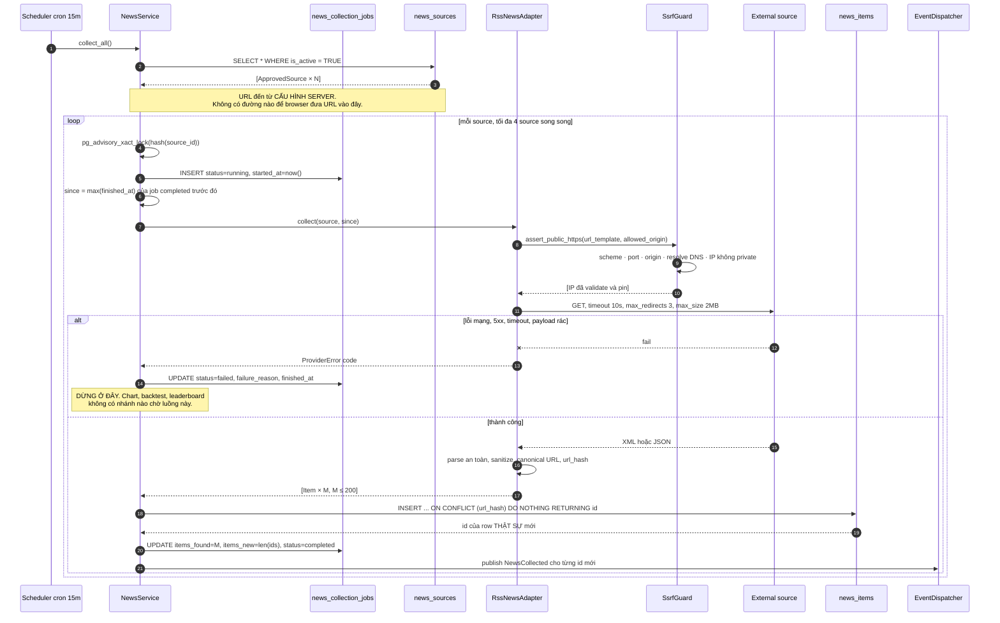

# Đặc tả: News Collection (Nguồn tin, SSRF Guard, De-dup)

## Mô tả

Module duy nhất trong hệ thống được phép mở kết nối HTTP ra một địa chỉ **không phải Binance**. Trách nhiệm:

- Đọc danh sách nguồn đã phê duyệt từ `news_sources` (**cấu hình server**), fetch, chuẩn hoá thành `Item`.
- De-dup theo `url_hash` — một bài được 3 nguồn đăng lại 5 lần vẫn chỉ có 1 row trong `news_items`.
- Ghi vết mỗi lần chạy vào `news_collection_jobs`, để một job fail là **sự kiện quan sát được**, không phải một khoảng lặng.
- Publish `NewsCollected`. Hết. Module này **không biết sentiment tồn tại**.

Vì input đến từ Internet, đây là bề mặt tấn công lớn nhất của hệ thống — lớn hơn cả API công khai, bởi API công khai chỉ nhận JSON có schema, còn ở đây ta nhận XML/HTML do người khác viết. Hai lớp rủi ro tách biệt: **SSRF** (server bị dùng làm proxy đọc mạng nội bộ) và **injection nội dung** (HTML nhúng script chảy tới browser). Không lớp nào xử lý được bằng "cẩn thận khi code"; cả hai cần rào chắn cấu trúc, và đó là phần lớn nội dung file này (`proposal.md` R8, R9).

Đặc tả này cố ý **không** nhắc tới model, nhãn, hay điểm sentiment. Nếu một dòng nào ở đây phải nói tới BERT thì ranh giới đã bị vi phạm — đó chính là anti-pattern §44 *"Crawler phụ thuộc chặt vào ML"* (`design.md` §9.5). Ranh giới này được kiểm chứng bằng test static, không bằng thiện chí của người viết code.

Đặc biệt phải đảm bảo:

- **Không bao giờ** có URL do client cung cấp đi vào một outbound request. User chỉ chọn `source_id`.
- Origin và IP đích được validate **trước fetch, sau khi resolve DNS, và sau mỗi redirect** — 3 điểm, không phải 1.
- `news_items` không có row trùng dù collect chạy chồng lấp bao nhiêu lần: `url_hash UNIQUE` là cơ chế duy nhất.
- News provider chết → **chart realtime và backtest technical không bị ảnh hưởng 0%** (`design.md` §1.5, §11.5).
- Không có HTML thô nào được lưu ở dạng có thể render thành script.
- `server/internal/infrastructure/news` không import Python model internals hoặc Go strategy domain.

## Contract

```go
type NewsProvider interface {
	Collect(context.Context, ApprovedSource, time.Time) ([]Item, error)
}
```

```go
type ApprovedSource struct {
	ID int
	SourceKey, DisplayName, Kind string
	AllowedOrigin, URLTemplate string
	IsActive bool
}

type Item struct {
	SourceID int
	URL, URLHash, Title string
	Content *string
	PublishedAt time.Time
	RelatedCoins []string
}
```

> **`ApprovedSource` không có field nào nhận từ HTTP request.** Nó được `NewsService` dựng từ một row `news_sources`. Đây không phải chi tiết implementation — đó là **contract chống SSRF**: nếu dataclass này có thêm field `url: str` do caller truyền vào, toàn bộ phần "Bảo mật" bên dưới trở nên vô nghĩa.

Event publish ra (`design.md` §5.6, envelope chung):

```json
{
  "event_type": "NewsCollected",
  "schema_version": 1,
  "aggregate_type": "news_item",
  "aggregate_id": "0f1c…",
  "correlation_id": "job_01JB2X9K7M4NQZ",
  "payload": { "news_item_id": "0f1c…", "source_key": "coindesk_rss", "title_hash": "9ab3…" }
}
```

Payload **không chứa `content`**. Lý do: consumer đọc lại từ DB bằng `news_item_id`; nhồi 20 KB text vào event làm `domain_events` phình và làm payload trở thành nguồn sự thật thứ hai (lệch với DB sau khi retention xoá `content`).

## Luồng chính

### A. Scheduler → collect_all()



> **`items_new` đếm bằng `RETURNING id`, không bằng `M − số conflict`.** Với `ON CONFLICT DO NOTHING`, row bị bỏ qua **không** xuất hiện trong `RETURNING`. Đây là cách duy nhất đếm đúng khi hai job chạy song song trên hai nguồn cùng đăng lại một bài: cả hai INSERT cùng `url_hash`, chỉ một cái nhận id, và `NewsCollected` chỉ được publish một lần.

### B. SSRF Guard — ba điểm kiểm tra

Nguy cơ cụ thể, không phải lý thuyết: nếu API có `POST /news/collect?url=...` thì attacker gửi `url=http://169.254.169.254/latest/meta-data/` (cloud metadata, đọc được IAM credential trên nhiều môi trường) hoặc `url=http://localhost:5432` (port scan nội bộ) và dùng server làm proxy. Phòng thủ đầu tiên và mạnh nhất là **không có endpoint nào nhận URL**. Các lớp dưới đây là phòng thủ cho trường hợp `news_sources` bị cấu hình sai hoặc nguồn hợp lệ bị chiếm.

```go
var blockedNets = loadBlockedNetworks()

func AssertPublicHTTPS(rawURL, allowedOrigin string) ([]net.IP, error) {
	// Validate scheme/port/origin, resolve DNS, reject private IPs, pin the
	// approved addresses, and repeat the same check after every redirect.
	return resolveAndPinPublicHTTPS(rawURL, allowedOrigin, blockedNets)
}
```

Ba điểm gọi:

1. **Trước fetch** — trên `url_template` của source.
2. **Sau khi resolve DNS, trước khi connect** — và connect tới **IP đã pin** với `Host`/SNI giữ nguyên hostname. Đây là chỗ chặn **DNS rebinding**: nếu chỉ validate rồi để HTTP client tự resolve lại, lần resolve thứ hai có thể trả `127.0.0.1` (TTL = 0). Khoảng giữa "check" và "connect" là một TOCTOU thật, và pin IP là cách duy nhất đóng nó lại.
3. **Sau mỗi redirect** — `allow_redirects=False`, tự vòng lặp tối đa 3 lần, mỗi vòng gọi lại `assert_public_https` với **cùng** `allowed_origin`. Redirect `301 → http://10.0.0.5/` là kỹ thuật bypass phổ biến nhất khi chỉ validate URL ban đầu.

Giới hạn transport, tất cả đều là con số cứng ở adapter:

| Kiểm soát           | Giá trị                                     | Vì sao                                                       |
| ------------------- | ------------------------------------------- | ------------------------------------------------------------ |
| Scheme              | chỉ `https`                                 | `http` cho phép MITM sửa nội dung; `file://`, `gopher://` là SSRF cổ điển |
| Port                | chỉ 443                                     | Port tuỳ ý biến adapter thành port scanner nội bộ            |
| `max_redirects`     | 3                                           | Đủ cho redirect hợp lệ; chặn redirect loop                   |
| Connect / read timeout | 3 s / 10 s (tổng ≤ 10 s)                 | Không để một nguồn treo giữ slot của job                     |
| `max_response_size` | 2 MB, cắt **theo stream**                   | Đọc hết rồi mới kiểm tra là đã OOM trước khi kiểm tra        |
| Content-Type        | `application/*xml`, `text/xml`, `application/json`, `text/html` | Nguồn trả `application/octet-stream` là dấu hiệu sai nguồn |
| Số item mỗi lần     | 200                                         | Một feed lỗi trả 50.000 entry không được biến thành 50.000 INSERT |

### C. Parse an toàn và chuẩn hoá

Parse chạy trong **Go Worker** (worker workload của Go Strategy Service), không trong process Go API phục vụ HTTP. Lý do: parser XML là code phức tạp xử lý input không tin cậy, và nếu nó ăn hết CPU hoặc chết thì không được kéo theo API. Python chỉ giữ vai trò AI sentiment adapter.

```go
// encoding/xml is used with a bounded reader; DTD/external entities are not
// resolved. Oversize or malformed input is rejected before persistence.
decoder := xml.NewDecoder(io.LimitReader(body, 2<<20))
items, err := parseFeed(decoder)
```

Chuẩn hoá URL trước khi hash — đây là điều kiện để de-dup thật sự hoạt động:

```go
func CanonicalURL(raw string) (string, error) {
	// Normalize host/path/query, remove tracking parameters and fragment,
	// require https, then hash the canonical string for url_hash.
	return normalizeNewsURL(raw)
}
urlHash := sha256.Sum256([]byte(canonicalURL))
```

Không chuẩn hoá thì cùng một bài với `?utm_source=twitter` và `?utm_source=rss` là **hai** row, và trang News hiện bài trùng — lỗi im lặng, không có exception nào.

Sanitize nội dung, thứ tự bắt buộc:

1. Strip toàn bộ tag, giữ text (`bleach.clean(strip=True)` với allowlist **rỗng**).
2. Unescape entity **một lần duy nhất**, rồi kiểm tra lại — `&lt;script&gt;` unescape hai lần sẽ ra tag thật.
3. Chuẩn hoá Unicode NFC, bỏ ký tự điều khiển, gộp whitespace.
4. Cắt `title` ≤ 512 ký tự, `content` ≤ 20.000 ký tự.

Kết quả lưu vào DB là **plain text**. Frontend render bằng text node, không `dangerouslySetInnerHTML` — hai lớp, vì một lớp sẽ bị phá bởi một PR "tạm thời cho hiện đẹp hơn".

### D. Gán `related_coins` — bằng quy tắc, không bằng ML

```go
var coinAliases = map[string][]string{
	"BTC": {"bitcoin", "btc", "xbt"},
	"ETH": {"ethereum", "eth", "ether"},
}
// Seed aliases from market_pairs; matching is bounded keyword matching only.
```

Matching là keyword khớp trên `title + content` đã lowercase, word-boundary. Cố ý **không** dùng NER hay model nào: nếu `NewsCollector` cần một model để gán coin, nó lại phụ thuộc ML và ranh giới ở §9.5 mất. Đánh đổi: keyword matching bỏ sót ("the largest cryptocurrency" không khớp `BTC`) và đôi khi khớp sai ("Bitcoin Cash" khớp cả `BTC`). Chấp nhận, vì `related_coins` chỉ dùng để **lọc hiển thị và tính aggregate**, không dùng để đặt lệnh, và có thể cải thiện bằng cách sửa seed — không cần đổi kiến trúc.

### E. Quản lý `news_sources` — chỉ ADMIN

`POST /api/v1/admin/news-sources` là route **ADMIN-only** (`design.md` §7.3). Không phải vì nội dung tin tức nhạy cảm, mà vì **thêm một source = thêm một origin vào allowlist egress của server**. Đó là quyết định bảo mật cùng loại với sửa firewall rule, không phải cấu hình nội dung. Nếu OPERATOR (hoặc tệ hơn, RESEARCHER) thêm được source, thì họ vừa được cấp quyền chọn địa chỉ mà server sẽ đi tới — đúng thứ mà toàn bộ SSRF Guard đang cố ngăn.

Validate lúc INSERT: `allowed_origin` phải khớp `^https://[a-z0-9.-]+$` (không path, không port, không userinfo), `url_template` phải có origin **bằng đúng** `allowed_origin`, và phải qua `assert_public_https` **ngay tại thời điểm INSERT** — nguồn nào không validate được thì không lưu.

### F. Đọc dữ liệu — `GET /api/v1/news`

```json
{
  "items": [
    { "id": "0f1c…", "title": "…", "url": "https://…", "published_at": "2026-08-11T08:40:00Z",
      "source": { "key": "coindesk_rss", "display_name": "CoinDesk" },
      "related_coins": ["BTC"],
      "sentiment": { "label": "POSITIVE", "score": 0.82,
                     "model": "sentiment-v1", "model_version": "2026-08-01",
                     "analyzed_at": "2026-08-11T08:41:03Z" } },
    { "id": "7b20…", "title": "…", "related_coins": [], "sentiment": null }
  ],
  "meta": { "total": 240, "page": 1, "limit": 50, "last_collected_at": "2026-08-11T08:45:00Z" }
}
```

`sentiment: null` là **giá trị hợp lệ và có nghĩa**: "hệ thống không có nhãn cho bài này". UI hiện `unavailable`. Đây là ADR-013 nhìn từ phía API; lý do đầy đủ ở `specs/sentiment.md`. LEFT JOIN sang `sentiment_results`, không INNER JOIN — INNER JOIN sẽ làm bài chưa phân tích **biến mất** khỏi danh sách, một cách âm thầm.

`last_collected_at` luôn được trả, kể cả khi collect đang fail. Người dùng thấy "dữ liệu cũ 3 giờ" tốt hơn nhiều so với thấy một danh sách trông như bình thường.

## Kịch bản lỗi

| Tình huống                                                       | Phản ứng                                                                                                     |
| ---------------------------------------------------------------- | ------------------------------------------------------------------------------------------------------------ |
| Source trả `500` / `503`                                         | `ProviderError`; job `status='failed'`, `failure_reason='upstream_5xx'`; retry ở cron 15 phút sau. Chart/backtest không đổi |
| Source timeout > 10 s                                            | Hủy request, `failure_reason='timeout'`. **Không** retry trong cùng lần chạy (tránh nhân đôi tải lên nguồn đang yếu) |
| Redirect trỏ tới `http://10.0.0.5/`                              | `SsrfBlocked('private_ip')` ở vòng redirect; job `failed`; log WARN kèm `source_key` + IP, **không** kèm body |
| DNS rebinding: resolve lần 1 công khai, lần 2 trả `127.0.0.1`    | Không xảy ra — connect tới **IP đã pin** ở lần resolve đã validate, không resolve lại                        |
| Source hợp lệ nhưng DNS trả cả IPv4 công khai và IPv6 `fc00::/7` | Reject **toàn bộ** source (một IP xấu trong tập trả về là đủ). Bảo thủ hơn "chọn IP tốt" vì client có thể chọn khác |
| Response 50 MB                                                   | Cắt theo stream ở 2 MB, `failure_reason='response_too_large'`. Không bao giờ đọc hết vào RAM trước khi kiểm tra |
| Nguồn trả HTML lỗi thay vì RSS                                   | Parse fail → `failure_reason='parse_error'`; `items_found=0`; **không** ghi row rác vào `news_items`          |
| XML có DTD / entity đệ quy (billion laughs)                      | `defusedxml` raise ngay; CPU không bị đốt; job `failed`                                                       |
| Cùng bài, hai nguồn, khác tracking param                         | `canonical_url` bỏ `utm_*`/`fbclid`/`gclid`/`ref` → cùng `url_hash` → 1 row, `items_new=0` ở nguồn thứ hai    |
| Hai job song song INSERT cùng `url_hash`                         | `UNIQUE (url_hash)` + `ON CONFLICT DO NOTHING`; chỉ một job nhận `RETURNING id` → `NewsCollected` publish **1 lần** |
| Hai instance scheduler cùng cron                                 | `pg_advisory_xact_lock(hash(source_id))`; instance thứ hai bỏ qua source đó, log DEBUG, **không** lỗi         |
| Worker chết giữa lúc job `running`                               | Sweeper (cron 5 phút) set `status='failed'`, `failure_reason='lease_expired'` cho job `running` > 10 phút. Không có job treo mãi |
| Item thiếu `published_at`                                        | Dùng `crawled_at`, log WARN. **Không** reject — cột `NOT NULL` nhưng thiếu ngày không phải lý do bỏ tin       |
| `published_at` ở tương lai > 5 phút                              | Clamp về `now()`, log WARN (clock skew của nguồn). Nếu không clamp, tin đó lọt vào mọi window sentiment sai thời điểm |
| `title` rỗng sau sanitize                                        | Bỏ item, `items_found` vẫn đếm, log DEBUG. `CHECK (char_length(title) > 0)` là lớp phòng thủ thứ hai          |
| `title` chứa `<script>alert(1)</script>`                         | Sanitize thành text; DB lưu plain text; FE render bằng text node → **hai lớp** chặn XSS                       |
| Nguồn trả `429` kèm `Retry-After: 600`                           | Job `failed` với `failure_reason='rate_limited'`; bỏ qua source đó tới khi hết `Retry-After`                   |
| ADMIN nhập `allowed_origin` sai chính tả (`htps://…`)            | Regex reject lúc INSERT → `422`. Nguồn sai không bao giờ tồn tại trong DB                                     |
| Một source fail 8 lần liên tiếp                                  | **Không** tự set `is_active=false` — đó là thay đổi cấu hình, chỉ ADMIN làm. Thay vào đó `news_jobs_failed_total{source}` bật alert |
| Retention xoá `content` sau 90 ngày                              | `title` + `url_hash` giữ lại; API trả `content: null`. Aggregate sentiment cũ vẫn đúng vì nó đọc `sentiment_results`, không đọc `content` |

## Ràng buộc

**Tính đúng đắn**

- `UNIQUE (url_hash)` là cơ chế de-dup **duy nhất**. Không có logic "SELECT rồi INSERT" nào — đó là race.
- `url_hash = sha256(canonical_url)`, canonical hoá deterministic: lowercase host, bỏ fragment, bỏ trailing slash, sort query, loại tracking param.
- Mọi timestamp là UTC `TIMESTAMPTZ`. Không có `datetime` naive ở bất kỳ đâu.
- `since` suy ra từ `max(finished_at) WHERE status='completed'` của chính source đó — không thêm cột state vào `news_sources` (một nguồn sự thật, và nó đã có audit trail).
- Item được xử lý bằng UPSERT theo `url_hash` nên chạy lại toàn bộ collect là **idempotent**.

**Hiệu năng**

- `collect_all()` với 5 nguồn: p95 **< 20 s**, ngân sách cứng **120 s** thì hủy phần còn lại.
- Mỗi nguồn: ≤ 4 nguồn song song, mỗi nguồn 1 request đang bay (không parallel trong cùng nguồn — lịch sự với nhà cung cấp và tránh tự gây `429`).
- INSERT theo batch `execute_values`, tối đa 200 item/batch; không loop từng row.
- `GET /api/v1/news` p95 **< 250 ms** cho 50 item (index `idx_news_time`, LEFT JOIN `sentiment_results`).
- `GET /api/v1/news?coin=BTC` dùng `idx_news_coins` (GIN) — `'BTC' = ANY(related_coins)`, không `LIKE '%BTC%'`.

**Bảo mật**

- 0 endpoint nào nhận URL, host, IP, hay port từ client. Chỉ `source_id` (SMALLINT, đối chiếu `news_sources`).
- Validate tại **3** điểm: trước fetch, sau resolve DNS (kèm pin IP), sau **mỗi** redirect (≤ 3).
- Chặn: non-HTTPS, port ≠ 443, loopback, private (10/8, 172.16/12, 192.168/16), link-local (169.254/16), CGNAT, reserved, và IPv6 tương đương (`::1`, `fc00::/7`, `fe80::/10`, `::ffff:0:0/96`).
- `POST /api/v1/admin/news-sources` chỉ ADMIN — thêm source là thay đổi allowlist egress.
- Không lưu HTML thô có thể render. Sanitize ở biên adapter, không ở tầng render.
- Error envelope: `{"error":{"code":"news_source_unavailable","message":"…","request_id":"req_…"}}`. **Không** forward raw body của nguồn, không trả IP nội bộ, không trả stack trace (`design.md` §5.5).
- Parse chạy trong worker, không trong process phục vụ HTTP.

**Khả năng mở rộng**

- Thêm nguồn RSS = **1 row** `news_sources`, 0 dòng code.
- Thêm loại nguồn mới (GraphQL, Atom) = 1 class implement `NewsProvider` + 1 giá trị `kind`. `NewsService`, API contract, frontend: 0 dòng đổi.
- `SsrfGuard` dùng chung cho mọi adapter — thêm adapter **không** thêm chỗ để quên validate.

**Quan sát được**

- `news_items_collected_total{source}` · `news_jobs_failed_total{source,reason}` counter
- `news_collect_duration_seconds{source}` histogram
- `news_last_success_age_seconds{source}` gauge — signal trả lời "dữ liệu có đang cũ không"
- `news_ssrf_blocked_total{reason}` counter — bất kỳ giá trị > 0 đều đáng điều tra
- `news_items_rejected_total{reason}` counter (`empty_title`, `parse_error`, `too_large`)
- Log structured JSON kèm `correlation_id = job_id`, trường `source_key`, `failure_reason`; **không** log body của nguồn.

## Tiêu chí chấp nhận

- [ ] AC-01: Grep toàn repo — **0** chỗ nào lấy URL/host/port từ HTTP request rồi đưa vào outbound client. Chỉ `source_id` đi qua boundary.
- [ ] AC-02: Fixture source có `url_template = 'https://evil.test/'` mà DNS trả `169.254.169.254` → `SsrfBlocked('private_ip')`, `news_items` 0 row mới, `news_ssrf_blocked_total` tăng 1.
- [ ] AC-03: Fixture trả `301 → http://127.0.0.1:5432/` → bị chặn ở vòng redirect; **không** có TCP connection nào tới 127.0.0.1 (assert bằng log/socket mock).
- [ ] AC-04: Fixture DNS trả IP công khai ở lần resolve 1 và `127.0.0.1` ở lần 2 → request vẫn đi tới IP lần 1 (IP pinning), không tới localhost.
- [ ] AC-05: Chạy `collect_all()` **3 lần liên tiếp** trên cùng feed → số row `news_items` không đổi sau lần đầu; `items_new = 0` ở lần 2 và 3.
- [ ] AC-06: Feed trả cùng bài với `?utm_source=a` và `?utm_source=b` → đúng **1** row trong `news_items`.
- [ ] AC-07: Feed 50 MB → request bị cắt ở 2 MB, `failure_reason='response_too_large'`, memory RSS của worker tăng **< 50 MB**.
- [ ] AC-08: Feed chứa XML billion-laughs → job `failed` trong **< 2 s**, CPU worker không vượt 1 core-second.
- [ ] AC-09: Feed có item `title = '<script>alert(1)</script>'` → DB lưu plain text không có `<`; render trang News không thực thi script (E2E Playwright assert không có dialog).
- [ ] AC-10: `docker stop` nguồn (hoặc block egress) → `news_collection_jobs.status='failed'` có `failure_reason`; đồng thời `GET /markets/candles` và `POST /experiments` (technical-only) vẫn `200`/`202` — **demo S8**.
- [ ] AC-11: Hai worker chạy `collect_all()` đồng thời → mỗi source chỉ 1 job `running` (advisory lock), 0 row trùng, mỗi `news_item` mới sinh đúng **1** event `NewsCollected`.
- [ ] AC-12: Kill worker giữa lúc job `running` → sau ≤ 10 phút sweeper set `failed` với `failure_reason='lease_expired'`; lần collect sau chạy bình thường.
- [ ] AC-13: `server/tests/architecture/module_boundaries_test.go` assert news infrastructure **không** import Python model internals hoặc Go strategy domain — fail build nếu vi phạm (`design.md` §9.1, §9.5).
- [ ] AC-14: RESEARCHER gọi `POST /api/v1/admin/news-sources` → `403`; ADMIN gọi với `allowed_origin='htps://x'` → `422`; ADMIN gọi với origin hợp lệ nhưng resolve ra IP private → `422`, không lưu row.

## Target additions (unified blueprint)

Các điểm dưới đây là yêu cầu đích của bộ sơ đồ thống nhất (`assets/diagrams/` 13; `design.md` §12.4) — owner là **Python platform** (`research`), không phải Go:

- **Owner**: news collection/extraction/tagging thuộc Python platform (migrate từ Go theo ADR-011 mới); `news_sources`/`news_items`/`sentiment_results`/`news_collection_jobs` do Python sở hữu write + migration (`design.md` §1.2.4).
- **Article HTML extraction**: ngoài RSS, source dạng "approved article URL" được fetch bằng Safe HTML Fetcher (HTTPS + DNS/IP + redirect + size guard như SSRF rules ở trên), sanitize + readability extract ra canonical text; lưu `content_hash`, raw HTML lớn tách sang object storage tuỳ chọn.
- **LLM tagging có version**: gán nhãn structured (coin/entity/topic/event) qua LLM; mọi batch tag ghi kèm `tagger_model` + `prompt_version` và lưu DB để tái sử dụng.
- **Content-hash cache**: tagging chỉ chạy lại khi `content_hash`, model hoặc prompt version thay đổi; tag đã lưu được tái sử dụng giữa các lần collect.
