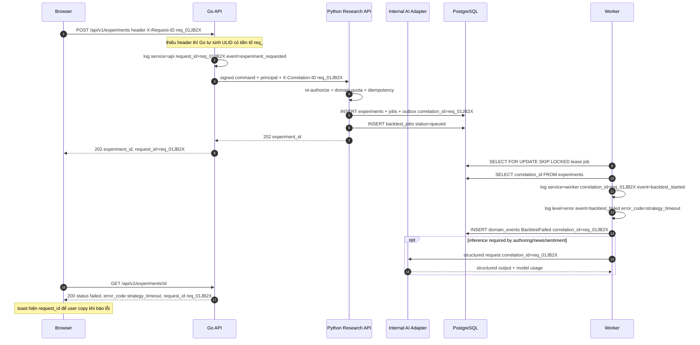
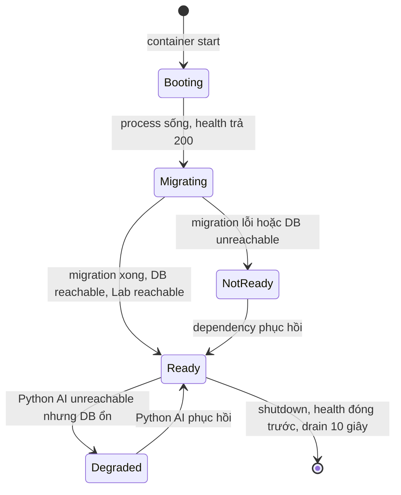

# Đặc tả: Observability (Metrics, Structured Log, Correlation ID, Health)

## Mô tả

Observability ở dự án này **không** phải "cài Prometheus rồi tính sau". Đề bài §32.7 nêu năm câu hỏi rất cụ thể — *Loop đang chạy hay dừng? Đã thử bao nhiêu strategy? Backtest mất bao lâu? Có bao nhiêu job lỗi? Strategy nào đang Top 1?* — nên module này được thiết kế ngược từ câu hỏi: **mỗi câu có đúng một signal trả lời trực tiếp**, không phải suy ra từ ba dashboard.

Phạm vi gồm bốn nhánh. (1) **Metrics**: Prometheus text format từ Go API/Market, Python Research API/Worker và internal AI Adapter; chỉ `OPERATOR`/`ADMIN` đọc qua public Go boundary. (2) **Structured log**: JSON một dòng với field chung xuyên các workload. (3) **Correlation ID**: một ID đi xuyên browser -> Go -> Python API/Worker -> tool/model/sandbox -> outbox -> Go -> UI. (4) **Health**: `/health` liveness tách `/ready` readiness, cộng UI Progress panel. Agent state/tool/model/sandbox metrics được bổ sung theo `agent-architecture.md`.

Điểm cần nói rõ: hệ thống có **3 code artifact** (`web/`, `server/` Go, `ai/` Python) nhưng **4 loại runtime workload** — API và worker dùng chung image Go nhưng chạy process riêng; `ai/` chỉ làm inference sentiment (`design.md` §1.3.1). Một backtest lỗi có thể bắt nguồn từ HTTP request 40 phút trước đó, được thực thi bởi một worker khác process. Không có correlation ID xuyên suốt thì việc trả lời "vì sao experiment của tôi failed" là mò kim đáy bể qua log stream — và đó là tình huống xảy ra **mỗi lần demo**.

Giới hạn phạm vi có ý thức: chỉ dùng **Prometheus + structured log**. Không có tracing collector (Jaeger/OpenTelemetry) trong blueprint này — correlation ID đã cho đủ khả năng nối chuỗi cho một hệ thống 3 service, còn một collector là thêm một deployable phải vận hành. Distributed tracing được ghi nhận là **hướng mở rộng**: field `correlation_id` đã có sẵn ở mọi log và mọi row `domain_events`, nên việc bổ sung span sau này không phải sửa lại contract.

Đặc biệt phải đảm bảo:

- Năm câu hỏi §32.7 trả lời được bằng **một** truy vấn PromQL hoặc **một** lần gọi API — không cần join tay.
- Mọi log là **JSON structured**, không có string nội suy; `error_code` là field, không phải chữ trong câu.
- **Mọi** log line trong một chuỗi xử lý mang cùng `correlation_id`; UI hiện `request_id` cho user copy.
- Label metric có **cardinality bị chặn**: không bao giờ chứa `user_id`, `experiment_id`, email, hay UUID tự do.
- `/ready` chỉ trả `200` **sau khi** migration đã chạy xong — không bao giờ nhận traffic vào một schema chưa sẵn sàng.
- Metric **không bao giờ** là nguồn sự thật: trạng thái thật của một search run luôn ở PostgreSQL; metric là bản chiếu.
- Consumer của event là **idempotent** qua `event_consumptions`; một event đến hai lần không làm sai counter nghiệp vụ.

## Contract

- Go API/Market expose `/health`, `/ready`, `/metrics`; Python Research API/Worker và AI
  Adapter expose health/metrics chỉ trên internal network. Browser không gọi Python/AI trực tiếp.
- `/health` chỉ kiểm tra process còn phản hồi; `/ready` kiểm tra DB, migration và
  dependency bắt buộc theo từng field. `/metrics` dùng Prometheus text format.
- Mọi log JSON bắt buộc có `timestamp`, `level`, `service`, `message`, `request_id`/
  `correlation_id` khi có request, và `error_code` khi lỗi; không đưa UUID/user/email
  vào metric label.
- Các signal nghiệp vụ chính là `search_run_status`, `search_candidates_total`,
  `backtest_duration_seconds`, `backtest_jobs_failed_total` và
  `leaderboard_top1_score`; PostgreSQL vẫn là nguồn sự thật, metric chỉ là projection.

## Luồng chính

### A. Năm câu hỏi §32.7 → signal trả lời

| Câu hỏi | Signal trả lời | Vì sao chọn dạng signal này |
|---|---|---|
| Loop đang chạy hay dừng? | `search_run_status{run_id}` gauge (0=queued, 1=running, 2=paused, 3=terminal) · `GET /search-runs/{id}.status` | Trạng thái là giá trị *hiện tại*, không phải tích luỹ → gauge. Counter không diễn tả được "đang paused" |
| Đã thử bao nhiêu strategy? | `search_candidates_total{run_id,outcome}` counter · `.candidates_tested` | Chỉ tăng, an toàn khi process restart (Prometheus xử lý reset). Chia theo `outcome` để biết tested ≠ thành công |
| Backtest mất bao lâu? | `backtest_duration_seconds` histogram, label `strategy_family`, `candle_count_bucket` | Trung bình vô nghĩa với phân phối lệch; cần p50/p95/p99. Histogram cho được quantile mà không lưu từng mẫu |
| Có bao nhiêu job lỗi? | `backtest_jobs_failed_total{error_code}` counter · `.candidates_failed` | `error_code` là chiều quan trọng nhất: 300 lỗi `strategy_timeout` và 300 lỗi `dataset_missing` là hai sự cố hoàn toàn khác nhau |
| Strategy nào Top 1? | `leaderboard_top1_score{dataset_version}` gauge, label `strategy_id` · `GET /leaderboard?limit=1` | Score là gauge; `strategy_id` là label nên đổi ngôi vô địch nhìn thấy được trên đồ thị |

> **Vì sao mỗi câu có cả metric *và* API?** Prometheus trả lời câu hỏi **theo thời gian** ("lỗi có tăng không") cho người vận hành. API trả lời câu hỏi **theo instance** ("run #a3f8 của tôi thế nào") cho người dùng. Dùng Prometheus cho việc thứ hai là sai công cụ: nó là time-series có sampling interval, không phải store trạng thái chính xác — và nó cũng không có ownership check.

### B. Correlation ID xuyên các workload



> **Vì sao worker phải *đọc* `correlation_id` từ `experiments` chứ không nhận qua tham số job?** Worker lease job từ bảng `backtest_jobs`; giữa lúc tạo job và lúc lease có thể cách nhau nhiều giờ và một lần restart. Correlation ID phải **được persist cùng aggregate**, không nằm trong RAM hay trong một header đã biến mất từ lâu. Đây là lý do `domain_events.correlation_id` là một cột thật có index (`design.md` §4.2).

> **Chi tiết dễ bỏ sót: tên header đổi giữa hai chặng.** Browser gửi `X-Request-ID`; Go chuyển tiếp sang Python bằng `X-Correlation-ID`. Chủ ý: `X-Request-ID` là *của request công khai*, `X-Correlation-ID` là *của chuỗi xử lý nội bộ*. Nếu dùng cùng một tên, Python không phân biệt được "tôi được Go gọi trong chuỗi X" với "có ai đó gọi trực tiếp tôi và tự đặt id" — trong khi đó lại chính là kịch bản cần phát hiện (`specs/auth.md`, Luồng F).

### C. Cấu trúc log bắt buộc

```json
{
  "level": "error",
  "ts": "2026-08-11T09:14:22.481Z",
  "service": "worker",
  "correlation_id": "req_01JB2X9K7M4NQZ",
  "experiment_id": "…",
  "search_run_id": "…",
  "strategy": "rsi@1.0.0",
  "event": "backtest_failed",
  "error_code": "strategy_timeout",
  "duration_ms": 30012
}
```

| Field | Bắt buộc | Ghi chú |
|---|---|---|
| `level` | luôn | `debug`/`info`/`warn`/`error` |
| `ts` | luôn | RFC3339 UTC, millisecond |
| `service` | luôn | `api` · `lab` · `worker` — cùng image nhưng khác entrypoint, phải phân biệt được |
| `event` | luôn | **snake_case ổn định**, là "khoá chính" của log line |
| `correlation_id` | khi có request context | Job định kỳ (news collector) tự sinh id riêng có tiền tố `cron_` |
| `error_code` | khi `level=error` | Thuộc tập enum đóng, khớp label `jobs_failed_total{error_code}` |
| `duration_ms` | với mọi operation có thời lượng | Số nguyên, không phải chuỗi "30s" |

> **Vì sao JSON structured, không string nội suy?** `error_code` phải **query được** để tính `jobs_failed_total{error_code}`. Với log dạng `f"backtest failed: {e}"`, metric đó phải parse regex — và sẽ vỡ im lặng đúng ngày ai đó đổi câu chữ hoặc dịch thông điệp. Đánh đổi: log JSON khó đọc bằng mắt hơn; bù lại `jq 'select(.correlation_id=="req_…")'` cho ngay toàn chuỗi, việc mà `grep` trên log text không làm nổi.

> **`event` là contract, không phải văn xuôi.** Đổi `backtest_failed` thành `backtest_error` phá vỡ mọi truy vấn và alert đang dùng nó. Danh sách `event` được version cùng `schema_version` của `domain_events` (`design.md` §5.6).

### D. Metric theo nhóm và quy tắc label

| Nhóm | Metric |
|---|---|
| HTTP | `http_requests_total{route,status}`, `http_request_duration_seconds{route}` |
| WebSocket | `ws_connections_active`, `ws_subscriptions_active{symbol,timeframe}`, `ws_frames_sent_total` |
| Market feed | `market_stream_stale{symbol,timeframe}`, `market_reconnects_total`, `market_last_closed_age_seconds`, `market_backfill_candles_total` |
| Provider | `provider_requests_total{provider,operation,status}`, `provider_weight_used`, `provider_latency_seconds` |
| Job queue | `jobs_queued`, `jobs_leased`, `jobs_completed_total`, `jobs_failed_total{error_code}`, `job_queue_wait_seconds` |
| Backtest | `backtest_duration_seconds`, `backtest_candles_read`, `backtest_signals_generated` |
| Search | `search_runs_active`, `search_candidates_total{outcome}`, `search_best_score`, `search_dedup_hits_total` |
| Evaluation/Rank | `evaluations_total`, `leaderboard_updates_total`, `leaderboard_top1_score` |
| News/Sentiment | `news_items_collected_total{source}`, `news_jobs_failed_total{source}`, `sentiment_analyzed_total{model_version}`, `sentiment_unavailable_total` |
| Strategy plugin | `strategy_analyze_errors_total{strategy_id,version}`, `strategy_timeout_total{strategy_id}` |

Quy tắc label, **cứng**:

- `route` là **pattern** (`/api/v1/experiments/{id}`), không phải path thật. Path thật chứa UUID → mỗi experiment sinh một time-series mới.
- **Không** đưa `user_id`, email, `experiment_id` vào label. Vừa là PII, vừa là cardinality explosion.
- `run_id` **được phép** ở `search_run_status` và `search_candidates_total` vì số run đồng thời bị chặn bởi quota (`max_concurrent_runs=2`/user), và series của run terminal bị **xoá khỏi registry** sau 15 phút.
- `candle_count_bucket` là nhóm rời rạc (`<1k`, `1k-5k`, `5k-20k`), không phải số nến thật.
- Bucket của `backtest_duration_seconds`: `0.5, 1, 2, 5, 10, 20, 40, 80, 160` giây — bao quanh giá trị kỳ vọng ~40 s cho 20.000 nến, có bucket ở cả hai phía để phát hiện cả hồi quy và tăng tốc bất thường.

> **Vì sao cardinality là vấn đề *kiến trúc*, không phải chi tiết vận hành?** Prometheus giữ mỗi combination label là một time-series trong RAM. `route` chứa UUID với 10.000 experiment = 10.000 series cho *một* metric. Đó là cách một hệ thống observability tự giết chính process nó đang theo dõi — nghịch lý: công cụ để phát hiện sự cố trở thành nguyên nhân sự cố.

### E. Health check: liveness tách khỏi readiness



| Endpoint | Kiểm tra gì | Fail thì sao |
|---|---|---|
| `GET /health` | Chỉ *process còn sống và còn phản hồi được*. Không chạm DB | Orchestrator **restart** container |
| `GET /ready` | DB reachable + Go migration đã chạy đủ. Python AI optional, không chặn core readiness | Orchestrator **rút khỏi load balancer**, không restart |

```json
{
  "status": "not_ready",
  "checks": {
    "database": { "ok": true,  "latency_ms": 3 },
    "migration": { "ok": true, "version": "0007_add_search_actions" },
    "ai": { "ok": false, "error_code": "ai_unreachable" }
  },
  "request_id": "req_01JB2X9K7M4NQZ"
}
```

> **Vì sao tách hai endpoint?** Nếu `/health` cũng kiểm tra DB thì một lần DB restart 20 giây sẽ khiến orchestrator **kill toàn bộ** container API — biến một sự cố tạm thời của dependency thành một restart storm. Liveness phải trả lời "process này có cần bị khai tử không", readiness trả lời "process này có nên nhận traffic không". Trộn hai câu hỏi là nguyên nhân kinh điển của cascading failure.

> **Migration phải chạy TRƯỚC khi readiness báo healthy.** Nếu không, một instance nhận traffic khi bảng chưa tồn tại và trả `500` cho user thật. Thứ tự cứng: `health` mở ngay khi process sống (để không bị kill oan trong lúc migrate) → migration → `ready` mở.

> **Degraded ≠ not ready.** Khi Python AI down: các route public read
> (`/markets/candles`, `/leaderboard`) vẫn đọc PostgreSQL và vẫn trả `200`.
> Chỉ sentiment route trả `503 ai_unavailable`; market/strategy/backtest core
> không fake dữ liệu và không bị tắt.

### F. UI Progress panel — observability mà người dùng nhìn thấy

```text
┌─ Search Run #a3f8 ────────────────── ● RUNNING ─┐
│ Generator   random_search@1.0.0                 │
│ Dataset     binance-ethusdt-5m-20260101-0301    │
│ Stop        max_candidates=200 · max_dur=1800s  │
│                                                 │
│ Tested      127 / 200      ████████░░░░  63%    │
│ Queued      4    Running 2    Failed 3          │
│ Dedup hits  18  (bỏ qua, không backtest lại)    │
│ Elapsed     08:42   ETA ~05:01                  │
│                                                 │
│ Current     MA(50,200) + RSI(21) + SR(80)       │
│ Best        MA(20,50) + RSI(14) + SR(80)        │
│             score 84.2 · +18.2% · WR 61% · -6.1%│
│                                                 │
│         [ PAUSE ]  [ CANCEL ]                   │
└─────────────────────────────────────────────────┘
```

Panel cập nhật realtime qua event `SearchProgressUpdated` đẩy xuống WebSocket (`design.md` §5.6). Bốn con số dưới đây **không có** trong Prometheus nhưng là thứ người dùng thực sự cần:

| Con số | Trả lời câu hỏi của người dùng |
|---|---|
| `Dedup hits` | Search có đang lãng phí không? 18/145 nghĩa là generator sinh trùng 12 % — nếu con số này lên 60 % thì không gian tham số đã cạn |
| `ETA` | Còn bao lâu? Tính từ `elapsed / tested × (total − tested)`, hiện `~` để nói rõ đây là ước lượng |
| `Current` | Nó có treo không? Một candidate đứng yên 5 phút là dấu hiệu, thấy ngay không cần đọc log |
| `Best` | Đã tìm được gì? Nếu score không cải thiện sau 100 candidate thì cancel sớm là hợp lý |

> **Vì sao `ETA` là ước lượng thô, không phải mô hình dự báo?** `elapsed/tested` giả định các candidate tốn thời gian như nhau — sai, vì một composite 3 strategy chậm hơn một MA đơn. Nhưng ước lượng đúng ±30 % đã đủ cho quyết định duy nhất mà người dùng cần đưa ra: *chờ hay cancel*. Một mô hình chính xác hơn là code phải viết, phải test, phải bảo trì để cải thiện một con số không ai dùng để làm gì khác.

> **Nút PAUSE/CANCEL nằm trong panel observability, không tách riêng.** Người dùng thấy vấn đề ở đúng chỗ có công cụ xử lý vấn đề. Lệnh đi qua `POST /search-runs/{id}/actions` với `command_id` idempotent (`specs/search-loop.md`), có ownership check (`specs/auth.md`, Luồng D), và để lại vết ở `search_actions.actor_id`.

### G. `domain_events` như audit trail

`domain_events(event_id, event_type, schema_version, aggregate_type, aggregate_id, correlation_id, payload JSONB, occurred_at)` — retention **30 ngày** (`design.md` §4.4).

```sql
-- Toàn bộ chuỗi xử lý của một request, theo thứ tự thời gian.
-- Đây là câu truy vấn được dùng nhiều nhất khi debug: một dòng, ba service.
SELECT occurred_at, event_type, aggregate_type, aggregate_id,
       payload->>'error_code' AS error_code
  FROM domain_events
 WHERE correlation_id = 'req_01JB2X9K7M4NQZ'
 ORDER BY occurred_at;
```

```sql
-- Chống xử lý trùng: consumer INSERT trước khi hành động, conflict thì bỏ qua.
INSERT INTO event_consumptions (event_id, consumer)
VALUES ($1, 'ranking_service')
ON CONFLICT DO NOTHING
RETURNING event_id;   -- 0 row = đã xử lý, dừng lại
```

> **Vì sao cần cả `event_consumptions` khi đã có `UNIQUE (backtest_run_id, evaluator_version)`?** Hai lớp bảo vệ khác nhau. UNIQUE constraint chặn *kết quả* trùng; `event_consumptions` chặn *công việc* trùng — nghĩa là không tốn 40 giây CPU để rồi bị DB từ chối ở dòng cuối. Với hệ thống mà đơn vị tài nguyên là worker-second, ngăn công việc vô ích quan trọng hơn ngăn dữ liệu trùng.

> **`domain_events` không expose ra public API.** Payload chứa đủ chi tiết nội bộ để trở thành một kênh rò rỉ thông tin. Nó là công cụ debug và audit, đọc qua truy vấn trực tiếp DB, không qua route nào.

## Kịch bản lỗi

| Tình huống | Phản ứng |
|---|---|
| Browser không gửi `X-Request-ID` | Go tự sinh ULID tiền tố `req_`, dùng suốt chuỗi và trả về trong response. Không bao giờ có request thiếu correlation id |
| Client gửi `X-Request-ID` dài 10 KB hoặc chứa newline | Sanitize: giữ tối đa 64 ký tự `[A-Za-z0-9_-]`, sai định dạng thì bỏ và tự sinh. Newline trong log field là **log injection** |
| Python nhận request **không** có `X-Correlation-ID` | Tự sinh id tiền tố `orphan_`, log WARN `event=missing_correlation_id`. Đây là tín hiệu có ai gọi Lab trực tiếp, không qua Go |
| Worker lease job của experiment đã bị xoá | Log ERROR `error_code=experiment_missing`, đánh job `failed`, **không** retry. Retry một thứ không tồn tại chỉ đốt CPU |
| `search_run_status` gauge không khớp `search_runs.status` trong DB | DB là nguồn sự thật. Gauge được **reconcile** mỗi 30 giây từ DB, không chỉ cập nhật theo event — event có thể mất khi process restart |
| Process Python AI restart giữa lúc sentiment chạy | Counter về 0; Prometheus tự phát hiện counter reset nên rate() vẫn đúng. Core gauge reconcile từ DB |
| Series `search_run_status{run_id}` tích tụ sau nhiều run | Xoá series khỏi registry **15 phút** sau khi run vào trạng thái terminal. Không xoá thì cardinality tăng vĩnh viễn |
| `/metrics` bị gọi bởi `RESEARCHER` | `403 forbidden`. Metric để lộ số lượng user, tên strategy đang chạy, và pattern tải — không phải dữ liệu công khai |
| `/metrics` timeout vì registry quá lớn | Timeout 5 giây ở scrape; log WARN kèm số series. Là tín hiệu cardinality đã sai chỗ nào, cần sửa label chứ không tăng timeout |
| PostgreSQL down | `/health` vẫn `200` (process sống), `/ready` trả `503` với `database.ok=false`. Container **không** bị restart |
| Migration lỗi khi boot | `/ready` trả `503` `migration.ok=false` kèm version đang dở. Process **không** exit, để log còn đọc được; orchestrator không đưa vào LB |
| Python AI down nhưng DB ổn | `/ready` core vẫn `200`; route public read vẫn `200` từ DB; sentiment route trả `503 ai_unavailable` (ADR-013 — không fake dữ liệu) |
| Log volume tăng vọt (một strategy log mỗi nến) | Sampling: cùng `event` + cùng `correlation_id` quá 100 dòng/phút thì log 1/100 kèm `sampled: true`. Chặn một strategy lỗi làm đầy disk |
| `ETA` là `Infinity` khi `tested = 0` | Hiện `ETA —` thay vì số. Chia cho 0 hiện `NaN` trên UI là lỗi rất dễ mắc và rất dễ thấy |
| Event `BacktestCompleted` đến hai lần | `event_consumptions` chặn ở lần thứ hai; `evaluations_total` **không** tăng hai lần |
| Clock lệch giữa container → `occurred_at` lùi về quá khứ | Dùng `now()` của **PostgreSQL** cho `occurred_at`, không dùng clock của process. Một nguồn thời gian duy nhất |
| Sentiment model không phản hồi | `sentiment_unavailable_total` tăng, `news.sentiment = null` trong API. News vẫn trả về (`design.md` §11.5, §11.6) |
| Log chứa `payload` có password hoặc token | Redact theo allowlist field trước khi serialize; giá trị thay bằng `"[redacted]"`. Ràng buộc "0 secret trong log" của `specs/auth.md` |

## Ràng buộc

**Tính đúng đắn**

- Metric **không bao giờ** là nguồn sự thật. `search_runs.status` trong PostgreSQL là sự thật; gauge được reconcile từ DB mỗi **30 giây**.
- Counter chỉ tăng, không bao giờ set. Gauge được set từ trạng thái đã đọc từ DB, không tích luỹ theo delta của event.
- `occurred_at` của `domain_events` dùng `now()` của DB — một nguồn thời gian duy nhất cho ba runtime.
- `event_consumptions` với `PRIMARY KEY (event_id, consumer)` là cơ chế chống trùng duy nhất; không tự viết "check tồn tại rồi insert" (race).
- Tập `event` và tập `error_code` là enum đóng, version cùng `schema_version`.

**Hiệu năng**

- Overhead của instrumentation trên đường request nóng: **< 1 ms** p95 (counter increment là atomic add, histogram là bucket lookup).
- `/metrics` phản hồi **< 200 ms** với **≤ 5.000** series. Vượt 10.000 series → log WARN, coi là bug về label.
- Log JSON: ghi async qua buffered writer, buffer **4096** dòng; buffer đầy thì **drop log level `debug`** trước, không bao giờ block đường request.
- Truy vấn `domain_events` theo `correlation_id` dùng partial index `idx_events_correlation` → p95 **< 50 ms** trên 30 ngày dữ liệu.
- Reconcile gauge là **1** truy vấn `GROUP BY status` mỗi 30 giây, không phải 1 truy vấn/run.

**Bảo mật**

- `GET /metrics` chỉ `OPERATOR`/`ADMIN` (`design.md` §7.3). Ở prod, port metric của Python **không** publish ra host (`specs/auth.md`, Luồng F).
- **0 PII trong label**: không `user_id`, không email, không display name.
- Redact bắt buộc trước khi serialize log: `password`, `token`, `token_hash`, `cookie`, `authorization`, `secret`.
- `domain_events.payload` không chứa credential; không expose qua bất kỳ route công khai nào.
- Correlation ID từ client được sanitize trước khi vào log (chống log injection qua ký tự điều khiển).

**Quan sát được**

- Năm câu hỏi §32.7: mỗi câu **1** PromQL hoặc **1** lần gọi API.
- Mọi lỗi `5xx` có `request_id` truy được ra chuỗi log đầy đủ xuyên ba service.
- Mọi job `failed` có `error_code` thuộc enum đóng, khớp label `jobs_failed_total{error_code}`.
- `/ready` trả **chi tiết từng check**, không chỉ `ok`/`not ok` — để biết *cái gì* hỏng mà không cần đọc log.
- Hướng mở rộng đã có chỗ cắm: `correlation_id` sẵn ở mọi log và mọi event, thêm distributed tracing sau này không đổi contract.

**UX**

- Progress panel cập nhật **≤ 2 giây** một lần qua WebSocket, không polling.
- Mọi error toast hiện `request_id` kèm nút copy.
- Thông điệp lỗi cho người dùng theo `error_code` đã dịch sẵn; **không** hiện `error_code` thô trừ khi mở panel chi tiết.
- Khi feed stale, chart hiện badge `STALE` + `last_closed_at` thay vì im lặng giữ giá cũ (`specs/market-data.md`).
- `Dedup hits`, `ETA`, `Current`, `Best` luôn có mặt trong panel — bốn con số này là thứ giữ người dùng khỏi phải đoán.

## Tiêu chí chấp nhận

- [ ] AC-01: Với 5 câu hỏi §32.7, mỗi câu chứng minh được bằng **đúng một** truy vấn PromQL hoặc **một** lần gọi API, ghi trong `README` của module observability.
- [ ] AC-02: Tạo experiment với `X-Request-ID: req_TEST01` → `grep -h req_TEST01` trên log của cả 3 service trả về **≥ 4** dòng: `api`, `lab`, `worker` (started), `worker` (completed/failed).
- [ ] AC-03: Không gửi `X-Request-ID` → response header **có** `X-Request-ID` dạng `req_…`, và giá trị đó xuất hiện trong log của cả `api` và `lab`.
- [ ] AC-04: `SELECT count(*) FROM domain_events WHERE correlation_id='req_TEST01'` **≥ 3** row, với `event_type` khác nhau.
- [ ] AC-05: Mọi dòng log parse được bằng `jq -e .` — **0** dòng lỗi cú pháp; mọi dòng có đủ `level`, `ts`, `service`, `event`.
- [ ] AC-06: Mọi dòng `level=error` đều có field `error_code`, và giá trị thuộc enum đã khai báo. Test tự động fail nếu xuất hiện `error_code` lạ.
- [ ] AC-07: `curl /metrics` với role `RESEARCHER` → `403`; với `OPERATOR` → `200` và Content-Type Prometheus text format.
- [ ] AC-08: Không có label nào trong `/metrics` khớp regex UUID hay chứa `@` (email). Test static trên output thật của `/metrics`.
- [ ] AC-09: Chạy 100 request tới `/api/v1/experiments/{id}` với 100 UUID khác nhau → số series của `http_requests_total` **không tăng** (route là pattern).
- [ ] AC-10: Kill container PostgreSQL → `/health` vẫn `200`, `/ready` `503` với `database.ok=false`; container API **không** bị restart. Bật lại DB → `/ready` về `200` trong **< 15 giây**.
- [ ] AC-11: Boot với migration cố tình lỗi → `/ready` `503` `migration.ok=false`; process **vẫn sống** và log chứa version migration đang dở.
- [ ] AC-12: Kill container `ai` → `GET /markets/candles` vẫn `200` từ DB, core `POST /experiments` vẫn enqueue được, sentiment route trả `503 ai_unavailable`.
- [ ] AC-13: Chạy search run 200 candidate → panel hiện đủ `Tested`, `Queued`, `Running`, `Failed`, `Dedup hits`, `Elapsed`, `ETA`, `Current`, `Best`; `Tested` tăng đơn điệu, **không** giảm.
- [ ] AC-14: Restart Python AI giữa lúc sentiment chạy → core search state vẫn khớp DB; sentiment route phục hồi hoặc trả `503` rõ ràng.
- [ ] AC-15: Publish event `BacktestCompleted` hai lần cùng `event_id` → `evaluations_total` tăng đúng **1**, và `event_consumptions` có đúng **1** row.
- [ ] AC-16: Search run kết thúc, chờ 16 phút → series `search_run_status{run_id}` **không còn** trong `/metrics`.
- [ ] AC-17: Log 10.000 dòng cùng `event` trong 1 phút → số dòng thực ghi **≤ 200**, có dòng mang `sampled: true`; đường request không bị chậm quá 1 ms p95.
- [ ] AC-18: `grep -riE "password|token_hash|authorization: " logs/` → **0** dòng chứa giá trị thật; chỉ thấy `"[redacted]"`.

## Target additions (unified blueprint)

- **Event delivery dedup/order/dead-letter**: consumer idempotent theo `event_id`; ordering chỉ hứa theo aggregate sequence; event retry hết lượt vào dead-letter có quan sát được, không âm thầm drop (sơ đồ 07, 08; `design.md` §12.4 invariants 7–8).
- **Scale gate**: tuyên bố "100.000 backtest" chỉ được công bố khi có benchmark/metric chứng minh (design §12.4 invariant 10; sơ đồ 15); gate gồm throughput worker, queue depth, age-of-oldest-job.
- **Agent/tool/model/sandbox metrics**: `agent_runs_total`, `agent_state_duration_seconds`,
  `agent_tool_calls_total`, `agent_tool_latency_seconds`, `agent_model_calls_total`,
  `agent_model_tokens_total`, `agent_repair_attempts_total`, `sandbox_runs_total`,
  `sandbox_resource_usage` và `strategy_publish_conflicts_total` theo
  `specs/agent-architecture.md`. Không dùng principal/draft/run ID làm Prometheus label.
- **Agent alerts**: stuck state quá deadline, repeated policy violation, sandbox isolation
  signal, model/tool failure spike, publish conflict và Python outbox backlog.
