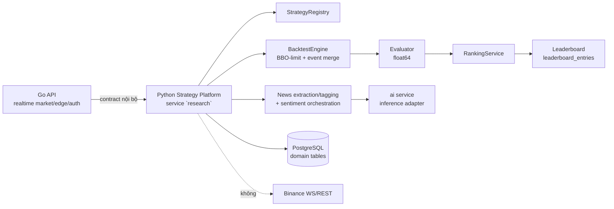

# Đặc tả: Python Strategy Platform (canonical)

## Mô tả

Python Strategy Platform (codebase `app/` ở repo root, service `research`) là
**implementation canonical** của chuỗi strategy → backtest → evaluation → search →
ranking/leaderboard → visualization-of-results, đồng thời sở hữu **news
extraction/tagging và sentiment/AI orchestration** (gọi service `ai` để inference).
Nó **thay thế** Go cho phần domain này (đảo ngược ADR-011; quyết định **[PD]** — xem
`proposal.md` §4.4). Go giữ realtime market data (chuẩn hoá Candle/BBO, WSS
reconnect/backfill, internal stream), edge/API, auth/RBAC, quota và observability
(xem `design.md` §1.2).

Backend này mirror cấu trúc `server/internal/domain/*` **1:1**, đổi `decimal.Decimal`
thành Python `float` (IEEE 754 double / **float64**). Directory structure, file và
skeleton giữ nguyên theo Go skeleton; chỉ đổi ngôn ngữ và kiểu số.

Ba đặc điểm cốt lõi:

1. **Canonical, không phải research code.** Signal/metric do backend này sinh ra **là**
   nguồn chân lý cho `chart-overlays`, `leaderboard_entries`, `run_signals`. Không còn
   nhãn "non-canonical" hay "research-only".
2. **Separate FastAPI platform.** Leaderboard và các endpoint liên quan
   (strategies, experiments, search-runs, admin score-policies) phục vụ trên FastAPI
   riêng (service `research`, `:8001`), tách khỏi Go backend.
3. **`float64` là kiểu số canonical.** Không dùng `Decimal`/`NUMERIC(24,8)` trong
   backend này (xem R1).

## Bốn quy tắc (contract)

### R1 — Precision: `float64` là kiểu số canonical

Mọi giá, quantity, fee, PnL, metric dùng Python `float` (float64). Đây là quyết định
**[PD]** có chủ đích — không mirror `Decimal` của Go. Hệ quả: so sánh số dùng
**tolerance** (ví dụ `< 1e-8` cho indicator), không đòi byte-identical.

### R2 — Causal: no-look-ahead bằng `IndicatorView` + purity test

Strategy chỉ đọc candle/indicator tới index hiện tại qua `IndicatorView`; đọc index
tương lai → `LookAheadError` ngay. Cộng thêm **purity test** chạy trong CI: tín hiệu
tại thời điểm `t` phải độc lập với bất kỳ candle nào sau `t`. Đây là enforcement
canonical của backend này (mirror `specs/backtest.md` AC-02/AC-09).

### R3 — Execution fidelity: BBO-limit + event merge + final settlement

Backtest engine áp đầy đủ fidelity của `specs/backtest.md`: BBO-limit crossing theo
executable side, merge `(eventTime, priority, sourceSequence)` (BBO priority 0 trước
`CandleClosed` priority 1), fee/slippage theo snapshot, và final bid/ask settlement
(`open_position_at_end = last_executable_bbo`). Đây **không** còn là xấp xỉ
candle-close-only — nó là engine canonical.

### R4 — Data/network: DB riêng + dataset snapshot; không kết nối sàn

Platform được phép truy cập PostgreSQL cho các bảng domain của nó
(`experiments`, `backtest_jobs`, `backtest_runs`, `trades`, `run_signals`,
`equity_points`, `evaluations`, `score_policies`, `leaderboard_entries`,
`strategy_definitions`, `strategy_versions`, `search_*`, `news_sources`,
`news_items`, `sentiment_results`, `news_collection_jobs`) và đọc dataset snapshot
(`market_dataset_candles`/BBO replay). Platform **không** mở Binance WS/REST hay
bất kỳ kết nối sàn nào — realtime market data thuộc Go (nhận qua internal stream);
sentiment inference thuộc `ai` (gọi qua HTTP nội bộ).

## Contract

```python
class BacktestEngine(Protocol):
    def run(self, snapshot: ExperimentSnapshot, candles: list[Candle], bbo: list[BBO]) -> Result: ...
```

`Result` chứa `trades`, `signals`, `orders`, `equity_points` (float64) — mirror
`server/internal/domain/backtest/contract.go`. `ExperimentSnapshot` giữ mọi execution
assumption (initial equity, fixed notional, fee/slippage bps, fill/position policy,
risk policy) để provenance đọc lại được cùng điều kiện tạo ra một con số Leaderboard.

Các domain package mirror Go skeleton: `domain/common`, `domain/market`,
`domain/indicator`, `domain/strategy` (+ `composite`, `plugins`, `registry`),
`domain/backtest`, `domain/evaluation`, `domain/ranking`, `domain/search`,
`domain/job`, `domain/sentiment`; `ports/` (backtest, persistence, search, job);
`services/` (engine, evaluator, ranker); `infrastructure/postgres` (store).

## Luồng chính



Strategy → backtest → evaluation → ranking nằm trong một process Python, không
serialize nến qua Go↔Python boundary. Leaderboard + experiment/search endpoints được
FastAPI phục vụ, Go gọi tới qua contract nội bộ.

## Kịch bản lỗi

| Tình huống | Phản ứng |
|---|---|
| Strategy đọc index tương lai qua `IndicatorView` | `LookAheadError` ngay; run dừng |
| Purity test phát hiện tín hiệu tại `t` phụ thuộc candle sau `t` | CI fail; không merge |
| Số candle ít hơn warm-up | `422 insufficient_candles` |
| BBO không monotonic hoặc bid > ask | `422 invalid_bbo_replay` |
| Replay thiếu BBO trước mark/fill | `missing_prior_bbo`, không fallback candle close |
| Replay thiếu BBO cuối khi còn position | `missing_final_bbo`, không ghi kết quả giả |
| Strategy raise exception | `strategy_exception`; không ghi partial facts |
| `fixed_notional <= 0`, fee/slippage âm | API/DB `422`/check constraint |

## Ràng buộc

**Tính đúng đắn**

- Strategy context chỉ chứa candles/indicators tới `CandleClosed` hiện tại.
- Event ordering `(eventTime, priority, sourceSequence)`; không sort bằng map/set.
- BBO priority 0 trước candle priority 1 tại cùng timestamp.
- LIMIT crossing dùng executable side, không dùng candle close.
- End-of-sample dùng final bid/ask, không dùng candle close.
- Mọi số dùng `float64`; so sánh bằng tolerance.
- Không dùng wall clock, random không seed, hoặc shared mutable state trong engine.

**Hiệu năng**

- Vectorized NumPy/pandas cho indicator precompute và event loop.
- Bulk insert facts/equity theo batch; memory bounded theo snapshot + BBO window.

**Khả năng mở rộng**

- Thêm strategy = một file Python plugin đăng ký vào `Registry` (0 sửa core).
- Thêm fill policy = thêm implementation vào `PositionSimulator`.
- Sizing/risk policy khác là extension, phải snapshot đầy đủ.

## Tiêu chí chấp nhận

- [ ] AC-01: Cùng snapshot + hai input hashes chạy 5 lần cho cùng canonical result hash (float64, deterministic).
- [ ] AC-02: BBO cùng timestamp được apply trước CandleClosed.
- [ ] AC-03: BUY LIMIT chỉ fill khi `ask <= limit`; SELL LIMIT chỉ fill khi `bid >= limit`.
- [ ] AC-04: Fixed notional + initial equity theo snapshot; quantity dùng float64.
- [ ] AC-05: Final LONG settle tại final bid; final SHORT settle tại final ask.
- [ ] AC-06: Strategy future read bị reject; không đọc indicator ngoài causal context.
- [ ] AC-07: Fixture `sol/2026-03-04`: 29 strict MA20/MA50 signals, 15 BUY, 14 SELL, 15 settled trades.
- [ ] AC-08: Leaderboard endpoint (`GET /api/v1/leaderboard`) trên FastAPI trả đúng contract; Go không tính rank/score.
- [ ] AC-09: Không có kết nối Binance WS/REST trong `app/`; market data chỉ từ Go.
- [ ] AC-10: Directory structure mirror `server/internal/domain/*` 1:1; `float` thay cho `decimal.Decimal`.

---

Cross-reference: `design.md` §1.1, §1.2.1–§1.2.2, ADR-011 · `proposal.md` §4.4 ([PD]) ·
`specs/backtest.md` (execution fidelity), `specs/evaluation.md`, `specs/leaderboard.md`,
`specs/search-loop.md`, `specs/chart-overlay.md` AC-05, `specs/strategy-registry.md`.
