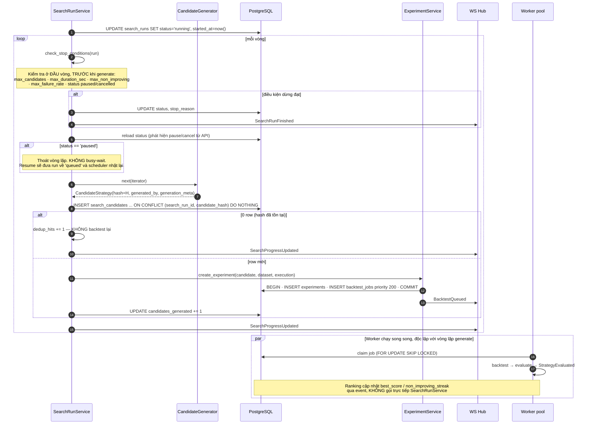
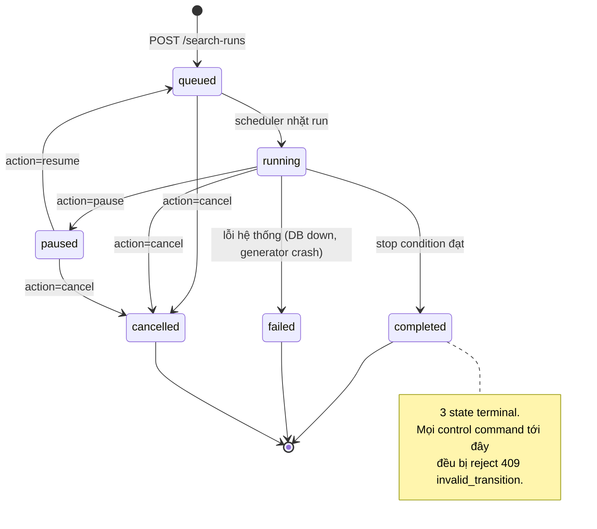

# Đặc tả: Search Loop (Continuous Strategy Loop)

## Mô tả

Đây là **vòng lặp trung tâm** của đồ án (đề bài §23, §24): sinh candidate → backtest → evaluate → rank → sinh tiếp. Nó cũng là chỗ đề bài đặt ra ràng buộc rõ nhất:

> *"Nhóm phải thiết kế Stop Condition. Không được để `while(true)` chạy vô hạn mà không kiểm soát."*

Module gồm 3 phần:

- **`CandidateGenerator` port** — sinh `CandidateStrategy` bất biến. MVP có `RandomSearchGenerator` (bắt buộc theo §16) và `DomainGuidedGenerator` (chứng minh replaceability theo §17, §42).
- **`SearchRunService`** — vòng lặp chính, kiểm tra stop condition ở **đầu** mỗi vòng, dedup candidate, tạo experiment, phát progress.
- **State machine** cho pause/resume/cancel với command idempotent.

Đề bài §24 nêu rõ vì sao phần này quan trọng với kiến trúc: một implementation kém sẽ viết `for 100000 strategies: calculate; backtest; save; update UI` trong một hàm. Tách thành Generator → Queue → Worker → Evaluator → Ranking cho phép: chạy nhiều worker, retry khi worker lỗi, pause/resume, theo dõi tiến trình, **thay search algorithm**, và scale.

Đặc biệt phải đảm bảo:

- **Không tồn tại đường code nào cho phép vòng lặp vô hạn** — ràng buộc ở 3 lớp: schema, API, runtime.
- `CandidateGenerator` **không biết** candidate sẽ được backtest thế nào; pipeline phía sau **không biết** candidate sinh ra bằng cách nào.
- Cùng một tổ hợp **không backtest 2 lần** trong cùng run.
- `pause`/`resume`/`cancel` **idempotent** — gửi lại cùng command không đổi state lần hai.
- Search run tái lập được: cùng `seed` → cùng chuỗi candidate.
- Một candidate lỗi **không** giết run.

## Contract

```python
class CandidateGenerator(Protocol):
    def generator_id(self) -> str: ...            # 'random_search' | 'domain_guided'
    def generator_version(self) -> str: ...       # '1.0.0'
    def generate(self, space: SearchSpace, limit: int,
                 seed: int | None,
                 history: SearchHistory) -> Iterator[CandidateStrategy]: ...
```

```python
@dataclass(frozen=True)
class CandidateStrategy:
    definition: CompositeSpec               # snapshot bất biến (xem specs/composite-strategy.md)
    candidate_hash: str                     # sha256(canonical_json(definition))
    generated_by: str                       # 'random_search@1.0.0'
    generation_meta: Mapping[str, Any]      # rule nào đã áp dụng


@dataclass(frozen=True)
class SearchSpace:
    strategy_ids: Sequence[str]             # ['ma_cross','rsi','bollinger','support_resistance']
    parameter_grid: Mapping[str, Mapping[str, Sequence[Any]]]
    cardinality: tuple[int, int]            # (2, 4) — số child min..max
    policies: Sequence[str]                 # ['majority_vote','weighted_vote']
    weight_options: Sequence[float] | None  # [0.2, 0.3, 0.5] cho weighted_vote


@dataclass(frozen=True)
class SearchHistory:
    """Read-only view cho generator adaptive (Genetic, Bayesian)."""
    tested_hashes: frozenset[str]
    top_k: Sequence[tuple[CompositeSpec, float]]   # (definition, score)
    best_score: float | None
    non_improving_streak: int
```

> **Vì sao `generate()` trả `Iterator` chứ không `list`.** Genetic Search cần biết kết quả thế hệ trước để sinh thế hệ sau. `Iterator` + `SearchHistory` cho phép generator giữ state qua các batch mà interface không đổi. Nếu trả `list[CandidateStrategy]` thì `GeneticGenerator` **không cắm vào được** và ADR-004 sẽ vô nghĩa đúng lúc cần nhất — khi ai đó thực sự muốn thay thuật toán. Đây là ví dụ của việc thiết kế seam phải tính tới use case tương lai cụ thể, không chỉ "thêm một interface cho có".

`generation_meta` trả lời câu hỏi §17 của đề bài (*"Domain knowledge được đưa vào quá trình search như thế nào?"*):

```json
// RandomSearchGenerator
{ "seed": 42, "attempt": 137, "rejected_duplicates": 18 }

// DomainGuidedGenerator
{ "rule": "one_of_each_family",
  "families_required": ["trend", "momentum", "structure"],
  "chosen": { "trend": "ma_cross", "momentum": "rsi", "structure": "support_resistance" },
  "rejected_reason_counts": { "same_family_twice": 24, "already_tested": 11 } }
```

Không có field này thì "domain-guided" chỉ là một cái tên — không kiểm chứng được rule nào đã thực sự áp dụng.

## Luồng chính

### A. Khởi tạo search run

1. `POST /api/v1/search-runs` với body:
   ```json
   {
     "generator_id": "random_search",
     "search_space": { "strategy_ids": ["ma_cross","rsi","bollinger","support_resistance"],
                       "cardinality": [2, 3],
                       "policies": ["weighted_vote"],
                       "parameter_grid": { "rsi": { "period": [14, 21], "buy_threshold": [25, 30] } } },
     "stop_conditions": { "max_candidates": 200, "max_duration_sec": 1800, "max_non_improving": 50 },
     "market": { "symbol": "BTCUSDT", "timeframe": "5m",
                 "range_from": "2026-01-01T00:00:00Z", "range_to": "2026-03-01T00:00:00Z" },
     "execution": { "fee_bps": 10, "slippage_bps": 5, "fill_policy": "next_candle_open" },
     "seed": 42,
     "idempotency_key": "run-2026-08-11-a3f8"
   }
   ```
2. Validate ở Go: `generator_id` tồn tại; `stop_conditions` **có ít nhất 1 điều kiện thật**; `max_candidates ≤ user_quotas.max_candidates_per_run` (500); `cardinality` trong [2,5]; `strategy_ids` đều có trong registry.
3. Check quota: `count(search_runs WHERE owner_id=? AND status IN ('queued','running','paused')) < max_concurrent_runs` (2) → nếu vượt `409 concurrent_run_limit`.
4. Đảm bảo dataset: gọi `MarketService` để tạo/dùng lại `market_datasets` (`specs/market-data.md` §E). Nếu số nến > `max_candles_per_experiment` → `422 dataset_too_large`.
5. `INSERT search_runs (status='queued', stop_conditions, seed, market_dataset_id, execution_config, idempotency_key)`.
6. Trả `202 { "search_run_id": "…" }`.
7. `UNIQUE (owner_id, idempotency_key)` → retry cùng key trả về run cũ, không tạo run mới.

### B. Vòng lặp chính



**Điểm quan trọng về kiến trúc**: vòng lặp generate **không chờ** backtest xong. Nó đẩy job vào queue và tiếp tục. Worker pool tiêu thụ song song. Nếu vòng lặp chờ từng candidate thì thêm worker không giúp gì — và §43 của đề bài (scale bằng worker) sẽ không đạt được.

Nhưng có một giới hạn cần thiết: `SearchRunService` giới hạn số job `queued` chưa xử lý (mặc định `max_inflight = 4 × worker_count`). Không giới hạn thì với `max_candidates=500` nó sẽ nhồi 500 job vào queue trong 2 giây, và `pause` trở nên vô nghĩa (500 job vẫn chạy tiếp sau khi pause).

### C. Stop condition — ba lớp thực thi

| Lớp        | Cơ chế                                                                                                        |
| ---------- | ------------------------------------------------------------------------------------------------------------- |
| **Schema** | `CHECK (stop_conditions ? 'max_candidates' OR stop_conditions ? 'max_duration_sec' OR stop_conditions ? 'max_non_improving')` — **không INSERT được** run thiếu stop condition |
| **API**    | `422 missing_stop_condition` nếu thiếu; `422` nếu `max_candidates > max_candidates_per_run`                     |
| **Runtime**| `check_stop_conditions()` gọi ở **đầu** mỗi vòng, trước `generate()`. Không nhánh nào bỏ qua                     |

```python
def check_stop_conditions(run: SearchRun, now: datetime) -> str | None:
    sc = run.stop_conditions
    if run.status in ("paused", "cancelled"):
        return run.status
    if "max_candidates" in sc and run.candidates_generated >= sc["max_candidates"]:
        return "max_candidates"
    if "max_duration_sec" in sc and (now - run.started_at).total_seconds() >= sc["max_duration_sec"]:
        return "timeout"
    if "max_non_improving" in sc and run.non_improving_streak >= sc["max_non_improving"]:
        return "no_improvement"
    if "max_failure_rate" in sc and run.candidates_tested >= 20:
        if run.candidates_failed / run.candidates_tested >= sc["max_failure_rate"]:
            return "failure_rate"
    if run.generator_exhausted:                # search space đã cạn
        return "space_exhausted"
    return None
```

Bốn loại stop condition và ý nghĩa từng loại:

| Loại                | Chặn theo   | Khi nào dùng                                                                    |
| ------------------- | ----------- | ------------------------------------------------------------------------------- |
| `max_candidates`    | Khối lượng  | Mặc định. Dễ dự đoán nhất, dễ giải thích nhất cho người dùng                     |
| `max_duration_sec`  | Thời gian   | Cần thiết vì thời gian/candidate biến động theo độ phức tạp composite            |
| `max_non_improving` | Hiệu quả    | Thông minh nhất: 50 candidate liên tiếp không cải thiện Top-1 → space có lẽ đã cạn |
| `max_failure_rate`  | An toàn     | 30% candidate fail nghĩa là có gì sai (dataset lỗi, plugin bug) → dừng, không đốt CPU |

> **`space_exhausted` là stop reason thứ 5 dễ bị bỏ sót.** Với `SearchSpace` nhỏ (4 strategy, cardinality [2,3], grid 4 giá trị), tổng số tổ hợp hợp lệ là hữu hạn. `RandomSearchGenerator` sẽ sinh trùng liên tục và `dedup_hits` tăng vô hạn trong khi `candidates_generated` không tăng — vòng lặp thực chất treo mà không vi phạm stop condition nào. Generator phải phát hiện được (ví dụ: 200 lần sinh liên tiếp đều trùng → `StopIteration`) và `SearchRunService` kết thúc run với `stop_reason='space_exhausted'`.

### D. Pause / Resume / Cancel



Luồng xử lý command:

1. `POST /api/v1/search-runs/{id}/actions` với `{"action":"pause","command_id":"cmd-a3f8-01"}`.
2. Ownership check: `run.owner_id == principal.id` **hoặc** role ∈ (`OPERATOR`, `ADMIN`).
3. `INSERT search_actions (command_id, ...)`:
   - Conflict trên `UNIQUE (command_id)` → command đã xử lý → trả về kết quả lần đầu (`200`, không phải lỗi). **Đây là idempotency**.
4. Kiểm tra transition hợp lệ theo state machine; không hợp lệ → `409 invalid_transition` kèm `current_status`.
5. `UPDATE search_runs SET status=?, lock_version = lock_version + 1 WHERE id=? AND lock_version=?`:
   - 0 row affected → có ai đó vừa đổi state → `409 concurrent_modification`, client đọc lại và thử lại.
6. Ghi `search_actions.requested_from` / `resulted_in` / `actor_id` — audit đầy đủ.

> **Vì sao `OPERATOR` được pause run của người khác.** Kịch bản thật: một search run của user A đang chiếm hết worker và làm hệ thống chậm; operator phải dừng được nó mà không cần credential của A. Nếu chỉ owner cancel được thì sự cố này chỉ xử lý được bằng cách kill container — mất luôn các job đang chạy của người khác. Mọi hành động như vậy để lại vết trong `search_actions.actor_id`.

> **Vì sao `paused → queued` chứ không `paused → running` trực tiếp.** `running` nghĩa là "có một vòng lặp đang thực thi". Sau khi pause, vòng lặp đó đã thoát. `resume` đưa run về `queued` để scheduler nhặt lại và tạo vòng lặp mới. Nếu set thẳng `running` thì sẽ có run ở trạng thái `running` mà không có vòng lặp nào chạy — và không cách nào phát hiện ngoài việc thấy `candidates_tested` không tăng.

### E. Hai generator

**`RandomSearchGenerator`** (đề bài §16):

```python
@register_generator
class RandomSearchGenerator:
    def generate(self, space, limit, seed, history):
        rng = random.Random(seed)              # seed → tái lập được
        consecutive_dupes = 0
        produced = 0
        while produced < limit:
            k = rng.randint(*space.cardinality)
            ids = rng.sample(space.strategy_ids, k)
            children = [self._sample_child(rng, sid, space) for sid in ids]
            policy = rng.choice(space.policies)
            spec = CompositeSpec(children=children, policy=policy,
                                 threshold=rng.choice([0.2, 0.3, 0.4]))
            h = canonical_hash(spec)
            if h in history.tested_hashes:
                consecutive_dupes += 1
                if consecutive_dupes >= 200:
                    return                     # space cạn → StopIteration
                continue
            consecutive_dupes = 0
            produced += 1
            yield CandidateStrategy(spec, h, "random_search@1.0.0",
                                    {"seed": seed, "attempt": produced})
```

**`DomainGuidedGenerator`** (đề bài §17) — cùng interface, khác rule:

```python
FAMILY_RULE = ["trend", "momentum", "structure"]     # mỗi composite lấy 1 từ mỗi nhóm

@register_generator
class DomainGuidedGenerator:
    def generate(self, space, limit, seed, history):
        rng = random.Random(seed)
        by_family = group_registry_by_family(space.strategy_ids)
        rejected = Counter()
        for _ in range(limit * 10):            # bounded, không while True
            chosen = {}
            for fam in FAMILY_RULE:
                pool = by_family.get(fam, [])
                if not pool:
                    rejected["family_unavailable"] += 1
                    break
                chosen[fam] = rng.choice(pool)
            if len(chosen) < len(FAMILY_RULE):
                continue
            spec = self._build(chosen, space, rng)
            h = canonical_hash(spec)
            if h in history.tested_hashes:
                rejected["already_tested"] += 1
                continue
            yield CandidateStrategy(spec, h, "domain_guided@1.0.0",
                                    {"rule": "one_of_each_family",
                                     "families_required": FAMILY_RULE,
                                     "chosen": chosen,
                                     "rejected_reason_counts": dict(rejected)})
```

Đổi generator = 1 dòng config `SEARCH_GENERATOR=domain_guided`. `BacktestEngine`, `Evaluator`, `RankingService`, UI: **0 dòng** (demo S4).

Điểm khác biệt về chất lượng: `DomainGuidedGenerator` tránh sinh `MA10 + MA20 + MA50` (3 strategy cùng nhóm trend, tương quan cao, không thêm thông tin) — đúng ví dụ đề bài §17 nêu.

## Kịch bản lỗi

| Tình huống                                                        | Phản ứng                                                                                                       |
| ----------------------------------------------------------------- | -------------------------------------------------------------------------------------------------------------- |
| `stop_conditions` rỗng hoặc chỉ có key không hợp lệ               | `422 missing_stop_condition`. DB `CHECK` là lớp thứ hai — không INSERT được                                     |
| `max_candidates = 100000` vượt quota 500                          | `422` kèm `max_allowed: 500`. Đây là control về worker-second, không phải về request                             |
| User đã có 2 run đang chạy, tạo run thứ 3                         | `409 concurrent_run_limit` kèm danh sách `run_id` đang chạy                                                      |
| Search space quá nhỏ, generator sinh trùng liên tục                | Sau 200 lần trùng liên tiếp → `StopIteration` → `stop_reason='space_exhausted'`. **Không** treo vòng lặp          |
| Generator raise exception                                          | `search_runs.status='failed'` + `stop_reason='generator_error'`. Candidate đã tạo **vẫn** được backtest xong      |
| Một candidate backtest fail (strategy exception/timeout)           | `search_candidates.status='failed'` + `failure_reason`; `candidates_failed += 1`; run **tiếp tục**                |
| 30% candidate fail                                                 | `max_failure_rate` chạm ngưỡng → `stop_reason='failure_rate'`. Không đốt tiếp CPU khi có gì sai hệ thống          |
| `pause` gửi 2 lần cùng `command_id`                                | Lần 2: conflict `UNIQUE (command_id)` → trả `200` với kết quả lần đầu. State **không** đổi lần hai                |
| `pause` gửi 2 lần với `command_id` **khác nhau**                    | Lần 2: state đã `paused` → `409 invalid_transition` kèm `current_status='paused'`                                 |
| `pause` từ 2 tab đồng thời (2 command_id khác)                      | Optimistic lock `lock_version` → 1 thắng, 1 nhận `409 concurrent_modification`                                    |
| `resume` một run đã `completed`                                    | `409 invalid_transition` — state terminal không nhận command                                                      |
| `cancel` khi có 12 job đang `queued`/`leased`                       | `search_runs.status='cancelled'`; job `queued` đánh `cancelled`; job đang `leased` **chạy xong** rồi mới dừng (không kill giữa transaction) |
| Process `SearchRunService` chết giữa run                            | Run ở `running` mà không có vòng lặp. Sweeper phát hiện `updated_at` cũ hơn 5 phút và `candidates_generated` không tăng → đưa về `queued` |
| Worker pool trống hoàn toàn                                        | Job giữ `queued`, **không mất**. UI hiện `queued: N, running: 0` + cảnh báo "no worker available"                 |
| `max_duration_sec` đạt nhưng còn 8 job đang chạy                   | Không tạo candidate mới; **chờ** job đang chạy xong để `best_score` đúng; rồi mới `completed`                     |
| Dataset bị revise giữa lúc run đang chạy (`content_hash` đổi)       | Run đã ghim `market_dataset_id` → tiếp tục dùng dataset cũ. Candidate mới **vẫn** so sánh được với candidate cũ    |
| Hai run của cùng user chạy trên cùng dataset                        | Hợp lệ. `candidate_hash` dedup theo **từng run** (`UNIQUE (search_run_id, candidate_hash)`), nên có thể trùng giữa 2 run — chấp nhận, vì mỗi run là một thí nghiệm độc lập |
| `seed` không truyền                                                | Sinh seed random và **lưu vào `search_runs.seed`** — vẫn tái lập được sau này                                     |
| Duplicate event `StrategyEvaluated`                                | `event_consumptions(event_id, consumer)` → bỏ qua lần hai. `non_improving_streak` không bị tính sai                |

## Ràng buộc

**Tính đúng đắn**

- `stop_conditions` NOT NULL với `CHECK` bắt buộc ≥ 1 điều kiện thật.
- `check_stop_conditions()` gọi ở đầu **mọi** vòng lặp; không có `continue` nào bỏ qua nó.
- `UNIQUE (search_run_id, candidate_hash)` — dedup ở tầng DB, không tầng application (tránh race giữa 2 vòng lặp).
- `UNIQUE (command_id)` trên `search_actions` — idempotency ở tầng DB.
- `lock_version` optimistic lock cho mọi chuyển state.
- `seed` luôn được lưu, kể cả khi client không truyền.
- Generator là **pure** với `(space, limit, seed, history)` — cùng input cho cùng chuỗi candidate.

**Hiệu năng**

- `generate()` một candidate: **< 5 ms** (không I/O; `history.tested_hashes` là in-memory frozenset).
- `INSERT search_candidates` + `INSERT experiments` + `INSERT backtest_jobs`: **< 20 ms** (1 transaction).
- `max_inflight = 4 × worker_count` — giới hạn job `queued` chưa xử lý để `pause` có hiệu lực nhanh.
- `SearchProgressUpdated` throttle **1 lần/giây** tối đa (không phải mỗi candidate) — với 500 candidate trong 30 giây thì mỗi candidate một frame sẽ làm nghẽn WebSocket.
- Sweeper phát hiện run treo: chu kỳ **60 s**, ngưỡng `updated_at` cũ hơn **5 phút**.

**Khả năng mở rộng**

- Thêm generator = **1 file** implement `CandidateGenerator` + `@register_generator`. `BacktestEngine`/`Evaluator`/`RankingService`/UI: 0 dòng (demo S4).
- `SearchHistory` đã có `top_k` và `best_score` → Genetic/Bayesian cắm được ngay không cần đổi interface.
- Thêm stop condition mới = thêm nhánh trong `check_stop_conditions` + key trong JSONB. Không migration.
- Search chạy song song N worker: đã đúng từ 1 worker (`FOR UPDATE SKIP LOCKED`, `specs/experiment.md`).

**Bảo mật**

- Ownership: `RESEARCHER` chỉ đọc/điều khiển run của mình; `OPERATOR`/`ADMIN` mọi run. Mọi action ghi `actor_id`.
- Quota `max_concurrent_runs` và `max_candidates_per_run` là control chống DoS — đơn vị tài nguyên là **worker-second**, không phải request (`design.md` §8.2).
- `search_space.strategy_ids` phải là strategy đã đăng ký; không nhận tên tuỳ ý từ client.

**Quan sát được**

- `search_runs_active` gauge
- `search_run_status{run_id}` gauge (0=queued, 1=running, 2=paused, 3=terminal)
- `search_candidates_total{run_id,outcome}` counter (`outcome` ∈ generated/tested/failed/dedup)
- `search_best_score{run_id}` gauge
- `search_dedup_hits_total{run_id}` counter
- Progress panel UI (`design.md` §8.4) hiển thị: tested/total, queued/running/failed, dedup hits, elapsed + ETA, current candidate, best (score + return + winrate + mdd).

## Tiêu chí chấp nhận

- [ ] AC-01: `POST /search-runs` không có `stop_conditions` → `422 missing_stop_condition`. Thử `INSERT` trực tiếp vào DB không có stop condition → **DB reject** bằng `CHECK`.
- [ ] AC-02: Run với `max_candidates=50` → dừng đúng ở **50** candidate, `stop_reason='max_candidates'`.
- [ ] AC-03: Run với `max_duration_sec=60` trên space lớn → dừng trong 60–75 s (chờ job đang chạy), `stop_reason='timeout'`.
- [ ] AC-04: Run với `max_non_improving=10` trên space mà Top-1 tìm được sớm → dừng với `stop_reason='no_improvement'`.
- [ ] AC-05: Space chỉ có 3 tổ hợp hợp lệ, `max_candidates=100` → dừng với `stop_reason='space_exhausted'` trong < 10 s, **không treo**.
- [ ] AC-06: Inject 40% candidate fail, `max_failure_rate=0.3` → dừng với `stop_reason='failure_rate'`.
- [ ] AC-07: `grep -rn "while True" app/application/search_run_service.py` → 0 kết quả, hoặc mọi `while True` có `break` nằm ngay sau `check_stop_conditions()`.
- [ ] AC-08: `pause` → `resume` → `cancel`: mỗi lệnh có row trong `search_actions` với `requested_from`/`resulted_in` đúng.
- [ ] AC-09: Gửi `pause` 3 lần với **cùng** `command_id` → chỉ 1 row `search_actions`, cả 3 response `200` giống nhau, state đổi đúng 1 lần.
- [ ] AC-10: Gửi `pause` 2 lần với `command_id` khác nhau → lần 2 `409 invalid_transition`.
- [ ] AC-11: `cancel` một run `completed` → `409`, `search_runs.status` không đổi.
- [ ] AC-12: `RESEARCHER` A gọi `pause` trên run của B → `403`. `OPERATOR` gọi → `200`, `search_actions.actor_id` = operator.
- [ ] AC-13: Chạy 2 run với cùng `seed=42` và cùng space → **cùng chuỗi `candidate_hash` theo đúng thứ tự**.
- [ ] AC-14: Chạy run không truyền `seed` → `search_runs.seed` có giá trị; chạy lại với seed đó ra cùng chuỗi.
- [ ] AC-15: Đổi `SEARCH_GENERATOR=domain_guided`, chạy lại → mọi candidate có đúng 1 strategy từ mỗi nhóm trend/momentum/structure; `generation_meta.rule='one_of_each_family'`; `git diff` cho thấy **0 dòng** đổi ở backtest/evaluator/leaderboard.
- [ ] AC-16: Kill process `SearchRunService` giữa run → trong ≤ 6 phút sweeper đưa run về `queued` và nó tiếp tục từ `candidates_generated` hiện tại (không chạy lại từ 0).
- [ ] AC-17: Một candidate có strategy timeout → `candidates_failed=1`, run tiếp tục và hoàn thành đủ `max_candidates`.
- [ ] AC-18: `cancel` khi có 12 job `queued` → job `queued` thành `cancelled` trong ≤ 5 s; job đang `leased` hoàn thành bình thường; không có job treo `leased`.
