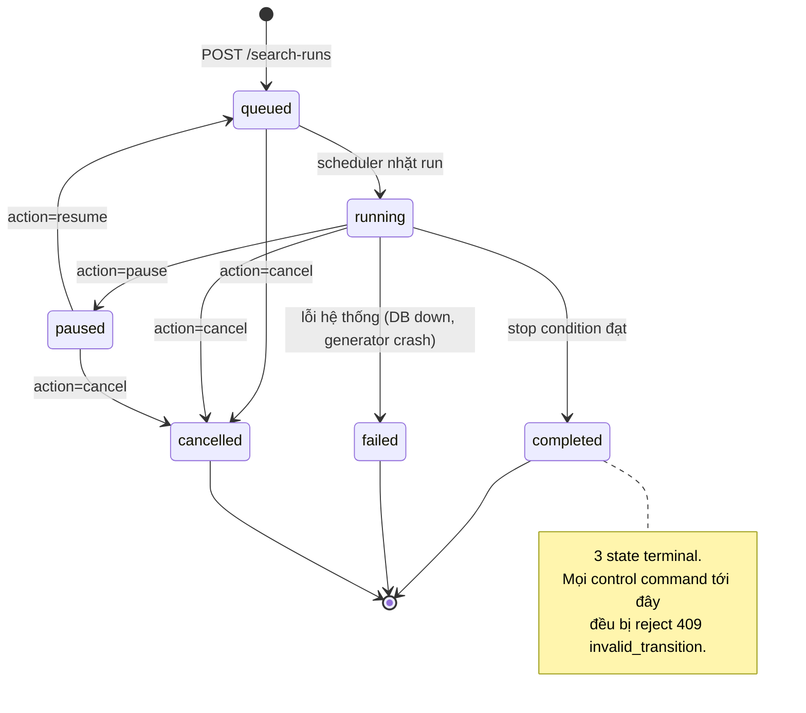

# Đặc tả: Search Loop (Continuous Strategy Loop)

## Mô tả

Đây là **vòng lặp trung tâm** của đồ án (đề bài §23, §24): sinh candidate → backtest → evaluate → rank → sinh tiếp. Nó cũng là chỗ đề bài đặt ra ràng buộc rõ nhất:

> *"Nhóm phải thiết kế Stop Condition. Không được để `while(true)` chạy vô hạn mà không kiểm soát."*

Module gồm 3 phần:

- **`CandidateGenerator` port** — sinh `CandidateStrategy` bất biến. MVP có `RandomSearchGenerator` (bắt buộc theo §16) và `DomainGuidedGenerator` (chứng minh replaceability theo §17, §42).
- **`SearchRunService`** — vòng lặp chính, kiểm tra stop condition ở **đầu** mỗi vòng, dedup candidate, tạo experiment, phát progress.
- **State machine** cho pause/resume/cancel với command idempotent.

Đề bài §24 nêu rõ vì sao phần này quan trọng với kiến trúc: một implementation kém sẽ viết `for 100000 strategies: calculate; backtest; save; update UI` trong một hàm. Tách thành Generator → Queue → Worker → Evaluator → Ranking cho phép: chạy nhiều worker, retry khi worker lỗi, pause/resume, theo dõi tiến trình, **thay search algorithm**, và scale.

Đặc biệt phải đảm bảo:

- **Không tồn tại đường code nào cho phép vòng lặp vô hạn** — ràng buộc ở 3 lớp: schema, API, runtime.
- `CandidateGenerator` **không biết** candidate sẽ được backtest thế nào; pipeline phía sau **không biết** candidate sinh ra bằng cách nào.
- Cùng một tổ hợp **không backtest 2 lần** trong cùng run.
- `pause`/`resume`/`cancel` **idempotent** — gửi lại cùng command không đổi state lần hai.
- Search run tái lập được: cùng `seed` → cùng chuỗi candidate.
- Một candidate lỗi **không** giết run.

## Contract

`GET /api/v1/search-runs/{id}` là read-only public contract. Go ownership-checks bằng
`read.search_run_v1`, sau đó trả `status`, counters, stop condition/reason, best score,
dataset provenance và execution config; Go không đọc `search_runs` base table. Mẫu tối
thiểu:

```json
{
  "search_run_id": "a3f1...",
  "status": "running",
  "candidates": { "generated": 40, "tested": 32, "failed": 2 },
  "best_score": 0.8123,
  "stop_reason": null,
  "dataset": { "dataset_version": "binance_usdm-ETHUSDT-5m-20260601-20260801", "content_hash": "7b41..." },
  "updated_at": "2026-08-12T09:14:22Z"
}
```

`POST /api/v1/search-runs/{id}/actions` là command public của Go. Sau ownership
check, Go INSERT `search_actions` và UPDATE `search_runs` trong một transaction với
optimistic `lock_version`.

```go
type CandidateGenerator interface {
	GeneratorID() string
	GeneratorVersion() string
	Generate(context.Context, SearchSpace, int, *int64, SearchHistory) ([]CandidateStrategy, error)
}
```

```go
type CandidateStrategy struct {
	Definition strategy.CompositeSpec
	CandidateHash string
	GeneratedBy string
	GenerationMeta json.RawMessage
}

type SearchSpace struct {
	StrategyIDs []string
	ParameterGrid map[string]map[string][]any
	Cardinality [2]int
	Policies []string
	WeightOptions []decimal.Decimal
}

type SearchHistory struct {
	TestedHashes HashSet
	TopK []ScoredCandidate
	BestScore *decimal.Decimal
	NonImprovingCount int
}
```

> **Vì sao generator trả một batch bounded.** Genetic Search cần biết kết quả thế hệ trước để sinh thế hệ sau. `SearchHistory` truyền state qua các batch mà interface không đổi; mỗi batch có `limit` và số attempt tối đa nên không thể treo. Đây là ví dụ của việc thiết kế seam phải tính tới use case tương lai cụ thể, không chỉ "thêm một interface cho có".

`generation_meta` trả lời câu hỏi §17 của đề bài (*"Domain knowledge được đưa vào quá trình search như thế nào?"*):

```json
// RandomSearchGenerator
{ "seed": 42, "attempt": 137, "rejected_duplicates": 18 }

// DomainGuidedGenerator
{ "rule": "required_families_plus_optional",
  "families_required": ["trend", "momentum", "structure"],
  "families_optional": ["volatility", "information"],
  "chosen": { "trend": "ma_cross", "momentum": "rsi",
              "structure": "support_resistance", "information": "news_sentiment" },
  "rejected_reason_counts": { "same_family_twice": 24, "already_tested": 11 } }
```

Không có field này thì "domain-guided" chỉ là một cái tên — không kiểm chứng được rule nào đã thực sự áp dụng.

## Luồng chính

### A. Khởi tạo search run

1. `POST /api/v1/search-runs` với body:
   ```json
   {
     "generator_id": "random_search",
     "search_space": { "strategy_ids": ["ma_cross","rsi","bollinger","support_resistance"],
                       "cardinality": [2, 3],
                       "policies": ["weighted_vote"],
                       "parameter_grid": { "rsi": { "period": [14, 21], "buy_threshold": [25, 30] } } },
     "stop_conditions": { "max_candidates": 200, "max_duration_sec": 1800, "max_non_improving": 50 },
     "market": { "provider": "binance_usdm", "symbol": "ETHUSDT", "timeframe": "5m",
                 "range_from": "2026-01-01T00:00:00Z", "range_to": "2026-03-01T00:00:00Z" },
     "execution": { "initial_equity": "100.00", "fixed_notional": "10.00", "leverage": "1",
                     "fee_bps": 10, "slippage_bps": 0, "fill_policy": "bbo_limit",
                     "position_policy": "one_net_position", "open_position_at_end": "last_executable_bbo",
                     "risk_policy": null },
     "seed": 42,
     "idempotency_key": "run-2026-08-11-a3f8"
   }
   ```
2. Validate cấu trúc ở Go: `generator_id` tồn tại; `stop_conditions` **có ít nhất 1 điều kiện hợp lệ**; mỗi `max_candidates`, `max_duration_sec`, `max_non_improving` phải là số nguyên dương; `max_failure_rate` nằm trong `(0,1]`; `cardinality` trong [2,5]; `strategy_ids` đều có trong registry. Go không tự đọc quota để accept request.
3. Go `SearchRunService` validate lại, gọi Go `MarketService` để tạo/dùng lại `market_datasets` (`specs/market-data.md` §E), rồi chạy `SearchAdmission` transaction. Nếu số nến > `max_candles_per_experiment` → `422 dataset_too_large` trước khi admission.
4. `SearchAdmission` khóa `user_quotas` bằng `FOR UPDATE`, kiểm tra `max_concurrent_runs` và `max_candidates_per_run`, rồi INSERT `search_runs (status='queued', stop_conditions, seed, market_dataset_id, execution_config, idempotency_key)` trong **cùng transaction**. Job của từng candidate được tạo sau, cùng transaction với `search_candidates` và `experiments`. Nếu vượt → rollback và trả `409 concurrent_run_limit` hoặc `422 candidate_limit_exceeded`; nếu retry cùng key → trả run cũ.
5. `execution_config` bao gồm nguyên vẹn `initial_equity`, `fixed_notional`, `leverage`, `fee_bps`, `slippage_bps`, `fill_policy`, `position_policy`, `open_position_at_end` và `risk_policy`; mọi `ExperimentSnapshot` sinh ra từ run phải copy đúng các field này. Các state/counter sau đó luôn cập nhật `updated_at` trong cùng transaction.
6. Trả `202 { "search_run_id": "…" }`.
7. `UNIQUE (owner_id, idempotency_key)` → retry cùng key trả về run cũ, không tạo run mới.

### B. Vòng lặp chính

```mermaid
sequenceDiagram
    autonumber
    participant SRS as SearchRunService
    participant GEN as CandidateGenerator
    participant DB as PostgreSQL
    participant EXS as ExperimentService
    participant HUB as WS Hub
    participant W as Worker pool

    SRS->>DB: UPDATE search_runs SET status='running', started_at=now()

    loop mỗi vòng
        SRS->>SRS: check_stop_conditions(run)
        Note over SRS: Kiểm tra ở ĐẦU vòng, TRƯỚC khi generate:<br/>max_candidates · max_duration_sec · max_non_improving<br/>· max_failure_rate · status paused/cancelled
        alt điều kiện dừng đạt
            SRS->>DB: UPDATE status, stop_reason
            SRS->>HUB: SearchRunFinished
        end

        SRS->>DB: reload status (phát hiện pause/cancel từ API)
        alt status == 'paused'
            Note over SRS: Thoát vòng lặp. KHÔNG busy-wait.<br/>Resume sẽ đưa run về 'queued' và scheduler nhặt lại.
        end

        SRS->>GEN: Generate(ctx, batch_limit, seed, history)
        GEN-->>SRS: []CandidateStrategy(hash, generated_by, generation_meta)
        SRS->>SRS: xử lý tuần tự từng candidate trong batch

        SRS->>DB: BEGIN · INSERT search_candidates ... ON CONFLICT (search_run_id, candidate_hash) DO NOTHING
        alt 0 row (hash đã tồn tại)
            SRS->>DB: COMMIT · dedup_hits += 1
            SRS->>SRS: KHÔNG backtest lại
            SRS->>HUB: SearchProgressUpdated
        else row mới
            SRS->>EXS: create_experiment(candidate_id, dataset, execution)
            EXS->>DB: INSERT experiments(search_candidate_id=candidate_id) · INSERT backtest_jobs priority 200 · COMMIT
            Note over EXS,DB: Candidate, experiment và job cùng transaction; `experiments.search_candidate_id` UNIQUE là liên kết canonical.
            EXS->>HUB: BacktestQueued
            SRS->>DB: UPDATE candidates_generated += 1
            SRS->>DB: UPDATE updated_at=now()
        end
        SRS->>HUB: SearchProgressUpdated
    end

    par Worker chạy song song, độc lập với vòng lặp generate
        W->>DB: claim job (FOR UPDATE SKIP LOCKED)
        W->>W: backtest → evaluate → StrategyEvaluated
        Note over W,DB: Ranking cập nhật best_score / non_improving_count<br/>qua event, KHÔNG gọi trực tiếp SearchRunService
    end
```

**Điểm quan trọng về kiến trúc**: vòng lặp generate **không chờ** backtest xong. Nó đẩy job vào queue và tiếp tục. Worker pool tiêu thụ song song. Nếu vòng lặp chờ từng candidate thì thêm worker không giúp gì — và §43 của đề bài (scale bằng worker) sẽ không đạt được.

Nhưng có một giới hạn cần thiết: `SearchRunService` giới hạn số job `queued` chưa xử lý (mặc định `max_inflight = 4 × worker_count`). Không giới hạn thì với `max_candidates=500` nó sẽ nhồi 500 job vào queue trong 2 giây, và `pause` trở nên vô nghĩa (500 job vẫn chạy tiếp sau khi pause).

### C. Stop condition — ba lớp thực thi

| Lớp        | Cơ chế                                                                                                        |
| ---------- | ------------------------------------------------------------------------------------------------------------- |
| **Schema** | `CHECK` yêu cầu ít nhất một stop condition có giá trị số dương, gồm `max_failure_rate`, và reject mọi key đã biết sai kiểu/range — **không INSERT được** run thiếu stop condition hợp lệ |
| **API**    | `422 missing_stop_condition` nếu thiếu; `422` nếu `max_candidates > max_candidates_per_run`                     |
| **Runtime**| `check_stop_conditions()` gọi ở **đầu** mỗi vòng, trước `generate()`. Không nhánh nào bỏ qua                     |

```go
func CheckStopConditions(run SearchRun, now time.Time) (string, bool) {
	sc := run.StopConditions
	if run.Status == StatusPaused || run.Status == StatusCancelled {
		return string(run.Status), true
	}
	if sc.MaxCandidates != nil && run.CandidatesGenerated >= *sc.MaxCandidates {
		return "max_candidates", true
	}
	if sc.MaxDurationSec != nil &&
		now.Sub(run.StartedAt) >= time.Duration(*sc.MaxDurationSec)*time.Second {
		return "timeout", true
	}
	if sc.MaxNonImproving != nil && run.NonImprovingCount >= *sc.MaxNonImproving {
		return "no_improvement", true
	}
	if sc.MaxFailureRate != nil && run.CandidatesTested >= 20 &&
		float64(run.CandidatesFailed)/float64(run.CandidatesTested) >= *sc.MaxFailureRate {
		return "failure_rate", true
	}
	if run.GeneratorExhausted {
		return "space_exhausted", true
	}
	return "", false
}
```

Bốn loại stop condition và ý nghĩa từng loại:

| Loại                | Chặn theo   | Khi nào dùng                                                                    |
| ------------------- | ----------- | ------------------------------------------------------------------------------- |
| `max_candidates`    | Khối lượng  | Mặc định. Dễ dự đoán nhất, dễ giải thích nhất cho người dùng                     |
| `max_duration_sec`  | Thời gian   | Cần thiết vì thời gian/candidate biến động theo độ phức tạp composite            |
| `max_non_improving` | Hiệu quả    | Thông minh nhất: 50 candidate liên tiếp không cải thiện Top-1 → space có lẽ đã cạn |
| `max_failure_rate`  | An toàn     | 30% candidate fail nghĩa là có gì sai (dataset lỗi, plugin bug) → dừng, không đốt CPU |

> **`space_exhausted` là stop reason thứ 5 dễ bị bỏ sót.** Với `SearchSpace` nhỏ (4 strategy, cardinality [2,3], grid 4 giá trị), tổng số tổ hợp hợp lệ là hữu hạn. `RandomSearchGenerator` sẽ sinh trùng liên tục và `dedup_hits` tăng vô hạn trong khi `candidates_generated` không tăng — vòng lặp thực chất treo mà không vi phạm stop condition nào. Generator phải phát hiện được (ví dụ: 200 lần sinh liên tiếp đều trùng → `StopIteration`) và `SearchRunService` kết thúc run với `stop_reason='space_exhausted'`.

`non_improving_count`, `generator_exhausted` và `updated_at` là state bền vững của `search_runs`, không phải thuộc tính chỉ tồn tại trong process. Ranking cập nhật count trong transaction xử lý `StrategyEvaluated`; generator ghi `generator_exhausted=true` trước khi kết thúc vì `space_exhausted`. Khi `SearchRunService` restart, nó reload đủ state này từ PostgreSQL rồi mới chạy `check_stop_conditions()`.

### D. Pause / Resume / Cancel



Luồng xử lý command:

1. `POST /api/v1/search-runs/{id}/actions` với `{"action":"pause","command_id":"cmd-a3f8-01"}`.
2. Ownership check: `run.owner_id == principal.id` **hoặc** role ∈ (`OPERATOR`, `ADMIN`).
3. Go thực hiện command trong transaction domain. Trong transaction,
   `INSERT search_actions (command_id, ...)`:
   - Conflict trên `UNIQUE (command_id)` → command đã xử lý → trả về kết quả lần đầu (`200`, không phải lỗi). **Đây là idempotency**.
4. Kiểm tra transition hợp lệ theo state machine; không hợp lệ → `409 invalid_transition` kèm `current_status`.
5. `UPDATE search_runs SET status=?, lock_version = lock_version + 1 WHERE id=? AND lock_version=?`:
   - 0 row affected → có ai đó vừa đổi state → `409 concurrent_modification`, client đọc lại và thử lại.
6. Ghi `search_actions.requested_from` / `resulted_in` / `actor_id` — audit đầy đủ.

> **Vì sao `OPERATOR` được pause run của người khác.** Kịch bản thật: một search run của user A đang chiếm hết worker và làm hệ thống chậm; operator phải dừng được nó mà không cần credential của A. Nếu chỉ owner cancel được thì sự cố này chỉ xử lý được bằng cách kill container — mất luôn các job đang chạy của người khác. Mọi hành động như vậy để lại vết trong `search_actions.actor_id`.

> **Vì sao `paused → queued` chứ không `paused → running` trực tiếp.** `running` nghĩa là "có một vòng lặp đang thực thi". Sau khi pause, vòng lặp đó đã thoát. `resume` đưa run về `queued` để scheduler nhặt lại và tạo vòng lặp mới. Nếu set thẳng `running` thì sẽ có run ở trạng thái `running` mà không có vòng lặp nào chạy — và không cách nào phát hiện ngoài việc thấy `candidates_tested` không tăng.

### E. Hai generator

Cả hai generator đều là Go implementations của cùng một port. Output bị giới hạn
bởi `limit`, seed nằm trong input, và duplicate bị kiểm tra bằng
`history.TestedHashes`; không có `while true` không có bound.

```go
type CandidateGenerator interface {
	GeneratorID() string
	Generate(context.Context, SearchSpace, int, *int64, SearchHistory) ([]CandidateStrategy, error)
}

type RandomSearchGenerator struct{}

func (RandomSearchGenerator) Generate(ctx context.Context, space SearchSpace,
	limit int, seed *int64, history SearchHistory) ([]CandidateStrategy, error) {
	rng := rand.New(rand.NewSource(*seed))
	out := make([]CandidateStrategy, 0, limit)
	for attempt := 0; len(out) < limit && attempt < limit*200; attempt++ {
		spec := sampleComposite(rng, space)
		hash := CanonicalHash(spec)
		if history.TestedHashes.Contains(hash) { continue }
		out = append(out, CandidateStrategy{Definition: spec,
			CandidateHash: hash, GeneratedBy: "random_search@1.0.0"})
	}
	return out, nil
}
```

`DomainGuidedGenerator` dùng cùng contract nhưng nhóm child theo family:
mỗi candidate cố gắng chọn một strategy từ `trend`, `momentum`,
`structure`, rồi thêm tối đa một family tuỳ chọn từ `volatility` hoặc
`information`. Nếu registry thiếu family bắt buộc, generator trả lỗi
cấu hình rõ ràng; nếu space cạn, trả ít candidate và đánh dấu
`GeneratorExhausted`.

```go
type DomainGuidedGenerator struct{}

func (DomainGuidedGenerator) Generate(ctx context.Context, space SearchSpace,
	limit int, seed *int64, history SearchHistory) ([]CandidateStrategy, error) {
	// bounded attempts; metadata ghi required/optional families và seed
	return generateByFamilies(ctx, space, limit, seed, history,
		[]string{"trend", "momentum", "structure"},
		[]string{"volatility", "information"})
}
```

Đổi generator = một dòng config `SEARCH_GENERATOR=domain_guided`.
`BacktestEngine`, `Evaluator`, `RankingService` và UI: **0 dòng** (demo S4).

## Target additions (unified blueprint)

- **GeneratorRegistry**: generator được resolve qua registry theo config/param, không qua branching — cùng cơ chế `StrategyRegistry` (sơ đồ 11). Đổi generator = đổi config resolve, execution pipeline không đổi dòng nào.
- Candidate sinh ra luôn mang `generator_id` + `generation_meta` vào provenance chain (sơ đồ 24).
