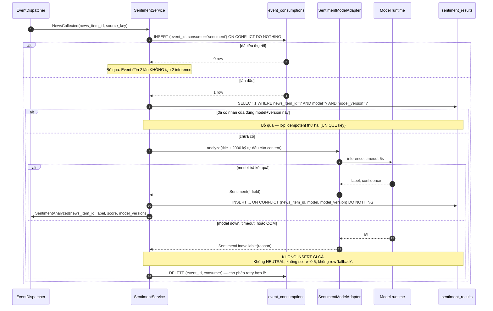

# Đặc tả: Sentiment Analysis (Model Adapter, Provenance, Degradation)

## Mô tả

Module bọc mô hình phân tích cảm xúc thành một port, ghi kết quả vào `sentiment_results`, và **kết thúc ở đó**. Nó không gọi strategy, không biết Leaderboard tồn tại, không biết ai sẽ đọc kết quả của nó. Consumer duy nhất là `NewsService` — qua database, qua repository port.

Trách nhiệm cụ thể:

- Consume `NewsCollected`, chạy inference, ghi `Sentiment` (4 field) kèm `model` + `model_version`.
- Giữ `model_version` như một phần của **provenance**: kết quả cũ không bao giờ bị ghi đè khi đổi model.
- Tính `NewsSentimentWindow` (aggregate đã tổng hợp) và đưa vào `AnalysisContext`, để `NewsSentimentStrategy` là một strategy bình thường không cần biết news đến từ RSS hay model là gì.
- Khi model không khả dụng: **không ghi gì cả**.

Điểm khó nhất của module này không phải chạy được model — mà là **trung thực về việc không chạy được**. Một pipeline sentiment tự nhiên có xu hướng "điền cho đủ": model timeout thì ghi `NEUTRAL, score=0.5` để row không bị thiếu, để JOIN không ra `NULL`, để UI không phải xử lý trạng thái thứ tư. Đó là ADR-013 bị vi phạm, và hậu quả của nó không xuất hiện ở đây — nó xuất hiện ba tầng sau, trong một con số trên Leaderboard, không có triệu chứng nào để lần ra (`design.md` §10 ADR-013, `proposal.md` R11).

Thứ hai: `score` trong `Sentiment` là **confidence của model** trong `[0, 1]`, không phải trading return, không phải mức độ "tích cực". `score=0.9` với `label=NEGATIVE` nghĩa là "chắc chắn 90% rằng tin này xấu", không phải "xấu 90%". Nhầm hai thứ này làm mọi phép trung bình phía sau sai dấu và sai thang. Đây là lý do `NewsSentimentWindow.avg_score` có công thức đổi thang tường minh, viết ra trong đặc tả, không để mỗi người tự suy diễn.

Đặc biệt phải đảm bảo:

- Model down → **0 row** trong `sentiment_results`. Không có `NEUTRAL` placeholder, không có `score=0.5` mặc định, không có row với `model='fallback'`.
- Đổi model → kết quả cũ **giữ nguyên**; `UNIQUE (news_item_id, model, model_version)` cho phép nhiều nhãn cùng tồn tại cho một tin.
- `NewsSentimentWindow` chỉ tổng hợp trên **một** `(model, model_version)`, không bao giờ trộn nhiều version vào cùng một trung bình.
- Strategy đọc `ctx.news_sentiment`, **không** query SQL, **không** có DB session (`design.md` §5.2).
- Đổi model từ logistic regression sang BERT sang LLM → `NewsSentimentStrategy` và Strategy Engine 0 dòng đổi, miễn `Sentiment` giữ 4 field.
- Sentiment service down → chart realtime 100% bình thường, backtest technical-only 100% bình thường.

## Contract

```go
type SentimentAnalyzer interface {
	ModelVersion() string
	Analyze(context.Context, string) (Sentiment, error)
}
```

```go
type Sentiment struct {
	Label string // POSITIVE | NEUTRAL | NEGATIVE
	Score decimal.Decimal // [0,1], confidence
	Model, ModelVersion string
	AnalyzedAt time.Time
}
```

```json
{"label":"POSITIVE","score":0.82,"model":"sentiment-v1","model_version":"2026-08-01","analyzed_at":"2026-08-09T00:00:00Z"}
```

```go
type NewsSentimentWindow struct {
	WindowSec int
	AvgScore decimal.Decimal // -1..+1
	ItemCount int
	ModelVersion string
}
```

> **Ba field cố ý *không* có trong `Sentiment`.** Không có `news_item_id` (value object không biết nó thuộc về ai — quan hệ là việc của repository). Không có `raw_logits` / `probabilities` (model internals không được rời khỏi adapter; nếu chúng có trong VO, chúng sẽ rò ra API). Không có `is_fallback` — vì không có fallback nào tồn tại; có field đó là mở cửa cho chính thứ ADR-013 cấm.

`Sentiment` là **contract**, không phải kiểu dữ liệu tiện tay. `label` có đúng 3 giá trị và `sentiment_enum` trong PostgreSQL cưỡng chế điều đó. Thêm nhãn `MIXED` **không** phải thay đổi tương thích: `NewsSentimentStrategy` đang map 3 nhãn sang thang số, gặp nhãn thứ tư nó không có công thức. Xử lý đúng là `Sentiment` v2 + `NewsSentimentStrategy` v2.0.0, strategy cũ giữ contract cũ, experiment cũ đọc lại được (`design.md` §11.6).

## Luồng chính

### A. `NewsCollected` → phân tích → persist



> **`DELETE event_consumptions` khi model down là chủ ý, không phải rò rỉ trạng thái.** Bảng đó có nghĩa "event này **đã được xử lý xong**". Model down nghĩa là chưa xử lý xong, nên giữ row lại sẽ khiến tin đó **vĩnh viễn** không có sentiment kể cả sau khi model sống lại. Đánh đổi: nếu process chết ngay giữa `DELETE` và commit, event có thể bị xử lý hai lần — vô hại, vì `UNIQUE (news_item_id, model, model_version)` chặn ở lớp dưới.

### B. Backfill — tin cũ chưa có nhãn

Job cron 30 phút:

```sql
SELECT ni.id, ni.title, ni.content
FROM news_items ni
LEFT JOIN sentiment_results sr
       ON sr.news_item_id = ni.id
      AND sr.model = $1 AND sr.model_version = $2
WHERE sr.id IS NULL
  AND ni.published_at > now() - INTERVAL '7 days'
ORDER BY ni.published_at DESC
LIMIT 200;
```

Job này là lý do "không fake NEUTRAL" hoạt động được trong thực tế: khoảng trống do model down **tự lấp lại** khi model sống lại, không cần can thiệp tay. Nếu ta đã ghi `NEUTRAL` giả thì query trên trả 0 row — khoảng trống bị bịt bằng dữ liệu sai và không còn cách nào phát hiện.

`LIMIT 200` và cửa sổ 7 ngày là bounded input: sau một sự cố dài, backlog có thể là 10.000 tin, và một job không giới hạn sẽ chạy 3 giờ chiếm hết CPU của worker đang backtest.

### C. `NewsSentimentWindow` — do `NewsService` tính, không do strategy

```sql
-- as_of = now() (realtime) HOẶC candles[index].close_time (backtest)
SELECT COUNT(*) AS item_count,
       COALESCE(AVG(CASE sr.label
                      WHEN 'POSITIVE' THEN  sr.score
                      WHEN 'NEGATIVE' THEN -sr.score
                      ELSE 0 END), 0) AS avg_score
FROM news_items ni
JOIN sentiment_results sr ON sr.news_item_id = ni.id
WHERE $coin = ANY(ni.related_coins)
  AND ni.published_at >  $as_of - make_interval(secs => $window_sec + $analysis_lag_sec)
  AND ni.published_at <= $as_of - make_interval(secs => $analysis_lag_sec)
  AND sr.model = $model AND sr.model_version = $model_version;
```

Bốn quyết định nằm trong query này:

1. **Lọc theo đúng một `(model, model_version)`.** Không lọc thì một cửa sổ 1 giờ sau khi deploy model mới sẽ trộn nhãn của hai model có thang confidence khác nhau, ra một con số không thuộc về model nào. Kết quả: hai experiment "cùng điều kiện" thực chất khác nhau, và không có gì trong dữ liệu cho biết điều đó.
2. **`analysis_lag_sec` (mặc định 300 s) thay vì lọc theo `analyzed_at`.** Lọc `analyzed_at <= as_of` nghe có vẻ đúng hơn, nhưng `analyzed_at` là *thời điểm ta chạy model*, không phải thời điểm thông tin biết được. Backfill hôm nay cho tin tháng trước sẽ có `analyzed_at` hôm nay → mọi backtest lịch sử thấy `item_count = 0`. Vì vậy dùng một độ trễ mô hình hoá cố định: tin chỉ được coi là "biết được" sau `published_at + 300 s`. Đánh đổi: 300 s là con số giả định, không phải đo được. Nó là tham số trong snapshot experiment, chỉnh được và ghi lại được — quan trọng hơn là nó **có mặt**, vì `analysis_lag_sec = 0` là look-ahead bias (`proposal.md` R3).
3. **`AVG` bỏ qua `NULL`, không coi tin thiếu nhãn là 0.** Tin không có nhãn không nằm trong JOIN nên không kéo trung bình về giữa. `item_count` phản ánh đúng số tin **có nhãn**, không phải số tin tồn tại — và strategy dùng con số đó để quyết định có đủ dữ liệu hay không.
4. **`COALESCE(..., 0)` chỉ áp cho `avg_score` khi `item_count = 0`.** Trường hợp đó `NewsService` trả `None` cho `ctx.news_sentiment` thay vì một window rỗng có `avg_score=0` — vì `avg_score=0` nghĩa "trung tính", còn `None` nghĩa "không biết". Lại là ADR-013, ở tầng aggregate.

### D. `NewsSentimentStrategy` — một strategy như mọi strategy

```go
func RegisterNewsSentiment(r *strategy.Registry) error {
	return r.Register(strategy.Definition{
		StrategyID: "news_sentiment", Version: "1.0.0", Family: "information",
		InputRequirements: []string{"news_sentiment"},
	}, func() strategy.Strategy { return NewsSentiment{} })
}

func (NewsSentiment) Analyze(ctx strategy.AnalysisContext) (strategy.Signal, error) {
	w := ctx.NewsSentiment
	if w == nil || w.ItemCount < ctx.Params.Int("min_items") {
		return strategy.HoldWithEvidence("insufficient_sentiment_data"), nil
	}
	if w.AvgScore.GreaterThan(ctx.Params.Decimal("buy_above")) {
		return strategy.BuyWithEvidence(w.AvgScore, w.ModelVersion), nil
	}
	if w.AvgScore.LessThan(ctx.Params.Decimal("sell_below")) {
		return strategy.SellWithEvidence(w.AvgScore, w.ModelVersion), nil
	}
	return strategy.Hold(), nil
}
```

Rule khớp đề bài §30: avg sentiment 1 giờ > 0.7 → BUY, < −0.7 → SELL, còn lại HOLD.

> **`family="information"`, không phải `"sentiment"`.** Đề bài §17 phân nhóm domain là Trend / Momentum / Volatility / Structure / **Information**, và News Sentiment nằm ở nhóm Information. Contract `StrategyDefinition.family` (`specs/strategy-registry.md`) và `CHECK` trên `strategy_definitions` (`design.md` §4.2) yêu cầu plugin thật chỉ nhận đúng 5 giá trị đó; `family=NULL` chỉ hợp lệ cho virtual composite root (`is_composite=true`) — khai báo `family="sentiment"` sẽ bị registry reject lúc startup và DB reject lúc INSERT metadata. Lý do đặt tên theo **vai trò trong quyết định** (thông tin ngoài giá) chứ không theo **kỹ thuật cài đặt** (sentiment analysis): một `OnChainFlowStrategy` hay `FundingRateStrategy` tương lai cũng thuộc nhóm này mà không cần thêm family mới, và `DomainGuidedGenerator` không phải sửa rule.

`min_items` là tham số quan trọng nhất và dễ bị bỏ nhất. Không có nó, **một** tin duy nhất `POSITIVE score=0.95` làm `avg_score=0.95 > 0.7` → BUY. Đó là quyết định giao dịch dựa trên một bài viết mà model tình cờ tự tin — nhiễu, không phải tín hiệu. Với `min_items=3`, ngưỡng chỉ kích hoạt khi có đồng thuận.

`w.model_version` đi vào `evidence` → được ghi vào `run_signals.child_signals` → trả lời được "tín hiệu BUY này do model nào sinh ra" ba tháng sau, cùng cơ chế provenance với strategy version (`design.md` §11.8).

Bốn thứ strategy này **không** có: DB session, HTTP client, nến sau `index`, và giá trị indicator sau `index` (`ctx.indicators` là `IndicatorView` — `design.md` §5.2.1). Hệ quả kiểm chứng được: Go plugin `news_sentiment.go` build và test được trong môi trường không có PostgreSQL và không có network — cùng tiêu chuẩn với `rsi.go` (`design.md` §5.2, `server/tests/architecture/strategy_purity_test.go`).

### E. Đổi model — vì sao kết quả cũ không bị ghi đè

`UNIQUE (news_item_id, model, model_version)` cho phép một tin có nhiều nhãn cùng lúc:

| news_item_id | model         | model_version | label    | score |
| ------------ | ------------- | ------------- | -------- | ----- |
| `0f1c…`      | sentiment-v1  | 2026-08-01    | POSITIVE | 0.82  |
| `0f1c…`      | sentiment-v1  | 2026-09-15    | NEUTRAL  | 0.61  |
| `0f1c…`      | sentiment-v2  | 2026-09-20    | POSITIVE | 0.71  |

Không có `UPDATE` nào trong module này. Quy trình đổi model:

1. Deploy adapter mới với `model_version` mới. Model cũ vẫn giữ nguyên trong DB.
2. Backfill (luồng B) chạy với version mới cho 7 ngày gần nhất — song song, không xoá gì.
3. Experiment mới dùng version mới; experiment cũ vẫn đọc đúng version nó đã chạy vì `model_version` nằm trong snapshot.

Đánh đổi: `sentiment_results` tăng tuyến tính theo số version. Với 200 tin/ngày × 90 ngày × 3 version = 54.000 row — không đáng kể so với `candles`. Nếu một ngày cần dọn, xoá theo `model_version` là một `DELETE` có điều kiện rõ ràng; ghi đè thì không có đường lùi.

**So sánh giữa hai version là một câu hỏi hợp lệ, và nó có câu trả lời tường minh**: hai experiment khác `model_version` là hai entry Leaderboard khác nhau, không được xếp cùng bảng như thể cùng điều kiện — cùng cơ chế mà `market_dataset_id` chặn so sánh chéo dataset (`design.md` ADR-012, `specs/leaderboard.md`).

### F. `POST /api/v1/ai/predict` — endpoint tương thích scaffold

Hiện tại `ai/app/services/predictor.py` là stub của Python AI adapter: `Predictor.predict` bỏ argument và trả cứng `Prediction(label="neutral", score=0.5, model="stub-v0")`. Phase 5 thay bằng adapter thật; Go domain contract không đổi (`design.md` §12.1).

Contract giữ nguyên để không phá client đang có: `PredictRequest.text` 1–10.000 ký tự, whitespace-only → `422`. Go proxy cap body 1 MiB, timeout 30 s, **auth bắt buộc**, rate limit **20/phút/principal** — vì mỗi call là một model inference, và endpoint inference không auth là DoS vector hiển nhiên (`design.md` §7.3, §8.2).

Response chỉ trả 4 field của `Sentiment` + `received_at`. Không trả logits, không trả tên file model, không trả prompt, không trả thời gian inference chi tiết. Model down → `502 { "error": { "code": "sentiment_unavailable", … } }`, **không** phải `200` với `NEUTRAL` — endpoint này phải trung thực theo cùng nguyên tắc với pipeline.

> **Endpoint này không đi qua `sentiment_results`.** Nó là công cụ thử một đoạn text tuỳ ý, không phải một tin trong DB. Ghi kết quả của nó vào `sentiment_results` sẽ tạo row không có `news_item_id` hợp lệ và làm mọi aggregate sai. Hai đường vào, một adapter dùng chung, một bảng duy nhất được ghi bởi một đường.

### G. `GET /api/v1/news/aggregate`

```json
{
  "window": { "from": "2026-08-11T07:00:00Z", "to": "2026-08-11T08:00:00Z", "window_sec": 3600 },
  "model": { "model": "sentiment-v1", "model_version": "2026-08-01" },
  "distribution": { "POSITIVE": 14, "NEUTRAL": 9, "NEGATIVE": 5 },
  "avg_score": 0.31,
  "coverage": { "items_total": 34, "items_analyzed": 28, "items_unanalyzed": 6 }
}
```

`coverage` là phần không được bỏ. Không có nó, `distribution` trông như đã bao phủ toàn bộ tin trong cửa sổ, và người đọc không biết 6 tin thiếu nhãn. Với `items_unanalyzed > 0`, UI hiện rõ "28/34 tin đã phân tích" — đó là cách một hệ thống trung thực trình bày dữ liệu không đầy đủ, thay vì làm tròn nó thành một biểu đồ tròn trông hoàn chỉnh.

Dùng index `idx_sentiment_agg (model_version, analyzed_at DESC)`.

## Kịch bản lỗi

| Tình huống                                                          | Phản ứng                                                                                                       |
| ------------------------------------------------------------------- | -------------------------------------------------------------------------------------------------------------- |
| Model service down (`docker stop`)                                  | **0 row** vào `sentiment_results`; `sentiment_unavailable_total` tăng; `GET /news` trả `sentiment: null`; UI `unavailable`. Chart + backtest technical không đổi — **demo S8** |
| Model timeout > 5 s                                                 | Coi như unavailable; huỷ inference; `event_consumptions` được DELETE để backfill retry sau                       |
| Model trả label ngoài 3 giá trị (`"mixed"`, `"pos"`)                 | Adapter raise `ContractViolation`, **không** map đoán; job log ERROR; 0 row. Map đoán = dữ liệu sai âm thầm      |
| Model trả `score = 1.7` hoặc `-0.2`                                 | Reject ở adapter (`CHECK (score BETWEEN 0 AND 1)` là lớp thứ hai). Không clamp — clamp che một bug calibration    |
| Model OOM / process bị kill                                         | Cùng đường với down; worker không chết theo (inference gọi qua timeout + try/except ở adapter)                    |
| `NewsCollected` đến 2 lần (duplicate event)                         | `event_consumptions(event_id, consumer)` PK chặn lần hai; `UNIQUE (news_item_id, model, model_version)` là lớp hai → đúng **1** inference |
| Hai worker cùng xử lý một `news_item`                               | `ON CONFLICT DO NOTHING` trên UNIQUE key; row thắng là row đầu; không có exception nào nổi lên                   |
| `news_items.content = NULL` (chỉ có title)                          | Phân tích trên `title` thôi. Ghi bình thường — title là tín hiệu hợp lệ, không phải dữ liệu thiếu                |
| `content` 20.000 ký tự, model chỉ nhận 512 token                    | Truncate `title + content[:2000]` ở adapter; **ghi lại** `input_truncated` trong log, không trong `Sentiment`     |
| Retention xoá `content` sau 90 ngày                                 | `sentiment_results` **không** bị ảnh hưởng (khác bảng, không CASCADE từ content). Nhãn cũ vẫn dùng được cho aggregate |
| `news_item` bị xoá                                                  | `ON DELETE CASCADE` xoá nhãn theo. Không có nhãn mồ côi                                                          |
| Deploy model mới giữa lúc backfill đang chạy                        | Batch đang chạy dùng `model_version` đọc lúc bắt đầu batch; batch sau dùng version mới. Không có row nào bị trộn version |
| Cửa sổ 1 giờ có nhãn của cả 2 version                               | Query lọc đúng 1 version → `item_count` chỉ đếm version đó. **Không** trộn trung bình giữa hai thang confidence   |
| Chỉ có 1 tin có nhãn trong cửa sổ, `score=0.95`                     | `item_count=1 < min_items=3` → **HOLD** kèm `evidence.reason='insufficient_sentiment_data'`. Không BUY vì 1 bài viết |
| `item_count = 0` trong cửa sổ                                       | `ctx.news_sentiment = None` (không phải window có `avg_score=0`) → strategy HOLD. `None` = "không biết", `0` = "trung tính" |
| Backtest trên dataset 2024 nhưng nhãn được backfill năm 2026        | `analysis_lag_sec` dùng `published_at`, không dùng `analyzed_at` → backtest lịch sử vẫn có sentiment và vẫn không look-ahead |
| `analysis_lag_sec = 0` bị đặt trong snapshot                        | Cho phép nhưng ghi rõ trong provenance; `tests/domain/test_no_lookahead.py` cảnh báo vì tin công bố cùng lúc nến đóng bị coi là biết trước |
| Ai đó thêm `INSERT ... label='NEUTRAL'` khi model lỗi               | Test tích hợp `test_sentiment_unavailable.py` fail: nó assert `SELECT COUNT(*) FROM sentiment_results = 0` sau khi stop model |
| Strategy thử import repository/HTTP để tự query sentiment             | `server/tests/architecture/module_boundaries_test.go` fail build (domain strategy cấm repository, HTTP, transport) |

## Ràng buộc

**Tính đúng đắn**

- Model không khả dụng → **0 row**. Không placeholder, không default, không fallback model.
- `UNIQUE (news_item_id, model, model_version)`; Go repository chỉ INSERT, **0 câu `UPDATE`** trên `sentiment_results`.
- `label` ∈ 3 giá trị, cưỡng chế bằng `sentiment_enum`; `score ∈ [0,1]`, cưỡng chế bằng `CHECK`.
- `score` là confidence. Đổi thang sang `[-1,+1]` xảy ra **đúng một chỗ**: biểu thức `CASE` trong query của `NewsSentimentWindow`.
- `NewsSentimentWindow` chỉ tổng hợp trên một `(model, model_version)`.
- `item_count = 0` → `ctx.news_sentiment = None`, không phải window `avg_score=0`.
- Cutoff thời gian dùng `published_at + analysis_lag_sec` so với `as_of` của nến, không dùng `now()` trong backtest.
- Consumer idempotent: `event_consumptions(event_id, consumer)` PK + UNIQUE key là hai lớp độc lập.

**Hiệu năng**

- Inference một tin: p95 **< 800 ms**, timeout cứng **5 s**.
- Batch backfill: 200 tin, p95 **< 60 s** (batch inference, không loop từng tin qua HTTP).
- `NewsSentimentWindow` query: p95 **< 80 ms** (index `idx_news_coins` GIN + `idx_sentiment_agg`).
- Backtest 20.000 nến với `NewsSentimentStrategy`: window được **precompute một lần** thành series aligned với candles trước khi vào engine — **không** 20.000 query. Đây là cùng cơ chế precompute indicator ở `AnalysisContext`.
- `GET /news/aggregate`: p95 **< 200 ms** cho cửa sổ 24 giờ.
- Model chạy trong Python service; Phase 5 tách service riêng **chỉ nếu** cần GPU. Ngưỡng quyết định: `sentiment_inference_duration_seconds` p95 > 2 s hoặc inference làm `backtest_duration_seconds` tăng > 20%.

**Bảo mật**

- `POST /ai/predict` cần auth, rate limit 20/phút/principal.
- Response **không** chứa model internals: không weights, không logits, không prompt, không tên/đường dẫn file model, không version của thư viện ML.
- Model down → `502 sentiment_unavailable`; không forward raw error của model runtime, không stack trace (`design.md` §5.5).
- Text đầu vào đã được sanitize ở news pipeline (`specs/news.md` §C); adapter validate lại độ dài 1–10.000 và reject whitespace-only → `422` (không tin caller nội bộ — `design.md` §7.4 lớp 4).
- Model file/weights nằm trong image hoặc volume read-only; module này không tải model từ URL runtime (đó sẽ là một SSRF vector mới, và `specs/news.md` đã cho thấy chi phí xử lý nó).

**Khả năng mở rộng**

- Đổi model = 1 class implement `SentimentAnalyzer` + bump `model_version`. Không đổi: news ingestion, `NewsSentimentStrategy`, `AnalysisContext`, API contract, DB schema, frontend (`design.md` §5.1 bảng seam).
- Thêm nhãn mới = breaking change → `Sentiment` v2 + `NewsSentimentStrategy` v2.0.0; strategy cũ giữ contract cũ.
- Thêm ngôn ngữ / thêm model chạy song song = thêm row với `model` khác, không migration.

**Quan sát được**

- `sentiment_analyzed_total{model_version,label}` counter
- `sentiment_unavailable_total{reason}` counter — `reason ∈ {timeout, down, contract_violation, oom}`
- `sentiment_inference_duration_seconds{model_version}` histogram
- `sentiment_coverage_ratio{model_version}` gauge = `items_analyzed / items_total` trong 24 giờ — signal trả lời "khoảng trống có đang lớn dần không"
- `sentiment_backlog_items` gauge — số tin 7 ngày gần nhất chưa có nhãn của version hiện hành
- Log structured kèm `correlation_id`, `news_item_id`, `model_version`, `error_code`; **không** log nội dung tin và **không** log output thô của model.

## Tiêu chí chấp nhận

- [ ] AC-01: `docker stop` service sentiment → chạy news collection → `news_items` có row mới, `SELECT COUNT(*) FROM sentiment_results` **không tăng**; **0** row nào có `label='NEUTRAL'` được thêm — **demo S8** (`design.md` §12.2 bước 14).
- [ ] AC-02: Trong trạng thái đó, `GET /api/v1/news` trả `200` với `sentiment: null`; UI hiện `unavailable`; `GET /markets/candles` `200` và `POST /experiments` (technical-only) `202`.
- [ ] AC-03: Khởi động lại model → job backfill (luồng B) tự lấp nhãn cho các tin bị thiếu trong ≤ 30 phút, **không** cần can thiệp tay.
- [ ] AC-04: Model trả `label='mixed'` → `ContractViolation`, 0 row ghi, `sentiment_unavailable_total{reason="contract_violation"}` tăng 1.
- [ ] AC-05: Model trả `score=1.7` → bị reject ở adapter; thử INSERT trực tiếp cùng giá trị → DB reject bằng `CHECK`.
- [ ] AC-06: Gửi `NewsCollected` cùng `event_id` **3 lần** → đúng **1** row `sentiment_results`, đúng **1** lần inference (đếm bằng `sentiment_analyzed_total`).
- [ ] AC-07: Chạy analyze cho cùng `news_item` với `model_version` mới → có **2** row cho tin đó; row cũ **byte-identical** với trước (so sánh `label`, `score`, `analyzed_at`).
- [ ] AC-08: Cửa sổ có 5 nhãn version `2026-08-01` và 5 nhãn version `2026-09-15` → `NewsSentimentWindow.item_count = 5` và `model_version` khớp version yêu cầu; **không** ra 10.
- [ ] AC-09: 1 tin `POSITIVE score=0.95` trong cửa sổ, `min_items=3` → `Signal.action = 'HOLD'`, `evidence.reason='insufficient_sentiment_data'`.
- [ ] AC-10: `item_count=0` → `ctx.news_sentiment is None` (không phải window `avg_score=0`); strategy trả HOLD.
- [ ] AC-11: Fixture 6 tin (4 POSITIVE 0.8, 1 NEGATIVE 0.6, 1 NEUTRAL 0.9) → `avg_score = (4×0.8 − 0.6 + 0)/6 = 0.4333`; `buy_above=0.7` → HOLD; `buy_above=0.4` → BUY. Kết quả tính tay khớp chính xác.
- [ ] AC-12: build/test Go plugin `server/internal/domain/strategy/plugins/news_sentiment.go` trong môi trường **không có** PostgreSQL và **không có** network → pass (`strategy_purity_test.go`).
- [ ] AC-13: Backtest 20.000 nến với `NewsSentimentStrategy` → đếm số query tới `sentiment_results` **≤ 2** (precompute), không phải 20.000.
- [ ] AC-14: Anonymous gọi `POST /api/v1/ai/predict` → `401`; RESEARCHER gọi 21 lần/phút → lần 21 trả `429` + `Retry-After`; model down → `502 sentiment_unavailable`, response **không** chứa tên file model hay stack trace.
- [ ] AC-15: Thay `SentimentModelAdapter` bằng fixture adapter trả nhãn từ file JSON → toàn bộ `NewsSentimentStrategy`, backtest, evaluation, leaderboard chạy với **0 dòng** thay đổi ngoài dòng wiring adapter (`design.md` §11.6).
