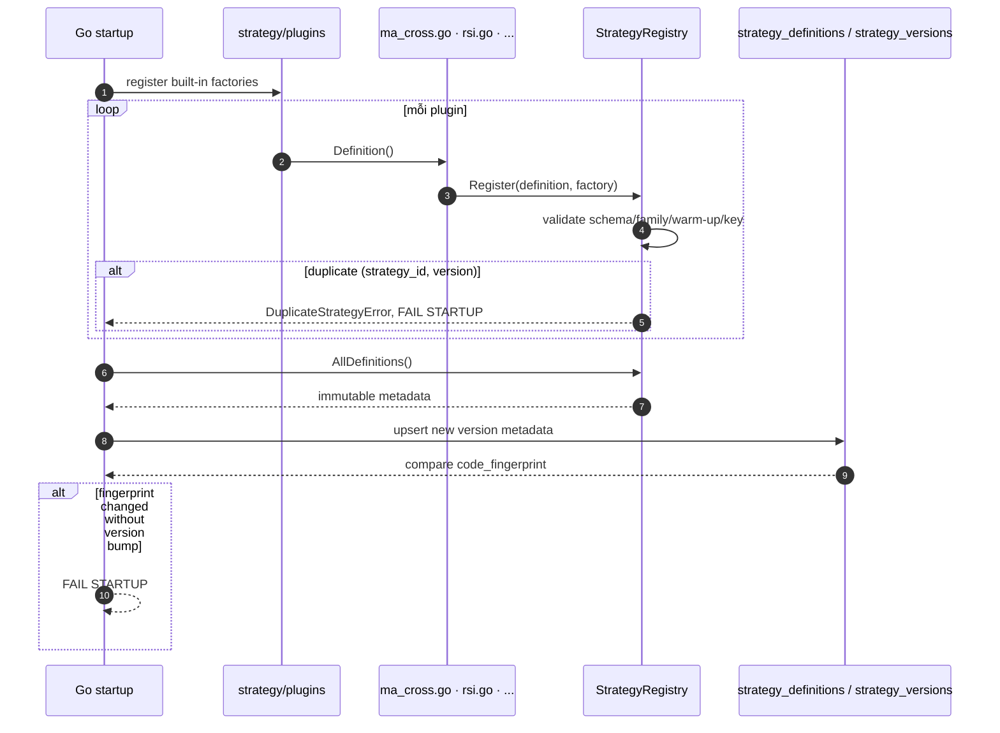
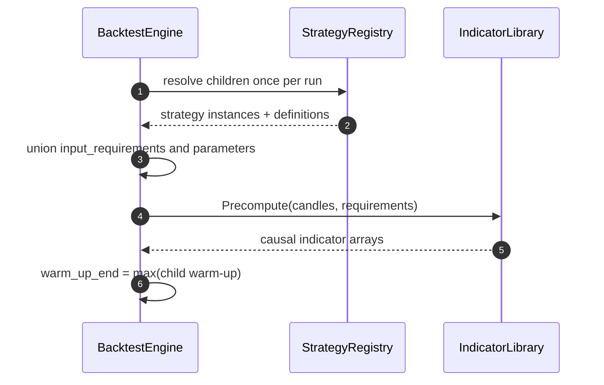

# Đặc tả: Strategy Registry & Plugin Architecture

## Mô tả

Đây là **lõi khả năng mở rộng**. Đề bài §12 và §41 kiểm tra trực tiếp phần
này: thêm `MACDStrategy` phải không kéo theo sửa Registry, Combiner,
BacktestEngine, Evaluator, RankingService, API, DB schema hoặc UI.

Module gồm 3 phần:

- **`Strategy` contract** — Go interface mọi strategy implement: `Definition()`
  trả metadata, `Analyze(ctx)` trả `Signal`.
- **`StrategyRegistry`** — map `(strategy_id, version)` tới factory;
  registration/metadata validation diễn ra lúc startup.
- **`AnalysisContext`** — dữ liệu duy nhất strategy được phép thấy. Context chỉ
  có closed candles, causal indicators và optional sentiment window.

MVP có 5 plugin: `ma_cross`, `rsi`, `bollinger`, `support_resistance`,
`news_sentiment`. `macd` là plugin demo thêm sau.

Đặc biệt phải đảm bảo:

- Thêm strategy mới = **1 file Go mới**, không sửa core.
- Không có branch theo literal `strategy_id` ngoài registration/plugin test.
- Strategy chạy không cần PostgreSQL, network hoặc Binance SDK.
- Plugin error không giết worker/search run.
- Sửa code mà không bump version/fingerprint = fail fast startup.

## Contract

```go
// server/internal/domain/strategy/contract.go
type Strategy interface {
	Definition() Definition
	Analyze(ctx AnalysisContext) (Signal, error)
}

type Definition struct {
	StrategyID        string
	Version           string
	Family            string
	ParametersSchema  json.RawMessage
	InputRequirements []string
	OverlayTypes      []string
	WarmUpCandles     func(Params) (int, error)
	IsComposite       bool
	DisplayName       string
	Description       string
}

type AnalysisContext struct {
	Provider       string
	Symbol         string
	Timeframe      market.Timeframe
	Candles        CausalCandles
	Index          int
	Indicators     IndicatorView
	NewsSentiment  *sentiment.NewsSentimentWindow
	Params         Params
}

type Signal struct {
	Action      Action // BUY | SELL | HOLD
	Confidence  *decimal.Decimal
	Price       *decimal.Decimal
	SignedSize  *decimal.Decimal
	Evidence    json.RawMessage
}
```

`composite@1.0.0` là virtual root version, `IsComposite=true`, `Family=""`.
Root dùng cho FK/provenance, không vào search space và không làm child của
composite khác. Child thật resolve theo `(strategy_id, version)` trước snapshot.

### Context boundary

| Không có | Nếu có thì sao |
|---|---|
| DB session/repository | Strategy query SQL trực tiếp, không test offline |
| HTTP client/exchange SDK | Tự fetch Binance, phá rate limit/determinism |
| `KlineUpdate`/`ChartKline` | Provisional value làm live/backtest lệch |
| Candle sau `Index` | Look-ahead bias |
| Indicator sau `Index` | Đọc giá tương lai qua indicator |
| System time/random | Cùng snapshot không còn byte-identical |

`IndicatorView` chặn `[index+1]`, `len`, negative index và slice vượt causal
boundary. Mọi violation là `LookAheadError`, không âm thầm trả dữ liệu.

## Luồng chính

### A. Đăng ký startup



Registry implementation:

```go
type Key struct{ ID, Version string }
type Factory func() Strategy

type Registry struct { factories map[Key]Factory }

func (r *Registry) Register(def Definition, factory Factory) error {
	if err := ValidateDefinition(def); err != nil { return err }
	key := Key{def.StrategyID, def.Version}
	if _, exists := r.factories[key]; exists {
		return fmt.Errorf("duplicate strategy %s@%s", key.ID, key.Version)
	}
	r.factories[key] = factory
	return nil
}

func (r *Registry) Resolve(id, version string) (Strategy, error) {
	factory, ok := r.factories[Key{id, version}]
	if !ok { return nil, UnknownStrategyError{ID: id, Version: version} }
	return factory(), nil
}
```

Bootstrap registers built-ins explicitly in one package-owned function. Adding
a plugin adds its file and one registration call in the plugin package; no
application component branches on strategy name. Registry order is irrelevant;
all hashes and serialized definitions sort by `(strategy_id, version)`.

### B. Indicator precompute



`input_requirements` tồn tại để engine biết cần precompute gì trước loop, validate
indicator tồn tại từ startup, và không gọi news pipeline khi strategy technical
không cần sentiment. `NewsSentimentStrategy` khai báo dependency có điều kiện;
news thiếu thì trả HOLD theo policy, không fake NEUTRAL.

### C. Signal validation

1. Action phải là `BUY`, `SELL` hoặc `HOLD`.
2. BUY/SELL phải có `Price > 0`; signed size nếu có phải đúng dấu.
3. Evidence phải JSON-serializable và giới hạn kích thước.
4. Composite/Backtest layer resolve fixed notional và tạo OrderIntent; strategy
   không tự mutate position/cash.

## Plugin example

```go
// server/internal/domain/strategy/plugins/macd.go — FILE MỚI DUY NHẤT
func RegisterMACD(r *strategy.Registry) error {
	return r.Register(strategy.Definition{
		StrategyID: "macd", Version: "1.0.0", Family: "trend",
		ParametersSchema: json.RawMessage(`{
			"fast_period":{"type":"integer","minimum":2,"default":12},
			"slow_period":{"type":"integer","minimum":3,"default":26},
			"signal_period":{"type":"integer","minimum":2,"default":9}
		}`),
		InputRequirements: []string{"candles.close", "indicator.ema"},
		OverlayTypes: []string{"macd_line", "macd_signal", "buy_signal", "sell_signal"},
		WarmUpCandles: func(p strategy.Params) (int, error) {
			return p.Int("slow_period") + p.Int("signal_period"), nil
		},
	}, func() strategy.Strategy { return MACD{} })
}

func (MACD) Analyze(ctx strategy.AnalysisContext) (strategy.Signal, error) {
	macd, ok1 := ctx.Indicators.At("macd_line", ctx.Index)
	sig, ok2 := ctx.Indicators.At("macd_signal", ctx.Index)
	prevMACD, ok3 := ctx.Indicators.At("macd_line", ctx.Index-1)
	prevSig, ok4 := ctx.Indicators.At("macd_signal", ctx.Index-1)
	if !(ok1 && ok2 && ok3 && ok4) { return strategy.Hold(), nil }
	if prevMACD.LessThanOrEqual(prevSig) && macd.GreaterThan(sig) { return strategy.Buy(), nil }
	if prevMACD.GreaterThanOrEqual(prevSig) && macd.LessThan(sig) { return strategy.Sell(), nil }
	return strategy.Hold(), nil
}
```

Không sửa: Combiner, BacktestEngine, Evaluator, RankingService, Go API, DB
schema, UI hoặc CandidateGenerator. Definition metadata sinh API form, overlay
declaration và search space tự động.

## Kịch bản lỗi

| Tình huống | Phản ứng |
|---|---|
| Duplicate `(strategy_id, version)` | Fail startup `DuplicateStrategyError` |
| Code fingerprint đổi, version giữ nguyên | Fail startup, yêu cầu bump version |
| Parameters schema invalid | Fail startup |
| Thiếu warm-up | Fail startup; không mặc định 0 |
| Strategy unknown/version unknown | API `422 unknown_strategy` / `unknown_strategy_version` |
| Indicator chưa có | Startup/experiment validation error, liệt kê indicator |
| Signal sai action/sign/price | Candidate failed `invalid_signal` |
| Plugin error | Candidate failed, worker sống, search chuyển candidate kế tiếp |
| Plugin đọc future candle/indicator | `LookAheadError`, candidate failed, ERROR log |
| Plugin import DB/network package | Architecture CI fail module-boundary test |
| News sentiment thiếu | Strategy trả HOLD, không fake sentiment |

## Ràng buộc

**Tính đúng đắn**

- `Analyze` pure: không I/O, random không seed, wall clock hoặc global mutable state.
- Context và Params read-only; indicators causal.
- Registry version append-only; experiment lưu definition + fingerprint.
- `warm_up_candles` = max child warm-up, không chạy signal trước đó.
- Không branch theo strategy name ngoài plugin/registry tests.

**Hiệu năng**

- Registry resolve O(1), một lần mỗi run.
- Indicator precompute một lần cho union requirements.
- `Analyze` không cấp phát/copy toàn bộ indicator mỗi candle.
- Composite 5 child trên 20.000 candles mục tiêu < 8 s cho signal generation.

**Bảo mật**

- Plugin là trusted compiled code; không có upload code qua API/UI.
- Context không chứa credential, DB handle, network client hoặc raw provider payload.
- Evidence giới hạn JSON size để không phình `run_signals`.

## Tiêu chí chấp nhận

- [ ] AC-01: Thêm `macd.go` + test, không sửa core registry/combiner/engine/evaluator/API/UI.
- [ ] AC-02: Duplicate registration fail startup; order registration khác nhau vẫn cùng definitions hash.
- [ ] AC-03: Sửa plugin logic không bump version fail fingerprint check.
- [ ] AC-04: Parameters ngoài JSON Schema trả `422` với field path rõ.
- [ ] AC-05: Future candle/indicator access trả `LookAheadError`.
- [ ] AC-06: Plugin không có DB/network vẫn Analyze thành công.
- [ ] AC-07: Plugin error không crash worker; candidate tiếp theo vẫn chạy.
- [ ] AC-08: `warm_up_candles` đúng max child requirement.
- [ ] AC-09: `Signal` BUY/SELL price và size validation deterministic.
- [ ] AC-10: Static module-boundary scan không cho strategy import repository/HTTP/Binance transport.
