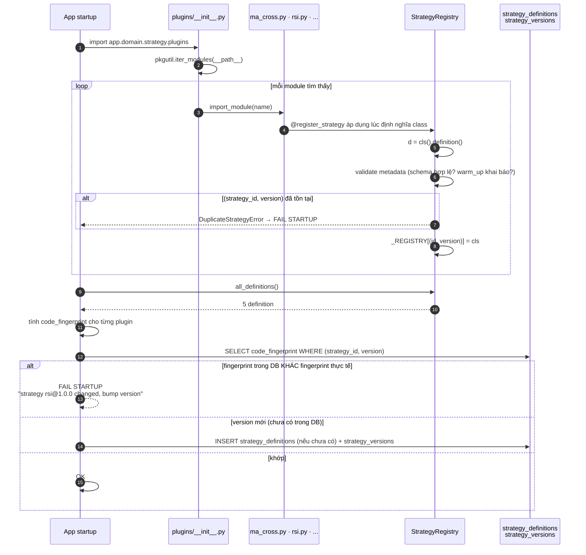
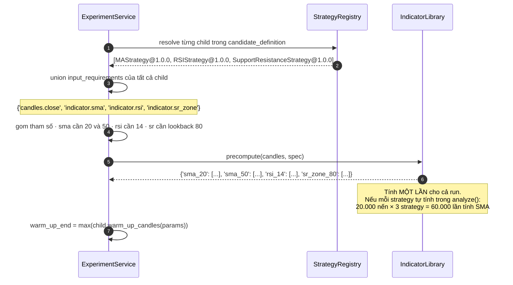

# Đặc tả: Strategy Registry & Plugin Architecture

## Mô tả

Đây là **lõi khả năng mở rộng** của toàn hệ thống. Đề bài §12 và §41 kiểm tra trực tiếp phần này: giảng viên có thể yêu cầu thêm `MACDStrategy` tại chỗ, và chất lượng kiến trúc được đo bằng **số component phải sửa**.

Module gồm 3 phần:

- **`Strategy` contract** — interface mọi strategy phải implement: `definition()` trả metadata, `analyze(ctx)` trả `Signal`.
- **`StrategyRegistry`** — map `(strategy_id, version) → class`, tự đăng ký qua decorator `@register_strategy`, auto-discovery mọi module trong package `plugins/`.
- **`AnalysisContext`** — cấu trúc dữ liệu duy nhất strategy được phép thấy. Nó là cơ chế thực thi ranh giới "Strategy không truy cập Database" ở tầng kiểu dữ liệu, không phải ở tầng nhắc nhở trong code review.

MVP có 5 plugin: `ma_cross`, `rsi`, `bollinger`, `support_resistance`, `news_sentiment`. Plugin thứ 6 (`macd`) được thêm **trong lúc demo** để chứng minh scenario §41.

Đặc biệt phải đảm bảo:

- Thêm strategy mới = **1 file mới, 0 dòng sửa** ở Registry, Combiner, BacktestEngine, Evaluator, RankingService, Go API, DB schema, UI, CandidateGenerator.
- **Không tồn tại** `if strategy_id == "ma"` ở bất kỳ đâu ngoài chính plugin đó.
- Strategy chạy được trong môi trường **không có PostgreSQL, không có network**.
- Strategy lỗi (exception, vòng lặp vô hạn) **không** giết worker và **không** giết search run.
- Sửa code strategy mà quên bump version → **fail fast lúc startup**, không chạy với provenance sai.

## Contract

```python
# app/domain/strategy/contract.py
class Strategy(Protocol):
    def definition(self) -> StrategyDefinition: ...
    def analyze(self, ctx: AnalysisContext) -> Signal: ...


@dataclass(frozen=True)
class StrategyDefinition:
    strategy_id: str                       # 'rsi' — ổn định, không đổi
    version: str                           # '1.0.0' — semver, append-only
    family: Literal["trend", "momentum", "volatility", "structure", "information"]
    parameters_schema: Mapping[str, Any]   # JSON Schema → validate + sinh form UI
    input_requirements: Sequence[str]      # ['candles.close', 'indicator.rsi']
    overlay_types: Sequence[str]           # ['rsi', 'buy_signal', 'sell_signal']
    warm_up_candles: Callable[[Mapping[str, Any]], int]
    display_name: str = ""
    description: str = ""


@dataclass(frozen=True)
class AnalysisContext:
    symbol: str
    timeframe: Timeframe
    candles: Sequence[Candle]                          # CHỈ tới index — không có nến tương lai
    index: int                                         # candles[index] là "bây giờ"
    indicators: Mapping[str, Sequence[float | None]]   # đã precompute, aligned với candles
    news_sentiment: NewsSentimentWindow | None
    params: Mapping[str, Any]                          # đã validate theo parameters_schema


@dataclass(frozen=True)
class Signal:
    action: Literal["BUY", "SELL", "HOLD"]
    confidence: float | None = None                    # 0..1
    evidence: Mapping[str, Any] | None = None          # {'rsi': 72.4} → ghi vào run_signals
```

**Bốn thứ `AnalysisContext` cố ý KHÔNG có:**

| Không có                | Nếu có thì sao                                                                        |
| ----------------------- | ------------------------------------------------------------------------------------- |
| DB session / repository | Strategy query SQL trực tiếp → anti-pattern §44; và không test được offline           |
| HTTP client             | Strategy gọi Binance → mỗi strategy tự fetch, rate limit vỡ, backtest không determinism |
| Nến sau `index`         | Look-ahead bias (R3) — kết quả đẹp giả tạo, toàn bộ Leaderboard vô nghĩa               |
| Thời gian hệ thống      | `datetime.now()` trong strategy làm backtest không tái lập được                        |

> **Đây là điểm thiết kế quan trọng nhất của file này.** Ranh giới được thực thi bằng **cái mà kiểu dữ liệu không cho phép**, không bằng quy ước. Một dev mới không cần đọc tài liệu để biết không được query DB trong strategy — họ đơn giản là không có session để query.

## Luồng chính

### A. Đăng ký strategy lúc startup



`register_strategy` (đầy đủ):

```python
# app/domain/strategy/registry.py
_REGISTRY: dict[tuple[str, str], type[Strategy]] = {}

def register_strategy(cls: type[Strategy]) -> type[Strategy]:
    d = cls().definition()
    _validate_definition(d)                # schema hợp lệ, warm_up khai báo, family ∈ enum
    key = (d.strategy_id, d.version)
    if key in _REGISTRY:
        raise DuplicateStrategyError(f"{key} đã được đăng ký bởi {_REGISTRY[key].__name__}")
    _REGISTRY[key] = cls
    return cls

def resolve(strategy_id: str, version: str) -> type[Strategy]:
    try:
        return _REGISTRY[(strategy_id, version)]
    except KeyError:
        raise UnknownStrategyError(strategy_id, version)   # lỗi TƯỜNG MINH, không nhánh else âm thầm

def all_definitions() -> list[StrategyDefinition]:
    return [cls().definition() for cls in _REGISTRY.values()]
```

`plugins/__init__.py` (đây là chỗ "tự xuất hiện" xảy ra):

```python
import pkgutil, importlib
for _, name, _ in pkgutil.iter_modules(__path__):
    importlib.import_module(f"{__name__}.{name}")
```

> **Vì sao auto-discovery, không danh sách tường minh.** Một `STRATEGIES = [MAStrategy, RSIStrategy, ...]` sẽ hoạt động, nhưng nó là **một chỗ phải cập nhật** khi thêm plugin — và vì thế là một chỗ để quên. Với `iter_modules`, không có danh sách nào tồn tại nên không có gì để quên. Đánh đổi: thứ tự import không xác định (chấp nhận được vì registry là dict, không phụ thuộc thứ tự) và một module lỗi syntax sẽ fail startup (đó là hành vi mong muốn — fail fast).

### B. Precompute indicator theo `input_requirements`



Ba lý do `input_requirements` tồn tại trong metadata thay vì để engine tự suy ra:

1. **Precompute cần biết trước.** Engine phải biết tính gì **trước khi** vào vòng lặp. Suy ra từ thân hàm `analyze()` là không khả thi.
2. **Validate được.** Strategy khai báo cần `indicator.rsi` nhưng `IndicatorLibrary` không có → phát hiện lúc startup, không phải lúc chạy candidate thứ 300.
3. **`news_sentiment` là dependency có điều kiện.** `NewsSentimentStrategy` khai báo `input_requirements=['news.sentiment_1h']`; engine biết phải nạp `NewsSentimentWindow`. Strategy technical-only không khai báo → engine không truy vấn news → backtest technical chạy được khi news pipeline chết.

### C. Chạy strategy trong sandbox

```python
# app/domain/backtest/engine.py (trích)
def _safe_analyze(self, strategy: Strategy, ctx: AnalysisContext,
                  sid: str, ver: str) -> Signal:
    started = monotonic()
    try:
        with deadline(seconds=self.per_call_timeout):     # mặc định 1.0 s
            sig = strategy.analyze(ctx)
    except DeadlineExceeded:
        self.metrics.strategy_timeout(sid)
        raise StrategyFailure(sid, ver, "strategy_timeout")
    except Exception as exc:                              # ZeroDivisionError, IndexError, ...
        self.metrics.strategy_error(sid, ver)
        log.warning("strategy_raised", strategy=f"{sid}@{ver}",
                    error_type=type(exc).__name__, candle_index=ctx.index)
        raise StrategyFailure(sid, ver, "strategy_exception") from exc

    if sig.action not in ("BUY", "SELL", "HOLD"):          # plugin trả rác
        raise StrategyFailure(sid, ver, "invalid_signal")
    self.metrics.observe_analyze(sid, monotonic() - started)
    return sig
```

`StrategyFailure` được bắt ở tầng worker: `backtest_runs.status='failed'` + `error_code`, `search_candidates.status='failed'` + `failure_reason`. **Search run tiếp tục** với candidate kế tiếp.

> **Vì sao `per_call_timeout` là 1 giây, không 30 giây.** `analyze()` được gọi một lần **mỗi nến**. Với 20.000 nến, timeout 30 s/call nghĩa là một plugin xấu có thể chạy 166 giờ trước khi bị dừng. 1 giây/call vẫn rất rộng cho một hàm chỉ đọc vài phần tử mảng, và giới hạn thiệt hại tổng ở mức chấp nhận được. Ngoài ra job có `lease_expires_at` 120 s làm lớp phòng thủ thứ hai.

### D. Thêm strategy mới — toàn bộ diff (demo S3)

```python
# app/domain/strategy/plugins/macd.py   ← FILE MỚI DUY NHẤT
@register_strategy
class MACDStrategy:
    def definition(self) -> StrategyDefinition:
        return StrategyDefinition(
            strategy_id="macd",
            version="1.0.0",
            family="trend",
            display_name="MACD Crossover",
            parameters_schema={
                "fast_period":   {"type": "integer", "minimum": 2, "maximum": 100, "default": 12},
                "slow_period":   {"type": "integer", "minimum": 3, "maximum": 400, "default": 26},
                "signal_period": {"type": "integer", "minimum": 2, "maximum": 100, "default": 9},
            },
            input_requirements=["candles.close", "indicator.macd"],
            overlay_types=["macd_line", "macd_signal", "buy_signal", "sell_signal"],
            warm_up_candles=lambda p: p["slow_period"] + p["signal_period"],
        )

    def analyze(self, ctx: AnalysisContext) -> Signal:
        i = ctx.index
        if i < 1:
            return Signal("HOLD")
        macd, sig = ctx.indicators["macd_line"], ctx.indicators["macd_signal"]
        if None in (macd[i], sig[i], macd[i - 1], sig[i - 1]):
            return Signal("HOLD")
        if macd[i - 1] <= sig[i - 1] and macd[i] > sig[i]:
            return Signal("BUY", evidence={"macd": macd[i], "signal": sig[i]})
        if macd[i - 1] >= sig[i - 1] and macd[i] < sig[i]:
            return Signal("SELL", evidence={"macd": macd[i], "signal": sig[i]})
        return Signal("HOLD")
```

Sau khi restart, **8 thứ xảy ra tự động**:

| # | Kết quả                                             | Cơ chế                                              |
| - | --------------------------------------------------- | --------------------------------------------------- |
| 1 | MACD có trong registry                              | `iter_modules` + decorator                          |
| 2 | `strategy_definitions` + `strategy_versions` có row | Startup upsert từ `all_definitions()`               |
| 3 | `GET /api/v1/strategies` trả MACD                   | Handler trả `all_definitions()`                     |
| 4 | UI có form nhập 3 param với min/max/default đúng    | Form sinh từ `parameters_schema` (JSON Schema)      |
| 5 | MACD vào search space của Random Search             | `RandomSearchGenerator` đọc registry                |
| 6 | MACD vào nhóm `trend` của Domain-Guided Search      | `family="trend"`                                    |
| 7 | Engine precompute `macd_line`/`macd_signal`         | `input_requirements`                                |
| 8 | Chart vẽ được overlay MACD                          | `overlay_types` → `chart-overlays` endpoint         |

Điều kiện: `IndicatorLibrary` phải có `macd`. Nếu chưa có thì thêm 1 file `domain/indicator/macd.py` nữa — vẫn là 0 dòng sửa ở component hiện có, vì `IndicatorLibrary` cũng dùng registry pattern.

## Kịch bản lỗi

| Tình huống                                                          | Phản ứng                                                                                                |
| ------------------------------------------------------------------- | ------------------------------------------------------------------------------------------------------- |
| Hai plugin cùng `(strategy_id, version)`                            | `DuplicateStrategyError` → **fail startup**. Không im lặng ghi đè (nếu ghi đè thì strategy nào thắng phụ thuộc thứ tự import — không xác định) |
| Sửa logic `rsi.py` mà giữ `version="1.0.0"`                         | `code_fingerprint` lệch → **fail startup** với thông báo "bump version". Đây là ADR-009                   |
| Refactor cosmetic (đổi tên biến, thêm comment)                      | Fingerprint tính trên source đã normalise (strip comment/docstring, chuẩn whitespace) → **không** fail   |
| `parameters_schema` không phải JSON Schema hợp lệ                   | `_validate_definition` reject → fail startup                                                            |
| Không khai báo `warm_up_candles`                                    | Fail startup. Không mặc định 0 (mặc định 0 tạo trade giả ở đầu dataset một cách âm thầm)                 |
| `family` không thuộc 5 giá trị enum                                 | Fail startup — vì Domain-Guided Search phân nhóm theo `family`                                            |
| `input_requirements` yêu cầu indicator không tồn tại                | Fail startup, liệt kê indicator khả dụng                                                                 |
| Client gửi `strategy_id` không có trong registry                    | `422 unknown_strategy` kèm danh sách khả dụng (lỗi ở tầng validate, không tới domain)                     |
| Client gửi `version` không tồn tại cho strategy có tồn tại          | `422 unknown_strategy_version` kèm các version khả dụng                                                   |
| Param sai kiểu / ngoài min-max                                      | `422` với `field` chỉ đúng param sai (validate bằng `parameters_schema`)                                  |
| `analyze()` raise `ZeroDivisionError`                               | Catch tại `_safe_analyze` → candidate `failed`, `failure_reason='strategy_exception'`. **Search run tiếp tục** |
| `analyze()` vòng lặp vô hạn                                         | `DeadlineExceeded` sau 1 s → candidate `failed`, `failure_reason='strategy_timeout'`. Worker **không** chết |
| `analyze()` trả `"buy"` (chữ thường) hoặc `None`                    | `invalid_signal` → candidate `failed`. Không tự sửa thành `BUY` (che lỗi của plugin)                     |
| `analyze()` cố `ctx.candles[ctx.index + 5]`                         | `IndexError` — vì slice chỉ tới `index`. Look-ahead bị chặn ở tầng dữ liệu                                |
| `analyze()` cố gán `ctx.params["period"] = 99`                      | `FrozenInstanceError`/`TypeError` — `AnalysisContext` là frozen, `params` là Mapping read-only            |
| Plugin import `sqlalchemy` hoặc `httpx`                             | `tests/architecture/test_module_boundaries.py` **fail CI**                                                |
| Plugin file có syntax error                                         | Fail startup ở `import_module` — fail fast, không chạy với 4/5 strategy                                    |
| `NewsSentimentStrategy` chạy khi `ctx.news_sentiment is None`        | Trả `Signal("HOLD")`. **Không** raise, **không** coi `None` là `avg_score=0` (ADR-013: không fake dữ liệu) |

## Ràng buộc

**Tính đúng đắn**

- `analyze()` phải là **pure function**: cùng `AnalysisContext` → cùng `Signal`. Không I/O, không random không seed, không `datetime.now()`. Đây là điều kiện để backtest chạy 2 lần cho kết quả byte-identical.
- `AnalysisContext` là `frozen=True`; `candles` và `indicators` là read-only sequence. Strategy không sửa được input.
- `candles` được slice `[:index+1]` ở tầng gọi — bảo đảm bằng code, không bằng quy ước.
- `strategy_versions` là **append-only**. Row đã được experiment tham chiếu không bao giờ UPDATE.
- `code_fingerprint = sha256(normalise(source_of_class))`. `normalise` strip comment/docstring và chuẩn hoá whitespace.

**Hiệu năng**

- `resolve()` là dict lookup: **O(1)**, < 1 µs.
- Indicator precompute **một lần** cho cả run, không tính trong `analyze()`.
- `analyze()` một nến: **< 100 µs** cho strategy đơn (mục tiêu; đo bằng `strategy_analyze_seconds`).
- Sandbox timeout mỗi call: **1.0 s** (cấu hình được).
- Startup registry (5 plugin): **< 200 ms**.

**Khả năng mở rộng**

- Thêm strategy = **1 file** trong `plugins/`. Kiểm chứng bằng `git diff --stat` (demo S3).
- Thêm strategy family mới = mở rộng enum `family` + cập nhật rule của `DomainGuidedGenerator`. Không đụng registry.
- `parameters_schema` là JSON Schema → UI sinh form tự động, không cần code UI cho từng strategy.
- SMC/Wyckoff cắm được vào `family="structure"` mà không cần contract mới (đề bài §11).

**Bảo mật**

- **Không** có cơ chế upload code strategy qua UI/API. `exec()` trên code do user gửi là RCE. Strategy thêm bằng code + deploy (lý do `Strategy Developer` nối nét đứt ở C4 Level 1, `design.md` §2.1).
- Plugin không có network/DB access → một plugin độc hại không exfiltrate được dữ liệu.
- `evidence` trong `Signal` được serialize vào `run_signals.child_signals` — validate là JSON-serializable, giới hạn kích thước 4 KB/signal để plugin không làm phình DB.

**Quan sát được**

- `strategy_analyze_errors_total{strategy_id,version}` counter
- `strategy_timeout_total{strategy_id}` counter
- `strategy_analyze_seconds{strategy_id}` histogram
- Log khi plugin lỗi có: `strategy_id@version`, `error_type`, `candle_index`, `correlation_id`

## Tiêu chí chấp nhận

- [ ] AC-01: Thêm `plugins/macd.py`, restart → `GET /api/v1/strategies` trả 6 strategy; `git diff --stat` cho thấy **1 file mới, 0 file core sửa**.
- [ ] AC-02: Sau AC-01, `strategy_definitions` và `strategy_versions` có row `macd@1.0.0` mà **không** chạy migration nào.
- [ ] AC-03: Sau AC-01, MACD xuất hiện trong search space của `RandomSearchGenerator` (chạy search 20 candidate, có ít nhất 1 candidate chứa `macd`).
- [ ] AC-04: Sau AC-01, UI render form MACD với 3 field đúng `min`/`max`/`default` từ `parameters_schema`, **không** có code UI riêng cho MACD.
- [ ] AC-05: `grep -rE '(strategy_id|strategy)\s*==\s*["'"'"']' app/ --include=*.py` chỉ khớp trong `plugins/` và `tests/`.
- [ ] AC-06: `test_strategy_purity.py` — patch `socket.socket` để raise, unset `DATABASE_URL` → cả 5 strategy vẫn `analyze()` thành công.
- [ ] AC-07: Tạo plugin `_evil.py` với `while True: pass` trong `analyze()` → candidate đánh `failed` với `failure_reason='strategy_timeout'` trong ≤ 2 s; worker vẫn sống; search run chạy tiếp candidate sau.
- [ ] AC-08: Tạo plugin raise `ZeroDivisionError` → candidate `failed` với `strategy_exception`; log có `strategy_id@version` và `candle_index`.
- [ ] AC-09: Sửa 1 dòng logic trong `rsi.py` giữ nguyên version → startup **fail** với message chứa `rsi@1.0.0` và chữ "bump version".
- [ ] AC-10: Thêm comment vào `rsi.py` (không đổi logic) → startup **thành công**.
- [ ] AC-11: Hai plugin cùng khai báo `strategy_id="rsi", version="1.0.0"` → startup fail với `DuplicateStrategyError` nêu tên cả 2 class.
- [ ] AC-12: `POST /experiments` với `strategy_id="nonexistent"` → `422 unknown_strategy`, response có danh sách strategy khả dụng, **không** có stack trace.
- [ ] AC-13: `POST /experiments` với `rsi` và `period=1` (dưới `minimum: 2`) → `422` với `field="parameters.period"`.
- [ ] AC-14: Plugin thử `ctx.candles[ctx.index + 1]` → `IndexError` (chứng minh không có nến tương lai trong context).
- [ ] AC-15: `test_module_boundaries.py` — thêm `import httpx` vào một plugin → CI **fail**.
