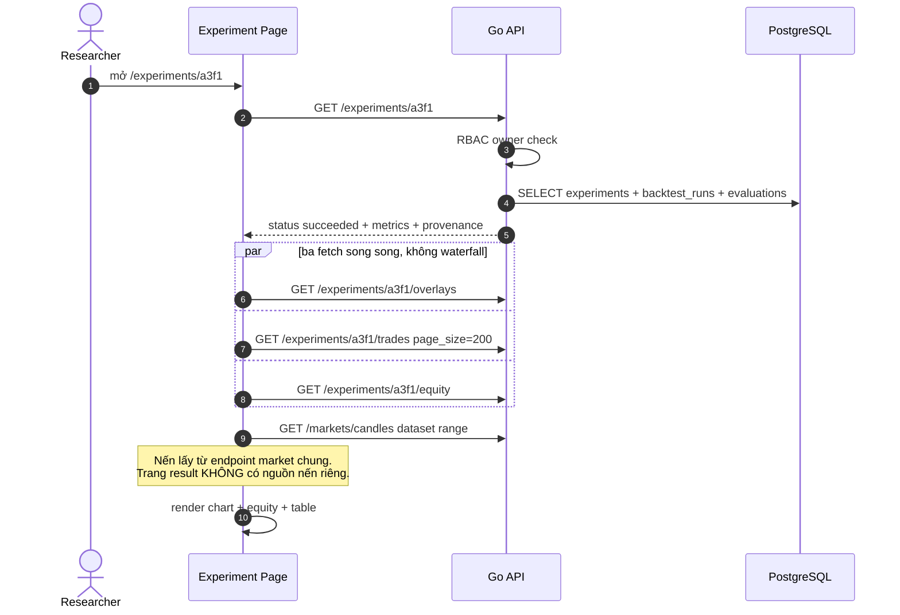
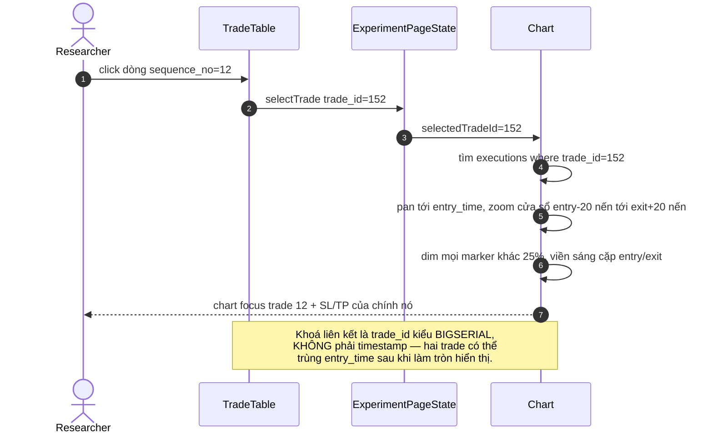

# Đặc tả: Visualization kết quả backtest (marker, trade table, equity curve)

## Mô tả

Đặc tả này mô tả trang `web/app/experiments/[id]/page.tsx` — nơi một backtest run đã hoàn thành được **giải thích**, không chỉ được báo điểm. Câu hỏi mà trang này phải trả lời được mà không cần chạy lại gì: *"Strategy đã vào lệnh ở đâu, ra ở đâu, vì sao ra (signal / stop loss / take profit / hết dataset), lệnh đó lãi lỗ bao nhiêu, và tại nến đó các strategy con nói gì?"* Đề bài §25 yêu cầu người dùng hiểu được strategy đã làm gì; đó là yêu cầu về **dữ liệu được ghi lại**, không phải về giao diện.

Ba bề mặt hiển thị, ba nguồn dữ liệu tách biệt:

| Bề mặt | Endpoint | Bảng nguồn |
| --- | --- | --- |
| Marker trên chart | `GET /api/v1/experiments/{id}/overlays` | `run_signals` + `trades` |
| Trade table | `GET /api/v1/experiments/{id}/trades` | `trades` (fact thô) |
| Equity curve + metric | `GET /api/v1/experiments/{id}/equity` + `/{id}` | `equity_points`, `evaluations` |

Sự tách biệt này phản chiếu đúng ranh giới trong `design.md` §4.2: `BacktestEngine` ghi **fact** (`trades`, `run_signals`, `equity_points`), `Evaluator` ghi **metric dẫn xuất** (`evaluations`). Đổi công thức `sharpe_ratio` không đụng một byte nào trong `trades`, và UI vẫn hiển thị đúng lệnh cũ với metric mới bên cạnh `evaluator_version` đã dùng.

Marker ở đây khác marker của `specs/chart-overlay.md`. Live overlay có `buy_signal`/`sell_signal` — tín hiệu tại nến đóng. Trang này có thêm **execution marker** `entry`, `exit`, `stop_loss`, `take_profit`, và chúng **không suy ra được** từ signal: `entry` nằm ở nến `t+1` do `fill_policy = next_candle_open` (ADR-007), giá đã trừ slippage, và một `BUY` signal khi đã có vị thế mở thì **không** tạo entry nào do `position_policy`. Chỉ backend biết đủ ngữ cảnh đó.

Đặc biệt phải đảm bảo:

- Mỗi `trades` row hiển thị được truy về nến, tín hiệu và snapshot đã sinh ra nó — **0 con số không truy được nguồn**.
- Frontend **không tính** win rate, drawdown, profit factor, PnL. Nó nhận số và format (`18.2%`).
- Marker `signal` và marker `entry` phân biệt được bằng thị giác và lệch nhau đúng 1 nến khi `fill_policy = next_candle_open`.
- Click một trade trong table → chart pan tới và highlight đúng cặp `entry`/`exit` của trade đó, **0 trường hợp lệch trade**.
- Equity curve decimate xuống ≤ 2000 điểm nhưng **giữ nguyên** điểm max drawdown.
- Backtest chưa xong → trang hiển thị trạng thái thật (`queued`/`running`/`failed`), không hiện metric rỗng như thể bằng 0.

## Contract

### `GET /api/v1/experiments/{id}/overlays` (Owner)

```json
{
  "experiment_id": "a3f1...",
  "backtest_run_id": "9c02...",
  "status": "succeeded",
  "provenance": {
    "strategy": "composite@1.0.0",
    "candidate_hash": "sha256:7b41...",
    "dataset_version": "binance-BTCUSDT-5m-20260601-20260801",
    "evaluator_version": "1.0.0",
    "execution": {
      "initial_capital": 10000, "fee_bps": 10, "slippage_bps": 5,
      "fill_policy": "next_candle_open", "position_policy": "long_only",
      "open_position_at_end": "close_at_last_candle"
    }
  },
  "range": { "from": "2026-06-01T00:00:00Z", "to": "2026-08-01T00:00:00Z" },
  "signals": [
    { "t": "2026-06-02T03:35:00Z", "signal": "BUY", "confidence": 0.72,
      "child_signals": { "ma_cross": "BUY", "rsi": "SELL",
                         "support_resistance": "BUY", "score": 0.4 } }
  ],
  "executions": [
    { "trade_id": 141, "sequence_no": 1, "overlay_type": "entry",
      "t": "2026-06-02T03:40:00Z", "price": 117950.25, "quantity": 0.0847,
      "signal_t": "2026-06-02T03:35:00Z" },
    { "trade_id": 141, "sequence_no": 1, "overlay_type": "stop_loss",
      "t": "2026-06-02T03:40:00Z", "price": 115591.24, "line_until": "2026-06-02T09:15:00Z" },
    { "trade_id": 141, "sequence_no": 1, "overlay_type": "take_profit",
      "t": "2026-06-02T03:40:00Z", "price": 122668.26, "line_until": "2026-06-02T09:15:00Z" },
    { "trade_id": 141, "sequence_no": 1, "overlay_type": "exit",
      "t": "2026-06-02T09:15:00Z", "price": 115580.10,
      "exit_reason": "stop_loss", "pnl_percent": -2.05 }
  ],
  "signal_count": 318,
  "trade_count": 47,
  "truncated": false
}
```

> `signal_t` trên marker `entry` là field làm cho ADR-007 **nhìn thấy được**. Signal ở `03:35`, entry ở `03:40` — chênh đúng một nến 5m. Không có field này, user nhìn chart sẽ tưởng hệ thống vẽ lệch và không có cách nào tự kiểm chứng rằng đó là fill policy chứ không phải bug off-by-one.

> `line_until` cho `stop_loss`/`take_profit`: hai mức này là **đường ngang tồn tại trong khoảng thời gian vị thế mở**, không phải một điểm. Vẽ chúng như điểm đơn lẻ làm mất thông tin quan trọng nhất — giá đã đi sát mức nào bao lâu trước khi chạm.

### `GET /api/v1/experiments/{id}/trades` (Owner, ≤ 200/page)

```json
{
  "items": [
    { "id": 141, "sequence_no": 1, "side": "LONG",
      "entry_time": "2026-06-02T03:40:00Z", "entry_price": 117950.25,
      "exit_time":  "2026-06-02T09:15:00Z", "exit_price":  115580.10,
      "quantity": 0.0847, "fee_paid": 19.98, "slippage_cost": 9.99,
      "pnl_absolute": -230.71, "pnl_percent": -2.05, "exit_reason": "stop_loss",
      "signal_t": "2026-06-02T03:35:00Z" }
  ],
  "page": { "cursor": "eyJzZXEiOjIwMH0", "next_cursor": "eyJzZXEiOjQwMH0",
            "page_size": 200, "total": 47 },
  "sort": "sequence_no.asc"
}
```

Phân trang theo **cursor trên `sequence_no`**, không `OFFSET`. `sequence_no` đơn điệu tăng và `UNIQUE (backtest_run_id, sequence_no)` nên cursor ổn định; `OFFSET` trên bảng lớn quét lại từ đầu mỗi page.

### `GET /api/v1/experiments/{id}/equity` (Owner, decimate ≤ 2000)

```json
{
  "initial_capital": 10000,
  "points": [
    { "t": "2026-06-01T00:00:00Z", "equity": 10000.00, "dd": 0.0 },
    { "t": "2026-06-02T09:15:00Z", "equity": 9769.29,  "dd": -2.31 }
  ],
  "decimation": {
    "algorithm": "linear_stride_with_extrema",
    "original_count": 17280, "returned_count": 2000, "stride": 9,
    "preserved": ["first", "last", "global_min_equity", "max_drawdown_point"]
  },
  "max_drawdown": { "t": "2026-07-14T22:00:00Z", "dd": -18.62, "equity": 8137.44 }
}
```

> **Decimate phải giữ điểm extrema.** Downsample tuyến tính thuần (lấy mỗi điểm thứ 9) có thể bỏ đúng cái đáy tạo ra `max_drawdown_pct = -18.62`. Khi đó chart hiện đáy `-11%` trong khi bảng metric ghi `-18.62%`, và người xem sẽ kết luận một trong hai sai. Vì vậy thuật toán là stride tuyến tính **hợp** với việc chèn cưỡng chế các điểm `first`, `last`, `global_min_equity`, `max_drawdown_point`. Chi phí: `returned_count` có thể vượt stride lý tưởng vài điểm. Đáng.

```typescript
// web/lib/types.ts
export type ExitReason = 'signal' | 'stop_loss' | 'take_profit' | 'end_of_sample';
export type ExecutionOverlayType = 'entry' | 'exit' | 'stop_loss' | 'take_profit';

export interface Trade {
  id: number; sequence_no: number; side: 'LONG' | 'SHORT';
  entry_time: string; entry_price: number;
  exit_time: string | null; exit_price: number | null;   // null = còn mở
  quantity: number; fee_paid: number; slippage_cost: number;
  pnl_absolute: number | null; pnl_percent: number | null;
  exit_reason: ExitReason | null; signal_t: string | null;
}
// Không có field nào tên winRate/maxDrawdown ở đây. Metric đến từ /experiments/{id}.
```

### Layout trang kết quả

```
┌─ Experiment a3f1… · composite@1.0.0 · succeeded ────────────────────┐
│ Return +12.4%  WinRate 61.7%  MDD -18.62%  Trades 47  PF 1.42       │
│ evaluator 1.0.0 · dataset binance-BTCUSDT-5m-20260601-20260801       │
│ fee 10bps · slip 5bps · fill next_candle_open · long_only    [prov ▸]│
├──────────────────────────────────────────────────────────────────────┤
│ CHART                                                                │
│  ▲sig                ⬤entry ─ ─ ─TP 122668─ ─ ─                      │
│   │  ▁▂▃▅▇▆▄▃▂▃▅▇█▆▄▃▂▁▂▃▅        ─ ─ ─SL 115591─ ─ ─  ✕exit(SL)     │
│   └ 03:35            03:40                            09:15          │
│  [◀ trade 1/47 ▶]  [zoom: fit | 1d | 1w]  ☑signal ☑entry ☑SL/TP      │
├──────────────────────────────────────────────────────────────────────┤
│ EQUITY (2000/17280 điểm, giữ extrema)                                │
│  10.0k ╭─╮      ╭──╮                                                 │
│   9.0k │ ╰──╮  ╱    ╰─╮        ╭───                                  │
│   8.1k        ╰─╯       ╰──────╯    ▼ MDD -18.62% @ 07-14 22:00      │
├──────────────────────────────────────────────────────────────────────┤
│ TRADES (47)                          [exit_reason ▾] [pnl ▾] [CSV ⤓] │
│ #  side  entry(UTC)      exit(UTC)       pnl%    reason      │        │
│ 1  LONG  06-02 03:40     06-02 09:15    -2.05%  stop_loss    │ ← sel  │
│ 2  LONG  06-03 11:20     06-04 02:05    +3.81%  take_profit  │        │
│ 3  LONG  06-05 08:45     06-05 19:30    +0.42%  signal       │        │
│ …  47 LONG 07-31 20:10   08-01 00:00    -0.88%  end_of_sample│        │
└─ click 1 dòng → chart pan + highlight cặp entry/exit của trade đó ───┘
```

## Luồng chính

### A. Mở trang kết quả



Ba fetch song song là có lý do đo được: tuần tự chúng cộng dồn 3 round-trip và làm trang vượt ngân sách 1.5 s cho lần vẽ đầu. Nến lấy từ `GET /markets/candles` với đúng range của `market_dataset` — nếu trang result có nguồn nến riêng thì sẽ có ngày nào đó nến trên chart backtest khác nến mà backtest đã chạy.

### B. Dựng marker từ `signals` + `executions`

1. Với mỗi `signals[i]`: vẽ `▲` (BUY) hoặc `▼` (SELL) **dưới/trên** nến tại `t`.
2. Với mỗi `executions[i]` `overlay_type=entry`: vẽ `⬤` tại `t` (nến `t+1` so với `signal_t`) ở đúng `price` đã fill.
3. `stop_loss`/`take_profit`: đường ngang nét đứt từ `t` đến `line_until`.
4. `exit`: `✕` với màu theo `exit_reason` — `signal` (xám), `stop_loss` (đỏ), `take_profit` (xanh), `end_of_sample` (vàng).
5. Nối `entry`→`exit` của cùng `trade_id` bằng một đoạn mảnh; đó là thứ làm 47 marker rời rạc đọc được thành 47 lệnh.
6. Signal **không** có execution tương ứng (do đã có vị thế mở, hoặc `position_policy=long_only` chặn `SELL` khi flat) vẽ mờ 40% + tooltip `"không tạo lệnh: đã có vị thế mở"`.

> Điểm số 6 là phần trả lời thẳng cho §25. Không có nó, user thấy 318 signal nhưng chỉ 47 trade và kết luận engine bỏ sót tín hiệu. `position_policy` được ghi trong `experiments` snapshot nên UI giải thích được **không cần chạy lại**.

### C. Click trade → highlight chart



Dùng `trade_id` thay vì timestamp không phải chi tiết vụn: khi `open_position_at_end=close_at_last_candle`, trade cuối và một trade khác có thể chia sẻ `exit_time`; khớp theo thời gian sẽ highlight sai lệnh. Điều hướng bằng `◀ ▶` và phím `j/k` chuyển `sequence_no ± 1`, và `selectedTradeId` được đẩy vào URL (`?trade=12`) để link chia sẻ được — URL là state (`rules/web/patterns.md`).

### D. Equity curve + max drawdown

1. Fetch `/equity`; backend đã decimate với `preserved` extrema.
2. Vẽ đường equity; vẽ vùng drawdown (equity dưới peak) bằng fill nhạt.
3. Đánh dấu `max_drawdown` bằng `▼` + nhãn `-18.62% @ 07-14 22:00`, đọc trực tiếp từ payload.
4. Hover một điểm equity → đồng bộ crosshair với chart nến ở cùng `t` (một trục thời gian chung cho cả hai chart).
5. Nhãn `2000/17280 điểm` hiện tường minh. User cần biết mình đang xem dữ liệu đã lấy mẫu, nhất là khi họ định zoom vào một đoạn.
6. Zoom vào cửa sổ hẹp → refetch `/equity?from&to` để lấy độ phân giải thật của cửa sổ đó, không upscale từ dữ liệu đã decimate.

**Vì sao `-18.62%` không được tính ở frontend**, dù chỉ là một vòng lặp: cùng con số đó nằm trong `evaluations.max_drawdown_pct` và được dùng để xếp hạng Leaderboard. Hai chỗ tính độc lập là hai chỗ có thể lệch — và khi lệch, không có cách nào biết bên nào đúng. Frontend đọc từ `evaluations`; điểm trên chart chỉ là cách chỉ vào nó. Đây cũng là lý do `maxDrawdown` nằm trong `FORBIDDEN_IDENTIFIERS`.

### E. Trạng thái chưa hoàn thành

| `backtest_runs.status` | UI |
| --- | --- |
| `queued` | "Đang chờ worker · vị trí ~N trong queue", spinner, không có chart |
| `running` | Progress `candles_read/candles_total`, ETA từ throughput; chart chưa vẽ |
| `failed` | `error_code` + `error_detail` đã sanitize + nút "Tạo lại experiment" (snapshot bất biến nên tạo lại là clone snapshot) |
| `succeeded` nhưng `trade_count=0` | Trạng thái rỗng tường minh: "Strategy không sinh lệnh nào trên dataset này (318 signal, 0 fill)". **Không** hiện `0%` như một kết quả |

Phân biệt `trade_count = 0` với `NULL` là điều quan trọng nhất trong bảng này. `0 trade` là một **kết quả hợp lệ và có ý nghĩa** (strategy quá bảo thủ, hoặc ngưỡng composite không bao giờ vượt); `NULL` nghĩa là chưa tính. Trộn hai cái vào cùng một ô "0" là cách nhanh nhất để user tin một backtest chưa chạy là một backtest thua lỗ 0%.

### F. Export CSV

1. `GET /experiments/{id}/trades?format=csv` — stream, không load hết vào RAM.
2. Header CSV gồm **cả** provenance ở dòng comment đầu: `# experiment=a3f1 candidate_hash=sha256:7b41 dataset=binance-BTCUSDT-5m-20260601-20260801 fill_policy=next_candle_open fee_bps=10 slippage_bps=5`.
3. Số dùng dấu `.` thập phân, timestamp ISO-8601 UTC, không định dạng theo locale.

> CSV không có provenance là một file vô danh sau hai tuần. Dòng comment đó tốn 1 dòng và giữ cho con số còn nghĩa.

## Kịch bản lỗi

| Tình huống | Phản ứng |
| --- | --- |
| User A mở `/experiments/{id}` của user B | `404` (không `403`) — `403` xác nhận resource tồn tại, đó là information leak. RBAC + ownership check ở Go (`design.md` §7.1) |
| `experiment_id` không tồn tại | `404 experiment_not_found` |
| Backtest đang `running` mà user mở trang | `200` với `status=running` + progress; **không** trả metric rỗng, **không** `404` |
| `run_signals` có, `trades` rỗng | Hợp lệ: chart vẽ signal marker, table hiện empty state kèm số signal. Không coi là lỗi |
| Trade cuối còn mở (`exit_time IS NULL`) | Marker `entry` không có `exit`; table hiện `—` ở cột exit + badge `OPEN`; tooltip ghi `open_position_at_end` đã cấu hình là gì |
| `open_position_at_end=close_at_last_candle` | Trade cuối có `exit_reason='end_of_sample'`, màu vàng, tooltip "đóng cưỡng chế tại nến cuối dataset" — để không ai đọc nó như một quyết định của strategy |
| Số signal > 5000 | `truncated: true` + decimate marker theo mật độ pixel (giữ mọi signal **có** execution, thưa hoá signal không có). Không render 5000 DOM node |
| Số trade > 200 | Cursor pagination; chart chỉ vẽ marker của các trade đã tải + hint "còn N trade ở trang sau" |
| Range dataset > 1000 nến | Chart tải theo cửa sổ (`from`/`to` theo viewport), lazy-load khi pan. `422 range_too_large` nếu client bỏ qua giới hạn |
| `evaluations` chưa có (Evaluator chậm hơn worker) | `status=succeeded` nhưng `metrics=null` → UI hiện "đang tính metric" cho khối metric, chart + table **vẫn render đầy đủ** (chúng đến từ fact, không phụ thuộc Evaluator) |
| Chạy lại Evaluator với `evaluator_version` mới | Hai row `evaluations` cho cùng run. UI có dropdown chọn version, mặc định version mới nhất, và hiện tường minh version đang xem |
| Click trade khi chart đang lazy-load nến của cửa sổ khác | Đợi fetch xong mới pan; nút hiện trạng thái loading. Không pan tới vùng chưa có nến rồi nhảy lại |
| Hai trade cùng `entry_time` sau khi làm tròn hiển thị | Highlight theo `trade_id` → đúng lệnh. Marker vẽ lệch nhẹ theo trục y để không đè nhau |
| `equity_points` chỉ có 1 điểm (không trade) | Vẽ đường phẳng tại `initial_capital`, `max_drawdown = {dd: 0}`; không chia cho 0 |
| Decimate bỏ mất điểm MDD (bug) | AC-09 chặn: assert `max_drawdown.t ∈ points[].t`. Đây là lỗi im lặng cần test tự động vì mắt không phát hiện |
| Backtest `failed` với `error_detail` chứa chuỗi từ DB | Go sanitize: chỉ trả `error_code` + message đã map. Không tên bảng, không SQL, không stack trace |
| Xoá `backtest_runs` row (dev ops) | `ON DELETE CASCADE` xoá `trades`/`run_signals`/`equity_points`; `evaluations` cũng cascade. Trang trả `404`; `leaderboard_entries` trỏ `evaluation_id` nên phải chặn xoá run đã lên Leaderboard (ADR-012) |

## Ràng buộc

**Tính đúng đắn**

- `trades` là **immutable fact**. UI chỉ đọc. Không có endpoint nào sửa một trade.
- Mọi metric hiển thị đến từ `evaluations`, kèm `evaluator_version` hiện trên màn hình. Không có metric nào tính ở client.
- Marker `entry` dùng `trades.entry_price` (đã gồm slippage), **không** dùng `candles.open` — hai giá này khác nhau đúng bằng `slippage_bps` và hiển thị giá lý tưởng sẽ che mất chi phí thực thi.
- `entry_time` phải là nến **sau** `signal_t` khi `fill_policy=next_candle_open`. Vi phạm = look-ahead bias, và `tests/domain/test_no_lookahead.py` là lớp chặn ở backend.
- `child_signals` render nguyên văn theo thứ tự khai báo trong snapshot, kèm `score` và `threshold` → user tự cộng lại được `1×0.2 + (−1)×0.3 + 1×0.5 = 0.4 > 0.3 → BUY`.

**Hiệu năng**

- Trang result với 47 trade + 17.280 equity point: first contentful paint p95 **< 1.5 s**, interactive **< 2.5 s**.
- `/trades` 200 row: p95 **< 250 ms**. `/equity` sau decimate: p95 **< 350 ms**. `/overlays` 5000 signal: p95 **< 600 ms**.
- Payload: `/equity` ≤ **120 KB** (2000 điểm), `/trades` 1 page ≤ **80 KB**, `/overlays` ≤ **500 KB** sau decimate marker.
- Click trade → chart highlight **< 100 ms** khi nến đã ở client (thao tác thuần client, không round-trip).
- Table 200 row render không virtualization; > 200 row dùng cursor page thay vì kéo dài DOM.

**Bảo mật**

- Cả 3 endpoint là **Owner** (hoặc OPERATOR/ADMIN). Kiểm ở Go trước khi gọi Lab.
- Không tồn tại resource cho người không sở hữu: trả `404`, không `403`.
- CSV export cũng qua ownership check; tên file `experiment-{id}-trades.csv`, `Content-Disposition: attachment` + `X-Content-Type-Options: nosniff`.
- `error_detail` đã sanitize ở Go. Không leak schema, không leak đường dẫn file.
- `child_signals` là JSONB do backend sinh; render như **text**, không `dangerouslySetInnerHTML`.

**Khả năng mở rộng**

- Thêm metric mới vào `evaluations` = thêm 1 cột + 1 ô trong khối metric. Không đụng `trades`, không migration dữ liệu cũ.
- Thêm `exit_reason` mới (ví dụ `trailing_stop`) = thêm 1 giá trị vào map màu/nhãn. `VARCHAR(32)` nên không cần migration enum.
- Thêm `position_policy` mới (`long_short`) làm xuất hiện `side='SHORT'`: table và marker đã có `side` nên chỉ cần đổi hướng ký hiệu.
- Trang này dùng lại `ChartPanel`/`OverlaySeries` của `specs/chart-overlay.md` với nguồn dữ liệu tĩnh thay vì WS — cùng renderer, khác nguồn.

**UX**

- Bốn `exit_reason` có bốn màu + bốn nhãn chữ. Chỉ dùng màu là không đủ (accessibility: không dựa vào màu làm kênh thông tin duy nhất).
- Provenance luôn thấy được, không nằm sau accordion đóng: `candidate_hash` (8 ký tự đầu), `dataset_version`, `evaluator_version`, và toàn bộ `execution` assumptions.
- Số âm hiển thị dấu tường minh (`-2.05%`), không chỉ dựa vào màu đỏ.
- Timestamp hiển thị UTC kèm nhãn `UTC`, để so được với `candles.close_time`. Đổi sang local time là tuỳ chọn, không phải mặc định.
- Bàn phím: `j/k` chuyển trade, `Enter` focus chart, `Esc` bỏ chọn. Table là `<table>` thật với `<th scope="col">`.

## Tiêu chí chấp nhận

- [ ] AC-01: Backtest có 47 trade → table hiện đúng 47 dòng, `sequence_no` liên tục 1..47, tổng `pnl_absolute` khớp `equity[last] − initial_capital` sai số < `1e-6`.
- [ ] AC-02: Với mọi trade có `signal_t`, `entry_time − signal_t` = đúng 1 interval của timeframe (`fill_policy=next_candle_open`) → assert trên toàn bộ 47 trade, **0 vi phạm**.
- [ ] AC-03: Click trade `sequence_no=12` → chart pan tới `entry_time` của trade 12, marker cặp `entry`/`exit` của **đúng** `trade_id=152` được highlight, các marker khác dim. Lặp cho 10 trade ngẫu nhiên → 10/10 đúng.
- [ ] AC-04: `grep -rE "winRate|maxDrawdown|sharpeRatio|profitFactor|backtest" web/app/experiments` → **0 match**; `no-domain-logic.test.ts` pass.
- [ ] AC-05: Dataset 17.280 nến → `/equity` trả ≤ 2000 điểm, `decimation.original_count=17280`, và `max_drawdown.t` **có mặt** trong `points[].t`.
- [ ] AC-06: So `max_drawdown.dd` từ `/equity` với `evaluations.max_drawdown_pct` → **bằng nhau tuyệt đối** (cùng nguồn, không tính lại).
- [ ] AC-07: Mở experiment của user khác → `404`, không `403`, response body **không** chứa `owner_id` hay bất kỳ field nào của experiment đó.
- [ ] AC-08: Mở trang khi `status=running` → hiện progress, chart không render, **0** exception trong console; poll (hoặc WS) tự chuyển sang view kết quả khi `succeeded` mà không cần reload.
- [ ] AC-09: Test tự động cho decimate: sinh equity curve có đáy nhọn 1 điểm ở giữa, decimate 100.000 → 2000 → điểm đáy vẫn còn, `dd` không đổi.
- [ ] AC-10: Backtest 318 signal / 47 trade → chart hiện 318 signal marker (mờ cho 271 cái không tạo lệnh) + 47 cặp execution; hover một signal mờ hiện lý do "đã có vị thế mở".
- [ ] AC-11: `child_signals` của một nến BUY hiện đủ `ma_cross=BUY, rsi=SELL, support_resistance=BUY, score=0.4` + `threshold=0.3` → user cộng tay ra đúng `0.4`.
- [ ] AC-12: Chạy Evaluator v1.1.0 trên cùng run → dropdown có 2 version, đổi version chỉ đổi khối metric, `trades` và chart **không đổi một pixel** (chứng minh tách fact/metric).
- [ ] AC-13: Backtest `trade_count=0` → empty state ghi rõ "0 lệnh trên N signal", **không** hiện `Return 0%` như một kết quả đo được.
- [ ] AC-14: Export CSV 47 trade → dòng đầu là comment provenance chứa `candidate_hash` + `dataset_version` + `fill_policy` + `fee_bps`; parse lại bằng `pandas.read_csv(comment='#')` ra đúng 47 row.
- [ ] AC-15: Lighthouse trên trang result: accessibility ≥ **90**; kiểm keyboard-only đi hết được table → chart → equity không cần chuột.
