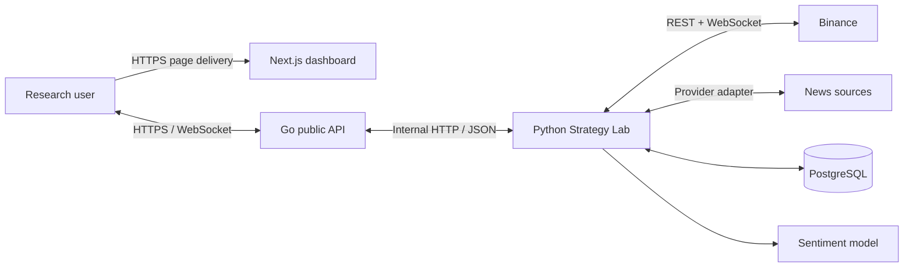
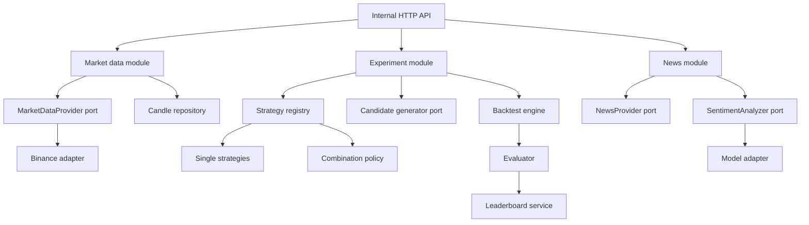

# 02 -- Target architecture

## Architecture in one paragraph

Keep the existing **Next.js web app + Go public API + Python domain service**. Treat Python as a modular monolith for the strategy lab: the modules communicate through in-process ports/events first, while the public boundary stays in Go. PostgreSQL persists experiment facts. A queue and separate workers are a scale-out deployment of the same job contract, not an MVP prerequisite.

## System context



**Trust boundary:** browsers reach only the web/API edge. Binance, news sources, the model service, and the database are private dependencies. The frontend never reads a Binance payload directly. [PDF pp. 5--6]

## Containers and responsibilities

| Container | Responsibility | Must not own |
|---|---|---|
| Next.js web | Dashboard state, four chart panels, forms, live rendering, accessible feedback | Trading rules, backtesting, ranking math, Binance payload parsing |
| Go API | Stable public REST/WebSocket boundary, OIDC session validation for state-changing operations, owner/role checks, quotas, request IDs, rate limits, error mapping | Strategy algorithms or persistence business logic |
| Python Strategy Lab | Market normalization, indicators, strategy registry, combinations, experiments, backtests, evaluation, ranking, news/sentiment orchestration | HTTP/browser presentation concerns |
| PostgreSQL | Durable immutable experiment/result records and cached market/news data | Strategy decision logic |
| External providers | Source-specific market/news data | Internal domain shapes |

## Python module decomposition



### Module rules

1. **Strategies are pure domain code.** They consume `AnalysisContext` and return a `Signal`; no HTTP, SQL, WebSocket, provider SDK, or UI import.
2. **Adapters translate, not decide.** Binance, RSS/API/crawler, and ML adapters convert external payloads to ports. News adapters collect only configured allowlisted sources and validate fetched content; they do not embed strategy rules.
3. **Application services coordinate.** `ExperimentService` creates snapshots and schedules work; it does not calculate RSI itself.
4. **Repositories persist facts.** They do not contain market-provider requests or scoring policy.
5. **Event consumers may be separated later.** The event names and payload schemas remain stable when an in-process dispatcher becomes a queue/broker.

## Extension seams

| Change | Add/replace | Unchanged |
|---|---|---|
| New strategy | `Strategy` implementation + registry metadata | Backtester, chart contract, evaluator, storage |
| New composite policy | `SignalCombiner` | Single strategies and backtester |
| New search algorithm | `CandidateGenerator` | Candidate consumer, evaluator, leaderboard |
| New exchange | `MarketDataProvider` adapter | REST/WebSocket contract, normalized candles, UI |
| New news source | `NewsProvider` adapter | News pipeline, sentiment contract |
| New sentiment model | `SentimentAnalyzer` adapter/version | News ingestion and strategy contract |
| More backtest capacity | queue-backed `JobDispatcher` and worker deployment | Experiment snapshot, job/result events, APIs |

## Recommended dependency direction

```text
web -> Go public API -> Python application modules -> domain ports
                                              -> infrastructure adapters
                                              -> persistence
```

Domain contracts point inward. Infrastructure implements them. This prevents the anti-patterns called out in the brief: God Service, hard-coded strategy combinations, frontend business logic, strategy-to-database coupling, and crawler-to-model coupling. [PDF pp. 47--48]

## Current-to-target migration

| Current scaffold | Target evolution |
|---|---|
| `POST /api/v1/ai/predict` | Keep for standalone text sentiment; make the response model-versioned. |
| Go forwards requests to FastAPI | Go becomes the validated public facade; FastAPI exposes private domain commands/queries. |
| `predictor.py` stub | Implement a `SentimentAnalyzer` adapter behind the existing inference boundary. |
| One React form | Add independent chart, strategy, experiment/search, leaderboard, trade, and news surfaces. |
| Docker services: web/api/ai | Add PostgreSQL; add worker only when long-running backtests make synchronous execution unsuitable. |
