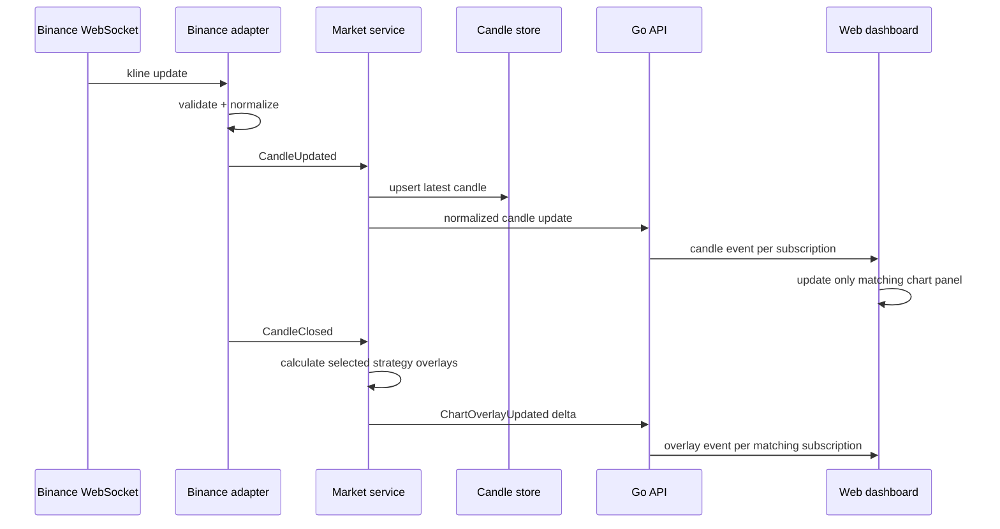
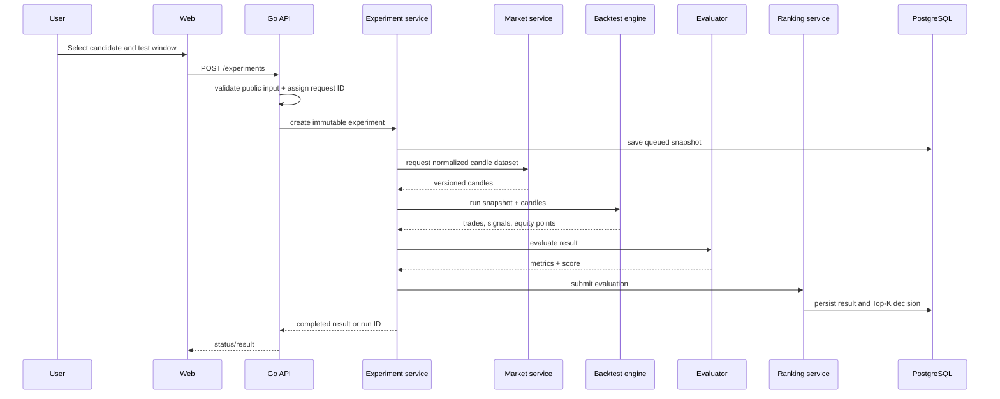
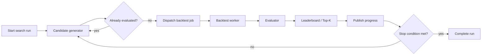
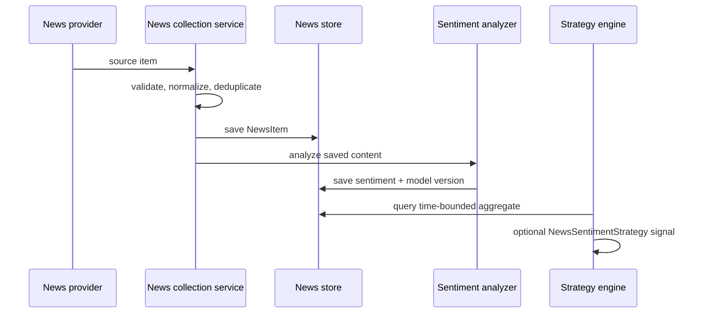

# 04 -- Runtime flows

> ⚠️ **ARCHIVED — superseded by [`blueprint/`](../blueprint/README.md).** Bản nháp đầu, chưa xác thực. Không sửa, không dùng làm nguồn. Xem [`plans/README.md`](README.md) để biết quyết định nào đã thay đổi.

## Realtime market-data flow

### Rules

- The adapter reconnects with capped exponential backoff and records the last closed-candle time.
- After reconnect, it backfills the missing interval through the historical endpoint and de-duplicates by `(provider, symbol, timeframe, close_time)`.
- A chart first queries bounded candles plus server-calculated technical/signal `chart-overlays`, then subscribes to exactly its selected `(symbol, timeframe, strategy/version, config_hash)` delta stream; switching Chart 1 does not refetch or rerender Chart 2--4. Entry/exit/stop-loss/take-profit markers are rendered only after the user selects an immutable experiment result.
- Persist closed candles as the historical source of truth. An in-progress candle is labelled provisional.
- If Binance is unavailable, show stale status and last-update time. The dashboard may still render stored history and prior experiments.

Sources: [PDF pp. 4--7, 33].

## Manual experiment/backtest flow

### Backtest correctness rules

1. Read each candle in chronological order; a signal calculated on candle *t* is filled no earlier than the configured next executable point, e.g. open of *t+1*.
2. Apply fee and slippage on each fill, record the exact fill policy, and never use future data when calculating indicators.
3. Define what happens to an open position at the end of the sample and record it.
4. Keep raw trade facts separate from derived metrics. Re-running evaluation with a new score policy must not mutate trades.
5. Bound date range/candle count at the API. The chosen limit is a performance and availability control, not merely a UI validation.

Sources: [PDF pp. 20--22, 39--41].

## Search-loop flow

A search run declares one or more hard stop conditions before it starts:

- maximum candidate count;
- maximum wall-clock duration;
- maximum consecutive non-improving candidates;
- user pause, resume, or cancel;
- budget/error-rate safety limit.

Never use an unbounded `while true`. The UI displays total generated, queued/running/completed/failed, best score, current candidate, elapsed time, and configured stop condition. `POST /api/v1/search-runs/{id}/actions` accepts idempotent `pause`, `resume`, and `cancel`: `queued|running -> paused`, `paused -> queued`, and any non-terminal state -> `cancelled`; terminal states reject control commands. [PDF pp. 23--25]

### Search algorithm isolation

`CandidateGenerator` produces immutable `CandidateStrategy` values. The downstream pipeline only consumes candidates, so Random Search can be replaced by Domain-Guided or Genetic Search without altering the backtest, evaluator, ranking, or chart overlays. Domain-Guided Search may require one strategy from each family (trend, momentum, structure) but must record the applied selection rules. [PDF pp. 17--19, 45--46]

## News and sentiment flow

The collector only collects. The model only classifies. A sentiment strategy reads the persisted, time-bounded aggregate through the same strategy context as technical strategies. News failures do not break candle streaming, chart rendering, or technical-only experiments. [PDF pp. 27--31, 48]

## Failure matrix

| Failure | System response | Recovery / visibility |
|---|---|---|
| Binance WebSocket disconnect | Mark stream stale; retain historical UI | reconnect + missing-candle backfill; alert after retry budget |
| Binance REST failure | Fail affected historical request with safe `502` | retry only idempotent read with deadline; show source status |
| Invalid strategy parameters | Reject before experiment creation | `422`, field-level safe error |
| Backtest worker/process failure | Mark run failed; preserve snapshot | retry job only if no result committed; expose failed count |
| Duplicate completion event | Ignore duplicate using event/job ID | idempotency audit log |
| News provider failure | Fail/defer collection job only | charts and technical strategy paths remain available |
| Sentiment model failure | Preserve news without sentiment | label sentiment unavailable; no fake neutral result |
| Database unavailable | Reject new work safely | readiness fails; no partial result represented as complete |
