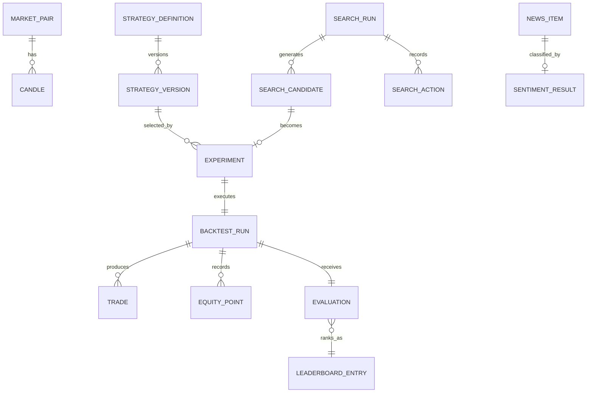
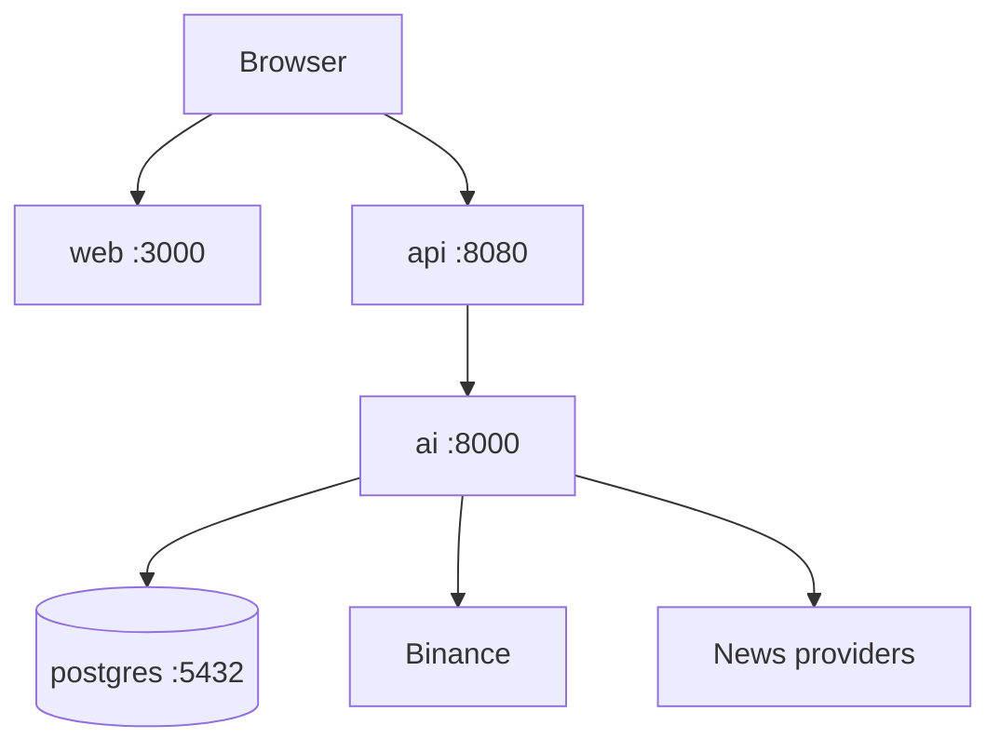

# 05 -- Data and operational design

> ⚠️ **ARCHIVED — superseded by [`blueprint/`](../blueprint/README.md).** Bản nháp đầu, chưa xác thực. Không sửa, không dùng làm nguồn. Xem [`plans/README.md`](README.md) để biết quyết định nào đã thay đổi.

## Persistence model

PostgreSQL is the only required stateful component for the target architecture. Start with normalized records for important query paths and JSON snapshots only where the schema is intentionally extensible.

| Entity | Key fields / invariant |
|---|---|
| `market_pairs` | canonical symbol, base, quote, status |
| `candles` | provider, symbol, timeframe, close timestamp, OHLCV; unique composite key prevents backfill duplicates |
| `strategy_definitions` | stable strategy ID, family, display metadata, parameter schema |
| `strategy_versions` | immutable algorithm/version/parameter-default snapshot; never overwrite after use |
| `search_runs` | owner subject, generator version/configuration, search space snapshot, stop conditions, lifecycle state, progress counters, idempotency key, and optimistic-lock version |
| `search_candidates` | immutable candidate definition, search-run sequence, deduplication hash, dispatch/run state, linked experiment, and failure reason; unique `(search_run_id, candidate_hash)` |
| `search_actions` | command ID, action, requested/observed state, actor/context, timestamp; command ID is unique for idempotency audit |
| `experiments` | candidate snapshot, market dataset/version, execution assumptions, evaluator version, lifecycle state |
| `backtest_runs` | execution timestamps, idempotency/job key, error code, output summary; one authoritative run outcome |
| `trades` | entry/exit times and prices, side, quantity, fee, realised/unrealised P/L |
| `equity_points` | run ID, time, equity; bounded/decimated for API display |
| `evaluations` | return, win rate, maximum drawdown, number of trades, optional Sharpe/profit factor, score policy version |
| `leaderboard_entries` | evaluation ID, rank/score snapshot, eligibility policy, observed timestamp |
| `news_items` | normalized source URL/hash, title/content, published/crawled time, related coins |
| `sentiment_results` | news ID, `POSITIVE`/`NEUTRAL`/`NEGATIVE` label, score in `[0,1]`, model and model version, analyzed timestamp |

## Reproducibility and retention

- Preserve candle provenance: provider, fetch timestamp, and dataset/version identity. Do not silently recompute a past experiment from a changed live source.
- Treat all experiment, strategy-version, execution-assumption, evaluator-policy, and model-version records as append-only.
- A leaderboard entry references an evaluation; it is not a copy of mutable "current strategy" attributes.
- Store raw user-entered text only when there is a documented research need. Otherwise retain a content hash and the model output metadata.
- Paginate trades/news and cap points returned for a chart. The full analysis may remain durable but the UI API is bounded.

## Local deployment

Extend the existing Docker Compose setup with PostgreSQL. The AI service is not published directly in a production topology; the host port during local development is for diagnostics only. Run migrations before readiness reports healthy. A future `worker` uses the same AI image/implementation and receives jobs through the selected dispatcher.

## Scale path

| Load stage | Deployment choice | Why |
|---|---|---|
| Demo / bounded manual backtests | Execute in Python process with strict range limits | Least moving parts; easy to observe. |
| Long search run / multiple users | Persist jobs and run a worker container | Prevents HTTP timeouts and isolates CPU-bound work. |
| Many concurrent jobs | Queue + N stateless worker replicas | Parallelizes backtests while preserving a stable job contract. |
| Provider rate pressure | Cache only normalized historical read results | Reduces external calls without duplicating strategy state. |
| Multiple exchanges/news sources | Add adapters | Contains source-specific complexity. |

Do not add Redis, Kafka/RabbitMQ, or a microservice per module before a concrete stage above demands it. [PDF pp. 42--43, 46--47]

## Reliability controls

- Give every external call a timeout, cancellation context, retry policy, and request/correlation ID.
- Retries are for idempotent market/news reads and uncommitted jobs only. Never blindly repeat a completed rank write.
- Use database uniqueness and idempotency keys for candle ingest, job dispatch, and leaderboard updates.
- Use readiness checks that include migrations and required dependencies; liveness checks only prove a process can answer.
- Make the public API return `202 Accepted` for queued work and a `run_id`; a completed output has a terminal immutable state: `completed`, `failed`, or `cancelled`.

## Security boundary

| Boundary | Required control |
|---|---|
| Browser -> Go API | CORS allow-list, request-size/range validation, rate limits, request IDs, secure headers, safe error mapping; OIDC Authorization Code + PKCE session validation, owner checks, and per-principal quota for model/experiment/search operations. Browser sessions use Secure/HttpOnly/SameSite cookies plus synchronizer CSRF token and strict Origin validation on every state-changing request. |
| Go API -> Python | Internal-only network route, schema validation again, propagated deadline/correlation ID and authenticated principal context |
| Python -> providers | Environment-held credentials only if required, egress timeout, response validation, provider rate policy; news fetches use configured HTTPS allowlists, redirect/DNS private-range checks, response-size/content-type limits, and isolated parsing |
| Worker -> PostgreSQL | Least-privilege service credentials, parameterized queries, migrations, backups |
| User content/news | Treat as untrusted; never render raw HTML; document retention |

The MVP never stores exchange trading secrets because it does not execute trades. Anonymous access is limited to rate-bounded public market/news reads; a deployed demo requires an OIDC-authenticated principal for sentiment prediction, all experiment/search creation, result access, and state-changing controls. A loopback-only local development profile may bypass OIDC and CSRF only when it is bound to loopback, and it must not be exposed outside development.

## Observability model

Structured logs, metrics, and UI progress all carry `request_id` or `run_id`.

| Signal | Minimum dimensions |
|---|---|
| HTTP requests | route, status, latency, request ID |
| Provider operations | provider, operation, retries, latency, success/failure |
| Realtime feed | symbol/timeframe, reconnect count, last closed-candle time, stale state |
| Backtests | strategy ID/version, candle count, status, duration, error code |
| Search run | generator version, candidates generated/tested/failed, best score, stop reason |
| News/sentiment | provider/model version, items collected/classified/failed |

These metrics directly answer the observability questions in the brief: whether a loop runs, how many strategies were tried, how long backtests take, how many jobs fail, and the current Top-1. [PDF pp. 34--36]
